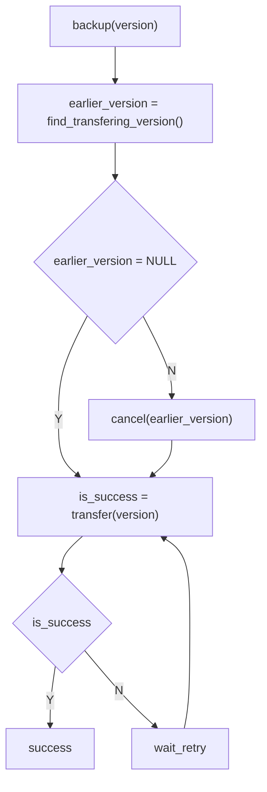
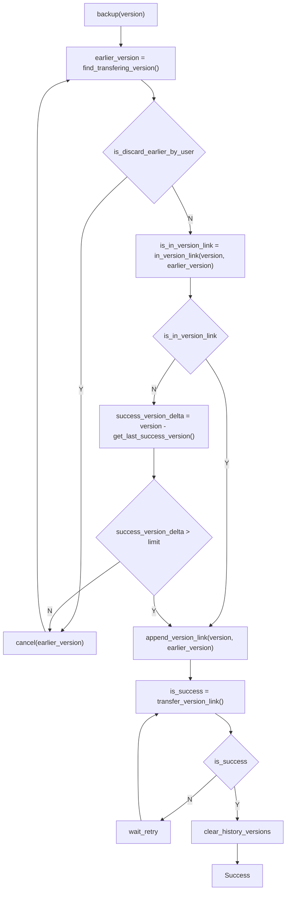

# 生成备份数据

## 生成时机

1. 定时
2. 手动
3. 其他: 增量？

## 生成原则

1. 事务性
2. 高性能

## 生成方法

不同类型用不同的方法：

1. 配置信息(etcd)

    数据量小，直接用`etcd-client`导出

2. 文件系统

    选用支持快照功能的文件系统？

    `DCFS`要支持`copy-on-write`特性？

# 备份数据管理

## 块管理

    1. 传输/存储/校验的最小粒度
    2. 加密存储
        * 客户端加密：用户应该妥善保存密钥
        * 服务端加密：用户需要对服务商有信任
    3. 按`HASH`去重？

## 文件管理

    1. 一个文件可以分成若干个块，这些块可以存放在不同的设备上

## 备份版本线管理

    1. 一次备份作为一个版本，通常叫`check-point`？
    2. 一个版本可能会有多个文件或者一个目录，恢复的时候应该把所有文件的目录结构恢复
    3. 增量版本会依赖之前的某个版本，形成一般版本链，版本被依赖时不能删除

# 备份任务管理

    1. 配置备份(etcd)

        * 数据量小，优先级高，全量备份
        * 定时，手动
        * 按时间和保留版本数量清理历史版本

    2. 文件系统备份

        * 数据量大，一般优先级
        * 定时：
            * 增量
        * 手动：
            * 增量，全量
        * 只保留最新版本和其依赖版本？
        * 备份发起时

    3. 手动备份优先级高于定时备份
