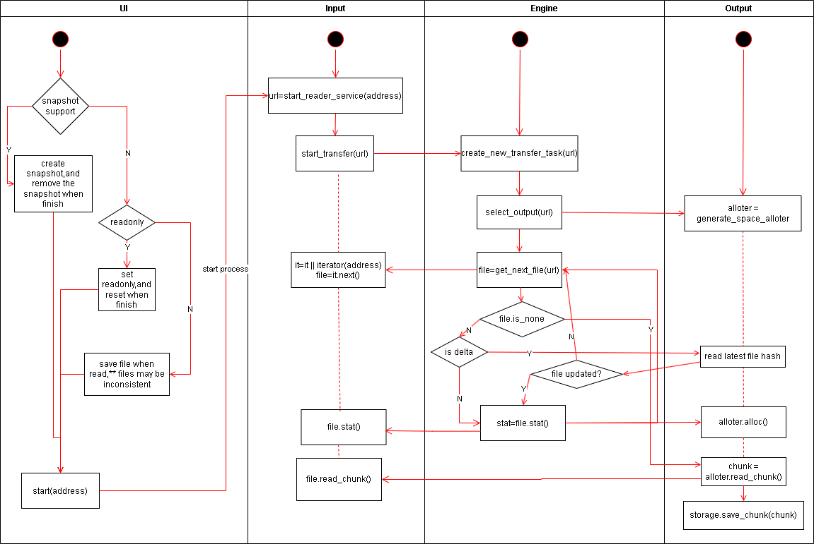

## Goal

1. Implement backup for binary files (directories).
2. Support various backup source data forms (local files, different cloud storage providers, DMC, etc.).
3. Support various backup storage media (local files/external hard drives, different cloud storage providers, DMC, etc.).
4. Be compatible with large storage systems for basic storage units (DMC).
    - Friendly support for packaging small files and splitting large files.
5. Ensure that each storage unit's data is complete; reading data from one unit should not depend on other storage units. Damage to one storage unit should not affect the others.
    - Each storage block should retain its internal data metadata.
6. The interface layer should be compatible with traditional file-based access methods.
7. Local storage of some metadata is allowed for acceleration, but in extreme cases, data should be fully recoverable using only account information without relying on local data.
8. Should be able to run independently on multiple platforms (NAS, PC, etc.).

## Basic Architecture

\*\* Modules communicate with each other using HTTP protocol calls to decouple dependencies between extension modules, thereby enhancing scalability and stability.
