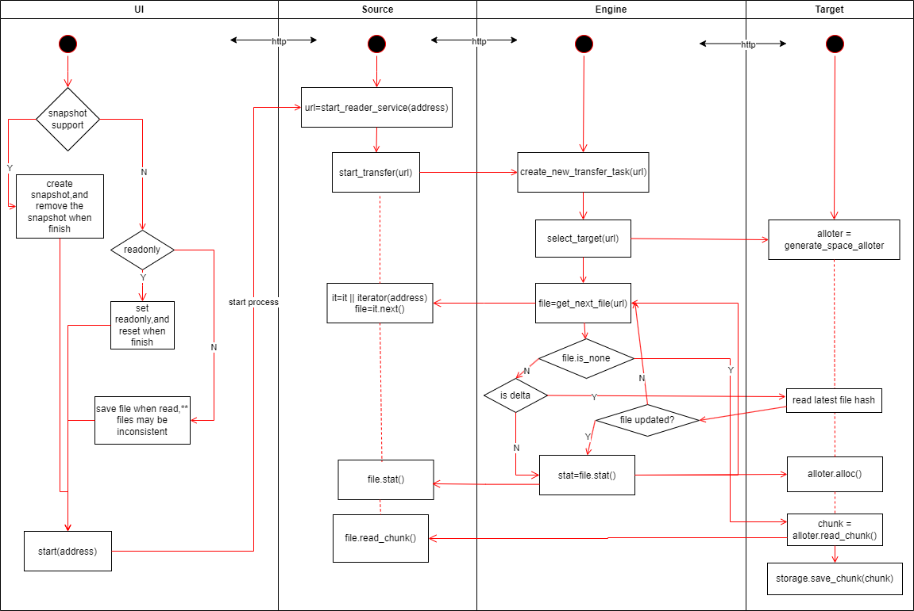

# 目标

1. 实现二进制文件（目录）的备份
2. 支持扩展多种备份源数据形式(本地文件，不同云存储厂商，DMC 等)
3. 支持扩展多种备份存储介质（本地文件/移动硬盘等，不同云存储厂商，DMC...）
4. 兼容基本存储单元超大的存储系统(DMC)
    - 友好支持打包小文件和分割大文件
5. 每个存储单元存储的数据应该是完备的，读取本单元数据不依赖其他存储单元，损坏一个存储单元数据不影响其他存储单元。
    - 各存储块自己保留内部数据的元信息
6. 接口层兼容传统以文件为单位的存取方式
7. 本地可存储部分元数据用于加速，但极端情况下可脱离本地数据仅通过账号信息完整地恢复数据。
8. 可独立运行于多个平台(NAS, PC 等)

# 基本架构

\*\* 各模块之间用 http 协议相互调用，以解除各扩展模块之间的依赖，提高扩展性和稳定性
