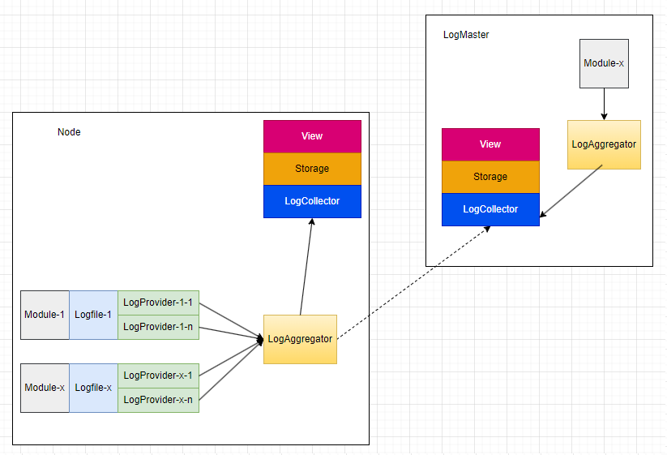
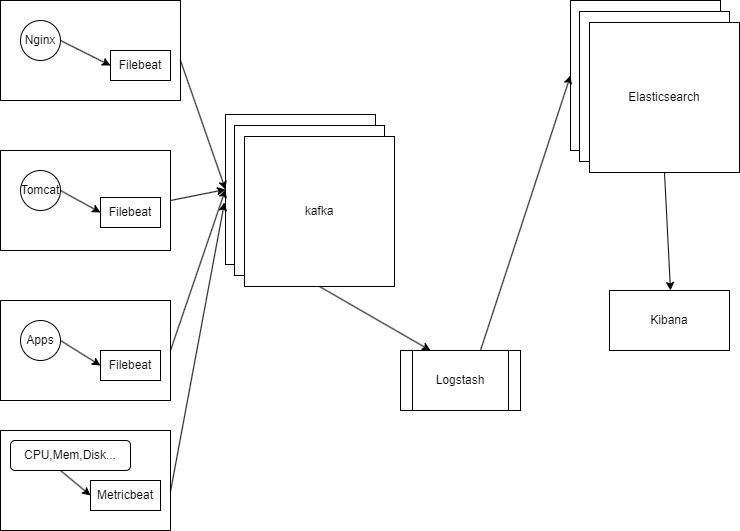

# kLog

维护一个分布式集群中各个节点产生的日志，日志内容包含：

1.  监测到的当前系统状态

    -   用户通过阅读日志能够了解当时的系统状态，辅助用户发现异常并修复
    -   系统修复系统能够及时发现故障或者风险，并做适当的资源调度，尽力维持系统的正常运行，减少用户的运维成本

2.  系统/APP 运行过程中发生的事件描述

    -   以流水账形式清晰准确地记录系统/APP 在运行过程中发生了哪些事件，帮助用户跟踪系统的运行过程，辅助开发者调试诊断故障是一个经典场景

# 应该达成的目标

1. 易用性

    - 用户能在集群中一个节点上查看到整个集群所有节点的日志记录，而不需要到每个节点上搜索并汇总日志信息
    - 提供灵活通用的检索方式供用户阅读日志
    - 提供灵活的检索接口，支持不同需求场景的定制化检索需求，如：辅助系统资源调度，辅助用户恢复系统故障等
    - 分类独立管理，依据配置独立管理各应用日志（按大小、时间或者节点等清理）

2. 健壮性

    - 只要节点本地有存储空间，并且硬件能正常读写，就应该能把日志信息写入，并能够查看。这里作为系统故障状态下阅读日志的最低保障。
    - 日志记录的状态或事件严格按照时间顺序：
        - 对同一个节点来说，后面的事件发生时，记录在前面的事件必须已经发生过；如果日志内容足够详细，应该能通过日志把系统从初始状态恢复到当前状态；
        - **不同节点上发生的事件，只能依靠时间戳排列日志顺序，难以绝对鉴定谁先谁后，分析日志时应该考虑到这个风险；对于依赖节点间高度同步的需求，应该有另外的一致性设计。**
    - 主节点故障时，应该有备节点接替其工作收集日志，并且已经收集到的日志不丢失。
    - 备节点故障时，系统能继续正常工作，但应该自动或者手动尽快恢复故障，否则，故障率过高可能无法恢复。

3. 连通性

    - 个人设备组成的集群中各个节点可能处于各种不同的网络环境中，应该能支持不同的通信协议保证节点间的连通

# 结构设计



Logfile: 原始日志文件存放于本地

LogSender: 遍历日志文件，发现新的日志，并发送给 LogCollector

LogCollector: 收集来自不同节点的日志，并按规则过滤掉非法日志

    * LogSender和LogCollector应该能切换不同的传输协议，以适应不同的网络环境

Storage: 存储日志，提供日志检索接口

View； 检索/展示日志

# 解决方案

经过调研，`Elasticsearch`比较符合我们的需求，并且`Elastic`提供了完整的日志收集和检索方案：

目前了解到`ELK`搭建起来应该是下图的样子：



-   `Filebeat`: 相当于上面的`LogSender`，用来读取日志文件并发送出去；
    它有几条重要的配置项：

    -   input: 要读取的日志文件集合，支持正则表达式；
    -   output: 读取到的日志应该发送给谁；

    其工作方式如下：

    1. 它按照配置规则定时扫描日志文件，发现新的日志文件和新增日志条目，并发送给`output`.

        **\* 它以文件`inode`作为新日志判定规则，使用某些文本编辑器手动在日志文件中添加内容后，保存时是通过“删除并新建同名文件”的方式实现，所以会发生全部重新上传的情况。**

    2. 它会在出现故障时根据配置进行重试.
    3. 它记录传输位置，并会在停电等机器重启时从上次中断的位置继续传输。

-   `kafka`：可选，用来缓存日志，用于解决；高并发环境下的拥堵问题；

    可能在产品开发过程中大量输出诊断日志时才有用，在终端产品上可能并不需要？

-   `Logstash`: 可选，用来对日志逐条加工（增删字段等）和过滤；

    我们可能并不太需要很复杂的日志加工，所以这个组件可能并不需要；

-   `Elasticsearch`: 用来存储日志，并提供了检索完备的检索接口(`EQL`: 有点类似`MongoDB`的查询语法)；

    -   它是基于`Lucene`实现的分布式全文档实时搜索引擎
    -   它能够把索引分成多片分别存储到不同的节点上，并对分片保存副本以提高容错率
    -   它使用`Raft`算法保持各节点状态的一致性
    -   它对每行日志生成唯一 ID，我们可以通过 HASH(node, file-path, line-number, text)生成 ID，也可以直接用(node, file-path, line-number)简单拼接生成 ID，以减少 HASH 计算带来的性能消耗。这样我们可以对`Filebeat`在通信故障时重试带来的可能重复日志进行去重。
        **\*很多日志库都会在切换日志文件的时候修改文件名，虽然我们可以定义规范建议选用不修改文件名的日志库，但无法完全避免，所以这里`file-path`只截取前面部分确定的内容（大概定义了`app`和`process`），以此来适应大部分日志库切换日志文件加后缀的问题。但如果一个`APP`的同一运行实例输出的两个日志文件相同行出现了相同内容会漏掉这行日志，但这种概率是极低的，如果每行日志加上发生的时间戳，将能有效地解决此问题**
    -   为独立控制各模块日志配额，每个模块的日志单独建库存储，并配置相应的清理策略。

-   `Kibana`: 用来展示日志，比较复杂，可以通过`EQL`接口查询信息，提供精简的面向终端用户的操作面板；

# 日志规范

## 基本约束

    1. 为日志收集组件方便地识别新增日志，所有写入的日志都不准许修改(包括修改日志文件名和修改某条日志内容)，改名后可能会被当做新增日志收集。
    2. 以二进制编码的数字型字段，统一用`Big-ending`存储

## 存储文件规范

    * 所有日志文件集中存放于一个目录下: `${buckyos}/logs/`
    * 系统状态日志文件每天生成一个新的日志文件，命名规则: `.system.${date}.log`
    * ${date}采用UTC时间，防止节点时区变更出现混乱

    ```
    .system.20240325.log
    ...
    ```

    * 开发调试日志文件命名规则: `.debug.${app-name}.${app-id}.${process-id}.${...}.log`

    ```
    .debug.my-app.abcdefg1234567890.20240328.1.log
    .debug.my-app.abcdefg1234567890.20240328.2.log
    ...
    ```

    * 状态文件: `.state`
        存储一些允许过程中会更新的状态信息，比如：日志编号
    * 配置文件：`*.cfg`
        存储一些由开发者配置的固定信息

## 日志格式规范

    1. 系统日志规范

    以`JSON`格式逐行存储，其内容如下：

```
{
    seq: 123, // 用于遍历的递增序号
    type: "connect", // what
    timestamp: 1234567890, // when UTC时间戳
    node: "5aSixgMZXoPywEKmauBgPTUWAKDKnbsrH9mBMJwpQeFB", // where
    level: "info", // 错误级别，info, warn, error, fault
    content: "connect to server success", // 附加一条描述，依据不同type，可以是一个文本，也可以是个`JSON`串
}
```

| 场景     | type    | content                                              |
| -------- | ------- | ---------------------------------------------------- |
| 连通性   | connect | {remote: ${node-id}, reason: 'xxxx'}                 |
| 系统时间 | time    | {local: ${local-time}, reference: ${Reference time}} |
| Nat      | nat     | {sn: ${sn-id}, reason: 'xxxx'}                       |
| ...      | ...     | ...                                                  |

    2. `.state`格式
        len(4bytes) + JSON(key-value)

    3. 开发调试日志规范

    直接以文本逐行写入

# 写接口

1. 日志目录

```
interface LogConfig {
    log_dir(): &str {
        return "${buckyos}/logs/"
    }

    // 日志保留时间
    reserve_days(): u32 {
        return 30
    }
}
```

2. 写日志

\*\* 日志文件格式

```
logs = [log]
log = JSON.stringify(LogRecord) + '\n'

实例:
{seq: 1, type: 'connect', timestamp: 1234567890, node: '5aSixgMZXoPywEKmauBgPTUWAKDKnbsrH9mBMJwpQeFB', level: 'info', content: 'connect to server success'}
{seq: 2, type: 'connect', timestamp: 1234567890, node: '5aSixgMZXoPywEKmauBgPTUWAKDKnbsrH9mBMJwpQeFB', level: 'info', content: 'connect to server failed'}
```

```
    enum LogType {
        Connect,
        Time,
        Nat,
    }

    enum LogLever {
        Trace,
        Debug,
        Info,
        Warn,
        Error,
        Fault,
    }

    struct SystemLogRecord {
        seq: u64,
        type: LogType,
        timestamp: u64,
        node: &str,
        level: LogLever,
        content: &str,
    }

    interface LogWriter {
        constructor(type: &LogType): Self {
            const node = read_node_id();
            const next_seq = read_next_seq();
            const log_file = open(LogConfig.log_dir() + "/" + `.system.${date}.log`);
            Self {type, node, seq: next_seq, log_file}
        }

        async write(&self, content: &impl ToStr, level: LogLever) {
            const record = SystemLogRecord {
                seq: self.seq,
                type: self.type,
                timestamp: now(),
                node: self.node,
                level,
                content: content.to_str(),
            }

            self.seq += 1;

            let buffer = record.to_str().to_buffer();
            buffer.append(self.seq);
            self.log_file.seek(-8); // 覆盖之前的seq
            self.log_file.append(buffer);
        }

        async trace(&self, content: &impl ToStr) {
            await self.write(content, LogLever::Trace);
        }

        async debug(&self, content: &impl ToStr) {
            await self.write(content, LogLever::Debug);
        }

        async info(&self, content: &impl ToStr) {
            await self.write(content, LogLever::Info);
        }

        async warn(&self, content: &impl ToStr) {
            await self.write(content, LogLever::Warn);
        }

        async error(&self, content: &impl ToStr) {
            await self.write(content, LogLever::Error);
        }

        async fault(&self, content: &impl ToStr) {
            await self.write(content, LogLever::Fault);
        }
    }
```

-   为了解决多进程写日志的同步问题，系统启动一个独立的服务进程来排队写入。提供`http`接口供其他进程投递日志写请求，`http`头部只用最简单的头部，`body`部分格式如下：

```
enum SystemLogHttp {
    type: LogType,
    timestamp: u64,
    node: String,
    level: LogLever,
    content: &str,
}

** `seq`字段由服务进程填充

- 每写入一行新的日志前，都更新在`.state`的`seq`字段，以便重启后继续计数。如果`.state`文件损坏，则遍历本地系统日志的最后一行，从中找到最大的`seq`值，恢复`.state`文件。
```

3. APP 日志

-   直接以日志库把日志按目录规范写入文本文件即可；但选用日志库应该支持以下功能：
    1. 可定义日志文件命名规则
    2. 日志文件切割后，每个文件应该用全新的名字，不应该重用旧的文件名，可以递增编号
    3. 日志文件不可改名
-   为了更好地独立管理各 APP 日志，除了所使用的日志库配置外，在 APP 安装时应该为其在`ElasticSearch`创建索引库，并配置管理策略

配置限额：

```
{
    max_file_size: u64, // 单文件最大大小
    max_file_count: u64, // 文件最大数量
}
```

4. 日志管理

```
interface LogManager {
    constructor(): Self {

    }

    // 配置ElasticSearch服务器，控制其清理策略以释放存储空间
    async set_config(&self, appid: Option<String>, max_size: u64, max_age: u64, max_count: u64) {
        PUT _ilm/policy/${appid}
        {
            "policy": {
                "phases": { // 定义索引存储的几个阶段，其分为hot,warm,cold,delete四个阶段，分别可以采用不同成本的存储策略，这里只用hot和delete
                    "hot": {
                        "actions": {
                            "rollover": { // 配置一个索引文件的最大限额，达到限额将切换新文件
                                "max_size": "${max_size}",
                                "max_age": "${max_age}",
                                "max_docs": "${max_count}",
                            }
                        }
                    },
                    "delete": { // 配置索引文件清理条件
                        "min_age": "${max_age}", // 对每条日志本身来说，其实际生命周期应该在[$max_age, $max_age * 2]范围内
                        "actions": {
                            "delete": {}
                        }
                    }
                }
            }
        }

        PUT _index_template/${appid}
        PUT /${appid}
        ...

    }
}
```

# 读接口

# 日志收集场景

## 收集哪些日志

## 日志应用场景
