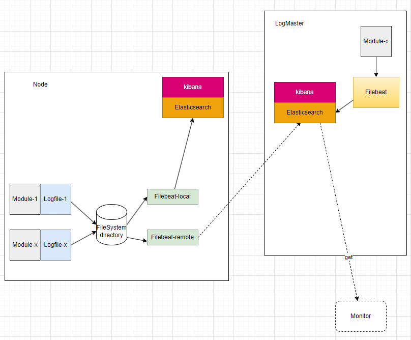

# kLog

1. 用于监控节点(`Node`)运行状态的日志组件；
2. 本地存储，在每个 Node 的本地能检索自己的详细日志
3. 远程存储，能一个节点上能够集中存储并检索其他 Node 的详细日志
    - 负责集中存储日志的节点应该可以简单地更换
    - 集中存储节点故障恢复后，各节点应该能自动同步本地日志信息
    - 有身份验证能力，并提供过滤机制，过滤来自未知节点的日志攻击
4. 提供多种不同的日志检索方式（按时间，类型，字段，节点，关键字等）
5. 实际开发中，也可能用于管理 Debug 的日志，但应该能独立管理，并且很容易地拆卸，而不应该和最终交付产品日志混合一处；

# 拓扑图


Logfile: 原始日志文件存放于本地

LogProvider: 把不同格式的日志文件转换成统一的形式，可以由开发者定制

LogAggregator: 把不同来源的日志聚合在一起，统一处理后发往存储节点

LogCollector: 收集来自不同节点的日志，并按规则过滤掉非法日志

    * LogAggregator和LogCollector应该能切换不同的传输协议，以适应不同的网络环境

Storage: 存储日志

View； 检索/展示日志

# 解决方案

这个需求比较类似集群的日志管理工具，可以先找一个成熟的第三方工具，然后做一些二次开发或者定制。

经过调研，下面三个开源工具可能比较适合，它们都有插件系统，可能支持我们高度的定制需求(不同的文件格式和结构化日志，P2P 传输协议)

ELK Stack: 提供全套组件，但要引入 JDK 环境
Fluentd: 只提供了日志收集功能，日志存储、检索都依赖`ELK Stack`的`Elasticsearch`组件
Graylog: 提供了日志收集、检索和展示功能，内部依然使用`Elasticsearch`存储日志

其他两个工具都部分依赖`ELK Stack`，目前倾向于使用`ELK Stack`以降低学习成本。

目前了解到`ELK`搭建起来应该是下图的样子：


`Filebeat`相当于上面的`LogProvider`，`kafka`用来缓存日志。

## 采用`ELK`的部署方案



# 日志场景

## 系统状态

1. 基础操作系统状态

    - 磁盘空间
    - 内存使用
    - CPU 使用率
    - IO 状态
    - 网络状态
    - ...

    考虑用`metricbeat`收集系统日志

2. `BuckyOS`系统状态

    - 集群节点间的连通性
    - `Nat`穿透服务联通性
    - 节点时间错误
    - ...

    在日志文件中记录，由`Filebeat`收集

## 其他日志

    比如：开发期间调试日志

    直接逐行写入日志文件，由`Filebeat`收集

# 日志规范

    为日志收集组件方便地识别新增日志，所有写入的日志都不准许修改(包括修改日志文件名和修改某条日志内容)，改名后可能会被当做新增日志收集。

## 存储文件规范

    * 所有日志文件集中存放于一个目录下: `${buckyos}/logs/`
    * 系统状态日志文件每天生成一个新的日志文件，命名规则: `.system.${date}.log`
    * ${date}采用UTC时间，防止节点时区变更出现混乱

    ```
    .system.20240325.log
    ...
    ```

    * 开发调试日志文件命名规则: `.debug.${app-name}.${app-id}.${process-id}.${...}.log`

    ```
    .debug.my-app.abcdefg1234567890.20240328.1.log
    .debug.my-app.abcdefg1234567890.20240328.2.log
    ...
    ```

    * 状态文件: `.state`
        存储一些允许过程中会更新的状态信息，比如：日志编号
    * 配置文件：`*.cfg`
        存储一些由开发者配置的固定信息

## 日志格式规范

    1. 系统日志规范

    以`JSON`格式逐行存储，其内容如下：

```
{
    seq: 123, // 用于遍历的递增序号
    type: "connect", // what
    timestamp: 1234567890, // when UTC时间戳
    node: "5aSixgMZXoPywEKmauBgPTUWAKDKnbsrH9mBMJwpQeFB", // where
    level: "info", // 错误级别，info, warn, error, fault
    content: "connect to server success", // 附加一条描述，依据不同type，可以是一个文本，也可以是个`JSON`串
}
```

| 场景     | type    | content                                              |
| -------- | ------- | ---------------------------------------------------- |
| 连通性   | connect | {remote: ${node-id}, reason: 'xxxx'}                 |
| 系统时间 | time    | {local: ${local-time}, reference: ${Reference time}} |
| Nat      | nat     | {sn: ${sn-id}, reason: 'xxxx'}                       |
| ...      | ...     | ...                                                  |

    2. `.state`格式
        len(4bytes) + JSON(key-value)

    3. 开发调试日志规范

    直接以文本逐行写入

# 接口及实现示意

1. 日志目录

```
interface LogConfig {
    log_dir(): &str {
        return "${buckyos}/logs/"
    }
}
```

2. 写日志

\*\* 日志文件格式

```
logs = [log]
log = JSON.stringify(LogRecord) + '\n'

实例:
{seq: 1, type: 'connect', timestamp: 1234567890, node: '5aSixgMZXoPywEKmauBgPTUWAKDKnbsrH9mBMJwpQeFB', level: 'info', content: 'connect to server success'}
{seq: 2, type: 'connect', timestamp: 1234567890, node: '5aSixgMZXoPywEKmauBgPTUWAKDKnbsrH9mBMJwpQeFB', level: 'info', content: 'connect to server failed'}
```

```
    enum LogType {
        Connect,
        Time,
        Nat,
    }

    enum LogLever {
        Trace,
        Debug,
        Info,
        Warn,
        Error,
        Fault,
    }

    struct SystemLogRecord {
        seq: u64,
        type: LogType,
        timestamp: u64,
        node: &str,
        level: LogLever,
        content: &str,
    }

    interface LogWriter {
        constructor(type: &LogType): Self {
            const node = read_node_id();
            const next_seq = read_next_seq();
            const log_file = open(LogConfig.log_dir() + "/" + `.system.${date}.log`);
            Self {type, node, seq: next_seq, log_file}
        }

        async write(&self, content: &impl ToStr, level: LogLever) {
            const record = SystemLogRecord {
                seq: self.seq,
                type: self.type,
                timestamp: now(),
                node: self.node,
                level,
                content: content.to_str(),
            }

            self.seq += 1;

            let buffer = record.to_str().to_buffer();
            buffer.append(self.seq);
            self.log_file.seek(-8); // 覆盖之前的seq
            self.log_file.append(buffer);
        }

        async trace(&self, content: &impl ToStr) {
            await self.write(content, LogLever::Trace);
        }

        async debug(&self, content: &impl ToStr) {
            await self.write(content, LogLever::Debug);
        }

        async info(&self, content: &impl ToStr) {
            await self.write(content, LogLever::Info);
        }

        async warn(&self, content: &impl ToStr) {
            await self.write(content, LogLever::Warn);
        }

        async error(&self, content: &impl ToStr) {
            await self.write(content, LogLever::Error);
        }

        async fault(&self, content: &impl ToStr) {
            await self.write(content, LogLever::Fault);
        }
    }
```

-   为了解决多进程写日志的同步问题，系统启动一个独立的服务进程来排队写入。提供`http`接口供其他进程投递日志写请求，`http`头部只用最简单的头部，`body`部分格式如下：

```
enum SystemLogHttp {
    type: LogType,
    timestamp: u64,
    node: String,
    level: LogLever,
    content: &str,
}

** `seq`字段由服务进程填充

- 每写入一行新的日志前，都更新在`.state`的`seq`字段，以便重启后继续计数。如果`.state`文件损坏，则遍历本地系统日志的最后一行，从中找到最大的`seq`值，恢复`.state`文件。
```

3. 读日志

主要提供按顺序遍历系统日志，以发现系统故障，由故障恢复程序自动或辅助恢复系统

```
// 日志存储器，可以选用不同的存储服务
interface GlobalLogStorage {
    interface NodePos {
        node: &str,
        seq: u64
    }

    // 读取`NodePos后续`的日志，对于不在`NodePos`列表中的节点，`seq`从0开始
    async next(node_pos: &[NodePos], limit: u16): SystemLogRecord;
}

interface LogStorage {
    interface NodePos {
        node: &str,
        seq: u64
    }

    // 读取`NodePos后续`的日志，对于不在`NodePos`列表中的节点，`seq`从0开始
    async next(node_pos: &[NodePos], limit: u16): SystemLogRecord;
}

interface LogReader {
    constructor(storage: &impl LogStorage): Self {
        const node_pos = read_last_pos();
        Self {node_pos, storage}
    }

    async next(&self, limit: u16): SystemLogRecord {
        self.storage.next(self.node_pos, limit).await
    }
}
```
