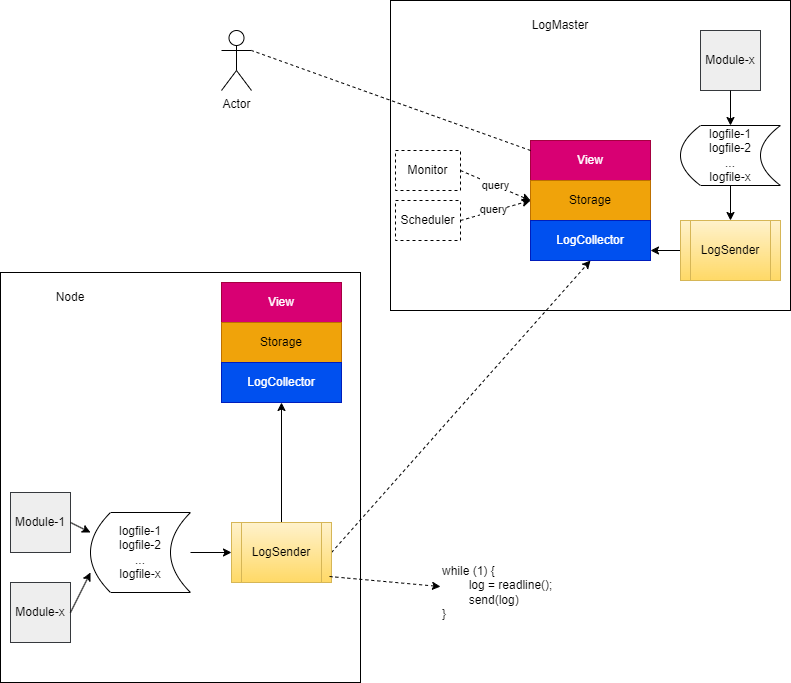

# kLog

1. 用于监控节点(`Node`)运行状态的日志组件；
2. 本地存储，在每个 Node 的本地能检索自己的详细日志
3. 远程存储，能一个节点上能够集中存储并检索其他 Node 的详细日志
    - 负责集中存储日志的节点应该可以简单地更换
    - 集中存储节点故障恢复后，各节点应该能自动同步本地日志信息
    - 有身份验证能力，并提供过滤机制，过滤来自未知节点的日志攻击
4. 提供多种不同的日志检索方式（按时间，类型，字段，节点，关键字等）
5. 实际开发中，也可能用于管理 Debug 的日志，但应该能独立管理，并且很容易地拆卸，而不应该和最终交付产品日志混合一处；

# 拓扑图

Logfile: 原始日志文件存放于本地

LogProvider: 把不同格式的日志文件转换成统一的形式，可以由开发者定制

LogAggregator: 把不同来源的日志聚合在一起，统一处理后发往存储节点

LogCollector: 收集来自不同节点的日志，并按规则过滤掉非法日志

    * LogAggregator和LogCollector应该能切换不同的传输协议，以适应不同的网络环境

Storage: 存储日志

View； 检索/展示日志

# 解决方案

这个需求比较类似集群的日志管理工具，可以先找一个成熟的第三方工具，然后做一些二次开发或者定制。

经过调研，下面三个开源工具可能比较适合，它们都有插件系统，可能支持我们高度的定制需求(不同的文件格式和结构化日志，P2P 传输协议)

ELK Stack: 提供全套组件，但要引入 JDK 环境
Fluentd: 只提供了日志收集功能，日志存储、检索都依赖`ELK Stack`的`Elasticsearch`组件
Graylog: 提供了日志收集、检索和展示功能，内部依然使用`Elasticsearch`存储日志

其他两个工具都部分依赖`ELK Stack`，目前倾向于使用`ELK Stack`以降低学习成本。

目前了解到`ELK`搭建起来应该是下图的样子：

`Filebeat`相当于上面的`LogProvider`，`kafka`用来缓存日志。

## 采用`ELK`的部署方案

