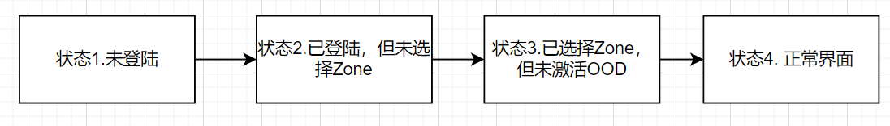
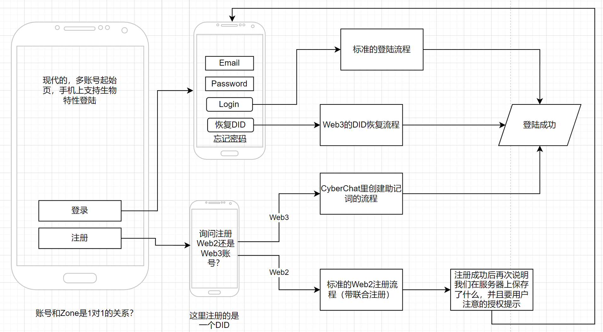

# 购买OOD(套装)后激活使用BuckyOS

**摘要：**

本章主要从用户视角介绍BuckyOS的安装流程。涉及到的流程有：创建身份→创建Zone→在Zone中添加(激活）设备→Zone可访问

## 一、 组成BuckyOS的主要硬件设备介绍

一个典型的buckyos设备套装包含2个设备和1个订阅服务。设备有： 存储服务器（OOD），随身Wifi (sbox). 订阅服务是1-2年的公网的网关订阅服务。从原理上,buckyos鼓励安装在3台以上设备组成的集群里。buckyos也可以安装在3台一下设备上，但此时系统处于不稳定状态（主要是无法维护关键数据的可靠性），要给用户显著的提示. 。

### **OOD的基本硬件配置**

**Zone内必须有一台OOD。**

OOD在硬件上通常基于X86构建（也许ARM优先更好，因为我们的第一个目标设备MacStudio本质上是ARM的），4核带AES-NI,支持虚拟化的CPU，4GB以上内存，支持1G或以上的LAN接口，支持蓝牙。有3-4块存储用的磁盘，商用产品通常由一块SSD系统盘，大于等于3块存储磁盘组成。存储磁盘推荐使用相同容量的SSD或HDD，有效容量是：

**单块磁盘容量乘以总磁盘数-1**

比如3块2T的SSD，则有效容量是4T，4块2T的SSD，有效容量是6T

为了让用户试用方便在云端提供的虚拟OOD，性能不在上述设定范围内。但依旧需要至少2核CPU+1G内存用于运行最小的服务（这也是我们在OOD上运行mini size system的system require）

### **SBOX的基本硬件配置**

SBOX是带电池的辅助存储设备，基础系统是Android。至少有4核CPU+4G内存。有128G以上的SSD空间。有USB-C接口+一个有线网接口，支持WIFI。屏幕和HDMI输出都是可选的。拥有Root权限的Android手机可以通过安装相关软件变成SBOX。 SBOX平时通过USB-C接口与OOD保持连接，拥有稳定的网络和供电。 用户可以在出门的时候随身携带SBOX，并通过连接SBOX的WiFi透明的接入OOD所在的LAN（简单的VPN技术），并正常使用BuckyOS. 当SBOX没有internet的时候，SBOX也可以成为OOD的替身，让BuckyOS已只读方式运行。（通过高级API，BuckyOS dApp的开发者可以支持在这种模式下其dApp也能有限的工作，并在SBOX恢复internet的时候进行正确的数据合并）

SBOX和OOD在开发角度上的区别在于SBOX并不拥有存储池，而**只有系统存储池的缓存**。除此之外，SBOX上能随时运行BuckyOS上安装的所有软件。

### GatewayNode (简称Gateway)的基本配置

Gateway运行在云端的VPS中，必须拥有固定的公网IP。拥有比上述设备更好的互联网接入稳定性和可靠性。用户通常使用订阅模式获得Gateway, 高级用户可以在任意VPS上安装BuckyOS的系统软件并让其变成一个有效的Gateway.

Gateway节点对CPU和内存的需求都很少，该节点不运行BuckyOS的大部分系统服务和dApp. 其职责基本上限定在

1. 运行cyfs-gateway系统服务，为整个系统提供稳定的公网访问能力和标准http协议支持
2. 运行system-config系统服务，为关键的系统数据实现实时异地容灾
3. 如果有打开DFS-Cache分区（一般都会有一个不大的分区），那么也可以为存储上的热数据提供缓存支持。这通常能有效的改件文件分享、协作创作等dApp的可用性。
4. 手工配置运行一些系统服务和dApp

## **二、激活BuckyOS**

本章描述用户购买了已经预装BuckyOS的设备套装后（一定包含有一台OOD）的激活使用流程。本章不包含用户自己安装BuckyOS的流程，本章也不包含特定厂商在云端提供的OOD试用流程。

### 激活准备

用户按说明书准备OOD，通常是将网线插入OOD的网卡，然后打开OOD的电源，并观察OOD的指示灯进入等待激活状态。

下一步用户进入软件流程来完成激活，我们支持两套激活逻辑

1. 基于BuckyOS Control App的激活逻辑 （完整，可以支持Web3的所有流程）
2. 基于浏览器的激活逻辑（不支持Web3的所有流程，必须使用web2.5  briedge）

从目前的研发资源角度来看，我们优先完成第一种，后续再经过裁剪得到第二种。

BuckyOS Control App的界面状态管理逻辑如下：

### 注册并登陆账户

用户先下载并安装BuckyOS Control Panel App。

该App在启动时，会要求用户先登陆一个身份才能进入激活流程。其基本流程如下：

首次激活OOD必定需要一个身份，这里我们要切记让首次流程不要离开“**丝滑愉快的使用新硬件**“的核心目标。我们本质上使用公私钥体系来管理身份，但也提供WEB2.5的中心化方式来帮助用户用传统的账号体系方法来管理其秘钥。从安全性的角度考虑，这套Web2.5的体系由buckyos.org 维护，致力于提高安全性和透明性，并通过SSO的方式与厂商的硬件进行身份对接。整个buckyos.org的WEB2.5的账号体系和SSO的设计应做为一个独立的，关键系统进行深入的设计。不管用户是中心化还是去中心化账号，都能通过一个buckyos.org的SSO url来进行登录授权。 

APP里也支持用户使用标准的Web3方式来创建去中心化的账号。我们的账户体系应让用户能使用MetaMask等主流Web3 Browser Plugin来创建兼容的DID。

由于相关的账号/DID 管理的UI相对成熟，这里就先不详细描述了

### 选择Zone

一个DID可以拥有很多个Zone，在Control App内，必须选择使用一个默认Zone后才能在该Zone内继续激活OOD。如果用户没有拥有任何Zone，该流程要帮助用户以最快的速度拥有一个Zone。

**快速Zone创建**

创建Zone需要选择一个唯一的名字，并支付一定的费用。比如$name.buckyos.org（通过厂商设备激活免费？） , $name@ens，可多选。

如果Zone选择用$pubkey做名字，那么一定是免费的，这种特殊类型的名字有众多的缺陷，我们并不鼓励初级用户使用（这块的支持我们可以先不做）

**导入已有Zone**

也可以给Zone配置一个已有的名字（Zone和名字绑定的细节需要展开）。 Zone和名字创建成功后后，激活的设备可以加入Zone。

### 激活OOD

点击激活OOD会提示用户连接OOD的网线，并打开电源，观察OOD的指示灯进入等待激活状态。同时开始搜索局域网内待激活的OOD。找到OOD（这里是一个设备列表），点击展示OOD的详细信息，点击激活，弹出激活成功。

## 三、激活附属设备和服务

完成上述流程后，BuckyOS的全部功能就可以都用了。下面的两个流程是通过提示的方式，引导用户进行（赶紧把自己付费的东西用起来）

### 激活SBOX

对大部分的商业产品来说，我们都鼓励使用自动激活流程：

将SBOX与已经激活的OOD之间用USB-C连接。如果SBOX处于待激活状态，会自动激活。并在Bucky Control App的设备面板中可以看到已经激活的SBOX设备。**我们鼓励所有的BuckyOS兼容设备都支持自动激活以提升用户体验**。比如用户购买了一个BuckyOS兼容的安防摄像头，只需要用USB-C连接摄像头与OOD，就可以自动完成激活了。 自动激活完成后，不需要保持USB-C连接。

也可以用非自动激活流程来激活SBOX，此时的流程是BuckyOS的标准设备激活流程。

**BuckyOS支持两种标准设备激活逻辑：**

1. 基于LAN的激活

将待激活设备接入网络（插线最简单，只有WiFi的设备需要先配置WiFi,流程最为复杂），然后在Control App 里搜索待激活设备, 找到后按提示一路下一步即可。当LAN中出现未激活设备时，Control App中也会弹出发现新设备，尽快激活的提示。

2. 激活VPS
相比LAN激活，激活VPS需要打开一个带随机tokne的URL。（在公网无权限验证的暴露一个端口是很危险的）

3. 基于蓝牙的激活 （暂不实现）

和标准的添加蓝牙设备流程类似，在Control App中控制OOD添加蓝牙设备。此时OOD更像是一个蓝牙网关.Bucky OS中也可以添加多个蓝牙网关。

### 激活订阅的Gateway服务

当完成OOD的激活（集群可用）后，会提示用户开通公网gateway服务以让系统有更好的Internet Access能力。

1. 领取（设备已经带了订阅，立刻领取）
2. 订阅，通常是通过厂家的支付渠道，用法币支付
3. 通过buckyos.org的官方渠道，通常用token支付
4. 第三方/自建 ，通过扫二维码，可以激活自己搭建/第三方 的gateway服务

**BuckyOS的标准“公网”设备激活流程（第三种激活流程）**

1. 通过扫描添加
2. 通过输入URL添加

gateway node通常没有复杂的状态，因此也易于迁移。gateway node通常在加入一个Zone后依旧需要稍等一会完成初始化后才可使用。在流程上，我们将来允许用户激活多个gateway node（比如中/美国 各有一个）。

## 四、已激活设备重新进入待激活状态

**目的一、购买了一台二手设备，需要重新激活**

0. 原用户在出售OOD/SBOX时，可以在Bucky Control App中“删除设备并清除所有数据”
1. 通过设备上的物理按钮让设备进入待激活状态（通过物理按钮通常是无法进入Control App导致的，此时数据默认不删除）
OOD/SBOX上的该按钮可以通过组合操作直接完成设备的完全恢复出厂设置功能
2. 正常完成新账号创建，Zone创建流程
3. 进入激活流程，激活时如发现OOD/SBOX 有旧数据，提示用户清除
4. 因为是二手设备，所以设备附带的附加服务可能是无效的（看厂商的政策）

**目的二、忘记了激活设备时的账户信息，需要重新将设备绑定到新的账户下**

这种情况常见于用户丢失了手机后，进入该流程的前提条件：

设备未打开bitslock(否则没有登陆看到的都是垃圾数据）

Web2.5 账号找回失败（忘记相关信息）

Web3 账号私钥丢失

重新绑定流程如下：

1. 通过OOD/SBOX 上的物理按钮清理账户信息
2. 正常完成新账号创建，Zone创建流程
3. 进入激活流程，激活时提示OOD有旧数据，用户选择保留
4. 激活成功后，原OOD上的服务和数据在新的Zone下是可用的（用户能看到之前的照片了）