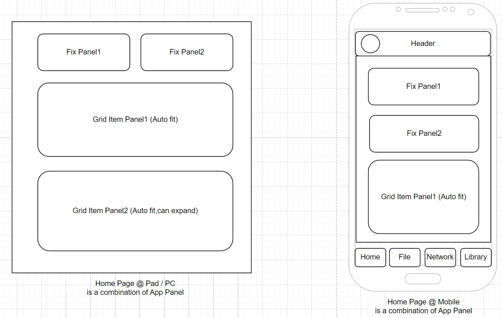
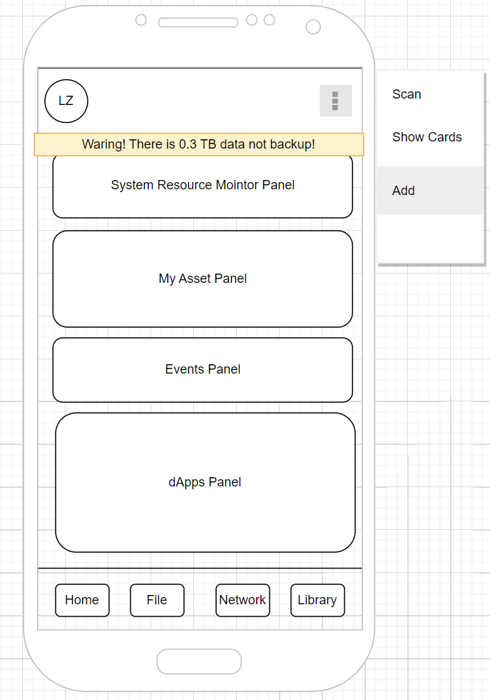
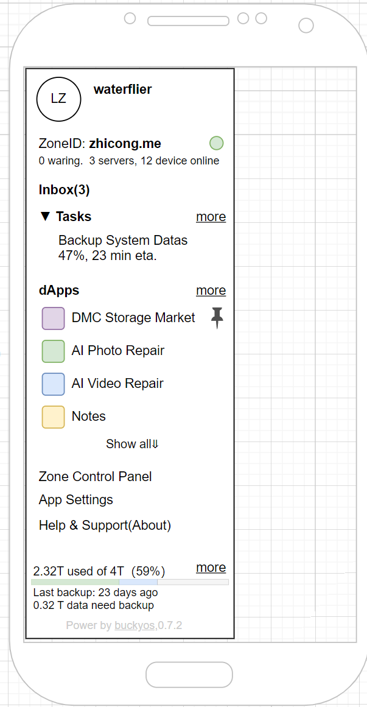
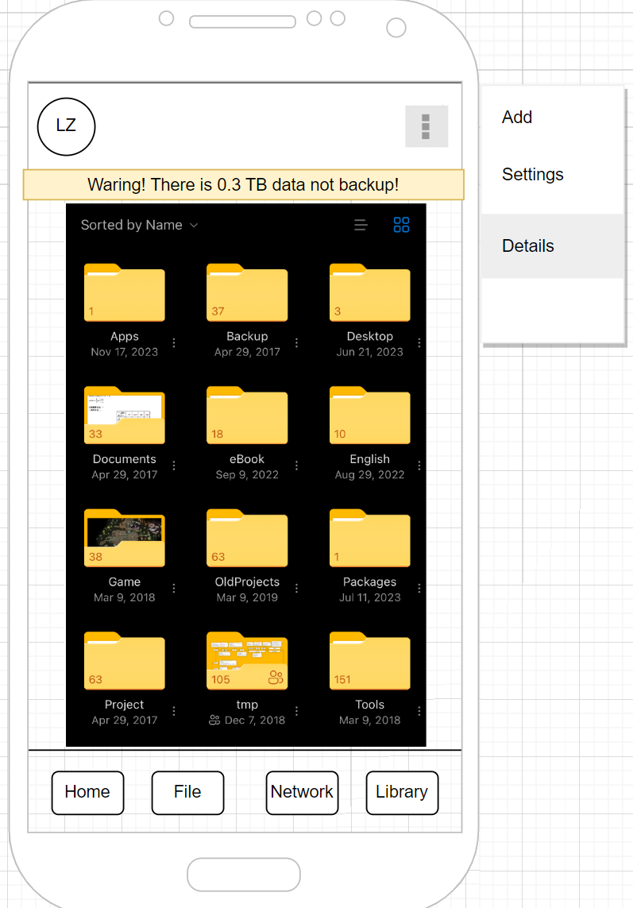

# 日常使用与系统管理

**摘要：本章主要描述BuckyOS的日常使用和常规系统管理功能的实现**

完成BuckyOS的激活流程后，就可以进入正常使用的状态。用户主要用下面3种方式来使用BuckyOS

1. 通过BuckyOS Control App (下面简称ControlApp)使用BuckyOS,
2. 通过BuckyOS 默认支持的服务，在一些通用客户端里使用BuckyOS,主要有：

通过SMB协议或NFS协议访问BuckyOS的DFS，\\$zonename\ , 在内网，或使用SBOX的wifi时可用。拥有最好的应用兼容性，也是最主要的使用文件系统的方法。

通过http://协议，在浏览器里访问 https://$zoneid/ ,此时可以访问到系统配置的默认http service,早期是以HTTP的方式访问DFS里的public folder, 在完成新的Personal Home Page的开发后则切换到Personal Home Page上来。
3. 安装dApp后，通过dApp提供的配套客户端App访问。BuckyOS Control App未来规划了类似微信小程序的 轻客户端 功能，使用dApp的配套客户端来使用BuckyOS是未来的主流形式

## 一、ControlApp UI 的基本框架

因为BuckyOS是一个开源项目，不那么商业化（广告少，推广少），且主要研发资源都在基础系统上。整个ControlApp UI结构的设计目的就是在用一次资源投入，构造实现简单、适应性强、稳定、可用、扩展性强的UI。UE上不要求极致的体验（舒服可用就好）。 MacOS和iOS的融合也体现了类似的思路。我们的整个UI框架如下:


UI由导航区(Taskbar)和App Page组成。在Pad/PC的浏览器里运行时, 同时展示Taskbar和App Page.在手机App里运行时，只展示App Page,当点击当前用户头像时，展开Taskbar. 

Taskbar由系统实现，并由系统处理响应式编程。App Page由应用实现,由应用处理响应式编程。为了统一应用的风格，简化应用开发的难度，系统会为App Page提供一系列“系统控件”。

当App进入一些内部页面时，系统保持了一个简单的Header，Header的右上角为固定的操作栏，App开发者可以通过简单的配置，对Header进行一些基本的控制。

## 二、Home Page

### Home Page的结构

Home Page是系统实现的一个重要的App Page. 是整个UI的默认入口。Home Page由 Panel组成。结构如下：



每个已经安装的App都可以向系统注册1个或多个Panel,用于放置在首页。这个设计也允许用户自定义首页的Panel排放。随着系统的改进，我们会支持更多样式丰富的Panel。 

目前系统里有2个类型的Panel,

1. FixPanel,有确定的高宽，基本逻辑是宽度是移动设备合适的大小，高度可以定义。

实现FixPanel就是如何在这个确定的大小里塞入元素

1. Grid Panel. 用来放置固定大小的矩形Item。最常见的Grid Panel就是由App Icon组成的应用面板。 可以设置的属性有： Title Bar Info, Item Size, CanExpand (会随着Item的增多将高度逐步增加到最大高度)

### Home Page 的设计



上面界面是Control App打开时的默认样式。 其功能从上到下简单介绍：

1. Header，左边是用户头像，Header的中间会用文字显示一些Zone的关键信息，Header的右侧会展示当前OOD的状态（包括OOD的Logo图片），并有菜单栏可以快速进入：设备添加、扫一扫、展示我的卡片 等常用界面
2. 滚动系统提示区。有的系统提示是Message,读过后就消失，而有的是一些是用户必须处理的issue,只有issue解决了才会消失。issue提示不滚动，只叠加。而系统消息是滚动显示的。
3. 系统资源监控，可以看到CPU使用率，内存使用率，硬盘可用空间，GPU使用率等重要资源的实时使用情况，上下滚动还可以看到不同资源的详细使用情况以及使用率最高的dApp Icon
4. 数字资产列表，显示当前持有的资产和相关资产的 消耗/收益情况，并提供充值的入口。当某些资产快要消耗完时，会给出提示（比如备份用的DMC要在3个月后用完，就会看到感叹号提示）
5. 事件面板，用图文的方式展示一些对用户来说比较重要的事件：
系统事件（停电、新设备加入、设备删除）
文件事件、共享的文件获得了新的互动等

点击事件可以调到事件的详情页
6. 应用列表，一组dApp的Icon，
7. 导航区，目前Control App有4个默认应用:File 是DFS管理，Network是社交网络，早期主要用来管理已共享文件，Library是AI化的文件管理与搜索，能帮助用户更好的在自己的海量的数据中找到相关的数据

## 三、Taskbar


如上图所示，Taskbar的功能从上到下是

1. 当前的用户信息
2. 当前的Zone信息
3. Inbox,可以看到所有的通知信息（来自系统、应用、其它用户）
4. 系统正在运行的后台任务，这里列出来的任务都是并行的，可以随意的暂停/开始，一组序列化的子任务应该被包含在一个Task中。点击More可以进入系统的Task管理界面
5. 按最后活跃顺序列出系统已有的dApp,用户可以手工将dApp置顶以保证顺序。点击Show All后会展开显示所有的dApp,但依旧会按最近使用过分组，并有一个简单的dApp搜索框
6. 点击进入系统控制面板页
7. 点击进入Control App设置页
8. 点击进入关于页
9. 显示目前系统的存储使用状态，尤其会展示上一次备份的时间和未备份的数据总量，当没有配置备份源时，这里会有入口引导用户配置备份。点击more进入Storage Manage

## 四、File界面

该界面提供了用户最熟悉的方式，管理BuckyOS DFS里的文件。界面整体设计上与用户熟悉的，基于文件夹的，触屏管理界面类似就好。如下图：



我们这里不会展开详细讨论，设计要点是

1. 这是一个效率板块，能让熟练用户高效的完成一些重复动作
2. 更关注现代文件管理的协作特性，包括权限管理、赞/踩、标签、评价等
3. 在这里引入一点点早期的AI特性，可以用自然语言来进行选中：“选择DSC4000编号以后的所有文件”

### DFS的初始化和默认配置

购买商业产品的用户，OOD上的DFS配置是默认配置好的，只需激活后DFS就会按照默认配置工作。当用户激活第二台OOD，或则其它带有Chunk Service的设备时，会通过**引导配置的方式**将新的存储介质加入DFS，并扩展DFS的空间。系统有专门的**Storage Mange**来对DFS Service进行管理和配置。

**目前OOD上的DFS默认配置是:**

1. 确保任一硬盘损坏都不会导致数据丢失。两块硬盘时使用标准的同步配置，2块以上开始使用纠删码。
2. 硬盘会保留64G的空间作为系统保留空间
3. DFS的目录设计基本分成系统数据区、应用数据区、用户Home数据区、Library区、公开数据区，并有针对 admin / user / lan guest / public guest 4个默认用户组的权限配置(DFS的目录设计在下一章会详细介绍)
4. 系统默认会启用 smb:// 服务，可以访问 用户home数据区, Library区，公开数据区
5. 系统默认会启动http://服务，可以访问 公开数据区

在用户的User Card中，会有DFS的二维码，扫描二维码可以快速的得到用户的smb://服务URL和http://URL。


## 五、Network和Library

Network早期用来管理用户的共享文件，正式版本是新的“朋友圈”。

Library是AI驱动的，基于知识图谱的新数据管理模式。比如根据人脸找到相关图片就是一个最最基本的应用场景。

这两块的需求后续再补充。

## 六、Storage Manage

### Storage Manage Page

展开查看存储系统的详细信息，可以进一步看到 （TODO：需要UI画图）

1. 为存储系统提供能力的设备
2. 展开设备，可以看到为存储系统提供空间或缓存的磁盘信息（注意如何合适的展示本地文件系统系统/raid信息）。
3. 可以细粒度的看到各个磁盘的负载情况

### BuckyOS的数据管理

在详细备份与恢复的相关机制之前，我们有必要先详细的说明一下BuckyOS的数据管理机制。

- 所有的数据必然会保存在本地文件系统上,BuckyOS并不依赖本地文件系统的具体实现和关键特性。
- 用户可感知的数据基本都保存在DFS上。DFS也是BuckyOS最重要的基础服务，如DFS启动失败，BuckyOS的大部分功能（尤其是写功能）会无法使用。
- 站在Node Local OS 的角度（这个Local OS通常是Linux），其本地目录(分区）的需求如下，可通过BuckyOS的NodeConfig进行调整：（TODO：画图）
  - /opt/buckyos_backup/ 保存发布时的二进制文件和一些必要配置的初始版本，只读目录。用来做系统恢复。
  - /opt/buckyos/bin 保存BuckyOS System文件的分区 ，可以是ReadOnly的，只有在系统升级时才写入数据,这个分区通常和本地Linux的根分区是同一个
  - /opt/buckyos/etc 
  - /opt/buckyos/data 保存系统数据(System Config的数据)的分区，必须是RW的，但数据量很小，如果上一个分区可写，那么这两个分区通常是同一个 （有重要数据）

  - /opt/buckyos/cache/$userid/$appid 保存dApp的Local Cache数据，这通常是一些计算临时数据，可以随时删除。
  - /opt/buckyos/dfs/caches bcache DFS Cache分区 （1-多个），必须是RW的，且读写数据要快，SSD可以和上一个分区是同一个
  - /opt/buckyos/dfs/chunks bchunk DFS ChunkData 分区（0-多个），SSD/HDD,不会轻易删除的数据 （有重要数据）


使用docker启动时，只需要简单的做下面映射即可。docker的启动脚本会自动创建上述目录结构并从buckyos_backup目录复制初始软件过去
用户通过映射不同的本地buckyos目录，实际上可以实现切换不同的BuckyOS版本，或则在一个物理机器上运行多个BuckyOS实例。

```
docker run -v /home/$username/buckyos:/opt/buckyos buckyos/buckyos
```

- DFS上的分区划分
  - dfs://system 保存系统服务的数据，比如系统内的repo_server会将所有已安装的dApp的pkg保存在这里
  - dfs://appdata/$appid 保存dApp的zone级别数据
  - dfs://appdata/$userid/$appid 保存用户自己的dApp数据
  - dfs://appcache/$userid/$appid 保存dApp的标准Cache数据，这些数据通常不是用户创建的，可以从其他Zone获取的（也就是说，是保存在其它zone的dfs://data里的数据）
  - dfs://homes/$userid/ 保存用户自己的个人文档数据
  - dfs://library/public/ 保存公开的文档
  - dfs://library/share/ 保存用户之间共享的文档
  - dfs://library/photos/ 保存用户自己拍摄的照片和短片，默认是全Zone可见
  - dfs://library/medias/ 保存用户喜爱的音乐、电影等，默认是全Zone可见


站在app开发者的角度，在其容器里，看到的是下面几个目录:

- /opt/buckyos/bin 只读
- /bcache/$appid 默认读写
- /appdata/$appid 默认读写
- /appcache/$appid 默认读写
- /homes/$userid/ 需要用户授权读写
- /library/ 需要用户授权读


站在用户的角度，看到的是下面几个目录：

- /homes/$userid --> dfs://homes/$userid/
- /library --> dfs://library/

如果是系统管理员，这可以通过 / --> dfs:// 看到DFS的所有数据


## 七、BuckyOS System Control Panel

System Control Panel能对系统的各个方面进行配置，在产品设计上要有足够的可扩展性。我们针对一些比较重要的常见配置，构建引导配置和专门的UI，而针对大部分配置项，在技术上使用声明性配置：即声明可以配置的项的类型、范围、默认值、描述信息，是否必填、是否需要重启生效等信息，然后由系统自动生成该配置的UI。

整个UI风格上与Windows的设置界面类似。

下面列出所有的配置项（持续完善）
