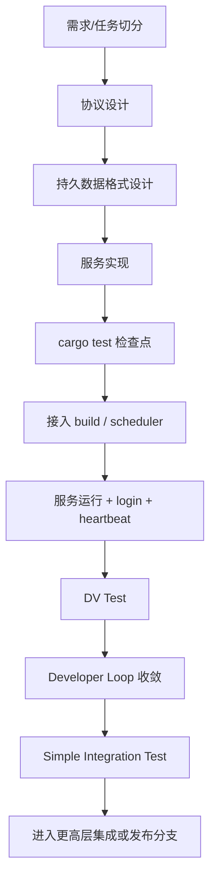

# BuckyOS Harness Engineering Spec (System Service)

**Status:** Draft  
**Audience:** 内核团队、模块负责人、贡献者、AI Harness / Agent  
**Language:** zh-CN  
**Scope:** 本文定义 BuckyOS 中“系统服务（System Service）”这一类工程任务的标准模板、关键检查点、自动化边界与交付要求。其目标是把系统服务的开发流程收敛为一套可被人类与 AI 共同执行的工程规范。本文在既有 Harness Engineering 流程目标与职责划分之上展开，尤其落实到系统服务这一高频任务类型。

---

## 1. 规范目标

本规范回答五个问题：

1. **系统服务任务该如何被拆解与分类。**
2. **一个系统服务在设计、实现、测试、接入、集成过程中必须产出哪些文档与代码资产。**
3. **哪些检查点必须先通过，才能进入更高成本的阶段。**
4. **AI Harness 在各阶段应该做什么，不能做什么。**
5. **什么状态才算一个系统服务真正完成。**

本文同时覆盖两种系统服务形态：

- **无脸系统服务（Headless System Service）**
- **带 WebUI 的系统服务（System Service with WebUI）**

---

## 2. 术语与规范级别

本文使用以下规范级别词汇：

- **MUST / 必须**：不满足则不得进入下一阶段。
- **SHOULD / 应当**：默认要求，若偏离必须说明理由。
- **MAY / 可以**：可选手段，由模块负责人或实现者决定。

关键术语：

- **协议文档（Protocol Spec）**：系统服务对外暴露的 KRPC 接口说明。
- **持久数据格式文档（Durable Data Schema）**：会跨安装、跨升级保留的数据格式说明。
- **Service Spec**：调度器用于实例化系统服务的服务描述。
- **Settings Schema**：调度器 / SystemConfig 可见的配置模式定义。
- **DV Test**：单点真实环境验证，要求走真实身份、网关、SDK、服务链路。
- **DataModel（UI）**：UI 层消费的稳定数据模型，不等同于 KRPC 原始模型。
- **Developer Loop**：开发-测试-观测-修复循环。
- **Simple Integration Test**：CI 中基于安装包环境的轻量集成测试。

---

## 3. 系统服务模板总览

一个系统服务的标准开发路径如下：



带 UI 的服务在此基础上并行增加一条 UI 线：


---

## 4. 任务分类与适用范围

### 4.1 本规范适用的任务

当一个任务满足以下特征时，默认适用本规范：

- 需要新增或重构一个系统服务；
- 需要定义新的 KRPC 协议；
- 需要进入调度系统并在真实节点上运行；
- 需要新增长期保留数据格式；
- 需要被 SDK、网关、身份系统、安装包、调度器共同接入；
- 可选地包含 WebUI。

### 4.2 不直接适用的任务

以下任务不直接适用本文全部流程，但可复用其中的局部 Skill：

- 纯文档任务；
- 纯 SDK 辅助改动；
- 纯 Bugfix 且不引入新服务；
- 仅 UI、小范围样式修复；
- 不进入调度系统的本地工具。

---

## 5. 角色与责任

### 5.1 版本负责人 / 产品负责人

MUST：

- 决定该服务是否进入版本规划；
- 在高成本集成前给出产品体验反馈；
- 对 UI PR 阶段的体验性修改承担前移责任；
- 对最终是否合入主干或发布分支负责。

### 5.2 模块负责人

MUST：

- 判断任务是否属于系统服务模板；
- 审核协议文档、持久数据格式文档、Settings Schema；
- 审核是否满足测试与接入检查点；
- 决定是否允许继续进入更高成本阶段。

### 5.3 贡献者

MUST：

- 按模板产出规范文档、代码、测试脚本与证据；
- 保证所有阶段性检查点可复现；
- 对所提交 Prompt / Skill 使用过程承担可解释责任。

### 5.4 AI Harness / Agent

MUST：

- 按已批准文档与模板执行；
- 在 Developer Loop 中自动驱动测试、日志分析、重部署与修复；
- 只在允许范围内修改代码、配置、测试与前端模型；
- 不得越过未冻结的架构边界擅自重写系统设计。

---

## 6. 分阶段里程碑与 PR 模型

系统服务建议采用多阶段 PR，而不是一次性大 PR。

### 6.1 PR-1：设计 PR

MUST 包含：

- 协议文档；
- 持久数据格式文档；
- 初版任务边界说明；
- 若为 UI 服务，还应附 PRD 或最小交互草图。

该 PR 的目标是：**冻结边界，而不是写完代码。**

### 6.2 PR-2：实现与本地测试 PR

MUST 包含：

- 服务实现主体；
- `cargo test` 通过；
- 关键数据解析、协议解析、核心逻辑单测；
- 若接口已稳定，UI 线可从此点开始独立开发。

### 6.3 PR-3：运行接入 PR

MUST 表明：

- 服务已进入系统构建链路；
- 可被 scheduler 识别并实例化；
- login、heartbeat、日志接入正常；
- DV Test 已可在本地环境执行。

### 6.4 PR-4：集成与 SDK PR

MUST 包含：

- TypeScript SDK 正式修改；
- 基于安装包环境的测试证据；
- Simple Integration Test 通过；
- UI 服务额外要求完成 DataModel 集成与性能收敛。

---

## 7. 无脸系统服务模板

## 7.1 阶段一：协议设计

### 7.1.1 目标

协议定义系统服务的外部边界。协议一旦进入实现阶段，原则上不应再频繁变动。

### 7.1.2 协议文档必须包含

- 服务边界：做什么，不做什么；
- KRPC 方法列表；
- 输入 / 输出结构；
- 错误码语义；
- 幂等性与副作用说明；
- 状态流转（若有）；
- SDK 暴露方式（若需要）。

### 7.1.3 强规则

- 协议文档 **MUST** 先于实现被提交。
- 协议一旦进入实现阶段，后续变更 **SHOULD** 视为高风险事件。
- 协议文档变更 **MUST** 自动触发兼容性检查。

---

## 7.2 阶段二：持久数据格式设计

### 7.2.1 目标

在代码实现前定义长期保存、会跨安装保留的数据格式。

### 7.2.2 数据分类

系统服务数据分两类：

1. **持久数据（Durable Data）**
   - 位于服务 data 区；
   - 安装 / 覆盖安装不会被卸载；
   - 一旦格式变更，必须考虑兼容或迁移。

2. **可丢弃数据（Disposable Data）**
   - 如 local cache、中间缓存；
   - 可在升级时清空；
   - 不必为旧版本兼容背负成本。

### 7.2.3 持久数据格式文档必须包含

- 数据结构定义；
- 存储位置；
- version / schema version；
- 升级兼容策略；
- 不兼容时的迁移或重建方式；
- 哪些字段可扩展、哪些不得改语义。

### 7.2.4 强规则

- 服务代码进入实现前，**MUST** 已有持久数据格式文档。
- 持久数据格式变更 **MUST** 触发向前兼容性检查。
- 新服务在未上线阶段若决定重置数据，**MUST** 明确标记“无需兼容”的开发模式。

---

## 7.3 阶段三：实现阶段的基础设施约束

实现阶段的原则是：**把协议与数据设计映射到系统已有基础设施上，而不是重新发明一套存储与访问机制。**

### 7.3.1 结构化 / 非结构化数据分流

#### 非结构化数据

SHOULD：

- 优先使用对象化管理；
- 直接管理 object / object id；
- 避免围绕传统文件系统路径设计核心内部数据。

#### 结构化数据

MUST：

- 使用系统提供的 RDB instance；
- 不直接绑定具体后端（sqlite / PostgreSQL 等）；
- 允许平台后续替换 backend，而不影响服务语义。

### 7.3.2 平台治理收益

统一使用 RDB instance 的目的不仅是方便开发，更是为了：

- 统一数据安全跟踪；
- 统一备份 / 恢复；
- 统一系统治理。

### 7.3.3 例外规则

若某服务必须直接依赖 filesystem 作为核心数据模型，**MUST** 在文档中说明理由，并作为高风险项进入审查。

---

## 7.4 阶段四：长任务模式

当业务逻辑涉及长时间执行、可恢复或跨模块协同时，不应写成普通同步逻辑，而应进入任务执行者模式。

### 7.4.1 自己实现长任务

MUST 使用以下组合：

- `task manager`
- `keymessage queue`
- 任务执行者模式（Task Executor Pattern）

目标是支持：

- 长时间运行；
- 断点恢复；
- 分布式状态管理；
- 跨模块协作；
- 外部统一观察。

### 7.4.2 调用别人的长任务

若其他组件返回 `task_id`，调用方：

- **MUST NOT** 以高频 timer 轮询为主流程；
- **MUST** 通过 `keyevent` 等待状态变化；
- **SHOULD** 配置 timeout 作为保底，而不是把轮询作为主路径。

### 7.4.3 推荐模式

```text
发起长任务请求
→ 获取 task_id
→ 定位对应 keyevent 路径
→ 订阅状态变化
→ timeout 保底
→ 状态完成后继续后续逻辑
```

---

## 7.5 阶段五：cargo test 检查点

在进入任何高成本运行验证前，系统服务 **MUST** 先通过 `cargo test`。

### 7.5.1 单元测试覆盖来源

单元测试不是拍脑袋写出来的，而是由两类上游文档反推：

- 协议文档；
- 持久数据格式文档。

### 7.5.2 单元测试必须优先覆盖

- 协议解析；
- 输入输出编解码；
- 边界条件；
- 错误码行为；
- 数据格式读写；
- 可本地验证的业务逻辑；
- 能在本地发现的明显错误。

### 7.5.3 检查点定义

未通过 `cargo test` 的实现，**MUST NOT** 进入 DV Test。

---

## 7.6 阶段六：接入 BuckyOS build 与 scheduler

这是系统服务第一次真正进入操作系统运行模型的阶段，也是常见痛点。

### 7.6.1 构建链路要求

服务 **MUST**：

- 被加入 BuckyOS build 目标；
- 通过 `buckyos build`（而非仅 `cargo build`）构建；
- 在 `rootfs/bin` 中看到编译结果；
- 确保产物会被安装包带入系统。

若二进制未进入 `rootfs/bin`，则系统安装不会包含该服务。

### 7.6.2 Service Spec 接入

调度器实例化服务的核心流程是：

```text
发现 Service Spec
→ 读取默认 settings
→ 构建 instance
→ 下发 replica 到 node
→ 服务启动
```

因此服务 **MUST** 提供：

- Service Spec；
- 默认 settings；
- 资源需求；
- SystemConfig 可见的 Settings Schema。

### 7.6.3 资源配置规则

资源需求 **MUST** 明确写入 spec，例如：

- CPU / memory；
- GPU；
- 其他硬件依赖。

资源配置错误会导致 instance 无法创建，或错误地被调度到不满足条件的节点。

### 7.6.4 Settings 规则

Settings 一旦发布：

- **SHOULD** 只增不改；
- **MUST** 有默认值；
- **SHOULD** 采用最小暴露原则；
- **MUST** 文档化其 schema、含义、默认值与兼容性。

---

## 7.7 阶段七：服务启动、日志、身份与心跳

服务被 scheduler 拉起后，必须出现一组标准运行信号。

### 7.7.1 标准启动信号

系统服务成功接入的最小里程碑包括：

- 日志系统初始化成功；
- 日志被分布式系统捕获；
- Service SDK（kAPI）初始化成功；
- 与 scheduler 建立 heartbeat；
- 服务未被标记为 unavailable。

### 7.7.2 login 规则

服务启动后 **MUST** 调用 login，并：

- 与 Wallet Hub 建立合法服务身份；
- 启动双 token / 定期换 token 机制；
- 获得访问其他系统服务的凭证。

未 login 成功的服务不应被视为合格系统服务。

### 7.7.3 运行接入阶段的 Done

满足以下条件后，可视为完成运行接入阶段：

- 服务进程成功启动；
- scheduler 能看到 instance；
- heartbeat 正常；
- login 成功；
- 服务未被标记 unavailable。

---

## 7.8 阶段八：DV Test（真实链路单点验证）

DV Test 的目标不是验证函数调用，而是验证真实系统行为。

### 7.8.1 为什么必须使用 TypeScript

DV Test **MUST** 使用 TypeScript，原因是：

- 强制验证 Web / SDK 生态是否准备就绪；
- 测试真实客户端调用路径；
- 避免仅凭 Rust 内部调用自证正确。

### 7.8.2 真实请求链路

DV Test 必须走以下真实路径：

```text
TS Script
→ 获取 session token
→ 调用 Web SDK
→ 请求进入 Gateway
→ 权限检测
→ 路由到 Service
→ Service 执行
```

请求 **MUST NOT** 直接绕过网关直打服务进程。

### 7.8.3 TS SDK 要求

- 服务对外接口 **MUST** 有 TypeScript SDK。
- 在正式发版前，可本地 patch SDK 以支持测试。
- 集成前，SDK 修改 **MUST** 被提交到正式版本链路。

### 7.8.4 DV Test 的 Done

满足以下条件后，可视为通过 DV Test：

- TS SDK 可用；
- 测试脚本能运行；
- 能获取 session token；
- 请求通过 Gateway；
- 服务响应正确；
- 核心接口逻辑正确。

---

## 7.9 阶段九：Developer Loop

一旦服务已能在单点环境中启动，后续开发应进入自动化 Developer Loop。

### 7.9.1 Loop 目标

让 AI Harness 在真实环境中反复执行：

- 运行测试；
- 观测日志；
- 修改代码；
- 重建与重部署；
- 再验证。

### 7.9.2 标准 Loop

```text
run_test
→ 判断接口结果与状态是否正确
→ 若错误则读日志
→ 定位问题
→ 修改代码
→ stop.py
→ buckyos build
→ start.py
→ 重新测试
```

### 7.9.3 数据格式变更模式

默认 `start.py` 走覆盖安装：

- 数据不删除；
- 重启较快。

若当前仍处于“新服务尚未上线、无需兼容”的模式，并且修复涉及数据格式重建，则 **SHOULD** 使用：

```text
start.py --all
```

其含义是：

- 重新安装；
- 清理旧数据；
- 不承担兼容成本；
- 但耗时更长。

### 7.9.4 Loop 中 AI 必须知道的事情

AI Harness 必须显式知道：

1. 什么算测试通过；
2. 日志在哪里看；
3. 哪些日志能定位当前问题；
4. 何时只做覆盖安装；
5. 何时必须全量重装；
6. 当前任务是否需要兼容旧数据。

### 7.9.5 阶段 Done

满足以下条件，可认为本地 Developer Loop 收敛：

- 关键业务测试通过；
- 状态数据符合预期；
- 无关键错误日志；
- 服务稳定运行。

---

## 7.10 阶段十：Simple Integration Test（CI 级集成测试）

当本地 Developer Loop 完成后，工程师侧的大部分工作已经完成，随后进入基于安装包环境的轻量集成测试。

### 7.10.1 进入条件

- 服务已可被 scheduler 启动；
- 本地 DV Test 完成；
- 若有 SDK 改动，已准备正式提交；
- 若有 UI，已完成 UI 集成前置条件。

### 7.10.2 CI 流程

Simple Integration Test 建议按如下顺序执行：

```text
cargo test
→ 多平台构建（例如 6 个目标平台）
→ 打安装包
→ 用生产流程安装
→ 激活流程
→ 验证主路径可用性
→ 切换到测试身份/配置
→ 在安装环境中跑 DV Test
```

### 7.10.3 本地 DV 与 CI DV 的差别

- 本地 DV：使用开发机产物；
- CI DV：使用**安装包**进入的生产式环境。

CI 测的是**发布产物**，不是开发产物。

### 7.10.4 通过条件

Simple Integration Test 通过意味着：

- 安装包已正确携带该服务；
- 激活流程未被新功能破坏；
- DV Test 在安装环境中通过；
- 系统主路径无明显回归。

---

## 8. 带 WebUI 的系统服务模板

带 UI 的系统服务在无脸服务的基础上，增加一条独立且尽可能晚集成的 UI 流程。

## 8.1 启动时机

UI 开发通常在以下条件满足后启动：

- KRPC 接口已较为稳定；
- `cargo test` 已完成；
- 实现者确认可供前端并行推进。

换言之，UI 线通常从 PR-2 之后开始。

---

## 8.2 UI 开发原则：Mock-first、晚集成

### 8.2.1 原则

UI **SHOULD** 尽可能晚接入真实后端。第一阶段应确保 UI 能在独立环境中自行运行，而不依赖系统集成。

### 8.2.2 独立运行要求

UI **MUST** 满足：

```text
pnpm run dev
```

即可启动，并且：

- 不依赖真实服务；
- 可独立演示主要流程；
- 支持至少两种视图模式：
  - 独立页面模式；
  - 模拟桌面窗口模式。

---

## 8.3 UI 输入：PRD、组件系统与系统规范

### 8.3.1 PRD 是前置输入

有 UI 的服务通常 **MUST** 有 PRD。PRD 至少包括：

- 用户任务与场景；
- 主要页面与交互；
- 关键状态与反馈；
- 成功与失败路径。

### 8.3.2 UI 系统规范

UI **MUST** 遵守系统级规范，包括：

- 桌面浏览器与手机浏览器双端可用；
- 使用系统组件库；
- 支持深浅色主题切换；
- 支持国际化；
- 在整体桌面风格内一致呈现，而不是把每个服务当成独立 UI 产品。

---

## 8.4 UI DataModel：UI 的稳定边界

### 8.4.1 DataModel 的地位

对于 UI 模块，真正的边界通常不是 KRPC 原始结构，而是 **UI DataModel**。

它位于：

```text
KRPC Model
→ Client Model
→ UI DataModel
→ UI Rendering
```

### 8.4.2 为什么 DataModel 必须单独设计

UI 展示方式会影响数据模型，例如：

- 分页 vs 无限滚动；
- 列表 vs 卡片；
- 简化字段 vs 详细字段；
- 进度条 vs 富信息条目。

因此 UI 不应直接绑定后端协议对象。

### 8.4.3 DataModel 文档必须包含

- 数据结构定义（推荐 TS interface）；
- 字段语义；
- 聚合与分页方式；
- loading / empty / error / progress 等状态；
- 哪些字段是稳定边界，哪些是实现细节。

---

## 8.5 UI 第一阶段：Prototype 与自动化收敛

### 8.5.1 Prototype 目标

从 PRD 出发，利用系统组件和 Mock Data，快速做出第一版可运行原型。

### 8.5.2 Mock Data 规则

Mock Data **MUST**：

- 覆盖主要用户路径；
- 支撑所有关键组件状态；
- 覆盖常见空态、错误态、加载态；
- 允许 Playwright 自动跑完整流程。

### 8.5.3 自动化要求

AI Harness **MUST** 能：

- 启动 `pnpm run dev`；
- 通过 Playwright 自动操作 UI；
- 截图；
- 根据文档定义的准则判断 UI 是否达到及格线；
- 自动修正细节，而不是频繁依赖人肉盯图。

---

## 8.6 UI PR 阶段：产品体验收敛点

### 8.6.1 核心原则

**所有产品体验问题，应尽量在 UI PR 阶段提出并解决。**

原因是：

- 这是 UI 改动成本最低的阶段；
- 若拖到系统集成后再提，成本大幅上升；
- 对开源团队而言，这个点是最低成本的产品体验改进窗口。

### 8.6.2 责任前移

版本负责人 / 产品负责人 **MUST** 在该 PR 阶段深度体验并提出反馈。若体验问题被拖延到后续高成本阶段，其额外成本应被视为责任前移失败。

### 8.6.3 DataModel 冻结

经过 1~2 轮产品体验迭代后，UI DataModel **SHOULD** 冻结。冻结意味着：

- 之后可以快速回退到 `pnpm run dev` 环境做独立修改；
- 任何更改 DataModel 的行为都被视为高影响改动；
- DataModel 变更必须触发更大范围的测试与审查。

---

## 8.7 UI × Backend 集成阶段

这是整个带 UI 服务中最重要也最昂贵的结构性阶段。

### 8.7.1 集成的本质

UI 集成的核心不是“把接口接上”，而是：

**让 UI DataModel 在真实 KRPC 与真实数据条件下成立。**

### 8.7.2 第一版与第二版 DataModel

DataModel 通常经历两轮演化：

1. **第一版：UI 驱动**
   - 站在产品与页面实现角度定义；
   - 追求易实现 UI；
   - 未充分考虑后端性能与聚合成本。

2. **第二版：系统驱动**
   - 前后端共同收敛；
   - 考虑缓存、分页、聚合、RPC 粒度、读写放大；
   - 作为最终集成形态。

### 8.7.3 常见风险

集成阶段必须重点关注：

- 上界 / 下界边界外泄；
- 多服务数据依赖；
- 读放大；
- 写放大；
- 分页与大列表性能；
- 聚合模型是否可被后端高效满足。

### 8.7.4 性能测试要求

该阶段 **MUST** 编写独立 TS 测试脚本，用真实系统或近真实系统去构造 DataModel，并针对以下情况做验证：

- 1 条、10 条、1000 条、1000000 条数据；
- 第 1 页、第 70 页、随机页访问；
- 大列表、Map、聚合结构；
- 预估 RPC 次数与延迟；
- 大规模数据下的 UI 可接受性。

### 8.7.5 谁来做、谁来审

- AI：实现 DataModel 映射、写测试脚本、跑性能测试；
- 人：重点 review 性能结论与 tradeoff。

### 8.7.6 集成阶段的双向修正

此阶段允许：

- 向上修正 UI DataModel；
- 向下修正 KRPC 设计；
- 在前后端之间围绕性能指标反复 tradeoff。

该阶段一旦完成，后续改动大多只剩细节修补。

---

## 8.8 UI 集成阶段的 Done

满足以下条件，可视为 UI 集成完成：

- UI DataModel 能在真实后端条件下被正确构造；
- 性能测试通过；
- 无明显读 / 写放大问题；
- 前后端对最终模型达成一致；
- UI 在真实链路中可用；
- 后续只剩细节修补，不再做大结构返工。

---

## 9. 自动化、文档与触发规则

## 9.1 必须文档化的资产

对于系统服务，至少必须维护以下文档：

- 协议文档；
- 持久数据格式文档；
- Service Spec / Settings Schema 文档；
- 若有 UI，则还必须有：
  - PRD；
  - UI DataModel 文档；
  - 关键 Mock Data 说明；
  - UI 自动化检查点说明。

## 9.2 触发规则

以下变更应自动触发额外检查：

1. **协议文档变更**
   - 触发协议兼容性检查。

2. **持久数据格式文档变更**
   - 触发数据兼容性检查。

3. **Settings Schema 变更**
   - 触发配置兼容性与实例化验证。

4. **UI DataModel 相关 TS 文件变更**
   - 触发更大范围 UI / 集成测试；
   - 标记为高影响 PR。

---

## 10. 建议的 Skill 列表

为了让 AI Harness 真正可执行，建议将以下 Skill 作为系统服务模板的最小集合：

1. `design_krpc_protocol.md`
2. `design_durable_data_schema.md`
3. `implement_system_service.md`
4. `use_rdb_and_object_store.md`
5. `implement_long_task.md`
6. `run_cargo_test_for_service.md`
7. `integrate_service_with_scheduler.md`
8. `dv_test_service_with_ts.md`
9. `service_dev_loop.md`
10. `ui_mock_first_prototype.md`
11. `review_ui_pr.md`
12. `define_ui_datamodel.md`
13. `integrate_datamodel.md`
14. `perf_test_datamodel.md`
15. `simple_integration_test.md`

每个 Skill 建议包含：

- 适用场景；
- 输入；
- 输出；
- 操作步骤；
- 常见失败模式；
- 通过标准。

---

## 11. 建议的仓库组织

为保证系统服务模板真正落地，建议仓库按如下组织：

```text
/docs
  /proposals
  /protocols
  /data-schemas
  /service-specs
  /settings
  /ui-prd
  /ui-datamodels
  /testing

/harness
  /templates
    system-service.md
    system-service-ui.md
  /skills
    design_krpc_protocol.md
    design_durable_data_schema.md
    implement_long_task.md
    dv_test_service_with_ts.md
    ui_mock_first_prototype.md
    integrate_datamodel.md
  /rules
    protocol-compatibility.md
    data-compatibility.md
    settings-compatibility.md
    ui-datamodel-change.md
  /scripts
    stop.py
    start.py
    build.sh
    run-dv-test.sh
    run-simple-integration.sh
```

---

## 12. Definition of Done

## 12.1 无脸系统服务 Done

一个无脸系统服务只有在同时满足以下条件时，才算真正完成：

- 协议文档已批准；
- 持久数据格式文档已批准；
- 服务实现完成；
- `cargo test` 通过；
- 服务能被 scheduler 正确拉起；
- login、heartbeat、日志接入正常；
- TS SDK 可用；
- DV Test 通过；
- Developer Loop 收敛；
- 安装包环境下的 Simple Integration Test 通过。

## 12.2 带 UI 的系统服务 Done

带 UI 的系统服务除满足上述无脸服务要求外，还必须满足：

- PRD 完整；
- UI 可在 `pnpm run dev` 下独立运行；
- Mock Data 覆盖主要流程；
- Playwright 自动测试通过；
- UI PR 阶段完成产品体验收敛；
- UI DataModel 冻结；
- DataModel × Backend 集成完成；
- 相关性能测试通过；
- UI 在真实后端环境中可用。

---

## 13. 核心判断总结

1. **系统服务不是一段代码，而是一组文档、配置、构建、调度、身份、测试与集成规则共同定义的系统实体。**
2. **协议与持久数据格式是最先冻结的边界；越晚发现其问题，代价越高。**
3. **Developer Loop 的核心不是编码，而是“测试-观测-修复”的自动化闭环。**
4. **无脸服务的关键在于系统接入与真实链路验证；有脸服务的关键在于 DataModel 冻结、体验前移与性能收敛。**
5. **UI 集成的本质不是接接口，而是在真实系统约束下让 DataModel 成立。**
6. **只有当安装包环境、调度器、身份系统、网关、SDK、服务与 UI（如有）全部共同工作时，一个系统服务才算真正完成。**

---

## 14. 附：建议的阶段性检查清单

### 14.1 设计阶段 Checklist

- [ ] 协议文档存在
- [ ] 持久数据格式文档存在
- [ ] Service 边界清楚
- [ ] 兼容风险已标出

### 14.2 实现阶段 Checklist

- [ ] 结构化数据走 RDB instance
- [ ] 非结构化数据走 object 管理
- [ ] 长任务使用 task manager / keymessage queue / keyevent
- [ ] `cargo test` 通过

### 14.3 接入阶段 Checklist

- [ ] 进入 `buckyos build`
- [ ] 产物进入 `rootfs/bin`
- [ ] spec / settings / SystemConfig 正确
- [ ] scheduler 能创建 instance
- [ ] login / heartbeat 正常

### 14.4 DV Test Checklist

- [ ] TS SDK 可用
- [ ] session token 获取成功
- [ ] 请求经过 gateway
- [ ] 核心接口行为正确
- [ ] 状态修改符合预期

### 14.5 UI 阶段 Checklist（若适用）

- [ ] PRD 完整
- [ ] `pnpm run dev` 独立可跑
- [ ] Mock Data 覆盖流程
- [ ] Playwright 可自动跑通
- [ ] UI DataModel 文档存在
- [ ] PR 阶段已完成产品体验收敛
- [ ] DataModel 已冻结

### 14.6 集成阶段 Checklist

- [ ] 安装包正确包含服务
- [ ] 激活流程通过
- [ ] 安装环境 DV Test 通过
- [ ] DataModel 性能测试通过（若适用）
- [ ] 系统主路径无回归

---

## 附录 原始语音

```text
首先从结果上讲的话,我相信这个在这个这个BuckyOS的hardware的最终结果的实现肯定是一组给AI看的文档构成的。呃这些文档里面可能可能还有一些定制的工具啊,就是说其实某种意义上讲,这个是可以吃我们自己的open单口粮的一个事情。就相当于说我原则上讲,我们完全可以呃通过我们open单的基础设施来更好的实现实现这套东西啊。就当然说呃从毕竟你不能用这个这一个在生产中的系统去去开发另一个生产中的系统嘛,对吧?那可能我们现在这个还是要用codex作为这个底基x作为底座去管理吧。就是缺点就是说可能呃你会有些细节,因为毕竟做的agent的loop可能有些细节可能不是呃特别的好控制。但站在这个广大的这种大量的这个基础的这种工程师开源工程师的贡献角度,我觉得我们这个hardnessengineering的这个这个逻辑还是应该能够在大部分的机上跑起来的对吧?所以说搜一下口,就是我们肯定要实现这个文档的目的的话,我们肯定是需要写一些呃首先第一个肯定会有一个跟目前的agents.md对吧?这是一个总览的地图。然后呢第二个我们我们我们肯定会有一些skills对吧?那个都是一些跟我们领域强相关的一些一些一些一些方法吧。就是说做某件事情的时候,当初发某件事情的时候,我们得把这个方法告诉他。然后呢,还有一些是比较重要的一些一些事情,就是是关于呃关于怎么去评估评估一个就说一件事情,就换句话讲呃全全生命周期吧。就是说这个从呃理解理解目标对吧,这个确定目标,然后到评估agent的loop的核心是评估嘛,对吧?评估评估评估完成对吧,最后走走最后的这个所谓的这个产物提交对吧,什么提交产物这个流程,我觉得呃应该是有这么几块组成吧。

我们现在系统的规模比较大,而且很快的领域会比较的多啊,所以说如果说我们像流水账一样把所有的东西都写起来的话,我觉得我觉得这个大家都搞不定这个事情,那我们还是要务实一点,我觉得我们还是从原来的那个projecttemplates就是原来我们其实相当于说是为了这个也是某种意义上的这个渐进式披露吧,就是让大家先理解任务的类型,对吧,就通过理解任务的类型之后呢,然后再根据这个任务的类型去读一个流程嘛,就是完成,就是换句话讲,呃当当拿到一个具体的工作的时候,我们得把就是当这个目标可大可小哈,就我们可能还是肯定还是呃怎么切任务呢?那是一个呃一个人肯定要参与的一个事情,对吧,然后呃切完之后呢,我们应该要把一个具体的任务划分换换换成n个的n个这个projecttemplates就是换换成五个我们系统里面呃有模板定义的这种呃所谓的一个模板定义的一个一个project的一个taskproject吧,就是一个呃一个工程任务对吧,这个工程任务的话,其实我们只要选这种模板之后,其实我觉得我们都有一个都有一个更加更加更加这个呃仔细的流程去讲这些事情怎么做啊,对,我觉得呃从从落地的角度来讲,我觉得我们可以先从这里去去快速的能够先先把这个事情开始吧,我下面可以把呃我们现在新系统里面存在哪些任务模板,我先先这个不完整的,对吧,想到什么说什么的,先先介绍一下。

我们现在的这个内核团队现在最主要的工作其实还是在添加所谓的系统服务。这个系统服务相当于说它比内核层开发要简单一些,不会牵扯没那么大。就是说一个内核服务基本上讲就是几个几个组件吧。首先第一个,当你说涉及到一个内核服务的时候,呃一个内核服务开发任务的时候,首先首先的一个核心就是呃这个内核服务由三块组成,基本上三块组成。对第一块是它的协议,就krpc协议,因为你是个内核服务嘛,那你肯定是要暴露给给这个这个开发者,就是暴露给应用或者这个用户去用的,对吧,那你肯定会有一组协议,就是说这组协议是你的这个边界吧,就相当于说呃这组协议原质上讲是要进入sdk的,就这个协议的设计其实本质上讲是体现了这个这个内核这个系统服务的的边界的,就是它它管什么事情。第二个就是呃我们通常都是从协议开始,然后协议定好之后呢,然后后面的步骤就基本上都不允许再改这个协议的这个设计了,就是说你后面就会变成两边,对吧,就一边是围绕这个协议,就相当于说你做它的客户端部分嘛,就比如说我这个协议我这我我们一个服务里面它如果说它提供了一组状态管理是最常见的,对吧,那这些状态管理它可能还会有配套的一个client,那这个client可能会在这个对在SDK的使用者看来,使用client会得到一些本地cache的好处,它也不用每次都去调调调这个RPC去做这些事情啊,所以说这个是独立的。另外一边就是服务的本体。服务的本体通常呃对我们来讲,另一个非常需要注意要一定要文档化的东西就是要去记录它的这个数据数据分布,我们系统服务的话能用用的数据是数据分区是比较丰富的。就原理上讲的话,它可以我们鼓励他使用使用这个这个服务的data区,但data区是属于存在DFS上的,就是呃就是安装的时候不会不会不会不会卸载的数据,就相当于说是属于你的呃呃就是传统的srvdata吧,就是但是这个呢,这个格式很重要,因为这个安装它不会卸载嘛,那覆盖安装的话呃如果说你这个格式改变的话,那你这个这个就是一定是要抢抢写下来的。 这个这个应该说它的这个核心的数据格式吧,特别是安装的时候不卸载的数据格式,有覆盖安装的时候,必须先看兼容的那些数据格式是比较重要的。然后其他的话,其他的数据,比如你要做localcache,对吧,那你做做localcache这种数据也可以完全要求是,我们完全可以要求说安装包在每次版本升级的时候,你可以主动的要求把localcache清空,这样的话你就不用去处理像跟之前的旧版本的这个兼容的问题了。 所以说这是一个呃,主两头吧,就一个是你访问的你访问你就是说别人使用这个服务的这个边界,然后另外一个呃就是定义这个这个服务这个大体上的数据结构呃通常来讲协议比较好定啊 然后数据结构通常是边边做边改的,所以说这里来讲核心就是每一个服务对自己的这个这个这个落地的数据格式,它之要有个文档 就是说这个东西就不能有偏差,必须得必须得跟上才可以。那么这个时候来讲的话,对于这个系统整体来讲,就是它会去跟踪一个一个一个这个这个服务的文档,它第一版肯定会提交这两个文档嘛,一个是协议文档,一个是数据这个这个这个长期存储数据的格式的文档。对,如果它后面改了的话,那它只要看到这个文档更新或者协议更新,那么这个时候对系统来讲是要触发这个兼容性检查的,就是或者说是说这个向前兼容性检查的。

系统服务这个完成这个设计的时候,这通常是属于呃已经完成了两步啊,就先做协议设计,然后再做这个数据结构设计,都是要进文档的,然后呢,再往下的话,通常就开始呃就开始做这个实现了。那么做实现的时候的话,其实我们一般来讲的话,现在的这个分层主要还是呃是这个你不可能说做就是说做个独立的服务比较好说嘛,那这个时候他其实自己主要来来来做的话,无非就是跟那几个,就我们现在实际来看,他跟哪些内核服务打交道比较多,对吧,所以第一个就是跟那个打交道比较多,就我们我们之前也有写过一个鼓励嘛,就我们鼓励系统服务不要用filesystem,就是说自己去去用自己的这个数据库管理管理这个直接管理到这个的这个这个指针,就管理跟objectid会比你用文件系统这个效率效率高得多,对吧,所以这来讲的话,他需要去呃跟去打交道去管理非结构化数据。 然后呢,如果他要管理结构化数据的话,那依然用数据库,对我们之前一直用就是看规模啊,就我们是用啊,对吧,但现在来讲的话,我们现在随着这个规模的扩展的话,我们现在已经开始要准备演化到这个这个单元就是你不需要知道这个,因为我们现在观察我们我们也不是电商系统,也不会做特别复杂的啊, 比方说包括我们之前用其实算是所有的这个sql的执行期里面能力最差的一类了,对吧,那我们下面我们会包装成说呃有有有一个通用的吧,就知道你说把这个你的这个结构化数据和非结构化数据呃真真这个按照这个标准流流程分两个模块吧。然后呢,这个数据库这个结构化数据用数据库的话,就要用系统提供的这个rdb instance对吧,就是你不用知道这个下面的这个后端是什么,对吧,backend可能是对吧,也可能是这个呃也可能是呃postgressql对吧,这个都是属于系统可以去调整的,然后你要做的事情就是去使用一个instance,然后呢,你请求了一个instance之后呢,系统它从数据安全的角度来讲,也会对这个东西进行统一的跟踪呃备份和恢复。这个是关于这个数据实践的,这个我们需要有些去指导指导这个这个action的去完成。

如果系统还有一些技术组件吧,就我们系统里面有两类是也是现在这个观察的用的挺多的,就第一个就是说当系统里面有一个长任务需要处理的时候,就是说,其实走到这一步,你定好了协议,又定好了数据格式的时候,这个时候你就开始做业务实现了嘛,就根据需求定义的这个这个这个接口内部的这个基本的核心逻辑就开始做实现,那做实现的时候,现在就如果说你涉及到两个长任务啊,就比如说你是你有一个任务可能实现比较长,对吧?那对于分布式系统来讲的话,你可能会有所谓的这个恢复的问题,这个这个恢复的问题,那这个时候就要用这个task manager去结合这个keymessage queue,然后去去创建这个使用所谓的任务执行者模式,就相当于说呃你你这个这个这个反正这有个专门的scale去讲这件事情,就是怎么样在一个分布式系统里面做一个跨模块的长任务。另外一个就是当你使用别的这个组件的时候,一个很常见的事情就是你可能发起一个请求,它会给你返回一个taskid,它这个长任务嘛,那这个时候你千万不能傻傻的用timer去刷这个task的这个这个状态,对吧,你这个否则的话你怎么刷也是个很痛苦的问题。对我们提供了一个带timeout的这个keyevent,就相当于说你启动之后,你可以通过一个keyevent的一个,就taskid会返回到一个keyevent的路径上,你定位这个路径之后呢,这个task的状态发生变化之后,你就可以第一时间拿到通知,不用去刷。对吧,反正你启动的时候可以设置为这一个一次性的超时,对吧,只要这个一次性的这个超时触发了之后,后面就可以完全依赖了,就不怕不怕不怕漏事件了嘛。对吧,就基本上讲,当然这个超时可以一直保持啊,就你保持一个十十秒的超时,在我们这个系统规模里面,你十秒刷一次怎么都是顶得住的。对吧,所以说这个是关于系统里面第一个是怎么发起一个,就你自己怎么去创建一个长任务。第二个是当你使用了别人的长任务的时候,系统里的通用模式是什么?这个主要是围绕着keyevent和这个keymessage queue这两个组件去做啊,就是说用来在分布式系统里面去做这个做可靠的这种状态状态状态管理。


然后再往下的话,就是说我们其实相当于说完成上面的工作,基本上就已经完成了接口定义,数据结构式,还有这个业务逻辑实现了嘛。然后这个业务逻辑实现的过程中,可以依赖其他的内核服务。对吧,那做到这几点之后,就相当于他自己也是SDK的用户,做到这几点之后,其实我们就进入了一个叫做单元测试的点。就相当于说我们现在的工程要求就是,你在进行这个高成本的这个单点测试的时候,我们叫dvtest嘛。就是说做dvtest的时候,你之前是要把这个cargotest搞定的。所以说,我们在这里是一个检查点,这个检查点就是因为再往下面一步的这个这个就进入了这个这个运行接入的这个状态,就是你的开发成本会比较高,对吧?所以说这里来讲的话,会有一个呃cargotest的检查点,就这个时候你需要作为工程师来讲的话,呃工程负责来讲,需要根据你的协议设计啊,对吧,数据结构的格式啊,要尽可能的,或者说一些呃,当时说这个业务逻辑不太好测啊,就是业务逻辑就是反正我们就是尽量做成这种呃,可以本地本地跑的单元测试,能够尽可能把一些容易出错的地方,这个特别是一些数据格式呀,包括一些协议里面解析的问题啊,都能够在这个这个阶段给给干掉啊。这是一个 就当当工作到这一个课的时候,其实呃应该是是要有足够的cargotest的,那这个足够的cargotest怎么来?对吧,应该是基于这个这个文这个这个模块的协议设计文档和这个数据格式设计文档来确定的,就把cargotest跑过。


这个时候当你在这个控制台里,就是说因为我们整个的流程里面包括这个有些模板代码嘛,就是说如果说你正确起来的话,这个我们这个传统的这个servicemanage函数,你会看到日志系统初始化,你的日志被这个分布式系统所捕获,然后呢,你会看到,你正确的初始化了kapi那个这个buckos的这个service sdk,对吧,那个SDK里默认会跟那个调度器保持心跳,因为调度器需要去更新你的这个这个这个这个服务的这个这个实时状态嘛。就如果你崩掉的话,长时间拉不起来的话,调度器就会把你的这个service啊,自为一个unavailable service,就是说说如果这些事情发生的话,即使没有任何的请求,对吧,也是一个里程碑啊,对吧,就是说说这部完成之后就意味着呃这个系统这个服务已经跟这个呃跟调度器给整合起来了,当然我们这里还有一个身份认证的问题啊,就我们在我们这个这个北哥服务在启动的时候,他要login嘛,他说起来之后刚刚讲的那些流程里面,呃这都是SDK的功能啊。 就主要看你配得对不对,对吧,正常情况下这东西都属于你百分之百会对的,出了问题一定是哪里搞出来一个大漏子了,对吧,因为sdk只有一个初始化和login这两个,你只有两个接口,对吧,很难掉错的,那login成功的话,就意味着你跟系统里的这个wallethub开始建立这个双token的这个就双token的这个机制,开始定期的会去换这个真正的这个令牌了,对吧,登录令牌,然后你有这个令牌,你才能去访问系统里的其他服务,否则的话别人不能问你这是个合法的服务嘛,对吧,所以这个是一个呃这个就属于属于跟业务逻辑一点关系都没有,就是带系统服务的话就是就是有一个,就是说到这一步就已经很不容易了,然后下面就是其实你的所有的这个服务都就绪了,那这个时候来讲,你就可以开始去测自己的接口了,那我们这个时候就进入了dvtest的环节,那dvtest的我们现在的要求就是呃这也是个比较比较痛苦的过程,刚刚讲已经我们又回到了原点,等你不是定义好这个你的这个rpc协议了吗?那rpc协议我们第一版肯定是用rust写的,对吧,就整个东西都是我们整个都是rust的内核嘛,但是呢,我们强制要求dvtest的脚本必须用typescript写 为什么?就是用来检查你的web 就是你的这个web版的就是或者叫websdk有没有准备就绪 就我们我们硬性要求一定要有一个typescript版的sdk 对吧,所以这个时候来讲我当时现在基本上就是用ai工具去转换啊 就已经把这个rust这个已经已经稳定 就这个东西转早了也没用,对吧,反正因为中间可能还会改嘛对吧,反正在这一个环节的时候,当然这个环节通常有些有些有些工程师他在这准备已经写了一些自己的这个阿金斯的一些小型的测试软件呃测试测试测试的这个服务啊,就他相当于说他其实已经有能力说给定一个ip地址,给定一个一个端口信息,他就可以发起一个请求,其实这没什么难的嘛,对吧,对吧,这没什么难的,对,但是呢,他这种自己发跟真实发还是有些不一样的。 还是会有些不一样的,对啊,所以说,到这一刻,我们就想模拟这个真实请求是怎么进来的。那这个一个真实请求,我们通常怎么进来的?就是通过一个typescript的一个脚本,因为我们大部分的客户端其实就是网页嘛,对吧,就是网页最常见的。所以说,接是生态的,他会调用接是生态的这个API去发一个请求。那他发请求的时候,它这里的核心就是它其实一样一样要拉到一个sessiontoken,否则没有sessiontoken的话,它的请求不是,这里最重要的是这个请求不是直接打到你的服务进程的,它是打到这个这个网关上的。然后网关它在这个处理的流程里面,它会做权限检测,对吧,没有权限的请求,它压根不会路由到这个服务,最后服务的这个清单上去。对吧,所以说,你要去做一个真正的这个单点测试的话,你就得按照单点单点测试这个环境去正确的初始化一个有身份的一个一个测试脚本。那个测试脚本当我们这个也有模板了,对吧,这个这个就对着模板抄就好了。就是说这个的环节就是首先第一个,你要把你的这个tssdk给加进去,当然这是一个很严肃的过程啊,就我们所有的API这个所有的这个SDK的修改都是很严肃的,这你肯定不可能自动完成得了的,但你可以在本地先加,就是你可以在本地先加,因为你要先测过才能加嘛,这个是个流程问题。对吧,你在本地的话,这个这个修到位说你去改那个pmpm的这个cache嘛,你可以或者叫打个patch也可以,把你的这个新的sdk接口加进去。然后第二个你在本地上面把你的这个这个测试的ts脚本写起来写好。然后第三个在一个已经在跑的,就刚刚讲的,你已经看到了这个系统正在运行的信号了,然后开始去按照你的业务逻辑去跑这种单点测试的脚本。 所以单点测试的脚本的这个这个程序全部都是用用用TS实现的。就这个阶段的主要目标就是你能让你的这个按照标准模板写的这个TS的脚本能跑起来,然后把你自己测试自己的这个接口的一些一些测试啊,这个时候就是真实测试了。然后你可以去把这个常见的这个业务业务模型,当然肯定可以这个时候可以纯粹一点了,就我们真实的系统可能还是更复杂,还是它可能还是一个 它是一个交叉系统,对吧,就可能很多时候是一个业务逻辑涉及到五六个系统服务的接口,对吧,那在这一刻,你先把自己这个这个事情给搞定,把这一步测试给搞完。

嗯,定位测试的时候,因为因为你这个时候你所有依赖的服务都跑起来了嘛,就其实我们之前有有考虑过要不要提供一个debug模式哈,但后面发现debug模式没啥意义,就你在debug模式模式下去默刻那些那些你依赖的服务的那些行为之后,其实能跑过其实很多时候也是不对的,对吧?那我们虽然说我们现在所有的服务都支持两个模式啊,对对对,我们所有的服务都支持这个进程外和进程内模式,就相当于说你完全可以起一个进程,把你所有依赖的这个其他服务都做成你的进程内的组件,那个内联到你的那个Ross的代码里面去,这是之前为了开发测试所提供的一个机会,一个一个一个一个方法吧, 就当然也跟我们最早的理念有关,我们最早的时候把OS的第一天就是我们希望呃是系统自动决定一个模块是内联还是还是外部的,但这这是个理念问题,但实际情况是我们现在都是跑在,就是用rpc通信的。对,因为这里面很多索啊,数据的状态逻辑,其实很多时候都已经假设是恒不设了。 对吧,我们现在不去面对这个这个历史障碍问题啊,就总之呃你把这个这个这个自己的单测跑起来之后呢,下面一步就是要去做一些要准备去跑一些典型的这个完整业务逻辑了,就不是单点测试了, 就是一个,比如说我现在有一个真实的,就是属于用户看来的一个完整逻辑,比如说我要去发布一个内容,对吧,那发布一个内容或者说我要下载安装一个内容嘛,这个安装的内容可能会经经经过这个根区panel,reposervice,对吧,taskmanager的这个downloadtask管理,对吧,一堆的这个任务,然后最后落到落到落到你的这个服务里面去,对吧,那那这个时候来讲,来讲的话,你就需要说说去跑,是是跟你的那个你这个服务所紧密相关的几个典型的呃完整任务哈, 然后呢,跑完这个完整任务之后呢,是要对这个产部做验证的,就说我们现在有很多测试就是这样子,它自己跑单测没没问题,但其实它这个没问题,是接口没没返回错误而已,对吧,那我们其实对于很多单测还是要去约定说说说说因为大部分的这个这个系统服务,一个一个一个接口打下来,其实通常来讲都还是会改写状态。 状态数据的嘛,那通常来讲也要对这个状态数据的这个是否是进行了预期的修改啊,就是我们有一些目录规范嘛,根据目录规范去去去检查。那当然说这个日志规范这个比较容易理解,也就是说呃如果说是让进入这个阶段之后,其实就可以进入一个呃就相当于说呃这个阶段的开发循环啊,这个开发循环就是呃对对我们单的开发循环来讲,就是说我得让AI能够知道说用的能够知道第一我我现在就是它可以在这个点去不断去判断自己有没有正确,对吧?第一他要理解这个测试跑起来正确应该是什么样子?然后第二如果不正确,在哪里看日志,然后在哪里看看日志,看完之后呢,怎么去怎么去这个修改代码,然后修改代码之后呢,怎么把这个新的这个东西这个部署到这个单点测试环境里面来。就一旦你这个单点环境跑起来之后啊,就能服务能启动之后,其实后面的逻辑是很很很粗很简单粗暴的, 就是调stop.py,对吧? 然后stop.py叫完之后呢,然后就8kosbuild,8kosbuildbuild完之后,调8kos调这个star.py,然后star.py内部会调8kosinstall,这个install是默认是是覆盖安装,就是说覆盖安装就是说数据都不会改,只会把你的这个服务给更新过来,但如果说你在修正bug的时候,你发现呃你修正了一次这种数据结构的bug,比如数据搞错了,可能如果说你用这个直接用这个install,你可能就会就会出现,就是你处理不因为你的服务都没上线嘛,完全没有必要向前兼容,对吧?那这个时候来讲,呃你得让AI知道说你现在在什么模式,如果这个模式里你根本不需要,你就是个新服务,完全不用处理兼容问题,对吧?那这个时候来讲,如果出现了这种对数据格式的这种修改的话,这个再start的时候就加加那个start刚刚all,刚刚all,对吧?刚刚all,这个all的意思就是说它会执行一次这个重新安装,这个重新安装里面会涉及到这个估计这个就这个时间就变慢了哈,之前一次stop一个start可能五秒钟就干完了,那重新安装这个事情估计三十秒了,对吧?就只是慢一点而已啊,但但不管怎么说,我们得就是说在这个阶段里面,我们所期待的就是说呃进入,一旦进入了这个阶段之后,就可以让这个agent自己去主动驱动的去呃去完成这个开发测试观测的这个这个循环了,对吧,直到他认为OK所有的这个预期的测试都已经通过,并且数据是正确的话,他可以认为这个这个阶段的任务就完成了。

我们一般做到这一步的时候,这个其实通常已经是一个很大的里程碑了,做到这一步之后,之后有一部分服务就是说就已经可以进入集成测试的这个情况了,那我们通常来讲,我们像这种有新服务的,通常都有自己的独立分支,它这个独立分支上的话,你是可以在,就说,比如我们现在主干是main分支,那开发可能是做beta三分支,对吧,那所有的东西其实就是我们其实是一个一组东西,特别是最重要的一个SDK嘛,那其实大家都在都在这个分支上面,但这些细节管理是比较痛苦的,对,就总之,就在这一步来讲的话,你要说就下面就是要做集成测试,如果说你没有UI的话,有UI的话,你再还有一坨UI的活要搞,我们再说,对吧,如果说你这个就是一个没有脸的系统服务的话,那其实这一刻你就进入了这个准备集成测试的一个情况啊,那这个事情就成本集成测试的成本就比较大了,我们现在有一些标准模板,然后在这个之前,首先第一个就是要把你这个也派去状态的这个webSDK推到正式版上去,因为集成测试了嘛,就一切都已经模拟这个生产系统的情况了,对吧,那这时候你就要开始等等这个等等你的这个往这个SDK的更新被pool request了,这个一般要等一下,因为这这是一个这个通知的流流程流程流程不断的,对吧,就是很多毕竟是改SDK,对吧,大家都会很仔细的。短中呢,你这个时候呃这个poolrequest干完,这个你可以认为就我们几个时间点啊,就第一个时间点就是你你看前面说的几个点,就第一个点是你把协议设计好了,有一次有一次poolrequest就存文档的,对吧,你把协议设计完了,第二个点就是你本地开发test完了之后,你有一次poolrequest的一个点,然后第三个request点就是刚刚讲的,对吧,你现在现在你那个单测人跑起来了,对吧,是一个点,然后最后一个点就是这个点了,对吧,你把你不但单测跑起来了,而且所有不断能接到这个schedule里面了,能跑能启动了,对吧,而且你已经把所有的测试都已经 干完了,对吧,这个这个,等于我们按照我们之前的经验啊,就是说你只要你接到我们一个服务接到这个这个schedule里只要不崩,对吧,其实其实你即使功能不对,对别人也没什么影响,如果别人不用你的话,对吧,如果一个新流程要用你的话,对不对?他也会独立测试嘛,反正到这一步,最后一个pr做完之后呢,这个pr就是要去要求去推那个去去这个把本地的这个patch的这个sdk修改给给给推上去,那当时涉及到多个人开发的时候,其实我们呃大家都打配置挺痛苦的,就有的时候我们就大家会有个分支,对吧,在这个分支上面大家自己自己卡了自己互相卡了就自己卡了,至少不会卡所有了嘛。对啊,所以这是一个呃到这个点,一个传统的这个这个那个服务开发的这个工程师的工作就完了,然后下面他就是等集成测试的结果就大部分的工程师他并不需要知道说他就按照个流程来,他其实集成测试他其实他只需要知道过没过就好了,对吧,然后集成测试我们现在有两层啊,第一层是比较简单的,就是我们现在这个gitaction它的这个叫div,我们有一个专门的这个这个简单集成测试的一个呃一个一个触发器。那当然这个触发器里面它走的流程呃走的流程大家只要这个每个人只要知道是什么,就可以乒乒乓跑出来,第一个他会跑cargotask,task,就是cargotask它可能先跑,然后cargotask它跑了之后呢,它会在六个目标平台上面完成完成同样的流程,就是所谓的呃先打安装包,对吧, 然后呢,打了安装包包之后呢,然后在这个呃再以以生产环境的角度去跑跑激活 就是说相当于说它是用的生产环境的最正常的流程了,它会跑这个激活流程,然后呢用一个测试身份测试身份去去这个去完成激活。然后呢完成激活之后呢,它就认为这个,就是说它会做主路主路径主拆验证嘛,就相当于说系统里面说不会因为说这一次你加了新功能之后,导致用户的这个这个这个前十分钟的链路被被阻塞,它叫他去做这件事情,对吧,就是这个其实跟大部分人都没关系,就是系统的这个这个可用性验证。然后第二个呢,就原理上讲,它会在这个新的环境里面,它应该在新的环境里面去跑这个DV测试的这个脚本啊,但通常不这么干,是因为什么?是因为很多时候,你的DV测试的会会有一些莫克数据嘛,对吧,有些有些莫克数据,这个你会做注入进去,那生产环境没这些东西其实其实不太好跑,所以通常来讲是是这个它会基于这个安装包把配置文件改成DV测试的身份文件,对吧。然后完了改成这个身份文件之后呢,然后在这个身份文件里面再去基于这些身份文件吧,然后完了之后再去跑一次这个DV测试。就相当于它的区别就在于什么呢?你之前的这个你本级的这个开发测试的那个DV测试,你是用自己编译的结果跑的,用产物跑的,然后呢,这个集成测试叫简单集成测试的这个DV测试它用的是用的是安装包,它用的是一个一个安装包出来的这个呃一个环境,就属于他是先就相当于是安装之后,在安装环境里面之后,通过这个复写这个身份文件的方法,然后得到了一个跟你,但它已经在生产环境了,对吧,就跟你一致的一个身份之后,在这里面去跑DVTS。 这是一个对我们大部分情况下来讲,CI级别的这个这个这个集成测试这一步完成之后,其实我们基本上基本上也就就就认为就基本上没有没有什么问题了,因为这里面已经覆盖到了这个安装包把你带进去嘛。就如果安装包没有把你正确打进去的话,其实你在安装成功之后的你的那些DV测试是跑不过的。

----

这种没有脸的系统服务是比较复杂的,然后这块做完之后,下面就是进入了一个就是有脸的系统服务里,他们要面对第二个环节,这个环节就是我们现在是比较痛苦的一个环节了,对吧,就是说它得就是说它得有个webUI,对吧,那首先它有一个webUI,比如最常见的,对吧,我先做一个任务管理器,比如任务管理器里面自带了下载下载管理,对吧,那这个下载管理必然是有脸的嘛,对吧,那这个时候他就这个通常是有PRD的了,就之前可能只有一个服务的一个spec,对吧,一个设计这个技术说明书,那你一旦是有脸的话,通常就有开PRD的,对吧,那这个时候来讲,呃我们我们其实这个通常是两个团队在做啊,因为毕竟呃技能战不同嘛,对吧,就是它是可以并行的,然后做有脸的团队的话,他们webUI的开发通常是在krpc这个就是那个我前面不讲了有系统服务几个点嘛,它通常是会在它的这个咖锅test完成第二点PR的时候开始进度,就是说这个时候换句话讲,他认为OK这个krpc的这个接口已经比较稳定了,对吧,其实你自己咖锅test都考完了嘛,然后OK我可以继续你去做了。那我们今天对于webUI的这个流程的这个就是说逻辑就是说尽可能的呃晚做晚做集成,也就是说我们呃这也是我们应该说系统里面现在最需要去文档化的一个一个流程吧,就我们因为毕竟我们是一个一个由我们的整体系统系统界面是由多个服务的这个UI组成的嘛,对吧,所以你不能说每个服务当成自己是一个独立的一个UI来做的,他还是要做整体风格的一个管理的,对吧,我们今天呃应该说是这么种说呃应该这么讲,就是说UI开发的几个几个阶段嘛,就是第一个阶段就是PRD分析,对吧,他得把这个PRD呃PRD给分拆出来,对吧,我要能够满足我们一些基本的一些要求,对吧,比如说我们说UI上要求的呃这个响应是对吧,我们能够同时能在浏览器呃桌面的浏览器和这个手机的浏览器都要能正常工作,对吧,然后第二个这个这个这个这种响应是变成你不可能让每个 让每个每个组件从头做嘛,那我们这个系统就有一组独立的独立的控件,你只要选择用这些控件,得到的这个大家的结果都这样,研究怎么排排布它就好了,对吧,然后根据这个还有这个黑白色的支持,对吧,这个深浅色的这个自动切换,还有这个18个语言的这种这种默认的s8的这个逻辑支持,就我们我们系统给的是当前语言哈,就是说语言本身的这个字符串还是存在自己的各自模块里的,我们不说系统有一个总的这个视讯table,对吧?还是大家各自有自己的这个s8的组件的。 反正有些这种系统规范吧, 就这种系统规范就属于说呃说你出第一个UI稿的时候,就相当于我们希望的是你出第一个UIUIUI稿的时候,你完全可以,我们的定义要求就是你从需求开始一路往下推,推到你的第一个原型跑起来,那这个第一个原型跑起来的话,它应该是通过这个pmpmrundev就可以在本地,对吧,这个就可以就可以运行的一个就可以demo的一个网页,它不应该依赖系统集成啊,因为那边还没划起来。啊,所以说你这个这个UI部分它应该是能够独立测试,但这个时候它独立测试的核心是什么呢?核心就在于这个UI的mockdata的数据,我们之前也说了嘛,你设计好krpc协议之后,你出来做服务端还做cliant,对吧,那这个cliant其实就代表了一种一种数据的抽象啊,数据的抽象,那么在这里来讲的话,要进一步根据这个UI的这个结构去设计一个适合UI的一个一个模型,对吧,这个UI的模型不要那么着急跟krpc做对接,这个因为因为这里面还涉及到一些这个呃比如说我这个UI上面我展示一个列表怎么展示,我是分页的展示,还是说我是无尽无无无穷滚动,其实对你的模型都是有影响的嘛 对吧,我这个选项卡里面展示十条信息跟只有一个title,对吧,加上一个进度条也是完全两回事的这个数据模型啊。对,所以说我们这里来讲就是,我们站在这个PMP run这个角度,就是需要在这一步,这个前端这边它完成的是一个不依赖任何服务,只要在它的那个代码下,PMP run就可以跑起来的一个系统界面。当然说我们这里肯定要给它一些壳了,就是它不能说只看它自己的UI嘛,就我们肯定还是说它能够,我们得给它这个几种基本的逻辑,首先第一个是它在移动互联网下全面化是什么样,第二个给它一个假桌面 mock桌面,把这桌面不是系统桌面,是就为了智能它车用,它可以模拟,在我们的桌面里面把它这个窗口,应用窗口,这个webUI的窗口点开来,然后在这个桌面上跑是什么样,就可能其他按钮都不能点啊。对吧,然后还有一个,基本上就是两种吧,一个是独立页面,独立页面长什么样,第二个是在桌面里面点开来,作为一个内嵌窗口是什么样,这个东西它都应该能够在这个PMP run的时候,对吧,根据参数,对吧,根据参数就可以自动切换成这样的模型去进行观测。 然后呢我们这里面现在的agent的这个loop,我们这里强要求就是,一定要让agent自己完成这个,我们有设计规范啊,就agent它一定要在这个要能够在follow设计规范的情况下,对吧,能够在这个回合里面通过这个playwright,对吧,去实时的去,自己去调调这个UI细节,不是说人去反复的看。 对吧,然后这里面mockdata的设计其实也有时候也需要能让它能把流程走完啊,就特别是我们有一些东西带数据收集的这种东西,也需要设计一个好的这个测试数据集,不会说阻碍说,就是它有个合理的自动判断嘛。就是说你通过这个命令行也好,通过一些条件说法也好,就总之当数据mock是接到mock上的时候,你能够尽可能能够覆盖这个UI的所有的流程。这些流程我们需要用文档固定下来,就通过需求文档的推导出来。 推导出来之后呢,我们要让这个agent它可以在本地通过无头浏览器,通过这个浏览器吧。 这个自动化的完成这个完成流程,并且截图之后判断这个是不是合理,对吧?当时这个这个action就是说,这里面你给action去定义一个什么叫做UI是合理的这个标准很重要啊,对吧?这个这个其实其实是个蛮新的领域,总之就是不要去在这一步变成说说人一个很早就介入说我要去去旅游产品体验,对吧?这这应该是action的报告说OK,我干完了之后,对吧,你作为这个这个时候你就就是说,因为很多开发这里面有个test的问题啊,就这个UI好不好?然后开发他在这一点来讲,他其实提交之后呢,旅游旅游的同学呢,就可能有点产品sense的同学,他就可以说把代码捡回来之后,只需要按照标准流程,那个pnp run dev,他就可以在基于这个mockdata,对吧,去去体验这个逻辑,对吧,这做完之后,他可以判断说,这个UI的test是不是能够满足我们的及格线,如果OK的话,那那这个PR就可以被合进来了。

这个刚刚这个阶段就是一个有就是说你提了pr之后,你认为你的test已经决定了,可以合入之后的,然后你提pr,然后你的review耳机版给你的意见通常就通常都是产品性的,就可能会觉得你这个就是换句话说,这是我们我们这个系统里的第一个最主要的叫做产品最低成本的产品体验体验的这个改进点。就是说我们不能不能说我们毕竟是开源组织资源有限嘛,我们不能把所有的产品体验问题留到这个系统集成之后再测,对吧?那这个时候你改动成本太高,大家都不想改了。 告诉我们需要在这个点上去,就告诉所有的人,特别是这个主要的版本负责人啊,就是说如果说你对这个产品的体验有什么问题,你一定要在这个这个PR上去提,这个PR里改动成本是最小的。如果你放到后面再提的话,这个这个导致的成本增加,他是要负责任的。比方说这是一个很重要的一个点啊,然后这个点这个点里面其实还有我们这时候就要写一个很重要的文档了,对吧,就是对于UI开发来讲,它最重要的就是要把它刚刚前面那个mock,mockdata的这个这个datamodel,就我一个就换成我们一个UI的板块,我们用板块这个词啊,对吧,一个板块它其实它的UI的文档里面最重要的除了PRD之外,就是这个datamodel,因为因为换句话讲,这个datamodel是一个约定的边界,就就换句话对于很多UI来讲啊,就只要这个datamodel不变,我就总是可以回退回回退回这个PMPrunDev的情况,去快速的修改修改逻辑的。但如果说你动了这个这个dataModel,对吧,你为了某个体验,你产品改进,你动了这个dataModel,其实就意味着其他你的这个关联性的改动就会变大。你就说这个这个这个这个修改就会扩散哈,对,所以说呃从从这个可可可变性约束的角度来讲,呃UI这边的这个datamodel的这个设计其实决定了呃他这个下一步他会,因为UI肯定是会迭代迭代改进的嘛,就他会决定说我一次迭代改进的时候,我的这个这个影响面有多大。比方说这个文档还是要去每个版本去去认认真真的去跟踪的, 就一旦发现呃这个model当然说这个最好是这个这个反正现在react这个做的分分工做的也很好嘛,就是说如果相关的几个ts文件,对吧,发现了有提交,对吧,那其实就可以自动触发说,诶,这个这个这个测试测试流程就半斤爆炸半斤变大了嘛。比方说这个是这一次这个提交的这个里程碑性的意义啊,它是一个纯粹的呃不依赖任何其他后台组件的一个呃一个一个模块,我们只要把价值搭好,对吧,然后人在这里参与的核心就是确定好。 确定好需求,对吧,然后给好草图,把PRD做得足够好,然后让AI一直干,对,一直干,干到他可以基本上完成完成需求,然后完了之后,开发者自己体验一遍产品,他觉得没问题,提PR,然后提完PR之后呢,这个版本负责人认真深度的体验,甚至可以多几个人一起体验,就确认这个产品没问题,体验没问题,在这里可能会迭代一两次,对吧,然后最后把这个date model定下来,对吧,然后就进入了这个UI的这个UI层的第一次大PR就完成了。


然后再上面一个环节就属于把这个UI给集成进来啊,那集成进来这个事情的核心其实就很纯粹,就是说它所依赖的呃就相当于说怎么样让它这个datamodel被集成进来的一个问题,对吧,那我们现在呃现在我们如果说能够,这里面其实也是一样的,因为它一个datamodel可能就是说真正去拼装的时候是涉及到呃多个基础服务的这个呃基础服务的一些这个接口使用呢,也就是说但从我们现在体验上来看,其实大部分的AI其实对这个拼装工作,就是换句话讲,你告诉他这个数据只能够去这些krpc的接口里面去返回,因为我们sdk的krpcclient就那么多嘛,要能够给他一个大概的说明,这个说明我们现在通常都是都是都是很固定的,对吧,就是说就相当于可以本来这个sdk的这个每个函数都有名字嘛。 那目前来看的话,这个工作还是相对相对来讲来讲成功率比较高的一个事情吧然后这里就比较,就这里主要的一个缺陷就是呃边界覆盖要清楚,就有些datamode在这一步的时候,它其实会有一些边界边界外泄的问题,不管是上界和下界的问题对吧,还有的一些就是数据的依赖关系的相互的问题还有这个叫做写放大的或者读放大的一些问题吧,反正在这个点上来讲的话,其实会对datamodel进行进行一次修正了但是大部分说说因为你做的时候已经知道这个datamodel是从UI反推回来的对吧,所以说你也大概能够明白实现者大概也会明白说如果说我需要去对datamodel进行一些调整,对UI就会有影响,说这个时候肯定是会做一些缺的吧也就是说第一版的datamodel是ui站在自己ui怎么好实现,产品实现好,方便想一下定义出来的,那第二版可能就是一个呃在实现的过程中跟这个跟后端团队讨论过,就综合考虑的性能缓存各方面的一些一些一些结构之后,对吧,做出来的就这个组件我们现在的实现限制。 现状就是肯定是由AI去做,对吧? 然后呢,人要去review这个datamode的实验出来,就是这里其实性能测试比较重要,性能测试是比较重要,就是这个环节里面其实核心就是呃你够你让AI完成的时候,你需要让他写一个就是说就也比较纯粹嘛,就跟前面的DVtest一样嘛,一个TS脚本,对吧,这个TS脚本可以可以基于现在的系统立刻可以得到一组这个datamode,但是你会要求他说呃给的任务更多是关于数据边界性的,比如说我这个datamode的一个下载列表,对吧,所有任务列表,对吧,只有一条两条肯定很方便,如果前面有一百万条呢,对吧,那你是你是个什么模型?对不对?我在一百万条里面我跳了第第第70页是什么模型?就类似这样的东西是需要在这一层做的,而不是让UI去构建,对吧,然后这一层里面主要就是把数据挤压,就datamode,因为这个对于一个这个我们做skiles来讲,它设计测试用力的时候,对吧,他一看这个你datamode里无非就是那些数据类型嘛,对吧,就是那些数据类型,它逻辑上抽样来就是就是一些列表啊呃map啊,对吧,这些数据类型对吧,你针对这些数据类型的聚合聚合要求,其实你是可以去设计这种东西的,然后你把它做成性能测试,直接跑起来,然后再去判断呃这个设计这个当时这也是有些UI合理性了,对吧,反正反正弄好之后,你就会去判断这个测试结果能不能达到通过这个这个对接阶段的要求,就是说这里最大的痛点就不是就说叫做合理性发现过晚啊,之前就是说人跑起来大家都不觉得有问题,结果后面在真实系统里面用户用了段时间之后,就发现性能极其的糟糕,对吧,这个之后再回来改,其实改动什么就非常的大了,对吧,所以说呃在这个这个环节其实主要就是能够呃双向调整吧,就是说在这一层,这是这是一个典型的集成测试的一个一个开发环节啊,它向上可以调datamode的,向下它可以调KRPC的设计,总之就是在这一层里面,这个前端团队跟后端团队,大家得得围绕的一个呃性能指标进行反复的tradeoff,对吧,然后最后性能结论之后,两头都会更新,对吧,所以说在这一层这一层里面呃它的这个集成集成测试总是更新成本很大的嘛,对吧,不管该哪一层都会有有有有有有团队需要去重复很多之前已经有的流程啊,但这层的结果是很重要的,就这层结果只要确定之后,其实再往下的集成测试原理上讲就相对比较轻松了,就是属于小白修就属于细节修改了。对吧,然后这一层只要搞完之后,呃呃UI对接的这个核心底层背就基本也就对接上了。


```