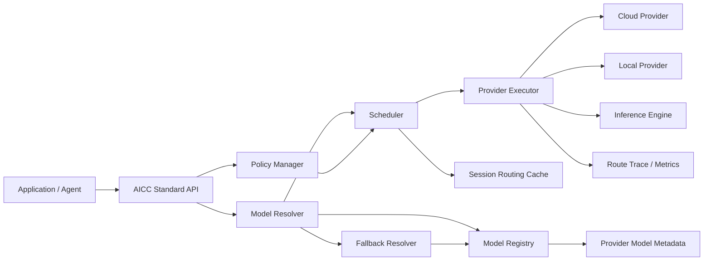
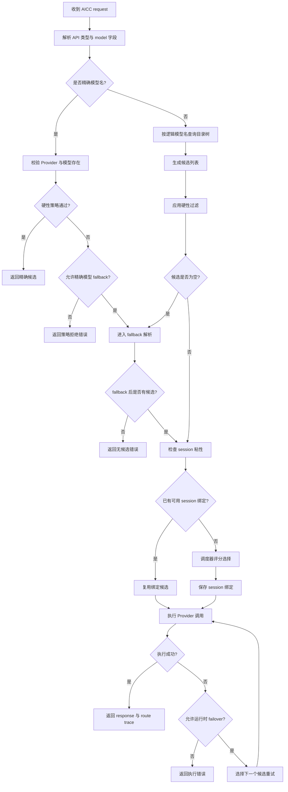

# BuckyOS AICC 模型路由技术需求文档

版本：v0.2 Draft
状态：Review 收敛稿
依据：语音记录整理与补全
适用范围：BuckyOS AICC 新版本模型路由、模型降级、Provider 注册与调度策略

---

## 1. 背景

AICC 的核心职责是为不同类型的 AI 能力定义统一的标准输入输出协议，并通过 Provider 模型接入不同厂商、不同部署形态的 AI 能力。调用方不需要理解各家模型服务的协议差异，只需要选择一个能力函数、传入模型名和标准化 request，即可获得标准化 response。

典型能力包括但不限于：

- LLM 推理与对话生成；
- 文生图、图生图等图像生成能力；
- 摘要、代码、规划等面向任务的 LLM 子能力；
- 云端模型、本地模型、本地推理引擎等不同 Provider 形态。

随着 Provider 数量增加、模型能力变多、用户对成本和可控性的要求提高，原有“能跑即可”的模型名到 Provider 映射方式已经不足以支撑实际使用。调用方开始关心：

1. 一个模型名到底会被路由到哪个 Provider；
2. 多个 Provider 都能提供同一逻辑模型时，应该如何选择；
3. 当目标模型不可用、无候选、超预算、超时或配额耗尽时，如何 fallback；
4. 应用开发者和最终用户分别应该拥有怎样的模型选择控制面；
5. 在 Agent、多步骤任务、Provider cache 优惠和 session 复用场景下，路由粒度应该是 per request 还是 per session。

因此，新版 AICC 需要补全一套可解释、可配置、可扩展的模型路由体系。

本文选择“逻辑目录树 + items 软链接”而不是简单平铺 alias，主要原因是 BuckyOS 的模型选择不是单一“名字到模型”的映射，而是同时服务于多用户、多 Agent 角色、多 Provider、多隐私策略和多成本偏好的组合场景。平铺 alias 适合 `gpt5 -> provider/model` 这类简单映射，但难以表达“规划优先高质量、总结优先低成本、代码允许本地优先、同一模型家族内多个 Provider 可调度”这些层级化意图。目录树的代价是配置语义更复杂，因此本文必须明确权重、覆盖、去重、fallback 和 trace 规则，避免实现和 UI 各自解释。

---

## 2. 目标与非目标

### 2.1 目标

1. **统一模型名体系**：同时支持精确模型名和逻辑模型名，并明确二者语义。
2. **支持多 Provider 常态化注册**：同一个逻辑模型名可以由多个 Provider 同时提供，不再采用抢占式注册。
3. **提供清晰的候选列表生成机制**：将逻辑模型名解析为候选 Provider/精确模型集合。
4. **提供可控 fallback 机制**：候选为空或执行失败时，按规则降级，避免不可预测的无限 fallback。
5. **提供调度策略**：在多个候选者中，基于成本、可用性、延迟、质量、用户策略等因素选择最佳 Provider。
6. **支持 session 粘性**：在同一 session 内优先保持同一 Provider 和精确模型，保证多步任务行为一致性，并尽量利用 Provider 侧 cache 优惠。
7. **提供可解释性**：能回答“为什么这个 request 被路由到了这个 Provider”。
8. **支持应用开发者和最终用户两层控制面**：开发者定义默认模型策略，最终用户可在安全范围内选择或锁定部分模型路径。

### 2.2 非目标

1. 本文不定义各 Provider 的具体协议适配细节。
2. 本文不定义每一种模型能力的完整 request/response schema。
3. 本文不负责制定具体 Provider 的商业定价，只要求 Provider 能提供可供调度器使用的成本估算信息。
4. 本文不强制规定 UI 最终样式，但会定义 UI 需要暴露的模型树和解释信息。

---

## 3. 核心术语

| 术语 | 定义 |
|---|---|
| AICC | BuckyOS 中提供 AI 能力统一调用、Provider 接入和模型路由的组件。 |
| Provider | 本文中默认指 Provider instance，即一个可独立调度和计费的 AI 能力提供实例，而不是厂商本身。`provider_instance_name` 是 Provider instance 的唯一 ID/name。相同厂商可以配置多个 Provider instance，例如两个 OpenAI API token 可以建立 `openai_primary` 和 `openai_backup` 两个 instance。 |
| 精确模型名 | 能唯一指向某个 Provider 下某个模型的名字，如 `gpt5@openai`。通常不需要经过复杂路由。 |
| 实体模型 / 物理模型 | Provider instance 内部真实提供的模型，例如 `gpt-5.2`。它通过 `<provider_model_id>@<provider_instance_name>` 形成全局唯一的精确模型名。 |
| 逻辑模型名 | 面向能力、用途或模型家族的模型名，如 `llm.gpt5`、`llm.plan`、`llm.code`。需要解析为候选精确模型集合。 |
| 模型目录树 | 逻辑模型名构成的树状结构。目录越精细，候选范围越窄；目录越宽，候选范围越大。 |
| 候选列表 | 逻辑模型名解析后得到的一组可执行候选项，每个候选项包含 Provider、精确模型名、能力元数据和动态状态。 |
| Fallback | 当候选为空或执行失败时，按配置选择备用逻辑目录、备用精确模型或备用 fallback 目录。 |
| 调度器 | 在候选列表中，根据硬性过滤和评分规则选择最终 Provider/精确模型的模块。 |
| Session 粘性 | 同一 session 内复用第一次选择的 Provider/精确模型，避免中途切换导致行为不一致，并尽量保留 Provider 侧 cache 优惠。 |
| 控制面 | 应用开发者或最终用户对模型选择、Provider 约束、成本、隐私、本地优先等策略的配置入口。 |

---

## 4. 总体架构



### 4.1 模块职责

| 模块 | 职责 |
|---|---|
| AICC Standard API | 提供统一 AI 能力调用入口，接收模型名和标准化 request。 |
| Model Registry | 管理逻辑模型树、精确模型、Provider 注册关系、能力元数据和 fallback 配置。 |
| Provider Metadata | Provider 声明自身可用模型、能力、价格、配额、健康状态、上下文长度等信息。 |
| Model Resolver | 将输入模型名解析成候选列表。 |
| Fallback Resolver | 在候选为空或执行失败时，根据 fallback 策略扩大或替换候选范围。 |
| Scheduler | 基于策略和评分模型，从候选列表中选择最佳候选。 |
| Session Routing Cache | 保存 session 到精确模型/Provider 的绑定，实现 session 粘性。 |
| Provider Executor | 执行实际 Provider 调用，处理重试、运行时 failover 和错误归一化。 |
| Route Trace / Metrics | 记录路由原因、候选数量、fallback 原因、最终 Provider、成本估算、执行状态等。 |

---

## 5. 模型名体系

### 5.1 精确模型名

精确模型名用于明确指定某个 Provider 下的某个模型。建议格式为：

```text
<provider_model_id>@<provider_instance_name>
```

示例：

```text
gpt5@openai
claude-sonnet@anthropic
qwen3@local
```

解析规则：

1. 以最后一个 `@` 作为分隔符；
2. 最后一段是 Provider instance name，是否已注册必须在路由时校验，不能在纯字符串解析阶段假设 Provider 已完成冷启动注册；
3. Provider instance name 不允许包含 `@`；
4. 前面的部分作为 Provider 内部模型 ID，可包含 Provider 自己的模型命名字符和 `.`；
5. 精确模型名必须结合当前 API 能力类型一起校验，例如 LLM completion、text-to-image 等。
6. Provider 内部模型 ID 强烈不建议包含 `@`。如果厂商原始模型 ID 包含 `@`，Provider 应提供可读 alias 或转义后的 `provider_model_id`，并在 metadata 中保留原始 ID，避免日志、UI 和错误信息难以阅读。

精确模型名语义：

- 表示调用方希望准确无误地选择该 Provider；
- 默认绕过逻辑模型路由；
- 默认不做逻辑 fallback；
- 当 Provider 不可用时，是否允许运行时 fallback 由 request policy 明确控制；
- 对调试、测试、Provider 对比、强制指定供应商场景非常重要。

### 5.2 逻辑模型名

逻辑模型名面向能力、用途或模型家族，不直接绑定某个 Provider。示例：

```text
llm.gpt5
llm.plan
llm.code
llm.chat
llm.swift
llm.summary
llm
image.txt2image.gpt5
```

逻辑模型名语义：

1. 它是模型目录树中的路径；
2. 一个逻辑模型名可以映射到多个 Provider 的精确模型；
3. 一个目录路径可以包含多个子目录和多个模型叶子节点；
4. 逻辑模型名的解析结果是候选列表，不是单个模型；
5. 每次路由时都应重新基于当前 Provider 状态、价格、配额和策略生成候选列表，但 session 粘性会影响最终选择。

### 5.3 精确模型名与逻辑模型名的区别

| 维度 | 精确模型名 | 逻辑模型名 |
|---|---|---|
| 示例 | `gpt5@openai` | `llm.gpt5`、`llm.plan` |
| 是否包含 Provider | 是 | 否 |
| 是否需要路由 | 默认不需要复杂路由 | 需要解析候选并调度 |
| 是否可多 Provider | 否 | 是 |
| 主要用途 | 强制指定、调试、测试、精确控制 | 应用默认配置、用户选择、自动调度、fallback |
| fallback 默认行为 | 不 fallback | 可按配置 fallback |

### 5.4 命名唯一性原则

1. Provider instance 维度唯一性：`<provider_model_id>@<provider_instance_name>` 在 Provider instance 视角下必须唯一。
2. API 类型唯一性：同一个精确模型名可以支持多个 API 类型，但每次 request 必须携带明确的 API 能力类型。
3. 逻辑命名空间唯一性：逻辑模型名必须有能力类型前缀，例如 `llm.*`、`image.txt2image.*`，避免跨 API 类型混淆。
4. 路由可解释性优先：模型名不应为了过度抽象而让用户无法理解最终为何路由到某个 Provider。

---

## 6. 逻辑模型目录树

### 6.1 目录树设计原则

逻辑模型目录树用于表达“调用方想要什么能力”，而不是表达“该能力由谁提供”。目录树设计应遵循：

1. **能力优先**：目录表示任务能力、模型用途或模型家族。
2. **属性不进目录**：本地/云端、隐私级别、价格、延迟等更适合作为候选属性和过滤条件，不应默认成为目录路径。
3. **越具体越窄**：`llm.code` 的候选范围应小于或等于 `llm`。
4. **越宽越可 fallback**：`llm` 可作为更宽泛的兜底目录。
5. **用户可理解**：目录中应保留用户熟悉的模型家族名，例如 `gpt5`，不能只有 `plan`、`swift` 这类抽象别名。
6. **支持 Agent 多角色**：Agent 内部可能同时使用 `plan`、`code`、`summary` 等多个逻辑模型名，UI 和配置应支持对这些角色分别设置策略。

### 6.2 推荐 LLM 目录结构

```text
llm
├── plan       # 规划、复杂推理、最高能力优先
├── code       # 代码生成、代码修改、代码理解
├── chat       # 通用聊天、问答、用户互动
├── swift      # 快速响应、低成本、小模型优先
├── summary    # 文档总结、摘要、压缩上下文
├── fallback   # 可选：专门的兜底模型目录
├── gpt5       # 用户熟悉的模型家族或模型名
├── claude     # 用户熟悉的模型家族或模型名
└── gemini     # 用户熟悉的模型家族或模型名
```

说明：

- `llm.plan` 可以挂载多个高能力模型，例如 `gpt5@openai`、`claude-opus@anthropic`；
- `llm.code` 可以挂载适合编码的模型；
- `llm.swift` 可以挂载 mini、flash、本地小模型等快速模型；
- `llm.summary` 可以挂载摘要型模型，也可以通过属性过滤区分 local summary 和 cloud summary；
- `llm.gpt5` 表示“我要 GPT5 这个逻辑模型/模型家族”，但不指定 Provider；
- `llm` 表示“任何 LLM 候选都可参与调度”，候选范围最大。

### 6.3 属性与目录的区分

以下内容建议作为候选属性，而不是默认目录：

| 属性 | 示例 | 用途 |
|---|---|---|
| 部署位置 | `local`、`cloud` | 隐私、本地优先、离线可用性 |
| 隐私等级 | `private_safe`、`public_cloud` | 决定能否发送到云端 |
| 成本等级 | `low`、`medium`、`high` | 调度评分 |
| 延迟等级 | `fast`、`normal`、`slow` | 调度评分 |
| 能力特性 | `tool_call`、`json_schema`、`vision`、`streaming` | 硬性过滤 |
| 上下文长度 | `128k`、`1m` | 硬性过滤和评分 |
| 质量评分 | `0.0-1.0` | 调度评分 |

示例：用户需要本地摘要时，不建议写成 `llm.summary.local`，而建议：

```json
{
  "model": "llm.summary",
  "policy": {
    "local_only": true
  }
}
```

这样可以避免目录结构膨胀，也能让同一能力目录支持不同控制面策略。

### 6.4 Session 配置与模型挂载职责边界

逻辑目录配置本质上是 session config 的一部分。系统必须先建立一个 `global` session config，作为完整的默认配置；普通 session 可以直接使用 `global`，也可以继承 `global` 或其它 session，并只覆盖少量配置项。

1. **声明式 Provider 能力清单**：每个 Provider instance 通过接口声明自己当前可提供的实体模型，而不是依赖 AICC 静态配置列出模型。实体模型的全局精确模型名由 Provider 内部模型 ID 和 `provider_instance_name` 共同确定，例如 `gpt-5.2@openai_primary`，这样不同 Provider instance 的模型名不会重叠。
2. **目录挂载声明**：Provider instance 在模型声明中列出该真实模型建议挂载到哪些逻辑目录，例如 `gpt-5.2@openai_primary` 挂载到 `llm.gpt5`。Registry 可以把这些声明物化为 `global` session config 中对应目录下的 item。
3. **统一 SessionConfig**：全局目录、用户 session、request 覆盖都使用同一个 `SessionConfig` 结构，不能为全局配置和 session 覆盖发明两套语义。
4. **继承与覆盖**：一个 session 可以声明 `inherit: global`，然后通过相同的 `logical_tree`、`children`、`items`、`item_overrides`、`policy` 字段覆盖父 session 的部分节点。
5. **解析入口统一**：底层实现只需要根据有效 session config 和 request model，解析出最高有效权重相同、可交给调度器继续选择的候选列表；不需要区分“全局目录逻辑”和“session 覆盖逻辑”。

### 6.5 目录树 Item 结构

逻辑模型目录树必须保持“目录树”形态：

1. 每一级都是一个目录，目录下可以通过 `children` 嵌套子目录；
2. 目录下可以通过 `items` 放置候选入口；
3. 每个 item 的核心字段只有两个：`target` 和 `weight`；
4. `target` 是软链接目标，可以是另一个逻辑目录，也可以是精确模型名；
5. `weight` 是该 item 在当前目录下、同级 item 之间的优先级，默认值为 `1.0`；
6. 解析 `target` 时必须维护 visited set，防止目录软链接形成环。

示例：

```yaml
logical_tree:
  llm:
    children:
      plan:
        items:
          gpt5:
            target: llm.gpt5
            weight: 3.0
          claude:
            target: llm.claude
            weight: 2.0
      gpt5:
        items:
          openai_primary:
            target: gpt-5.2@openai_primary
            weight: 1.0
```

当 request model 为 `llm.plan` 时，Resolver 先读取 `llm.plan` 的 items，得到 `llm.gpt5` 和 `llm.claude` 两个软链接目标；再继续展开目标目录，直到得到精确模型候选。`weight` 不沿路径相乘，只在当前目录的同级 item 之间表达“先选哪个分支”。

item 解析规则：

1. `target` 指向逻辑目录时，只展开该目录的 `items`，不会把目录名本身当作候选。
2. `target` 指向精确模型时，该 target 是叶子候选，不会再反向查找该精确模型是否通过 Provider `logical_mounts` 出现在其它目录。
3. 同一精确模型通过多个路径到达时，最终按 `(exact_model, api_type)` 去重；保留优先级最高的路径，优先级相同时保留 trace 中的多路径来源。
4. item `weight = 0` 表示在该目录禁用该 item，等同硬过滤；负数非法，配置校验应拒绝。
5. 一个目录如果显式配置了 `items`，则这些 `items` 完全覆盖 Provider inventory 生成的 default items；如果只想修改默认 item 的权重或禁用某个 default item，应使用 `item_overrides`。

default items 与覆盖规则：

1. Provider inventory 中的 `logical_mounts` 会被 Registry 物化为 default items，生成过程必须是纯函数：给定同一 inventory revision，得到同一组 default items。
2. session config 中的目录 `items` 是完整覆盖，不与 default items merge。
3. session config 中的 `item_overrides` 只 patch default items 或父级继承 items 中同名 item，适合用户只调整 weight、禁用某个 Provider 或替换 target。
4. `items` 和 `item_overrides` 不能在同一个目录节点同时出现；同时出现应返回 `AICC_ROUTE_SESSION_CONFIG_INVALID`。

### 6.6 Provider 挂载建议

Provider inventory 中的 `logical_mounts` 是 Provider 对“自己的真实模型适合挂到哪些目录”的声明。AICC 应区分两类挂载：

1. **常规挂载目录**：鼓励 Provider 挂载到模型家族、模型名或能力清晰的目录，例如 `llm.gpt5`、`llm.claude`、`llm.qwen`、`llm.local`。所有拥有对应模型的 Provider 都可以挂载到同一目录，Registry 保留多候选。
2. **系统默认配置目录**：不鼓励普通 Provider 直接挂载到 `llm.plan`、`llm.code`、`llm.chat` 这类角色目录。AICC 系统默认 session config 应通过目录 item 把著名家族目录软链接到这些角色目录，例如在 `llm.plan` 下配置 `llm.gpt5` 和 `llm.claude`，再通过权重表达默认优先级。

用户通常只需要调整两类位置：

1. 调整家族目录内部的物理模型优先级，例如在 `llm.gpt5` 下调整不同 Provider 的 GPT 模型权重；
2. 调整角色目录对家族目录的优先级，例如在 `llm.plan` 下给 `llm.gpt5` 和 `llm.claude` 设置不同权重。

---

## 7. Provider 注册需求

### 7.1 非抢占式注册

旧设计中，如果某个逻辑位置已被一个 Provider 挂载，其他 Provider 不能再挂载。这不适合新版路由。新版应改为：

1. 同一个逻辑模型名允许多个 Provider 同时注册；
2. 同一个精确模型可以挂载到多个逻辑目录；
3. Registry 返回多候选列表，并将“选择哪个 Provider instance”交给调度器；
4. 多 Provider 是常态，不是异常。

### 7.2 Provider 模型声明

Provider 需要通过声明式接口返回自身当前可提供的模型及其元数据。本文中的 Provider 指 Provider instance；同一厂商、同一实现类型可以创建多个 instance，例如两个 OpenAI API token 可以分别注册为 `openai_primary` 和 `openai_backup`。每个 instance 的 `provider_instance_name` 必须唯一，且不允许包含 `@`。

这份模型列表是 Provider 的运行时能力声明，不是 AICC 的静态配置。AICC Registry 应周期性或按需调用 Provider 的 inventory/metadata 接口刷新能力清单，避免出现“厂商新增或下线模型后必须修改 AICC 配置才能生效”的情况。Provider 可以自行决定自己的能力清单何时更新，例如启动时加载、本地模型安装完成后更新、云端 inventory 变化后更新，或凭据/套餐变化后更新。

建议接口返回 schema：

```yaml
provider_instance_name: openai_primary
version: 1.2.0
models:
  - provider_model_id: gpt-5.2
    exact_model: gpt-5.2@openai_primary
    parameter_scale: unknown
    api_types:
      - llm.completion
      - llm.chat
    logical_mounts:
      - llm.gpt5
    capabilities:
      streaming: true
      tool_call: true
      json_schema: true
      vision: true
      max_context_tokens: 128000
    attributes:
      provider_type: cloud_api
      local: false
      privacy: cloud
      quality_score: 0.95
      latency_class: normal
      cost_class: high
    pricing:
      input_token_usd: 0.0000000
      output_token_usd: 0.0000000
      cache_input_token_usd: 0.0000000
    health:
      status: available
      p95_latency_ms: 3000
      error_rate_5m: 0.01
      quota_state: normal
```

> 价格字段中的数值由 Provider 或配置层提供。本文只定义调度器需要的字段，不定义具体价格。

说明：

1. `provider_model_id` 是 Provider instance 内部的真实模型 ID，可以保留厂商原始命名。
2. `exact_model` 是 Registry 看到的全局精确模型名，推荐由 `<provider_model_id>@<provider_instance_name>` 派生。
3. `parameter_scale` 是模型参数规模声明，例如 `7B`、`72B`、`671B`、`1.8T`；闭源或不可公开参数规模的模型可声明为 `unknown`，但 Provider 应尽量提供公开口径或可比较的规模等级。
4. `logical_mounts` 是目录挂载声明，表示该真实模型可作为哪些逻辑目录的候选。
5. 不同 Provider instance 可以声明相同的 `provider_model_id`，但生成的 `exact_model` 必须不同。
6. `parameter_scale` 默认只用于展示和粗略说明，不直接参与调度评分。质量优先调度必须优先使用 `quality_score`、能力标签、实际评测或管理员配置；当 `parameter_scale = unknown` 时不能推断该模型质量低于或高于本地开源模型。
7. `attributes.provider_type` 由 AICC 注册过程或系统配置确认，可取 `local_inference`、`cloud_api`、`proxy_unknown` 等值。Provider 自己声明的 `attributes.local` 只能作为展示或辅助信息，不能单独作为 `local_only` 判定依据。

### 7.3 动态刷新

Provider 应支持 AICC 定期或按需刷新自身模型列表与动态状态：

1. Provider 对外暴露模型 inventory/metadata 接口，返回当前声明的模型、能力、挂载目录、价格和状态；
2. inventory 接口语义是全量声明：每次成功返回都完整替换该 Provider instance 的模型列表，不做增量 merge；
3. Provider 可以自行决定何时更新自己的能力清单，AICC 不应要求用户修改配置才能发现新增、下线或变化的模型；
4. 当厂商新增或下线模型时，不应要求 AICC 主版本升级，也不应要求修改 AICC 静态配置；
5. 当厂商协议发生破坏性变化时，需要升级 Provider 适配代码；
6. 动态状态包括健康状态、配额、价格模式、延迟、错误率、队列长度等；
7. Provider 可通过事件总线发送 `inventory_changed` 事件，AICC 收到后拉取一次 inventory；AICC 同时保留默认 5 分钟兜底轮询，避免漏事件；
8. 多个事件在短时间内到达时，Registry 应 debounce 合并拉取，避免多个 Provider instance 并行启动时形成请求风暴；
9. 每次成功刷新生成新的 `inventory_revision`，Registry 在事务中切换到新 revision；刷新失败时继续使用上一版可用 inventory 并记录 warning；
10. Registry 应记录元数据更新时间、来源和 `inventory_revision`，避免使用过期状态进行调度。

### 7.4 Provider 注册冲突处理

1. 同一 Provider instance 内不得重复注册同一精确模型名；
2. 不同 Provider instance 不应声明相同 `provider_instance_name`；
3. 同一厂商可以注册多个 Provider instance，但 instance name 必须不同；
4. 多个 Provider instance 可注册同一逻辑模型名；
5. 如果多个 Provider instance 声明了同一 logical mount，Registry 应全部保留；
6. 如果一个 Provider instance 试图注册不符合命名规范的 exact model，应拒绝并记录错误。

---

## 8. 路由流程

### 8.1 总体流程



### 8.2 路由伪代码

```ts
function route(request: AICCRequest): RouteDecision {
  const baseConfig = mergeSessionConfig(globalSessionConfig, appSessionConfig, userSessionConfig);
  const sessionConfig = resolveAndUpdateSessionConfig(
    request.session_id,
    baseConfig,
    request.session_config,
    request.session_config_patch
  );
  const policy = sessionConfig.policy;
  const apiType = request.api_type;
  const modelName = normalize(request.model);

  let candidates: Candidate[] = [];
  let trace = new RouteTrace(modelName, apiType);
  trace.session_config_revision = sessionConfig.revision;
  trace.session_config_updated = sessionConfig.updated;

  if (isExactModelName(modelName)) {
    candidates = resolveExact(modelName, apiType);
    candidates = applyHardFilters(candidates, policy, request);

    if (candidates.length > 0) {
      return chooseExactWithSession(candidates[0], request, policy, trace);
    }

    if (!policy.allow_exact_model_fallback) {
      throw new RouteError("AICC_ROUTE_EXACT_MODEL_UNAVAILABLE", trace);
    }
  } else {
    candidates = resolveLogical(modelName, apiType, sessionConfig);
    candidates = applyHardFilters(candidates, policy, request);

    if (candidates.length > 0) {
      return chooseLogicalWithSessionOrScheduler(candidates, request, policy, trace);
    }
  }

  const fallbackCandidates = resolveFallback(modelName, apiType, policy, request, trace);
  const filteredFallbackCandidates = applyHardFilters(fallbackCandidates, policy, request);

  if (filteredFallbackCandidates.length === 0) {
    throw new RouteError("AICC_ROUTE_NO_CANDIDATE", trace);
  }

  return chooseLogicalWithSessionOrScheduler(filteredFallbackCandidates, request, policy, trace);
}
```

### 8.3 硬性过滤条件

以下条件必须在评分前过滤，不可通过调度分数弥补：

1. API 类型不匹配；
2. Provider 未启用或凭据不可用；
3. 模型不可用、下线或健康状态为不可用；
4. request 所需能力不支持，例如 tool call、JSON schema、vision、streaming；
5. 上下文长度不足；
6. 用户或应用策略禁止该 Provider；
7. `local_only = true` 时候选不是本地 Provider；
8. 隐私策略不允许将数据发送到云端；
9. 预算硬限制会被明显突破；
10. Provider 配额耗尽且不允许超额付费。

---

## 9. Fallback 与降级机制

### 9.1 Fallback 触发条件

Fallback 分为解析期 fallback 和运行时 failover。

解析期 fallback 触发条件：

1. 逻辑模型名解析后候选为空；
2. 候选存在但被硬性策略全部过滤；
3. 精确模型不可用，且 policy 明确允许精确模型 fallback；
4. 目录路径不存在，且 policy 允许按配置 fallback。

运行时 failover 触发条件：

1. Provider 调用超时；
2. Provider 5xx 或服务不可用；
3. Provider 返回配额耗尽；
4. Provider 返回模型临时不可用；
5. 调用失败且 request 可重试；
6. 调用失败且 policy 允许 failover 到下一个候选。

### 9.2 Fallback 模式

建议支持以下 fallback 模式：

| 模式 | 含义 | 示例 |
|---|---|---|
| `strict` | 不 fallback，候选为空即失败。 | 高隐私、强一致性任务。 |
| `parent` | 向上扩大到父目录继续查找。 | `llm.code` 无候选时尝试 `llm`。 |
| `target_exact` | fallback 到指定精确模型。 | `gpt5@openai`。 |
| `target_logical` | fallback 到指定逻辑目录。 | `llm.fallback`。 |
| `disabled` | 显式禁止该节点 fallback。 | 宁可失败，也不串到其他模型。 |

每个目录节点只能配置一种 fallback 模式，`parent`、`target_exact`、`target_logical`、`strict`、`disabled` 互斥。不能表达“先 parent 一级，再 target_logical”的组合；如果需要组合，应显式把上一级目录配置成 `target_logical`，让 fallback chain 通过多个节点串联，且每一步都进入 visited set 检测。

### 9.3 推荐默认策略

1. 对普通逻辑目录，默认允许同 namespace 内的 `parent` fallback；
2. 对安全、隐私、合规、强模型一致性场景，默认使用 `strict` 或 `disabled`；
3. 对全局兜底，推荐配置到专用目录 `llm.fallback` 或指定精确模型；
4. 对精确模型名，默认不 fallback，除非 request policy 明确开启；
5. Fallback 不允许跨 API namespace，例如 `llm.code` 不能 fallback 到 `image.txt2image`；
6. Fallback 过程中必须记录 trace，便于解释最终模型选择。

### 9.4 Fallback 链示例

#### 示例一：向父目录 fallback

请求：

```json
{
  "model": "llm.code",
  "api_type": "llm.chat"
}
```

流程：

1. 查询 `llm.code`，无候选；
2. `llm.code` 未配置专用 fallback；
3. 按 `parent` 模式查询 `llm`；
4. `llm` 下存在候选；
5. 调度器从 `llm` 候选中选择一个 Provider；
6. trace 中记录 `fallback_from = llm.code`、`fallback_to = llm`。

#### 示例二：fallback 到专用目录

配置：

```yaml
logical_tree:
  llm:
    fallback:
      mode: target_logical
      target: llm.fallback
```

请求 `llm.plan` 无候选时：

1. 先查 `llm.plan`；
2. 再查父目录或节点 fallback；
3. 最终落到 `llm.fallback`；
4. 从 `llm.fallback` 候选中调度。

#### 示例三：精确模型不自动 fallback

请求：

```json
{
  "model": "gpt5@openai",
  "api_type": "llm.chat"
}
```

如果 `gpt5@openai` 不可用，默认直接返回错误。只有显式配置：

```json
{
  "policy": {
    "allow_exact_model_fallback": true,
    "fallback": {
      "mode": "target_logical",
      "target": "llm.gpt5"
    }
  }
}
```

才允许 fallback。

### 9.5 防止无限 fallback

必须实现以下保护：

1. Fallback 解析时维护 visited set；
2. 任意 fallback 链最大深度默认不超过 5；
3. 发现环路立即返回 `AICC_ROUTE_FALLBACK_LOOP`；
4. `target_logical` 也必须受 visited set 约束；
5. `target_exact` 是终止节点，不再继续逻辑 fallback，除非运行时 failover policy 另行允许；
6. 所有 fallback 必须保持同一 API namespace。

---

## 10. 调度策略

### 10.1 调度目标

当一个逻辑模型名解析出多个候选时，调度器需要选择一个最合适的候选。默认目标是：

1. 先满足硬性要求；
2. 在能力足够的候选中优先低成本；
3. 避免不可用、延迟过高或近期错误率高的 Provider；
4. 尽量复用 session 中已有 Provider；
5. 保持选择结果可解释。

### 10.2 调度输入

调度器输入包括：

- 候选列表；
- request 估算信息，例如输入 token、预估输出 token、是否可命中 cache；
- 应用策略；
- 用户策略；
- Provider 动态状态；
- session 绑定状态；
- 历史指标，例如 p95 latency、error rate、recent failures；
- budget 和 quota 状态。

### 10.3 硬过滤 + 软评分

调度分两阶段：

1. **硬过滤**：不满足硬性条件的候选直接剔除；
2. **软评分**：对剩余候选计算综合分，选择分数最优者。

示例评分公式：

```text
score =
  W_cost       * normalized_cost
+ W_latency    * normalized_latency
+ W_reliability* normalized_failure_risk
+ W_quality    * (1 - normalized_quality)
+ W_preference * preference_penalty
+ W_cache      * cache_miss_penalty
```

说明：

- 分数越低越优；
- 不同 profile 可调整权重；
- 成本优先是默认 profile；
- 质量分不应替代硬性能力过滤；
- session 命中时通常直接复用，不再重新评分，除非绑定候选不可用或不再满足当前权重优先级；
- `cache_miss_penalty` 只表达“切换 Provider/精确模型会损失本 session 的行为一致性和可能的 prompt cache 优惠”的离散偏好，不直接声称能命中本地推理引擎的 KV cache。若未来要使用真实 cache hit rate，必须由 Provider executor 暴露独立指标。

### 10.4 候选权重与公平调度

权重用于表达用户或系统的优先级偏好，但目录 item 权重不做路径乘法。每一级目录的 `items.*.weight` 只在该目录的同级 item 之间比较，语义是“这个目录下先选哪个分支”；被选中分支内部的权重只在该分支内部继续比较，不能反向放大父目录权重。

调度顺序：

1. 展开逻辑目录，收集所有不成环的候选路径，并按 `(exact_model, api_type)` 去重；
2. 对候选执行硬过滤，去掉不可用、能力不匹配、策略禁止、预算明显超限、被 weight 0 禁用的候选；
3. 从请求目录开始，按目录层级逐级选择同级 item 中最高 `weight` 且仍有可用叶子候选的分支；同级最高权重相同则全部保留；
4. 进入被保留的目标目录后重复第 3 步，直到剩下精确模型叶子候选；
5. 对叶子候选应用精确模型权重，保留最高精确模型权重候选；
6. 如果仍有多个候选，再按当前调度 profile 评分；
7. 如果 session 粘性命中且绑定候选仍满足硬过滤和当前权重优先级，可优先复用；否则必须重新选择。

权重来源：

| 权重来源 | 默认值 | 生效范围 | 说明 |
|---|---:|---|---|
| 目录 item 权重 | `1.0` | 当前逻辑目录的同级 item | 表达当前目录下哪个分支优先，不向下相乘。 |
| Session 全局精确模型权重 | `1` | 当前 session config 中已经成为候选的精确模型 | 调整同一候选集合内的物理模型偏好，不会把模型加入不包含它的目录。 |
| 目录精确模型权重 | 继承全局精确模型权重 | 当前目录解析结果中的精确模型 | 用于在某个角色目录中偏好或禁用特定 Provider instance。 |
| 继承覆盖结果 | 继承父级 | 当前 session config | 用户显式权重会先合并进当前 session config，再参与同一套权重计算。 |

目录节点可以使用 `exact_model_weights` 覆盖全局精确模型权重：

```yaml
logical_tree:
  llm:
    children:
      plan:
        exact_model_weights:
          claude-sonnet@anthropic: 2.0
          gpt-5.2@openai_backup: 0
```

权重规则：

1. `items.*.weight = 0` 表示禁用该 item；`exact_model_weights.<exact_model> = 0` 表示在该作用域硬过滤该精确模型。
2. 负数权重非法，session config 校验必须拒绝。
3. `global_exact_model_weights` 和目录级 `exact_model_weights` 只对已经通过当前逻辑目录展开得到的候选生效，不会把精确模型加入候选集合。
4. 目录级 `exact_model_weights` 优先级高于 `global_exact_model_weights`；未配置时继承全局值；全局也未配置时默认 `1`。
5. 权重不绕过硬过滤。高权重模型如果不可用、能力不匹配、被隐私策略禁止或预算硬限制拒绝，仍必须被过滤。

Worked example：

```yaml
logical_tree:
  llm:
    children:
      plan:
        items:
          gpt5:   { target: llm.gpt5,   weight: 3.0 }
          claude: { target: llm.claude, weight: 2.0 }
      code:
        items:
          gpt5:   { target: llm.gpt5,   weight: 1.0 }
          claude: { target: llm.claude, weight: 2.0 }
      gpt5:
        items:
          openai_primary: { target: gpt-5.2@openai_primary, weight: 1.0 }
          openai_backup:  { target: gpt-5.2@openai_backup,  weight: 1.0 }
      claude:
        items:
          anthropic: { target: claude-sonnet@anthropic, weight: 5.0 }
```

- 请求 `llm.plan` 时，第一层先比较 `gpt5 = 3.0` 和 `claude = 2.0`，选择 `llm.gpt5`；`llm.claude` 内部的 `weight = 5.0` 不会乘到 plan 路径上，因此不会超过 plan 对 GPT 家族的偏好。
- 进入 `llm.gpt5` 后，`openai_primary` 和 `openai_backup` 同为 `1.0`，二者进入精确模型权重与 profile 评分阶段。
- 请求 `llm.code` 时，第一层选择 `llm.claude`，然后 `claude-sonnet@anthropic` 成为叶子候选。
- 如果 `llm.plan` 的 GPT 候选全部被硬过滤，Resolver 会回到同级中仍有可用叶子的最高权重分支，此时可选择 `llm.claude`。

### 10.5 调度 Profile

| Profile | 目标 | 典型场景 |
|---|---|---|
| `cost_first` | 成本优先，能力相近时选最低成本。 | 默认配置、大多数用户场景。 |
| `latency_first` | 延迟优先，快速返回。 | UI 交互、实时助手、低延迟任务。 |
| `quality_first` | 能力和质量优先。 | 复杂推理、规划、代码生成。 |
| `balanced` | 成本、延迟、质量均衡。 | 通用 Agent。 |
| `local_first` | 本地优先，云端作为可选 fallback。 | 隐私、离线、边缘计算。 |
| `strict_local` | 只允许本地 Provider。 | 高隐私任务。 |

### 10.6 成本模型需求

成本优先是重要默认策略，但成本并不总是简单的 token 单价。调度器需要支持：

1. 按输入 token、输出 token、cached token 分别估算；
2. 支持包月、免费额度、阶梯价格、超额价格；
3. 支持 Provider 返回当前 quota 与剩余额度；
4. 包月模型不应简单视为零成本，否则会导致不可控倾斜；
5. 可配置“有效边际成本”和“成本地板值”；
6. 当包月额度用尽且进入超额价格时，应动态调整候选评分；
7. 如果 Provider 暴露 `CostEstimateOutput` 接口，调度器必须以该接口返回值作为成本评分唯一来源；
8. inventory 中的 `pricing` 只作为 UI 展示和 cost estimate 缺失时的静态 fallback，不应与动态 cost estimate 同时参与评分；
9. `cost_class` 是展示字段和最后兜底分类，不参与正常调度评分；
10. Provider 无法提供动态成本估算时，应使用管理员配置默认成本或静态 `pricing`，再退化到 `cost_class` 映射。

建议 Provider 暴露：

```ts
interface CostEstimateInput {
  api_type: string;
  model: string;
  input_tokens: number;
  estimated_output_tokens?: number;
  cached_input_tokens?: number;
  request_features?: string[];
}

interface CostEstimateOutput {
  estimated_cost_usd: number;
  pricing_mode: "per_token" | "subscription" | "free_quota" | "unknown";
  quota_state: "normal" | "near_limit" | "exhausted" | "unknown";
  confidence: number;
}
```

### 10.7 可用性与延迟模型

调度器应使用 Provider 动态健康状态：

| 指标 | 用途 |
|---|---|
| `status` | unavailable 时硬过滤。 |
| `p50_latency_ms` | 延迟评分。 |
| `p95_latency_ms` | 延迟评分和异常保护。 |
| `error_rate_5m` | 可靠性评分。 |
| `recent_failures` | 临时降权或熔断。 |
| `queue_depth` | 本地推理或共享服务排队评分。 |
| `quota_state` | 配额耗尽时硬过滤或降权。 |

### 10.8 熔断与恢复

1. Provider 连续失败达到阈值后进入短期熔断；
2. 熔断期间候选应被硬过滤或高额降权；
3. 熔断到期后允许少量探测流量；
4. 恢复成功后逐步恢复权重；
5. 熔断状态必须写入 metrics 和 trace。

---

## 11. Session 粘性与行为一致性

### 11.1 为什么需要 session 粘性

LLM 调用不是完全独立的 per request 场景。对于多轮对话、Agent loop、工具调用、多步骤规划等任务，同一 session 中频繁切换 Provider 会带来问题：

1. 不同 Provider 行为差异导致任务一致性下降，例如风格、tool call 格式、JSON schema 严格度和错误恢复方式变化；
2. 中间步骤不可控，用户难以理解；
3. 一些 SaaS Provider 的 prompt cache 基于 prompt 前缀和 Provider 侧策略，保持同一 Provider 更容易获得价格或延迟优惠；
4. 本地推理引擎的 KV cache 通常是 per-process 或 per-runtime 能力，主要由 Provider executor 内部路由决定；AICC session 粘性只能提供上层稳定性，不能保证命中本地 KV cache。

因此，LLM 类型 request 默认应以 session 为路由粒度，而不是每次 request 都重新选择 Provider。

### 11.2 Session ID 要求

AICC 应鼓励或要求所有 request 提供 session ID：

```json
{
  "model": "llm.plan",
  "session_id": "agent-run-2026-04-24-001"
}
```

如果上层没有显式 session ID，AICC 可以生成隐式 session ID。建议输入包括：

- app id；
- user id 或匿名用户维度；
- API type；
- 逻辑模型名；
- system prompt 前缀 hash；
- tool schema hash；
- agent run id 或 request group id。

注意：

1. 隐式 session ID 不应记录原始 prompt，只记录 hash；
2. 隐式 session ID 只能作为 cache 和粘性优化，不应替代业务 session；
3. 对一次性任务可关闭 session 粘性；
4. 对 Agent 内部多步骤任务，应在 agent run 开始时创建 session，在 run 结束后释放。

### 11.3 Session 绑定规则

1. 第一次路由成功后，将 `session_id + logical_model_name + api_type` 绑定到精确模型和 Provider；
2. 后续同一 session、同一逻辑模型名、同一 API 类型优先复用绑定；
3. 如果绑定候选仍满足硬性策略，则直接复用；
4. 如果绑定候选不可用，可按运行时 failover policy 选择下一个候选；
5. 运行时 failover 导致 Provider 改变时，必须记录 trace；
6. session 绑定应有 TTL，避免长期占用过期状态；
7. 应支持显式结束 session 或清理 session route cache。

### 11.4 Session Config 状态与更新规则

同一 `session_id` 下，路由配置不是一次性 request 参数，而是 session 路由状态的一部分。AICC 应维护 `session_id -> session_config` 的状态机。`global` session 是系统默认的完整 session config，所有未显式声明继承关系的 session 都等价于继承 `global`。

1. request 携带 `session_id` 和完整 `session_config` 时，必须用本次配置重新定义该 session；
2. request 携带 `session_id` 和 `session_config_patch` 时，必须在当前 session config 或其父 session config 基础上应用 patch，并保存新的 session config；
3. request 携带 `session_id` 但不携带 `session_config` 或 `session_config_patch` 时，必须复用同一 session 上一次保存的 session config；
4. 同一 session 第一次 request 如果未携带任何 session config，则使用 `global` session config；
5. session config 更新应生成新的 `session_config_revision`，route trace 应记录本次使用的 revision；
6. 如果 session config 更新影响候选集合、目录替换或权重，已有 session route binding 必须重新校验；不满足新 config 的绑定不能继续复用；
7. 显式结束 session 时，应同时清理 session route binding 和 session config；
8. 隐式 session ID 也可以保存 session config，但 TTL 应更短，避免长期保留用户临时偏好。

Session config 主要用于在不修改持久配置文件的情况下，临时调整当前 session 的逻辑模型视图。它和 `global` session 使用同一套 schema：`logical_tree`、`children`、`items`、`policy`、`fallback` 等字段在全局配置和 session 配置中含义完全一致。

并发与一致性规则：

1. session config 更新必须是事务性的：先在内存中合并 patch、校验 schema、校验逻辑目录环、校验 fallback 环、校验 locked policy，再保存新 revision；任意字段非法时整个 patch 拒绝，session 状态保持不变。
2. request 可携带 `expected_session_config_revision`。如果当前 revision 不匹配，更新请求必须返回 `AICC_ROUTE_SESSION_CONFIG_CONFLICT`，调用方重新读取后再提交。
3. 未携带 `expected_session_config_revision` 的 patch 使用 last-write-wins，但 trace 必须记录旧 revision 和新 revision，便于调试并发覆盖。
4. 同一 `session_id` 的并发更新必须按 session 维度串行提交；可以并发路由读，但写提交必须有明确顺序。
5. session config TTL 过期被清理后，下一次同 `session_id` 请求等价于新 session。如果请求携带旧的 `expected_session_config_revision`，必须返回 `AICC_ROUTE_SESSION_CONFIG_EXPIRED`，而不是静默重置。
6. revision 应包含单调递增序号或不可复用 token，过期后新建的同名 session 不能复用旧 revision 字符串。

### 11.5 Per request 与 per session 的关系

| 能力类型 | 默认路由粒度 | 说明 |
|---|---|---|
| LLM chat/completion | per session | 优先支持行为一致性，并尽量利用 Provider 侧 cache。 |
| Agent loop 内部 LLM 调用 | per agent run/session | 用户无法逐步干预，应保持稳定。 |
| 文生图 | per request | 通常 stateless，可每次重新调度。 |
| 摘要任务 | per request 或 per session | 长文分段摘要建议 per session。 |
| Embedding | per request | 但批处理可绑定 Provider。 |

---

## 12. 控制面设计

### 12.1 应用开发者控制面

应用开发者需要定义默认模型策略，包括：

1. 应用内部使用哪些逻辑模型名；
2. 每个逻辑模型名对应的 fallback 策略；
3. Provider 硬约束或组织级安全限制；
4. 成本、质量、延迟偏好；
5. 是否允许云端；
6. 是否允许用户覆盖；
7. 精确模型 fallback 是否允许；
8. session 粘性策略；
9. 预算和 quota 限制。

示例：

```yaml
app_session_configs:
  agent_default:
    inherit: global
    policy:
      profile: cost_first
      allow_user_override: true
      blocked_provider_instances: []
    logical_tree:
      llm:
        children:
          plan:
            policy:
              profile: quality_first
            fallback:
              mode: target_logical
              target: llm.fallback
          code:
            policy:
              profile: balanced
            fallback:
              mode: parent
          summary:
            policy:
              profile: cost_first
              local_first: true
```

### 12.2 最终用户控制面

最终用户通常不应该被迫理解 Provider 细节，但应该能控制常见偏好：

1. 选择模型家族，例如 GPT、Claude、Gemini、本地模型；
2. 选择偏好：省钱、最快、最高质量、本地优先；
3. 对某些任务锁定模型，例如代码任务使用某模型；
4. 控制是否允许使用云端；
5. 控制预算上限；
6. 查看当前任务最终用了哪个 Provider。

对于 Agent 场景，UI 不应只提供“选一个模型”的单一入口，而应能暴露 Agent 内部角色映射，例如：

| Agent 角色 | 默认逻辑模型 | 用户可选项 |
|---|---|---|
| 规划 | `llm.plan` | 高质量模型、GPT 家族、Claude 家族、本地高能力模型 |
| 编码 | `llm.code` | 代码模型、GPT 家族、本地代码模型 |
| 总结 | `llm.summary` | 低成本模型、本地模型 |
| 快速问答 | `llm.swift` | mini/flash/本地小模型 |

### 12.3 Request 级策略覆盖

标准 request 可携带 session config 或 session config patch。带 `session_id` 的 request 如果传入 `session_config` 或 `session_config_patch`，本次配置会更新该 session；后续同一 `session_id` 不再传配置时，会继续复用上一次保存的 session config。

Request 级配置不应发明独立的 override 语义，而应使用和 `global` session 完全相同的 `SessionConfig` schema。典型能力包括：

1. 重新定义一个完整 session config；
2. 继承已有 session config，并只 patch 某些节点；
3. 调整某个精确模型的全局权重；
4. 调整某个逻辑目录内 item 的 `target` 或 `weight`；
5. 通过 item 的 `target` 将某个目录入口软链接到另一个逻辑目录或精确模型；
6. 设置成本、隐私、fallback、failover、explain 等运行策略。

```json
{
  "api_type": "llm.chat",
  "model": "llm.plan",
  "session_id": "agent-run-001",
  "session_config_patch": {
    "inherit": "global",
    "global_exact_model_weights": {
      "gpt-5.2@openai_primary": 2
    },
    "logical_tree": {
      "llm": {
        "children": {
          "plan": {
            "items": {
              "gpt5": {
                "target": "llm.gpt5",
                "weight": 4.0
              },
              "claude": {
                "target": "llm.claude",
                "weight": 2.0
              }
            },
            "fallback": {
              "mode": "parent"
            }
          },
          "code": {
            "items": {
              "gpt5": {
                "target": "llm.gpt5",
                "weight": 3.0
              },
              "local": {
                "target": "llm.local",
                "weight": 1.0
              }
            }
          }
        }
      }
    },
    "policy": {
      "profile": "quality_first",
      "local_only": false,
      "max_estimated_cost_usd": 0.05,
      "allow_fallback": true,
      "allow_exact_model_fallback": false,
      "runtime_failover": true,
      "explain": true
    }
  },
  "request": {
    "messages": []
  }
}
```

字段说明：

- `session_config`：完整定义当前 session config，不再继承旧 session 内容，除非显式设置 `inherit`。
- `session_config_patch`：在父 session 或当前 session config 基础上应用局部覆盖，未出现的字段保持继承结果不变。
- `inherit`：指定父 session config，例如 `global`、某个应用 session 或用户 session。
- `logical_tree`：和 global session 使用同一结构；每一级目录通过 `children` 嵌套子目录，通过 `items` 放置候选入口。
- `items`：目录下的软链接入口，每个 item 只需要 `target` 和 `weight`；`target` 可以是另一个逻辑目录或精确模型。
- `weight`：item 在当前目录下的权重，默认 `1.0`；用户调整优先级时通常只需要改这个字段。
- `global_exact_model_weights`：调整精确模型在当前 session config 中的全局权重；只影响已经由当前逻辑目录展开得到的候选，且不会覆盖目录 item 的分支优先级。
- Provider 级别的允许/禁止列表仍可作为安全或组织策略存在，但不应作为用户选择模型的主要表达方式。

配置合并优先级建议：

```text
global session config < 应用 session config < 用户 session config < 当前 session config < request session_config_patch
```

带 `session_id` 的 request session config patch 会写回当前 session config；不带配置的后续 request 使用已保存的 session config。安全策略、隐私策略、组织策略可以设置为不可被下级覆盖。

不可覆盖策略使用字段级 lock 表达：

```yaml
policy:
  local_only:
    value: true
    locked: true
  blocked_provider_instances:
    value: [openai_backup]
    locked: true
```

合并后传给调度器的有效 policy 可以展开成普通值，但配置合并阶段必须保留 lock 元数据。下级 patch 如果尝试修改 `locked: true` 的字段，应拒绝整个 patch 并返回 `AICC_ROUTE_POLICY_LOCKED`，不能静默忽略。

---

## 13. 可解释性与 Trace

### 13.1 Trace 目标

用户和开发者需要知道：

1. 请求的模型名是什么；
2. 是否被识别为精确模型名或逻辑模型名；
3. 解析出多少候选；
4. 哪些候选被过滤，原因是什么；
5. 是否发生 fallback；
6. 为什么最终选择某个 Provider；
7. 是否命中 session 粘性；
8. 是否发生运行时 failover；
9. 本次使用的 session config revision；
10. 成本估算和实际执行情况。

### 13.2 Route Trace Schema

```ts
interface RouteTrace {
  request_id: string;
  session_id?: string;
  session_config_revision?: string;
  session_config_updated: boolean;
  api_type: string;
  requested_model: string;
  requested_model_type: "exact" | "logical";
  resolved_logical_path?: string;
  selected_exact_model: string;
  selected_provider_instance_name: string;
  candidate_count_before_filter: number;
  candidate_count_after_filter: number;
  filtered_candidates?: Array<{
    exact_model: string;
    provider_instance_name: string;
    reason: string;
  }>;
  ranked_candidates?: Array<{
    exact_model: string;
    provider_instance_name: string;
    priority_path: number[];
    exact_model_weight: number;
    final_score?: number;
    selected: boolean;
  }>;
  fallback_applied: boolean;
  fallback_chain?: Array<{
    from: string;
    to: string;
    reason: string;
  }>;
  session_sticky_hit: boolean;
  scheduler_profile: string;
  score_breakdown?: {
    cost: number;
    latency: number;
    reliability: number;
    quality: number;
    preference: number;
    cache: number;
    final_score: number;
  };
  estimated_cost_usd?: number;
  runtime_failover_count: number;
  user_summary?: UserFacingRouteSummary;
  warnings?: string[];
}

interface UserFacingRouteSummary {
  display_name: string;
  model_family: string;
  provider_origin: "cloud" | "local" | "proxy_unknown";
  reason_short: string;
  was_fallback: boolean;
  was_failover: boolean;
}
```

`ranked_candidates` 只在 `policy.explain = true` 或开发模式返回，用于解释“为什么没选另一个候选”。生产默认 trace 可以省略该字段。`user_summary` 由后端根据 RouteTrace 和固定模板派生，UI 不应自行解析 `score_breakdown` 来生成用户可见文案。`reason_short` 必须来自预设模板，例如“按最高质量策略选择”“同优先级内成本最低”“命中 session 绑定”“高隐私策略只允许本地 Provider”。

### 13.3 Trace 暴露方式

1. 默认在 response metadata 中返回简要 trace；
2. 开发模式或 `policy.explain = true` 时返回详细 trace；
3. 生产环境可只记录服务端日志，避免泄露 Provider 策略细节；
4. UI 可展示“使用了哪个模型/Provider”和“为何选择”。

---

## 14. 错误码

| 错误码 | 含义 | 建议处理 |
|---|---|---|
| `AICC_ROUTE_INVALID_MODEL_NAME` | 模型名格式非法。 | 提示用户或开发者修正。 |
| `AICC_ROUTE_MODEL_NOT_FOUND` | 精确模型或逻辑目录不存在。 | 检查 Provider 注册和逻辑目录配置。 |
| `AICC_ROUTE_NO_CANDIDATE` | 解析和 fallback 后仍无候选。 | 调整 fallback、放宽策略或安装 Provider。 |
| `AICC_ROUTE_POLICY_REJECTED` | 候选被策略全部过滤。 | 检查 local_only、逻辑覆盖、权重、预算、能力要求。 |
| `AICC_ROUTE_FALLBACK_LOOP` | fallback 链存在环。 | 修正 fallback 配置。 |
| `AICC_ROUTE_LOGICAL_TREE_LOOP` | 目录 item 的软链接目标形成环。 | 修正 `items.*.target` 指向。 |
| `AICC_ROUTE_SESSION_CONFIG_INVALID` | session config 或 patch schema 非法。 | 修正字段、权重、items 覆盖方式或 fallback 模式。 |
| `AICC_ROUTE_SESSION_CONFIG_CONFLICT` | `expected_session_config_revision` 与当前 revision 不匹配。 | 重新读取当前 session config 后重试。 |
| `AICC_ROUTE_SESSION_CONFIG_EXPIRED` | session config 已过期清理。 | 按新 session 重新提交完整配置或移除旧 revision 条件。 |
| `AICC_ROUTE_POLICY_LOCKED` | patch 尝试覆盖被上级锁定的策略字段。 | 去掉下级覆盖或调整组织策略。 |
| `AICC_ROUTE_EXACT_MODEL_UNAVAILABLE` | 精确模型不可用且不允许 fallback。 | 启用 fallback 或更换精确模型。 |
| `AICC_ROUTE_PROVIDER_UNAVAILABLE` | Provider 不可用。 | 运行时 failover 或返回错误。 |
| `AICC_ROUTE_BUDGET_EXCEEDED` | 成本估算超过预算硬限制。 | 降低模型规格或提高预算。 |
| `AICC_ROUTE_CONTEXT_TOO_LONG` | 候选上下文长度不足。 | 选择长上下文模型或压缩输入。 |
| `AICC_ROUTE_FEATURE_UNSUPPORTED` | 候选不支持 request 所需能力。 | 更换模型或关闭相关特性。 |

---

## 15. 配置示例

### 15.1 Global Session 配置

```yaml
session_configs:
  global:
    inherit: null
    policy:
      profile: cost_first
      allow_fallback: true
      runtime_failover: true
    global_exact_model_weights:
      gpt-5.2@openai_primary: 2
    logical_tree:
      llm:
        fallback:
          mode: target_logical
          target: llm.fallback
        children:
          plan:
            items:
              gpt5:
                target: llm.gpt5
                weight: 3.0
              claude:
                target: llm.claude
                weight: 2.0
            fallback:
              mode: parent
          code:
            items:
              gpt5:
                target: llm.gpt5
                weight: 2.0
              local:
                target: llm.local
                weight: 1.0
            fallback:
              mode: parent
          chat:
            fallback:
              mode: parent
          swift:
            fallback:
              mode: target_logical
              target: llm.fallback
          summary:
            fallback:
              mode: parent
          fallback:
            fallback:
              mode: disabled
            items:
              local:
                target: llm.local
                weight: 1.0
          gpt5:
            items:
              openai_primary:
                target: gpt-5.2@openai_primary
                weight: 1.0
              openai_backup:
                target: gpt-5.2@openai_backup
                weight: 1.0
          claude:
            items:
              anthropic:
                target: claude-sonnet@anthropic
                weight: 1.0
          local:
            items:
              qwen:
                target: qwen3@local
                weight: 1.0
```

说明：

- `global` session 是系统默认完整配置，其它 session 默认继承它。
- Provider inventory 声明中的 `logical_mounts` 可作为生成 default items 的输入；显式写在 session config 中的 `items` 会完整覆盖 default items，局部修改使用 `item_overrides`。
- `global_exact_model_weights` 只对已经出现在当前候选集合中的精确模型生效，不会把模型加入候选集合。
- `items.*.weight` 只在当前逻辑目录的同级 item 中比较；上例中 `llm.plan` 目录下 `llm.gpt5` 优先于 `llm.claude`，但 `llm.gpt5` 内部 Provider 权重不会乘到 `llm.plan` 权重上。
- 权重只决定优先级；同优先级候选仍由调度 profile 决定。

### 15.2 Provider Inventory 声明示例

下面示例表示 Provider instance 的 inventory/metadata 接口返回内容，不是 AICC 静态配置。AICC Registry 可以定期或按需刷新该接口，获得 Provider 当前声明的模型能力。

```yaml
providers:
  - provider_instance_name: openai_primary
    models:
      - provider_model_id: gpt-5.2
        exact_model: gpt-5.2@openai_primary
        parameter_scale: unknown
        api_types: [llm.chat, llm.completion]
        logical_mounts: [llm.gpt5]
        capabilities:
          tool_call: true
          json_schema: true
          streaming: true
          max_context_tokens: 128000
        attributes:
          provider_type: cloud_api
          local: false
          privacy: cloud
          quality_score: 0.95
          latency_class: normal
          cost_class: high

  - provider_instance_name: openai_backup
    models:
      - provider_model_id: gpt-5.2
        exact_model: gpt-5.2@openai_backup
        parameter_scale: unknown
        api_types: [llm.chat, llm.completion]
        logical_mounts: [llm.gpt5]
        capabilities:
          tool_call: true
          json_schema: true
          streaming: true
          max_context_tokens: 128000
        attributes:
          provider_type: cloud_api
          local: false
          privacy: cloud
          quality_score: 0.93
          latency_class: normal
          cost_class: high

  - provider_instance_name: anthropic
    models:
      - provider_model_id: claude-sonnet
        exact_model: claude-sonnet@anthropic
        parameter_scale: unknown
        api_types: [llm.chat, llm.completion]
        logical_mounts: [llm.claude]
        capabilities:
          tool_call: true
          json_schema: true
          streaming: true
          max_context_tokens: 200000
        attributes:
          provider_type: cloud_api
          local: false
          privacy: cloud
          quality_score: 0.94
          latency_class: normal
          cost_class: high

  - provider_instance_name: local
    models:
      - provider_model_id: qwen3
        exact_model: qwen3@local
        parameter_scale: 32B
        api_types: [llm.chat, llm.completion]
        logical_mounts: [llm.local]
        capabilities:
          tool_call: false
          json_schema: true
          streaming: true
          max_context_tokens: 32000
        attributes:
          provider_type: local_inference
          local: true
          privacy: local
          quality_score: 0.72
          latency_class: fast
          cost_class: low
```

### 15.3 调度 Profile 配置

```yaml
scheduler_profiles:
  cost_first:
    weights:
      cost: 0.55
      latency: 0.15
      reliability: 0.15
      quality: 0.10
      preference: 0.05
      cache: 0.10

  quality_first:
    weights:
      cost: 0.15
      latency: 0.10
      reliability: 0.20
      quality: 0.50
      preference: 0.05
      cache: 0.10

  latency_first:
    weights:
      cost: 0.20
      latency: 0.45
      reliability: 0.20
      quality: 0.10
      preference: 0.05
      cache: 0.10
```

### 15.4 Worked Examples

#### 用户简单调用

请求 `model = llm.gpt5`：

1. Resolver 展开 `llm.gpt5`，得到 `gpt-5.2@openai_primary` 和 `gpt-5.2@openai_backup`；
2. 两个 Provider 都通过硬过滤；
3. `llm.gpt5` 内两个 item 权重相同，进入 profile 评分；
4. `cost_first` 选择动态成本更低且健康状态正常的候选；
5. trace 返回 selected exact model、Provider instance、成本估算和 `user_summary`。

#### Agent 多角色

同一 agent run 使用同一个 `session_id`，但分别调用 `llm.plan`、`llm.code`、`llm.summary`：

1. `llm.plan` 的目录权重先在 GPT/Claude 等家族之间选择；
2. `llm.code` 可独立选择更适合代码的家族；
3. `llm.summary` 可用 `local_first` 或目录级 `exact_model_weights` 降低成本；
4. session route binding 的 key 包含 `session_id + logical_model_name + api_type`，因此三个角色可以各自粘到不同 Provider。

#### 本地优先

请求 `llm.summary` 并设置 `policy.local_only.value = true`：

1. 硬过滤阶段只保留 `provider_type = local_inference` 的候选；
2. Provider inventory 自己声明的 `attributes.local = true` 不足以通过过滤；
3. 如果没有本地候选，返回 `AICC_ROUTE_NO_CANDIDATE` 或 `AICC_ROUTE_POLICY_REJECTED`；
4. fallback 后仍必须再次执行同样的本地硬过滤。

#### 配额耗尽 fallback

请求 `llm.plan`，首选 Provider 返回 quota exhausted：

1. Executor 记录运行时失败；
2. 如果 `runtime_failover = true` 且 request 可重试，从同一优先级候选或 fallback 后候选中选择下一个；
3. 如果 failover 导致 Provider 改变，trace 标记 `was_failover = true`；
4. session binding 必须更新或标记为临时 failover，避免后续请求继续命中已耗尽 Provider。

#### 精确模型显式指定

请求 `model = gpt-5.2@openai_primary`：

1. AICC 按最后一个 `@` 解析字符串；
2. 路由时校验 Provider instance 是否已注册、模型是否支持当前 API type；
3. 默认不进入逻辑 fallback，也不使用目录权重；
4. 如果不可用且未开启 `allow_exact_model_fallback`，返回 `AICC_ROUTE_EXACT_MODEL_UNAVAILABLE`。

---

## 16. 功能需求清单

### 16.1 P0 必须实现

| 编号 | 需求 | 验收标准 |
|---|---|---|
| R-001 | 支持精确模型名解析。 | `gpt5@openai` 可直接解析到 Provider instance `openai` 的模型 `gpt5`。 |
| R-002 | 支持逻辑模型名目录树。 | `llm.code`、`llm.plan`、`llm` 可作为不同粒度目录解析；目录 item 可通过 `target` 软链接到其它目录或精确模型。 |
| R-003 | 支持同一逻辑模型名多 Provider instance 挂载。 | 多个 Provider instance 通过 `logical_mounts` 挂载到 `llm.gpt5` 后，Registry 返回多个候选。 |
| R-004 | 支持 Provider 声明式模型元数据。 | Provider 可通过 inventory/metadata 接口声明实体模型、参数规模、目录挂载、能力、属性、价格、健康状态；AICC 不通过静态配置维护 Provider 模型列表。 |
| R-005 | 支持候选列表生成。 | 输入逻辑模型名可生成符合 API 类型的候选集合。 |
| R-006 | 支持硬性过滤。 | 不满足本地、隐私、能力、上下文、预算等条件的候选被剔除。 |
| R-007 | 支持 fallback 策略。 | 候选为空时可按 parent、target_exact、target_logical 或 strict 处理。 |
| R-008 | 支持 fallback 环路检测。 | 环形 fallback 配置返回 `AICC_ROUTE_FALLBACK_LOOP`。 |
| R-009 | 支持权重优先、同优先级 profile 调度。 | 多候选时先按目录内同级权重和精确模型权重形成最高优先级候选；同优先级候选再按当前 profile 评分。 |
| R-010 | 支持 session 粘性。 | 同一 session 同一逻辑模型后续请求复用第一次选择的 Provider。 |
| R-011 | 支持运行时 failover。 | Provider 超时或不可用时，在 policy 允许下重试下一个候选。 |
| R-012 | 支持 route trace。 | response metadata 或日志中可解释最终 Provider 选择原因。 |
| R-013 | 支持配置化策略合并。 | global session config、应用 session config、用户 session config、当前 session config 和 request patch 按优先级合并。 |
| R-014 | 支持精确模型默认不 fallback。 | 精确模型不可用时默认报错，显式允许后才 fallback。 |
| R-015 | 支持目录 item 权重。 | `items.<item_name>.weight` 只在对应逻辑目录的同级 item 间比较，不沿路径相乘。 |
| R-016 | 支持 session 全局与目录级精确模型权重。 | `global_exact_model_weights` 和目录 `exact_model_weights` 只影响已经成为候选的精确模型；weight 0 作为硬过滤。 |
| R-017 | 支持 session config 状态。 | 同一 `session_id` 传入 `session_config` 或 `session_config_patch` 会更新 session config；后续不传配置时复用上一版 session config。 |
| R-018 | 支持 session config 继承与覆盖。 | request 可通过同一套 `SessionConfig` schema 继承已有 session，并覆盖逻辑目录、items、权重和 policy。 |
| R-019 | 支持目录软链接环检测。 | `items.*.target` 形成环时返回 `AICC_ROUTE_LOGICAL_TREE_LOOP`。 |
| R-020 | 支持 session config 并发一致性。 | 支持 revision、`expected_session_config_revision`、事务性校验保存和 TTL 过期冲突错误。 |
| R-021 | 支持用户友好 trace summary。 | 后端返回 `UserFacingRouteSummary`，UI 不需要解析 score breakdown。 |

### 16.2 P1 建议实现

| 编号 | 需求 | 验收标准 |
|---|---|---|
| R-101 | Provider 动态刷新模型列表。 | inventory 按全量 replace 语义刷新；支持 `inventory_changed` 事件、5 分钟兜底轮询和 `inventory_revision` 原子切换。 |
| R-102 | 动态成本估算。 | 调度器优先且唯一使用 Provider 返回的 `CostEstimateOutput` 作为成本评分来源；静态 pricing 只作展示或 fallback。 |
| R-103 | 包月/免费额度/超额价格支持。 | quota 状态变化会影响调度选择。 |
| R-104 | 熔断与恢复。 | Provider 连续失败后短期降权或过滤，恢复后逐步加入。 |
| R-105 | UI 模型树展示。 | 用户能看到逻辑目录、模型家族和当前选择。 |
| R-106 | Agent 多角色模型映射。 | UI/配置可分别控制 plan/code/summary 等角色模型。 |
| R-107 | 隐式 session ID。 | 无显式 session 时可基于安全 hash 生成粘性 key。 |
| R-108 | 详细 score breakdown。 | 开发模式可看到每个候选的评分原因。 |

### 16.3 P2 可选增强

| 编号 | 需求 | 验收标准 |
|---|---|---|
| R-201 | 学习型调度。 | 基于历史效果自动调整权重。 |
| R-202 | 多目标预算优化。 | 在应用级预算内动态选择不同价格模型。 |
| R-203 | A/B 测试路由。 | 对不同 Provider 做受控实验流量。 |
| R-204 | 用户个性化偏好学习。 | 基于用户偏好自动调整调度 profile。 |

---

## 17. 非功能需求

### 17.1 性能

1. 路由解析和调度应尽量低延迟；
2. Registry 查询应支持缓存；
3. Provider 动态状态可异步刷新，不应阻塞每次 request；
4. session route cache 应支持高并发读写；
5. trace 详细模式不应显著影响生产性能。

### 17.2 可用性

1. 单个 Provider 故障不应导致逻辑模型整体不可用；
2. Fallback 与 failover 应可配置；
3. 配置错误应能快速定位；
4. Registry 应支持热更新或平滑 reload；
5. Provider 健康状态异常时应自动降权或熔断。

### 17.3 可解释性

1. 每次路由都应能生成最小 trace；
2. 开发者能查看候选生成、过滤、fallback、评分、最终选择；
3. UI 应能展示简化解释；
4. route trace 中不应包含敏感 prompt 原文。

### 17.4 隐私与安全

1. `local_only` 必须作为硬性策略，不可被调度分数覆盖；
2. 高隐私任务不得 fallback 到云端 Provider；
3. 隐式 session ID 不得直接包含 prompt 原文；
4. Provider 凭据由安全模块管理，路由 trace 不暴露密钥；
5. 用户策略不能覆盖组织级安全策略；
6. `local_only` 的本地判定主体是 AICC 注册时确认的 `provider_type = local_inference`，不能只信 Provider inventory 自己声明的 `attributes.local = true`；
7. `provider_type = proxy_unknown` 的 Provider 在高隐私任务中必须按非本地处理，除非管理员显式把它升级为可信 `local_inference`；
8. 高隐私任务的 trace 必须记录 Provider 类型、声明来源和声明时间，例如 `provider_type_source = system_config`、`provider_type_revision`；
9. Provider metadata 中的商业敏感信息可在 UI 中脱敏显示。

### 17.5 兼容性

1. 保留旧模型名映射的兼容适配层；
2. 对无法判断的新旧模型名，应提供迁移提示；
3. 精确模型名和逻辑模型名应能共存；
4. Provider 旧版本可通过默认 metadata 接入，但调度能力受限。

---

## 18. 验收场景

### 18.1 多 Provider 路由

前置条件：

- `openai` 和 `openrouter` 都注册 `llm.gpt5`；
- 两者均可用；
- 默认 profile 为 `cost_first`。

操作：调用 `model = llm.gpt5`。

期望：

1. Registry 返回两个候选；
2. 调度器根据成本、延迟、可靠性评分；
3. 选择综合分最低候选；
4. trace 能解释选择原因。

### 18.2 逻辑目录 parent fallback

前置条件：

- `llm.code` 无候选；
- `llm` 有候选；
- `llm.code` fallback mode 为 `parent`。

操作：调用 `model = llm.code`。

期望：

1. 初始候选为空；
2. fallback 到 `llm`；
3. 从 `llm` 候选中调度；
4. trace 记录 fallback chain。

### 18.3 精确模型不可用

前置条件：

- `gpt5@openai` 已注册但当前不可用；
- request 未开启 `allow_exact_model_fallback`。

操作：调用 `model = gpt5@openai`。

期望：返回 `AICC_ROUTE_EXACT_MODEL_UNAVAILABLE`，不自动 fallback。

### 18.4 本地隐私策略

前置条件：

- `llm.summary` 下有本地候选和云端候选；
- request 设置 `local_only = true`。

操作：调用 `model = llm.summary`。

期望：

1. 云端候选被硬过滤；
2. 只在本地候选中调度；
3. 如果无本地候选，返回 `AICC_ROUTE_NO_CANDIDATE` 或策略拒绝错误，不 fallback 到云端。

### 18.5 Session 粘性

前置条件：

- `llm.chat` 有多个候选；
- 第一次 request 选择 `provider_a`；
- 第二次 request 使用相同 session ID。

操作：连续调用两次 `model = llm.chat`。

期望：

1. 第一次调用通过调度器选择 Provider；
2. 第二次调用命中 session route cache；
3. 如果 `provider_a` 仍可用，继续使用 `provider_a`；
4. trace 中 `session_sticky_hit = true`。

### 18.6 运行时 failover

前置条件：

- `llm.gpt5` 有两个候选；
- 第一个候选执行时超时；
- policy 允许 `runtime_failover = true`。

操作：调用 `model = llm.gpt5`。

期望：

1. 第一个候选失败被记录；
2. Executor 选择第二个候选重试；
3. 成功后返回 response；
4. trace 记录 failover 次数和原因。

---

## 19. 风险与对策

| 风险 | 表现 | 对策 |
|---|---|---|
| fallback 过于宽泛导致用户困惑 | 用户选择 `llm.code`，最终跑到不适合代码的模型。 | 默认同 namespace fallback；提供 strict/disabled；trace 必须可解释。 |
| 成本估算不准确 | 包月、免费额度、超额价格导致调度偏差。 | Provider 提供动态 cost estimate；配置成本地板值；记录实际成本回填。 |
| Provider 动态模型变化 | 模型下线或改名导致路由失败。 | 周期刷新；失效检测；fallback；兼容 alias。 |
| session 粘性绑定到异常 Provider | session 内持续使用变差 Provider。 | 健康硬过滤优先于粘性；允许 hard failover；设置 TTL。 |
| 目录树过于复杂 | 用户不知道该选哪个模型。 | 保持少量核心目录；UI 显示任务角色；保留熟悉模型家族名。 |
| 隐私策略被 fallback 绕过 | 本地任务 fallback 到云端。 | 隐私/local_only 作为硬过滤；fallback 后再次过滤。 |
| Trace 泄露敏感信息 | 日志中包含 prompt 或密钥。 | 只记录 hash 和模型路由信息；密钥永不进入 trace。 |

---

## 20. 推荐实施路线

### 阶段一：模型注册与基础路由

1. 实现精确模型名解析；
2. 实现逻辑模型目录树；
3. Provider 支持多逻辑名注册；
4. Registry 返回多候选；
5. 实现基础硬过滤；
6. 实现 route trace 最小版本。

### 阶段二：Fallback 与调度

1. 实现 parent、target_exact、target_logical、strict、disabled fallback；
2. 实现 fallback loop detection；
3. 实现 cost_first 调度；
4. 引入 Provider 健康状态；
5. 实现运行时 failover。

### 阶段三：Session 与高级策略

1. 实现 session route cache；
2. 支持显式 session ID；
3. 支持隐式 session ID；
4. 支持多 profile 调度；
5. 支持 Provider 动态成本估算；
6. 支持熔断和恢复。

### 阶段四：UI 与产品化

1. 暴露模型目录树；
2. 支持用户选择模型家族或调度 profile；
3. 支持 Agent 多角色模型映射；
4. 展示简化 route trace；
5. 支持预算、隐私、本地优先等用户配置。

---

## 21. 待确认决策项

| 决策项 | 推荐方案 | 说明 |
|---|---|---|
| 精确模型名顺序 | `<provider_model_id>@<provider_instance_name>` | 以最后一个 `@` 分隔 Provider 内部模型 ID 和 Provider instance name；Provider instance name 不包含 `@`，Provider 内部模型 ID 可包含 `@`。 |
| Provider 内部模型 ID 是否允许 `@` | 强烈不建议，使用 alias 或转义 | 技术上可通过最后一个 `@` 分隔，但会降低日志和 UI 可读性。 |
| 目录权重语义 | 目录内同辈优先级，不沿路径相乘 | 符合 UI 心智：角色目录选家族，家族目录选 Provider。 |
| Provider default items 覆盖 | `items` 完整覆盖，`item_overrides` 局部 patch | 避免 default mount 与 session config merge 语义不清。 |
| 逻辑目录默认 fallback | 普通目录默认 `parent`，敏感目录默认 `strict` | 兼顾可用性和可控性。 |
| 全局兜底位置 | 使用 `llm.fallback` 或精确模型 | 避免 fallback 到用户无法预测的任意模型。 |
| 本地/隐私是否作为目录 | 不作为默认目录，作为属性和策略 | 避免目录膨胀，增强策略组合能力。 |
| 精确模型是否 fallback | 默认不 fallback | 精确模型表达强制 Provider 意图。 |
| session 粘性默认 | LLM 默认开启，stateless 能力默认关闭 | 兼顾行为一致性、Provider cache 优惠和调度灵活性。 |
| session config 并发 | 支持 expected revision；缺省 last-write-wins | Agent 并行请求必须有可解释的一致性规则。 |
| 调度成本来源 | 动态 `CostEstimateOutput` 优先且唯一参与评分 | inventory pricing 只作展示或 fallback，避免静态/动态不一致。 |
| 包月模型成本 | 不视为零成本，使用有效成本/成本地板值 | 避免调度器失控偏向。 |

---

## 22. 总结

新版 AICC 模型路由需要从简单的“模型名映射到 Provider”升级为“逻辑模型目录 + 多 Provider 候选 + 策略过滤 + fallback + 调度评分 + session 粘性 + 可解释 trace”的完整体系。

核心设计判断如下：

1. **精确模型名解决强制指定 Provider 的问题**；
2. **逻辑模型名解决按能力、任务和模型家族选择的问题**；
3. **多 Provider 挂载同一逻辑模型是常态**；
4. **fallback 必须可控、可解释、可防环**；
5. **调度默认成本优先，但必须同时考虑可用性、延迟、质量、隐私和 session 粘性**；
6. **LLM 场景应从 per request 逐步过渡到 per session 路由，优先保障 Agent 行为一致性，并尽量利用 Provider prompt cache 或本地执行器 cache 能力**；
7. **最终用户看到的是模型树和偏好控制，开发者看到的是策略、trace 和 Provider 注册细节**。

该设计可以让 AICC 在 Provider 数量增加、模型能力快速变化、成本结构动态变化的情况下，仍然保持可用、可控、可解释和可扩展。
