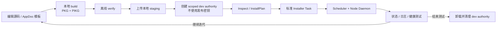

# BuckyOS App 基础设施职责边界

> 状态：Draft  
> 日期：2026-08-07  
> 适用版本：BuckyOS beta 2.2 及以后，不考虑向前兼容。

## 1. 文档目的

BuckyOS App 目前涉及 PKG、PIKG、AppDoc、NamedStore、Repo Service、BNS、Installer、TaskManager、Scheduler、Node Daemon 等多组基础设施。它们已经覆盖了 App 从源码到运行实例的大部分过程，但部分模块的职责边界不清晰，出现了“一个功能多个实现”、开发工具依赖运行中系统、发行与打包混在同一个接口、安装计划与实际运行包选择不一致等问题。

本文把 App 基础设施划分为四个边界清晰的领域：

1. **开发用工具**：从源码构造 App PKG、PackageMeta、AppDoc candidate 和 PIKG，并完成不依赖正式发行密钥的本地安装测试闭环。
2. **运维用工具**：持有发行权限和相关密钥，完成内容部署、AppDoc 签名与权威发布。
3. **安装协议**：把外部获得的 App 转换为可信、可执行的 InstallPlan，在一切准备完成后写入 AppSpec。
4. **调度与运行收敛**：消费 AppSpec，分配 Instance，并由目标 Node 将 Instance 运行起来。

本文使用 **AppSpec** 表示写入 system-config 的 `AppServiceSpec`。AppSpec 是安装协议与调度系统之间唯一的提交边界。

本文不替代 [App 安装协议](../App%20安装协议.md)。AppDoc、PIKG、InstallPlan、安装事务及安全规则以该协议的 v0.5 冻结项为准；本文重点定义模块职责、输入输出和写入权限。

## 2. 总体分层

```mermaid
flowchart LR
    Source["App 源码与构建产物"]
    Dev["开发工具\n构造 PKG / AppDoc candidate / PIKG"]
    Artifact["可验证的发行候选\nBuild Output"]
    Ops["运维发布工具\n授权、签名、部署、BNS 发布"]
    Published["已部署内容 + 权威 AppDoc"]
    LocalStage["本地 staging"]
    DevAuthority["scoped dev authority\n不使用正式发布密钥"]
    Installer["安装协议\nResolve / Inspect / Acquire / Verify / Prepare"]
    Plan["InstallPlan + PreparedDeployment"]
    Spec["AppSpec\n唯一调度提交点"]
    Scheduler["Scheduler\n分配 Instance"]
    NodeConfig["NodeConfig / InstanceReplica"]
    Node["Node Daemon\n部署、启动、健康上报"]
    Running["Running Instance"]

    Source --> Dev --> Artifact --> Ops --> Published
    Published --> Installer --> Plan --> Spec
    Spec --> Scheduler --> NodeConfig --> Node --> Running
    Artifact -. "本地开发" .-> LocalStage --> DevAuthority --> Installer
    Artifact -. "带外分享" .-> Installer
```



四个领域的核心约束如下：

| 领域 | 是否持有发行密钥 | 是否可以访问外部网络 | 是否可以写 system-config | 核心输出 |
|---|---:|---:|---:|---|
| 开发工具 | 否 | 纯构建不需要；集成测试只访问本地开发 Zone | 不直接写；通过受控开发/安装 API | Build Output、DevTestReport |
| 运维发布工具 | 是 | 是 | 原则上否 | 已部署内容、已签名并权威发布的 AppDoc、PublicationReceipt |
| 安装协议 | 否 | 按策略允许 | 仅能写安装记录和 AppSpec | InstallPlan、PreparedDeployment、AppSpec |
| 调度与运行收敛 | 否 | 不访问 App 的外部发行源 | 写派生调度结果和运行信息 | InstanceReplica、NodeConfig、ServiceInfo、InstanceReport |

## 3. 开发用工具

### 3.1 工具集范围

开发工具集不只包含“打出一个 PIKG”，还必须覆盖从源码到本地运行验证的完整开发闭环。它由两类工具组成：

1. **纯构建工具**：不依赖运行中的 BuckyOS，把开发者控制的输入转换为内容寻址、可独立验证的构建产物。
2. **本地开发测试工具**：显式连接本地开发 Zone，通过受控 API 完成 staging、开发信任、InstallPlan、安装、观察、更新和清理。

纯构建工具负责：

1. 将一个目录或已有制品构造成最小粒度的 App subpackage。
2. 生成与 subpackage 内容对应的 `PackageMeta` 和 Object ID。
3. 根据模板和实际构建结果生成 AppDoc candidate。
4. 将 AppDoc、PackageMeta 和目标平台 payload 组装成 `.pikg`。
5. 对产物执行与 Installer 相同的结构、Object ID、Digest、AppName 和 Package Namespace 验证。
6. 输出机器可读的构建清单，供后续发布或本地安装使用。

本地开发测试工具负责：

1. 启动或连接本地开发 Zone，并确认 Installer、TaskManager、Scheduler 和 Node Daemon 可用。
2. 把本地 PIKG 上传到受控 staging area，而不是向服务端传递本地路径。
3. 为当前 candidate 建立带 scope 和过期时间的开发信任证据。
4. 构造并展示 InstallPlan，供开发者检查目标包、权限、挂载、端口和 readiness。
5. 调用标准 Installer 创建和确认安装 Task。
6. 等待 Scheduler/Node Daemon 把 AppSpec 收敛为运行中的 Instance。
7. 查询 Task、install record、AppSpec、InstanceReport、日志和健康检查结果。
8. 支持重新构建、更新、覆盖安装、卸载和开发环境清理。
9. 输出可用于本地调试和 CI 判定的 `DevTestReport`。

开发工具的输出仍是 **candidate**。即使 AppDoc 带有开发者签名，或者 PIKG 完整通过校验，也不代表 AppDoc 已经在 BNS 上权威发布。

### 3.2 开发测试不得依赖正式发布密钥

开发测试和正式发布使用不同的信任边界：

| 凭证或信任能力 | 开发测试是否需要 | 用途与限制 |
|---|---:|---|
| 生产 Owner/BNS 发布私钥 | **禁止依赖** | 只允许运维发布工具使用；不得复制到开发机或 CI |
| 本地 BuckyOS 登录会话 | 需要 | 只用于认证当前开发用户并调用本地 Control Panel/Installer API，不代表 App 发布权 |
| 本地开发环境管理员/RBAC | 按需 | 允许创建和清理受限的开发信任、staging 和测试 App，不允许发布到 BNS |
| `LocalAuthorityOverride` / Zone dev evidence | 需要执行未发布 candidate 时使用 | 只对指定 Zone、机器、测试环境或 CI job 有效，必须带 warning、scope 和过期时间 |
| 临时测试签名 key | 可选 | 只用于测试 JWT/签名编码和错误分支；不能映射到生产 Owner，也不能成为正式发布凭证 |

本地开发模式允许在没有生产 Owner 私钥、没有 BNS AppDoc、没有公共 Repo 收录的情况下安装 candidate。它不能简单地“跳过信任”，而应由开发环境建立明确的本地信任证据：

```text
candidate App DID + AppDoc Object ID
        ↓ local dev authority
LocalAuthorityOverride / Zone dev evidence
        ↓ LOCAL_DEVELOPER policy
Inspect / InstallPlan / local install
```

开发信任必须满足：

- 只能由本地认证会话和受控开发权限创建；
- 与准确的 App DID、AppDoc Object ID 和作用域绑定；
- 默认短期有效，测试结束后可自动撤销；
- 不写入或合并到普通权威 cache，不向其它 Zone 同步；
- Resolver 结果必须标记 `LocalAuthorityOverride` warning；
- 不得被 `STRICT_PUBLIC`、`NORMAL` 或运维发布流程接受；
- 不调用 `repo.announce`、SN/BNS publish 或任何公开发布接口。

如果本地开发信任尚未建立，Installer 应返回 `TRUST_RESOLUTION_REQUIRED`，而不是偷偷使用 AppDoc 自声明的 owner 或读取生产发布密钥。

需要特别区分：**本地 API 登录凭证不是 App 发布密钥**。开发测试可以要求开发者登录自己的本地 Zone，但不能要求其持有某个正式 App Owner 的私钥。

### 3.3 非职责

开发工具不得：

- 读取 Owner/BNS 或运维环境的正式发行密钥；
- 为了构建产物而依赖运行中的 Control Panel、Repo Service 或 system-config；
- 把构建产物直接标记为公开发布；
- 调用 Repo/BNS 正式发布接口；
- 绕过 Installer 直接写 AppSpec、安装记录、Gateway 或 RBAC；
- 根据当前开发机的编译架构替目标 Node 选择运行包。

本地开发测试工具可以调用 Installer、TaskManager、日志和运行状态 API，但这些副作用仍由各自的正式模块执行。开发工具只负责编排，不能另写一套安装或调度逻辑。

### 3.4 建议构建输出

建议一次 App 构建输出一个独立目录：

```text
dist/
├── APPDOC.json
├── packages/
│   ├── web.tar.gz
│   ├── web.package-meta.json
│   └── web.package-meta.objid
├── app.pikg
└── BUILD_OUTPUT.json
```

`BUILD_OUTPUT.json` 至少应包含：

- App DID、AppDoc Object ID 和应用语义版本；
- 每个 subpackage 的逻辑名、PackageMeta Object ID、内容 ID、大小和目标 selector；
- PIKG 整包 digest 及其实际携带的 subpackage；
- 构建工具版本和 PIKG schema；
- 验证结果摘要；
- 不包含任何私钥、登录凭证或服务端本地路径。

### 3.5 完整本地开发测试流程

本地开发流程不经过正式发布。它从 Build Output 直接进入本地开发 Zone：



推荐步骤如下：

| 步骤 | 动作 | 关键输出 | 是否需要正式发布密钥 |
|---|---|---|---:|
| 0 | 启动/检查本地开发 Zone | Installer、TaskManager、Scheduler、Node Daemon ready | 否 |
| 1 | lint AppDoc、AppName、Package Namespace 和输入目录 | ValidationReport | 否 |
| 2 | 构造 subpackage、PackageMeta、AppDoc candidate 和 PIKG | Build Output | 否 |
| 3 | 离线重开 PIKG 并验证全部 Object ID/Digest | VerificationReport | 否 |
| 4 | 通过上传接口把 PIKG 放入受控 staging area | staging handle | 否，只需本地登录会话 |
| 5 | 为准确的 candidate 建立 scoped dev authority | dev evidence/override handle | 否，只需本地开发权限 |
| 6 | 调用 Preflight/Inspect 构造 InstallPlan | plan fingerprint、权限、readiness | 否 |
| 7 | 开发者确认计划并创建标准安装 Task | task id | 否 |
| 8 | 等待 Prepare、AppSpec commit、调度和运行收敛 | install record、InstanceReport | 否 |
| 9 | 执行 HTTP/Service/Agent 行为测试并收集日志 | DevTestReport | 否 |
| 10 | 修改源码后重新 build，通过 update/reinstall 验证升级 | 新 plan、升级结果、回滚结果 | 否 |
| 11 | 卸载测试 App，撤销 dev authority，清理 staging/临时文件 | CleanupReport | 否 |

开发流程不得调用当前语义混合的 `app.publish` 来替代 build、stage 和 dev trust。正式 Publisher 是否可用，不应影响本地 App 的开发和测试。

CI 使用相同流程，但 dev authority 的 scope 必须绑定当前 CI job，默认在 job 结束时失效。CI 不应注入生产 Owner key，也不应拥有 BNS 发布权限。

### 3.6 本地开发测试所需工具清单

| 工具能力 | 作用 | 应复用的系统边界 |
|---|---|---|
| Dev environment control | 启动、停止、重装和检查本地 BuckyOS/DV 环境 | `start.py`、`check.py`、`stop.py` 等开发脚本 |
| App initializer/template | 创建 AppDoc 模板、标准目录和示例入口 | 共享 App schema |
| App lint | 在打包前检查 AppDoc、AppName、Package Namespace、selector、权限和输入布局 | 共享 validation core |
| PKG packer | 构造单个 subpackage、PackageMeta 和内容 ID | 共享 packaging core |
| PIKG packer | 构造完整或目标平台部分 PIKG | 共享 PIKG core |
| Offline verifier | 重开产物并校验结构、Object ID、Digest 和内容索引 | 与 Installer 共用 verifier |
| Local staging client | 上传本地 PIKG，获得不可猜测、不可越界的 staging handle | Control Panel staging API |
| Dev authority manager | 创建、查询、续期和撤销 scoped dev evidence | Zone Resolver/local authority 管理 API |
| Preflight client | 从 staging handle/identifier 构造并展示 InstallPlan | Installer Resolve/Inspect |
| Install client | 创建、confirm、retry、cancel、update、uninstall 安装 Task | 标准 `apps.*` RPC |
| Task watcher | 展示 stage、readiness、下载进度、错误和用户动作 | TaskManager + 安装 status snapshot |
| Runtime observer | 查询 AppSpec、NodeConfig、InstanceReport、ServiceInfo 和 URL | Control Panel/system-config 只读 API |
| Log and probe tool | tail 日志，执行 HTTP、端口、健康检查和 Agent 行为测试 | Control Panel logs + App 测试入口 |
| Cleanup tool | 卸载 App、撤销 dev authority、清理 staging 和临时构建产物 | Installer、dev authority、staging API |
| Test orchestrator | 按 Web、Script、Docker、Agent 和多架构矩阵执行完整流程 | 只编排以上工具，不复制业务逻辑 |

“完整本地开发工具”是上述能力的统一入口，不要求每项都成为独立二进制。它们可以由一个 CLI 的多个子命令组合，但底层必须调用共享库和正式服务接口。

### 3.7 建议命令边界

命令名称可以后续确定，但能力上至少需要：

```text
app init                # 创建 AppDoc 模板和标准源码目录
app lint                # 无副作用验证 AppDoc、名字、权限和输入布局
app pkg pack            # 构造一个最小 subpackage 和 PackageMeta
app pikg pack           # 从 candidate 和若干 subpackage 构造 PIKG
app verify              # 离线验证 AppDoc、PackageMeta、PIKG 和内容
app build               # 编排纯本地构建步骤，生成完整 dist 目录

app dev env up          # 启动/连接本地开发 Zone
app dev stage           # 上传 PIKG，换取 staging handle
app dev trust           # 创建 scoped dev authority；不读取发布密钥
app inspect             # 构造并展示 InstallPlan
app install             # 通过标准 Installer 创建安装 Task
app task watch          # 查看 stage、进度、错误和待确认动作
app status              # 查看 AppSpec、Instance 和健康状态
app logs                # tail App/Instance 日志
app test                # 执行声明式 smoke/integration tests
app dev update          # 重新 build 并测试升级/回滚
app dev clean           # 卸载并撤销 dev authority、staging 和临时数据
```

`init/lint/pkg pack/pikg pack/verify/build` 应能在未启动 BuckyOS 的开发机或 CI 中运行。`dev stage` 之后的命令显式连接本地开发 Zone，只要求本地会话和开发权限，不要求生产发行密钥。相同输入和相同构建参数应尽量得到可复现的内容身份。

### 3.8 当前实现与缺口

当前可复用能力包括：

- `buckycli pack_pkg` 可以构造最小 PKG，但属于旧 CLI 流程；
- Control Panel 中的 `PikgBuilder` / `PikgReader` 已实现 PIKG 构造和严格验证；
- `test/app_installer_test` 已覆盖 build candidate、种入 Resolver 证据、`apps.install_package`、confirm、等待运行证据和可选卸载的主要闭环；
- `start.py`、`check.py` 和 `stop.py` 已能管理本地开发环境；
- Control Panel 已有安装 Task、系统日志和应用生命周期 RPC。

主要缺口是：

- `PikgBuilder` / `PikgReader` 位于 Control Panel 内部，不是开发工具可直接复用的库；
- 样例生成器依赖运行中的 Control Panel、Repo Service 和认证环境；
- 当前测试通过 `app.publish` 构建 PIKG，并尝试读取 zone owner 或 device 私钥换取登录 token；即使这些密钥没有用于发布 AppDoc，这仍让开发流程依赖敏感凭证和复合 Publisher；
- Resolver 开发证据目前由测试以 root 权限直接写 `resolver/cache/*`，缺少带 scope、过期和自动清理的 dev authority 管理接口；
- 协议要求的本地 PIKG 上传通道尚不完整，测试主要复用 `app.publish` 返回的内部 staging handle；
- `buckycli` 与 Control Panel 各自实现了一套 tar.gz 打包；
- AppDoc、AppName 和 Package Namespace 验证没有统一的无副作用入口；
- Task、日志、运行状态、升级、卸载和清理能力分散，没有形成一个完整的 `app dev` 工作流；
- 当前 `app.publish` 接收服务端 `local_dir` 并同时打包、写 NamedStore 和生成 PIKG，跨越了开发与运维两个边界。

## 4. 运维用工具

### 4.1 职责

运维发布工具负责所有需要授权、密钥和外部副作用的动作。典型场景是：某个 App 已有一个新版本，运维人员拿到经过验证的 Build Output，使用该 App 对应 Owner 的权限将新版本正式发行。

一次完整发布应包含：

1. 读取并重新验证 Build Output，不能信任开发工具只给出的“验证成功”标志。
2. 明确选择目标 App DID、发布环境和签名身份。
3. 验证当前 principal/密钥有权代表 App DID 的 Owner 发布该 App。
4. 将 PIKG 或其下载描述部署到可获取的内容网络。
5. 将 AppDoc、PackageMeta 和 payload 对象图部署到 Named Data / Repo 基础设施。
6. 使用 Owner 授权的密钥签名 AppDoc，生成 `APPDOC.wt` 或等价权威文档。
7. 将 AppDoc 作为 `doc_type=app` 发布到 App DID 对应的 BNS 权威渠道。
8. 从 BNS/Indexer 回读，确认 App DID、AppDoc Object ID、revision 和签名结果与本次发布一致。
9. 输出可审计的 `PublicationReceipt`。

AppDoc 的 `version` 表示应用语义版本；BNS 发布 revision/`iat` 表示权威文档版本。两者不能混用。

### 4.2 内容部署与身份发布必须分开

“发布”至少包含两个不同动作：

| 动作 | 输入 | 输出 | 失败后的影响 |
|---|---|---|---|
| 内容部署 | PIKG、PackageMeta、payload、AppDoc body | 可下载的内容 ID/URL、Repo pin 结果 | 内容可能已经存在，但还不是当前权威版本 |
| 身份发布 | 已部署内容引用、已签名 AppDoc、Owner 授权 | BNS AppDoc revision、回读证据 | 成功后外部 Resolver 才能把该版本识别为权威发布 |

内容部署应先完成；只有内容已经可获取且全部验证通过，才发布指向这些内容的权威 AppDoc。这样可以避免 BNS 已指向新版本但实际内容尚不可用。

接口和状态不应继续使用含义模糊的 `publish=true`。建议使用明确状态：

```text
built_candidate
content_deployed
appdoc_signed
bns_published
publication_verified
```

### 4.3 安全与运维要求

运维工具必须：

- 显式指定或安全选择签名 key，禁止从 AppDoc 自声明 owner 推导授权；
- 验证 principal、Owner DID、App DID 和 Package Namespace 的绑定；
- 不接受任意普通用户提供的服务端本地路径；
- 对每个有副作用步骤记录输入 Object ID、输出 ID、操作者和时间；
- 支持幂等重试和从部分完成状态恢复；
- 在 BNS 发布后执行权威回读，而不是把 RPC 成功当作最终发布成功；
- 新版本发布失败时保留旧的权威 AppDoc，不让 Installer 看到不可用的新版本。

### 4.4 当前实现与缺口

当前 `app.publish` 已能：

- 扫描有限的 Web、Agent、Script 和 Docker 输入；
- 构造 subpackage、PackageMeta 和最终 AppDoc candidate；
- 把 payload、PackageMeta 和 AppDoc 写入本机 NamedStore/Repo；
- 构造 PIKG 并使用同一个 `PikgReader` 自检。

但它还不是运维发布工具：

- 任何已认证 principal 都能调用，未验证 principal 是否有权代表 `AppDoc.owner`；
- 接受并读取 Control Panel 所在机器的 `local_dir`；
- 没有使用 AppDoc 签名能力，生成的 PIKG 通常只有 `APPDOC.json`；
- 没有把 PIKG 本身部署为可下载内容；
- 没有调用 BNS 发布 AppDoc；
- `repo.announce` 目前仅把请求写入本地 `pending_announces`，未连接外部 BNS；
- 打包、内容写入、Repo pin 和 PIKG 生成不是一个可恢复事务，中途失败会留下部分对象。

Node 激活流程中已经存在 `SnClient.publish_document`、自有域名绑定以及 BNS Indexer 回读逻辑。正式 App Publisher 应复用同样的“发布后回读确认”模式，而不是再创建一套 BNS 发布语义。

## 5. 安装协议

### 5.1 职责

Installer 的职责是把一个来自外部、默认不可信的 App 输入，转化为当前 Zone 可以信任和执行的 AppSpec。

支持的外部输入可以包括：

- App DID 或 BNS 名称；
- AppDoc Object ID；
- AppDoc/PIKG URL；
- 已上传到受控 staging area 的 PIKG handle；
- 通过文件、好友或其它渠道获得的本地 PIKG。

输入渠道只决定如何取得 candidate，不决定 candidate 是否可信。Installer 必须独立完成 DID 权威解析、Owner 绑定、AppDoc/Object ID、Package Namespace、PackageMeta、内容 Digest 和目标约束校验。

### 5.2 安装分为计划、准备和提交

安装协议应明确分为三个阶段组：

#### A. 构造计划

```text
Resolve → Inspect → InstallPlan
```

该阶段：

- 识别 App DID 和 candidate；
- 获取或读取 AppDoc 所需的最小信息；
- 验证 AppName、Owner 和全部 `pkg_list` 的 Package Namespace；
- 根据目标 Node，而不是 Installer 编译平台，选择需要的 subpackage；
- 生成权限、配置、目标约束、缺失内容和 readiness；
- 计算绑定全部决策输入的 plan fingerprint。

该阶段不得产生安装副作用：不得写 AppSpec、创建 PackageEnv 目录、更新 Gateway/RBAC、启动 Instance 或改变已安装应用。允许的缓存行为必须是通用 Resolver/Object Cache 行为，并且不能被解释为安装已经开始。

应提供独立 Preflight 能力，让调用方在创建长期安装事务前获得 InstallPlan 或明确的阻塞原因。

#### B. 准备安装

```text
用户确认 → Acquire → Verify → Prepare → PreparedDeployment
```

该阶段可以创建可恢复 Task，并负责：

- 下载当前 InstallPlan 真正需要的内容；
- 逐对象重新验证 AppDoc、PackageMeta 和 payload；
- 将 PIKG 中的必要内容物化到 Zone 内受控存储；
- 检查安装冲突；
- 分配 `app_index`；
- 构造最终 AppSpec 和回滚材料；
- 写入 `install_record(state=prepared)`。

准备完成的判断标准是：即使外部网络立即断开，写入 AppSpec 后 Scheduler 和 Node Daemon 仍能只依赖 Zone 内基础设施完成部署。

#### C. 提交 AppSpec

```text
PreparedDeployment → 写 AppSpec → 调度开始
```

写 AppSpec 是不可跨越的提交边界：

- 写入前，Installer 可以失败、暂停或要求用户确认，但 Scheduler 不应看到这个 App；
- 写入成功后，Installer 不再直接选择 Node、创建 Instance 或启动应用；
- Scheduler 只根据 AppSpec 推导部署结果；
- Activate 根据 InstanceReport 和健康证据确认安装完成，并更新 `install_record(state=installed)`；
- 失败或升级回滚恢复旧 AppSpec 或移除新 AppSpec。

除系统镜像构建等显式内部路径外，Installer 应是 AppSpec 的唯一创建者。

### 5.3 AppSpec 必须是确定的部署合同

AppSpec 必须包含 Scheduler 和 Node Daemon 执行所需的最终批准结果，但不复制 DID 解析历史和安装 Task 历史。

至少要确保下面内容已经确定：

- AppDoc 的确定版本或不可变引用；
- 用户批准的权限和最终 `ServiceSpecConfig`；
- 目标平台实际选中的 subpackage；
- 对应的 PackageMeta Object ID 和 payload 内容 ID；
- Docker 场景的镜像名称和不可变 image digest；
- 自动启动、资源、挂载和服务暴露配置。

Scheduler 和 Node Daemon 不得从完整 `pkg_list` 中重新选择另一套包。可以在 AppSpec 中增加明确的 resolved package set，也可以写入只包含最终选择结果的部署描述；无论采用哪种结构，必须保证实际执行内容被 InstallPlan fingerprint 和用户确认覆盖。

### 5.4 非职责

Installer 不负责：

- 构造开发源代码的 PKG 或 PIKG；
- 使用 Owner 私钥发布 AppDoc；
- 决定哪个新版本应该成为 BNS 权威版本；
- 在 Scheduler 之外选择实际运行 Node；
- 在 Node Daemon 之外直接启动容器或进程；
- 让 TaskManager 根据 AppDoc 语义自行决定下载全部 subpackage。

### 5.5 当前实现与缺口

当前 v0.5 Installer 已实现：

- `Resolve → Inspect → Acquire → Verify → Prepare → Deploy → Activate` 七阶段状态机；
- TaskManager `Task.data` 作为可恢复安装事务真相源；
- DID 解析、candidate 绑定、Package Namespace 双重校验；
- 强类型 InstallPlan、readiness、权限选择和 plan fingerprint；
- Prepare/Deploy/Activate、安装记录和升级回滚；
- `apps.install`、`apps.install_package`、confirm、retry 和 cancel RPC；
- 外部 RPC 不直接接受安装文件的服务端路径。

主要缺口和边界问题是：

- 当前 RPC 先创建 Task，再在 Task 内构造 InstallPlan，没有独立 Preflight 接口；
- 协议要求的 PIKG 上传通道尚未形成完整外部入口；
- URL 入口只支持能够推导 Object ID 的 URL，普通 HTTPS PIKG/AppDoc URL 尚未完整支持；
- TaskManager 下载 AppDoc 时会递归解释 `pkg_list` 并下载全部 subpackage，与 Installer Planner 的目标包选择重复；
- AppDoc 业务验证分散在 Builder、Publisher、Resolver、Planner 多处；
- `buckycli app create` 仍可直接写旧 `/config`、Gateway 和 RBAC，绕过当前安装协议。

## 6. 调度与运行收敛

### 6.1 职责

调度与运行收敛领域从 AppSpec 开始，不处理 App 的外部发现、发行身份和用户安装决策。

Scheduler 负责：

1. 读取 AppSpec、Node 信息、现有实例和资源状态。
2. 为 AppSpec 分配满足约束的目标 Node 和 InstanceReplica。
3. 生成确定的 NodeConfig、ServiceInfo、Gateway 派生配置和调度快照。
4. 在 AppSpec 修改、删除、扩缩容或 Node 状态变化时重新计算目标状态。

Node Daemon 负责：

1. 读取本机 NodeConfig。
2. 确保所需的准确 PackageMeta 和 payload 在本机 PackageEnv 中可用。
3. 部署 Docker image、Host Script、Web 或 Agent 内容。
4. 启动、停止、升级或移除 Instance。
5. 上报 InstanceReport、运行状态和健康信息。
6. 持续重试，直到本机实际状态收敛到 NodeConfig 描述的目标状态。

### 6.2 非职责

Scheduler 和 Node Daemon 不得：

- 解析 BNS App DID 或判断 AppDoc 的 Owner 信任；
- 接受用户权限选择或重新解释安装策略；
- 从 registry tag、latest 或外部 Repo 动态选择应用版本；
- 从完整 AppDoc 中重新选择一个未被 InstallPlan 批准的平台包；
- 直接访问 App 的外部发行源补齐安装准备阶段遗漏的内容；
- 修改 AppDoc、InstallPlan 或安装批准结果。

它们可以依赖 Zone 内 Repo/NamedStore 获取已经由 Installer 准备好的内容。

### 6.3 当前完成度

这一领域是当前四个领域中完成度最高的：

- Scheduler 已能从 `users/*/apps|agents/*/spec` 推导 InstanceReplica 和 NodeConfig；
- Node Daemon 已能通过 PackageEnv 安装包、加载 Docker/Script/Web/Agent 内容并启动实例；
- 实例状态通过 system-config 上报，Control Panel 的 Activate 阶段可以等待运行证据；
- AppSpec、NodeConfig 和 InstanceReport 已形成期望状态到实际状态的闭环。

当前最需要修正的问题不是重新设计调度器，而是消除平台包选择的重复实现：

- Installer Planner 使用 target selector 选择包；
- Scheduler 根据 Node OS/Arch 手工拼接 package key；
- Node Daemon 再次手写平台匹配，并存在跨架构 fallback；
- `SubPkgList` 还保留基于编译期 `cfg!` 的旧选择 helper。

最终只能保留 Installer Planner 这一处语义选择。Scheduler 和 Node Daemon 应执行 AppSpec 中已经解析好的准确包引用。

## 7. 真相源与写入权

| 数据 | 含义 | 唯一写入者 | 主要读取者 |
|---|---|---|---|
| Build Output | 本地可验证发行候选 | 开发工具 | 运维发布工具、Installer |
| BNS AppDoc | 当前权威发布身份和 revision | 运维发布工具/权威发布服务 | Resolver、Installer |
| Repo/NamedStore 内容 | 内容寻址对象和 payload | 运维发布工具、通用下载器 | Installer、Node Daemon |
| `Task.data` | 进行中的安装事务 | Installer | Control Panel、Task UI |
| InstallPlan | 当前安装决策快照 | Installer Planner | 用户确认、Verify、Prepare |
| install_record | 长期安装审计状态 | Installer | Control Panel、升级/恢复流程 |
| AppSpec | 用户级期望运行状态 | Installer | Scheduler |
| Scheduler snapshot | Zone 调度推导状态 | Scheduler | Scheduler、运维诊断 |
| NodeConfig | 某 Node 的目标实例状态 | Scheduler | Node Daemon |
| InstanceReport | 某 Instance 的实际运行状态 | Node Daemon/运行时 | Scheduler、Installer Activate、Control Panel |

派生数据不得反向覆盖它的输入真相源。例如，Node Daemon 的运行结果不能修改 InstallPlan；Repo 中存在某个 AppDoc body 也不能自动把它升级为 BNS 权威发布。

## 8. “一个功能多个实现”的收敛表

| 功能 | 当前重复或冲突实现 | 应保留的唯一归属 |
|---|---|---|
| tar.gz / subpackage 构造 | `buckycli package_cmd`、Control Panel Publisher | 开发侧共享 packaging core |
| PIKG 构造与验证 | Control Panel 私有模块、测试生成脚本编排 | 开发与 Installer 共用的 PIKG core |
| AppDoc 业务验证 | AppDoc Builder、Publisher scan、Resolver、Planner | 无副作用的 App schema/validation core |
| AppName/Package Namespace | App DID 构造、Publisher 的 PackageId parse、Installer namespace validator | 共享 validator；Installer 和 Publisher 必须强制调用 |
| 目标平台包选择 | Planner、Scheduler、Node Daemon、编译期 helper | Installer Planner |
| AppDoc 依赖展开 | TaskManager 下载器、Installer Planner | Installer Planner；TaskManager 只做传输 |
| 内容发布 | `app.publish`、`repo.store`、`repo.announce` | 运维发布工作流编排；Repo 只提供内容原语 |
| BNS 文档发布 | `repo.announce` 语义、Node 激活 `SnClient.publish_document` | 统一的授权发布组件，复用发布后回读模式 |
| App 安装提交 | v0.5 Installer、`buckycli app create`、系统预装直接写 spec | Installer；系统镜像构建走显式 internal provisioning 入口 |
| 版本选择 | DID 权威 AppDoc、旧 Repo latest-semver 逻辑 | BNS/DID 权威 AppDoc；安装只消费确定版本 |

## 9. 建议实施顺序

### P0：先固定安装与调度的合同

1. 在 AppSpec 或其部署描述中固化 Planner 选出的准确 package set。
2. 删除 Scheduler 和 Node Daemon 的平台包重选及跨架构 fallback。
3. 让 TaskManager 回到通用 `Object ID → bytes` 传输职责，移除 AppDoc 语义递归下载。
4. 禁止 `buckycli app create` 等普通入口绕过 Installer 写 AppSpec。

这是最高优先级，因为它直接决定“用户批准的内容”是否等于“最终运行的内容”。

### P1：抽取纯本地构建与验证核心

1. 将 PKG 打包、PIKG Builder/Reader、AppDoc/AppName/Namespace 验证抽成共享库。
2. 建立不依赖运行中 BuckyOS 的开发 CLI。
3. 让 Publisher 和 Installer 使用同一套验证函数。
4. 清理 `buckycli pub_pkg/pub_app`、旧 Repo release 选择和重复 tar 打包代码。

### P1：建立完整本地开发测试闭环

1. 建立正式的 PIKG 本地上传/staging API，不再通过 `app.publish` 取得内部 handle。
2. 建立 scoped dev authority 管理 API，支持创建、查询、续期、撤销和自动过期。
3. 提供统一的 `app dev` CLI，编排 build、stage、trust、inspect、install、watch、logs、test、update 和 clean。
4. 改造 `app_installer_test`，使用本地测试会话和 dev authority，不再读取生产 Owner 私钥或依赖正式 Publisher。
5. 让本地开发和 CI 使用同一流程；CI job 结束时自动撤销 dev authority 并清理测试 App。

### P1：建立真正的运维发布工作流

1. 把当前 `app.publish` 拆为本地 build、内容 deploy、AppDoc sign、BNS publish 四个显式步骤。
2. 建立 PIKG 上传/部署接口，返回可远程获取的内容 ID，而不是服务端路径。
3. 校验发布 principal 与 Owner/App DID 的授权关系。
4. 复用 SN/BNS 发布及 Indexer 回读模式，输出 PublicationReceipt。
5. 让部分失败可以安全重试，不重复产生不一致发布。

### P2：完善 Preflight 和 UI 合同

1. 提供独立的 `inspect/preflight` 接口，在创建安装 Task 前返回 InstallPlan。
2. 暴露稳定的安装状态 snapshot，而不是让 UI 解释内部 Task.data。
3. 将 Desktop 当前 mock-first Installer 替换为真实 RPC adapter。

## 10. 验收标准

### 开发工具

- 在未启动 BuckyOS、没有发行密钥的机器上可以构造和验证 PIKG；
- 构建过程不写 NamedStore、Repo、BNS 或 system-config；
- Builder 与 Installer 对同一个产物给出一致的验证结果；
- 输出不包含服务端本地路径和凭证；
- 在没有生产 Owner/BNS 私钥的情况下，可以完成 staging、dev trust、InstallPlan、安装、运行测试、更新和清理；
- 开发工具只使用本地登录会话和有 scope 的 dev authority，不能把 candidate 标记为公开 `Active`；
- 测试结束后能够撤销 dev authority，并清理安装 Task、测试 App 和 staging 临时文件；
- 相同的工具链可以在开发机和 CI 中运行，CI 不持有正式发布权限。

### 运维发布工具

- 可以使用明确的 Owner 授权发布一个 App 新版本；
- 内容部署完成前不会更新权威 AppDoc；
- 发布完成后能从权威 Resolver/Indexer 回读相同 AppDoc Object ID；
- 重复执行不会生成冲突 revision 或破坏当前可用版本；
- 每次发布都有可审计的 PublicationReceipt。

### 安装协议

- 任意外部输入都先被当作不可信 candidate；
- 可以在不写 AppSpec 的情况下得到 InstallPlan；
- AppName、Owner、Package Namespace 和所有内容都在提交前验证；
- AppSpec 写入前，目标安装所需内容已经在 Zone 内 ready；
- AppSpec 中实际执行的 package set 与 plan fingerprint、用户确认完全一致；
- Installer 是普通 AppSpec 的唯一写入者。

### 调度与运行收敛

- Scheduler 只根据 AppSpec 和 Zone 当前状态分配 Instance；
- Scheduler 和 Node Daemon 不重新解释 AppDoc 或选择另一版本/架构包；
- Node Daemon 只依赖 Zone 内已准备内容即可完成部署；
- 相同 AppSpec 在相同 Zone 状态下产生一致的调度目标；
- InstanceReport 能让 Installer 明确区分 running、activation failed 和 deploy failed。

## 11. 当前实现入口

| 领域 | 主要入口 |
|---|---|
| PKG 开发工具 | `src/tools/buckycli/src/package_cmd.rs` |
| PIKG 格式与 Builder/Reader | `src/frame/control_panel/src/pikg.rs` |
| 当前复合 Publisher | `src/frame/control_panel/src/app_installer.rs` 中的 `app.publish` |
| AppDoc/InstallPlan 共享类型 | `src/kernel/buckyos-api/src/app_doc.rs`、`app_install.rs` |
| AppName/Namespace 验证 | `src/frame/control_panel/src/app_package_namespace.rs` |
| Installer Planner | `src/frame/control_panel/src/app_install_planner.rs` |
| Installer 状态机 | `src/frame/control_panel/src/app_install_engine.rs` |
| Prepare/Deploy/Activate | `src/frame/control_panel/src/app_install_deployer.rs` |
| 通用下载任务 | `src/kernel/task_manager/src/download_executor.rs` |
| Repo 内容原语 | `src/frame/repo_service/src/service.rs` |
| Scheduler | `src/kernel/scheduler/src/app.rs`、`system_config_agent.rs` |
| Node 运行收敛 | `src/kernel/node_daemon/src/app_loader.rs`、`app_mgr.rs` |

## 12. 相关文档

- [App 安装协议](../App%20安装协议.md)：AppDoc、PIKG、InstallPlan、七阶段事务和安全规则的当前真相源。
- [BuckyOS App 安装流程](BuckyOS%20App安装流程.md)：Repo 内容原语、证明和 App 生命周期背景；其中旧安装接口描述应以 v0.5 协议为准。
- [App PKG System](app-pkg-system.md)：PackageEnv、Repo、Node Daemon 和升级模型的历史设计背景。
- [publish_app_to_repo local_dir 格式](../repo_service/publish_app_to_repo_local_dir格式说明.md)：当前复合 Publisher 的输入布局。
