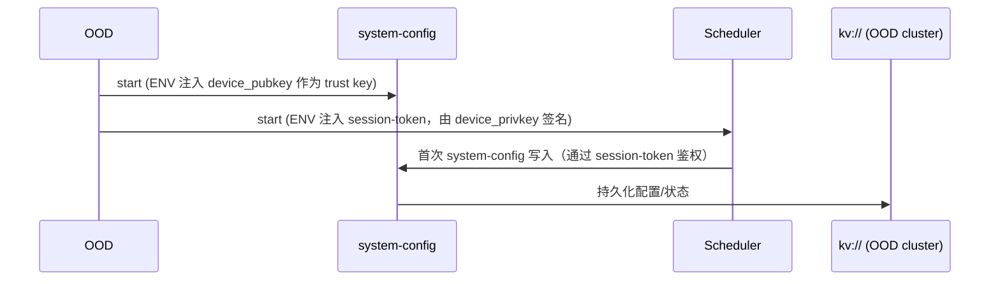
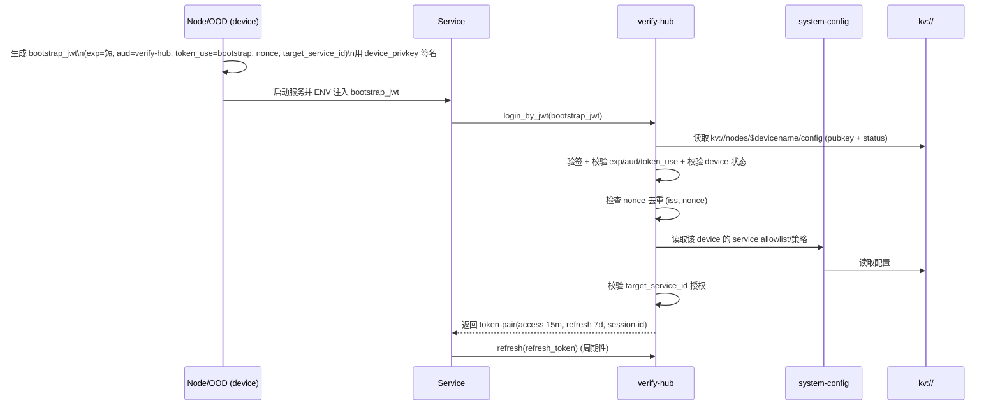

# BuckyOS Login / AuthN / AuthZ 机制设计文档

**文档状态**：可提交（基于当前实现与已确定方案）
**适用范围**：BuckyOS（NetworkOS，分布式系统）
**版本**：v1.0
**签名算法**：Ed25519（JWT：EdDSA）
**Access Token TTL**：15 分钟
**Refresh Token TTL**：7 天（device/user/service 当前不区分）
**RBAC 刷新周期**：30 秒（服务端定期从 system-config 拉取）

---

## 1. 背景与目标

BuckyOS 是 NetworkOS，典型分布式系统。系统在安全与可用性之间做出明确取舍：

* **可用性优先**：允许 verify-hub 临时不可用；系统在短时间内仍应可工作（依赖离线验签的 access token）。
* **允许一致性抖动**：配置/授权更新存在传播延迟（例如 RBAC 30 秒刷新）。
* **面向分布式容灾**：关键状态在 OOD 集群可恢复；单个 OOD 节点损坏不应导致 verify-hub 永久不可用。

---

## 2. 威胁模型与可用性假设

### 2.1 威胁模型（纳入考虑）

* **A**：网络攻击者（MITM、重放、伪造请求、探测接口）
* **C**：节点/服务被攻破（攻击者获得某服务或某节点的高权限执行能力）
* **D**：物理访问（**非 OOD 设备**：如 Node / Client Device 的磁盘可能被读取）

> 注：OOD 物理攻击不作为主要覆盖对象，可作为后续增强项。

### 2.2 可用性假设

* verify-hub 可短时不可用：

  * 已签发 **access token** 仍可被服务端离线验签直至过期（15 分钟窗口）。
  * **refresh** 需要 verify-hub 在线，短时不可用会导致 refresh 失败并触发等待或重登录。

---

## 3. 概念与术语

### 3.1 主体（Principal）

系统内三类主体：

1. **Device**：包括 OOD、Node（类型不同，均视为 device）
2. **User**：包括 owner/root owner；私钥在钱包（wallet）
3. **Service**：运行在 device 上的服务实例，使用 bootstrap JWT 换票获取长期 token-pair

### 3.2 Token / Session 术语

* **session-id**：verify-hub 侧会话记录的逻辑标识，用于吊销与风控。
* **token-pair**：同一 session-id 下的一对令牌：

  * **access token**：短期（15m），用于业务访问与离线验签
  * **refresh token**：长期（7d），用于换取新 token-pair（带 rotation + reuse detection）
* **bootstrap JWT**：由 hosting device（Node/OOD）签发给 service 的短时一次性令牌，仅用于向 verify-hub 换票（login_by_jwt）。

---

## 4. 系统组件与职责

* **system-config（System Config Service）**：最基础内核服务，存放系统配置、RBAC、节点与服务配置等；不依赖其他服务自举启动。
* **verify-hub**：统一登录/换票中心；管理 session；签发 token-pair；执行风控与吊销；可提供在线校验（introspection）。
* **Scheduler**：boot 阶段调度器；完成初始调度与首次 system-config 写入；构造 stream URL 并携带 target service id。
* **Gateway / node-gateway**：zone 外请求入口；处理 rtcp（可视为强制 client 证书的 TLS）；根据 did-doc/owner/group 做入口层防护与鉴权衔接；最终业务鉴权由目标服务或 api-runtime 完成。
* **Service**：业务服务实例；启动时通过 bootstrap JWT 换票；运行期 refresh。
* **User 客户端（Web/buckycli）**：通过账号密码登录；持有 refresh token 维持登录态。

---

## 5. 存储与配置（kv:// 与 boot/config）

### 5.1 kv:// 总览

* `kv://` 底层是类似 etcd 的一致性存储。
* 仅运行在 **OOD 集群**（规模 `2n+1`）上。

### 5.2 关键路径（示例）

* `kv://boot/config`：根信任配置（zone-owner pubkey、verify-hub pubkey、软件版本等元信息）
* `kv://nodes/$devicename/config`：设备公钥与状态信息（verify-hub 验证 device 依赖）
* `kv://users/$username/config`：用户公钥与配置（sudo 验证依赖）
* `kv://secrt/`：敏感信息区域（当前 verify-hub 私钥存放于此）

### 5.3 boot/config 写入策略与 Root of Trust

* `kv://boot/config`：

  * **仅 boot 阶段可写入**；运行态仅 **root** 可写。
  * 常见更新场景：新增 OOD 节点时更新。

**Root of Trust（根信任）**：

* `kv://boot/config` 中至少包含两把公钥：

  * `zone-owner public key`（root）
  * `verify-hub public key`

**安全语义**：

* 具备对 `kv://boot/config` 的写权限，等价于系统最高权限（Root）。

---

## 6. 密钥体系与私钥存储

### 6.1 私钥归属与位置

* **User（含 owner）私钥**：在用户钱包（wallet）
* **Device 私钥**：在设备磁盘上
* **verify-hub 私钥**：存放于 `kv://secrt/`

  * 原因：分布式容灾需求，单个 OOD 节点损坏后可在另一 OOD 节点拉起 verify-hub

### 6.2 设备密钥的生成

* 设备激活时，由 **Owner 的钱包**构造/注入设备密钥材料（用于后续 device 自签与启动链路）。

### 6.3 Key Rotation 现状

* 当前 **不支持 key rotation**。
* JWT 具备 `kid`；但通常依赖 `iss` 区分与选取校验公钥（多数 `iss` 仅单公钥）。

---

## 7. Token / Session 模型（规范）

### 7.1 token-pair 与生命周期

* **access token**

  * TTL：15 分钟
  * 用途：业务访问；服务端离线验签；verify-hub 不可用时仍可用到过期

* **refresh token**

  * TTL：7 天（device/user/service 当前不区分）
  * 用途：向 verify-hub refresh 获取新 token-pair
  * 策略：

    * **refresh token rotation**：每次 refresh 返回新的 refresh token
    * **reuse detection**：检测到旧 refresh token 再次被使用，触发风控并要求重登录/吊销

### 7.2 session-id 语义

* access/refresh **共享同一个 session-id**（同一 token-pair 概念）
* refresh 过程 **复用 session-id**（不生成新 session-id）
* JWT 内存在 `token_use` 字段标识 access/refresh/bootstrap
* 不使用 `jti`

### 7.3 JWT 基础字段（现状约束）

JWT 至少包含：

* `iss`：签发者标识
* `sub`：主体标识（device/user/service）
* `aud`：受众（例如 verify-hub 或 buckyos）
* `iat` / `exp`
* `kid`
* `token_use`
* `session_id`（自定义字段）

---

## 8. AuthN / AuthZ 总览（信任域）

### 8.1 system-config（System Config Service）

* **LOGIN_DEPENDENCY**：NONE（不依赖 verify-hub）
* **AUTHN**：验证受信任公钥签发的 JWT
* **Trust Keys 来源**：

  1. 启动时通过 ENV 注入的 **当前设备公钥**（用于自举）
  2. `kv://boot/config` 中：

     * zone-owner public key
     * verify-hub public key

### 8.2 Service（业务服务）侧验签信任域

业务服务（api-runtime）默认仅接受由以下公钥签发的 session token：

* `zone-owner public key`
* `verify-hub public key`

结论：

* **device 自签 token** 不作为业务服务的常规访问凭证（降低横向风险）。
* 例外：**sudo**（见第 12 章）在 api-runtime 中走特殊验证逻辑。

### 8.3 RBAC（授权）

* RBAC 定义与存储于 system-config。
* 业务服务端每 **30 秒**定期刷新 RBAC（pull 模型）。

---

## 9. Boot 阶段自举流程

### 9.1 时序（现状）



### 9.2 说明

* system-config 启动时信任 ENV 注入的当前设备公钥以完成系统 bring-up。
* Scheduler 使用 **设备私钥**签名的 token 进行首次配置写入。

---

## 10. verify-hub 设计

### 10.1 自身身份与访问 system-config

* verify-hub 拥有与 `kv://boot/config` 中 verify-hub 公钥对应的私钥（存于 `kv://secrt/`）。
* verify-hub 可使用自身私钥自签 JWT 访问 system-config（读取配置、RBAC、节点/用户状态等）。

### 10.2 登录接口与会话管理

* `login_by_passwd(username, password)`

  * 适用：User 登录
  * 成功：创建 session-id，签发 token-pair

* `login_by_jwt(jwt)`

  * 适用：Device 登录、Service 换票、其他 JWT-based 场景
  * 根据 `iss`/token_use 选择验证逻辑（见第 11 章）

* `refresh(refresh_token)`

  * 返回新 token-pair（rotation）
  * reuse detection：检测复用触发风控与吊销

### 10.3 吊销与风控

* verify-hub 可将 session-id 标记为无效实现吊销。
* 吊销效果：

  * refresh 立即失败（强一致）
  * 已签发 access token 在过期前若只离线验签仍可能可用（窗口上限 15 分钟）
* 高风险场景可使用 verify-hub 在线校验接口（introspection）实现更强即时性。

---

## 11. 登录与换票流程（Device / Service / User）

### 11.1 Device（Node/OOD）登录 verify-hub（BY_JWT）

#### 流程

1. device 使用本地 device private key 自签 JWT（`iss=$devicename`）
2. 调用 `verify-hub.login_by_jwt`
3. verify-hub 从 `kv://nodes/$devicename/config` 读取设备公钥与状态，验签并校验状态
4. verify-hub 签发 token-pair
5. device 定期 `refresh`

#### 校验要点

* 公钥来源：`kv://nodes/$devicename/config`
* 状态检查：设备禁用/封禁/有效性等（以配置字段为准）

---

### 11.2 Service 启动换票（最终方案：A + 短时 bootstrap + nonce 防重放）

#### 11.2.1 核心原则

* service 的启动凭证由 **hosting device（Node/OOD）背书**。
* hosting device 使用 device 私钥签发短时一次性 **bootstrap JWT**，通过 ENV 注入给 service。
* service 使用 bootstrap JWT 向 verify-hub 换取长期 token-pair。

#### 11.2.2 bootstrap JWT 规范

bootstrap JWT 必须满足：

* **签名者**：hosting device 的 device private key
* **过期时间**：极短（实现上为可配置项；必须远小于 refresh TTL）
* **aud**：固定为 `verify-hub`
* **token_use**：`bootstrap`
* **nonce**：随机一次性值（用于防重放）
* **target_service_id**：目标服务标识（与 Scheduler 构造的 stream URL 中 target service id 对齐）

#### 11.2.3 verify-hub 换票校验规则（login_by_jwt）

verify-hub 必须执行：

1. **基础 JWT 校验**：exp/iat/aud/token_use
2. **device 身份校验**：

   * 读取 `kv://nodes/$devicename/config` 获得 device 公钥与状态
   * 对 `iss=$devicename` 的 bootstrap JWT 验签并校验状态
3. **nonce 防重放**：

   * 检查 `(iss, nonce)` 是否已使用；若已使用则拒绝
   * nonce 去重记录的 TTL 至少覆盖 bootstrap JWT 有效期 + 允许的 clock skew
4. **service 运行授权校验（方案 A 关键）**：

   * 从 system-config / node-config 读取该 device 被允许运行的 service list/策略
   * 校验 `target_service_id` 属于 allowlist 或符合策略

通过后签发 token-pair，service 周期性 refresh。

#### 11.2.4 时序图



---

### 11.3 User 登录（BY_PASSWD）

* 用户通过交互式客户端（Web/buckycli）调用 `login_by_passwd`
* verify-hub 返回 token-pair
* refresh token 用于维持登录态（7 天）

---

## 12. Gateway / rtcp 鉴权与边界

### 12.1 面向 zone 外身份的入口模型

* rtcp 可视为强制 client 证书的 TLS（mTLS）。
* zone 外请求统一从 gateway 进入，gateway 具备在应用前进行异常流量拦截的机会。

### 12.2 鉴权信息来源

gateway 从协议层获得：

* **rtcp-tunnel**：remote device did-doc/config → 推导 owner → 推导 owner 与当前 zone 的关系 → 映射到权限组（group）
* **http-cookie**：携带 user session token（由目标服务或 api-runtime 验证）

### 12.3 两级鉴权点

* `rtcp_stack:on_new_tunnel`：允许授权设备接入（设备级准入）
* `open_stream`：允许设备打开指定资源（资源级访问）

  * Scheduler 构造 stream URL 时携带 `target_service_id`

### 12.4 KAPI 流量策略

* gateway 不执行最终鉴权决策（可执行基础防护，如限流/黑名单/异常检测）。
* system-config / verify-hub 由自身进行鉴权（目标服务验签与授权）。

---

## 13. sudo 机制（User 自签特权主体）

### 13.1 目标

* sudo 仅对 user 生效，用于对特定资源/动作进行受控特权访问（目标：**B**）。

### 13.2 sudo token 语义与验证链

* 当 user 发起的 session-token 由 **用户自己的私钥签名**（非 verify-hub 签名）时，视为 sudo token。
* 用户可声明 `sub=su_alice`；服务端在验证时：

  * 从 `kv://users/alice/config` 读取 alice 的公钥验签
  * 绑定关系：`su_alice` 的签名公钥必须来自 `alice` 对应配置

该模型不引入二次交互验证（持钥即授权）。

### 13.3 RBAC 表达式约束与规则落地

由于 RBAC 表达式 `kv://users/{user}/*` 无法覆盖 `su_alice` 这类主体，sudo 采用显式规则方式：

```rbac
p, su_alice, kv://users/alice/key_settings, read|write, allow

g, alice, admin
g, su_alice, sudo
```

### 13.4 api-runtime 封装的授权流程

当识别到 `sub` 为 `su_` 前缀：

1. 验签 sudo token（从 `kv://users/{alice}/config` 取公钥）
2. 先以普通主体 `alice` 执行 enforce
3. 若失败，再以 `su_alice` 执行 enforce（仅在显式授权范围内放行）

> 该路径属于 api-runtime 的特例；不改变“业务服务常规仅信任 zone-owner/verify-hub 签名 token”的总体信任域。

---

## 14. 吊销、风险控制与一致性语义

### 14.1 吊销主键

* session-id 是吊销主键；verify-hub 将 session-id 标记无效实现吊销。

### 14.2 吊销生效范围

* **refresh**：强一致（吊销后立即失败）
* **access token**：若业务服务仅离线验签，则吊销到业务侧完全生效存在最长 15 分钟窗口
* 高风险场景：业务可改为调用 verify-hub 在线校验（introspection）提升即时性

### 14.3 refresh rotation 与 reuse detection

* 每次 refresh 返回新的 refresh token
* reuse detection：检测到旧 refresh token 被复用，应触发风控（至少要求重登录，可扩展为吊销该 session）

---

## 15. 稳定态判定与 system-config 写权限收口

### 15.1 稳定态判定（现行约定）

* 只要 `kv://boot/config` 存在，认为系统处于稳定态。

### 15.2 system-config 写权限收口（计划：策略 B）

目标策略：

* device-key：仅允许 read（或受限写）
* root/verify-hub：允许敏感 write（策略、RBAC、信任根、关键配置等）

> 当前状态：尚未实现写限制。该项为高优先级加固点。

---

## 16. 信任矩阵（摘要）

| 校验者                     | 接受的签名者/公钥                                    | 用途                                              |
| ----------------------- | -------------------------------------------- | ----------------------------------------------- |
| system-config           | ENV 注入的当前 device pubkey（自举期）                 | boot/self-host bring-up                         |
| system-config           | zone-owner pubkey（boot/config）               | root 管理能力                                       |
| system-config           | verify-hub pubkey（boot/config）               | 常规系统操作与统一登录体系                                   |
| verify-hub              | device pubkey（kv://nodes/$devicename/config） | device login_by_jwt、service bootstrap 背书        |
| verify-hub              | user pubkey（kv://users/$user/config）         | （如存在 JWT-based user 证明场景；sudo 不在 verify-hub 路径） |
| 业务 service（api-runtime） | verify-hub pubkey（boot/config）               | 常规业务 access/refresh token 验签                    |
| 业务 service（api-runtime） | zone-owner pubkey（boot/config）               | root 级 token 验签                                 |
| 业务 service（api-runtime） | user pubkey（kv://users/.../config）           | sudo 特例路径                                       |

---

## 17. 已知限制与后续工作

1. **Key Rotation**：当前不支持；后续需支持同一 `iss` 多公钥并存、`kid` 路由、重叠有效期与回滚。
2. **system-config 写权限收口**：当前未实现；需在稳定态限制 device-key 的写能力。

---

