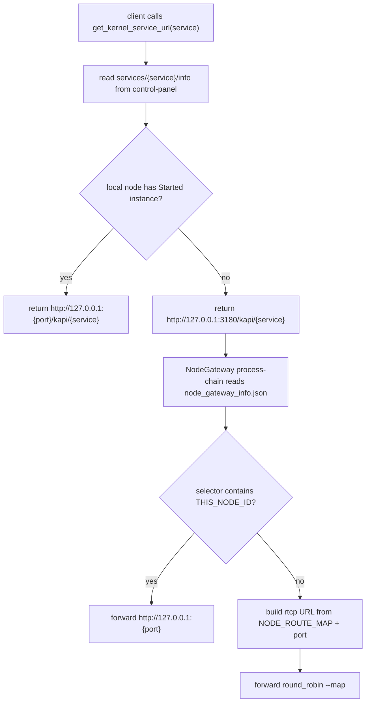
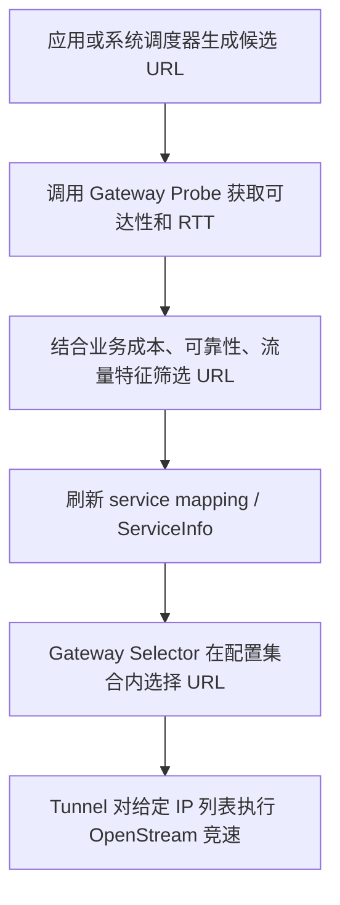

# BuckyOS Service Selector

`client(runtime) -> select_by_service_info(service_name) -> service_url list`

Service Selector 是 BuckyOS 分布式访问的基础机制：调用方先用目标服务的 `ServiceInfo` 得到可访问的 Provider 和路径集合，再向实际提供服务的 Node 发起请求。

本文根据 `doc/arch/gateway/服务的多链路选择.md` 的新设计和当前代码实现整理。核心更新是：Selector 不再被描述为“发现、探测、选择、失败扩散”的混合模块，而是一个基于已知配置做稳定选择的运行时组件。设备发现、多链路 URL 生产、业务成本判断和刷新节奏应由调度器或应用层调度逻辑负责。

## 1. 设计边界

### 1.1 Selector 负责什么

Selector 的输入是确定的 `ServiceInfo`、请求上下文和 Gateway 配置，输出是一个候选访问路径集合中的选择结果。

Selector 应该负责：

- 在 `ServiceInfo` 给出的 Provider 集合内选择 Node 或实例；
- 在 Gateway 配置允许的 URL 集合内执行稳定策略，例如单实例、权重、随机、RTT 优先、成本优先或 Failover；
- 保持选择逻辑可解释：相同输入应得到一致或符合权重语义的输出；
- 把服务访问限制在 `node_gateway_info.json` 中已生成的 `selector` 和 routes 集合内（升级前对应 `node_route_map`，升级后对应 per-source `routes`）。

Selector 不应该负责：

- 自动搜索设备 IP；
- 自动发现中转节点；
- 在配置未声明时把直连失败扩散到任意中转；
- 根据业务流量成本自行决定是否使用中转；
- 维护复杂的历史学习逻辑并隐式改变路径。

### 1.2 谁负责多链路生产

多链路选择拆成三层：

1. **应用层调度器 / 系统调度器**：根据业务语义、DeviceInfo、节点状态、成本和可靠性要求，生成或刷新候选 URL 集合。
2. **Gateway Selector**：只在已配置的 URL 或 Provider 集合内做标准选择和 Failover。
3. **Tunnel 内部**：对给定 IP 列表执行 IP 竞速、慢路径切换和连接级 Failover。

因此，如果一次请求走了中转，首先应检查“最近一次调度刷新结果是否包含直连 URL”。如果调度结果没有直连 URL，Gateway 走中转是正确行为。

## 2. 服务暴露模型

一个应用服务至少定义一个服务。服务可以通过两类方式暴露。

### 2.1 Web 服务

- 使用短域名暴露，例如 `app.zone.host` 或 shortcut；
- 使用 `node_id:port` 形式经 NodeGateway 转发；
- 非应用服务可以通过固定 URL 或 `/kapi/{service_name}` 暴露。

### 2.2 其它服务

- 使用协议 + 端口暴露；
- 使用 `node_id:port` 暴露；
- 经 Gateway 映射为本地 HTTP URL、本地端口，或未来的 SOCKS/TCP 透明连接。

## 3. 暴露边界

服务暴露边界有两种：

- **Node 级暴露**：服务只在某个 Node 上提供。
- **Zone 级暴露**：服务通过 ZoneGateway 暴露。实现上通常等价于在 ZoneGatewayNode 上暴露服务，再由 Gateway 转发到实际 Provider。

所有服务最终都可能在同一个 Node 上暴露，因此暴露信息不能冲突。调度器负责保证端口、短域名、路径等服务暴露信息不冲突。

## 4. 当前实现链路

当前实现不是一个独立的 `buckyos-select-service` Rust 模块，而是由调度器、`node_gateway_info.json` 和 cyfs-gateway process-chain 共同完成。

### 4.1 调度器生成 ServiceInfo

代码入口：

- `src/kernel/scheduler/src/scheduler.rs`
- `src/kernel/scheduler/src/service.rs`
- `src/kernel/scheduler/src/system_config_agent.rs`

调度核心流程：

1. 用户安装服务或应用后写入 `ServiceSpec`。
2. 调度器为 `ServiceSpec` 创建 `ReplicaInstance`。
3. node-daemon 按实例配置启动服务进程或容器。
4. 实例通过 `ServiceInstanceReportInfo` 上报状态和服务端口。
5. 调度器只把 `Running` 且 `last_update_time` 在 `INSTANCE_ALIVE_TIME = 90s` 内的实例计入 `ServiceInfo`。
6. 同一服务的 `ServiceInfo` 变更刷新至少间隔 `SERVICE_INFO_REFRESH_INTERVAL = 30s`。
7. 单实例生成 `SingleInstance`，多实例生成 `RandomCluster`。

写入 system-config 的服务发现数据结构是：

```rust
pub struct ServiceInfo {
    pub selector_type: String,
    pub node_list: HashMap<String, ServiceNode>,
}

pub struct ServiceNode {
    pub node_did: DID,
    pub node_net_id: Option<String>,
    pub state: ServiceInstanceState,
    pub weight: u32,
    pub service_port: HashMap<String, u16>,
}
```

当前 `selector_type` 写入为 `"random"`，`node_list` 是 `node_id -> ServiceNode`。

### 4.2 调度器生成 NodeGateway 配置

`system_config_agent.rs` 会把 `ServiceInfo` 转换成每个 Node 使用的 `node_gateway_info.json`：

```yaml
service_info:
  control-panel:
    selector:
      ood1:
        port: 3202
        weight: 100

node_route_map:
  node-a: rtcp://node-a.example.zone/
  node-b: rtcp://node-b.example.zone:2981/
```

其中：

- `service_info.{service}.selector` 表示该服务可选 Provider；
- selector 的 key 是 `node_id`；
- value 只包含当前服务端口和权重；
- `node_route_map` 目前为每个远端 Node 生成一个 `rtcp://{node_id}.{zone_host}/` 路由；
- 如果设备声明的 RTCP 端口不是 `2980`，路由会带显式端口。

这说明当前实现仍是“Provider Node 选择 + 每 Node 单 RTCP 路由”的模型，还没有实现“每个 Provider 多条 Tunnel URL”的完整模型。

### 4.3 Runtime 侧行为

`buckyos-api` 的 `get_kernel_service_url()` 当前行为是：

- 如果目标内核服务就在本机，且本机实例状态为 `Started`，直接返回 `http://127.0.0.1:{service_port}/kapi/{service_name}`；
- 否则返回 `http://127.0.0.1:3180/kapi/{service_name}`，交给本机 NodeGateway 转发。

也就是说，跨 Node 访问的真正路径选择由 NodeGateway 的 process-chain 和 `node_gateway_info.json` 完成，而不是由 SDK runtime 在进程内完成。

### 4.4 Gateway process-chain 侧行为

`src/rootfs/etc/boot_gateway.yaml` 中的关键逻辑是：

1. 根据请求 host 或 `/kapi/{service_name}` 找到 `TARGET_SERVICE_INFO`。
2. 如果 `TARGET_SERVICE_INFO.selector` 包含 `THIS_NODE_ID`，直接转发到本机 `http://127.0.0.1:{port}`。
3. 否则遍历 selector 中的远端 Node：
   - 从 `NODE_ROUTE_MAP[node_id]` 得到 RTCP 基础 URL；
   - 拼上服务端口；
   - 放入 `target_node_map`；
   - 执行 `forward round_robin --map $target_node_map`。

当前 process-chain 的选择对象是 `node_id -> rtcp route`，不是显式的多 URL 列表。

cyfs-gateway 上游的 `forward` 命令已经支持 `ForwardPlan` 形态（`--group-map` / `--backup-map` / `--next-upstream` / `--tries`，连接阶段 retry，URL history 业务回写到 tunnel_mgr，详见 cyfs-gateway `doc/forward机制升级需求.md`）。BuckyOS 这一侧的剩余工作是用 `ROUTES` 替换 `NODE_ROUTE_MAP`，process-chain 改为构造 primary / backup peer map 后调用 group forward，转发能力本身不需要再等上游。

## 5. 多链路新设计对 Service Selector 的要求

### 5.1 ServiceInfo 不应只表达最终单 URL

旧描述容易把 `select_by_service_info()` 理解为返回一个最终 URL。新模型下，更准确的语义是：

```text
service_name -> provider list -> candidate service_url list -> selected service_url
```

Provider 选择和 URL 选择是两个层次：

- Provider 选择回答“哪个实例提供这个服务”；
- URL 选择回答“从当前 Node 到该 Provider 走哪条链路”。

当前实现中这两个层次被压缩为：

```text
service selector: node_id + port
route map: node_id -> one rtcp URL
```

后续多链路实现应把 `node_id -> one route` 扩展为 `node_id -> route list`，并且每条路由都必须是显式配置的 URL。

### 5.2 不允许隐式中转扩散

中转节点必须显式出现在候选 URL 中。

正确语义：

```text
如果候选 URL 中只有 direct://node-a，则 Gateway 只能尝试 direct://node-a。
如果需要 relay-a 兜底，调度器必须显式下发 relay://relay-a/node-a。
```

错误语义：

```text
direct 失败后，Gateway 自动查找任意中转节点并改走中转。
```

禁止隐式扩散的原因是：中转可能有成本、安全、带宽和业务语义差异，不能由底层 Gateway 自动决定。

### 5.3 DeviceInfo 与直连选择

设备 IP 来源包括：

- DeviceInfo 自上报；
- 系统级设备搜索；
- 局域网发现；
- 历史成功连接数据。

新设计建议：

- DeviceInfo 上报时间在 30 秒内时可优先信任；
- 拿到有效 DeviceInfo 后，应停止更广泛搜索，只使用其中 IP 列表构造直连候选；
- 明确不可用的地址应先排除，例如目标只给 IPv6 但本机没有 IPv6 能力；
- RTCP Tunnel 对给定 IP 列表负责内部竞速；
- 上一次成功 IP 只能作为优先项，不应永久锁定；
- 如果 250ms 内未建立连接，可以尝试下一个 IP。

这些逻辑不应塞进 Service Selector。Selector 只能消费调度器或 Gateway Probe 已生成的候选 URL 和排序结果。

### 5.4 Gateway Probe API

为了让应用层调度器生成更好的 URL 集合，Gateway 应提供探测基础能力：

```text
输入：一组 Tunnel URL
输出：可达性、RTT、排序、失败原因
```

推荐只暴露“调用方传入 URL 的测速与排序结果”，不直接暴露 Gateway 内部所有已有 Tunnel URL。这样安全边界更清楚，也避免上层过度依赖底层连接状态。

## 6. 目标数据形态

多链路目标模型保持 **ServiceInfo 与 routes 两层独立**，避免把 "哪个 Node 提供" 与 "如何到 Node" 耦合在同一份结构里。两份数据分别维护、由 process-chain 在拼装时合成。

### 6.1 ServiceInfo（不变）

ServiceInfo 仍然只描述 `provider node × port × weight`：

```yaml
services/<spec_id>/info:
  selector_type: weighted_random
  node_list:
    node-a:
      weight: 100
      service_port:
        backup: 7001
    node-b:
      weight: 100
      service_port:
        backup: 7001
```

升级中 `selector_type` 可扩展为 `single` / `weighted_random` / `round_robin` / `rtt_first` / `cost_first_then_rtt` / `failover` / `affinity`，但内部结构仍然是 provider 列表 + 权重，不嵌入 routes。

### 6.2 routes（per source node）

routes 作为独立产物存在 `nodes/<source>/gateway_info.routes` 中，结构由 `boot_gateway的配置生成.md` 定义，是 `target_node_id -> route candidates` 的形态。同一 target node 在不同 source node 下可以有不同候选路径。

### 6.3 process-chain 合成 ForwardPlan

cyfs-gateway 的 `forward` 命令支持基于 process-chain 中的 map 动态构造 `ForwardPlan`（见 cyfs-gateway `doc/forward机制升级需求.md` §6.2）。BuckyOS 侧把 ServiceInfo + routes 合成 ForwardPlan 的伪代码：

```text
map-create primary_peers
map-create backup_peers

for node_id, node_info in TARGET_SERVICE_INFO.selector:
  if node_id == THIS_NODE_ID:
    forward "http://127.0.0.1:${node_info.port}"        # 本机短路
  else if ROUTES contains node_id:
    for route in ROUTES[node_id]:
      target_url = append_port(route.url, node_info.port)
      if route.backup:
        map-add backup_peers $target_url $node_info.weight
      else:
        map-add primary_peers $target_url $node_info.weight
  else:
    return route_missing(node_id)

forward --group-map $primary_peers \
        --backup-map $backup_peers \
        --next-upstream error,timeout \
        --tries 3
```

执行结果是 cyfs-gateway 在连接阶段按 primary → backup 顺序尝试，session 建立后不再透明切换；URL history 由 executor 回写 tunnel_mgr。

### 6.4 不内嵌 routes 的原因

- ServiceInfo 由 service 实例上报驱动（`ServiceInstanceReportInfo` + 90s 存活窗口），变更频率与服务生命周期对齐；
- routes 由 DeviceInfo 网络观测驱动，变更频率与网络环境变化对齐；
- 两者刷新节奏不同、来源不同，硬塞进一个结构会导致任一侧变化都触发对方重写，且 per source node 的 routes 没法表达在 service 共享的 ServiceInfo 中。

当前代码落地形态仍是 `selector + node_route_map`，目标形态是 `selector + per-source routes`。从 `node_route_map` 到 `routes` 的迁移是 breaking change，详见 `boot_gateway的配置生成.md`。

## 7. Selector 类型

### 7.1 当前已落地类型

- **单实例**：`SingleInstance`，只有一个可用实例，只能选择它。
- **随机集群**：`RandomCluster`，多实例带权重。当前 Gateway process-chain 使用 `round_robin --map` 按 map 执行转发。
- **静态 Web 应用**：`SelectorType::Static` 用于静态 Web App，不走普通服务实例选择。

### 7.2 规划类型

多链路设计下可以增加标准 Selector，但仍应只作用于已配置集合：

- `single`：只选唯一 Provider 或唯一 URL；
- `weighted_random`：按权重在 Provider 或 URL 间选择；
- `round_robin`：轮询；
- `rtt_first`：优先选择 Gateway Probe 或 Tunnel 统计中 RTT 更低的 URL；
- `cost_first_then_rtt`：先按业务成本过滤或排序，再按 RTT 排序；
- `failover`：主 URL 失败后切到下一个已配置 URL；
- `affinity`：按亲和标签、Node 区域或业务 affinity 选择 Provider。

不论类型如何，Selector 都不能自己发明未配置 URL。

## 8. 典型访问流程

### 8.1 当前内核服务访问流程



### 8.2 目标多链路流程



## 9. 排障模型

### 9.1 服务没有切到预期实例

先检查调度器输入和输出：

- `services/{spec_id}/instances/*` 是否有实例上报；
- 实例状态是否为 `Running` / `Started`；
- `last_update_time` 是否超过 90 秒存活窗口；
- 是否触发了 30 秒 `ServiceInfo` 刷新节流；
- `services/{spec_id}/info` 中是否包含预期 `node_id`；
- `node_gateway_info.json` 中的 `service_info.{service}.selector` 是否包含该 Node。

### 9.2 已发现直连 IP，但请求仍走中转

按新设计，先检查最近一次调度刷新结果：

- 如果结果中没有直连 URL，Gateway 走中转是正确的；
- 如果结果中有直连 URL，但 Gateway 没有选择它，再检查 Selector、Failover、Probe 结果和 Tunnel OpenStream 竞速逻辑；
- 如果直连 URL 是由过期 DeviceInfo 生成的，应重新触发发现或探测。

### 9.3 远端服务不可达

检查顺序：

1. `ServiceInfo` 是否还发布该实例；
2. `node_gateway_info.json` 是否包含该服务 selector；
3. `NODE_ROUTE_MAP[node_id]` 是否存在；
4. RTCP URL 是否带对了端口；
5. Gateway 日志中 `forward round_robin --map` 的目标是否符合预期；
6. Tunnel 层是否连接失败、超时或被身份校验拒绝。

## 10. 落地原则

- `ServiceInfo` 是 Selector 的输入，不是请求级健康检查结果。
- 调度器是服务 Provider 集合的唯一决策者，Gateway 不主动访问 system-config 做二次决策。
- Gateway 可以复用已有 Tunnel 统计做 Probe，但对上层只暴露可达性、RTT、排序和失败原因。
- 直连、中转和多中转必须以显式 URL 表达。
- 大流量业务如果要求直连，应在业务启动前强制刷新发现与 Probe；没有直连时应失败或提示，而不是让 Gateway 自动走中转。
- Boot 阶段可以更频繁刷新 URL 集合；平稳阶段应降低刷新频率，例如 5 到 10 分钟一次。
- 节点级探测优先于服务级探测，避免每个服务重复测同一组 Node 链路。

## 11. 当前实现与目标模型的差距

当前已实现：

- 调度器基于存活实例生成 `ServiceInfo`；
- `ServiceInfo` 写入 `services/{spec_id}/info`；
- 调度器生成 `node_gateway_info.json`；
- Gateway process-chain 可按本机优先、远端 RTCP、权重 map 转发；
- runtime 本机服务短路，否则交给 NodeGateway。

尚未实现或需要确认：

- `node_id -> 多 Tunnel URL` 的 Gateway 配置结构；
- Gateway URL Probe API；
- DeviceInfo 30 秒新鲜度和搜索停止策略的统一实现；
- RTCP Tunnel 每次 OpenStream 是否都会进入 IP 竞速；
- 250ms 慢路径切换是否覆盖所有直连场景；
- Selector 策略是否扩展为 RTT、成本、Failover 等标准类型；
- 调度刷新日志是否能关联到请求日志，方便解释“为什么走这条路径”。

## 12. 一句话总结

Service Selector 的正确定位是：**基于调度器已发布的服务与路径配置做稳定选择**。设备发现、直连 IP 生产、多中转候选、业务成本和刷新周期属于调度层；Gateway 只在显式配置的 URL 集合内选择，Tunnel 只对给定连接信息做底层竞速与 Failover。
