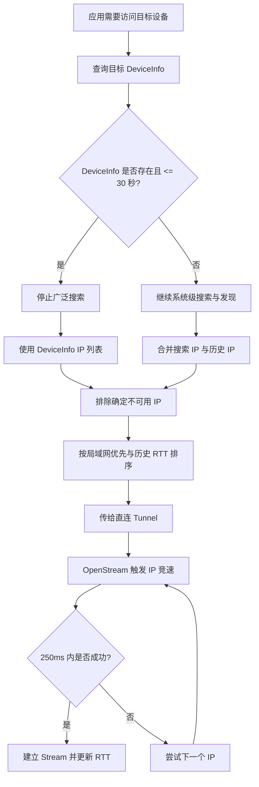
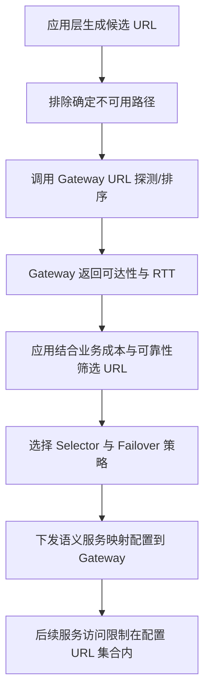
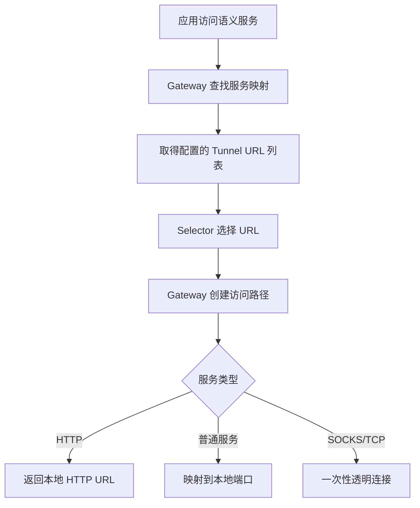

# BuckyOS 服务的多链路选择

> 本文整理自关于 BuckyOS 连接设备、直连与中转链路选择、Gateway 调度分层的讨论稿。目标是把“设备发现、Tunnel 探测、Selector 稳定选择、应用层调度”几个容易混淆的概念拆开，形成后续实现、排查和架构评审可使用的文档。

## 1. 背景与目标

BuckyOS 在访问一个目标设备或目标服务时，可能同时存在多条可用路径：

1. **直连路径**：通过设备查询、搜索、发现或设备自上报得到目标设备的 IP 地址，然后连接目标端口，例如 `2980`。
2. **中转路径**：通过一个或多个中转节点访问目标设备，每个中转节点通常对应一个明确的 Tunnel URL。

网络环境会持续变化，因此每次建立新的 Stream，本质上都可能是一次重新选择链路的机会。本文希望明确：

- 哪些选择由 Tunnel 内部完成；
- 哪些选择由 Gateway 完成；
- 哪些调度逻辑应该上移到应用层；
- 如何避免 Selector 同时承担“探测 + 调度 + 历史学习”导致的复杂度和隐式行为；
- 如何解释“已经发现直连 IP，但流量仍然走中转”等常见问题。

## 2. 核心结论

1. **多链路来源有两类**：设备 IP 与中转节点。设备 IP 用于直连，中转节点用于构造中转 Tunnel URL。
2. **直连优先**：如果存在可用的局域网地址，通常应该优先尝试直连。
3. **每次 OpenStream 都应该有机会触发链路选择**：特别是直连型连接，需要确认底层是否在每次 OpenStream 时执行了 IP 竞速与自动尝试逻辑。
4. **DeviceInfo 的新鲜度非常关键**：如果拿到 30 秒内的设备自上报信息，可以无条件信任，并停止更广泛的搜索，只使用 DeviceInfo 中的 IP 列表。
5. **Tunnel URL 不应该隐式扩散**：如果 Tunnel URL 中没有明确包含中转节点，就不应该由 Gateway 自动选择中转；宁可失败，也不要产生不可解释的隐式路径。
6. **Gateway 应提供探测基础设施，但 Selector 应尽量保持纯粹**：过去 Selector 同时负责探测和选择，容易导致全局性 Bug。新的分层应把自动发现逻辑上移到调度器。
7. **应用层调度器负责生产和刷新 URL 集合**：应用根据业务需求、成本、可靠性和底层探测结果，定期刷新语义服务到 Tunnel URL 列表的映射。
8. **运行时排障应围绕“上一次调度刷新结果”展开**：如果调度结果中没有直连 URL，则流量不走直连是正确行为；如果已刷入直连 URL 但没有走直连，再排查 Gateway 或 Tunnel 内部逻辑。

## 3. 术语与角色

| 术语 | 含义 |
| --- | --- |
| DeviceInfo | 设备自上报信息，至少应包含设备可用 IP 列表、上报时间等。 |
| 设备 IP | 通过查询、搜索、广播发现或 DeviceInfo 获取到的目标设备地址。 |
| Tunnel URL | 表示一条访问路径的 URL。直连路径和不同中转节点路径都可以表达为不同的 Tunnel URL。 |
| RTCP Tunnel | 底层 Tunnel 实现之一。给定 IP 列表后，内部具备竞速和自动尝试下一个 IP 的能力。 |
| OpenStream | 建立一次新的 Stream。每一次 OpenStream 都可能触发一次链路选择。 |
| Gateway | 协议栈所在位置，负责创建 Tunnel、维护底层统计信息、执行服务映射与 Selector 策略。 |
| Selector | Gateway 中对一组 Tunnel URL 执行稳定选择的策略，例如 RTT 优先、成本优先、固定优先级等。 |
| Failover | 当前路径失败时如何切换到下一条路径的策略。 |
| 调度器 | 应用层逻辑，负责根据业务需求和 Gateway 探测信息生成 URL 列表，并下发给 Gateway。 |
| 语义服务 | 应用真正想访问的逻辑服务，例如某个 HTTP 服务、备份服务或文件同步服务。 |

## 4. 多链路来源

### 4.1 设备 IP 来源

目标设备的 IP 可以来自：

- 系统级搜索器按 Device ID 持续搜索；
- UDP 广播、局域网发现等搜索机制；
- 设备自上报的 DeviceInfo；
- 历史连接数据。

设备 IP 的核心用途是构造直连候选路径。若 IP 列表中存在局域网地址，通常应优先尝试，因为它通常成本低、延迟低、吞吐更好。

### 4.2 中转节点来源

中转链路来自一个或多个可用中转节点。每个中转节点通常会形成一个明确的 Tunnel URL。

需要避免假设“系统只有一个中转节点”。BuckyOS 是可扩展系统，用户未来可能拥有多个中转节点。如果仍按单中转逻辑处理，会破坏语义并引入 Bug。

因此，在不排除任何路径时，候选集合可能是：

```text
直连 Tunnel URL
中转 Tunnel URL #1
中转 Tunnel URL #2
中转 Tunnel URL #3
...
```

最终可能只使用其中一条，但调度与排查时必须承认它们是不同候选路径。

## 5. DeviceInfo 与搜索流程

### 5.1 搜索优化原则

系统级搜索器会根据 Device ID 不断尝试获取目标设备 IP。若通过某种方式拿到设备自上报信息，搜索范围可以大幅缩小。

DeviceInfo 的核心价值不是证明网络状态绝对正确，而是提供一个新鲜的、可信度较高的候选 IP 列表，从而避免逐个盲测更大的地址空间。

### 5.2 新鲜度窗口

当前建议：

```text
DeviceInfo 上报时间 <= 30 秒：无条件信任
DeviceInfo 上报时间 > 30 秒：视为可能过期，需要结合搜索、历史数据或重新探测
```

30 秒是当前经验值，也可以配置为其他时间，例如 2 分钟。但从传统 TCP 与网络抖动经验看，30 秒是一个较合理的默认值。

### 5.3 何时禁用搜索

当系统拿到有效期内的 DeviceInfo 时：

1. 立刻停止更广泛的设备搜索；
2. 只使用 DeviceInfo 中的 IP 列表；
3. 将该 IP 列表传递给直连型 Tunnel；
4. 由 Tunnel 内部执行 IP 竞速与自动尝试。

这可以减少搜索成本，并避免搜索结果与最新自上报结果相互干扰。

## 6. 直连链路选择

### 6.1 输入数据

直连选择主要依赖以下信息：

- DeviceInfo 中的 IP 列表；
- 搜索器发现的 IP；
- 历史连接成功记录；
- 不同 IP 的 RTT 历史记录；
- 本机网络能力，例如是否具备 IPv6；
- 是否存在局域网地址。

### 6.2 排除法

在进入竞速前，应先排除百分之百不可用的路径。

典型例子：

- 目标设备只上报 IPv6 地址；
- 当前本机没有 IPv6 连接能力；
- 则直连 IPv6 路径可以直接排除。

排除法的目标是减少待测试 Tunnel URL 或 IP 数量，使后续竞速和探测成本尽可能低。

### 6.3 RTT 与最近路径

系统应保存机器级别的 RTT 历史记录。对于直连 IP：

1. 如果存在多条可选链路；
2. 且历史记录中有 RTT；
3. 则优先选择 RTT 最低的路径。

从行为上看，目标是选择“最近”的链路。但需要注意：历史最快路径不一定永远最快，因此每次 OpenStream 是否真正执行了竞速逻辑，是需要重点确认的实现细节。

### 6.4 RTCP Tunnel 内部竞速机制

当前 RTCP Tunnel 在建立连接时，只要给它一个 IP 列表，内部已经具备：

- IP 竞速；
- 自动尝试下一个 IP；
- 基于响应时间的失败判断。

当前讨论中的关键阈值是：

```text
如果上一次成功 IP 在 250 ms 内没有连接成功，则认为值得尝试下一个 IP。
```

这里的“失败”不一定是 TCP 连接真正失败，而是“足够慢”。也就是说，只要连接没有在 250 ms 内建立，就可以开始尝试下一条路径。

### 6.5 每次 OpenStream 的确认点

需要确认：

> 直连型连接是否在每次 OpenStream 时都执行了竞速逻辑？

如果没有执行，而是只要旧连接可用就持续复用，那么系统可能长期沿用第一次选中的路径，不会主动发现后来更快的 IP。

当前可接受的行为是：

1. 第一次连接时选择历史或竞速结果中的最佳 IP；
2. 后续 OpenStream 优先尝试上一次成功 IP；
3. 如果 250 ms 内无响应，则尝试下一个 IP；
4. 成功后更新 RTT 和历史成功记录。

这种策略避免每次都做完整探测造成浪费，同时允许网络慢到一定程度时触发重新选择。

## 7. 多 Tunnel URL 与中转选择

### 7.1 不使用隐式中转

当前架构使用基于 URL 的控制。中转信息必须包含在 Tunnel URL 中。

因此：

```text
如果 Tunnel URL 中没有包含确定的中转节点，就不触发中转。
```

即使直连失败，也不应由 Gateway 自动扩散到任意中转节点。这样做的好处是路径可解释、可调试，也避免业务流量意外进入高成本中转。

### 7.2 多中转候选

当存在多个可能的中转节点时，应将每个中转节点表达为独立 Tunnel URL。

例如：

```text
候选 #1：direct://device-id
候选 #2：relay://relay-a/device-id
候选 #3：relay://relay-b/device-id
候选 #4：relay://relay-c/device-id
```

然后通过排除法、探测与排序确定哪些路径可用，以及优先使用哪条。

### 7.3 Gateway 级探测基础设施

由于协议栈在 Gateway 内部，而业务服务进程通常没有权限直接创建 Tunnel，因此需要 Gateway 提供一套标准能力：

```text
输入：一个或一组 Tunnel URL
输出：每个 Tunnel URL 的可达性、RTT、排序结果、可能的失败原因
```

这个能力类似于 IP 排序，但对象从 IP 扩展为 Tunnel URL。

### 7.4 复用已有 Tunnel 状态

很多 Tunnel 协议本身带有 Ping-Pong 或保活机制。如果某个 Tunnel 已经在工作，Gateway 可以复用已有统计信息，而不一定真的重新发起探测。

从上层看，它只需要得到结果：

```text
URL A：可达，RTT 20 ms
URL B：可达，RTT 80 ms
URL C：不可达
```

上层不需要知道 Gateway 是重新探测得到的，还是复用了已有连接状态。

### 7.5 是否暴露底层 URL 列表

这里有两种方案：

#### 方案一：直接暴露查询能力

允许上层查询当前设备到底层已经存在的 URL 列表。

优点：

- 信息完整；
- 调度器实现简单；
- 便于诊断。

缺点：

- 安全隔离较弱；
- 上层可能过度依赖底层内部状态；
- URL 列表可能泄露拓扑信息。

#### 方案二：只暴露测速与排序结果

上层传入自己构造的一组 URL，Gateway 返回测速结果与排序，不直接暴露底层已有 URL 列表。

优点：

- 安全边界更清晰；
- Gateway 可以自由决定是否复用已有连接；
- 上层只看到可达性与性能结果，而看不到不该知道的内部状态。

缺点：

- 上层需要自己生产候选 URL；
- 诊断时需要更多日志辅助。

当前更偏向第二种方案：Gateway 提供协议栈视角下的 URL 速度列表，但不直接暴露内部连接全集。

## 8. 服务访问的三层语义

实际使用中，应用通常不会直接操作底层 Tunnel，而是希望访问某个服务。服务访问可以分为三层。

### 8.1 第一层：访问逻辑语义服务

应用真正想访问的是一个逻辑服务，例如：

- 某个设备上的 HTTP 服务；
- 文件同步服务；
- 备份服务；
- 控制命令服务；
- 普通 TCP 服务。

一个语义服务可能有多个 Provider，也可能通过多条 Tunnel URL 到达。

### 8.2 第二层：Provider 列表与选择逻辑

应用层负责给出候选 Provider 或 URL 列表。Gateway 负责配合执行标准选择策略，例如：

- RTT 优先；
- 成本优先；
- 固定优先级；
- 权重负载均衡；
- Failover；
- 只选可达路径。

Gateway 的职责是忠实执行配置，而不是自动发明业务语义。

### 8.3 第三层：创建访问路径

选择完成后，Gateway 创建实际访问路径：

- 如果是 HTTP 服务，可以映射为本地 HTTP URL；
- 如果是普通服务，可以映射到本地端口；
- 如果未来支持 SOCKS，可将其视为一次明确透明的 TCP 连接类操作。

普通服务映射到本地端口会带来一定资源浪费；SOCKS 更适合一次性连接，但会弱化“服务”概念。对于拓扑无关的稳定访问逻辑，建议优先使用服务映射。

## 9. 三层架构分工

### 9.1 最底层：Tunnel 内部

Tunnel 内部负责非常底层的连接行为。

职责：

- 对给定 IP 列表执行竞速；
- 在 IP 慢或失败时自动尝试下一个；
- 维护直连 IP 的 RTT 或连接历史；
- 执行连接级 Failover。

不负责：

- 判断设备 IP 从哪里来；
- 理解业务成本；
- 判断某个中转节点是否适合备份业务；
- 自动扩展到未配置的 Tunnel URL。

底层能力应尽量固定，策略上不承载复杂业务逻辑。

### 9.2 中间层：Gateway 服务映射与 Selector

Gateway 负责将语义服务映射到一组 Tunnel URL，并执行标准 Selector 与 Failover 策略。

职责：

- 管理语义服务到 Tunnel URL 列表的映射；
- 提供 URL 探测、测速、排序基础设施；
- 执行标准 Selector；
- 执行 Failover；
- 维护协议栈级统计信息；
- 限制请求只在配置允许的 URL 集合中转发。

不负责：

- 自动发现所有可能 URL；
- 根据业务场景自行决定是否使用昂贵中转；
- 在未配置情况下进行隐式路径扩散。

Gateway 的目标是：看到配置文件时，可以大致预测不同网络情况下请求会如何转发。

### 9.3 最上层：应用调度器

应用调度器负责生产和刷新 URL 集合。

职责：

- 根据业务语义生成候选 URL；
- 结合 Gateway 排序结果筛掉不可用或不合适的 URL；
- 根据成本、可靠性、延迟、流量等业务维度做调度；
- 定期刷新语义服务与 URL 的映射；
- 决定 Selector 类型与参数；
- 在必要业务场景中执行强制探测。

应用层不应该自己实现大量底层 Selector，而应该使用 Gateway 提供的标准 Selector。应用层的核心工作是编排：把 URL 生产出来、筛选好、下发给 Gateway。

## 10. Selector 与探测逻辑解耦

过去容易混淆的是：把“探测基础设施”和“稳定运行时选择器”混在一起。

例如，一个 Selector 同时做：

- 自动发现设备 IP；
- 自动发现中转节点；
- 测速；
- 读取历史访问记录；
- 决定下一次路径；
- 在失败时隐式扩散路径。

这会导致逻辑难以预测，并引发类似问题：

> 明明已经探测到设备直连 IP，为什么流量还在走中转？

新的分层建议：

```text
自动发现与探测：上移到应用调度器和 Gateway 探测基础设施
稳定选择：留在 Gateway Selector
IP 竞速：留在 Tunnel 内部
```

这样可以简化 Gateway 代码，也让运行时行为更可解释。

## 11. 调度刷新策略

### 11.1 Boot 阶段

系统刚启动时，目标是尽快让系统跑起来。因此可以更激进地刷新：

- 更频繁搜索设备 IP；
- 更频繁获取 DeviceInfo；
- 更积极探测可用 URL；
- 对核心服务优先构造访问路径。

此时不必过度节省探测成本。

### 11.2 平稳运行阶段

系统稳定后，数据来源变多，探测成本也会上升。此时应降低刷新频率，例如：

```text
每 5 到 10 分钟刷新一次 URL 集合
```

刷新时可以使用更全面的统计数据，包括：

- 历史 RTT；
- 最近连接成功率；
- 业务成本；
- 中转节点费用；
- 服务可靠性要求；
- 是否有新 URL 出现；
- 旧 URL 是否应删除。

### 11.3 节点级探测优先于服务级探测

URL 或节点探测应尽量是全局性的，而不是每个应用、每个服务重复执行。

更合理的视角是：

```text
节点到节点的拓扑探测
```

而不是：

```text
节点上的某个服务到另一个节点上的某个服务的探测
```

应用可以针对一两个核心服务加快构造过程，但底层探测数据应尽量复用。

## 12. 典型流程

### 12.1 设备直连流程



### 12.2 多 Tunnel URL 调度流程



### 12.3 服务访问流程



## 13. 调度结果示例

### 13.1 候选 URL

```yaml
service: buckyos.backup.device-a
providers:
  - url: direct://device-a
    type: direct
  - url: relay://relay-a/device-a
    type: relay
  - url: relay://relay-b/device-a
    type: relay
  - url: relay://relay-c/device-a
    type: relay
```

### 13.2 Gateway 探测结果

```yaml
probe_result:
  - url: direct://device-a
    reachable: true
    rtt_ms: 18
    reason: lan_ip_available
  - url: relay://relay-a/device-a
    reachable: true
    rtt_ms: 72
    reason: relay_ping_ok
  - url: relay://relay-b/device-a
    reachable: true
    rtt_ms: 120
    reason: relay_ping_ok
  - url: relay://relay-c/device-a
    reachable: false
    rtt_ms: null
    reason: relay_unreachable
```

### 13.3 应用下发的服务映射

```yaml
service_mapping:
  service: buckyos.backup.device-a
  selector: cost_first_then_rtt
  failover: next_available
  urls:
    - direct://device-a
    - relay://relay-a/device-a
```

含义：

- 只允许该服务在 `direct://device-a` 和 `relay://relay-a/device-a` 之间选择；
- 不允许 Gateway 自动扩散到其他中转；
- 选择策略由标准 Selector 执行；
- 业务层可以在下一个调度周期刷新该配置。

## 14. 业务策略示例

不同业务可以基于同一组 URL 探测结果，下发不同策略。

| 业务类型 | 主要目标 | 可能策略 |
| --- | --- | --- |
| 控制命令 | 低延迟、高可用 | RTT 优先，失败快速切换 |
| 文件备份 | 大流量、低成本 | 直连优先，便宜中转兜底，必要时强制直连探测 |
| 文件同步 | 延迟与吞吐平衡 | RTT + 成功率综合排序 |
| 后台同步 | 成本优先 | 低成本中转或直连优先，延迟要求较低 |
| 临时访问 | 快速可达 | 使用 Gateway 排序结果中的首个可达 URL |

## 15. 排障模型

新的分层可以把排障拆成两个问题。

### 15.1 调度结果是否包含预期 URL

当出现：

> 已经探测到直连 IP，但流量仍然走中转。

首先检查请求发生前最近一次调度器刷新日志。

如果刷新结果中没有直连 URL 或设备 IP，则流量不走直连是正确行为。问题不在 Gateway，而在调度器或发现流程：

- 是否没有拿到有效 DeviceInfo；
- 是否搜索结果过期；
- 是否本机能力不支持目标 IP 类型；
- 是否业务策略主动过滤了直连；
- 是否还没有到刷新周期。

### 15.2 Gateway 是否正确执行配置

如果刷新结果中已经包含直连 URL 和设备 IP，但请求仍未走直连，则问题范围缩小到 Gateway 或 Tunnel 内部：

- Selector 是否按配置执行；
- Failover 是否过早切换；
- RTCP Tunnel 是否在 OpenStream 时执行竞速；
- 上一次成功 IP 是否被错误长期复用；
- 250 ms 阈值是否生效；
- RTT 历史是否被错误更新；
- 是否存在控制 Tunnel 与数据 Stream 逻辑混淆。

## 16. 强制调度逻辑

某些业务在开始前可能必须确认直连存在。例如备份业务通常流量大，如果误走中转，成本可能不可接受。

此时可以引入强制调度逻辑：

1. 业务启动前手工触发一次设备发现和 URL 探测；
2. 强制刷新调度器结果；
3. 如果发现直连 URL，则只下发直连或直连优先策略；
4. 如果不存在直连 URL，则直接放弃或提示用户，而不是自动使用中转。

示例：

```yaml
service: buckyos.backup.device-a
preflight:
  require_direct: true
  refresh_before_start: true
  fail_if_direct_unavailable: true
```

## 17. 实现检查清单

### 17.1 直连与 OpenStream

- [ ] 每次 OpenStream 是否都会进入直连 IP 选择逻辑？
- [ ] 上一次成功 IP 是否只是优先项，而不是永久锁定项？
- [ ] 250 ms 未成功时是否会尝试下一个 IP？
- [ ] RTT 历史是否按机器级别记录？
- [ ] 连接成功后是否更新 RTT 与最后成功 IP？
- [ ] 控制 Tunnel 的保活逻辑是否与数据 Stream 的竞速逻辑分离？

### 17.2 DeviceInfo 与搜索

- [ ] DeviceInfo 是否包含必要 IP 列表与上报时间？
- [ ] 30 秒有效期是否可配置？
- [ ] 拿到有效 DeviceInfo 后是否停止广泛搜索？
- [ ] 过期 DeviceInfo 是否会触发重新搜索或探测？
- [ ] 搜索结果与 DeviceInfo 合并时是否有明确优先级？

### 17.3 Tunnel URL 与 Gateway

- [ ] 中转节点是否必须显式写入 Tunnel URL？
- [ ] Gateway 是否禁止未配置情况下的隐式中转扩散？
- [ ] 是否支持输入一组 Tunnel URL 并返回可达性与排序？
- [ ] Gateway 是否可以复用已有 Tunnel 的 Ping-Pong 统计？
- [ ] 是否区分“不可达”和“慢到应尝试下一条路径”？

### 17.4 Selector 与调度器

- [ ] Selector 是否只做稳定选择，不负责自动发现？
- [ ] 应用层是否负责生产和刷新候选 URL？
- [ ] URL 刷新周期是否根据 Boot 阶段和平稳阶段区分？
- [ ] 业务成本、可靠性、流量特征是否在应用层处理？
- [ ] Gateway 配置是否能限制访问不扩散到未授权 URL？

## 18. 待确认问题

1. RTCP Tunnel 在每次 OpenStream 时，是否一定执行 IP 竞速逻辑？
2. 当前“250 ms 未响应即尝试下一个 IP”的逻辑是否覆盖所有直连场景？
3. 控制命令 Tunnel 的保活逻辑是否会影响数据 Stream 的重新选择？
4. DeviceInfo 中应包含哪些必要字段，才能支持更准确的最短路径判断？
5. Gateway 对外应暴露底层 URL 列表，还是只暴露输入 URL 的测速与排序结果？
6. 多中转节点场景下，Selector 的标准策略集合需要包含哪些类型？
7. 对备份等大流量业务，是否需要内置 `require_direct` 这样的强制调度策略？
8. URL 探测结果的缓存时间应如何设置？是否与 DeviceInfo 的 30 秒窗口一致？
9. Boot 阶段与平稳阶段的刷新频率是否需要统一配置模型？
10. Gateway 日志是否能按“调度刷新 ID”关联到后续请求，便于排查？

## 19. 推荐落地方案

建议按以下方向推进：

1. **明确 DeviceInfo 结构**：至少包含 IP 列表、地址类型、上报时间、可选网络接口信息。
2. **确认 RTCP Tunnel OpenStream 行为**：确保每次数据 Stream 都有机会触发 IP 竞速，而不是只依赖旧连接。
3. **实现 Gateway URL Probe API**：输入 Tunnel URL 列表，输出可达性、RTT、排序和失败原因。
4. **将 Selector 简化为纯选择器**：去掉自动发现逻辑，只执行配置中的 URL 选择与 Failover。
5. **应用层实现调度器**：负责发现、筛选、业务排序和刷新服务映射。
6. **引入调度刷新日志**：每次服务映射刷新生成日志与版本 ID，请求日志关联该版本，方便诊断。
7. **为大流量业务提供强制策略**：例如 `require_direct`、`fail_if_direct_unavailable`、`refresh_before_start`。

## 20. 一句话总结

BuckyOS 的多链路选择应拆成三件事：**Tunnel 内部只做 IP 竞速，Gateway 只做配置内的稳定选择，应用调度器负责发现、筛选和刷新 URL 集合**。这样既能保持直连优先和多中转可扩展，又能让每一次请求为什么走某条路径变得可解释、可排查。
