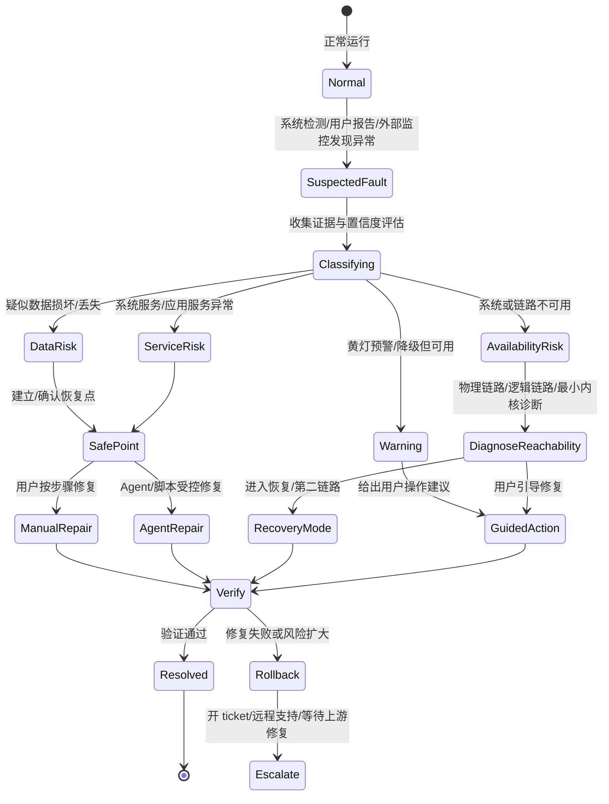

# BuckyOS 系统故障处理规划


## 1. 背景

BuckyOS 面向 Personal Server 场景，目标不是传统云服务中的“线上运维体系”，而是一个尽量 **zero-operation** 的用户环境。在传统在线服务中，错误处理往往默认存在 SRE/运维人员：系统保留日志、保留现场，然后等待有经验的人介入排障。但 Personal Server 部署在用户家中、个人设备上或小规模私有集群中，用户通常没有运维能力，也不应该被迫理解复杂的分布式系统细节。

因此，BuckyOS 的故障处理不能只做“日志导向”的工程设施，而必须从用户角度出发，把故障导向以下几种明确结局：

1. 系统给出清晰、可执行、低风险的操作指引，用户按步骤即可完成故障恢复。
2. 系统或 Agent 在受控范围内自动修复故障，并能控制修复动作的爆炸半径。
3. 在自动修复或人工修复之前，系统能够建立可靠的回退点或恢复点。
4. 当无法立即修复时，系统至少能清楚地告诉用户：数据是否安全、故障影响范围是什么、下一步该做什么。

本规划的核心目标是：**让用户在故障发生时不恐慌，让系统在故障中仍然有最小可诊断面、最小可恢复面和明确的兜底路径。**

## 2. 总体目标与设计原则

### 2.1 总体目标

- 建立一套面向 Personal Server 的故障状态机。
- 定义用户可感知的故障类型，而不是仅按工程内部模块分类。
- 建立从物理链路、逻辑链路、最小内核、系统服务、应用服务到数据完整性的分层诊断能力。
- 明确重启、重置、恢复、应用重装、数据校验等排障动作的边界。
- 为 Agent 自动修复预留安全机制：授权、回退点、范围控制、验证和审计。
- 为商用硬件和开源方案分别定义最低诊断能力和增强诊断能力。

### 2.2 设计原则

| 原则 | 说明 |
| --- | --- |
| 用户视角优先 | 故障信息必须先回答用户最关心的问题：数据是否还在、系统是否可恢复、该做什么。 |
| 数据安全优先 | 数据损坏/丢失是最高优先级故障。任何修复动作都不能扩大数据损失。 |
| 最小可诊断面 | 即使完整系统不可用，也要保留极小、稳定、长期不变的诊断接口。 |
| 最小可恢复面 | 至少支持查看状态、确认设备、发起受控重启、进入恢复流程。 |
| 不依赖人工运维 | 不能假设用户可以读懂日志、SSH 登录、手工修配置。高级用户能力只能作为增强路径。 |
| 修复前可回退 | 自动修复、Agent 修复、复杂运维脚本执行前，必须尽量建立可靠恢复点。 |
| 控制爆炸半径 | 小故障不能因为错误修复变成大故障。修复动作要有范围、权限和前置检查。 |
| 置信度建模 | 系统检测、用户报告、Agent 判断都应带置信度；用户报告是线索，不应直接视为事实。 |
| 可观测但不过度暴露 | 普通用户看到可理解结论，高级用户可以拿到详细诊断报告。 |
| 分布式重启要严肃处理 | BuckyOS 是分布式系统，整体 reboot 不是简单地“全节点一起重启”。 |

## 3. 故障处理状态机

### 3.1 用户视角状态机



### 3.2 状态机关键点

1. **故障入口有两类**：系统自动检测、用户主动报告。
2. **用户报告不能直接等同于事实**：例如用户误删文件后认为“数据丢失”，系统应将其作为低置信度线索进入排查流程。
3. **先分类，再修复**：优先判断是否涉及数据安全，其次判断是否涉及可访问性，再判断是系统服务还是应用服务问题。
4. **复杂修复前必须确认恢复点**：尤其是 Agent 修复、批量脚本修复、版本切换、数据恢复、系统重置。
5. **最终结局要明确**：已修复、已回滚、进入恢复模式、创建 ticket、等待上游修复、建议硬件处理等。

## 4. 故障分类

### 4.1 数据损坏或数据丢失

这是最高优先级故障，也是用户最敏感的故障。

典型场景：

- 昨天还能访问的文件今天打不开。
- 图片、聊天记录、文档等用户数据突然不可读。
- 文件仍存在，但数据库或索引无法打开。
- 应用能启动，但某些历史数据无法显示。
- 系统检测到对象哈希不一致、数据库损坏、存储桶不可用。

触发来源：

| 来源 | 说明 | 处理方式 |
| --- | --- | --- |
| 系统自动检测 | 例如数据库打开失败、对象哈希校验失败、存储桶不可读。 | 高置信度进入故障流程，必要时二次确认。 |
| 用户主动报告 | 用户通过统一入口报告“数据坏了/数据没了”。 | 作为线索处理，需要进一步校验，不直接判定数据损坏。 |

处理要求：

- 提供统一的“报告数据损坏/数据丢失”入口。
- 对系统检测到的明确损坏，应自动创建故障事件。
- 对用户报告，应引导用户描述对象、时间、现象，并自动比对删除记录、备份点、最近变更记录。
- 如果能确认数据仍在但服务不可用，应优先向用户展示让其安心的信息，例如：最近 24 小时修改的文件名、大小、时间、上一次备份点状态。
- 修复前必须确认备份点或快照状态，避免修复动作扩大损害。

### 4.2 系统不可用

系统不可用要拆成两类：

1. **数据损坏导致的不可用**：用户甚至无法判断数据是否还在，严重级别高。
2. **访问不可用但数据仍安全**：系统应尽快告诉用户“数据还在，只是访问链路或服务异常”。

不可用故障进一步分为物理链路、逻辑链路、最小内核、完整内核、系统服务、应用服务等层级。

### 4.3 链路不可用

#### 4.3.1 物理链路不可用

典型原因：

- 用户家中断网。
- Personal Server 到路由器之间的网线、Wi-Fi、交换机异常。
- 路由器死机、掉电、长期未重启。
- 设备掉电或硬件故障。
- 多设备集群中某个交换机、某段局域网链路异常。

产品要求：

- Desktop 版：引导用户确认该设备本身能否访问公共互联网。
- 硬件版：必须提供最低限度的 LED 状态灯；高规格设备可提供小屏幕。
- 状态灯至少应能表达：电源状态、联网状态、系统诊断/故障状态。
- “是否联网”的检测必须独立于 BuckyOS 主系统，不能依赖复杂系统服务。
- 物理链路排查应提供标准用户流程，而不是直接暴露 uplink error 等工程化错误。

#### 4.3.2 逻辑链路不可用

逻辑链路包括：

- 直连链路。
- 中转/Relay 链路。
- DNS、证书、协议握手、网关路由等。
- 用户自建 VPN、自购域名、自配证书等高级配置。

产品要求：

- BuckyOS App 内置“链路诊断工具”。
- App 应能诊断从当前设备到用户 Personal Server 的路径在哪一环失败。
- 对普通用户：输出“我们的中转服务异常”“你的设备离线”“DNS/证书异常”等清晰结论。
- 对高级用户：提供详细报告，包括域名、证书、协议、VPN、Relay、Gateway 等诊断信息。
- 如果是官方中转服务异常，应链接到官方运维公告或状态页。
- 如果官方尚未发布公告，应允许用户一键创建 ticket，并附带诊断报告。

### 4.4 内核不可用

BuckyOS 的故障严重度不应只按“哪个模块出错”分类，而应按“导致哪一层不可用”分类。

建议分类：

| 层级 | 状态 | 用户影响 | 可用操作 |
| --- | --- | --- | --- |
| L0 物理层不可达 | 设备断电/断网/链路断开 | 完全无法远程诊断 | 本地检查、电源/网络/LED 指引 |
| L1 最小诊断 Gateway 可达 | 主系统可能不可用，但诊断口可达 | 可读取极少量状态 | 查看 last status、故障转储、进入恢复 |
| L2 最小内核可用 | Gateway + SystemConfig + NodeDaemon 可用 | 可读状态，可发起有限动作 | 指定设备重启、读取拓扑、基础修复 |
| L3 完整控制面可用 | WorkflowHub + Scheduler 可用 | 可执行授权运维脚本 | 脚本修复、Agent 修复、服务管理 |
| L4 系统服务层异常 | 内核可用，系统服务不可用 | 部分能力缺失 | 重启/重装系统服务、依赖修复 |
| L5 应用层异常 | 某个应用或功能不可用 | 局部业务受影响 | 应用重启、重装、数据清理、版本选择 |

### 4.5 系统服务不可用

系统服务不可用时，通常完整内核仍可用，但某些服务无法启动、异常退出、升级后不可用，或依赖组件异常。

需要特别处理“软系统服务”：

- Docker Engine 等不属于 BuckyOS 进程树，但被 BuckyOS 依赖的服务。
- Desktop 版中，这类依赖更像系统服务，需要纳入诊断、升级、重启和修复流程。
- 用户手工升级还是系统自动修复，需要明确策略。

### 4.6 应用服务不可用

典型现象：

- 昨天能用的应用今天不能用。
- 应用升级后无法启动。
- 应用能启动但处理旧数据时崩溃。
- 新版本应用与旧版本应用数据不兼容。

处理方向：

- 允许用户重启应用服务。
- 允许用户卸载/重装应用。
- 卸载时明确选择是否保留用户数据、应用数据。
- 允许先备份应用数据，再清空应用数据重装。
- 允许在恢复场景下安装旧版本应用，验证是否为版本兼容问题。
- 提供“应用数据导入后再次崩溃”的验证路径，帮助用户判断是否为应用数据触发的 bug。

## 5. 最小诊断能力规划

### 5.1 安全模式组件

BuckyOS 需要一组极小、稳定、基本不随系统演进而变化的安全模式组件。它们不承担复杂业务，只承担“系统还在”和“状态可读”的职责。

最低能力：

- 定期 dump 系统最小状态。
- 暴露几个稳定的只读状态文件或接口。
- 允许 Gateway 在主系统大面积故障时读取这些文件。
- 尽量不依赖其他复杂进程。
- 能表达上一次健康状态、最近一次心跳、最近一次异常、是否发生安全关机。

建议暴露的信息：

| 信息 | 目的 |
| --- | --- |
| last heartbeat | 告诉用户系统上次正常的时间。 |
| last healthy status | 告诉用户故障前系统是否健康。 |
| last shutdown reason | 区分正常关机、断电、UPS 触发、安全关机。 |
| device topology snapshot | 展示系统有哪些设备、哪些在线。 |
| critical service snapshot | 展示 Gateway、SystemConfig、NodeDaemon 等核心组件状态。 |
| recent data activity summary | 展示最近修改的数据摘要，增强用户对数据安全的信心。 |

### 5.2 故障转储区

建议由 Relay/中转服务为每个 Personal Server 提供一个极小的故障转储区。

特征：

- 容量很小，只保存最近 5～10 条关键状态。
- 保存 keepalive、健康状态、关机原因、UPS 触发等信息。
- 不保存大日志，不承担完整日志系统职责。
- 目的是在主设备完全不可达时，仍然能让用户知道“故障前系统是什么状态”。

### 5.3 Gateway 分层

Gateway 需要区分两类角色：

1. **业务 Gateway**：承担完整路由、协议、请求分发、微内核式函数调用分离等复杂职责。
2. **诊断 Gateway**：长期稳定、能力极小，只用于最小诊断、状态文件读取、恢复入口。

诊断 Gateway 的原则是“足够简单，少变化，少依赖”。只要链路能到它，就应尽量能返回最小状态。

## 6. 核心组件与故障能力映射

| 组件 | 定位 | 故障时的意义 |
| --- | --- | --- |
| Gateway / ServiceGateway | 系统可访问性的入口与路由分发器 | 挂掉后外部访问基本不可用。 |
| NodeGateway | 单设备上的基础访问入口 | 用于节点级诊断和恢复。 |
| SystemConfig | 分布式系统配置与核心状态存储，类似单机 `/etc` 或分布式 etcd | 挂掉后系统状态面不可用。 |
| NodeDaemon | 节点执行器，负责保护类任务和一次性 FunctionInstance 执行 | 没有它，很难真正执行修复动作。 |
| WorkflowHub | 工作流/授权动作入口 | 让系统以正常认证模式执行复杂动作。 |
| Scheduler | 调度与指令下发 | 与 WorkflowHub 共同支持运维脚本和自动修复。 |
| NDM | Named Data Manager，对象存储层，不可变数据管理 | 提供大规模非结构化数据的基础可靠性。 |
| FSBuffer | 可变文件系统缓冲层 | 支撑 DFS 中的可变数据和未备份数据保护。 |
| DFS | 分布式文件系统 | 面向用户的数据访问层。 |

能力分层：

| 可用组件 | 系统能力 |
| --- | --- |
| 仅诊断 Gateway | 读取极少状态，提示用户进入恢复流程。 |
| Gateway + SystemConfig | 可读取较完整状态，系统近似只读。 |
| Gateway + SystemConfig + NodeDaemon | 可发起指定设备重启等最小动作。 |
| 再加 WorkflowHub + Scheduler | 可执行授权运维脚本、Agent 修复、复杂修复。 |
| 完整内核可用 | 可管理系统服务、应用服务、恢复流程和数据修复。 |

## 7. 用户可执行的排障动作体系

### 7.1 重启

重启是用户最愿意尝试的排障动作，但在 BuckyOS 这样的分布式系统中，重启必须分层处理。

#### 7.1.1 设备物理重启

适用于：

- 单台设备疑似死机。
- 物理链路、路由器、交换机、电源异常。
- 最小诊断面不可达，只能本地操作。

要求：

- 硬件设备应有清晰的电源/网络/故障状态灯。
- 文档应说明何时长按、何时短按、何时不要断电。
- 如果设备正在数据恢复或写入，应避免用户误断电。

#### 7.1.2 指定设备上的 BuckyOS 服务组重启

适用于：

- 单节点 BuckyOS 服务异常。
- 该节点仍可执行 NodeDaemon 指令。
- 需要杀干净并拉起该节点上的 BuckyOS 相关进程。

这是比物理重启更可控的动作。

#### 7.1.3 单个系统服务重启

适用于：

- 某个系统服务异常。
- 内核和控制面仍可用。

注意：

- 单设备上的单服务重启相对容易。
- 分布式系统中的“全系统同一服务重启”涉及一致性和时序，需要专门设计。

#### 7.1.4 应用服务重启

适用于：

- 应用无响应、升级后未正常拉起、后台任务卡死。
- 影响范围局部。

要求：

- 应用重启前后要有健康检查。
- 若重启失败，应给出下一步：清理应用数据、重装、切换版本或报告 bug。

#### 7.1.5 BuckyOS 整体 reboot

这是最复杂、风险最高的重启动作。

原因：

- BuckyOS 是多设备、多服务结构。
- 一次整体 reboot 不是简单向所有设备同时发送重启指令。
- 保护脚本可能在停止过程中把服务重新拉起。
- 多节点同时重启存在时序问题：某些节点先起来，依赖节点未起来，可能导致二次故障。

规划要求：

- 明确哪些情况必须整体 reboot，哪些情况应避免整体 reboot。
- 整体 reboot 应具备顺序、屏障、超时、回滚和失败处理。
- 在执行前冻结或协调保护类脚本，避免“刚停又被拉起”。
- 记录完整 reboot plan 和执行结果。
- 设计目标应是尽量减少必须整体 reboot 的场景。

### 7.2 重置

#### 7.2.1 完全重置 / 出厂重置

含义：设备回到出厂状态，类似手机恢复出厂设置。

适用于：

- 用户准备转卖/转让设备。
- 设备严重故障，需要彻底清空。
- 商用硬件通过 Recovery 分区或双启动系统完成重置。

注意：

- 对硬件版，这是硬件/固件能力。
- 对 Desktop 版，通常表现为卸载 BuckyOS 主程序，但用户数据是否删除需要明确选择。

#### 7.2.2 Mode-2 重置：保留用户数据的系统重置

含义：不把设备当成二手转卖，不清除用户数据，只把系统/固件恢复到干净状态。设备回到“待激活”或“可重新加入系统”的状态，重新激活后原有用户数据仍可被识别。

要求：

- 用户数据与系统状态必须有清晰边界。
- 系统服务不能因为读到异常用户数据就整体崩溃。
- 用户数据格式错误应被视为普通错误，而不是系统故障。
- 系统应能在激活后重新索引、重新挂载或重新纳管原数据。

#### 7.2.3 系统级重置与恢复

当完整内核可用时，应提供系统引导下的重置/恢复能力。用户应能看到：

- 上一次备份点。
- 备份点包含的数据范围。
- 当前拓扑与备份时拓扑是否一致。
- 可以选择恢复“仅用户数据”或“用户数据 + 应用/系统状态”。

### 7.3 恢复

恢复分为两类。

#### 7.3.1 运行中恢复

系统内核仍在运行，但某些用户数据需要从备份或冗余中恢复。

典型场景：

- 一台存储设备或硬盘故障。
- 用户购买新存储设备加入系统。
- 系统通过备份和对象存储恢复逻辑文件空间。

#### 7.3.2 全系统重建后恢复

用户体感上“所有设备都失效了”，但数据已有备份。

建议流程：

1. 所有设备回到未激活或干净状态。
2. 用户逐台按激活流程重新加入设备。
3. 系统恢复拓扑，得到一个空的、可运行的 BuckyOS 系统。
4. 用户选择恢复：
   - 仅恢复用户数据。
   - 恢复用户数据 + 应用 + 应用状态。
5. 如果完整恢复失败，退而求其次：仅恢复用户数据，然后一个一个安装应用，以定位导致故障的应用或服务。

版本策略：

- 正常运行时不鼓励随意版本回退。
- 在恢复/重建场景中，应允许安装确定版本，例如设备出厂版本或与备份兼容的版本。
- 需要记录备份时的系统版本、应用版本、拓扑信息和兼容性元数据。

## 8. 应用数据与用户数据边界

应用开发者必须明确区分“用户数据”和“应用数据”。这是故障恢复能否可靠执行的关键。

### 8.1 用户数据

用户数据是用户真正关心、应长期保留、应跨应用可访问或可迁移的数据。

例子：

- 文档、照片、视频。
- 聊天记录。
- MessageHub 兼容消息数据。
- 游戏存档。
- 用户主动创建或导入的内容。

原则：

- 应使用标准格式或标准协议。
- 应支持向下兼容或迁移。
- 应参与备份与恢复。
- 不能因为卸载某个应用而默认删除。

### 8.2 应用数据

应用数据是应用内部运行所需的数据，用户通常不直接感知。

例子：

- 索引数据。
- 缓存数据。
- 应用内部状态。
- 可重建的派生数据。

注意：某些索引不是简单 cache，而是应用体验的核心数据，例如照片语义搜索索引。但只要原始照片仍在，索引应允许删除后重建。

### 8.3 应用排障路径

当应用不可用时，控制面板应支持：

1. 重启应用。
2. 停止应用。
3. 备份应用数据。
4. 清空应用数据后重装。
5. 保留用户数据重装。
6. 选择旧版本或新版本安装。
7. 重新导入应用数据并验证是否再次触发崩溃。
8. 一键生成应用故障报告。

目标是：即使上游应用开发者还没有修复 bug，用户也有一条路径让关键应用重新可用。

## 9. 数据完整性与存储可靠性

### 9.1 DFS 分层

BuckyOS 的分布式文件系统应分层理解：

- 下层：NDM，对象存储，管理不可变命名数据。
- 中间：FSBuffer，处理可变数据和写入缓冲。
- 上层：DFS，对用户呈现文件系统能力。

系统正常运行所需的结构化状态主要在 SystemConfig 中；DFS/NDM/FSBuffer 主要承载大规模非结构化用户数据。

### 9.2 不可变对象与哈希校验

大部分用户数据写入后会长期只读，例如照片、文档、归档文件。对象存储天然适合携带哈希和校验能力。

规划要求：

- 对象写入时记录哈希。
- 后台空闲时进行对象扫描和校验。
- 发现哈希不一致时尽早报告。
- 区分“可自动修复”“需用户确认”“需要恢复”的场景。

### 9.3 备份点与未备份数据

有了备份点后，数据可分为两类：

| 类型 | 策略 |
| --- | --- |
| 已备份数据 | 可降低多副本压力，优先利用容量；损坏时从备份恢复。 |
| 未备份新数据 | 应提供更强保护，例如额外副本、FSBuffer 保留、不同介质冗余。 |

当某个存储桶不可用时，系统应尽量告诉用户：

- 哪些数据已在备份点中。
- 哪些是备份点之后的新数据。
- 新数据是否仍在 FSBuffer 或其他介质中。
- 当前是红灯、橙灯还是黄灯。

### 9.4 面向掉盘的设计态度

在分布式系统中，掉盘、掉节点、存储桶不可用应被视为常见故障，而不是系统整体崩溃的理由。

目标：

- 尽早发现故障。
- 尽早告诉用户。
- 尽量保持系统可用。
- 不制造类似传统 NAS/RAID 的“看似可靠但小故障导致整体不可用”的假承诺。
- 在黄灯状态下指导用户释放空间、迁移数据桶、增加设备或完成备份。

## 10. 商用硬件与第二诊断链路

### 10.1 硬件最低要求

无显示器硬件至少应有 LED 指示灯。建议状态包括：

- 电源正常。
- 网络连接正常/异常。
- BuckyOS 正常/故障。
- 进入恢复/诊断模式。
- 数据恢复或关键写入中，禁止断电。

高规格设备可提供小型屏幕，显示二维码、错误码、恢复提示等。

### 10.2 Recovery System

商用硬件建议提供类似手机 Recovery 的第二系统或第二链路。

能力：

- 主 BuckyOS 崩溃时仍可进入恢复系统。
- 可提供最小 Web/诊断界面。
- 可触发设备重置、Mode-2 重置、恢复、日志导出。
- 可在用户授权后启用远程支持链路。

### 10.3 第二诊断链路 / Reverse SSH

在保修或官方支持场景中，可提供第二诊断链路：设备主动连接到中心化诊断服务器，SRE 或支持工程师通过受控方式排障。

安全要求：

- 默认关闭，不能长期常开。
- 必须由用户明确触发或授权。
- 可通过硬件按钮、特定 LED 状态、App 指令或诊断 Gateway 特殊命令激活。
- 有有效期、审计日志和可撤销机制。
- 适用于严重故障、商用硬件售后、官方支持。

开源/高级用户场景：

- 第二链路可指向用户自建诊断服务器。
- 可通过 Gateway 的基础转发能力允许高级用户自行 SSH 或运行诊断工具。
- 需要把目标地址、认证方式和安全边界设计清楚。

## 11. Agent 与自动修复

Agent 修复是重要方向，但必须在安全框架内执行。

### 11.1 Agent 修复前置条件

- 明确故障类型和影响范围。
- 具备足够置信度。
- 能确认当前数据安全状态。
- 能创建或确认恢复点。
- 能限定修复动作作用范围。
- 能记录修复计划和操作日志。

### 11.2 Agent 修复动作要求

| 要求 | 说明 |
| --- | --- |
| 可解释 | 用户能看到 Agent 准备做什么。 |
| 可授权 | 高风险操作必须用户确认。 |
| 可回滚 | 失败后能恢复到修复前状态。 |
| 可验证 | 修复后执行健康检查和用户可感知验证。 |
| 可限权 | Agent 只能访问故障相关资源，不能无限制操作系统。 |
| 可审计 | 保存操作记录，便于后续追踪。 |

### 11.3 运维脚本与 FunctionInstance

BuckyOS 的一次性运维脚本可以作为 FunctionInstance 或 chunk 执行。

要求：

- 每个脚本声明输入、输出、影响范围、前置条件、回滚策略。
- 支持 dry-run 或 preflight check。
- 支持超时、中断和失败状态上报。
- 不允许脚本默认扩大权限或跨越数据边界。

## 12. 产品交互规划

### 12.1 故障中心

BuckyOS App / 控制面板应提供统一“故障中心”。

每个故障卡片应展示：

- 用户可理解标题：例如“你的设备可能离线了”“数据仍在，但访问服务异常”。
- 故障等级：红灯/橙灯/黄灯/蓝灯/已恢复。
- 数据安全判断：安全、未知、有风险、已损坏。
- 影响范围：全系统、某台设备、某个服务、某个应用、某批数据。
- 置信度：系统确认、较高可能、用户报告待确认。
- 最近健康时间。
- 推荐下一步。
- 修复风险提示。
- 是否已有恢复点。
- 是否可一键创建 ticket。

### 12.2 故障等级建议

| 等级 | 含义 | 典型处理 |
| --- | --- | --- |
| 红灯 | 数据损坏/丢失确认，或系统关键恢复能力不可用 | 立即停止高风险写入，确认备份，进入恢复。 |
| 橙灯 | 系统不可访问或核心服务不可用，但数据安全大概率可确认 | 链路诊断、最小内核诊断、受控重启。 |
| 黄灯 | 存储降级、备份未完成、桶不可用但数据仍有保护 | 引导迁移、补备份、释放空间、增加设备。 |
| 蓝灯 | 应用或局部功能异常 | 应用重启、重装、清理应用数据、报告 bug。 |
| 绿灯 | 已恢复 | 展示修复结果和后续建议。 |

### 12.3 让用户安心的信息

在不可用但数据大概率安全的情况下，系统应优先展示能建立信心的信息：

- 最近 24 小时修改的文件列表摘要。
- 上一次备份点时间和范围。
- 最近一次健康心跳。
- 最近一次安全关机记录。
- 存储桶/对象校验结果。
- 当前在线设备拓扑。

### 12.4 普通用户与高级用户视图

普通用户视图：

- 只展示结论和下一步。
- 少用 DNS、证书、Gateway、Relay 等术语。
- 提供“一键诊断”“一键报告”“按步骤修复”。

高级用户视图：

- 展示链路、证书、DNS、协议、网关、服务状态。
- 提供可复制诊断报告。
- 支持自建 VPN、自购域名、自配证书场景。

## 13. 工程落地计划

### 13.1 P0：必须先做的兜底能力

| 项目 | 交付物 | 验收标准 |
| --- | --- | --- |
| 故障状态模型 | Fault Event 数据结构、状态机、置信度字段 | 能表达系统检测、用户报告、修复中、已恢复、已回滚等状态。 |
| BuckyOS App 链路诊断 | 物理/逻辑链路诊断工具 | 能区分设备离线、官方 Relay 异常、DNS/证书/协议异常。 |
| 最小诊断 Gateway | 稳定只读诊断接口 | 主系统异常时仍能返回 last heartbeat、基本状态。 |
| Relay 故障转储区 | 最近 5～10 条关键状态 | 主机不可达时仍能看到最后健康信息。 |
| 设备拓扑视图 | 多设备在线/离线视图 | 用户能知道哪些设备可达，能对指定设备发起重启。 |
| 备份点展示 | 最近备份点、最近变更摘要 | 不可用时能向用户说明数据是否大概率安全。 |
| 应用重启/重装基础能力 | 控制面板应用修复入口 | 支持重启、卸载、保留数据重装。 |

### 13.2 P1：系统化恢复能力

| 项目 | 交付物 | 验收标准 |
| --- | --- | --- |
| Mode-2 重置 | 保留用户数据的系统重置流程 | 设备可回到待激活状态，重新激活后识别原用户数据。 |
| 运行中数据恢复 | 从备份/冗余恢复用户数据 | 能处理单存储设备故障后的数据恢复。 |
| NDM 对象校验 | 后台 hash scrub 和报告 | 能发现对象损坏并生成黄灯/红灯故障。 |
| 应用数据规范 | 应用 manifest 数据分类字段 | 应用明确声明用户数据、应用数据、缓存、迁移策略。 |
| 运维脚本框架 | FunctionInstance repair framework | 支持 preflight、权限、回滚、验证、审计。 |
| Ticket/状态页集成 | 官方故障公告与报障入口 | 用户能区分官方服务异常和本地异常。 |

### 13.3 P2：高级恢复与自动化

| 项目 | 交付物 | 验收标准 |
| --- | --- | --- |
| 分布式整体 reboot 编排 | BuckyOS cluster reboot plan | 支持顺序、屏障、超时、失败处理。 |
| 第二诊断链路 | Recovery/Reverse SSH 能力 | 用户授权后可临时启用，具备审计和有效期。 |
| Agent 修复框架 | 自动修复策略与权限模型 | Agent 能在受控范围内执行修复并回滚。 |
| 全系统重建恢复 | 空系统重建 + 数据/应用恢复 | 用户可从全设备重置状态恢复到备份状态。 |
| 高级用户诊断包 | 完整链路与服务报告 | 支持自建域名/VPN/Relay 的定位。 |

## 14. 待决策问题

1. 最小诊断 Gateway 与业务 Gateway 是同一进程的不同模式，还是完全独立进程？
2. 最小状态文件/API 的稳定协议如何定义？是否长期兼容？
3. Relay 故障转储区保存哪些字段，如何保护隐私？
4. 商用硬件 LED 状态标准如何定义？是否需要统一错误码？
5. 第二诊断链路默认连接到哪里？官方服务器、厂商服务器还是用户自建服务器？
6. BuckyOS 整体 reboot 的顺序和屏障模型如何设计？
7. 保护脚本和 reboot/restore 之间如何协调，避免互相干扰？
8. Mode-2 重置后，原有用户数据如何发现、校验和重新纳管？
9. 应用数据和用户数据边界如何强制执行？仅靠规范是否足够？
10. 正常运行时禁止版本回退，但恢复场景允许选择旧版本，两者的边界如何定义？
11. NDM/FSBuffer/DFS 的数据健康状态如何映射到用户能理解的红黄灯？
12. Agent 自动修复的权限上限、用户授权模型和回滚机制如何落地？

## 15. 建议的近期工作拆解

### 15.1 先定义模型

- Fault Event schema。
- Fault Level：红/橙/黄/蓝/绿。
- Fault Source：系统检测、用户报告、Agent 判断、远程支持。
- Confidence：确定、高、中、低。
- Data Safety：安全、未知、有风险、已损坏。
- Repair Action：重启、重置、恢复、重装、迁移、报告、等待。

### 15.2 再实现最小闭环

第一个闭环不追求全自动修复，只要做到：

1. 用户发现访问不了。
2. 打开 BuckyOS App。
3. App 诊断物理链路和逻辑链路。
4. 如果能到诊断 Gateway，读取 last heartbeat 和拓扑。
5. 告诉用户数据是否大概率安全。
6. 提供指定设备重启或创建 ticket。
7. 保存故障事件和诊断报告。

### 15.3 再扩展恢复与自动修复

- 引入备份点展示和运行中恢复。
- 引入 Mode-2 重置。
- 引入应用数据清理与重装流程。
- 引入运维脚本框架。
- 最后再开放 Agent 自动修复。

## 16. 结论

BuckyOS 的故障处理体系不能照搬传统在线服务的运维范式。Personal Server 的真实环境要求系统自己承担更多诊断、解释、引导和恢复责任。

这套规划的核心不是“把日志收得更全”，而是建立一条从用户感知到系统恢复的完整路径：

- 用户知道故障是什么。
- 用户知道数据是否安全。
- 系统知道自己最低还能做什么。
- 修复动作有边界、有回退、有验证。
- 即使复杂系统崩溃，也仍有最小诊断面和恢复入口。

只有做到这些，BuckyOS 才能在 zero-operation 的 Personal Server 场景中建立用户信任。

## 附录 语音原文

```txt
我用语音写一些关于这个Personal Server这个整个整体性的错误处理的一些规划吧。这个我用语音说,然后你帮我记录一下就好。

我这里更多还是站在用户的角度啊,就是说毕竟传统做分布式系统的话,我们其实在错误处理这块其实有一些常见的一些基础范式吧,就是说大家习惯性的就会去使用这个,我觉得毕竟环境还是不一样啊,就是说我觉得特别是我们现在这个zerooperation的这种环境下,其实错误处理这块还是要多用一些心的,否则的话,如果还是按照传统的这种这种这种online service的这个逻辑去做错误处理的话,高度依赖这种线上故障的传统的人肉,就是说,我们现在其实传统的思路就是留下足够多的线索,对吧,就是日资导向的,然后呢,尽可能的保留原样现场,然后期待有一个有一个这个解决问题的encore的人能够去去上去解决问题,其实我们之前的很多范式其实都是按照这样的一个底层底层性质模型去设计的啊,对,我觉得这个跟我们真正的场景其实是不匹配的,对吧,所以这也是为什么说我们需要整理一下。

我们先考虑整个的状态机是什么样子的吧。就首先第一个发生了故障,然后在用户环境下发生故障,我们能够往什么方向导向呢?就是说我们无非就是我觉得有两个方向,第一个方向就是我们明确地给用户用户一个操作指引,然后用户只需要按这个操作指引进行操作,就能完成bug的修复,故障的修复,这个应该叫故障哈。当然了,其实有些bug也是属于可以认为是因为我们不可能构造没有bug的系统嘛,对吧,觉得有些bug可能也是一种故障,就是说从真实的生产环境下来看。 这是一条路径哈,另外一条路径就是我们现在有agent嘛,如果说用户的环境下有agent的话,那么我们把一个故障扔给agent,然后让agent去修复,但这个时候其实其实如果因为是用户修复啊,所以这会带来另外一个问题,就是你这个故障如果说本来本来问题大概爆炸面积对吧,可能是一个小故障,会不会修复之后变成一个大的故障,对吧,那这个时候,特别是对于agent来说,对吧,agent其实很多时候他本身又依赖一些基础设施,也就是说,说这个大的状态机这块来讲的话,如果说我们有一些这种修复行为,我们能不能够控制住它的这个爆炸半径,对吧,包括说有没有可能说在这个修复开始之前能够有一个类似于这个可靠可靠回退点的一个概念,就是说可靠的这种系统还原点的概念。

我们还是先整理哈,就是说我们先不要去纠结某一个具体的细节,我们还是先,呃我觉得我们这个还是一次这个重新的重用吧,不考虑具体的任何具体的问题,我们就讨论一些一些模式上的问题。然后刚刚讲的是故障故障状态机,从用户视角上看,这个我们可能需要做的事情。然后第二个就是我们去简单的去大范围的定义一下我们的这个故障的故障的类型,对吧,反正在用户眼里,其实我们我们其实分的是很清楚的,对吧,这个各种各种各样的这个故障的类型,其实传统如果有运维的话,运维都会给你分得很清楚,它这种不同的类型,但我们站在用户的角度去看,我们看看他会遇到哪些故障啊。这个首先第一种,我们我们还是按照这个这个这个一定的这个这个感知吧,就讲讲这个用户感知最明显的,对吧,首先首先最最重要的一种故障就是所谓的数据损坏或者数据丢失。这个也是我们最害怕的一种一种问题,就相当于说用户呃一个常见场景就是用户昨天还在这个系统上访问的一个文件,这个因为某些原因,他突然发现这个这些文件访问不了了,对吧,或者说他在使用的一个APP,昨天还还能够在这个APP的这个相关数据里面看到看到这些数据,然后今天之后这些,就比如说比如说一个一个一个聊天记录,对吧,图片突然打不开了,对吧,类似这样的这样的一些事情啊,就是说属于数据损坏。呃数据损坏的话,这类故障的话,其实就是说它有两,就是说它这类故障其实有两类触发点,一类触发点就是我们系统自己发现的,就咱们自己的设施发现了数据损坏。就比如说我们现在我们在桌面版,对吧,我们其实有有至少两套版本嘛,对吧,小小规模的版本和大规模的版本,反正像那种那种必定会存在的数据库,对吧,文件也在,但是打开数据库失败,对吧,像这种这种行为其实很多时候都是属于呃数据损坏啊,其实数据损坏的原因会有非常的多啊这个但不管怎么说,只要是是发生这类事情,我觉得首先第一个我们从错误马上来讲哈,就是说这是一个 如果是一个毋庸置疑的一个数据损坏,当然说可能从一个我们这种传统的这种运行器错误变成一个这样的一个故障,也许我们需要一个更double confirm的一个流程,或者说有或者双向验证一个流程,但不管怎么样讲,我们肯定是要有有些自动化的抛出这个故障的方法的。啊,这是一种。然后另一种就是用户自己走工发现数据损坏,对吧,就我们程序没报,但他他通过他的这个感觉他发现了,对吧,那他有没有呃一个统一的地方去可以去呃去这个报告一个数据损坏,因为因为我们后面还有这个这个故障的尝试的自动自动维修嘛,对吧,所以说这个这个如果说用户能够比较明确的确定,当然这个用户就你要是加用户可以主动报的话,它就有误报的可能性啊,就有用户自己脑子也有的时候搞不不很清楚,昨天把数据删了,对吧,结果第二第二天早上起来一看数据不在了,以为数据坏了,对吧,又又又又认为是个故障,对,如果说你要是让用户去去搞去去做这个事情的话,你就必然会有,你不能够百分之百相信用户的汇报的,就我们自己的设施产生的所有的信息其实都是有自信度的概念的嘛,就是说你是可以不断的去优化这个自信度的,对,但用户这个自信度没什么好说的,你百分之就我们过去的经验就是你肯定是不能相信用户用户想的东西,它只是一个线索,但但你基于这个线索之后,你还是要排查之后才能判断这个事情是不是一个事实。

然后第二类故障故障,当然说当然说这个第二类故障就是所谓的不可用嘛,就是说系统变得不可用了。就首先这种不可用,不可用两种,第一种就是这个数据损坏导致的不可用,这种不可用可能就换句话用户可能都无法去判断这个数据还在不在,就说如果是这种级别的不可用,其实它的这个诊断就是它的这个故障的这个级别可能比上面一个故障还要高一些。然后第二种不可用就是我们可以很清楚的告诉用户说,现在系统只是因为某些原因不可不可访问了,但你的数据都还是在的,并且你可以通过某些让用户放心的这个做法可以让用户感知到,比如说我们可以告诉他说,我们现在系统发现你你这个最近就说过去24小时里面修改的文件是哪几个,对吧,把文件的名字啊,这个这个大小啊,简单的给供应户列一下的时候,其实用户也会放心,OK,这个你连这个信息都知道,数据肯定是没丢的,对吧,那访问或者说这个系统不跟访问它的原因原因就相对来讲,呃来讲还是还是就比较比较比较比较比较复杂了,它又分的又分得很精细,对吧,就比如说呃我们去思考我们的东西,第一个就是链路不可用,这也是最常见的,对吧,链路不可用又可以分为呃就是说它是这个这个往下分嘛,这个又可以分为好几类,一种是物理链路不可用,对吧,就是说用户家里也就我们是personalserver嘛,对吧,用户自己家里都网坏了,对吧,他在外地用用个笔记本电脑出差,对吧,他自己家里网坏了,或者说因为某些原因,这个他家的这个这个personalserver到他家路由器的这个这个这个这个网线坏了,或者说他那个路由器路由器掉掉电了,就是家里面其实很多人这种都很多路由器一旦装上去之后,很多年不重启,对吧,有的时候死一次机也会有这种现象,对就是物理链路的这种这种问题。然后第二个 这里的问题其实就相当于说在用户看来就变成说他通过他的域名访问的话,整个东西都变得这个,我们其实错误就会告诉他什么什么uplink, 什么什么error,对吧,其实用户吃有的时候是比较懵逼的,对吧?那这个时候来讲的话,我们在这种情况下,我们只能给一个标准的这个排查路径,当然说如果我们是自有,就是这里面有两个好处啊,第一个是如果是啊desktop版的话,那我们肯定是可以通过,因为desktop版本身是一台传统的desktoppc嘛,那用户只要点上去的时候,看那机器能不能上网就好了。对吧,这是一个引导路径。如果说我们的硬件版本的话,那我们其实就一个很重要的一点,就是我们那个硬件是一定要有这个要有那个指示灯的,就无论如何,对吧,比如说不管你什么成本的硬件,你但凡是这个硬件没有没有显示器,就算不是它是个无显示器的东西,对吧,你就一定要设置最少的这个这个LED灯。对吧,那这个LED灯里面,当时有些有些有些规格比较高哈,就是它可能可能还会有小型的液晶屏,对吧,但不管怎么说吧,这个硬件上面你得有一个可以在说明书上明确看到的一个一个信号告诉他,说这个设备现在离网了,就假使它断网了,那它就这个这个这个这个警示灯就得亮,对吧,否则他用户用户至少可以确认是不是是不是电路的问题嘛。对吧,所以这是电路问题的最常见的第一种第一种啊,就是物理电路的问题。


然后第二类第二类的就是我们自己本身的呃所谓的逻辑链路吧,就我们其实呃逻辑链路有有有两种啊,一种是直连型的逻辑链路,一种是这个这个中转型的逻辑链路,那中转型我们又分很多很精细的细节,对吧?但但总之从用户的角度来看,对,从用户的角度来看的话,如果说他的设备本身是是在网的,对吧,说他那个就说那个在网和不在网那个东西应该是跟我们的系统没有任何关系的啊,它应该是一个类似于呃检测一些公共互联网服务是否可访问的这种,跟我们系统不能有一点点关系,它必须是一个完全隔离的一个东西。对啊,而且而且本身的这个检测脚本也应该是完全独立的,就是不能依赖系统的任何基础设施,类似于系统的这种传统的看门狗这样的这种的逻辑啊,对吧,就它这个否则的话,你就变成说你还得判断那个玩意儿有没有bug,对吧,所以说这个这个是一个这个呃呃区分啊,就用户如果说呃已经确定链路没问题,对吧,这个物理链路没问题,那就是看它访问的逻辑链路有没有问题。那那这条路线排查下来,呃其实细节挺多的,对吧,那我觉得我们从这个角度讲,我们其实最重要的一个一个一个方法就是还是提供工具吧,就比如说我们不是有BucketOSAPP吗,对啊,那BucketOSAPP里面它就有一个诊断诊断工具对吧,那这个诊断工具里面这个这个用户这个东西反正过去下也激活过嘛,那肯定就是诊断到到它自己的这个这个PersonalServer这条链路上面,对吧,我们尽可能的用软件的方法能够给他一些一些诊断的结论嘛,就是说我们其实诊断的结论呃无非就是这么几个几个方向,第一个就是OK你依赖的中转服务有问题,对吧,这中转服务如果是我们提供的,对吧,就我们提供的也不可能没bug,就告诉用户OK是我们的服务出了问题,对吧,现在如果说说进一步的话,他可能还能看到呃我们这有个固定链接跳过去,他可以看到我们自己的这个呃运维公告,对吧,然后比如有些问题我们已经发现了,告诉他现在正在正在抢修,对吧,他能够安心OK,这是个正在修的问题。 那如果说我们他他看到了个故障,但我们我们没有任何的这个这个这个这个这个维修公告对吧,那上面可能还有一个入口,他可以开个ticket了,就是说他会报告报告一下说在他这个区域,对吧,我们的他他所依赖的一些系统服务,这个这个这个不work了,对吧,然后这里面其实有好多细节的,比如说DNS的问题,对吧,证书DNS和证书的问题,这种是属于我们我们自己的协议就不会出嘛,就是说只要一检查一分裂就会知道对吧,这个还有各种协议问题,总之这肯定是可以软件可以做到的,就是说去检测这个逻辑链路,我们通过通过一个一个这个不断不断优化的一个逻辑链路的这个检测工具啊,就说用户当时发生这个问题的时候,这个这个他不可能是个网页了,就是说用户要走这个流程,他是肯定会下我们的APP的,就是这个APP装在另一个设备上,因为这个这个这个APP本身解决的这个问题就是尽可能的去判断出呃到他这个person的逻辑链路是在哪一个环节出问题,对吧,然后他拿了这个检测报告之后,我们再去呃就是我们尽可能的还是让他能够能够在这个环境下去解决问题了,对吧,就是说因为这里面还是有两大类的嘛,就是说普通用户用的这种机我们系统服务的问题,其实最终就是代表他去去去去去去这个去传统的这种服务投诉面板了,对吧,如果是他自己是一个比较高级的用户,对吧,比如说他转发是自己VPN搭的,然后呢,他这个这个域名也是自己买的,对吧,类似这样的一个用户,那可能我们需要给给这类用户,这类高级用户一些呃更加就更加详细的一个报告,能够告诉他他大概问题可能出在哪儿,特别是很多人自如果证书还是自己配的话,对吧,那可能很多很多很多这种细节,对吧,我们得得通过这个工具给告诉他。

解决链路问题之后,下面就相当于说我们得有一个比较明确的一个相当于说对就是说对我们的自己的系统来讲啊,就我们的系统里面也要有一两个内核级的这种接口,这种接口就是说基本上不会随着系统的改动而改动的,对吧?但这两个服务通常表达的是系统还在,对吧,系统还在的概念。当然说我们可能这个接口可能还会还能获得这个上一次的饱和日志,对吧,就比如说系统我们肯定会定期keepalive一下嘛,对吧,这个上一次的这个饱和状态其实很多时候也挺重要的,就比如说家里如果说用户突然突然断电,对吧,那这个饱和日志他在上一条的时候其实已经把这东西同步到一个中外的设备上,就我们可以有个非常非常非常小的一个存储区,对吧,就是说我们鼓励是中转服务给这个给这个,给所有的东西都提供的一个故障转储区,对吧,可能只能存储,对吧,这个五要十条这样的级别的日志,对吧,那这个他会看到,OK在系统访问之前系统是没有任何异常的,就所有的东西都正常,那如果说是一种有有UPS的机器,对吧,他可能能在这里留下最后一条呐喊说我发现停电了,正在正在这个正在UPS触发停电,对吧,我正在正在这个安全关机,并且并且已经执行安全关机,对吧,所以这是一个,就像那个系统所谓的,到这层我们就要讲说系统在内核层的bug诊断的这个能力规划啊, 就我们得在内核这个层面有一两个这种所谓的安全模式组件,就这种组件我们的原则就是基本不动了,就是说说弄好之后再也不动了,它只承担一个非常非常小的一个功能,就是把系统的状态定期dump一下,然后呢,这个当链路逻辑链路可用的时候,当因为我们的逻辑链路到达机器设备,我们之间就按我们的设计嘛,就不管怎么样讲,你都是远程访问过来的,那远程访问过来的第一条总是中gateway,对吧,就是不管不管怎么说,都是中gateway是第一步,对吧,当我们每个设备有自己的设备的nodegateway,这个nodegateway其实也是属于,就是说这个组件反正它就加在每个设备的这个最基本的这个能力清单里面,就只要这个gateway是可用的,不管是中gateway还是nodegateway可用,它都有机会,它可能这就是一个本地文件读取啊,就换句话讲,它不依赖任何所谓的其他进程,它就只要是gateway活着的,就是可访问,只要gateway这个进程没挂,对吧,那这个时候来讲,它就可以通过这个读取这个文件,能够获得一些基本的一些信息啊,并且也可以给用户一个信心吗?就是说至少我们在最最原始的诊断这件事情上来讲是有东西可以用的。

这个区域我们作为开源操作系统来讲,其实我们能给的东西基本上来讲就是刚刚讲的,就是一个几个特定的文件访问,那把这几个文件里的这个信息给这个显示出来的一个能力是最小级吧,对吧,就基本上来讲就是一个最simple的HTTPserver能做的事情。你链路能到它就能到。但是对于这个我们还是要给这个传统的这个硬件啊,就是说我们毕竟还是会有商用硬件的嘛,那在这个层度上来讲的话,如果是商用硬件的话,我们鼓励这个在自保期的这些商用硬件提供一个第二链路,提供一个第二链路。其实这个过去也是我们过去做商业产品过的都会有的一个经验嘛,就是说这个系统OK主要是搭载的这个8QLS这个没问题,但是系统通常都会有一个类似于安卓手机的那种的这种recoverysystem这样的一个东西的存在。这个recoverysystem它其实有两种状态,一种状态是属于常态,那这个常态它其实很多时候表现是什么呢?表现为一个可以在某种特殊情况下,这个自动激活或者手工激活的一种这个反向连接SSH, 就相当于说,只要你开了这个这个功能之后,然后这台设备它会主动的去SSH到一个特别是在自保期哈,这个连到一个中心化的诊断服务器上去,然后呢,就相当于说对于用户来讲,因为他到了这个程度的时候,很多时候就已经基本上开始开ticket了嘛,对吧,那这个时候来讲的话,提供自保的相关的SRE的工程师的话,他们其实就是可以通过这条链路,这条链路跟8QLS是没有关系的,对吧,平时也不怎么激活,对吧,他们可以通过这个这个链路可以去通过传统的SSH,因为SSH本身能力是很强的,对吧,可以远程到用户的机上去帮他去进行排障嘛, 就保持一个,当然说这条链路其实可以做很多事情啊。 对啊,因为这是一个全功能的一个诊断链路,就包括说我们有一些可能一些重大的这种线上故障的这种通用策略可能也是通过这东西下发的,就这条这条链路的特点就是它它不能够一直在激活的状态,因为一直激活它就会有安全风险,对吧,所以它的核心问题就是第一个怎么激活,比方说如果说你要是真的做得特别的特别的到位的话,可能对有些硬件来讲最最佳的方法可能是硬件激活,对吧,就是说这个这个硬件上有个钮,对吧,那个钮按到某个东西点两下之后,一个灯亮了之后就进入了这种排这个排障模式,这个这个这个这个口才打开。那另一种就是刚刚讲的,这个我们既然有一个原始的这种这种系统的这种故障触发器,对吧,那它在进入这个故障之后,就用户首次touch过来之后,对吧,那这个时候如果说这个这个这个这个touch这个这个故障口的地方带了一个特殊的指令,带了一个特殊的指令,那这个指令可能就会能把这个这个叫第二链路给激活。就我们可以这个就说这个我们说是说硬件厂商厂商做啊,但其实很多时候他们也是用我们的通用方案嘛。也就是说我们我们会为这个我们我们的通用方案主要是不好解决的是呃第二链路这个第二链路它应该主动主动主动到哪儿的问题,对吧,那如果说是对我们这个这种开源硬件来讲的话,那我们这第一个第二链路可能就变成说,说它打开之后你通过这个gateway的一个基础的这个转发能力,对吧,你有机会,当时可能就对高级用户比较有啊,对吧,你有机会自己SSH上去,或者说我们这些诊断工具或者自动修复工具能上去吧,对吧,所以说在这个这个事情其实跟跟前面说的那个呃gateway的开门口其实是一个类型的事情,就相当于说系统呃有一个类似于这个常态率cover的一个东西啊,对啊,这个常态率cover的东西的话,他可以解决 解决一个当系统的服务和内核服务各种东西全崩掉了之后,这个系统还有一个最小的可访问性的一个问题。然后这个其实也对我们的gateway本身提出了一个,我们gateway也并不单纯啊,就是gateway其实挺复杂的,比如说我们其实相当于说任何设备上面它只有两个gateway的,有一个gateway,有一个gateway它其实是一个不动的一个gateway,它其实就解决一个最小诊断的一个问题。

然后如果说再往下看这个故障啊,就是说故障之后,其实呃刚刚讲如果说电路也没有问题,反向电路也没有问题,然后再往下这个再往下的时候,其实对系统来讲,就是我们系统本身的这个整体的这个错误策略的问题,就我们在关键时候要保证哪些东西的问题。首先第一个我们肯定要保内核啊,对吧,因为内核内核里面我们我们内核很精简嘛,就是说现在看起来我们内核其实就是三块核心最核心的组件,对吧,第一个核心的组件就是这个刚刚讲的这个gateway,对吧,就是说gateway是系统可访问性的保障,就是说它挂所有人都依赖它,所以它挂了之后啥都都都都都不能从外部访问了,对吧,我们作为一个网络操作系统,如果这个这个这个陆战的陆战的组件,对吧,就是说我们刚刚讲这是这是属于正正式陆战组件啊,就是属于那种带有大量的这种pass分离啊,这个路由路由逻辑的,对吧,能把这个请求分离到不同的,其实说到底就是这种这种微内核这个这个情况下的典型的这个这个函数调用的分离器嘛,对吧,这个确定性分离器,那这个这个组件要是挂掉了的话,其实所有人都不正常,对啊,所以说它必然是个内核组件。然后第二个内核组件核心的是我们的这个这个两个两个两个组应该说是呃三个东西在一起组成的,一个是systemconfig,对吧,提供一个系统的最小的,其实就是说过去单机上的etc,对吧,就etcd对吧,我们现在分布系统就是etcd嘛,你知道它其实提供了系统所有核心的状态数据,这个配置数据的这个这个这个管理,对吧,就这也是我们系统里面运行起来的第一个有状态服务,对吧,就这玩意挂了,所有的人就也就就相当于没数据面了嘛,就全都挂掉了。然后第二个内核组件是这个调度器,对吧,还有这个这个加上这个沃罗法hub就这里面来讲的话就是说一个是提供授权的,然后另一个是提供的是呃呃这个动作就是说这个整这个基于systemconfig上的这个一次性状态呃去进行这个自动指令下发的这个组件,也就是说我们看这个这个爆炸面和保保障的这个级别啊,就其实呃对我们来讲最重要的,就相当于说如果说呃gateway可用, 然后呢,systemconfig可用,其实至少系统,系统在这个时候来讲,其实能得到的状态信息就非常的全面了,就是说哪怕其他东西都不可用了,这时候读是可以读得到了,读是肯定是可以读得到的,就是很多很多事件就相当于说系统变成了一个只读系统,但很多状态信息,包括可能对于用户来讲特别重要的一些一些信息,他都能读到了。那下面这个workflowhub和scheduler只是看系统是不是可以以这个常态的这种这种认证模式啊,去通过这个schedule的这个接口去执行一些呃台账级别的定制操作的问题啊,就是说换句话讲,这个这个这个这个workflowhub和schedule提供了这个系统以最小最小模式,但仍然是一个是一个这个完整模式去进行这个执行action的一个基本的能力。 然后呢,我们的所有的这个action的落地啊,所有的action落地其实都依赖每台设备上的这个nodedaemon,但nodedaemon它本身是一个呃这个这个node上的这个这个执行器嘛,就是它会它的执行工作无非就是执行,我们现在就是说我们我们也分成两类嘛,一类是保护类的工作,然后就把某个某个service给拉起来,然后另一类就是一次性的,我们叫做functioninstances嘛,就是执行一个chunk,对啊,那我们现在这个这个运维脚本也是一个chunk。对,所以说,呃,就是说相当于说最小面积,最小最小的这个只读面就是servicegateway加上这个systemconfig,系统想要进行一个有权,因为你写就必然有权限管理。 对吧,你要是有这个有写权限的这个这个这个内核组件的话,就把刚刚那几个给加上去,对吧,那我们到这个层面来讲的话,呃我们其实还是还是会去去在这个层面上做一些呃做一些定位,就是说能不能到这一层去解决啊。那么那么按照刚刚这个的分层,对吧,如果是系统最小层这个gateway和system config加上nodedef肯定是在的,就nodedef要是起不来的话,其实系统基本都是都是只读的啊,就就就纯只读了,就是说如果说只有gateway和system config在的话,你能做到的事情就是去访问系统的状态,你的所有的执行动作其实其实都很很难执行,因为这两个组件基本都是一个是流量转发的,对吧,一个是纯粹的一个kv读写的,就是影响不了系统的真正的东西的。对吧,就如果说呃单从我我们一般的逻辑上讲没有nodedaemon的话,其实这两个服务通常就死了之后也没人把它们拉起来了。对吧,所以说呃这三个组件就是包括启动也是从nodedamn开始启动的嘛,就nodedef加system config,加上gateway如果都在的话,其实是可以执行一个最小面积的重启的。也就是说,如果这三个东西在,那么我们至少可以说呃能够实现让集群里面的那个指定的node指定的node执行一次重启操作,对吧,这是一个非常非常小的一个一个操作,这个重启是指真正的物理意义上的重启哈,就是那个调那个system的那个reboot命令,对吧,因为因为这个对于很多系统来讲,对吧,我们说很多bug最常见的修复方法就是特别是一些复杂bug啊,对用户又在生产环境下着急要用,对吧,那重启这个重启一下,对吧,总是一个呃可以试一试的一个路径嘛,就排障路径

我们还是尽量不讨论我们自己的这个架构啊,反正我们刚刚也讲了我们几个分层,对吧,第一个就讲了三进层分层,如果gateway加上NodeDaemon加systemconfig,我们就可以去落地一个远程发起的设备重启操作。如果说Wi-Fihub和这个调度器都存在的话,那我们可以去落落地这个用NodeDaemon去执行更复杂的运维脚本的能力。如果说其他还有更多的就内核服务如果全在的话,那OK,那我们就可以把这个错误简单的定义定义为是一个呃就错误层面又从就是说换句话讲,我们的我们的故障故障的这个这个这个这个分类哈,就我们不是说故障真真在哪一层,而是说它导致哪一层不可用,对吧,就是说系统的严重程度,首先第一个是内核不可用,内核里面我们刚才又分了两层,一个是最小内核不可用,还有一个是完整内核不可用。对吧,如果最小内核那个完整内核不可用,但是最小内核可用,其实我们是可以重启的。然后呢,第二层就是系统服务不可用,对吧,我们这儿说的比较快,因为这到了这一层面,每层那个工具就就逐渐上升了嘛,对吧,那就是系统服务不可用,然后再往下系统服务服务不可用,再往上就是所谓的在应用服务不可用,这对对很多用户来讲,有些应用服务不可用,其实也是跟因为如果说用户用买这个东西,就是为了那一两个关键的应用对吧,那几个系统服务不可用,其实也挺挺致命的哈。总之,我觉得我们可以比较简单的把把这个系统里面就就相当于说,呃你越往上,你的这个这个故障的类型就越不受控,因为你的将用户都是扩展出来的嘛,但相反,这个越往上,其实我们有机会做的事情就越丰富哈,越丰富,对吧,所以说我们呃我们还是整体的梳理一下,就不要落到细节里去,就我们刚刚讲到的是呃最小内核这个如果可用的话,那我们能够落落地的一个一个一个一个一个一个超整钻操作,这个一个操作就是重启哈,对吧,那我们是个还是从用户可以做的排障操作,就状态机的最终结局的角度来讲,对吧,这个故障中的最终结局来看,我们应该怎么去对他们进行分类?

我们从开始从排障的分项上去讲,首先第一个,我们刚刚已经讲了这个最小内核可用的情况下,可以让指定设备重启,对吧,然后说这里面我们是个多设备结构啊,就可能说我们会发现,就换句话来讲,在这个情况下,我们至少可以看到一个示图,对吧,这个示图可以看到系统有哪些设备,设备是否在线,然后完了之后你要重启哪一台,对吧,就是说只要最小内核可用,这个指令是可以发下去的,但不代表说那个显示为不在线的那个设备,就说那个设备本身可能会出现这种情况,就用户觉得它在线,对吧,灯也亮的,但是在我们的最小内核里,它已经不在线了,对吧,就比如说你家里布了四台设备,然后有一台设备是用的是另外一个交换机,对吧,那台交换机可能可能可能这个连公网的口是好的,对吧,但但可能连别的那个设备的那个口,就是连另外一个交换机的口可能坏掉了,对,我说我我举个例子啊,只是想说明这种这种错误的类型也不是就是说我们是个分布式系统,其实还带来了一些天然的复杂度的,因为用户可能是多台设备,对,但只要是内核可用的话,至少在这一层面它是可以有一个进一步的信息的,对吧,不管怎么样说就得到更多的信息吧。对,所以说呃我们就是说换句话讲,对于系统来讲,这是一个最小内核不可用,但但可能对那个设备来讲可能是是一个recovery级别的,就恢复不可用的问题啊。然后第二层对吧,第二层如果内核整体可用的话,其实我们就已经进入了一个呃,就说对于很多排障来讲嘛,就是首先要考虑就是用户能不能重启一下。对吧,那我们重启,在重启这件事情上,我们就要在这里去分层了,对吧,首先第一个是设备的物理重启,然后第二个叫做叫做buckle OS reboot,这个我们作为一个分布式系统,其实reboot其实也没有那么的容易啊,都天然会有时序问题,对吧,天然会有时序问题, 就比如说我们在系统里面有七八个设备组成,对吧,那一次这个系统驱动的一次reboot, reboot应该是什么样的顺序,我觉得这个事情其实我们现在是缺乏严肃的讨论的。换句话讲,对于我们过去所有我们过去曾经做过的大量的online的服务器来讲。 大家有谁敢说自己真的是去吕不特一个online服务什么,就很多时候都是底里修斯之船, 对吧,我们很多时候都是都是每次重启服务都是写个计划,对吧,一个一个按照按照一个尽可能,就我们知道这个系统虽然是设计成有一定的自自自维护能力,但谁会给自己没事找,找找不自在呢,对吧,很多人都是写了一个有明确的顺序的脚本,尽可能不要给自己找麻烦的脚本,对吧,按照顺序去去重启这些这个这个,因为美泰机器它不是物理重启嘛,它是软重启嘛,对吧,那我们其实很多时候就是一组SS命令挨个登录到机器上去执行,执行某个某个命令,对吧,然后这个命令全部都停止完了之后,再跑一组命令,马上把大家给拉起来,对吧,就这个在我们运维环境下是ok的,但对用户我们今天的这个角度来看,如果说用户所有的节点, 就是说每个用户家里的这个分布式结构可能都跟我们所预期的不一样,对吧,那我们系统里面是要把这个整个OS重启当成一个非常严肃的事实来看, 就当时我们也要去梳理什么样的事情必须重启才能解决哈,这是两件事情啊。第一个事情就是,什么样的情况下一定要重启。第二个我们尽可能,我们的整个系统设计的目标就是尽可能这个分布式系统是不重启的。因为重启这个概念的核心就是要让系统里所有东西都close,包括内核组件全close,然后close之后再把它给拉回来。对啊,这天难而难。天难,然后我们系统又有各种各样的保护啊,对吧,就比如说呃说你把一些东西给给关掉了,对吧,但因为你系统有bug嘛,这可能可能那个就就就就相当于说你你认为你关了,结果它又被拉起来了。就你相对说这种东西会导致你重启失败的, 就因为我们这东西里面天难就有这个这个这个呃保护的脚本,然后呢,你是多台设备,那你多台设备的话,你能让你能够通过一组重启指令,对吧,你是重启指令,不是关机指令,对吧,那你重启指令会变成说设备一二三同时下发的重启指令,结果一二火火了,对吧,三还在重启,对吧,然后因为三三半天没起来,结果一二又挂了,对吧,就类似这样的一些路径问题啊,对,我所以说我觉得呃我们在重启这件事情来讲, 难度最大的是所谓的8QOS的整体重启。作为一个分布式系统,它能不能做到说真正实现完全关闭,就所有的我们相关系统都停了,所有设备上都停了之后,能够在一个确定的状态下,然后大家各自再起来,对吧,所以这个其实并不容易的,并不容易的。然后完了之后,做到8QOS的这个重启和设备单独的物理重启之后呢,还有在一台设备上的我们的服务重启,这个面其实相对比较小,对吧,就相当于说在这个设备上面,就一台设备还是比较好控制嘛。在这个设备上面通过一个简单的脚本或者说一个system的命令,对吧,可以把8QOS相关的所有的服务,不管是系统服务还是应用服务,还是内核服务,全部先干掉再拉起来,这个面积我们是可以做的。其实很多情况下我们去做设备重启就是这个意思,就是怕杀不干净嘛,对吧,就是说其实这两个重启点我们是比较清楚的。然后还有一个再往下的重启点就是在这个,就像说其实这里推出都是一个同样的概念哈,就我们在一台指定设备上去重启一个系统服务的进程是容易的,但我们在整个系统。 就是说在一个分布式系统里面,要求重启某一个这个system service的这个进程是不容易的,因为这涉及到传统分布式系统的一致性的问题,你的你的重启的定义就是先所有人都停了,然后再启动,对吧?但但这个至少啊,内核还在的话,这个东西都是有有可以控制的,因为我们只是时常的问题,我们我们给的指令的时常问题,对吧?然后完了之后你有了这个对单服务的话,你那边会有对这个应用应用服务的这种这种重启的需求嘛,对吧?应用服务的这个重启需求就更常见了,对吧?就其实某种意义上来讲,应用每次升级版本的时候,按照我们的设计,它其实都经历过一次重启。然后这里面其实还有一些叫做软系统服务哈,就比如说呃它不在我们BAOS的这个这个这个进程那边里,但但被我们依赖,最常见的就是对dockerengine的依赖嘛。就我们我们在linux下,我们把它视作视作是一个系统操作系统的BIOS的能力,对吧?BIOS的能力,但其实对于对于这个非linux系统,像我们现在桌面版,对吧,以后用户不合冰面的会变成它的集群里面有些设备跑的是桌面版,有些设备跑的是机,是这种硬件版本嘛,对吧?这是迁移必然会,我们现在这个这个这个这个这个产品路径必然会导致的一个结果。对吧,那它在这个desktop的这个这个环境下的这个dockerengine那个进程,其实某种意义上来讲其实是属于系统服务的。对吧,那那东西也会更新,也会出问题。对吧,那用户,比如说用户要重新升级一下dockerengine,就是这个行为,到底是他手工触发,还是我们自动把它解决。对吧,所以这个呃从这个修复面上来讲,就我们讲故障里最最容易的一种方法,也是用户最最乐意尝试的一种排障方法,其实就是重启,对,但我们这个重启其实站在我们现在这个分布式系统的角度来讲,其实并不并不单纯哈,就我们必须得把这件事情的复杂度要分开来看。

讲完重启之后,然后第二种类型就是重置,我们还是按照从用户从最终往最新讲哈,这个重置这件事情其实对用户来讲,我们传统一行就是有两类重置,就是所谓的重装系统嘛,对吧,首先第一个我们还是按照单设备视角来看,就单设备视角的重置有一种叫做完全重置哈,就这种完全重置的话,其实就基本是属于属于它其实跟买好手机是一样的,就像那个我这个设备重复过去的一台我一直在用的设备变成一台刚出厂的设备,就回厂了。就是这种重置肯定功能必然得有,但一般厂商相关,对吧,通常干净的执行其实也依赖这个硬件本身,就是说换权版这是一个纯硬件功能,比如它得依赖这个厂商有真履卡模模式,对吧,就像它有一个呃就是属于双双启动嘛,另一个启动的核心就是去去重置系统嘛。 对吧,然后桌面版肯定是没有这种东西的,因为你怎么样,对桌面版来讲,这种的所谓的回厂其实就是把整个重机给卸载了,但是用户数据还是会在的,这个回厂这个事情通常是整个机器上所有的设备都所有数据,因为你是准备卖二手的那个那个那个那个回厂嘛,对吧,所以说这个用户对这个其实是有理解的,对吧,然后第二种就是属于呃一般称之为modmod2的重置,对吧,那通常来讲就是属于不回厂,呃我不是卖二手,我只是想重置系统,然后我我数据不想丢,用户数据都得在,对,但我希望系统能够回退到一个,就是说这台设备的这个固件啊,或者系统能够回退到一个一个根进干净的状态,就是相当于说呃从我们系统角度来讲的话,这个设备仍然变成了一个待激活的设备,对但激活之后,这个设备上曾经有的一些用户数据其实都是在的,但这里其实潜在的提出了在mod2的这个起点讲就是我们呃就严格的这种呃边界要求啊,特别是对于我们自己能控制系统服务来讲,百分之百不能去依赖,就换句话讲,你不管是你的这个这个运行运行的这个依赖也好,对吧,还是说你运行的时候会不会崩溃也好,就是说你是你是得得把所有的你得把所有的用户数据的错误都当成错误来看,而不当成异常来看,就是换句话讲,你都得去面对你要去读的这种用户输入数据的这个错误,并且能够让系统不会不会因为这个用户数据的格式问题啊什么的,把自己给给给给搞挂啊,对吧,就换句话讲,即使即使挂掉了之后,这也是一种常规的错误,应该很快就自动恢复,它不是个故障面的东西,它就是一个日常里面,对吧,这个用word打开了一个它不支持的格式这样的一个问题。 所以说这个我觉得这个这个是在于这个这个重置面啊,这设备重置面上可以看到的东西,比如说说用户其实他是有可能去一台一台机器的去进行重置的一台一台机器进行重置的,然后另一种叫做系统级的重置,就是说系统级的重置这个从我们角度来来看,就是系统的标准的备份和恢复环节了,也就是说系统本身。 就是说如果说我们的最小内核面能够,这个最小内核可能比之前那个重启内核面要高一点哈,就就就类似于整个内核面可用的情况下,其实我们是要首先要保留的一个排档能力,就是说系统的备份和恢复。就说备份这件事情,其实当时在这种情况下讲,应该就系统的故障了,没有谁要备份当前的状态,这疯了,对吧?但至少在这个在这个恢复这件事情的时候,用户可以看到自己上一次备份的,就是上个备份点的这个信息,他会非常非常的有信心,对吧?那这个时候来讲的话,系统这个时候就可以进入这种在系统引导下的重置哈。那这个要系统引导下的这个有恢复的重置。其实我们其实这个这个点其实是我们一个非常非常核心的一个保障点啊,就对我们来讲的话,我们要把这种重置,就是这种恢复啊,就分成,刚刚讲,我们这个用语上也有时候会混乱啊,就我不知道这真实现了它们是不是同一个东西。就一种是现在系统内核在运行,但我把用户的数据全部都恢复了,或者还原到,就是说换句话讲,用户觉得自己丢数据了嘛,对吧?就是说最常见的一个情况就是系统里一台存储机,存储机硬盘坏了,他买了一台新的存储机回来,对吧,挂上去之后,对吧,用一下系统恢复,让系统恢复之后呢,就是站在这个逻辑系统上面,就是系统的存储空间里数据又回来了,就这种是一种恢复哈。 然后还有一种恢复就是我们讲的跟那种重启一样的恢复,就这种恢复就相当于说系统里的所有节点这个流程怎么自动化,这个我们还跟NAS还真的不一样,就相当于说用户的体感就变成说ok,我相当于是我失去所有设备了,我失去所有设备了,然后但我数据是备份好了的,备份好的,我所有设备都挂掉了。然后这个时候我走的流程是什么?我走的流程就是,我们给用户的流程,首先第一个,你所有的设备其实都已经恢复到了没激活的状态了,你挨个的按照激活流程,一个个激活这些设备,然后把这个设备激活之后呢,把这个设备激活之后呢, 然后你再 这个就相当于说把拓扑恢复了嘛,就相当于说所有的设备,就相当于说你得到了一个空的系统,得到了一个处于恢复状态的,所有数据都是空的系统,但至少你可以确定你通过这个恢复操作,对吧,通过这个恢复操作把所有的系统服务,对吧,没有任何的用户数据,那个应用数据啊,把整个系统给恢复起来了,并且所有设备都在线,就修复了之前这个你看到的这个拓扑损坏系统服务无法启动,反正这这类级别的问题。然后在这个里面呢,你再去执行一次这个恢复操作,对吧,这个恢复操作它就可以勾了嘛,就是我是恢复只恢复用户数据,还是恢复这个数据加应用,对吧,如果说用户点恢复数据加应用的话,对吧,那这个时候相当于说系统就框现化软件,框现化软件类似于苹果的这种整机恢复啊,那就相当于说只要所有的就这个时候肯定要对拓扑了,对吧,就相当于说如果拓扑结构跟备份的时候是一模一样的,对吧,那这个时候就尽可能恢复到这个让系统恢复到这个备份前的状态吧,对吧,然后如果说这个恢复失败,就用户真进入这个时候,他其实他他只要能让系统回,他是他是愿意折腾的,关键是能不能提供足够足够可观测的这个这个状态啊,就如果他发现执行这个恢复恢复之后,系统又又挂掉了,对吧,完全又不可用了,这时候他就会选择退而求其次,对吧,我只恢复用户数据,把用户数据都恢复了之后呢,我再在这个可用的系统上一个一个去装服务,对吧,看是哪个服务装了之后导致了问题,对吧,那他如果出现这个问题之后,他就相当于手工的,就我们我们我们讲到的永远都是这个最低限度的东西啊,就我们假设所有东西都会出bug,对吧,我们的系统服务也可能就是因为某个数据的问题再拉不起来了,导致整个系统都完蛋了,对吧,那他这个时候来讲,他就可以通过这个流程,第一确定自己的数据肯定都是在的,第二个,对吧,他无非就是去去判断说,我自己能不能够在官方这个修复这个问题之前,我能不能够通过某些方法把这个事情给绕过去哈。 对吧,当然说我们的那核心系统服务如果真出这种问题的话,它能做的问题可能只能恢复到一个确定的版本了,这就涉及到一个我们我们平时是不能做版本回退的,但在这个恢复场景下面,就是说在一个已经装好了的系统下面,就我新装我肯定是可以选版本的嘛,就相当于说我现在通过自动升级升级到版本版本120了,对吧,但我现在把设备全部重置之后,走重新激活,对吧,那重新激活的时候,这个设备在回退回出厂的时候,版本是100,100,对吧,那这时候在这个这个下面它找这个用户数据什么都能跑起来了。

然后再往下就进入了一个,呃就是说如果说用户的这个我们能够保障这个基本的这个恢复这套东西可以跑的话,其实兜底的心就有了嘛。那这个来讲,对于很多用户来讲,他在呃他在一些常规的这个就属于这种就属于更日常的哈,就是说他的故障面面的更加的广泛,我们就不可能定义更很明确的策略,因为它不是个保底逻辑了。对,那这个时候来讲,最常见的一种错误就变成了这个服务昨天可用,今天不可用,这个这个功能昨天可用,今天不可用,类似这样的一系列的问题啊,就是说可能也是一些bug吧。对,反正呃我们现在也就碰经常碰到甲位斯的能力,有的时候今天能用,呃突然第二天这个东西又出问题。像这类的问题就属于用户的心态,一个就是要么就鸵鸟,对吧,反正我的核心数据没受损。 这是个功能问题,对吧,我得上游更新,我报bug等,有些都觉得我靠这东西对我来讲很着急,我想死,就有些用户就是他是个心急的性格,反正他其实用户用户人,他我们鼓励的用户场景无非是什么呢?无非就是你把这个就换句话这条链路其实对我们来讲,对系统来讲还是非常重要的啊。就我们其实我们自己自己手工在做,但我们自己自动化在做,但要给用户手工观测的路径,就比如说我们每次应用数据升级的时候,其实我们其实都是这个呃会会经历把应用服务先重启再装新版本这个过程嘛,就是说先卸载再安装的过程,但这里来讲的话,可能用户自己会干什么事情,他会先确保把一个数据把一个应用完全卸了,对吧,就注意这个完全卸载这个这个事情啊,就是说他可以把这个应用所有相关数据都卸了,因为他要让这东西能用,对吧,就是那他就在卸载的时候就删除所有数据,因为他知道这些数据是什么吗?所以他有很多用这个这个应用数据和用户数据是两回事的, 就是说它的用户数据是他可以观测到的,那应用的应用的用户数据通常是应用自己本身的一些内部数据,用户一般不会观测到的。对吧,所以他觉得OK,反正我对我自己需要什么我搞得比较清楚了,对吧,能够应用在卸载的时候也说了这些应用数据有什么,我们特别不鼓励这个应用用专用数据, 就比如说在我们的体系里面,聊天记录也是不能够算作应用数据的。对吧,就应用你你我们是个标准格式嘛,就是说任何一个应用都可以读写用户的这个这个这个任何一个这种messagehub兼容的协议的,因为我们这个这个这个这个驱动型操作系统啊,所以说呃用户是可以去去这个装自己的这种原messagehub的这个新版本的对,但你必须得兼容这个格式,所以你不能说我自己说我现在做做一个这个传统的im对吧,这个im里面所有的格式是私有的,你把我卸了之后导致你所有聊天记录和那个还有关系都没了,这在我们体系里是不被不被就是说我们认为这不是一个合规的应用该干的事情啊 就是说你做应用得把这个什么叫真正的应用数据,你写一个这种呃你写一个这种本地的这种照片搜索引擎,完了之后你为了这个这个照片搜索你建了一些索引 索引数据,对吧,这索引数据其实不是cache,是数据啊,因为是核心索引嘛对吧,就相当于说对你来讲,你得依赖着这套东西,你才能够很好的收到东西,对吧,语义化的,这个你可以卸了可以,因为用户的照片还在嘛,然后换句话讲,换句话讲,在这种场景下,首先第一个我们要给应用开发者去明确说什么样的数据是属于应用数据,什么是属于用户数据,一定要非常清楚,这个跟,这个回到了过去开发单机软件的一个年代的一个东西,对吧,你不能够呃就你不能把一个用一个游戏,你不能把游戏存档设为应用数据,对不对?这是用户数据,对不对?然后这时你对应用对这个游戏存档需要做向下兼容的,然后呃用户手工完成了这个卸载之后,并且选择要不要保留数据之后呢,然后他再把东西装回来,对吧,然后这个时候他就会发现,我上次卸载装回来之后,系统这个这个这个我装回来很多时候装了那个旧版本嘛,对吧,结果发现东西还是起不来,对吧,那这时候我就卸载,然后同时把这个应用数据,我可能在卸载我先把这个应用数据先备份一下,对,他觉得这个东西也许有用,但是给他备份,他可能不理解里面的内容,但他想备份一下嘛,让他备份一下,然后备份好了之后,然后再重新重新安装,对吧,然后安装的时候发现东西可以用了,对吧,然后可以用的时候呢,他再选择这个,把这个这个应用服务给停止,停止的时候再导入自己的这个应用数据,发现系统服务又挂了,呃这个应用服务又挂了,然后他就基本上可以确认,OK,这一定是这个应用服务的新版本,对,处理这个他自己的数据的时候有问题了。对吧,那他这就有两个选择,要么卸了之后装老版本,对吧,卸了之后老版本,要么他这个装新版本,但不导入老版本的数据,他就这么用着吧,他觉得如果没什么损失的话,就这种,我们这里举的例子,这里举的一个例子就是说呃我们的从排故障的角度来讲,站在系统系统的角度来讲,我们应该提供什么能力,我们绝对不能假设我们我们这只是一个一个一个倡议而已,我们不可能要有,而且人还是有bug的嘛,所以应用开发者可能真的能搞出这种问题来,对不对?那至少站在系统控制面板的角度来讲的话,我们能让用户有一条路可以走,说他可以再部,这个在上游没有处理bug的情况下,他能够自己有条路可以把这个问题给修复了,能够把那个对他特别重要的那个应用服务给用起来。


这个我们到了这一层又绕回到了前面的那个数据完整性的问题啊,就是说我们其实系统对于数据完整性这件事情,我们刚才讲这个内核组件,我们其实讲到了几个部分啊,然后我们其实还有一个特别一大块的内核组件,就是我们的分布式文件系统。那么我们为了谨慎的解决这个分布式文件,因为确实在用户这个规模的这个环境下部署DFS,我们我们都不用想,都知道这个事情是一个多么重大的一个挑战,对吧?我我们在这里又做了分层,我们把它分成了一个,我们下层是一个分布式的这个这个numberdatamanager对吧?我们叫NDM对吧?先是一个分布式的命名数据管理系统,对象存储。因为这个东西数据是不可变的嘛,文件系统数据是可变的,那么对象存储是数据不可变的。那么我们在这个基础之上,再引入这个可变的FSbuffer这个整合成DFS,所以说我们那个这两个内核层的东西啊,但它就是说换句话讲,我们的系统正常运行只需要系统config,也就是说系统只需要结构化数据就能跑起来。对吧,就这块是属于属于传统的非结构化数据的部分,也是量最大的部分啊,就是这块的数据完整性的话,它有两,就是说应该是有几个层面吧,首先第一个就是我们所有的数据就好,优点就是我们其实按照我们现在这个物化逻辑,就是说用户大部分的数据都会进入一个这个只读状态,就这符合,就是说99%数据都这个样子嘛,你写完之后就永远都只读了,对吧,特别是对用户来讲对吧,照片啊,文档啊,对吧,就一旦一旦改完之后,就以后就是只读,对吧,但这个时候来讲,我们的对象存储里面带哈希,它是天然带有这种可验证能力的。就是换句话讲,只是说成本用户接不接受的问题,就比如说,我们现在也是必须谨慎考虑啊,就是说这个跟传统RAid5有点像,就我们可以在后台,对吧,在闲的时候可以主动的去扫这个所有的这个这个数据存储的桶。那如果说里面有哈希broken的话,我们可以提前跟用户说,对吧,但这里面的原因,原因很复杂啊,就是说,说我们我们现在坚持做的是那种用户态的对象存储,其实很多时候是就是因为 因为传统的内核态的东西这个爆炸面太夸张了,这个底层的可能一个快设备的问题可能会导致整个系统都broken掉。我们作为一个分布式系统来讲,还是把这个东西当成,就是说在分布式系统看来,掉盘子简直简直太正常不过了,这个跳盘天天有,对吧,这个一年3%掉盘。我们觉得这个没什么好正常,好夸张的,就不像那种这种系统,因为那它提供的是一个虚假的承诺嘛。对吧,它在一个在一个多盘位的这个系统上期待提供一个可靠性,如果它这种可靠性经常导致一个典型的小故障,导致整个系统连可用性都都废掉了。比方说我们会把,因为我们前面讲了就是说有备份恢复,对吧,也就是说对用户对于大部分的日常用户来讲的话,他对于这个这个数据可靠面的这个大概的理解就是,OK,我这个至少我立马检查上一个备份点,对吧,然后查看这个这个两个备份点之间的新数据,其实说到底就是我们对于没有备份的新数据,我们我们的底层优化的时候,我们会有更强的优化策略,就我们有备份点的概念之后,我们其实就相当于说有两组桶嘛,就一组桶是已经备份过的数据,对吧,它就基本上不要做多副本了,就充分用容量就好了。就另外一组,对吧,是属于这个还没备份的这个这个这个数据,对吧,那我们可能可能在写入的时候,我们除了用这个这个存储桶之外的话,其实也会用Fsbuffer,对吧,就在那个写入缓存区里面有可能还有一份,就是说我们通过这种组合对于大范围用户来讲,即使即使这个存储器掉盘了,对吧,导致告诉你说你的这个那么的datastorage不可用,有一个有一个桶不可用,导致你丢了大概100G的数据吧。对,但没录到的100G的东西,九成九都还是可以访问的。对吧,然后你的缓存区就没备份的缓存区的数据都还在。对吧,那这个时候通过,其实他们这个没备份,那个写入缓存区通常是SSD上面的。对吧,所以说它基本上都不在同一种盘上。所以说,这个层面上来讲,我们就是尽早。 我们这个架构的核心目标就是尽早告诉用户出现了故障,然后呢,你现在呢,这个故障还是黄灯,对吧,你不修,整个系统也不会像传统NAS那样疯狂告警,对吧,因为毕竟你通过这个备份加上这个buffer,其实你的数据都还是在的嘛,但是用户在这里是应该去做一些这个我们所鼓励的一些操作的,做一些鼓励的操作,就哪怕说我们我们现在的设备其实并不像NAS那样是支持用户去去这个我们其实是硬连接的硬盘,我们不鼓励像NAS那样手动手工去改硬盘,对吧,就是说对于用户来讲的话,这个在这个的指引下,对吧,尽可能的这个在系统里面腾出一部分空间出来,对吧,把过去那个桶里的东西挪过去,对吧,这是我们可以可以给在这个数据的这个常规的这种可靠性方面哈,就是说或者说说这个常规的这个数据正确性方面,我们可以给用户提供的一个基本的一个手段,故障故障故障故障管理的一个手段。
```

