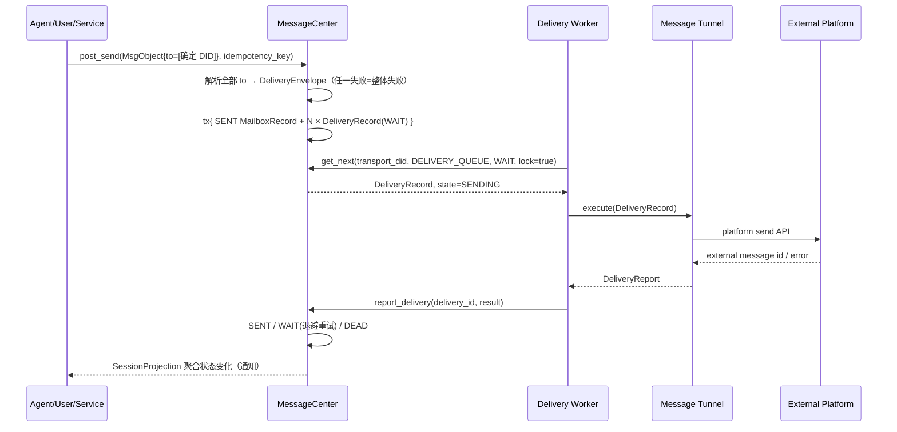

# Message Tunnel Design

> **MessageCenter is not an IM server. It is a DID-native, store-and-forward personal messaging system—email upgraded for Personal Servers and Agents.**

本文档与 [Message Center.md](<./Message Center.md>) 共同构成消息域的两份主设计文档，共享同一定位、同一五层模型（`MsgObject / DeliveryEnvelope / MailboxRecord / DeliveryRecord / SessionProjection`）和同一术语表。MessageCenter 文档定义消息域内核；本文定义 transport 层——消息如何离开和进入 Personal Server。配套裁剪版见 [Message Tunnel Minimal Spec.md](<./Message Tunnel Minimal Spec.md>)。

## 1. 定位

MessageCenter 运行在 Personal Server 上，服务一个用户、其设备和 Agent；设计优先级是可靠性、可恢复性、可审计性和语义清晰，不是中心化 IM 的极限吞吐。transport 层继承同样的取舍：**像 MTA/邮件网关那样工作，而不是像 IM 长连接那样工作**。

### 1.1 MessageTunnel 是 external transport adapter

```text
MessageTunnel = ingress producer + delivery executor
```

- **ingress producer**：把外部平台（Telegram、Email、Lark…）的事件转换为 `MsgObject + 入站元数据 + 幂等键`，调用 `MessageCenter.dispatch()`。
- **delivery executor**：从自己的 `DELIVERY_QUEUE`（owner = 本 tunnel 的 `transport_did`）消费 `DeliveryRecord`，调用平台 API 投递，回报 `report_delivery()`。

Tunnel 只触碰五层模型中的两处：生产 `MsgObject`（入站）、消费 `DeliveryRecord`（出站）。**MailboxRecord 和 SessionProjection 对 tunnel 不可见。**

### 1.2 Tunnel 不负责的事

- **Contact 选择**：tunnel 不查询、不关心"该用哪个联系人/绑定发"。
- **Agent Session 管理**：tunnel 不知道 Agent 会话的存在。
- **自动选择收件信道**：不存在"用户最近在 Telegram 活跃所以走 Telegram"。
- **身份合并**：endpoint 与正式联系人的关联属于 ContactMgr 展示层，与收发无关。
- **UI 会话历史**：UI 只消费 Session API，永不读 tunnel 的队列。
- **根据缺失字段猜测 chat/address**：`DeliveryRecord` 信息不完整就是失败（§5.2）。

### 1.3 非目标（与 MessageCenter 文档一致）

- 不把在线连接作为消息系统中心（webhook/polling/stream 只是加速信号）。
- 不把 Session 作为消息真相源。
- 不根据 ContactMgr、在线状态或最近活跃信道自动选路。
- 不要求 UI 理解 Inbox、Delivery Queue 等内部实现。
- 不把 typing、presence、streaming 状态混入可靠消息投递。

### 1.4 Email → BuckyOS 概念映射（transport 视角）

| Email 世界 | BuckyOS transport 层 |
|---|---|
| SMTP（原生协议，端到端） | MessageHub：Zone ↔ Zone 原生投递 |
| 邮件网关（email ↔ 传真/短信网关） | MessageTunnel：BuckyOS ↔ 外部平台适配器 |
| MTA 发送队列 | `DELIVERY_QUEUE` + `DeliveryRecord` |
| `RCPT TO` 信封地址 | `DeliveryEnvelope.target_did` |
| MX 查询 | shareable DID → Zone 解析 |
| DSN / bounce | `report_delivery()` → 更新 `DeliveryRecord` |
| 收发别名（alice+tg@…） | `did:bns:telegram.alice`（owner Zone 内展开） |
| 网关侧的外部地址 | local shadow endpoint DID（`did:msgtunnel:*`） |

## 2. MessageHub 与 MessageTunnel

历史文档把 MessageHub 描述成"一种典型 MessageTunnel"。冻结设计把二者**分离**：

| | MessageHub | MessageTunnel |
|---|---|---|
| 性质 | **原生、跨 Zone transport** | 外部网络适配器（Telegram/Email/Lark…） |
| 目标 DID | shareable DID（`did:bns:*` 等） | local shadow endpoint DID（`did:msgtunnel:*`） |
| 传输语义 | `MsgObject` 无损传递、签名可验证 | 平台能力内的降级映射 |
| 地址解析 | DID → Zone（确定性解析协议） | DID 内嵌 account + tunnel 实例配置 |
| 身份 | 双方都是真实 DID | 远端是平台账号，本地以 shadow DID 表示 |

二者复用同一个 **`DeliveryExecutor` 接口**（消费 `DeliveryRecord`、回报结果、同一状态机、同一幂等键），但语义不同：MessageHub 是"我们的 SMTP"，MessageTunnel 是"接别人网络的网关"。`post_send` 的两条确定投递分支与此一一对应：

```text
shareable DID            → MessageHub / native delivery
local shadow endpoint DID → MessageTunnel delivery
其它 / 解析失败           → 错误（无 default tunnel、无 fallback）
```

## 3. DID 分类（固定）

本章替代旧文档的"Message Tunnel 二级 DID"，该术语废弃，统一改为 **local shadow endpoint DID**（简称 shadow DID）。

### 3.1 两类 DID

```text
Shareable DID（可公开分享、可跨 Zone 解析）
  - did:bns:alice                 Alice 的主 DID
  - did:bns:telegram.alice        Alice 公开的"telegram 收件别名"——仍是 Alice Zone 的 DID

Local shadow endpoint DID（只在本 MessageCenter/Zone 内有意义）
  - did:msgtunnel:12345.user.tg-main-tunnel
    <encoded_account_id>.<account_type>.<tunnel_instance_id>
```

`did:bns:telegram.alice` 的语义是"请把消息投给 Alice，Alice 声明她会从 telegram 信道处理"。**它到实际信道的映射发生在 Alice 自己的 Zone 里**（Alice Zone 收到后按本地配置转投她的 telegram tunnel）；它不能公开指向一个远端无法解析的 shadow DID——对外部世界它就是一个普通 shareable DID，走 MessageHub 原生投递。

### 3.2 shadow DID 的约束

shadow DID 表达"本 Zone 某个 tunnel 实例视角下的外部 endpoint"：

- **只在当前 MessageCenter/Zone 范围解析**；离开本 Zone 无意义。
- **可以作为消息的 `from`/`to`**：入站消息 `from` 是它，回复时 `to` 写它。
- **可以直接回复**：`post_send(to=[shadow_did])` 确定性地经原 tunnel 实例投回原平台账号。
- **不能发布到 Profile / DID Document**：对外分享的只能是 shareable DID。
- **不能作为远端 Contact 或 MessageHub 目标**：不得把 shadow DID 发给别的 Zone 当地址用；MessageHub 收到 `did:msgtunnel:*` 目标必须拒绝。

同一个外部账号经不同 tunnel 实例进入会得到不同 shadow DID，这是设计行为；ContactMgr 可以把它们关联到同一个联系人用于**展示**，但不改写任何消息（见 §4）。

字段规则：

- `encoded_account_id`：平台账号/群/频道/地址的稳定 id，可逆编码（`.`、`:`、`/` 等字符不得破坏 DID 解析）。
- `account_type`：稳定枚举 `user / group / channel / addr`。
- `tunnel_instance_id`：见下。

### 3.3 tunnel_instance_id

每个 tunnel **实例**（不是实现类）拥有一个 `tunnel_instance_id`：

- **本地唯一**：一个 Zone 内不允许两个实例同 id。
- **稳定**：写进配置，跨重启、跨版本不变；shadow DID 的持久性依赖它。
- **不可复用**：实例删除后其 id 永久退役，防止旧 shadow DID 被解析到新账号。
- **推荐以 `-tunnel` 结尾**：如 `tg-main-tunnel`、`email-work-tunnel`，一眼可辨。
- **重复注册必须失败**：MessageCenter 启动装配 tunnel registry 时发现重复 id 直接启动失败，**不能静默覆盖**。

`tunnel_instance_id` 与 `transport_did` 是两个概念，不得混用（历史代码存在混用 bug，见 P3 迁移项）：

```text
tunnel_instance_id   短逻辑 id，嵌在 shadow DID 尾段，registry 的 key       例: tg-main-tunnel
transport_did        tunnel 实例的 DID，DELIVERY_QUEUE owner / DeliveryRecord executor
registry             tunnel_instance_id → (transport_did, platform, capability)
```

## 4. ContactMgr 边界：没有自动路由

### 4.1 废弃的发送模型

以下描述从设计中**删除**，任何文档/代码不得再出现：

```text
contact DID + selector 发送模型
resolve_target(contact, "telegram")     # 发送路径上的联系人→信道解析
get_preferred_binding()                 # "首选绑定"参与投递
last_active_at 选路                     # 按最近活跃挑信道
preferred_tunnel / default tunnel       # 默认通道 fallback
```

它们共同的问题：把"发给谁"变成一个查询时才能回答、且答案随时间漂移的问题，摧毁了投递的确定性、可审计性和可重放性。

### 4.2 ContactMgr 只负责

- **关联**：shadow endpoint ↔ 正式联系人的 binding 登记与维护。
- **展示**：给 UI 提供联系人名片、头像、endpoint 列表。
- **ACL**：入站准入（Friend/Stranger/Block/Temporary）。
- **merge**：联系人合并与 alias 解析。
- **reverse lookup**：由 endpoint DID 反查归属联系人（展示/审计用）。

**ContactMgr 的关联结果不得自动成为发送目的地。** UI 可以基于联系人的 endpoint 列表让用户**点选**一个作为 `msg.to`（这是构造 `MsgObject` 之前的显式选择）；`resolve_target` 一类接口降级为 UI/联系人查看辅助，从核心发送 API 中移除。

## 5. Ingress / Egress contract

### 5.1 入站契约

Tunnel 入站转换**必须**产生以下五件事，缺一不可：

```text
MsgObject                     标准化消息（不可变，含 content/thread/proof）
exact source shadow DID       msg.from = did:msgtunnel:<sender>.<type>.<instance>，不做联系人替换
exact recipient/group DID     msg.to = 确定的本地收件方（owner user/agent DID 或 group DID）
ingress delivery metadata     平台/chat/外部 message id 等投递事实（入 dispatch 元数据，供审计与回复）
external idempotency key      稳定幂等键（见 §6.2）
```

**入站消息的 `from` 保持 shadow endpoint DID**；ContactMgr 的关联只影响展示，不改写消息来源。

群消息固定为：

```text
from = actor shadow DID           （群里发言的那个成员）
to   = group shadow/real DID      （群实体）
```

回复群聊写 group `to`；回复 actor `from` 是"绕开群私聊成员"，必须是显式用户动作，不是回复默认值。

各会话形态的 endpoint 生成与回复规则：

| 形态 | 入站 `from` | 入站 `to` | 回复目标 |
|---|---|---|---|
| DM（私聊） | `did:msgtunnel:<user>.user.<inst>` | 本地 owner/agent DID | 原 `from`（同 shadow DID 原路返回） |
| Group | `did:msgtunnel:<sender>.user.<inst>` | `did:msgtunnel:<group>.group.<inst>` 或 group real DID | group `to` |
| Channel | `did:msgtunnel:<channel>.channel.<inst>` | 本地 owner DID | 平台能力决定；不可回复则投递失败（明确报错） |
| Email | `did:msgtunnel:<addr>.addr.<inst>` | 收件别名解出的本地 DID | 原 `from`；thread 语义放 `thread.reply_to`/`ext_ids` |

### 5.2 出站契约

**出站 tunnel 只能消费完整的 `DeliveryRecord`。** `DeliveryEnvelope` 在 `post_send` 时已确定性解析完毕，tunnel 拿到的是投递指令，不是路由问题：

- `envelope.transport_did` 必须等于本实例，否则拒绝执行（防错队列消费）。
- `envelope.target_did` 解出的平台 `account/chat/address` 就是投递地址。
- **缺少目标 address/chat 时必须失败**（不可重试 → `DEAD`，错误信息说明缺什么）。**禁止逐级猜测**：

```text
禁止: chat_id → extra → account_id → default_chat_id 逐级回退
```

- `extra` / `meta` 只能保存平台扩展信息（诊断、展示、平台私有 id），**不能成为核心路由依据**——投递地址只能来自 envelope 的一级字段。
- 平台 API 结果如实回报 `report_delivery()`，由 MessageCenter 驱动状态机；tunnel 自己不改 record 状态。

`supports_egress() == false` 的 tunnel 实例不注册为 delivery executor；`post_send` 解析到这样的实例直接失败（不会创建永远无人消费的 `DeliveryRecord`）。

### 5.3 出站流程



## 6. 可靠性

### 6.1 投递状态机（Email 风格）

```text
WAIT → SENDING → SENT
             ↘ FAILED → WAIT      可重试：退避后回队列
                      ↘ DEAD      不可重试/超次数：可诊断、可人工重投
```

- 状态属于 `DeliveryRecord`。**Delivery failure 只更新 `DeliveryRecord`，不修改 `MsgObject`**，也不回写 `SENT` mailbox 记录。
- `SENDING` 有租约：executor 崩溃后由定时 sweep 收回到 `WAIT` 并记录 duplicate risk。实时通知只是加速信号，定时 sweep 是兜底真相。
- `DEAD` 不是删除：保留完整错误链，支持诊断与显式重投（重投 = 人工把状态置回 `WAIT`）。

### 6.2 幂等

**出站幂等键（固定）**：

```text
delivery_id = hash(msg_id + target_did + executor_did)      # executor_did 即 transport_did
```

重复 `post_send`、崩溃重放、重复扫描都收敛到同一条 `DeliveryRecord`（数据库唯一约束兜底）。

**入站幂等键**：

```text
{platform}:{tunnel_account_id}:{chat_id}:{external_message_id}
无稳定 message id 时: {platform}:{tunnel_account_id}:{chat_id}:{event_timestamp}:{payload_hash}
```

要求：同一平台事件重复上报得到同一 key；key 不含重试次数/批次/本地时间；持久化存储（带 TTL/容量控制），不能只放内存。

`MessageCenter` 以 `msg_idempotency(scope, owner_scope, idempotency_key)` 保存入站和
`post_send` 幂等结果。记录先在事务内占用为 `pending`，全部 mailbox /
delivery 副作用写入成功后再更新为 `completed` 和结果 JSON。TTL 只作为物理
清理候选依据，不作为命中依据；只要 DB 记录仍在，就必须命中。清理先按
`retention_key` 分桶控制热点：外部会话必须使用稳定的 platform + tunnel/bot
account + chat/topic 标识，不能按消息发送者拆桶；本地出站按发送者和 topic
分桶。同一个外部会话或本地发送者 bucket 超过 3,000
行后，只删除该 bucket 内已过期记录并尽量降到 2,000 行。另有全表
100,000 → 80,000 的容量水位，用于清理大量低基数 bucket 中的过期记录；全局
清理单批最多删除 10,000 行。启动时及每小时运行的后台任务继续执行批次，
清理不进入消息请求路径。两层清理都不得删除 30 天内的记录。

**平台层幂等**：平台支持 client message id 时带上 `delivery_id`；发送超时后状态未知时，回报 retryable failure 并标记 duplicate risk，重试前尽量用外部 id 查询确认。

### 6.3 四级投递语义

严格区分，禁止混用：

```text
submission accepted   post_send 成功返回（进入 DELIVERY_QUEUE）        ≈ SMTP 250 (queued)
transport accepted    平台 API 接受（DeliveryState=SENT，有 external_msg_id） ≈ 网关 accepted
remote delivered      远端确认送达（平台回执，若有）                    ≈ DSN delivered
remote read           远端已读（平台 read receipt，若有）               ≈ MDN
```

`DeliveryState::SENT` 只承诺 **transport accepted**。remote delivered/read 由平台回执异步补充到 `DeliveryRecord`（或 per-reader receipt），可能永远不来（如 Email）。

### 6.4 UI 与状态的关系

**UI 通过 SessionProjection 得到聚合投递状态，不直接读取 Delivery Queue。** 聚合规则见 MessageCenter 文档 §5.3。tunnel 与 UI 之间没有任何直接接口。

### 6.5 顺序与漏消息恢复

- 顺序：只承诺同一外部会话内尽量按平台顺序提交；严格因果用 `thread.reply_to` / `correlation_id` / `ext_ids`。
- 入站恢复：平台 offset/cursor 存入 msg-center 专用的 durable tunnel cursor 表，不能复用对外可写的 UI SessionState；处理成功后推进，重启后按 cursor/时间窗补拉。offset/cursor 读取失败或数据非法时必须暂停 polling 并重试，不能退回 0 开始拉取。
- 出站恢复：`DELIVERY_QUEUE` 扫描（`WAIT` 到期 + `SENDING` 租约超时）。
- webhook/stream/kevent 只能作为加速信号，不能作为唯一真相。

## 7. 消息能力集

Tunnel 需要接收和发送的消息/事件类型及其标准表达：

| 类型 | 推荐 MsgObject 表达 | 说明 |
|---|---|---|
| 普通文本、表情 | `kind=Chat` 或 `GroupMsg`，`content.format=text/plain` | 表情保持 Unicode 或平台 token |
| 富文本、Markdown、HTML | `content.format=text/markdown` 或 `text/html` | 平台不支持时降级为纯文本 |
| 引用/回复 | `thread.reply_to` 或 `meta.platform_reply_to` | 能解析为 `ObjId` 时用 `reply_to` |
| 附件、图片、音视频、文件 | `content.refs` 指向 `DataObj` | 大对象不塞 `content.content` |
| @、mention | `content.content` 保留原文，结构化列表放 `machine.data.mentions` | |
| 成员加入/退出、会话创建/关闭 | `kind=Event`，`machine.intent=session.member_changed` 等 | 变更前后状态放 `machine.data` |
| 上线/下线、禁言、屏蔽、授权 | `kind=Event` 或 `Notify` | 影响 ACL 的事件由可信组件处理 |
| 已读、typing | SessionState / per-reader receipt | **不进入可靠消息投递**，不产生 MailboxRecord |
| 红包、投票、小程序、审批卡片 | `kind=Operation` | 平台 payload 放 `machine.data.raw` 或 `meta` |
| 第三方应用消息 | `kind=Operation` 或 `Event` | 保留原始 app id 和 action |
| AI 流式消息 | 中间态走 SessionState/`Notify`，最终 `Chat/GroupMsg` | 见 §8 |
| 未知平台消息 | `kind=Event` 或 `Operation` + raw payload | 必须可保留、可忽略、不可 panic |

## 8. 流式 AI 消息与易失状态

流式输出与可靠投递的边界：

- `MsgObject` 不可变，不能把一个对象改写成流式 token。
- typing / partial / status_line 属于 **SessionState**（易失通道）；平台支持编辑的，tunnel 可把中间态渲染为消息编辑；不支持的降级为 typing 指示或只发最终消息。
- 中间态必须带同一 `thread.topic` 或 session 关联键，带 `turn_nonce`/`correlation_id`。
- **只有最终回复**是 `kind=Chat/GroupMsg` 的 `MsgObject`，进入正常 `post_send` 流水。
- 中间态**永不产生** `MailboxRecord` 或 `DeliveryRecord`。

## 9. 可操作与第三方应用消息

红包、投票、审批卡片等不能当纯文本：

- `kind=Operation`；`content.content` 放人类可读摘要。
- `machine.intent` 放稳定操作名（如 `lark.approval_card`、`poll.vote`）；`machine.data` 放结构化字段。
- 原始平台 payload 放 `meta.platform_raw` 或 `machine.data.raw`；过大时对象化后用 `refs` 引用。
- 用户/Agent 执行动作必须经授权检查；tunnel 不代替 Agent 执行高权限操作。
- 当前无法理解的操作消息保留摘要 + raw payload，支持未来重放。

## 10. 可观察性

全链路必须可追踪：

```text
外部事件: external_event_id → idempotency_key → msg_id → MailboxRecord.record_id
出站投递: msg_id → delivery_id → attempts/errors → external_msg_id
Agent 链路: 触发消息 → Agent session/worklog → post_send msg_id
```

推荐落点：

- `DeliveryRecord`：投递尝试、错误码、external id、duplicate risk 标记。
- ingress 元数据 / `ext_ids`：平台原始 id（message id、thread id、reply id、media group id）。
- 服务日志：运行诊断；解析失败进 dead-letter/REQUEST_BOX，不能只 warn 后丢弃。
- Agent worklog/task log：推理、工具调用与授权链路。

## 11. 典型 Transport

### 11.1 MessageHub（原生，单列——它不是 tunnel）

- 承载 shareable DID 投递：DID → Zone 解析 → POST `MsgObject`。
- `MsgObject` 无损传递，签名可验证；无平台降级。
- 权限由 DID、ContactMgr ACL、GroupMgr、RBAC 处理。
- 同样实现 `DeliveryExecutor` 接口、同一状态机与幂等键。

### 11.2 Telegram（参考基线）

- Bot/User 账号由 tunnel 实例配置表达；`tunnel_instance_id` 如 `tg-main-tunnel`。
- 入站：update 去重 → 标准化 → `dispatch`；`tg_message_id/chat_type` 等入 ingress 元数据与 `ext_ids`；附件对象化后 `refs` 引用。
- 出站：消费 `DeliveryRecord`；地址完全来自 envelope；**没有 `default_chat_id` fallback**。
- 平台裁剪：Bot 主动私聊受限、群/频道能力不同、部分消息只能保留 raw payload。
- 错误分类：429 → retryable（带 retry_after）；400/403 → `DEAD`；超时 → retryable + duplicate risk。

### 11.3 Lark

- 同 Telegram 模式；保留企业租户语义（`tenant_key/open_id/user_id/chat_id/message_id` 入 `ext_ids`）。
- 卡片/审批/投票优先 `kind=Operation`。
- Bot/User 能力差异在 capability 声明中表达。

### 11.4 Email

- `account_type=addr`；`chat` 概念映射为 thread（`Message-ID`/`In-Reply-To`/`References` 入 `thread`/`ext_ids`）。
- 无 typing；read receipt 不可靠——投递语义止于 transport accepted。
- 出站 MIME 构造由 Email tunnel 负责；附件按对象引用。

## 12. 平台能力声明

```rust
#[derive(Debug, Clone, Serialize, Deserialize, Default)]
pub struct MessageTunnelCapability {
    pub ingress: bool,
    pub egress: bool,
    pub edit_message: bool,
    pub delete_message: bool,
    pub typing: bool,               // SessionState 通道能力，与可靠投递无关
    pub read_receipt: bool,
    pub proactive_direct_message: bool,
    pub attachment_upload: bool,
    pub operation_message: bool,
    pub extra: serde_json::Value,
}
```

capability 挂在 tunnel registry 条目上，供管理界面与平台裁剪使用；**不参与投递决策**（决策已在 `post_send` 前由用户/Agent 显式完成）。

账号类型（Bot/User/System）同样是实例配置与能力声明的一部分，影响平台行为边界，不影响协议。

## 13. 兼容性与升级

### 13.1 平台升级

- 未知消息类型不得 panic 或退出主循环：能转文本就 `Chat/GroupMsg`，有操作语义用 `Operation`，纯状态用 `Event/Notify`，raw payload 限制大小、过大对象化。

### 13.2 BuckyOS 新旧版本互通

- 新字段必须 optional 或有 default；`meta/extra/ext_ids` 只能追加，旧实现忽略未知 key。
- 不改变 `MsgObject` 已有字段语义（否则改变 `ObjId` 与历史对象校验）。
- record 层允许 additive schema 升级；三个状态机的语义必须保持兼容。
- beta2.2 是 breaking change 版本：§15 的命名迁移一次性完成，不做旧名兼容层。

### 13.3 降级策略

- 消息编辑 → 新消息或状态消息；typing → 无操作；read receipt → 本地状态。
- operation → 文本摘要 + raw payload。
- 附件上传失败 → retryable failure，不静默丢弃。

## 14. 验收标准

- 文档与实现中不再出现"MessageCenter 根据联系人绑定自动选择 Tunnel"。
- 所有发送示例的 `to` DID 都能唯一确定投递类型（shareable → MessageHub；shadow → 指定 tunnel 实例）。
- `did:bns:bob` 永远不会自动生成 Telegram `DeliveryRecord`；`did:bns:telegram.bob` 只由 Bob 的 Zone 展开。
- shadow DID 不能跨 Zone 作为目标使用。
- 出站缺 address/chat 立即失败，不存在 `default_chat_id` 类猜测。
- 重复入站、重复出站、服务重启不产生不可控重复投递（幂等键 `msg_id + target_did + executor_did`）。
- Agent 在不知道平台细节的情况下消费与回复消息。
- UI 不读取 Delivery Queue；投递进度全部来自 SessionProjection 聚合。
- 平台升级或新旧版本互通不因未知字段宕机或损坏数据。

## 15. 现状对照与迁移（P3，已完成）

P3 迁移已于 2026-07-14 全部落地（明细见 `notepads/msg-center-design-freeze-todo.md`），
代码与冻结设计一致，无旧名兼容层：

| 冻结设计 | 落地状态 |
|---|---|
| `DELIVERY_QUEUE` / `DeliveryRecord` | ✅ 独立 `delivery_records` 表 + `DeliveryRecord` 结构，owner = `transport_did` |
| `DeliveryEnvelope` / `DeliverySnapshot` | ✅ `post_send` 解析结果快照；`RouteInfo` 已删除 |
| `transport_did` 与 `tunnel_instance_id` 分离 | ✅ 全量重命名；scheduler binding 写 `tunnel_instance_id`（短 id），不再写 DID |
| shadow DID `…<tunnel_instance_id>` 尾段 | ✅ 默认实例 id `tg-main-tunnel` |
| registry 重复 id 启动失败 | ✅ `register_tunnel` fail-fast，启动装配失败即退出 |
| 无隐式 `resolve_target` | ✅ Workflow 发送路径只收确定 DID；`resolve_target` 仅存于 UI/联系人查看辅助 |
| 无 `default_chat_id` fallback | ✅ 地址只来自 envelope 快照；缺 chat → 不可重试失败（DEAD） |
| `thread.tunnel_id` 不存在 | ✅ 已从 `ndn_lib::TopicThread` 删除（cyfs-ndn beta2.2） |
| 群消息 `to`=group，无兼容回退 | ✅ 空 `to` 的群消息直接报错 |
| `list_session/list_sessions` | ✅ 新 RPC + Session/Delivery 索引；Desktop MessageHub 走 Session API |
| MessageHub 原生投递 | ✅ `DeliveryExecutor` 落地（本 Zone 本地 dispatch）；跨 Zone HTTP hop 为已知后续项，未实现时明确失败 |
