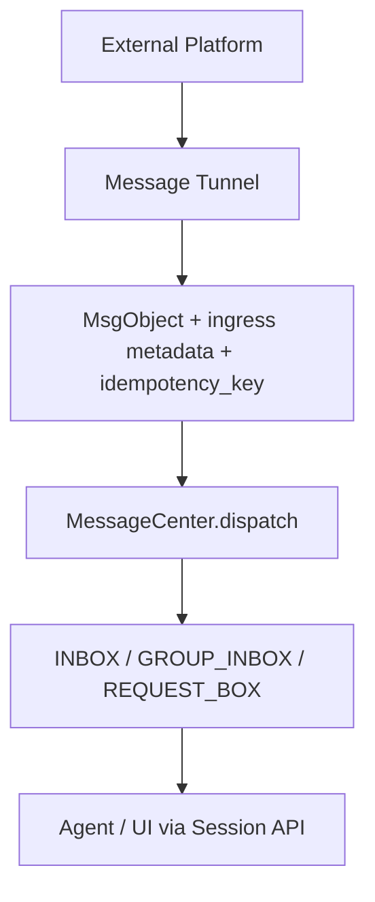
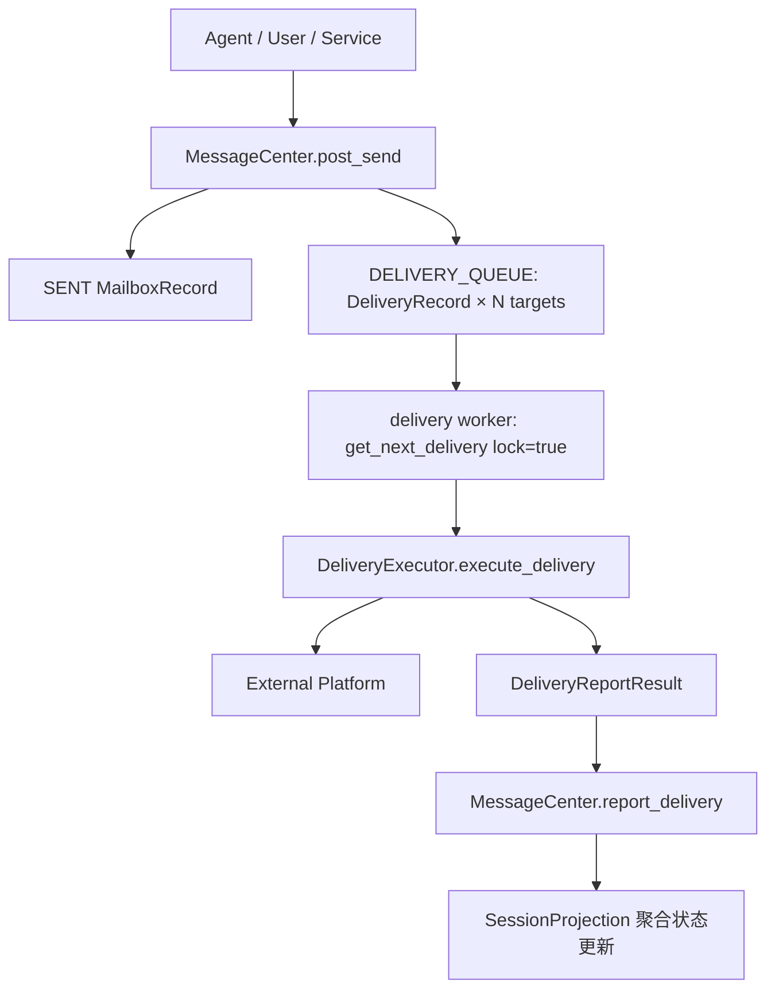

# Message Tunnel Minimal Spec

本文档给代码生成 Agent 使用，是两份主设计文档的**裁剪版**，不独立定义任何术语；术语与主文档冲突时以主文档为准：

- [Message Center.md](<./Message Center.md>)：消息域内核（五层模型、mailbox、delivery、session）。
- [Message Tunnel Design.md](<./Message Tunnel Design.md>)：transport 层完整设计与边界。

> MessageCenter is not an IM server. It is a DID-native, store-and-forward personal messaging system—email upgraded for Personal Servers and Agents.

## 1. 定义

Message Tunnel 是外部平台与 MessageCenter 之间的 **external transport adapter**：

```text
MessageTunnel = ingress producer + delivery executor
```

1. 入站：把外部平台事件转换为 `MsgObject`，携带入站元数据与幂等键调用 `MessageCenter.dispatch()`。
2. 出站：从自己的 `DELIVERY_QUEUE`（owner = 本实例 `transport_did`）消费 `DeliveryRecord`，调用平台 API，结果回报 `report_delivery()`。
3. Tunnel 不做：Contact 选择、Agent session 管理、自动选信道、身份合并、UI 会话历史、根据缺失字段猜 chat/address。

MessageHub 不是 tunnel：它是原生跨 Zone transport，承载 shareable DID 投递；tunnel 承载 shadow DID 投递。二者复用 `DeliveryExecutor` 接口。

## 2. DID 规则（必须遵守）

```text
Shareable DID                did:bns:alice / did:bns:telegram.alice → MessageHub 投递
Local shadow endpoint DID    did:msgtunnel:<encoded_account_id>.<account_type>.<tunnel_instance_id>
                             → 对应 tunnel 实例投递
其它 / 解析失败               → post_send 直接报错；无 default tunnel、无 fallback
```

- `account_type` ∈ `user / group / channel / addr`；`encoded_account_id` 可逆编码。
- `tunnel_instance_id`：本地唯一、稳定、不可复用、推荐 `-tunnel` 结尾（如 `tg-main-tunnel`）；registry 重复注册必须启动失败。
- shadow DID 只在本 Zone 解析；可作 `from/to`、可直接回复；不得发布到 Profile/DID Document，不得作为跨 Zone 目标。
- 入站 `from` 保持 shadow endpoint DID，ContactMgr 关联不改写消息来源。
- 群消息：`from = actor shadow DID`，`to = group DID`；回复群写 `to`，不回 `from`。

## 3. 复用现有类型

不要重新定义以下基础类型（P3 迁移已完成，代码与冻结名一致）：

- `ndn_lib::MsgObject` / `MsgContent` / `MsgObjKind`：不可变消息本体。
- `buckyos_api::MailboxRecord`：owner 的本地消息引用（`MailboxKind`：`INBOX / SENT / GROUP_INBOX / REQUEST_BOX`）。
- `buckyos_api::DeliveryRecord` / `DeliveryEnvelope` / `DeliverySnapshot`：DELIVERY_QUEUE 条目与解析结果快照。
- `buckyos_api::RecipientState` 与 `DeliveryState`：两个独立状态机。
- `buckyos_api::IngressContext`：入站元数据。
- `buckyos_api::DeliveryReportResult`：投递结果回报。

通用 delivery executor trait（`frame/msg_center/src/msg_tunnel.rs`；MessageHub 与各 tunnel 共同实现）：

```rust
#[async_trait]
pub trait DeliveryExecutor: Send + Sync {
    /// 本实例 transport DID：DELIVERY_QUEUE owner / DeliveryRecord executor。
    fn transport_did(&self) -> DID;
    /// 人类可读名称（日志/配置/管理界面）。
    fn name(&self) -> &str;
    /// 平台标识："telegram" / "lark" / "email" / "messagehub" / ...
    fn platform(&self) -> &str;
    /// 能力声明。supports_egress()=false 的实例不注册为 delivery executor。
    fn supports_ingress(&self) -> bool { true }
    fn supports_egress(&self) -> bool { true }
    /// 启动/停止外部连接、轮询、webhook 或 stream。
    async fn start(&self) -> AnyResult<()>;
    async fn stop(&self) -> AnyResult<()>;
    /// 执行一条投递任务，返回平台投递结果。
    async fn execute_delivery(
        &self,
        record: DeliveryRecordWithObject,
    ) -> AnyResult<DeliveryReportResult>;
}
```

## 4. 入站规则

入站转换必须产生五件事：

```text
MsgObject + exact source shadow DID (from) + exact recipient/group DID (to)
+ ingress delivery metadata + external idempotency key
```

映射要求：

- 1v1：`kind=Chat`，`from = sender shadow DID`，`to = [本地 owner/agent DID]`。
- 群聊：`kind=GroupMsg`，`from = actor shadow DID`，`to = [group DID]`。
- 会话状态、成员变更：`kind=Event`/`Notify`，结构化部分放 `content.machine`。
- typing/已读：SessionState 通道或 receipt，**不产生 MailboxRecord**。
- 可操作消息（红包/投票/卡片）：`kind=Operation`，`machine.intent` 表达操作类型，raw payload 放 `meta`/`machine.data.raw`。
- 附件：大对象写对象存储后用 `content.refs` 引用。
- 平台原始 id：放 ingress 元数据 / `ext_ids` / `meta`，不污染 `from/to`。
- 解析失败的消息进 dead-letter/`REQUEST_BOX`，不得 panic、不得静默丢弃、单条失败不退出主循环。



## 5. 出站规则

出站只消费**完整的** `DeliveryRecord`；envelope 在 `post_send` 时已解析完毕：

- `envelope.transport_did` 必须等于本实例，否则拒绝执行。
- 投递地址只来自 envelope 一级字段；**缺少目标 address/chat 时必须失败**（不可重试）。
- 禁止猜测链：`chat_id → extra → account_id → default_chat_id`。
- `extra/meta` 只保存平台扩展信息，不能成为路由依据。
- 成功：`DeliveryReportResult { ok: true, external_msg_id, delivered_at_ms }`。
- 可重试失败：`ok=false, retryable=true, retry_after_ms`（如 429）。
- 不可重试失败：`ok=false, retryable=false, error_code/error_message`（如 400/403）。
- 发送超时状态未知：按 retryable 回报并标注 duplicate risk。
- Tunnel 不直接改 record 状态，统一走 `report_delivery()`。



## 6. 状态机、幂等、恢复

投递状态机（属 `DeliveryRecord`，不碰 `MsgObject`）：

```text
WAIT → SENDING → SENT
             ↘ FAILED → WAIT（退避重试）
                      ↘ DEAD（可诊断、可人工重投）
```

- 出站幂等键：`msg_id + target_did + executor_did`；重复提交/重放收敛到同一 `DeliveryRecord`。
- 入站幂等键：`{platform}:{tunnel_account_id}:{chat_id}:{external_message_id}`；无稳定 id 时用 `{event_timestamp}:{payload_hash}` 组合；必须持久化（带 TTL），不能只放内存。
- 持久幂等记录使用 `pending` / `completed` 状态；业务副作用和 completed 结果必须在同一个本地 RDB 事务内提交。TTL 只作为物理清理候选依据，不作为命中依据。清理采用两层容量水位：单个 `retention_key` bucket 超过 3,000 行后删除该 bucket 的过期记录并尽量降到 2,000 行；全表超过 100,000 行后分批删除所有 bucket 的过期记录并逐轮降到 80,000 行，单批最多删除 10,000 行，删满后由后续消息写入继续触发。30 天内的记录不得删除。
- 投递语义四级：submission accepted → transport accepted（`SENT`）→ remote delivered → remote read；`SENT` 只承诺 transport accepted。
- 恢复：入站靠平台 offset/cursor 持久化补拉；offset/cursor 读取失败或数据非法时暂停 polling 并重试，不能退回 0；出站靠 `DELIVERY_QUEUE` 扫描（`WAIT` 到期 + `SENDING` 租约超时 sweep）；webhook/stream/kevent 只是加速信号。
- 顺序：同一外部会话内尽量按平台顺序提交；严格因果用 `thread.reply_to`/`correlation_id`/`ext_ids`。

## 7. 流式 AI 消息

- 中间态（typing/partial/status）走 SessionState 易失通道，带 `turn_nonce`/`correlation_id`；不产生 `MailboxRecord`/`DeliveryRecord`。
- 最终回复才是 `kind=Chat/GroupMsg` 的 `MsgObject`，走正常 `post_send`。
- 支持编辑的平台可把中间态渲染为消息编辑；不支持的降级为 typing 或只发最终消息。

## 8. 典型裁剪

- Telegram：参考基线；429 retryable、400/403 dead；无 `default_chat_id` fallback；附件对象化。
- Lark：企业租户语义入 `ext_ids`；卡片类 `kind=Operation`。
- Email：`account_type=addr`；thread 语义入 `thread`/`ext_ids`；无 typing、回执不可靠。
- MessageHub：不是 tunnel（原生 transport），无损传递 `MsgObject`。

## 9. 兼容性规则

- 未知 `MsgObjKind`/`format`/`intent`/`meta` key：保留或忽略，不 panic。
- 未知外部消息类型：降级为 `Event`/`Operation` + raw payload。
- `meta/extra/ext_ids` 只追加；不改变 `MsgObject` 已有字段语义。
- 单条消息解析失败不得导致 tunnel 主循环退出。
