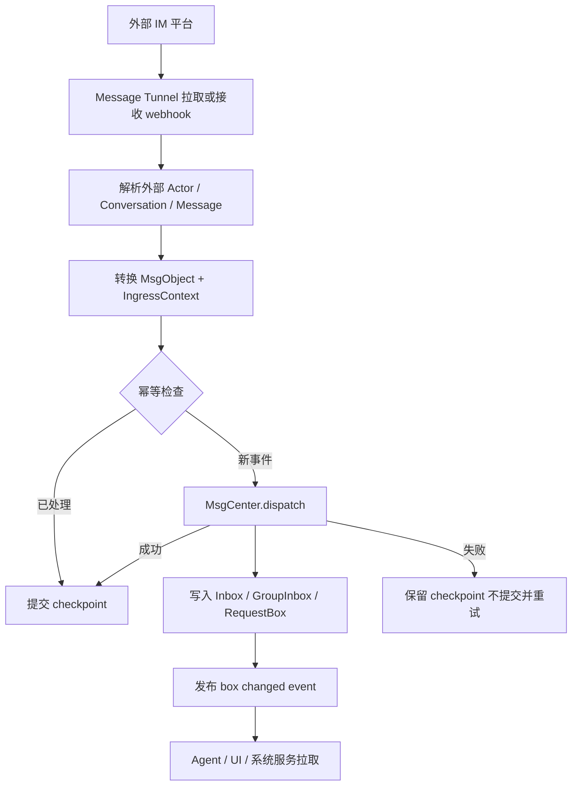
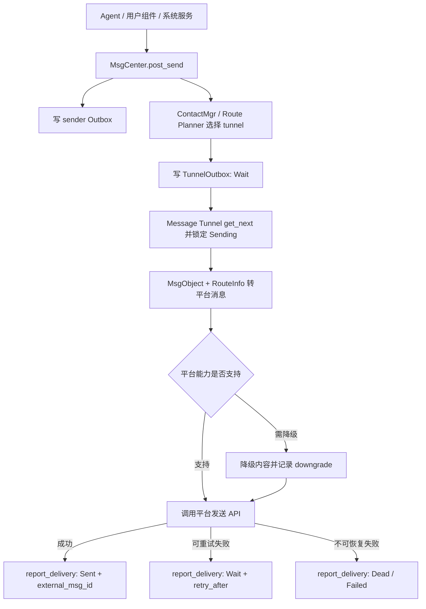
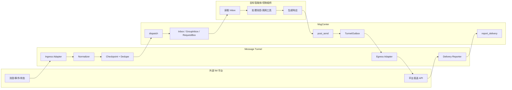

# Message Tunnel 理论模型

## 1. 定义

`Message Tunnel` 是 BuckyOS 与外部 IM 系统之间的消息通道适配层。它代表某个 IM 平台上的一个可收发身份，例如 Telegram Bot、Telegram 用户账号、Lark Bot、Email 邮箱账号，或 BuckyOS 内部的 MessageHub 账号。它负责从外部 IM 会话读取消息和会话事件，转换为 BuckyOS 可处理的标准消息后投递给 `MsgCenter`；也负责从 `MsgCenter` 读取待投递的响应消息，并按外部 IM 的规则投递回来源会话或指定会话。

`Message Tunnel` 不负责 Agent 如何理解消息、如何生成回复、如何调用工具，也不负责响应消息的业务生成。Agent 或其他目标智能体处理完成后，应通过 `MsgCenter` 写入响应消息。`Message Tunnel` 只负责 IM 边界上的输入、输出、映射、投递、去重、顺序、故障恢复和平台能力裁剪。

从 IM 系统视角看，`Message Tunnel` 是一个特定用户或机器人账号的消息收发通道。按账号形态通常分为：

- `BotMsgTunnel`：机器人账号通道。平台通常限制较多，例如只能接收被提及的群消息、不能主动加好友、不能读取历史消息。
- `UserMsgTunnel`：自然人账号通道。平台通常能力更完整，但安全和授权要求更高。
- `SystemMsgTunnel`：BuckyOS 内部通道，例如 MessageHub，不依赖第三方 IM 平台。

一个理论完整的 `Message Tunnel` 应尽量表达“一个真实自然人在 IM 会话里能完成的一切可授权行为”。具体平台不支持的能力，应在对应子类能力集中标记为不支持，而不是让上层误以为能力存在。

## 2. 边界

### 2.1 职责

`Message Tunnel` 的职责包括：

- 连接外部 IM 平台，维护登录态、token、webhook、长轮询或本地会话状态。
- 监听外部消息、会话事件、成员事件、消息状态事件和平台通知。
- 将外部 IM 对象转换为 BuckyOS `MsgObject` 和 `IngressContext`。
- 保留平台原始语义和必要原始字段，用于诊断、幂等、回投和未来升级。
- 将标准化消息投递给 `MsgCenter.dispatch`。
- 从 `MsgCenter` 的 `TunnelOutbox` 读取待投递记录。
- 将 `MsgObject` 和 `RouteInfo` 转换回平台消息。
- 回报投递结果给 `MsgCenter.report_delivery`。
- 管理平台游标、去重索引、投递重试、死信状态和可观测日志。
- 暴露平台能力集，供 `MsgCenter`、Agent Runtime 和 UI 判断可用行为。

### 2.2 非职责

`Message Tunnel` 不应承担：

- Agent 推理、工具调用、任务编排和业务决策。
- BuckyOS 联系人、群、权限模型的最终真相源职责。
- 强制把所有外部账号、群、消息都封装为 DID。
- 消息内容长期事实存储的唯一职责。标准消息事实应由 `MsgCenter`、NamedObject 或平台统一对象存储承担。
- UI 会话聚合的最终决策。Tunnel 可以提供 thread hint，但不同 owner 的 `ui_session_id` 可由 `MsgCenter` 或上层服务维护。

## 3. 与现有基础类型的关系

以下类型已经属于 BuckyOS 基础定义，本文只说明使用语义，不另行定义：

- `DID`：BuckyOS 内部身份标识。Agent、用户、设备、自托管群等可以拥有 DID。
- `MsgObject`：系统标准消息对象，定义在 `ndn-lib`。消息内容、作者、接收者、thread、workspace、meta 等应尽量放入该对象。
- `MsgRecord`、`BoxKind`、`MsgState`、`RouteInfo`、`DeliveryInfo`、`IngressContext`、`SendContext`、`DeliveryReportResult`：`MsgCenter` 的消息视图、路由和投递状态类型。
- `MsgReceiptObj`：阅读状态回执对象。
- `Contact`、`AccountBinding`、`GroupDoc`、`GroupMemberRecord` 等：联系人和群管理基础类型。

本文建议新增或固化的对象，主要位于 `Message Tunnel` 抽象层，用于描述外部 IM 原始对象、平台能力、会话事件和转换契约。如果未来需要把这些对象落入公共 SDK，应以现有基础类型为依赖，不应反向改写 `MsgObject`/`MsgRecord` 的既有语义。

## 4. 外部 IM 对象语义

外部 IM 系统里的账号 ID、会话 ID、消息 ID、群 ID、租户 ID、频道 ID 等，首先是外部平台自己的字符串。它们可以映射为 BuckyOS DID，但只有在确实需要跨系统寻址、授权、联系人合并或系统内长期引用时才应映射。

例如：

- Telegram 用户 ID 可以仅作为 `ExternalActorRef.account_id` 存在，用于来源标识和回复路由。
- 某个 Telegram 用户可以通过 `ContactMgr.resolve_did(platform, account_id, ...)` 生成或关联一个联系人 DID。
- 一个 Lark 群聊可能映射为 BuckyOS self-host group，也可能只保留为 `ExternalConversationRef`。
- Email 地址通常不需要强制封装为 DID，除非用户把它绑定到某个联系人或 Agent。

原则是：外部语义不丢失，内部语义不滥造。无法映射或暂不需要映射时，保留原始外部引用即可。

## 5. 理论完整对象模型

下面是理论完整的 Rust 风格定义。它们用于表达设计，不表示当前仓库已经全部实现。

### 5.1 平台与通道身份

```rust
pub enum MessagePlatform {
    Telegram,
    Lark,
    Email,
    MessageHub,
    Slack,
    Discord,
    Webhook,
    Custom(String),
}
```

- `Telegram`：Telegram Bot API、MTProto 用户账号或 Bot 账号。
- `Lark`：飞书/Lark Bot、应用机器人或用户授权账号。
- `Email`：SMTP/IMAP/JMAP 等邮件通道。
- `MessageHub`：BuckyOS 内部消息入口。
- `Custom(String)`：未来平台扩展名。旧系统遇到未知平台时应保留字符串并降级处理。

```rust
pub enum TunnelAccountKind {
    Bot,
    User,
    System,
    Service,
}
```

- `Bot`：平台机器人账号，能力通常受限。
- `User`：代表自然人的外部账号，能力更完整但必须有明确授权。
- `System`：BuckyOS 内部系统身份。
- `Service`：第三方应用、Webhook 或服务账号。

```rust
pub struct MessageTunnelId {
    pub tunnel_did: DID,
    pub platform: MessagePlatform,
    pub account_kind: TunnelAccountKind,
    pub account_id: String,
}
```

- `tunnel_did`：BuckyOS 内部用于注册和投递的 tunnel DID。
- `platform`：平台类型。
- `account_kind`：账号形态，用于能力裁剪。
- `account_id`：平台账号 ID，例如 bot open_id、邮箱地址或 Telegram bot username。

### 5.2 外部引用

```rust
pub struct ExternalActorRef {
    pub platform: MessagePlatform,
    pub account_id: String,
    pub display_name: Option<String>,
    pub avatar_url: Option<String>,
    pub tenant_id: Option<String>,
    pub profile: serde_json::Value,
}
```

- `account_id`：平台原始用户、机器人或服务账号 ID。
- `display_name`：平台显示名，只能作为展示 hint，不能作为稳定身份。
- `tenant_id`：Lark、企业 IM 或多租户平台的租户范围。
- `profile`：平台原始资料扩展。旧系统不理解时必须原样保留或忽略。

```rust
pub enum ExternalConversationKind {
    Direct,
    MultiParty,
    Group,
    Topic,
    Thread,
    Channel,
    EmailThread,
    Unknown(String),
}
```

- `Direct`：1v1 会话。
- `MultiParty`：非正式多人会话。
- `Group`：正式群聊。
- `Topic`/`Thread`：群内议题、子群、帖子或会话线程。
- `Channel`：频道类广播会话。
- `EmailThread`：邮件 thread。
- `Unknown(String)`：平台新增会话类型。

```rust
pub struct ExternalConversationRef {
    pub platform: MessagePlatform,
    pub conversation_id: String,
    pub kind: ExternalConversationKind,
    pub parent_conversation_id: Option<String>,
    pub title: Option<String>,
    pub tenant_id: Option<String>,
    pub raw: serde_json::Value,
}
```

- `conversation_id`：外部平台稳定会话 ID。
- `kind`：外部会话类型。
- `parent_conversation_id`：子群、topic、thread 对应父群或父会话。
- `raw`：平台原始会话对象或关键字段。

```rust
pub struct ExternalMessageRef {
    pub platform: MessagePlatform,
    pub conversation_id: String,
    pub message_id: String,
    pub thread_id: Option<String>,
    pub update_id: Option<String>,
    pub sent_at_ms: Option<u64>,
    pub raw: serde_json::Value,
}
```

- `message_id`：平台消息 ID。
- `thread_id`：平台 thread、topic 或邮件 Message-ID/In-Reply-To 线索。
- `update_id`：平台推送事件 ID，用于 webhook 或长轮询去重。
- `raw`：原始消息关键字段，保证未来平台升级时可诊断和重放。

### 5.3 消息内容

`MsgObject.content` 应承载标准化内容；平台特有结构放入 `MsgObject.meta[platform]` 或附件引用。理论上 tunnel 需要识别以下内容类型：

```rust
pub enum TunnelContentBlock {
    Text {
        text: String,
        locale: Option<String>,
    },
    RichText {
        format: String,
        body: serde_json::Value,
        fallback_text: Option<String>,
    },
    Emoji {
        shortcode: Option<String>,
        unicode: Option<String>,
        platform_id: Option<String>,
    },
    Mention {
        target: MentionTarget,
        display: Option<String>,
        raw_token: String,
    },
    Quote {
        external_message: Option<ExternalMessageRef>,
        msg_id: Option<ObjId>,
        fallback_text: Option<String>,
    },
    Attachment {
        object_id: Option<ObjId>,
        uri: Option<String>,
        mime_type: Option<String>,
        file_name: Option<String>,
        size: Option<u64>,
        raw: serde_json::Value,
    },
    Reaction {
        target: ExternalMessageRef,
        reaction: String,
        op: ReactionOp,
    },
    Unknown {
        type_name: String,
        raw: serde_json::Value,
        fallback_text: Option<String>,
    },
}
```

- `Text`：普通文本。
- `RichText`：平台富文本、卡片、Markdown、HTML、Lark post 等。
- `Emoji`：表情或贴纸的轻量表达。
- `Mention`：`@` 或平台等价特殊字符。`raw_token` 保留原平台 token。
- `Quote`：引用、回复、转发上下文。
- `Attachment`：文件、图片、音频、视频、贴纸、语音等。优先保存为 BuckyOS 对象引用；无法保存时保留 URI 或平台文件 ID。
- `Reaction`：表态、点赞、撤回 reaction。
- `Unknown`：未知新内容。必须可保存、可忽略、可展示 fallback，不能导致服务崩溃。

```rust
pub enum MentionTarget {
    ExternalActor(ExternalActorRef),
    ExternalConversation(ExternalConversationRef),
    Did(DID),
    AllMembers,
    OnlineMembers,
    Role(String),
    Unknown(String),
}
```

- `ExternalActor`：提及平台用户或机器人。
- `Did`：已解析为 BuckyOS DID 的目标。
- `AllMembers`：`@all`、`@here` 等群体提及。
- `Role`：平台角色、部门或权限组。
- `Unknown`：新平台能力。

### 5.4 会话状态事件

很多 IM 事件不是“聊天消息”，但仍会影响 Agent 行为。它们应作为标准事件进入 `MsgCenter`，或进入专门事件流后由 Agent Runtime 拉取。理论完整模型如下：

```rust
pub enum TunnelEventKind {
    MessageCreated,
    MessageEdited,
    MessageDeleted,
    MessageRead,
    MessageDelivered,
    TypingStarted,
    TypingStopped,
    ConversationJoined,
    ConversationLeft,
    MemberJoined,
    MemberLeft,
    MemberRoleChanged,
    MemberMuted,
    MemberBlocked,
    MemberUnblocked,
    AuthorizationGranted,
    AuthorizationRevoked,
    ConversationTitleChanged,
    ConversationArchived,
    Unknown(String),
}
```

- `MessageCreated`：新消息。
- `MessageEdited`/`MessageDeleted`：消息编辑或删除。对已持久化的 `MsgObject` 不应直接破坏，可生成修订事件或新状态记录。
- `MessageRead`/`MessageDelivered`：阅读和送达状态。
- `TypingStarted`/`TypingStopped`：正在输入。
- `ConversationJoined`/`ConversationLeft`：当前 tunnel 账号加入或退出会话。
- `MemberJoined`/`MemberLeft`：其他成员变化。
- `MemberMuted`/`MemberBlocked`：禁言、屏蔽、封禁。
- `AuthorizationGranted`/`AuthorizationRevoked`：授权变化。
- `Unknown(String)`：平台新增事件。

```rust
pub struct TunnelEvent {
    pub event_id: String,
    pub kind: TunnelEventKind,
    pub tunnel: MessageTunnelId,
    pub conversation: Option<ExternalConversationRef>,
    pub actor: Option<ExternalActorRef>,
    pub target_actor: Option<ExternalActorRef>,
    pub target_message: Option<ExternalMessageRef>,
    pub occurred_at_ms: u64,
    pub raw: serde_json::Value,
}
```

- `event_id`：tunnel 内部稳定幂等 ID。
- `kind`：事件类型。
- `conversation`：事件所在会话。
- `actor`：触发事件的人、机器人或服务账号。
- `target_actor`：被影响成员。
- `target_message`：被编辑、删除、阅读或 reaction 的消息。
- `raw`：原始事件。

### 5.5 标准入站信封

```rust
pub enum TunnelIngressPayload {
    Message {
        msg: MsgObject,
        external_message: ExternalMessageRef,
    },
    Event {
        event: TunnelEvent,
        msg: Option<MsgObject>,
    },
}
```

- `Message`：可直接投递给 `MsgCenter.dispatch` 的聊天消息。
- `Event`：会话状态事件。若事件需要进入消息历史，可同时带 `msg`；否则可进入事件流或 `RequestBox`。

```rust
pub struct TunnelIngressEnvelope {
    pub payload: TunnelIngressPayload,
    pub ingress_ctx: IngressContext,
    pub idempotency_key: String,
    pub checkpoint: TunnelCheckpoint,
}
```

- `payload`：标准化后的消息或事件。
- `ingress_ctx`：现有 `MsgCenter` 入站上下文，记录 tunnel、platform、chat_id、source_account_id 等。
- `idempotency_key`：入站幂等键，建议包含 platform、account_id、conversation_id、message_id 或 update_id。
- `checkpoint`：平台游标，只有消息成功进入 `MsgCenter` 后才能提交。

### 5.6 出站信封

```rust
pub struct TunnelEgressEnvelope {
    pub record: MsgRecordWithObject,
    pub route: RouteInfo,
    pub external_conversation: Option<ExternalConversationRef>,
    pub reply_to: Option<ExternalMessageRef>,
    pub capabilities: MessageTunnelCapabilities,
}
```

- `record`：从 `MsgCenter` 的 `TunnelOutbox` 读取到的待投递记录。
- `route`：现有 `RouteInfo`，包含 tunnel、platform、account_id、address、chat_id、ext_ids 等。
- `external_conversation`：可选平台会话引用。
- `reply_to`：可选回复目标。
- `capabilities`：当前 tunnel 能力，用于内容降级。

```rust
pub struct TunnelDeliveryOutcome {
    pub report: DeliveryReportResult,
    pub external_message: Option<ExternalMessageRef>,
    pub downgraded: Vec<DeliveryDowngrade>,
}
```

- `report`：现有投递报告。
- `external_message`：平台实际生成的消息引用。
- `downgraded`：投递时发生的内容或能力降级，例如富文本转纯文本、附件转链接。

## 6. 能力集

不同平台和账号形态能力差异很大。Tunnel 必须显式暴露能力，避免 Agent 或 UI 发起平台不支持的行为。

```rust
pub struct MessageTunnelCapabilities {
    pub ingress: IngressCapabilities,
    pub egress: EgressCapabilities,
    pub conversation: ConversationCapabilities,
    pub content: ContentCapabilities,
    pub identity: IdentityCapabilities,
}
```

### 6.1 入站能力

```rust
pub struct IngressCapabilities {
    pub receive_direct_message: bool,
    pub receive_group_message: bool,
    pub receive_mentions_only: bool,
    pub receive_history: bool,
    pub receive_edit_event: bool,
    pub receive_delete_event: bool,
    pub receive_read_receipt: bool,
    pub receive_typing_event: bool,
    pub max_history_window: Option<u64>,
}
```

- `receive_mentions_only`：Bot 常见限制。为 `true` 时，群聊中未提及机器人的消息可能不可见。
- `receive_history`：是否能读取历史消息。
- `max_history_window`：历史回溯窗口，单位由平台语义确定，建议使用毫秒或消息数量并在 `extra` 中说明。

### 6.2 出站能力

```rust
pub struct EgressCapabilities {
    pub send_direct_message: bool,
    pub send_group_message: bool,
    pub send_to_new_conversation: bool,
    pub edit_own_message: bool,
    pub delete_own_message: bool,
    pub reply_in_thread: bool,
    pub forward_message: bool,
    pub react_to_message: bool,
    pub max_message_bytes: Option<u64>,
    pub rate_limit_hint: Option<RateLimitHint>,
}
```

- `send_to_new_conversation`：是否能主动发起新会话。
- `reply_in_thread`：是否能向指定 thread/topic 回复。
- `rate_limit_hint`：平台限速提示，不是强保证。

### 6.3 会话能力

```rust
pub struct ConversationCapabilities {
    pub list_conversations: bool,
    pub join_conversation: bool,
    pub leave_conversation: bool,
    pub invite_member: bool,
    pub remove_member: bool,
    pub create_subgroup_or_topic: bool,
    pub mute_member: bool,
    pub manage_authorization: bool,
}
```

- `create_subgroup_or_topic`：群内临时议题、topic、thread、子群等。
- `manage_authorization`：是否能授予、撤销或同步平台权限。

### 6.4 内容能力

```rust
pub struct ContentCapabilities {
    pub text: bool,
    pub rich_text: Vec<String>,
    pub emoji: bool,
    pub mention_user: bool,
    pub mention_all: bool,
    pub quote: bool,
    pub attachment_mime_types: Vec<String>,
    pub max_attachment_bytes: Option<u64>,
    pub multi_attachment: bool,
    pub platform_cards: Vec<String>,
}
```

- `rich_text`：支持的富文本格式，例如 `markdown`、`html`、`lark_post`。
- `attachment_mime_types`：支持的附件类型。空列表表示未知或不支持，应由子类明确。
- `platform_cards`：Lark 卡片、Slack block 等平台结构化消息。

### 6.5 身份能力

```rust
pub struct IdentityCapabilities {
    pub can_resolve_external_profile: bool,
    pub can_map_to_contact: bool,
    pub can_impersonate_owner: bool,
    pub supports_multi_account_binding: bool,
}
```

- `can_impersonate_owner`：User tunnel 可能代表自然人发消息；Bot tunnel 通常不应具备此能力。
- `supports_multi_account_binding`：同一 tunnel 实例是否支持多个平台账号绑定。

## 7. Tunnel 抽象接口

当前实现中的 `MsgTunnel` 已具备 `start`、`stop`、`send_record` 等最小接口。理论完整接口可扩展为：

```rust
#[async_trait::async_trait]
pub trait MessageTunnel: Send + Sync {
    fn tunnel_id(&self) -> MessageTunnelId;
    fn capabilities(&self) -> MessageTunnelCapabilities;

    async fn start(&self) -> anyhow::Result<()>;
    async fn stop(&self) -> anyhow::Result<()>;
    async fn health(&self) -> anyhow::Result<TunnelHealth>;

    async fn poll_ingress(&self, limit: usize) -> anyhow::Result<Vec<TunnelIngressEnvelope>>;
    async fn ack_ingress(&self, checkpoint: TunnelCheckpoint) -> anyhow::Result<()>;
    async fn dispatch_ingress(
        &self,
        envelope: TunnelIngressEnvelope,
        msg_center: &dyn MsgCenterPort,
    ) -> anyhow::Result<DispatchAck>;

    async fn send_record(
        &self,
        record: MsgRecordWithObject,
    ) -> anyhow::Result<TunnelDeliveryOutcome>;

    async fn sync_conversation_state(
        &self,
        conversation: ExternalConversationRef,
    ) -> anyhow::Result<ConversationSnapshot>;
}
```

- `tunnel_id`：返回 tunnel 身份。
- `capabilities`：返回能力集，必须稳定可查询。
- `start`/`stop`：启动和停止平台连接。
- `health`：返回运行状态、最后错误、游标延迟、投递积压等。
- `poll_ingress`：轮询入站事件。Webhook 型 tunnel 可由 webhook handler 调用同一转换逻辑。
- `ack_ingress`：提交平台游标。必须在 `MsgCenter.dispatch` 成功后执行。
- `dispatch_ingress`：把入站信封投递给 `MsgCenter`，封装幂等和错误处理。
- `send_record`：发送一条 `TunnelOutbox` 记录。
- `sync_conversation_state`：同步成员、标题、权限等会话状态。

```rust
pub struct TunnelCheckpoint {
    pub source: String,
    pub cursor: String,
    pub observed_at_ms: u64,
}
```

- `source`：平台账号、webhook、分区或 stream 名称。
- `cursor`：平台 offset、sequence、message id、邮件 UIDVALIDITY/UID 等。
- `observed_at_ms`：观察时间。

```rust
pub struct TunnelHealth {
    pub state: MsgTunnelInstanceState,
    pub last_ingress_at_ms: Option<u64>,
    pub last_egress_at_ms: Option<u64>,
    pub ingress_lag: Option<u64>,
    pub outbox_lag: Option<u64>,
    pub last_error: Option<String>,
    pub extra: serde_json::Value,
}
```

- `state`：注册、启动、运行、停止、故障等状态。
- `ingress_lag`：入站游标落后程度。
- `outbox_lag`：待投递积压程度。
- `extra`：平台健康信息。

## 8. 入站流程

自然语言流程：

1. Tunnel 从外部 IM 平台读取消息、事件或状态变化。
2. Tunnel 生成 `ExternalMessageRef`、`ExternalConversationRef`、`ExternalActorRef`，保留平台原始语义。
3. Tunnel 根据联系人、绑定、会话策略尽量解析 BuckyOS DID，但不强制要求所有外部对象都有 DID。
4. Tunnel 将消息转换成 `MsgObject`。聊天内容进入 `MsgContent`；平台原始字段进入 `meta[platform]`；附件尽量导入对象存储并以引用表达。
5. Tunnel 构造 `IngressContext`，记录 `tunnel_did`、`platform`、`chat_id`、`source_account_id`、`context_id` 和 `extra`。
6. Tunnel 使用平台事件 ID 构造 `idempotency_key`，调用 `MsgCenter.dispatch`。
7. `MsgCenter` 创建或更新 Inbox、GroupInbox、RequestBox 等视图，发布变更通知。
8. Tunnel 只有在 `dispatch` 成功或确认幂等重复成功后，才提交平台 checkpoint。



### 8.1 入站目标智能体选择

目标智能体可以来自：

- 消息明确指定的 Agent DID。
- IM 平台里提及的机器人账号，经绑定解析为 Agent。
- 会话默认 Agent。
- 用户操作的控制组件，例如 MessageHub Web UI。
- 群策略、联系人策略或授权规则推导出的处理目标。

目标选择不应写死在 tunnel 中。Tunnel 可以提供平台上下文；最终投递应由 `MsgCenter`、ContactMgr、GroupMgr 或上层 router 根据策略决定。

### 8.2 入站特殊符号

`@`、`#topic`、`/command`、邮件收件人、Lark 卡片按钮等，都应被视为平台语义 token。Tunnel 应做到：

- 在 `MsgObject.content` 中提供可读 fallback。
- 在 `meta[platform]` 或 `TunnelContentBlock::Mention` 中保留结构化 token。
- 能解析则映射到 DID 或联系人；不能解析则保留外部引用。
- 不把某个平台的 `@` 语义硬编码为所有平台通用语义。

## 9. 出站流程

自然语言流程：

1. Agent、用户控制组件或系统服务生成响应消息。
2. 响应消息通过 `MsgCenter.post_send` 写入发件方 Outbox，并由 `MsgCenter` 规划投递路径。
3. `MsgCenter` 为目标 tunnel 创建 `TunnelOutbox` 记录，状态为 `Wait`。
4. Tunnel 后台任务从自己的 `TunnelOutbox` 读取 `Wait` 记录并锁定为 `Sending`。
5. Tunnel 根据 `RouteInfo` 和 `MsgObject` 转换为平台消息。
6. 如果平台不支持某些内容，Tunnel 根据能力集降级，记录 `DeliveryDowngrade`。
7. Tunnel 调用平台 API 投递消息。
8. Tunnel 将平台返回的消息 ID、时间、错误码、重试建议写入 `DeliveryReportResult`。
9. `MsgCenter.report_delivery` 更新记录为 `Sent`、`Wait`、`Failed` 或 `Dead`。



### 9.1 响应消息回投来源会话

回投到来源 IM 会话时，Tunnel 主要依赖：

- `RouteInfo.tunnel_did`：选择哪个 tunnel。
- `RouteInfo.platform`：平台名。
- `RouteInfo.chat_id`、`account_id`、`address`、`ext_ids`：平台投递地址。
- `MsgObject.thread` 或 `MsgRecord.ui_session_id`：thread/topic/email thread 线索。
- `MsgObject.meta[platform]`：平台引用、reply_to、card、附件等扩展。

若 route 不完整，Tunnel 必须返回明确失败原因，不能静默丢弃。

## 10. 会话与群语义

### 10.1 会话类型

`Message Tunnel` 应支持以下会话：

- 1v1 会话：两个参与者之间的直接对话。
- 多人会话：临时多人对话，不一定有稳定群身份。
- 群聊：具备稳定群 ID、成员关系和管理规则。
- 群内子群、topic、thread：群内部分成员围绕议题形成的临时或半持久会话。
- 机器人群聊：参与者可以全是 Agent 或机器人。
- 邮件 thread：通过 Message-ID、In-Reply-To、References 形成的异步会话。

### 10.2 成员类型

会话成员可以是：

- 自然人外部账号。
- 外部平台机器人。
- BuckyOS Agent DID。
- BuckyOS User DID。
- BuckyOS self-host group DID。
- 第三方服务账号。
- 未知外部账号。

Tunnel 需要把成员变化作为事件保留，并在需要时同步到 ContactMgr 或 GroupMgr。无法映射为 DID 的成员仍应能作为外部成员被记录。

### 10.3 群内子群

群内子群不应默认等同于 BuckyOS self-host group。它可能只是平台 topic、thread、临时讨论串、邮件子线程。只有满足以下条件时才建议升级为 BuckyOS 群对象：

- 需要跨平台长期引用。
- 需要独立权限、成员管理或审计。
- 需要被 Agent、Workflow 或其他服务作为稳定协作空间使用。

否则保留为 `ExternalConversationRef { parent_conversation_id: Some(...) }` 即可。

## 11. Agent 行为与可观测性

对 Agent 来说，`Message Tunnel` 提供“像人一样参与 IM”的入口，但 Agent 的行为必须可授权、可追踪、可回放。

Agent 可执行的 IM 行为包括：

- 阅读发给自己的消息。
- 在 1v1、多人、群、thread、邮件 thread 中回复。
- 处理 `@`、引用、附件、富文本和平台卡片。
- 加入或退出授权范围内的会话。
- 向其他会话发送消息。
- 按规则使用授权工具，例如发 Email、向 Lark 通知、向 Telegram 群发送摘要。
- 根据会话事件启动任务，例如新成员加入、有人提及、授权变化。

Agent 不应绕过 `MsgCenter` 直接操作外部 IM，除非该能力被建模为受控工具并有独立审计。即使 Agent 调用了“发送 Email”工具，该工具也应生成可观测记录，最好最终仍能回到 `MsgCenter` 或 Worklog。

```rust
pub struct AgentTunnelAuditRecord {
    pub trace_id: String,
    pub agent_did: DID,
    pub tunnel_did: DID,
    pub action: AgentTunnelAction,
    pub conversation: Option<ExternalConversationRef>,
    pub input_record_id: Option<String>,
    pub output_record_id: Option<String>,
    pub tool_call_id: Option<String>,
    pub result: AuditResult,
    pub created_at_ms: u64,
    pub extra: serde_json::Value,
}
```

- `trace_id`：串联 Agent loop、工具调用、消息投递。
- `agent_did`：执行行为的 Agent。
- `action`：读取、回复、加入群、调用工具等。
- `input_record_id`/`output_record_id`：关联 MsgCenter 记录。
- `tool_call_id`：如通过工具产生外部动作，则关联工具调用。
- `result`：成功、失败、被策略拒绝、需用户确认。

## 12. 顺序性、去重和遗漏

### 12.1 顺序性

Tunnel 只能保证自己可观察范围内的顺序。不同平台、不同分区、不同 webhook 重试之间不应承诺全局强顺序。

建议规则：

- 每个 `ExternalConversationRef` 内尽量保持平台消息顺序。
- 使用平台 sequence、message_id、timestamp 和 update_id 生成 `sort_key`。
- 同一会话内乱序到达时，允许先写入，UI 和 Agent 通过 `sort_key` 重排。
- 对需要严格顺序的 Agent session，由 Agent Runtime 在消费 `MsgRecord` 时串行化。

### 12.2 幂等与去重

入站幂等键建议：

```text
ingress:{platform}:{tunnel_account_id}:{conversation_id}:{message_id_or_update_id}
```

出站幂等键建议：

```text
egress:{record_id}:{tunnel_did}:{route_hash}
```

规则：

- 同一个入站平台事件重复上报，不应创建重复用户可见消息。
- 同一个 `TunnelOutbox` 记录重复扫描，不应重复投递；若平台没有幂等发送 API，Tunnel 必须依赖 `MsgState::Sending`、`DeliveryInfo.external_msg_id` 和本地投递日志降低重复风险。
- 投递成功但回报 `MsgCenter` 失败时，恢复后应优先查询本地投递日志或平台消息 ID，避免二次发送。

### 12.3 遗漏恢复

Tunnel 应维护 checkpoint，并支持以下恢复策略：

- 长轮询或 stream 平台：从最后已确认 checkpoint 继续。
- Webhook 平台：依赖平台重试和本地幂等；可选定期 reconcile。
- Email：使用 UIDVALIDITY + UID 或 Message-ID 去重。
- 不支持历史读取的平台：记录“可能遗漏”的可观测告警，而不是伪造完整性。

## 13. 错误处理与降级

平台升级或数据未知时，必须优先保持系统可用和数据不损坏：

- 未知消息类型进入 `Unknown` 内容块或 `meta[platform].raw`。
- 未知事件进入 `TunnelEventKind::Unknown`。
- 未知平台字段原样保留到 `raw` 或 `extra`。
- 无法转换为标准内容时，保留 fallback 文本和原始 JSON。
- 无法导入附件时，保留平台文件 ID、URL、大小和 MIME hint。
- 无法回投时，将 `DeliveryInfo` 更新为失败并记录明确原因。
- 旧系统收到新字段时应忽略未知字段，不应拒绝整条消息。
- 新系统向旧系统发送数据时，应在标准字段中提供最低可用语义。

```rust
pub struct DeliveryDowngrade {
    pub from: String,
    pub to: String,
    pub reason: String,
}
```

- `from`：原内容能力，例如 `lark_card`。
- `to`：降级后的能力，例如 `text/plain`。
- `reason`：平台不支持、大小超限、权限不足等。

## 14. 存储建议

`MsgCenter` 已持久化消息视图和投递状态。Tunnel 自身仍需要少量持久数据：

| 数据 | 分类 | 建议存储 | 说明 |
| --- | --- | --- | --- |
| tunnel 配置 | Durable | system-config 或服务 RDB | 平台、账号、启用状态、能力裁剪 |
| 账号绑定 | Durable | ContactMgr / 服务 RDB | owner DID 到平台账号或 bot token 引用 |
| 登录态/session | Durable/Secret | Secret store 或平台安全存储 | token、refresh token、MTProto session、邮箱凭据 |
| checkpoint | Durable | 服务 RDB | 入站恢复游标 |
| 入站幂等索引 | Durable | 服务 RDB，可设置保留期 | 防 webhook/轮询重复 |
| 出站投递日志 | Durable | 服务 RDB，可设置保留期 | 防成功后回报失败导致重复发送 |
| 附件临时文件 | Disposable | cache/temp | 可重建或重新下载 |
| 平台 profile 缓存 | Disposable | cache/RDB cache | 可由平台重新同步 |

如未来需要正式实现完整 tunnel 持久化，应为 `msg-center` 或独立 tunnel 服务补充 durable data schema，明确表结构、schema_version、迁移策略和查询索引。

## 15. 典型 Tunnel

### 15.1 Telegram

可能形态：

- `TelegramBotMsgTunnel`：通过 Bot API 或 MTProto bot session 接入。
- `TelegramUserMsgTunnel`：通过用户账号 session 接入，能力更完整但授权风险更高。

关键语义：

- `chat_id` 是回投核心路由字段。
- `message_id` 在 chat 内稳定，需与 `chat_id` 一起组成幂等键。
- Bot 在群里的可见性可能受隐私模式影响。
- Telegram group/channel/user 的 peer 类型应保留在 `meta.telegram`。
- 附件应尽量下载并保存为 BuckyOS 对象；失败时保留 file_id。

能力裁剪：

- Bot 可能无法主动向未互动用户发起私聊。
- Bot 可能无法读取完整群历史。
- 用户账号可读范围更大，但必须要求明确授权和审计。

### 15.2 Lark

可能形态：

- `LarkBotMsgTunnel`：企业应用机器人。
- `LarkUserMsgTunnel`：用户授权后代表用户操作。

关键语义：

- 需要保留 `tenant_id`、`open_id`、`union_id`、`chat_id`。
- Lark 富文本、卡片、按钮回调应作为 `RichText`、`platform_cards` 或 `TunnelEvent` 表达。
- 机器人收消息范围由应用权限、事件订阅和群配置决定。

能力裁剪：

- Bot 是否能读私聊、群聊、历史消息取决于企业权限。
- 卡片交互不是普通文本消息，应进入事件流并可关联原消息。

### 15.3 Email

可能形态：

- `EmailUserMsgTunnel`：用户邮箱账号，IMAP/JMAP 入站，SMTP 出站。
- `EmailServiceMsgTunnel`：系统服务邮箱。

关键语义：

- `address` 是核心外部 actor ID。
- `Message-ID`、`In-Reply-To`、`References` 是 thread 关键字段。
- 邮件附件天然是对象存储候选。
- Email 没有严格在线/正在输入语义，阅读回执也不可靠。

能力裁剪：

- 不支持实时 typing。
- 送达和已读状态通常只能尽力而为。
- 群聊语义来自 To/Cc/Bcc 和 thread，不等同于 IM 群。

### 15.4 MessageHub

可能形态：

- `MessageHubTunnel`：BuckyOS 内部 Web Message Hub 或 App 内聊天通道。

关键语义：

- 内部用户、Agent、群可以天然使用 DID。
- 能力集最接近理论完整模型。
- 可直接支持标准 `MsgObject`、附件对象、read receipt、typing、session_id。

能力裁剪：

- 不受第三方平台限制，但必须受 BuckyOS RBAC、ContactMgr、GroupMgr 和用户授权约束。

## 16. 兼容性规则

### 16.1 平台升级

平台新增消息类型、事件类型、字段或会话形态时：

- Tunnel 应保留原始 JSON 到 `raw` 或 `extra`。
- 标准化失败时生成 `Unknown`，而不是丢弃。
- 可读 fallback 存在时应进入 `MsgContent`。
- 无 fallback 时仍应生成诊断事件或 request 记录，让用户和开发者能看到“有未知消息到达”。

### 16.2 BuckyOS 新旧版本互通

新版本写出的数据，旧版本可能无法理解全部字段。规则：

- 公共枚举新增项应允许 `Unknown(String)` 或通过 serde 兼容策略处理。
- 新字段必须可选，旧版本忽略后仍能保留核心消息语义。
- `extra`、`meta[platform]`、`raw` 字段只能追加，不应改变既有字段含义。
- 语义不可兼容的升级应增加 schema 或 protocol version，并提供迁移或降级策略。
- 遇到未知能力时，默认视为不支持，而不是默认允许。

### 16.3 数据安全

- Secret 不应出现在普通 `MsgObject.meta`、日志或 `RouteInfo.extra` 中。
- 原始平台 payload 可能包含隐私信息，保留时应受 owner scope 和访问控制保护。
- Agent 可见的消息上下文应经过权限过滤。
- User tunnel 代表自然人账号操作时，必须有更强审计和撤销机制。

## 17. 完整流程总览



## 18. 验收标准

一个理论完整的 `Message Tunnel` 设计应满足：

- 能表达 1v1、多人成员、群、子群/topic/thread、邮件 thread。
- 能表达自然人、机器人、Agent、系统服务和未知外部账号。
- 能处理文本、表情、富文本、引用、附件、mention、reaction 和未知内容。
- 能处理成员变化、加入退出、禁言屏蔽、授权变化、消息已读、正在输入等事件。
- 能把外部 IM 账号作为字符串保留，不强制映射为 DID。
- 能在需要时通过 ContactMgr 或 GroupMgr 映射到 DID。
- 能通过 `MsgCenter.dispatch` 和 `MsgCenter.post_send` 完成入站和出站闭环。
- 能明确区分 Bot tunnel 和 User tunnel 的能力差异。
- 能保证幂等、尽力顺序、重试、死信和遗漏可观测。
- 能在平台升级或 BuckyOS 新旧版本互通时保留未知数据并安全降级。
- 能为 Agent 行为提供日志、trace 和审计关联。
