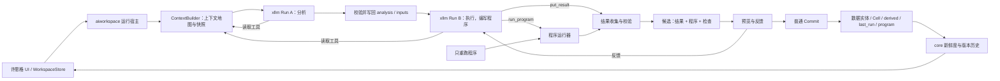

# BuckyOS AI Workspace 许愿格详细设计

> 状态：v0.2 已按 §16.1 实施 W0–W4（W5 未做），实现与本文的差异见 §19，验收见[许愿格实施记录与验收报告](<BuckyOS AI Workspace 许愿格实施记录与验收报告.md>)。以下为设计稿 v0.2，2026-10-07。本版以“让 AI 把活干对、干好”为第一目标重排设计，新增上下文地图、编程优先的执行方式、工具化交付与当场校验、验收检查、候选反馈、可复用的程序，以及 `aiws` v2 接口。v0.1 中输入快照、读集、应用、版本与新鲜度的设计继续保留，用来保证结果可追溯、可撤销，但实施顺序排在质量路径之后。本文不表示新增能力已经实现。
>
> 实现基线：提交 `701b9906`（AI workspace support canvas mode）及当前工作区源码。第二期范围与交付记录见[第二期规划](<BuckyOS AI Workspace 第二期规划.md>)和[第二期实施记录与验收报告](<BuckyOS AI Workspace 第二期实施记录与验收报告.md>)。本文仅完善设计，不修改现有实现。
>
> 权限不是本版重点：遵循第二期 D16 和“先能力后安全”，优先让 AI 有足够能力把事情做好；由此带来的风险列在 §18，不额外加限制。

## 1. 目标与范围

### 1.1 第一目标：把活干对、干好

许愿格的价值取决于结果是否可信、可用。本文把这一目标拆成可以设计和验收的要求：

| 要求 | 含义 | 主要机制 |
| --- | --- | --- |
| 找对 | 绑定用户所指的真实数据和正确范围，包括表格视图上的筛选；重名或缺失时提出候选，不猜 | 上下文地图、任务位置、短句柄、读取工具（§5） |
| 算对 | 计数、求和、排序、筛选、关联等由程序完成，不由模型凭阅读印象写出数字 | 编程优先（§8.2）、程序执行器（§9） |
| 交对 | 结果成为合法的数据实体与 Block，放在预期的位置；格式错误在同一次运行中当场修正 | 交付工具与即时校验（§8.4、§8.6） |
| 自查 | 分析阶段约定验收检查，执行阶段运行检查，并把结果展示给用户 | 验收检查（§8.7） |
| 合用 | 表能被下游继续使用，图表选型和配置合理，文字有结论、引用的数字可追溯 | Renderer 目录、多视图与结果类型（§8.5） |
| 能改 | 用户对候选提出意见后，在已有成果上修改；意见沉淀到许愿格，重跑不丢 | 候选反馈（§8.8） |
| 能复用 | 结构明确的加工任务，在输入变化后只重跑程序，不必每次调用模型 | 程序执行器（§9） |
| 可衡量 | 用固定任务集评估提示词、模型和宿主改动对质量的影响 | 质量评估（§15） |

“算对”是本版最重要的约束。模型擅长理解需求、选择方法、编写程序和撰写结论，不擅长逐行抄写和心算大表。**凡是能程序化的部分，都由模型编写程序完成；模型直接书写的只限文字性内容，且文字中的数字必须来自程序输出。** 这是[分层架构](<BuckyOS AI Workspace 分层架构.md>) §3.5、§7.4 中“AI 生成代码，后续复用代码”路线在许愿格上的落地。

### 1.2 原始意图

许愿格保存“运行一次 AIGC / AI 推理”所需的信息：用户的原始提示词、准确引用 Workspace 数据的 context 提示词、输入引用、执行器及输出规则。它是可以检查、重跑和追溯来源的数据实体，在画布上通过普通 Block 展示。

保留原始构想的四个步骤：

1. **分析需求**：从 Workspace 中找到用户所指的真实数据源，把自然语言需求翻译成完整的 context 提示词，检查输入是否就位。
2. **执行需求**：使用 context 提示词和本次固定的输入快照运行 AI 推理，产生候选结果。
3. **安置结果**：将结果写入固定的命名结构（如 `$container/$blockname`），或每次新建一组。覆盖可以查看历史并回滚，新建便于比较和选择。
4. **跟踪变化**：记录生成时实际依赖的数据及版本；上游改变后，许愿格和结果 Block 一起显示需要刷新。

### 1.3 本次范围与实现选择

本次只接入 **xllm，无 global memory**。分析与执行分别创建独立的 xllm Run。执行阶段只接收已确认的分析结果、显式输入，以及许愿格上沉淀的知识与修改意见；不隐式继承分析阶段的对话历史，也不接入 Agent 的长期记忆、Session、工作日志或自主调度。“两遍”指两个业务阶段，每个阶段内部可以有多轮推理、工具调用和程序运行。

| 问题 | 首版选择 | 原因 |
| --- | --- | --- |
| xllm 运行位置 | aiworkspace 服务侧异步执行，复用现有 Rust SDK | 浏览器不承担模型凭据、进程和长任务生命周期 |
| Workspace 如何进入 context | 上下文地图 `WORKSPACE.md`（短句柄、任务位置、方位、视图语义、Renderer 目录、知识与批注）+ 快照目录 + 绑定同一快照的只读工具，两个阶段都可用 | 模型先读懂“用户在哪、指的是什么”，再精确取数 |
| 第一遍输出 | 输入绑定、context 提示词、输出约定（每个结果的生产方式与视图）、验收检查、缺失项 | 在执行前确定“怎样才算做对”，并可由宿主校验 |
| 第二遍形态 | 编程任务：阅读数据 → 编写程序 → 在快照上运行 → 自查 → 通过宿主工具交付 | 数字来自程序；格式错误当场修正 |
| 结果数据来源 | 以程序或文件产出为主；模型直接书写只限文字性内容 | 避免大表截断、编造数字和高 token 消耗 |
| 程序 | 作为许愿格的持久产物保存，可以“只重跑程序” | 重复加工不依赖模型，结果确定 |
| 结果 Block | 内置 Renderer + 同一结果的多个视图 + AI 生成的 HTML Block | 按合适的方式呈现，不受内置类型限制 |
| 修改已有数据 | 只开放“给已有表增改本许愿格拥有的派生列”；其他 BlockTree / 数据树编辑归 Workspace Agent | 覆盖最常见的表格加工，许愿格仍是可重复执行的加工节点 |
| 是否自动重跑 | 只在用户显式分析、执行或重跑程序时运行 | 多客户端收到变化事件不会重复执行 |
| did-object 接入 | 预留同一读取适配层，首版不依赖它 | 当前 did-object 通用适配器并不等于已有 Workspace 对象协议 |

首版应交付文本、Record、表格、派生列、HTML Block，以及 xllm 和程序能实际产出的 SVG / 文件资产结果。真实图像、音视频生成需要相应模型或工具能力，不能把接通文本推理等同于已接通这些服务。Mock 保留作确定性测试，`agent-work-session` 继续仅作协议预留。

## 2. 当前实现与接入前置工作

### 2.1 直接复用的基础

| 能力 | 当前代码与语义 |
| --- | --- |
| 两棵树 | `data` 下存数据；`surfaces` 下存 Surface / Group / Cell。产品中的画布 Block 在协议中仍是 `buckyos.cell` |
| 许愿格实体 | `buckyos.wish` 已有 `prompt`、`analysis`、`inputs`、`executor`、`output`、`output_mode`、`executor_config`、`last_run` |
| 两遍执行与应用 | Desktop 的 `WishService` 已有 `analyze → execute → plan → apply`；当前 `executorFor` 只接受 `mock`，候选保存在浏览器内存 |
| 结果与画布 | 现有 `ResultSpec` 支持 richtext / record / table / image / video；Mock 的 video 是逐帧预览。宿主创建结果文件夹、画布 Group 和 Cell |
| 表格视图 | 表格 Cell 本身就是保存的视图（`filter/sorts/group/fields/manual_order`），`doc.query` 可以按 `view_id` 读取视图结果 |
| HTML 扩展 | `window.aiws` v1：`context`、`read`、`query`、`submit`（原始 Operation）、`upload`、`snapshot`、`notify`、`on`。Mock 执行器就是一个以 `aiws.on('execute')` 返回结果的 HTML 定义，由 `HtmlExecutor` 无头运行 |
| 依赖与新鲜度 | `entity.set_derived`、`entities.derived_json`、`doc.freshness`、`doc.relations`；core 与 WASM 共享判断 |
| 提交与撤销 | 普通 Command / Commit、读集前置条件、写入权限、锁、幂等记录、补偿撤销 |
| 版本 | 生成结果登记到 `entity_versions`；`doc.list_versions` 列表、`doc.restore_version` 返回恢复操作，由调用方提交 |
| 服务侧加工 | `proc.start/get/apply/cancel` 与 `local.sqlite.runs` 已存在，当前只运行同步的 `mock.task-summary@1` |
| xllm | `XllmTask::prepare`、`XllmRun::start/execute/resume`、`XllmInterrupter`、RunStore、结构化结果与用量记录、`XllmDeps.with_host_tool` 已实现；终态 Run 的 resume 只返回记录，不能追加新输入 |
| JS 运行时 | rootfs 随 buckyos-tool 携带 Deno 2.9.4（`rootfs/libexec/buckyos-tool/runtime/deno`） |

主要依据：[WishService.ts](../../src/frame/desktop/src/app/aiworkspace/ui/wish/WishService.ts)、[htmlRuntime.ts](../../src/frame/desktop/src/app/aiworkspace/ui/extensions/htmlRuntime.ts)、[bridge.ts](../../src/frame/desktop/src/app/aiworkspace/ui/extensions/bridge.ts)、[类型校验](../../src/frame/aiworkspace/core/src/types.rs)、[新鲜度内核](../../src/frame/aiworkspace/core/src/freshness.rs)、[服务侧加工](../../src/frame/aiworkspace/store/src/proc.rs)、[读取与视图查询](../../src/frame/aiworkspace/store/src/reads.rs)、[xllm SDK 说明](../llm_context/xllm_rust_sdk.md)及其[实现](../../src/frame/agent_tool/src/xllm.rs)。

### 2.2 真实执行器不能直接继承的 Mock 简化

以下是本次接入需要补齐的具体边界，不将它们视为已有的完整实现：

| 当前行为 | 本设计要求 |
| --- | --- |
| 分析可见的上下文只是数据实体的名称列表，没有画布位置、视图条件、内容画像、知识与批注 | 上下文地图与内容画像（§5.2、§5.3） |
| 表格结果只能由执行器在 JSON 中逐行给出 | 结果由程序或文件产出（§8.5）；表格只能来自程序 |
| 执行器一次性返回结果，宿主事后校验，失败即结束 | 宿主工具当场校验并返回预览，模型在同一 Run 中修正（§8.4） |
| Markdown 转换只认标题、无序列表和段落，并去掉粗体 | 服务端使用完整的 CommonMark / GFM 解析器，转换为规范富文本 AST |
| `aiws` 只有一个绑定源，没有发现、订阅和类型化读写 | `aiws` v2（§9.4） |
| `snapshotInput` 接收 selector，但未据此裁剪读取；表格使用 `best_effort`、只取首个 1,000 行页面 | 按声明范围完整读取；在一致快照上分页，明确完整性，不静默截断 |
| UI 可以切换 `fixed`，但执行取快照仍按当前值读取并记录 `follow` | 实际读取指定历史对象，固定对象缺失时阻止执行 |
| 表格读集主要记录成员与字段值版本；文件夹展开没有完整的成员集合前置条件 | 补齐字段类型、筛选条件、视图配置、容器成员等决定输入含义的版本 |
| 输入缺失时分析会过滤掉该引用；执行只检查剩余输入，且禁止零输入 | 缺失项作为 blocker 保留；合法的纯提示词任务可以有零输入 |
| 执行主要保护输入和 `last_run`，未冻结所有许愿格配置与输出决策 | 分析、执行、预览、应用均绑定配置基准；运行中改提示词或输出目标不会误用旧候选 |
| 候选、busy 状态在浏览器内存 | xllm 运行和候选在服务端持久化；重开页面可查询，取消能中断实际运行 |
| 表格覆盖重建记录 ID；表格历史恢复明确返回不支持 | 结果表按稳定逻辑键更新；表格历史恢复在 W5 补齐（§16.1） |
| 新鲜度已有 fixed 分支，但不是固定历史对象可用性的完整校验；配置变化主要体现为 `needs_analysis` | 固定快照、配置摘要、结果自身人工修改分别判断，不能把旧配置生成的结果显示为最新 |

第二期已有的接口、结构与验收继续保留；这些补齐项和真实 xllm 接入一起验收。

## 3. 组件职责与一次运行



- **UI / WishService**：编辑提示词与知识，选择输入与输出方式，触发阶段，展示进度、预览和检查结果，收集反馈与人工修改选择；把服务侧接受的 Commit 纳入同一保存状态和撤销栈。触发时把任务位置（§5.2）随请求传给宿主。
- **运行宿主**：绑定当前调用者，创建快照，校验分析及结果，记录运行，调度 xllm 与程序运行器，处理取消、反馈、资产与应用。模型和程序的输出始终只是候选。
- **ContextBuilder**：从正式的读取投影构造上下文地图、内容画像、句柄表和快照文件，保留实体与版本身份；不直接把 `doc.sqlite` 暴露给模型。读取工具也由它在同一快照上应答。
- **程序运行器**：用 Deno 在快照目录上运行许愿格程序，提供程序宿主的 `aiws`（§9.4），收集结果、facts 与检查。模型调试、执行阶段的规范运行和“只重跑程序”使用同一个运行器。
- **结果收集器**：接收程序结果和 `put_result` 提交的结果，按协议与输出约定校验，生成预览，给模型和 UI 返回问题清单。
- **xllm 适配器**：组装两阶段 system / user context，注册宿主工具，选择已配置的模型，返回执行记录。它不分配 Workspace 实体 ID，也不提交文档。
- **结果规划器**：复用现有 `WishService.plan` 的规则，将确定性部分收敛到服务端可用、可测试的实现；不维护第二套结果写入规则。
- **core / store**：继续负责合法性、版本前置条件、整体提交、撤销与持久化。模型和程序不能绕过这些规则提交候选。

xllm 和程序的等待不能发生在 Workspace 的单写者互斥锁或 SQLite 写事务中。只在捕获基准、写入运行状态、准备或应用 Commit 时短暂持锁；期间用户仍可正常编辑。

## 4. 数据与状态模型

### 4.1 共享的许愿格

沿用 `buckyos.wish`，不再创建第二种“真实许愿格”实体。

| 字段 | 内容与变更语义 |
| --- | --- |
| `prompt` | 用户原始需求，保留原文 |
| `knowledge` | **新增**。用户为这个许愿格写的长期说明：口径、背景、偏好、术语（如“销售额指含税金额”“季度按自然季度”）。随文档保存与克隆，两个阶段都带上 |
| `refinements` | **新增**。用户在候选上提出、随应用采纳的修改意见，按时间排列；由模型整理成简洁要求，用户可见、可改、可删（§8.8） |
| `executor` | 本次新增可执行值 `xllm`；`mock` 继续用于测试 |
| `executor_config` | 两个阶段的逻辑模型、工具配置档引用和预算。模型凭据、运行机路径不入文档 |
| `inputs` | 实体 ID、selector、`name`（**新增**，程序与 context 提示词中使用的稳定输入名）、label、`follow/fixed`；固定输入必须绑定实际快照对象；执行时追加的输入记录来源 run |
| `analysis` | 原始需求副本、context 提示词、警告；新增分析协议版本、状态、blockers、输出约定、验收检查、宿主计算的有效性基准 |
| `program` | **新增**。执行阶段产出的程序：`language: "js"`、`api_version`、`source`（文本资产的 object_id）、`digest`、`produces`（程序产出的结果名）、`run_id`。没有程序的任务为空（§9.1） |
| `output` | 已有 `container_id/name/type/surface_id`，分别表达数据落点和画布落点 |
| `output_mode` | `overwrite` 或 `new` |
| `last_run` | 最近一次成功应用的执行摘要、读集、结果身份、缺失结果；失败尝试不覆盖它 |

`analysis` 新增的子字段为 `schema_version`、`status`、`blockers`、`output_contract`、`checks`、`basis`、`run_id`。`output_contract` 中每个结果带生产方式（`program` / `direct`）和视图（§7.2）。`basis` 由宿主计算，至少覆盖原始提示词、知识、修改意见、执行器及有效配置、最终输入绑定、context 提示词、输出约定和检查的摘要；不能用模型自报的摘要证明分析仍有效。当前 `analysis` 是严格键校验，实施时必须同步扩展 core、TS 类型与 fixtures。

改变需求、知识、修改意见、输入范围或版本策略、执行器、输出约定或检查，标记“需要重新分析”。只改变结果安放位置、画布坐标或覆盖/新建方式，可以复用分析，但旧执行候选不得悄悄跟随新的输出设置。

`last_run` 新增 `mode`（`generate` / `program`）、`config_digest`、`program_digest`、`checks`（各检查的通过、失败、未执行汇总）和 `result_bindings`。`result_bindings` 保存本结果组的逻辑结果名到数据实体 / Cell 的对应：表格结果还保存逻辑记录键到 record ID 的映射，派生列结果保存目标表与拥有的字段 ID（§10.4），HTML 结果保存定义实体。它们随结果应用一起写入，不能只存于运行数据库，否则导入后无法稳定刷新。映射也受现有 payload 大小限制；大表应使用可重建的稳定键映射，超限时明确拒绝，不无限扩张 last_run。

### 4.2 部署本地的运行记录

复用 `local.sqlite.runs` 管理本次工作，不把进度、日志、程序输出和模型中间输出不断写入共享文档。以下是拟新增的逻辑字段，具体拆列或放入现有 JSON 字段由实现确定：

| 内容 | 必须保留的信息 |
| --- | --- |
| 身份 | Workspace、wish、调用者、阶段、业务 run_id、关联的 xllm run_id、上一轮 run_id（反馈与修程序） |
| 配置基准 | epoch、捕获时的 head_seq、许愿格相关 key revisions、analysis/config digest、任务位置 |
| 输入证据 | manifest、句柄表、读集（含执行时追加的读取）、固定对象引用、范围与完整性、输入资产摘要 |
| 程序 | 程序源码与 digest、每次规范运行的输出、stdout/stderr、耗时、`llm.map` 调用摘要 |
| 输出 | 校验后的分析或结果、facts、检查结果、候选摘要、上传资产映射、plan digest |
| 反馈 | 每轮反馈原文、对应的候选与整理后的要求 |
| 应用 | 预览时的输出版本、人工修改决策、Commit 请求及幂等键、最终 commit_id |
| 诊断 | 状态、阶段、时间、用量、错误、警告、取消标记和恢复依据 |

运行记录、临时目录、`llm.map` 缓存和凭据不随 Workspace 导出或 Fork；已应用的结果、程序和依赖记录随文档保存。

### 4.3 候选与依赖记录

候选沿用现有 `Candidate` 的核心含义，新增持久化、程序、检查、配置和预览基准：

```text
Candidate = 已校验的结果声明
          + 程序及其规范运行结果（若有）
          + facts 与检查结果
          + 输入快照及读集（含执行时追加的输入）
          + 许愿格配置基准
          + 输出身份 / 内容基准
          + 资产映射
          + 本次确认的应用计划摘要
```

每个结果仍通过 `entity.set_derived` 保存 `wish_id/run_id/executor/inputs/generated_rev`，新增 `config_digest`、稳定的 `result_key`、`approach`（程序或直接书写）、`program_digest`，以及按需的 `model_judgment`（使用了 `llm.map`）和 `external_data`（程序联网读取了数据）。`generated_rev` 由内核根据本次写入填写。`last_run.read_set` 与结果 `derived.inputs` 来自同一份宿主证据，不能由模型填写，也不能从“结果生成时间”反推。

`config_digest` 对共享的需求、知识、修改意见、context 提示词、输入绑定及版本策略、执行器配置、输出内容约定、检查和程序 digest 做规范化摘要；不包含 last_run、分析时间、实时读到的 follow 版本、画布位置及结果放置方式，避免应用本身或移动结果使内容立即过期。部署侧实际模型/工具配置另存运行证据，不让 core 依赖隐含的服务配置才能判断文档状态。

新字段涉及文档格式、物化、导出/导入、WASM 与 TS 的同时更新；按仓库当前开发规则统一更新格式与 fixtures，不新增旧版兼容分支。运行协议版本与文档格式版本分别管理。

## 5. 让 AI 看懂 Workspace

### 5.1 两棵树都要提供，但身份绑定到数据

用户说“左边的销售表”“上一格的分镜”“角色组里的图片”，首先指向画布 Block。模型需要 BlockTree 来理解位置和名称，再通过 `Cell.source_ref` 找到数据树中的真实数据。

同一份数据在多个画布显示时，去重为一个数据输入。纯 UI Block 没有 `source_ref`，不能误当成可读取的正文。

名称和路径用于发现、展示；持久绑定使用 `entity_id`，表格使用稳定的 record/field ID，富文本范围使用内部 block ID。重名时返回候选并要求补充选择，不能任选一个；数据绑定完成后，重命名不应使引用失效。本文的 `$container/$blockname` 是逻辑路径表达，不是 shell 变量或可执行字符串。

### 5.2 上下文地图

宿主为每个阶段生成一份 `WORKSPACE.md`，这是模型理解工作区的主入口。它是写给模型读的紧凑 Markdown，不是数据导出；精确内容通过快照文件和读取工具获取。地图依次包含：

1. **任务位置**：触发时使用的许愿格 Cell（同一许愿格可出现在多个画布，以触发时的那个为准）、所在 Surface / Group / 框、触发时的选区、视口中可见的 Block。UI 随 `proc.start` 传入；它只是定位提示，不是依赖，也不写入文档。从数据源模式触发时，任务位置是许愿格在数据树中的位置。
2. **方位关系**：以许愿格 Cell 为原点，宿主预先计算其他 Block 的方向（左/右/上/下）、距离档位（相邻/较近/较远）、是否同组、所在的框，以及阅读顺序（先行后列的序号），由近及远列出。模型不需要自己用坐标推算“左边那张表”。
3. **画布清单**：按 Surface → Group / 框 → Block 列出句柄、标题、Renderer、绑定数据的句柄、视图条件摘要（如“筛选：地区=华东；按销售额降序；显示 6/11 列”）、图表等 Block 的关键配置（如 x/y 字段）和一句内容摘要。纯 UI Block（框、形状）只用于说明分组，并标明没有可读取的正文。
4. **数据清单**：数据树中可读的数据：句柄、类型、名称与路径、内容画像摘要（§5.3），以及它是否为某个许愿格的结果（来源许愿格、是否过期）。同一数据在多个 Block 中显示时只列一次，并列出显示它的 Block。
5. **知识与批注**：许愿格的 `knowledge` 与 `refinements`；挂在输入或候选输入上的批注；许愿格附近的便签。按“作者写给这个任务的说明”呈现。
6. **上次结果**：本许愿格上次应用的输出约定、结果结构（名称、类型、字段、键）、程序摘要（读取了哪些输入、产出哪些结果）与当前新鲜度。重跑时默认沿用，以保持结果身份稳定（§10）。
7. **Renderer 目录**：内置 Renderer 与 Workspace 中 block-def 的类型标识、说明、接受的数据类型、配置 schema 摘要；完整目录在 `catalog/renderers.json`。结果视图从中选择（§8.5）。

地图有规模预算（初定 4–8k tokens，W0 冻结）。超出时优先保留任务位置周围、已声明输入、名称与需求匹配的项；其余折叠为“某 Group 下另有 N 个 Block”，模型可以用读取工具展开。折叠必须写明，不能静默丢弃。

示例（节选）：

```markdown
## 任务位置
许愿格 @W「季度分析」位于画布「Q3 经营」的框「华东复盘」内。触发时选中：@B2、@B3。

## 附近的 Block（以 @W 为原点，由近及远）
- @B2 表格视图「华东订单」→ 数据 @T1；左侧相邻，同框。视图：筛选 地区=华东；按 下单日期 降序；显示 6/11 列
- @B3 柱状图「月度销售额」→ 数据 @T1；上方相邻，同框。配置：x=月份(@T1.f2)，y=销售额(@T1.f5)，聚合=合计
- @B5 富文本「口径说明」→ 数据 @D1；右侧，较远

## 数据
- @T1 表「订单」 /data/销售/订单 · 12,480 行 · 11 列（显示于 @B2、@B3）
  - f2 月份 date（2026-01-01…2026-09-30）· f4 地区 single_select（华东 52%、华南 31%、其他 17%）
  - f5 销售额 decimal（0.00…48,210.00，3 个空值）· f7 状态 single_select（已结算 94%、未结算 6%）
- @D1 富文本「口径说明」· 标题：口径 / 退货 / 汇率 / 例外

## 知识与批注
- 许愿格知识：销售额按含税金额；季度为自然季度。
- 批注（在 @T1.f5 上）：9 月数据含未结算订单，统计时排除 状态=未结算。
```

**短句柄**：地图、工具和结果协议中，实体、Cell 与字段使用本次运行内唯一的短句柄（`@T1`、`@B3`、`@T1.f5`、record 用 `@T1.r128`）。宿主保存句柄表，负责与 `entity_id`、field ID、record ID 互相映射。模型可以使用真实 ID，但不需要；返回中出现的未知句柄视为错误，不会被猜测成相近对象。持久化的 analysis、inputs、derived 一律保存真实 ID。句柄在同一运行中稳定，不同运行之间不保证相同，所以程序中不写句柄，而使用输入名（§9.4）。

**视图即范围**：用户说“那张只显示华东的表”时，指的是视图结果而不是整张源表。分析阶段可以把输入绑定为 `table_view` 选择器（§6.2），执行时按该 Cell 保存的视图条件读取，读集同时保护视图配置和相应的表格版本格。普通 Block 的位置、尺寸、样式仍不是依赖。

### 5.3 内容画像

画像让模型在不读全文的情况下判断“这是不是要的数据、该怎么处理”：

| 类型 | 画像内容 |
| --- | --- |
| 表格 | 行数；每列的名称、类型、选项；数值与日期的最小值、最大值；枚举取值及占比（前若干项）；空值数；若干示例行；疑似问题（数字存成文本、混合单位、重复键、异常值） |
| Record | 属性名、类型与当前值（长值截断并标明） |
| 富文本 | 标题大纲、字数、前若干段 |
| 资产 | 媒体类型、尺寸或时长、文件名、说明；多模态模型可以附缩略图 |
| 文件夹 | 成员数量与类型分布、前若干成员 |
| 许愿格结果 | 来源许愿格、生成时间、新鲜度、是否含模型判断 |

画像由宿主在快照上确定性计算，写入 `context/entities/<entity_id>/profile.json` 并摘要进地图。画像是理解材料，不是生成依赖；真正用于计算的数据仍按 §6 读取并记录读集。

### 5.4 快照目录

每个阶段使用独立的工作目录，下面是拟采用的投影格式，不是当前已有的导出命令：

```text
<run-workdir>/
  .llm_context                 宿主生成的本阶段配置
  WORKSPACE.md                 上下文地图（§5.2）
  request.json                 原始需求、阶段、知识、修改意见、分析/输出约定、检查，以及评估日期、时区、货币等固定参数
  handles.json                 本次运行的句柄表
  catalog/renderers.json       Renderer 目录
  context/
    manifest.json              Workspace/epoch/快照标识、实体映射、版本、完整性
    data-tree.json             可读的数据树索引
    block-tree.json            画布关系、source_ref、视图配置、方位关系
    entities/<entity_id>/
      meta.json                类型、显示名称、源身份、selector、版本
      profile.json             内容画像
      content.md               富文本的可读投影（同时保留规范结构）
      content.json             Record、富文本 AST 或类型特定结构
      schema.json              表格字段、类型、选项及其 ID
      rows.jsonl               表格记录，保留 record_id 与按 field_id 编码的值
    assets/<object_id>         本次允许读取的实际资产
  lib/aiws.js                  程序宿主的 aiws 实现（§9.4），读取上面的快照
  program/main.js              模型编写的程序（执行阶段）
  output/                      程序和模型产生的文件；尚未成为 Workspace 资产
```

文件名使用宿主生成的 ID，用户标题只进入元数据。所有路径解析在宿主侧完成；不得把模型输出的任意绝对路径当成可上传文件。此目录是临时材料，不是 Workspace 的另一个持久真相源；修改投影文件不会修改 Workspace。

分析阶段提供地图、所有可见数据的画像和候选输入的完整 schema，表格行与正文按需通过工具读取。执行阶段重新捕获已绑定输入的完整快照，并可以在同一快照上追加读取（§5.5）；不会在运行中无声切回实时数据。

### 5.5 读取工具

两个阶段都通过 `XllmDeps.with_host_tool` 注册同一组宿主只读工具。工具全部读取本阶段固定的快照，参数使用句柄或真实 ID，工具名与参数在 W0 冻结：

| 工具 | 作用 |
| --- | --- |
| `ws_outline(target?, depth?)` | 展开数据树或画布中的某个节点（包括地图中折叠的部分） |
| `ws_find(text, kinds?)` | 按标题、名称、字段名和正文查找，返回句柄与匹配片段 |
| `ws_profile(target)` | 返回内容画像 |
| `ws_neighbors(cell, radius?)` | 某个 Block 周围的 Block 及方位 |
| `ws_read(target, selector?, limit?)` | 读取富文本、Record、资产元数据，或表格的指定范围 |
| `ws_query(table_or_view, filter?, sorts?, fields?, limit?, cursor?)` | 表格查询，可以按视图读取；结果带 record 句柄 |

规则：

- 分析阶段的读取用于定位和理解，不进入结果依赖。分析若把读到的具体规则或数值写进 context 提示词，按 §8.1 记入 analysis.basis。
- 执行阶段允许读取已声明输入之外的数据。宿主把实际读取的范围自动并入本次读集，在候选中列为“执行时追加的输入”；应用时一并写入许愿格的 `inputs` 并标记来源 run，下次运行直接包含。模型不必为补一个输入退回分析，依赖也不会漏记。若需要的数据在 Workspace 中根本不存在，返回 `needs_input`。
- 工具返回体有预算。大结果分页返回，并提示改用程序处理；不能用工具把整张大表倒进对话。
- 快照文件可以直接用 `read_file` 和 shell 读取，这部分按“导出的输入即读集”保守记录（§6.2）。

一致性实现可以是在运行期间持有一个只读数据库快照（例如 SQLite WAL 下的长读事务），也可以在开始时物化所需范围、按需在同一快照上补充物化。无论哪种方式，工具读到的内容与快照目录必须来自同一时点（§6.1）。

### 5.6 读取适配层与 did-object 路线

ContextBuilder 内部统一使用 `list/resolve/read/query/read_asset` 语义，复用 `doc.outline/resolve/read/query` 和资产读取规则。它负责快照和读集，不让模型自己构造版本号。

以后可以把同一能力暴露为命令行或 did-object 的只读 property/action：请求必须携带本次运行绑定和快照标识，返回数据及版本证据；分页游标也绑定快照。在线读取和本地投影不能各自发明版本语义。

现有 `agent-did-object-lib` 有通用对象解析与 action 调用，但 Workspace 的 DID 寻址、object profile、快照参数和权限映射尚需实现。首版不编造已可用的 `did:workspace:...` 地址，也不以打通全套 did-object 为接入 xllm 的前置条件。

## 6. 输入快照与读集

### 6.1 一致性边界

宿主在短事务或固定的只读数据库快照中，一起取得许愿格配置、所需数据和对应版本，然后释放 Workspace 写锁，再进行文件投影、工具应答、程序运行及模型调用。不能先读值、过一段时间再读版本，并把两者拼成同一快照。

大表可以在固定快照上分页、流式写文件；不能在持有 Workspace 单写者锁时等待模型或程序。快照必须有完整性证据：选择条件、字段范围、行数、是否完整、限制原因及文件摘要。分析阶段的抽样写明 `sampled`；执行阶段需要完整数据而未取得时，应阻止执行或让用户缩小范围。

对 URL 数据源，只有适配器确实支持一致快照和可验证版本时才纳入严格读集。当前只有 fixture 适配器的能力不能当成任意 HTTP 数据源能力；无法保证版本时给出明确的不可执行原因。

### 6.2 依赖如何落到现有版本格

| 实际读取范围 | 读集依据 |
| --- | --- |
| 整个富文本或 Record | 实体 `content_rev` |
| Record 的指定属性 | `doc_key`（如 `p:amount`），同时保护依赖的 schema |
| 富文本中的指定块 | `richtext_block` 的 hash；若含顺序/成员含义，另保护对应结构 |
| 指定表格单元格 | `table_cell` + 所用字段的 `table_field_type`，必要时加 `table_field` |
| 指定列的完整数据 | `table_members` + 所用列的 `table_field_values` / 类型版本 |
| 按条件筛选的表 | 成员版本、筛选/排序字段的值与类型版本，以及返回值实际读取的版本；保护会使未入选行进入结果的条件 |
| 表格视图（`table_view`） | 视图 Cell 的 `filter/sorts/group/fields` 键版本 + 按视图条件展开的成员、字段值与类型版本 |
| 文件夹输入 | 文件夹成员集合 + 展开的子项读集；不能只保护已经存在的子项 |
| 资产 | AssetRef 内容版本 + 已校验的 object_id / 字节摘要 |
| 显式读取画布布局 | Block 的布局/绑定配置及结构依据；普通数据任务不加入这类依赖 |

上述表格版本格已在 `core::plan::resolve_cell` 中存在；**文件夹成员与画布结构的通用 selector 尚不存在**，需要补充。建议新增 `tree_children`（当前直接子项身份集合的规范 hash）和 `tree_edge`（该节点的 `struct_rev`）；执行对嵌套文件夹展开时逐层记录。成员集合变化使依赖过期，普通 Block 移动不影响仅依赖数据内容的任务。

输入中的“选择什么数据”和 derived 中的“比较哪些版本格”分开处理。动态表查询需要新增并校验输入选择器 `table_query`（含 filter/sorts/fields），按视图读取需要新增 `table_view`（含视图 Cell ID）；ContextBuilder 将它们展开成上表已有的成员、字段及单元格版本格，不能直接把查询对象传给当前 resolve_cell 并假定可比较。文件夹无法完整读取所声明范围时报告输入不完整，不能把有权限的子集伪装成全部。

读集记录的是实际交给模型或程序的数据范围：经读取工具读到的内容按实际范围记录；导出到快照文件、可供 shell 和程序读取的输入按导出范围保守记录，不必追踪程序究竟读取了哪些字节。但不能把整个 Workspace 都导出后声称只依赖模型主动列出的几个输入。派生列的目标表作为输入时，本许愿格拥有的字段不进入读集，程序宿主也不向程序提供这些字段（§10.4）。

当前 wish / derived 输入各有 200 项限制。读集应先按相同实体和 selector 去重，必要时把大量单元格依赖提升为字段或整实体版本并说明粒度变粗；仍超限则要求缩小范围。不能截去读集来凑数。

### 6.3 跟随当前与固定版本

- **follow**：本次使用固定快照执行，应用时与当前版本比较；应用后继续随输入变化显示过期。
- **fixed**：用户选择一个可寻址的历史对象，绑定 `object_id`，从该对象及其文件/资产闭包读取。不能只把当前版本标成 fixed。
- 固定输入仍检查历史对象与资产可用性；新版本出现不使固定内容过期。不得因实时实体的某个 selector 消失，就误把仍完整可读的固定对象判断为内容丢失。
- `doc.resolve` 已有 `fixed_revision + object_id` 路径；ContextBuilder 还需将历史对象解码为各类型的输入快照。无法物化的历史范围必须显式拒绝。
- 应用前置条件只对 follow 输入比较实时版本；fixed 输入校验固定对象可用性，不要求当前 head 与旧版本相等。

新鲜度的 fixed 分支也需核对固定对象，并按固定快照对应的依赖解释上游，不能直接遍历实时输入的最新依赖记录。固定引用所需历史对象纳入保留和包闭包；若包没有携带，则导入后标为不可用，不能改成跟随当前。

epoch 与对象 hash 是证据的一部分。运行期间发生恢复导入或 Workspace 换代时，旧候选失效；`head_seq` 用于定位快照，不作为所有任务的整文档冲突条件。否则移动一个无关 Block 也会使运行冲突。

fixed 输入读取历史对象安排在 W5（§16.1）；此前 UI 不提供 fixed 选项，不能把当前版本伪装成固定版本。

## 7. 第一遍：分析需求

### 7.1 输入与提示词组成

分析阶段 system 包含：许愿格的职责、两棵树与句柄规则、地图的读法、读取工具、编程优先规则（§8.2）、结果类型与 Renderer 目录、验收检查的写法、缺失/歧义处理，以及 `wish.analysis.v2` 输出规范。原始需求、知识、修改意见和 `WORKSPACE.md` 放在 user/context 材料中，不混成宿主规则。

给模型的任务是：

1. 解释用户希望得到什么，结合任务位置、选区和方位确定指代；已有的显式输入优先作为定位线索。
2. 用句柄绑定真实数据与范围（整表、视图、查询、指定字段、富文本块），不发明数据源；重名或无法确定时列出候选。
3. 写出能够独立执行的 context 提示词：每个输入的名称、角色与读取范围，口径（来自知识与批注），处理步骤，每个结果的含义。
4. 设计输出约定：每个结果的逻辑名、类型、生产方式（`program` / `direct`）、展示视图与放置提示；重跑时默认沿用上次约定。
5. 写出验收检查：能由程序验证的断言（如“各地区合计等于原表合计”“覆盖 7、8、9 三个月”），以及需要人工确认的事项。
6. 报告缺失、歧义、不可读取和不支持的能力，区分阻止执行的 blocker 与可以接受的 warning。

对零输入的纯创作需求，返回 `inputs: []` 且状态为 ready 是合法的；依赖来自需求和执行配置。对“根据销售表”但找不到表的需求，不能退化为零输入任务。

### 7.2 结构化输出

以下为新增的模型输出协议示例；句柄的映射、revision、object_id 的合法性与最终 basis 由宿主补齐和验证：

```json
{
  "schema_version": "wish.analysis.v2",
  "status": "ready",
  "context_prompt": "读取输入 sales（华东订单视图）的全部记录，排除 状态=未结算；按月份汇总含税销售额与订单数并计算环比；找出销售额前 10 的客户。基于汇总结果写一段不超过 300 字的季度解读，所有数字取自程序输出的 facts。季度按自然季度，评估日期见 request。",
  "inputs": [
    { "name": "sales", "ref": "@B2", "label": "华东订单", "selector": { "kind": "table_view" }, "version": { "mode": "follow" } },
    { "name": "rules", "ref": "@D1", "label": "口径说明", "selector": { "kind": "entity" }, "version": { "mode": "follow" } }
  ],
  "output_contract": {
    "results": [
      { "name": "monthly", "type": "table", "title": "月度汇总", "approach": "program", "key": ["月份"],
        "views": [ { "renderer": "table" }, { "renderer": "sample.bar-chart", "config": { "x": "月份", "y": "销售额" } } ] },
      { "name": "top_customers", "type": "table", "title": "前 10 客户", "approach": "program", "key": ["客户"] },
      { "name": "commentary", "type": "richtext", "title": "季度解读", "approach": "direct" }
    ],
    "placement": "right_of_wish"
  },
  "checks": [
    { "id": "total", "kind": "program", "text": "月度汇总的销售额合计等于输入中已结算订单的销售额合计" },
    { "id": "months", "kind": "program", "text": "汇总覆盖 7、8、9 三个月，没有缺月" },
    { "id": "cited", "kind": "review", "text": "解读中的每个数字都能在 facts 或结果表中找到" }
  ],
  "blockers": [],
  "warnings": ["9 月含未结算订单，已按批注排除"]
}
```

- `inputs[].name` 是程序和 context 提示词使用的稳定输入名；`ref` 是句柄，宿主映射为真实实体。示例中 `@B2` 是表格视图 Cell，宿主保存为源表 ID 加 `{ "kind": "table_view", "cell_id": … }`。
- 视图配置中的字段用名称引用，由宿主在应用时映射为 field ID（结果表的字段 ID 由宿主分配）。
- `status` 为 `ready | needs_input`；blocker 使用结构化的 `code/message/input_label/candidates`，候选只包含调用者可读的对象。字段名仍须经 schema 解析映射到真实 field ID。日期、币种、单位等影响计算的解释应进入 request 的固定参数或 context 提示词，不能每次运行从环境中隐式变化。
- 若用户明确选择 fixed，模型只能引用宿主目录中提供的版本候选；宿主解析为最终 `object_id`。context 提示词中出现的每个数据输入必须在 `inputs` 中有绑定。

### 7.3 宿主校验与写回

模型返回后按顺序校验：JSON/schema、句柄映射、引用范围、存在及可读性、selector 与字段类型、固定对象可用性、输出类型与 Renderer 能力、生产方式规则（`table`、`table_columns` 必须为 `program`）、检查定义，以及生成依赖环。不能只验证输入 ID 存在。

直接或间接使用本许愿格已有结果作为输入会形成生成环，应拒绝；嵌套文件夹也要展开检查。派生列的目标表是例外：它是输入，但本许愿格拥有的字段被排除在读取之外（§10.4）。生成依赖遍历有 visited 集合和预算，触及预算时显示无法确认，不能视为无环。普通数据引用成环不等同于生成依赖环。

分析完成后，将 `analysis` 与归一化 `inputs` 作为一次普通 Commit 写回；点击“分析”即触发该写回，无需再增加一次普通分析确认。写回保护分析开始时的 prompt、knowledge、refinements、executor/config、原输入及 analysis 版本。用户中途改了需求，旧结果只保留为本地运行记录，不能覆盖新分析。

`needs_input` 可以写回供用户修正，但会阻止“执行”；缺失输入保留在 blockers 中，不能过滤后把分析改成 ready。执行前再次验证分析 basis 和输入可用性。

## 8. 第二遍：执行（编程优先）

### 8.1 独立的 LLM context

执行阶段创建新的 xllm Run，包含：

1. 宿主的执行规则：编程优先规则、结果协议、Renderer 目录、交付工具说明、`aiws` 程序接口文档与示例。
2. 原始需求、知识、修改意见，以及已确认的 context 提示词，后者作为本次具体执行任务。
3. 上下文地图，以及由第一遍确定、第二遍重新固定的数据快照和 manifest。
4. 输出约定与验收检查。
5. 本许愿格已有的程序（若有）及上次结果结构：优先在已有程序上修改，保持结果名、字段和键稳定。旧结果正文只有在确有需要且显式纳入上下文时才能读取；不能通过它偷偷引入自依赖。

若分析依赖的 schema 或绑定条件已失效，先重新分析；只有数据值变化且原约定仍有效时可以用新值执行。日期等由宿主在 request 中明确固定。

context 提示词通常描述如何读取和处理数据，不复制分析时看到的统计值。若分析确实把某份正文中的规则或具体值写进提示词，宿主在 analysis.basis 中保留对应的语义读集；这些值变化必须重新分析，且生成结果的依赖包含这部分依据，不能拿旧提示词配新快照冒充一致输入。

执行阶段需要额外数据时，用读取工具在同一快照上读取，由宿主并入读集（§5.5）。

### 8.2 编程优先规则

以下规则写入执行阶段的 system，也由宿主部分强制：

- **必须用程序完成**：计数、求和、平均、排序、筛选、分组、关联、去重、逐行或逐列变换、日期与金额计算、为图表准备数据，以及任何超过 20 行的结构化结果（阈值在 W0 冻结）。
- **可以直接书写**：摘要、解读、建议、文案、标题、命名，以及不来自输入数据的少量创作性内容。
- **文字中的数字来自程序**：程序通过 `aiws.facts()` 输出关键数值，直接书写的文字只引用 facts 和结果表中的数字，不凭样本估计。主要由数字组成的文字（如“本季度销售额 X，环比 Y”）应由程序按模板生成，这样只重跑程序时也能更新。
- **逐项语义判断**（打情感标签、从备注抽取金额）不靠模型通读全表，而是由程序调用 `aiws.llm.map`（§9.5）。
- **不确定时选程序**。

宿主强制：`table` 与 `table_columns` 结果只能来自程序；约定为 `program` 的结果不能通过 `put_result` 内联提交；`direct` 结果超过规模上限时拒绝，并提示改用程序。

### 8.3 执行工作流

执行阶段默认开启 shell，PATH 中提供 Deno；规范程序语言为 JavaScript（§9.3）。shell 运行在服务侧的运行目录中，不注入 Workspace 写入凭据，结果只经宿主工具进入候选。模型按以下顺序工作，system 中给出同样的流程：

1. 阅读 `WORKSPACE.md`、context 提示词、输出约定与检查。
2. 用读取工具或 shell 查看输入的画像和样本，确认字段含义与数据问题。
3. 在 `program/main.js` 编写程序（已有程序时在其上修改），通过 `lib/aiws.js` 读取输入，写出结果、facts 与检查。
4. 用 shell 运行程序调试（如 `deno run -A program/main.js`），查看输出。
5. 调用 `run_program`：宿主以与“只重跑程序”完全相同的方式运行程序，收集结果，执行校验和程序型检查，返回每个结果的预览与问题。
6. 用 `put_result` 提交 `direct` 结果（如解读），其中的数字取自 facts。
7. 修正问题后调用 `finish`，给出摘要、假设和需要人工确认的事项。

程序示例（示意 `aiws` 用法，不是冻结的接口）：

```js
export default async function main(aiws) {
  const rows = await aiws.input('sales').rows({ fields: ['月份', '客户', '销售额', '状态'] })
  const settled = rows.filter((r) => r['状态'] !== '未结算')
  const monthly = groupBy(settled, '月份').map(([month, items]) => ({
    月份: month, 销售额: round2(sum(items, '销售额')), 订单数: items.length,
  }))
  aiws.result.table('monthly', monthly, { key: ['月份'], fields: { 月份: 'date', 销售额: 'decimal', 订单数: 'number' } })
  aiws.facts({ total: round2(sum(settled, '销售额')), months: monthly.length })
  aiws.check('total', Math.abs(sum(monthly, '销售额') - sum(settled, '销售额')) < 0.01)
  aiws.check('months', ['2026-07', '2026-08', '2026-09'].every((m) => monthly.some((r) => String(r['月份']).startsWith(m))))
}
```

### 8.4 交付工具

执行阶段用宿主工具交付结果，代替 v0.1 的“最终 JSON + 事后格式修复”。校验错误在同一 Run 中返回给模型修正：

| 工具 | 作用 |
| --- | --- |
| `run_program()` | 以规范方式运行 `program/main.js`，收集其写出的结果、facts 与检查，校验后返回预览、检查结果和错误。可以多次调用，以最后一次成功运行为准 |
| `put_result(spec)` | 提交 `direct` 结果，或引用 `output/` 下非程序产出的文件（如模型写的 SVG）；立即校验并返回预览。同名再次提交即替换 |
| `check_results()` | 汇总全部结果：是否满足输出约定，检查是否通过，文字中引用的数字能否在 facts 和结果中找到 |
| `finish(summary, assumptions, warnings, review_notes)` | 结束执行。结果存在未处理的宿主级错误，或程序型检查未执行时，拒绝并返回原因 |

预览返回每个结果将成为的数据实体类型、行数、字段及推断类型、前若干行或文本片段、目标视图与位置，以及与上次结果的结构差异（新增/删除字段、键变化、行数变化）。程序结果与 `put_result` 结果合并为候选；名称冲突是错误。工具调用计入迭代预算，预算耗尽仍未 `finish` 视为失败，保留程序与原始输出供诊断。

### 8.5 结果类型

结果协议升级为 `wish.results.v2`。模型和程序都只给出逻辑结果，不给出 `entity.create` 等可直接执行的原始 Command：

| 类型 | 内容与宿主处理 |
| --- | --- |
| richtext | Markdown，可以由程序生成或直接书写。服务端用完整的 CommonMark / GFM 解析器转换为规范富文本 AST（标题、段落、强调、链接、有序/无序列表、表格、代码、引用）；可以用结果名或输入名引用其他 Block，转换为链接 |
| record | schema + props；必须满足现有字段类型与值校验 |
| table | 程序输出字段定义（名称、类型、可选的选项）、按字段名组织的行，以及 `key`（一列或多列的逻辑键）。宿主分配 field ID，按 key 映射稳定的 record ID；类型可以省略，由宿主按值推断，声明优先 |
| table_columns | 目标为某个已绑定的输入表：本许愿格拥有的派生字段定义，以及以输入 record 为键的值；只增改自己拥有的字段（§10.4） |
| image / asset | SVG 或 `output/` 下的文件；宿主检查真实字节、类型、大小后上传，构造 AssetRef |
| html | 生成的 HTML Block：`html/css/js` 与绑定（结果名或输入名）。宿主创建或更新 `buckyos.block-def`（kind `html`，`api_version: 2`）及 Cell，代码使用 `aiws` v2 的 Block 宿主接口（§9.4） |
| video | 现有 Mock 逐帧预览仍标 simulated；没有真实媒体工具时不向模型承诺真实视频生成 |

**视图**：每个结果可以有多个视图 `views: [{ renderer, config, title, size }]`。renderer 取自 Renderer 目录，config 按目录中的 schema 校验，字段用名称引用，由宿主映射为 field ID。同一份数据的多个视图共享一个数据实体。没有给出视图时，使用该类型的默认 Renderer。

**放置**：结果组给出放置提示（许愿格右侧、下方或指定的框），由宿主按布局规则计算坐标。已有结果 Block 的位置不重置（§10.2）。

`name` 是稳定的逻辑结果键，`title` 是显示名称。一次输出内 name 必须唯一，不可包含路径穿越或目录分隔符。实际输出必须符合 analysis 中的输出约定；动态数量的输出须由约定显式允许，不能任意扩展任务。

### 8.6 校验与失败处理

宿主在每次 `run_program` / `put_result` 时检查必需字段、类型、唯一名称、输出约定、生产方式规则、数量/字节限制、文件路径及结果结构；`finish` 时再整体检查一次。xllm 的 `json` 选项和 `TaskOverrides.json_schema` 只用于工具参数与结束摘要，不代替宿主的业务校验。

只有 xllm 正常结束、`finish` 被接受且业务校验通过，才进入待应用。不能用退出码为 0、状态 completed 或“看起来像 JSON”代替上述检查。修复在同一 Run 内进行，受迭代预算约束；不得更换输入快照、扩大写入范围或直接应用部分结果。Provider 失败、超时、取消或预算耗尽都保留已有 Workspace 结果。

### 8.7 验收检查

- 程序型检查由程序通过 `aiws.check(id, passed, detail?)` 报告，`run_program` 汇总。约定了却未报告的程序型检查视为未执行，`finish` 拒绝。
- review 型检查由模型在 `finish` 中给出自评，并在预览中作为“请确认”项展示给用户。
- 检查失败不自动阻止应用，但在预览中醒目显示，应用前需要用户确认；宿主级校验失败（类型、约定、规模）阻止应用。
- 检查定义随 analysis 保存，只重跑程序时同样运行；检查结果写入 `last_run.checks`，在许愿格和结果 Block 上可见。

### 8.8 候选反馈与迭代

- 用户在候选预览上用自然语言提出修改（“把华东拆成上海和其他”“图换成折线图”），可以针对整组结果，也可以针对单个结果。
- 宿主新建一个执行 Run，带上上一轮的程序、结果预览、检查结果和反馈原文；输入快照沿用上一轮，除非用户要求刷新数据。xllm 的终态 Run 不能追加输入，所以每轮反馈都是新 Run，但材料完整，模型在已有程序上修改，不从头开始。
- 应用时，本轮链上的反馈由模型整理成简洁的要求，作为 `refinements` 写入许愿格，参与 config_digest；以后重新分析、重新执行都会带上，避免“改好了，下次重跑又回去了”。原话保留在运行记录中，用户可以在面板中修改或删除整理后的要求，修改后需要重新分析。
- 只调整视图与位置的修改，用户也可以在应用后直接在画布上改，不必经过许愿格。
- 反馈轮次受预算限制；放弃候选不写文档。

## 9. 程序执行器与 aiws 接口

### 9.1 程序是许愿格的产物

- 生成运行产出的程序保存在 `wish.program`：源码作为文本资产上传，`source` 记录 object_id，`digest` 为内容 hash，`produces` 列出它产出的结果名。程序随结果应用一起写入，随文档导出与 Fork。
- 首版程序是单个 ES module（`program/main.js`），默认导出 `main(aiws)`；只使用 Deno 内置 API 与 `aiws`，不引入第三方依赖（§18）。
- 旧程序通过资产和许愿格版本历史可查；每个结果的 derived 记录 `program_digest`。
- UI 可以查看程序。高级用户可以直接编辑并保存，保存会改变 config digest，已有结果随之显示过期，需要重新运行程序。

### 9.2 两种重跑与修程序

| 方式 | 何时用 | 过程 |
| --- | --- | --- |
| 只重跑程序 | 输入数据变化，需求未变 | 宿主固定新快照，用规范方式运行程序，收集程序结果与检查，生成候选；不调用模型（`llm.map` 只对变化项调用，§9.5）。`direct` 结果保持原样，并因输入变化显示过期，界面提示“文字部分需要重新生成” |
| 重新生成 | 需求、知识、输入范围变化，或希望文字也更新 | 走完整执行阶段，已有程序作为起点 |
| 让 AI 修程序 | 只重跑程序失败，例如字段改名、类型变化或检查失败 | 新建执行 Run，带上程序、错误、新的 schema 与画像，要求最小修改；通过后与普通执行一样预览和应用 |

只重跑程序产生的候选同样经过预览与应用，规则与生成结果一致（§11），`last_run.mode` 记为 `program`。它不消耗模型、结果确定，是以后“输入变化后自动刷新”的首选对象（§17）。

### 9.3 运行位置与运行时

- 规范运行器在服务侧：aiworkspace 服务用 Deno 运行 `main.js`，提供基于快照目录的 `aiws`。模型在 xllm shell 中调试时使用同一个 `lib/aiws.js`，`run_program` 与“只重跑程序”使用同一运行器，保证模型调通的程序就是之后重跑的程序。
- rootfs 已随 buckyos-tool 携带 Deno 2.9.4；aiworkspace 服务如何定位、调用和升级它，在 W0 确认。
- 运行时只允许读取快照目录、写入 `output/`，以避免程序意外读到实时状态，从而保证结果可复现；超时、内存上限由部署配置。程序可以联网（Owner 是信任根），但联网读取的数据不在读集中：结果的 derived 标 `external_data`，新鲜度对这部分显示“无法确认”，预览中标明“含外部数据”。
- 浏览器离线运行（HtmlRuntime 加载同一程序，由 WASM 副本提供只读快照）作为后续选项，不进首版。

### 9.4 aiws v2：一套接口，两个宿主

程序宿主（服务侧，读快照，写候选）和 Block 宿主（浏览器，读写实时数据）共享读取接口，写入接口各自不同。AI 写程序与写 HTML Block 用的是同一套概念。

**共同的读取接口**

| 接口 | 说明 |
| --- | --- |
| `aiws.input(name)` | 程序中按许愿格输入名、Block 中按 Cell 绑定名取得数据；不写死 ID |
| `.rows({ fields, filter, sort, limit })` | 表格读取，自动翻页，返回以字段名为键的对象，`_id` 为 record 标识；绑定为视图时按视图条件读取 |
| `.fields()` | 字段定义（名称、类型、选项、ID） |
| `.markdown()` / `.props()` / `.bytes()` | 富文本转 Markdown、Record 属性、资产内容 |
| `aiws.resolve(pathOrName)` | 按路径或名称解析数据或 Block；重名时返回多个候选 |
| `aiws.outline(target, depth)` / `aiws.find(text)` | 列出子项、按名称和正文查找 |
| `aiws.request` | 本次运行的固定参数（评估日期、时区、货币等）；Block 宿主中为当前上下文 |

程序宿主中，`resolve/outline/find` 只在快照范围内工作，读到的未声明数据按 §5.5 记录。

**程序宿主特有：写候选，不写文档**

| 接口 | 说明 |
| --- | --- |
| `aiws.result.table(name, rows, { key, fields })` | 表格结果 |
| `aiws.result.columns(name, inputName, valuesByRecordId, { fields })` | 派生列结果 |
| `aiws.result.record(name, props, schema?)` / `aiws.result.text(name, markdown)` / `aiws.result.file(name, path, mediaType)` | Record、富文本和文件结果 |
| `aiws.facts(object)` | 供文字结果引用的数值 |
| `aiws.check(id, passed, detail?)` | 报告检查结果 |
| `aiws.llm.map(items, instruction, schema)` | 逐项模型判断（§9.5） |

**Block 宿主特有：浏览器中读写实时数据**

| 接口 | 说明 |
| --- | --- |
| `aiws.bindings` | Cell 的具名绑定 |
| `aiws.watch(name, callback)` | 绑定数据变化时回调，接 WorkspaceStore 已有的实体版本事件 |
| `aiws.table(name).upsert(rows, { key })`、`.setColumn(field, valuesById)`、`aiws.record(name).set(props)`、`aiws.text(name).setMarkdown(md)` | 类型化写入；宿主补齐 record ID、order key 和 expect |
| `aiws.createBlock({ renderer, data, placement })` | 在当前 Surface 新建 Block |
| `aiws.batch(fn)` | 把多次写入合并为一次 submit、一个撤销单位 |
| `aiws.read/query/submit/upload/snapshot` | v1 接口在 v2 中保持可用，作为底层通道 |

**具名绑定**：Cell config 新增 `bindings: { <name>: { entity_id, selector? } }`，与 `source_ref` 并存；`source_ref` 视为名为 `source` 的绑定。绑定进入 refs 索引，所以删除保护、重命名不失效、克隆与导入后重新绑定、新鲜度都成立，HTML Block 的代码只引用绑定名。AI 生成的 html 结果由宿主根据结果名和输入名生成绑定。

`HTML_API_VERSION` 升为 2，定义声明 `api_version: 2`；Mock 定义随本次迁移。程序宿主的 `lib/aiws.js` 与 Block 宿主共享同一份接口说明和类型声明，作为 system 中的接口文档与示例来源。

### 9.5 程序内的模型调用

有些逐项处理需要语义判断，比如给客户反馈打情感标签、从自由文本备注中抽取金额。程序可以调用 `aiws.llm.map(items, instruction, schema)`：

- 宿主分批调用执行配置中的模型，按 schema 校验每一项输出，失败项单独重试；最终仍失败的项返回错误，不编造。
- 结果按（模型配置、指令、输入项内容 hash）缓存在部署本地；只重跑程序时，只对新增或变化的项调用模型。缓存不进文档，导入后首次重跑会重新调用。
- 使用了模型判断的结果，在 derived 中标 `model_judgment`，预览中提示抽查。
- 有项数与 token 预算，超过时要求缩小范围。

### 9.6 程序许愿格与 HTML Block 的分工

- **计算数据交给程序许愿格**：结果是数据，有依赖、版本、新鲜度和撤销。
- **展示与交互交给 HTML Block**：读取绑定、订阅变化、按需写入。它的写入等同于用户编辑，进入撤销栈，但没有 derived 记录；需要可追溯、可刷新的派生数据，应使用许愿格。
- **修改画布与结构交给 Workspace Agent**（[分层架构](<BuckyOS AI Workspace 分层架构.md>) §7.1），它可以使用同一套 `aiws` 写入接口或普通 Operation。

## 10. 命名、覆盖与结果身份

### 10.1 数据容器与画布 Group

结果的归属同时包含数据树中的 folder 和 BlockTree 中的 Group。数据实体写入 folder，Cell 通过 source_ref 引用数据并放入 Group；不能把数据实体作为 Cell 的 child。html 结果的定义实体也放在结果 folder 中。

首版沿用现有结果组结构，即使只有一个结果也使用一个结果 folder；UI 可以把它呈现为单个结果 Block。派生列是例外：它写在目标输入表上（§10.4）。直接绑定到任意已有数据实体的“单实体覆盖目标”另行扩展，不暗中改变现有输出模型。

覆盖使用固定输出名称，新建使用现有的 `结果 #n` 规范，必要时在显示标题附加生成时间。原构想中的 `$生成时间.逻辑block名` 用于区别运行批次；持久身份由 run_id、逻辑结果键及保存的映射确定，不能单靠时间戳避免碰撞。

### 10.2 覆盖规则

- 同一逻辑 name、同一结果类型，保留数据 entity_id；已有 Cell、跨 Surface 引用和下游输入继续指向同一数据。
- 使用 `result_bindings` 查找已有结果；不能仅由标题或 `slugOf(name)` 推断身份。生成的新 ID 需检查碰撞，重试应用必须复用同一映射。
- 切换输出模式或目标时，先按目标容器、来源 wish 和 derived 的 group/result_key 确定结果组，不能套用上一组映射。遗漏结果的映射可由其持久 derived 重建；遇到同名但不属于本许愿格的内容，报告目标冲突，不直接接管。
- 本次新增的逻辑结果创建新实体和 Cell；本次缺少的旧结果进入 `missing`，不自动删除，也不重定向下游引用。
- 同一逻辑 name 的类型改变时，提示结构不兼容；用户可以选择整组新建或更换逻辑 name。不能把 TableSource 原地变成 RichText。
- 结果重新生成不重置用户已调整的 Cell 位置、大小与视图配置。新建的 Cell 才使用约定中的视图和宿主布局规则。
- 表格以稳定 field ID 与逻辑键合并：程序给出的 `key` 即 `record_keys`。更新已有记录时保留 record ID；删行、删字段、改类型和删除属性须进入结构差异预览并显式确认，不能套用 Mock 的删光重建策略。
- html 结果覆盖时更新同一个定义实体（产生新版本），保留 Cell 的位置与绑定。

### 10.3 新建规则

每次运行创建新的数据 folder、画布 Group、结果实体和 Cell；旧组保持原有内容、位置与依赖。新结果不得自动成为下游许愿格的新输入，用户手动调整输入后重新分析。

新建名称序号在应用时校验，不能让两个客户端分配同一个结果组。`last_run` 基准保护同一许愿格的并发应用：同一基准的两个候选只接受一个；另一方如需保留，重新预览并显式选择新建。

“采用这组结果并自动调整所有下游”不在首版范围。比较与选择由画布普通操作及输入绑定完成。

### 10.4 派生列

派生列对应[分层架构](<BuckyOS AI Workspace 分层架构.md>) §3.5 的工资差值场景：在已有表上增加由许愿格计算的列。

- 首次应用在目标表上创建字段，字段名来自结果约定，与已有字段重名时报告冲突。字段 ID 记入 `last_run.result_bindings`，这些字段归本许愿格所有。
- 许愿格只写自己拥有的字段，从不修改目标表的其他字段和记录集合。
- 目标表的读集只包含程序实际使用的其他字段和成员集合，不包含自有字段，所以写入派生列不会让本次结果立即过期，也不构成生成环。程序宿主不向程序提供自有字段的值。
- 目标表新增记录会改变成员版本，结果显示过期；只重跑程序即可补齐新记录的值。
- 用户手工修改派生列中的单元格，沿用单元格级 `manual_override`；重跑时按 §11.3 处理。
- 用户删除了自有字段时视为结果缺失，列入 `missing`，不自动重建，由用户选择。
- 输出模式为“新建”时，派生列也创建一组新字段（名称附加序号），便于比较。

## 11. 预览与一次原子应用

### 11.1 预览必须是实际将提交的计划

宿主将候选编译为普通 Operations，返回新增/更新/保留/缺失项、结构变化、目标位置、需要处理的人工修改、资产、检查结果、执行时追加的输入、程序变化摘要与警告，并生成 `plan_digest`。预览阶段不写共享文档。

UI 在目标位置用真实 Renderer 渲染预览层（结果 Block 的样子），而不只是展示 JSON 或列表；检查结果和“请确认”项与预览放在一起。

资产可以提前上传或暂存，但 `plan/get` 应可重复读取，不因每次打开预览而重复上传。运行记录保存内容摘要到 object_id 的映射；未应用的资产按现有保留规则清理。资产上传成功不等于结果应用成功。

### 11.2 应用时的保护集合

| 保护对象 | 校验要求 |
| --- | --- |
| Workspace | 仍是同一 workspace_id 与 epoch |
| 输入 | follow 的读集（含执行时追加的读取）未变；fixed 对象、资产仍可用 |
| 许愿格 | prompt、knowledge、refinements、analysis、inputs、executor/config、program、output/output_mode 与候选基准一致 |
| 并发运行 | `last_run` 的 key revision 未变 |
| 现有输出 | 用户预览、作出人工修改选择时的内容、schema 与必要结构仍一致；派生列目标表的自有字段同样受保护 |
| 输出目标 | folder、Surface、结果 Group 仍存在、归属正确 |
| 应用意图 | plan digest 与人工选择对应；没有被服务器悄悄换成另一份计划 |

现有内容版本格继续用 Commit `preconditions` 和 operation 的 `expect`；新增结构条件在 core 中统一实现。输出基准不能等到点击应用时才“刷新为最新”，否则会无声覆盖运行期间的人工修改。

### 11.3 人工修改的三种处理

结果当前内容版本与 `derived.generated_rev` 不一致时，展示：

1. **保留人工修改**：内容不变，按第二期语义写入本次读集并标 `kept_manual: true`。UI 明确说明这是“用户确认沿用”，不是模型重新生成或验证过该内容。
2. **替换**：用户看过差异后覆盖；仍保护其确认时的输出版本。
3. **新建**：把候选另存，保留人工结果；采用明确的新结果身份和名称，不覆盖原引用。

用户作出选择后若又有人修改该结果，应用仍冲突，需要重新确认，不能重复利用过期的“替换”选择。

### 11.4 Commit 内容与幂等

一次成功的执行应用写入：结果数据变更、必要的新 Cell / Group / 定义实体、派生列、每个结果的 derived、许愿格的 last_run 与 result_bindings、program、refinements，以及执行时追加的 inputs。它们构成同一个 Commit 和撤销单位；任何版本或类型校验失败，都不写入部分结果。

`proc.apply` 内部继续调用普通 `Workspace::commit`，使用调用者身份和 UI session_id，遵守锁与权限。客户端把 accepted commit_id 交给 WorkspaceStore 的保存状态与 UndoCoordinator，不能出现“服务端写成功但本地不可撤销”。

开始运行与应用分别使用稳定幂等键；同键不同参数或不同 plan digest 拒绝。应用请求超时后先通过提交记录查询，再返回已接受结果或重发原请求，不能再调用一次模型。`doc.sqlite` 提交与 `local.sqlite` 运行状态不是同一个事务：服务重启后用已保存的提交幂等键对账，已提交但未登记 succeeded 的运行补记成功。

取消与应用在同一 Workspace 写入协调边界裁决：取消先成立则禁止应用；Commit 先接受则返回“已经应用”，后续通过普通撤销恢复。

## 12. 版本、新鲜度与上下游

### 12.1 状态是多个维度

UI 同时展示执行状态、保存状态、新鲜度、人工修改标志和检查结果；“正在执行”或“执行失败”不能遮住旧结果已经过期的事实。

| 新鲜度 | 含义 |
| --- | --- |
| `current` | 本结果的有效配置与所有跟随输入证据一致 |
| `stale` | 配置或直接依赖的数据发生变化 |
| `upstream_stale` | 直接输入值未变，但它本身的生成依据已失效 |
| `unavailable` | 已声明输入、范围或必需的固定对象/资产不存在 |
| `unknown` | 离线材料、外部数据或版本证据不足，无法确认 |
| `none` | 尚无已应用的生成结果或依赖记录 |

在 core 中扩展 `config_digest` 比较，使提示词、知识、修改意见、程序、模型、输入约定的变化同时体现在结果和许愿格上；`needs_analysis` 仍单独保留，说明下一步应该先分析。

- 许愿格主状态以 **最近成功应用的结果组** 为准。历史新建组各自保留新鲜度，不能因历史比较组已经过期而让刚生成的新组永远显示过期。当前实现会汇总 produced 引用；这里需按 last_run/result_bindings 区分当前组与历史组。回滚到旧运行的结果，则显示该结果实际记录的旧配置和依赖状态。
- 只重跑程序后，程序结果变为 current，`direct` 结果仍按旧读集判断，通常显示 stale；许愿格提示“文字部分需要重新生成”。
- 含 `external_data` 的结果，对外部部分显示 unknown，不影响对 Workspace 内输入的判断。
- 多阶段任务沿依赖链传播过期提示，但不自动执行。深度或数据预算不足时返回 unknown，不能把未检查完的链视为 current。

### 12.2 历史恢复

复用 `doc.list_versions → doc.restore_version → 普通 Commit`。恢复产生新版本，保留实体身份，内容与当时的 derived 一起恢复，并按当前输入重新计算新鲜度；恢复旧结果不应把它标成这次模型的新输出。程序随许愿格版本恢复。

当前恢复以实体为单位，表格恢复未实现。首版中，刚应用的结果可以用普通撤销回退（补偿提交对表格同样有效）；以下能力安排在 W5：

- 表格的历史物化与恢复：field/record ID、类型、值及相关元数据保持语义一致，恢复仍做引用检查。
- 多结果组回滚：根据所选生成运行列出的结果版本汇总恢复计划，作为一个 Commit 预览与应用。后续新建但所选版本中没有的结果列出供处理，不自动删除。
- 组回滚所需的“结果实体 → 版本”清单须能从持久历史取得，不能只依赖不导出的 xllm Run。可在应用 Commit 元数据和版本索引中关联 run_id，不必建立第二套历史系统。

导出/Fork 当前只带当前内容，不携带全部 `entity_versions` 历史行；本次仍不承诺完整历史随包迁移。固定引用需要的对象闭包单独保留，导入后明确历史可用范围。导出时已过期的结果仍保留过期事实，不能因版本号重映射变成最新。

## 13. 服务接口与 xllm 生命周期

### 13.1 扩展现有 proc 接口

复用既有 `proc.*`，增加拟定 program `wish.xllm@1`，不新增与 Commit 平行的写入链。下表是本次拟扩展契约，不是目前可调用的完整参数：

| 方法 | 许愿格参数与返回 |
| --- | --- |
| `proc.start` | `program=wish.xllm@1`，params 含 wish_id、stage（`analyze` / `execute` / `rerun_program` / `repair_program`）、任务位置、可选的 `parent_run_id` 与 `feedback`（反馈迭代）、`refresh_inputs`；稳定 idempotency_key。从服务端读取文档配置，返回 run_id 和当前状态 |
| `proc.get` | run_id；返回阶段、状态、警告、用量摘要、程序运行摘要，以及分析、候选、预览、检查结果与 plan_digest |
| `proc.apply` | run_id、session_id、plan_digest、人工处理 choices、稳定应用幂等键；analysis 阶段提交分析，其他阶段提交结果 |
| `proc.cancel` | run_id；标记取消并中断关联的 xllm 或程序，报告是否已应用 |
| `proc.list`（新增） | 按 wish_id 查询当前调用者的最近运行，支持分页，供重开页面恢复入口 |
| `proc.resume`（新增，W5） | 明确恢复可继续的中断/暂停运行；沿用快照与配置，不自动重新取数 |

`proc.start` 需改为创建记录后尽快返回，后台 worker 再执行模型或程序；不能把当前同步 Mock 方法直接改成在锁内等待。服务重启会识别无人持有执行权的 running 记录，标记中断供恢复，不能重新开始一轮收费推理。

沿用现有 kRPC 业务结果封装：错误在 `result` 内，应用继续体现 accepted/conflict/rejected；模型错误、程序错误与提交冲突分开。`proc.get` 是读取，不隐式启动模型或应用结果。分析自动写回由触发该分析的 UI 流程调用 apply；页面关闭后可在运行列表中继续处理。

同一主体重复发送相同 start 请求应返回同一运行；相同键却传入不同 wish/stage/config 基准时拒绝。当前 runs 的幂等查重需补参数摘要验证。

### 13.2 运行状态

```text
queued → snapshotting → running → validating → waiting_confirmation
                                               ↓
                                            applying → succeeded

执行中可到：interrupted / paused / failed / cancelled
应用时可到：conflict / rejected（候选仍可查看，旧结果不变）
```

这是宿主业务状态，不等于 xllm 的 RunStatus。`running` 在 `rerun_program` 阶段指程序运行。xllm completed 表示推理阶段结束，业务上还可能在校验或待应用；只有 Commit accepted 才是已应用成功。分析阶段成功仅表示分析写回，不更新许愿格的 last_run 结果摘要。

重试与反馈创建新 Run；配置或输入已经变化时仍可查看/完成旧候选，但应用按前置条件冲突，UI 引导重新分析或执行。取消后才到达的模型返回不得重新进入待应用。

浏览器断开不取消服务端运行，重连通过 proc.list/get 恢复状态。用户主动取消才触发 `XllmInterrupter` 或终止程序；应用完成后取消不回滚，撤销使用 Workspace 的普通机制。

### 13.3 SDK 调用与配置边界

使用现有 Rust SDK：

```text
生成受控的阶段目录、WORKSPACE.md、lib/aiws.js 与 .llm_context
→ 注册宿主工具（ws_* 读取工具；执行阶段另加 run_program / put_result / check_results / finish）
→ XllmTask::prepare(workdir, TaskInput, TaskOverrides, deps)
→ XllmRun::start(prepared, deps)
→ execute()
→ 读取 RunRecord / 结果收集器中的候选
→ 宿主业务校验
```

`TaskInput` 分别传入需求、知识、修改意见、执行提示词和材料；`TaskOverrides` 设置模型、预算及阶段特定 system；`RunObserver` 提供可展示的进度摘要（当前阅读、程序运行次数、检查状态）。执行阶段启用 shell，PATH 中提供 Deno。首版使用 native runtime；其他 runtime 不作为首版验收前提。

运行目录采用服务管理的位置，明确生成工具列表、provider/model、runs_dir、system 和预算；校验最终合并配置，避免 `prepare` 沿父目录发现的 `.llm_context` 注入无关提示词或工具。两个阶段各有独立上下文，绝不把其他许愿格的 Run 当作记忆。

模型选择：`executor_config` 可以分别给出分析与执行的逻辑模型；执行阶段默认使用部署中编程能力最强的已配置模型，`llm.map` 可以配置较便宜的模型。默认走 BuckyOS / AICC 模型选择器（例如逻辑名 `llm.chat`），精确模型选择沿用 SDK 能力。部署模型配置档映射到服务侧凭据引用，导入文档不能提供 API key 或任意本地配置路径。执行记录记录有效模型、配置摘要及实际用量。

预算至少包括模型上下文/输出 token、工具迭代、总时长、程序运行时长与内存、`llm.map` 项数、输入字节/行数、结果数量和资产大小，在服务端受部署上限约束。当前 Commit 默认 8 MiB、10,000 operations，单资产默认 32 MiB，超过限制需提前报错或缩小任务，不能拆成不可整体撤销的多次隐式应用。

## 14. UI、离线与典型流程

### 14.1 许愿格面板

1. 输入原始需求；可以展开填写知识（口径、背景、偏好）；选择执行配置、输出目标与覆盖/新建。
2. 点击“分析”：展示解析出的输入（在画布上高亮对应 Block，可定位到数据树）、context 提示词、输出约定（每个结果的生产方式与视图）、验收检查、缺失项。
3. 补全输入后点击“执行”：显示阶段、正在做的事（阅读、编写程序、运行程序、检查）、耗时、用量和取消入口。运行期间仍显示旧结果及其新鲜度。
4. 查看候选：在画布预览层看到结果 Block，与检查结果、执行时追加的输入、结构差异、人工修改选择放在一起；可以输入反馈继续修改，或点击“应用”。失败或冲突时保留候选供检查。
5. 应用后：可以整体撤销，查看程序与版本，选择“只重跑程序”或“重新生成”；程序失败时可以“让 AI 修程序”。

输入引用可以手动纠正；手动修改会让旧分析失效，随后重新分析。context 提示词首版可检查和复制；若开放直接编辑，也必须重新计算 basis 和执行前校验，不能留下“提示词变了但证据没变”的状态。

分析/执行可以在无画布的情况下产生数据结果；如 output 指定了 Surface，该 Surface 消失或无法写入时应用失败并提示修正，不能静默落到另一个画布。查看模式维持第二期策略，不能通过隐藏快捷键触发写回或应用。

### 14.2 离线语义

离线可以编辑许愿格配置、知识和修改意见，查看已经缓存的结果、程序与依赖；分析、执行、重跑程序、资产上传及服务端候选应用需要联网。未同步的本地文档修改应先完成同步再启动运行，不能让服务端按旧配置悄悄生成。

重连不自动执行；先同步文档并重新核对配置和新鲜度，再由用户决定下一步。离线新鲜度缺少必要对象或版本时显示 unknown。候选存在于服务端不等于已经写入文档，也不排入通用离线 Commit 队列。

### 14.3 典型案例

**季度分析（程序 + 文字）**：

- 用户在框「华东复盘」中选中订单表视图和图表，写下“分析三季度销售，给出重点客户和解读”。分析借助任务位置与选区，把“这张表”解析为视图 `@B2`（筛选 地区=华东），从批注中读到“排除未结算”，约定 monthly、top_customers（程序）和 commentary（直接书写），并给出合计与月份完整性两项检查。
- 执行时模型查看画像，发现销售额有 3 个空值，在程序中显式处理，并在 assumptions 中说明；`run_program` 通过两项检查，解读引用 facts 中的数字。
- 预览显示表格、柱状图和解读三个 Block。用户反馈“前 10 客户加上占比”，新一轮在已有程序上增加一列；应用后，这条意见作为 refinement 保存。
- 下个月订单增加后，结果显示过期。用户选择“只重跑程序”：表格与图表更新，解读提示需要重新生成。
- 用户移动订单表 Block 不影响应用；修改实际读取的订单状态则应用冲突。

**工资差值（派生列）**：

- 用户在工资表旁的许愿格中写“计算每个人工资与平均工资的差值”。分析约定一个 `table_columns` 结果“差值”，目标是工资表，并给出“差值之和约等于 0”的检查。
- 程序计算平均工资和差值，应用后工资表多出一列“差值”，归本许愿格所有。
- 新增一名员工后，结果显示过期；只重跑程序即可补齐新行，不调用模型。用户手工改过的某个差值单元格，在重跑时出现保留/替换/新建选择。

## 15. 质量评估

“干对、干好”需要可以重复衡量。为许愿格建立固定任务集：每个任务包含 Workspace fixture、任务位置、需求、知识，以及机械判定规则。

| 编号 | 任务 | 判定 |
| --- | --- | --- |
| Q01 | 指代：“左边那张表”“选中的两个”“只显示华东的那张” | 绑定正确的实体与视图 |
| Q02 | 重名、缺失、无关数据干扰 | 给出候选或 blocker，不猜，不误绑定 |
| Q03 | 大表聚合（≥ 10,000 行） | 结果走程序；数值与独立计算一致；无截断 |
| Q04 | 口径来自批注或知识 | 结果遵守口径（如排除未结算） |
| Q05 | 工资差值派生列 | 使用 `table_columns`，只写自有字段；新增行后只重跑程序即可补齐 |
| Q06 | 数据 + 解读混合结果 | 解读中的数字全部能在 facts 或结果表中找到 |
| Q07 | 图表与视图 | 选择目录中合适的 Renderer，config 合法、字段正确 |
| Q08 | 反馈迭代 | 第二轮在已有程序上修改；应用后重跑仍保留修改 |
| Q09 | 字段改名后只重跑程序失败 | “让 AI 修程序”以最小修改恢复并通过检查 |
| Q10 | HTML 结果 | 生成的 Block 通过绑定读取数据，并随数据变化刷新 |
| Q11 | 逐项语义判断 | 使用 `llm.map`；只重跑时只对变化项调用模型 |
| Q12 | 第二期 demo（季度经营分析、AI 短片工作流） | 多阶段链路的结果可用，依赖关系正确 |

- 绑定、数值、结构、检查、规模等能机械判定的项自动判定；文字质量由人工或模型按评分表抽查。
- 修改提示词、地图格式、工具、`aiws` 接口或默认模型时都跑任务集，并把通过率记录到验收报告。真实模型不追求逐字一致，判定基于结构与数值。
- 两阶段 system、编程优先规则、`aiws` 接口文档与示例都是版本化资产，放在代码库中，与任务集一起维护。

## 16. 实施落点与验收

### 16.1 分阶段落地

| 阶段 | 工作 | 退出条件 |
| --- | --- | --- |
| W0：契约 | 地图格式与句柄、`wish.analysis.v2` 与 `wish.results.v2`（approach、views、checks、table_columns、html）、宿主工具、`aiws` v2（两个宿主）、程序存储与 config digest、knowledge / refinements、运行状态与 RPC；确认服务调用 Deno 的方式 | core / TS / fixtures 对齐，接口说明可直接作为 system 素材 |
| W1：看懂与算对 | ContextBuilder（地图、方位、视图语义、画像、Renderer 目录、知识与批注）、一致快照与读取工具、程序运行器与 `lib/aiws.js`、结果收集与校验、完整 Markdown 转换、selector / 文件夹成员 / 视图版本格；质量任务集与可控 LLM 返回 | 可控返回下，任务集的机械判定项全部通过 |
| W2：xllm 两阶段 | SDK 适配、宿主工具注册、服务端异步运行、取消、候选持久化、反馈迭代、修程序、`llm.map` | 真实模型跑通任务集主要项；不阻塞 Workspace 编辑 |
| W3：应用与 UI | 预览层、检查展示、人工修改、原子应用、只重跑程序、派生列、html 结果与 Block 宿主 `aiws` v2（绑定、watch、类型化写入）、结果身份与新鲜度 | 正常 UI 跑通 §14.3 两个案例；撤销、并发和失败路径成立 |
| W4：真实环境与质量验收 | AICC 模型、任务集通过率、规模边界、重启故障 | 报告区分 mock、真实模型、未配置能力和未验证项 |
| W5：一致性加固 | fixed 输入读取历史对象（§6.3）、表格历史恢复与结果组回滚（§12.2）、`proc.resume`、对账细节 | 对应 W 场景通过 |

W5 之前表格覆盖已经可用，回退依赖普通撤销；这是本版相对 v0.1 的有意调整，以便尽早把质量路径交到用户手中。

代码职责继续放在已有模块内：

| 位置 | 修改方向 |
| --- | --- |
| `aiworkspace/core` | wish / derived schema、新增 selector 与版本格、依赖和新鲜度、结果操作规划中的纯逻辑、派生列所有权 |
| `aiworkspace/store` | 快照物化与读取工具应答、画像计算、运行/候选持久化、历史与资产闭包、幂等应用及恢复对账 |
| `aiworkspace/server` | ContextBuilder 与地图渲染、异步任务编排、xllm 适配与宿主工具、程序运行器（Deno）、proc 分派；不在 store/core 中引入模型网络调用 |
| `aiws` 共享 JS 包（新建，位置在 W0 确定） | 接口类型声明与文档、程序宿主的 `lib/aiws.js`、Block 宿主可复用的部分 |
| `aiworkspace/wasm`、schemas、fixtures | 共享类型、校验、新鲜度、导入导出及离线读取同步更新 |
| Desktop `ui/wish`、`ui/extensions`、`api`、`state` | 服务端运行适配、面板、预览层、反馈、程序查看；`aiws` v2 Block 宿主与具名绑定；Mock 与真实执行器共享结果语义 |
| `buckyos-api/src/aiworkspace_client.rs` | 核对服务配置与调用契约；现有薄客户端无需为每个 RPC 另造一套类型 |
| SDK / CLI 消费方 | 若扩展公开命令，同步更新请求参数、状态和错误处理；did-object 后续也消费同一契约 |

### 16.2 必须验证的场景

质量相关的验收见 §15；下表是语义、一致性和故障场景：

| 编号 | 场景 | 通过标准 |
| --- | --- | --- |
| W01 | 分析用户提示词并定位重名/跨画布数据 | 绑定真实数据 ID；重名要求补充选择；同数据多 Block 不重复取数 |
| W02 | 缺失输入与纯提示词任务 | 缺失项不被静默过滤；合法零输入可以执行 |
| W03 | 大于 1,000 行的表、查询范围与视图 | 不截断；完整性、selector、视图配置、筛选/类型/成员读集正确 |
| W04 | 固定旧版本后修改或删除实时范围（W5） | 使用指定历史内容；可用性按 fixed 规则判断，不回退到 live |
| W05 | 分析/执行期间修改提示词、知识、输入或输出配置 | 旧分析不覆盖新需求；旧候选不能无声应用到新目标 |
| W06 | 输入变化与无关布局变化 | 相关变化冲突/过期；无关布局、视口及无关字段不误报 |
| W07 | 文件夹增删成员、多级生成环 | 新增成员会使依赖失效；间接环被拒绝，遍历有界 |
| W08 | 非法结果、错误字段、重复结果名、路径越界、超限产物、`direct` 提交表格 | 工具当场拒绝并可在同一 Run 中修正；`finish` 拒绝未通过的结果；无部分文档写入 |
| W09 | 覆盖、新建、结果数量/类型变化 | 身份稳定；missing 不删除；类型冲突明确；新组不改下游引用 |
| W10 | 表格刷新与回滚 | 按逻辑键保留 field/record ID 和相关引用；结构差异有预览；撤销可回退（历史恢复在 W5） |
| W11 | 人工修改后保留/替换/新建，确认后再被他人修改 | 三种选择语义准确；二次变化仍冲突 |
| W12 | 两客户端应用、重发 start/apply | 同基准只接受一个；同键同结果，不重复调用模型或创建结果 |
| W13 | 应用接受后进程退出、响应丢失 | 通过 Commit 幂等记录对账；重启可恢复 succeeded，不重复写入 |
| W14 | 取消与模型返回/程序运行/应用竞态 | 取消后的返回不能复活候选；已经应用如实返回并提供撤销 |
| W15 | 运行时关闭页面、服务重启 | 可重新查询；不自动重跑；显式 resume 在 W5 |
| W16 | 受限用户读取运行及关系 | 输入、日志、资产、引用的可见性按现有读取规则 |
| W17 | 最新结果与历史比较组、多阶段依赖 | 每组状态准确；旧比较组不污染最新组；递归证据不足为 unknown |
| W18 | 导出、导入、Fork | 当前结果、程序与依赖恢复；过期不洗白；运行记录、缓存、凭据不入包 |
| W19 | 离线修改后重连启动 | 先同步后执行；未联网不伪装为已运行/已应用 |
| W20 | 真实 xllm 两阶段运行 | 保存有效模型、程序、检查、用量和取消证据；不依赖 Mock 固定返回或浏览器内存 |
| W21 | 只重跑程序 | 不调用模型（`llm.map` 仅变化项）；结果与检查更新；`direct` 结果显示需要重新生成 |
| W22 | 派生列 | 只写自有字段；不因自身写入过期；新增记录使其过期；手工修改单元格走三种处理 |
| W23 | 执行时追加读取 | 追加范围进入读集与候选清单；应用后写入 inputs；变化时结果过期 |
| W24 | html 结果与具名绑定 | 定义与 Cell 正确创建/更新；绑定进入 refs；数据变化时 watch 回调；写入进入撤销栈 |
| W25 | 程序联网读取 | 结果标 external_data；外部部分新鲜度为 unknown；不影响其他输入的判断 |

实施时先用可控 LLM 返回与确定性 fixtures 验证语义，再用已配置的真实模型验证集成；不以真实模型逐字相同作为测试断言。持久化、幂等断言检查 RPC/数据库结果，不能只看 DOM。

建议验证入口（以下是实施时的检查计划，本次文档编辑未运行）：

```bash
# buckyos/src
cargo test -p aiworkspace-core -p aiworkspace-store -p aiworkspace
cargo test -p agent_tool --lib xllm -- --test-threads=1

# aiws 共享包（位置在 W0 确定）
deno test

# buckyos/src/frame/desktop
pnpm check
pnpm build
pnpm exec playwright test --config=playwright.aiworkspace.config.ts tests/aiworkspace/wish.spec.ts
```

变更 core/WASM 后先通过已有 `wasm/build.sh` 重新生成绑定，再验证离线与浏览器；涉及资产、包和布局的既有回归按影响范围执行。真实 Zone / AICC 的可用模型、配置和运行身份在验收记录中列出，不用独立测试后台代替真实环境结论。

## 17. 首版之外的扩展

- **自动刷新**：只重跑程序不消耗模型、结果确定，是输入变化后自动刷新的首选对象；仍需设计计算归属、去重、预算及用户授权。本次只显示依赖变化。
- **直接编辑模式**：修改其他 Block、重排画布、重构数据由 Workspace Agent 承担（§9.6）。若以后让许愿格返回任意编辑计划，应独立声明可写范围、差异预览和副作用语义，仍经普通 Commit。
- **浏览器离线运行程序**：HtmlRuntime 加载同一程序，由 WASM 副本提供只读快照。
- **程序的第三方依赖**：依赖锁定、缓存与离线可用性。
- **did-object / CLI 读取**：把 ContextBuilder 的快照访问协议映射为正式对象能力；不会因此自动获得提交权限。
- **Agent work-session 与全局记忆**：需要新的执行器和上下文来源契约，不隐式加入 xllm。
- **真实媒体工具、自动采用对比组**：分别补充模型/工具或引用调整规则，不以 Mock 演示代替实现。

## 18. 待确认与已知风险

待确认：

1. aiworkspace 服务调用 Deno 的方式：使用 buckyos-tool 携带的 Deno，还是由服务自带；版本如何管理。
2. 编程阈值（初定 20 行）与地图规模预算（初定 4–8k tokens）。
3. 检查失败是否阻止应用。本文为不阻止、需用户确认。
4. refinements 由模型整理还是保留原话。本文为模型整理、用户可改，原话留在运行记录。
5. 是否允许在 UI 中直接编辑程序。本文为允许。
6. html 结果的定义实体放在结果 folder 中，还是统一的定义区。
7. `llm.map` 缓存的位置与保留期。

已知风险（按“先能力后安全”记录，不额外加限制）：

- 程序与 html 结果以 Owner 的身份与会话运行，可以联网，Block 中的代码也可以经底层接口直接写文档（第二期 D16、R1）。
- 程序联网读取的数据不在读集中，新鲜度只能显示无法确认。
- 模型直接书写的文字和 `llm.map` 的判断不保证正确；依靠检查、facts 引用约束与抽查降低风险。
- 执行阶段开启 shell，命令运行在服务侧运行目录，`filesystem_policy: workspace` 不是对 shell 的操作系统隔离；系统权限边界由部署负责。

## 19. 实施回写

W0–W4 已实施，W5（§16.1）未做。下面记录实施时对 §18 待确认项的取舍，以及实现与正文不同的地方；正文其余部分即为实现所依据的设计。

### 19.1 §18 待确认项的实施取舍

| 项 | 实施 |
| --- | --- |
| 1. Deno | 服务按顺序查找：设置 `wish.deno` → 环境变量 `AIWS_DENO` → `$BUCKYOS_ROOT/libexec/buckyos-tool/runtime/deno` → `PATH`。版本随 buckyos-tool，服务不另带 Deno |
| 2. 阈值与地图预算 | 编程阈值 20 行写在两阶段提示词中；地图按字符预算 16,000（约 4–8k tokens）；数据列表按相关性排序（已声明的输入、需求中点名的、附近的、其余），超出预算的部分按文件夹折叠为计数，已声明的输入总会列出 |
| 3. 检查失败 | 不阻止应用；面板要求勾选“仍然应用”后才能点应用 |
| 4. refinements | 由模型在 `finish` 中整理，随应用写入；反馈原话保留在运行记录的参数中；面板可改、可删，改后需要重新分析 |
| 5. UI 编辑程序 | 允许：面板中查看与编辑程序，保存为新的程序资产，改后结果按 config 变化判定过期 |
| 6. html 定义实体位置 | 放在该许愿格的结果 folder 中，与结果数据同组 |
| 7. `llm.map` 缓存 | `<workspace>/cache/llm_map/`，按（模型、指令、schema、项）的摘要命名；不随包导出，暂无保留期清理 |

### 19.2 与正文不同的实现

- **反馈轮使用新快照**（§8.8）。正文要求沿用上一轮的输入快照；实现中每个 Run 打开自己的只读快照，反馈轮带上上一轮的程序、候选预览、检查和反馈原文，`direct` 结果沿用上一轮，但数据按新快照读取。反馈轮次没有单独的预算限制，只受每个 Run 的工具迭代次数和时限约束。
- **修程序只改程序**（§9.2）。`repair_program` 只允许 `run_program` 产出的结果，文字结果保持原样，由“文字部分需要重新生成”提示用户。
- **预览在面板中，不在画布上**（§11.1、§14.1）。候选结果的表格、正文、记录、文件和 html 在面板中预览，并列出将新建、更新、保留的 Block 与结构变更；没有画布预览层。分析后的输入在面板中列出并可打开，没有在画布上高亮。
- **只有一个结果规划器，在服务端**。Mock 执行器仍是浏览器中的 HTML 定义实体，它的结果作为 `wish.mock@1` 的 `provided` 参数交给服务端，与真实执行器共用规划、预览和应用；Desktop 中原有的 TS 规划器已删除。
- **按摘要应用**（§11.4）。`proc.get` 带 `choices` 时生成计划并按 `plan_digest` 缓存在运行记录中；`proc.apply` 必须给出该摘要，应用的就是预览过的那份计划；Commit 幂等键为 `run/<run_id>/<plan_digest>`。
- **分析交付用工具**。分析阶段同样通过宿主工具 `submit_analysis` 交付并当场校验，而不是解析最终回复中的 JSON。
- **`llm.map` 回调**（§9.5）。程序宿主经 HTTP 回调服务：`POST /kapi/aiworkspace/wish-host/<token>/llm_map`，token 只在该阶段运行期间有效；地址与 token 通过环境变量 `AIWS_HOST`、`AIWS_TOKEN` 传给程序。
- **版本号只校验格式**。core 对 html 定义的 `api_version` 与许愿格程序的 `api_version` 只要求正整数；能否运行由 Block 宿主（第二期 D6）与程序运行器决定，所以较新版本写入的文档仍可导入，并在本地降级。
- **新建许愿格默认真实执行器**（`executor: "xllm"`）；Mock 仍可在面板中选择。
- **Markdown 转换在 core**（pulldown-cmark 0.13，CommonMark + GFM 表格、删除线、任务列表），WASM 同时导出；富文本 schema 新增 `blockquote`、`code_block`、`horizontal_rule`、`table` / `table_row` / `table_cell`。
- **输出上限**：每个阶段的 `.llm_context` 写 `max_tokens`，取设置 `wish.max_output_tokens`（默认 32,000）；Claude 要求必须给出，AICC 也按它筛掉输出上限不足的模型。
- **小数不舍入**（§8.5）：`decimal` 未声明位数时按值所需的位数保存（最多 6 位）；已有字段位数不够时先用 `table.migrate_field` 扩大（core 允许 decimal → decimal 迁移），预览列为结构变更。
- **表格行序**：记录没有顺序，结果表格 Block 用 `manual_order` 显示程序输出的行序（≤ 1000 行）；以后的运行只在用户没有自己排序或拖动时更新它。
- **结果放进框**：`output_contract.placement` 为 `frame:<句柄>` 时，结果组放在该框内（同一 Surface）。
- **导入时视图输入延后校验**：包先重放数据树、后重放 Surface，绑定表格视图的输入在导入时不要求视图已存在；视图真缺失时由新鲜度报 `view_missing`。
- **fixed 输入**（§6.3）未实施，属于 W5：分析阶段拒绝 `version.mode: fixed`；输入一旦改动就必须重新分析，所以执行时不会出现 fixed 输入。面板中没有固定按钮。

### 19.3 未做与未验证

- W5 全部：fixed 输入读取历史对象、表格历史恢复与结果组回滚（§12.2）、`proc.resume`。服务重启后运行标为 `interrupted`，需要用户重新发起。
- 真实环境只在本机 DV Test Zone 中经 AICC 跑过季度经营分析一个任务（分析、执行、应用、只重跑程序、反馈轮），见验收报告 §8；集成测试和 e2e 使用脚本化的 OpenAI 兼容模型。真实模型的任务集通过率（§15）尚无数据。
- §17 的扩展均未做。

## 修订记录

| 日期 | 内容 |
| --- | --- |
| 2026-10-07 | v0.1：在手写构想上补全真实 xllm 两阶段执行、上下文投影、输入版本、结果协议、命名与应用、运行恢复、实施边界及验收；对照第二期源码列出需补齐的 Mock 简化 |
| 2026-10-07 | v0.2：以“把活干对、干好”为第一目标重排。新增上下文地图（任务位置、方位、视图语义、画像、Renderer 目录、知识与批注、短句柄）与两阶段共用的读取工具；执行改为编程优先，结果可由程序产出，交付改为宿主工具当场校验；新增验收检查、候选反馈与 refinements、knowledge；程序作为许愿格产物，支持只重跑程序与修程序，程序内可调用 `llm.map`；`aiws` v2（共同读取接口、程序宿主与 Block 宿主、具名绑定、watch、类型化写入）；放开 html 结果与派生列；新增质量评估；实施顺序调整为质量路径优先，fixed 历史读取、表格历史恢复与组回滚、`proc.resume` 移至 W5 |
| 2026-10-07 | 实施 W0–W4：新增 §19 实施回写（待确认项的取舍、与正文不同的实现、未做与未验证），状态行指向验收报告 |
| 2026-10-07 | §19.2 补充 DV 验证后的实现决定（输出上限、小数不舍入、表格行序、结果放进框、导入时视图输入延后校验），§19.3 更新真实环境状态 |
