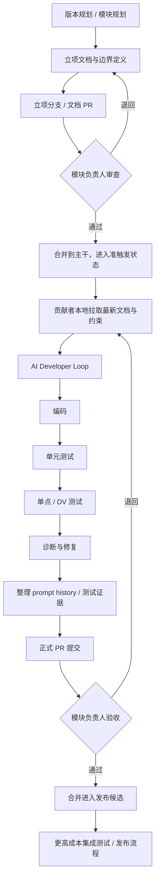
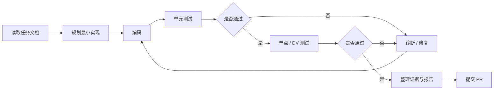

# BuckyOS Harness Enginnering 流程设计


## 1. 文档目标

本文旨在定义 BuckyOS 在 AI Coding 时代的工程流程，明确：

1. **系统应以什么为核心驱动协作**；
2. **人、模块负责人、AI Agent 各自的职责边界**；
3. **从需求立项、文档收敛、AI 开发、测试、PR 到发布的完整流程**；
4. **哪些环节适合自动化，哪些环节必须由人承担责任**；
5. **如何通过规范化文档、测试和提示词管理，降低 AI 开发带来的系统性风险**。

---

## 2. 设计目标与核心判断

### 2.1 总体目标

BuckyOS 的 Harness Engineering 不是要把 GitHub 的工作流自动化，而是要构建一个：

* **以 Git 本身的语义为基础**；
* **以文件系统中的文档、任务、配置为触发面**；
* **以 AI 为执行主体**；
* **以人类负责人为最终发布责任人**；
* **以测试、诊断、验收为闭环**；
* **以开源透明方式公开流程规则**。

### 2.2 核心判断

1. **不能过度依赖 GitHub Workflow / PR API**。
   GitHub 主要是为人设计的界面层，不应成为 AI 工作流的核心控制面。

2. **AI 更适合操作 Git 语义与文件语义，而不是 GitHub 产品语义**。
   例如：

   * 特定分支被创建；
   * 某个目录下新增了文档或任务文件；
   * 某个规范化文件完成并被合并。
     这些都是更适合成为 AI Harness 的触发信号。

3. **GitHub PR 仍然保留，但主要服务于人类治理与责任归属**。
   最终是否合并进入可发布版本，责任属于产品负责人 / 模块负责人，而不是自动系统。

4. **流程的核心不是 Coding Loop，而是 Developer Loop**。
   “写完代码”不等于“完成任务”；完成的最低标准必须包括测试与验证。

5. **人的注意力必须集中在上游、高风险、不可机验的环节**。
   特别是：

   * 需求是否值得做；
   * 文档是否准确；
   * 模块边界是否清楚；
   * 验收标准是否合理；
   * AI 生成的上游知识是否误导后续实现。

---

## 3. 设计原则

### 3.1 Git / 文件系统优先

工作流的第一触发面应是：

* Git 分支语义；
* Git 合并语义；
* 仓库中特定目录的文件变更；
* 规范化文档的新增、更新与批准。

而不是把 AI 的主要行为设计成“创建 PR / 回复评论 / 调用平台 API”。

### 3.2 GitHub 作为“人类操作层”

GitHub 的角色是：

* 展示变更；
* 承载 PR；
* 让负责人执行 approve / reject / merge；
* 对外公开审查记录。

GitHub **不是** AI Harness 的底层操作模型。

### 3.3 文档先于编码

任何功能在进入 AI Coding 之前，都应先完成一轮立项与文档收敛。
AI 写代码前，必须先有能够供 AI 理解的“种子文档”。

### 3.4 模块边界必须清晰

AI 的上下文窗口有限，因此任务切分必须满足：

* 边界清楚；
* 输入输出明确；
* 可使用的轮子、库、约束预先说明；
* 不需要 AI 横向理解过大范围系统。

### 3.5 测试是流程的一部分，不是收尾动作

最低完成标准必须从立项阶段反推定义：

* 单元测试是什么；
* 覆盖哪些行为；
* 什么叫测试通过；
* 是否需要单点环境验证；
* 是否需要多节点集成验证；
* 哪些场景必须人工验收。

### 3.6 组合优于发明

在绝大多数场景下，AI 应被引导：

* 优先组合成熟组件；
* 尽量复用现有库与既有能力；
* 避免现场“发明一套新东西”。

因为组合通常意味着：

* 更少代码；
* 更低风险；
* 更少上下文负担；
* 更少新增依赖；
* 更高可验证性。

### 3.7 公开的 AI 路由规则

项目中的 AI 路由与保底审查逻辑应该公开透明。
它的性质类似 CI：不是秘密武器，而是一套任何贡献者都能预先执行的底线规则。

---

## 4. 角色与职责

### 4.1 版本负责人 / 产品负责人

面向最终发布负责，主要职责包括：

* 制定版本规划；
* 给出核心功能方向与理念；
* 判断某个 PR 是否可以进入可发布版本；
* 对高风险改动保持最终把关责任；
* 推动需求从“想法”变成“可验收任务”。

其工作视角是：**面向发布、面向责任、面向合并决策**。

### 4.2 模块负责人

面向模块质量负责，主要职责包括：

* 理解需求并定义模块级验收标准；
* 判断模块属于成熟适配型、普通功能型，还是创新/核心型；
* 决定该模块允许什么样的开发模式；
* 评估提交的实现是否达到了“及格线”与“可发布线”；
* 对 AI 产物进行有重点的审查，而不是无差别逐行通读。

模块负责人需要具备足够的领域知识：
**在需求确认那一刻，脑子里就应该大致知道什么叫合格结果。**

### 4.3 贡献者

贡献者的直接目标是：

* 完成任务；
* 形成规范化 PR；
* 等待模块负责人合并。

贡献者的主要工作不只是在编码，还包括：

* 参与需求对齐；
* 根据文档进行实现；
* 在本地运行 AI Harness / Agent Loop；
* 整理自己的 prompt history、迭代记录与测试证据；
* 对自己所提交内容承担可解释责任。

### 4.4 AI Agent / Harness

AI Harness 的职责不是“代替负责人拍板”，而是：

* 根据 Git / 文件事件被触发；
* 消化立项文档、模块文档、约束文档；
* 执行本地开发循环；
* 运行测试、收集诊断信息；
* 在约束范围内修改代码；
* 输出过程记录与可审查证据。

---

## 5. 流程总览



---

## 6. 分层流程设计

### 6.1 第一层：发布与治理层

这是产品负责人 / 模块负责人所在的层级。
这个层级直接面向“是否允许进入发布版本”。

这一层中：

* 人是最终责任主体；
* AI 负责执行刚性路由、基础检查、公开规则校验；
* GitHub PR 是必要存在，但它是治理界面，而不是底层控制器。

该层的核心问题不是“AI 能不能写出来”，而是：

* 这个东西该不该做；
* 是否满足版本目标；
* 是否满足模块验收要求；
* 是否值得承担合并后的风险。

### 6.2 第二层：贡献与开发层

这是贡献者与本地 AI Harness 所在的层级。
该层围绕“如何在明确边界内高效完成实现”。

这一层的基本要求是：

* 任务边界清晰；
* 文档充分；
* 工具链标准化；
* 测试要求前置；
* 过程记录可回溯；
* 最终输出可供负责人快速判断。

---

## 7. 立项与需求文档流程

### 7.1 立项是任何 Feature 的第一轮提交

对任何最终要合入版本的 Feature 而言，**第一波提交不应直接是代码，而应是立项与文档**。

推荐做法：

1. 版本负责人提出版本目标；
2. 模块负责人分解出模块任务；
3. 贡献者或负责人通过 Human-Agent Loop 形成需求文档；
4. 以立项分支 / 文档 PR 的形式先合并；
5. 文档被批准后，才进入后续 AI Coding 阶段。

### 7.2 立项阶段关注的是“要不要做”，不是“怎么实现”

该阶段的目标是：

* 确认用户价值；
* 确认功能边界；
* 确认模块拆分；
* 确认依赖关系；
* 确认验收标准；
* 确认测试口径。

本阶段的重点不是实现正确性，而是：
**做的事情是否值得做，是否真是系统所需。**

### 7.3 立项文档建议包含的最小内容

建议至少包含以下内容：

#### 1）背景与目标

* 要解决什么问题；
* 服务哪些用户 / 哪类使用场景；
* 为什么这一版需要做它。

#### 2）功能边界

* 做什么；
* 不做什么；
* 与相邻模块的边界。

#### 3）模块约束

* 可使用的库 / 轮子；
* 禁止使用的方案；
* 与系统现有原则的约束关系。

#### 4）验收标准

* 什么叫完成；
* 最低及格线是什么；
* 哪些结果绝对不接受。

#### 5）测试策略

* 单元测试范围；
* 单点测试方式；
* 集成测试条件；
* 是否需要人工体验确认。

#### 6）风险与高危变更点

* 是否影响核心文档；
* 是否影响共享协议、接口、依赖；
* 是否会对下游 AI 生成造成误导。

### 7.4 为什么文档阶段必须严肃对待

在 AI 开发场景下，上游文档本身就可能成为后续 Coding Agent 的“提示词输入”。
一旦文档错误，它会以非常深的链路影响后续实现。

因此：

* 越靠上游的东西，越需要人脑验证；
* 越不能通过机器直接验证的东西，越要人来把关；
* 需求文档、模块规则、核心约束文档都属于高危源头性资产。

---

## 8. PR 贡献模式声明机制

PR 在顶层治理中是必然存在的，因此所有 PR 必须声明自身的贡献模式。

语音记录中明确展开了三类模式，并提到总数为四类；由于第四类未展开，本文先将其保留为待补定义项。

### 8.1 模式一：纯人工编写

定义：

* 代码逐行由人编写；
* AI 可以辅助测试或检查，但不是主要代码生产者。

要求：

* 正常代码审查；
* 正常测试证据；
* 无需重点提交 prompt history。

### 8.2 模式二：Human-Agent Loop（人为主，AI 为辅）

定义：

* 代码主要由人编写；
* AI 参与局部生成、修改、补全、测试等辅助行为。

要求：

* PR 中必须提交关键 prompt；
* 必须说明主要迭代过程；
* 若同一产物经过多轮提示修订，应提交关键迭代提示词；
* 需要让 reviewer 理解 AI 在哪里参与了内容生成。

### 8.3 模式三：Agent-Human Loop（Agent 为主，人为意图提供者）

定义：

* 人几乎不直接写代码，或只写极少代码；
* 代码主要由 Agent 根据意图和提示词生成。

要求：

* 必须完整提供 prompt history 的核心链路；
* 必须说明任务输入文档来源；
* 必须说明主要迭代与修正轨迹；
* 必须附带测试和验证证据。

### 8.4 模式四：保留项（待定义）

录音中提到“共有四种模式”，但第四种未展开。
建议后续在制度上单独补齐，例如可作为：

* 特殊自动迁移型；
* 纯机械变换型；
* 外部生成物导入型；
* 其他需要区别审查策略的模式。

### 8.5 为什么必须声明模式

模式声明的目的不是“做身份认证”，而是帮助 reviewer 快速判断：

* 应该重点看什么；
* 应该看代码，还是看 prompt 与设计；
* 应该用什么风险模型审查该 PR；
* 哪些模块根本不接受某些模式的提交。

---

## 9. 模块分级与模式匹配

不同模块不应适用同一套开发自由度。

### 9.1 模块分类建议

#### A. 成熟适配型模块

特点：

* 引入已有成熟组件；
* 更多是接入、适配、封装；
* 架构创新性较低。

建议：

* 允许更高比例的 Agent 主导；
* 自动化程度可以更高；
* 审查重点放在适配正确性、依赖控制与测试完整性上。

#### B. 常规功能型模块

特点：

* 业务逻辑明确；
* 边界较清楚；
* 与核心系统有一定耦合。

建议：

* 采用混合模式；
* 对文档和测试要求较高；
* 允许 AI 主导实现，但需更强约束。

#### C. 创新 / 核心 / 高耦合模块

特点：

* 涉及关键机制；
* 与架构原则强相关；
* 需求和验收标准更依赖领域判断。

建议：

* 应以人主导为主；
* AI 更多用于辅助分析、补测试、生成草稿、review 思路；
* 不应默认允许“全自动推进”。

### 9.2 模式与模块属性的匹配

系统应支持基于模块属性进行准入控制：

* 某类模块只允许模式一 / 模式二；
* 某类模块允许模式三，但要求更严格报告；
* 不匹配时可以直接拒绝 PR。

目标是让贡献者**不需要每次重新思考策略**，而是按规则直接匹配。

---

## 10. 准触发机制：从文档合并到 AI Coding 启动

当一个功能的立项文档已经：

* 完成审查；
* 被合并入主干；
* 变成所有贡献者 `git fetch` 后可见的标准输入；

则该功能可以进入“准触发”状态。

这意味着：

* AI Coding 的前置条件已具备；
* 系统已经有足够明确的任务边界；
* 可以在受控前提下启动本地 Agent Loop。

这里不追求“完全自动触发到不可控”，而是强调：
**流程准备就绪后，编码阶段应尽量自动化，但关键门槛仍应有人控制。**

---

## 11. 本地 AI Developer Loop 设计

AI Coding 阶段建议运行在贡献者自己的机器上，由贡献者在本地运行 BuckyOS 的 Harness / Loop。

原因是：

* 保留工程师个人偏好与技巧空间；
* 保持边界控制；
* 减少中心化系统带来的单一失败模式；
* 让贡献者对最终结果承担更直接的责任。

### 11.1 本地 Loop 的输入

本地 Loop 启动时，至少应同步以下信息：

* 系统功能地图；
* 模块地图；
* 核心约束与原则；
* 允许 / 禁止使用的库；
* 任务对应的立项文档；
* 模块验收标准；
* 测试要求；
* 诊断工具与运行脚本说明。

### 11.2 Developer Loop 的最小闭环



### 11.3 完成定义（Definition of Done）

系统必须显式告诉 Agent：

* 什么叫“写完”；
* 什么叫“测试通过”；
* 什么叫“可以提 PR”。

否则 AI 很容易把“生成了一段代码”误当成“完成了任务”。

---

## 12. 分层测试设计

### 12.1 第一层：单元测试

最低要求：

* 对模块内核心逻辑进行验证；
* 作为完成标准的第一关；
* 覆盖范围应在立项阶段就定义清楚。

这里的关键不是“有测试文件”，而是：
**系统必须明确告诉 Agent，哪些行为必须被测到。**

### 12.2 第二层：单点 / DV 测试

在 BuckyOS 这样的分布式系统中，单元测试不够。
因此应要求 Agent 至少在一个典型的单点或 DV 测试环境完成基础验证，例如：

* 服务能完整启动；
* 关键 RPC 可以跑通；
* 数据真实落盘；
* 基础交互流程可被执行。

该层目标是让 Agent 在本地联调阶段尽可能发现问题。

### 12.3 第三层：多节点集成测试

更正式的集成测试通常成本更高，建议采用：

* 人工触发；
* 阶段性推进；
* 在若干功能完成后集中执行。

录音中提到的典型思路包括：

* 通过本地虚拟机集群模拟多节点环境；
* 提供如“两 zone + 一 SN”的典型环境；
* 提供脚本把构建结果部署进干净环境或从确定快照恢复。

这一层不一定完全自动，但必须被纳入制度化流程。

### 12.4 第四层：高成本人工验收

例如：

* 真机环境；
* 用户手机；
* 需要体验判断的交互；
* 更复杂的跨模块集成场景。

这一层尤其适合：

* UI 相关模块；
* 主观体验显著的功能；
* 涉及真实部署状态的验证。

---

## 13. 失败处理与诊断支持

Developer Loop 不仅要定义“怎么测”，还要定义“测挂了怎么办”。

因此组织侧应统一提供：

* 日志采集方法；
* 诊断工具；
* 环境启动 / reset 脚本；
* 常见失败定位方式；
* 标准化调试入口。

这些不应由每个开发者重复造轮子。
Harness 的价值之一，就是把这类组织经验前置为共享基础设施。

---

## 14. PR 提交规范

贡献者在提交 PR 前，不应只是说“我做完了”，而应提交一份可供快速判断的完整包。

建议 PR 至少包含以下内容：

1. **任务来源**
   对应的立项文档 / 模块任务。

2. **贡献模式声明**
   说明采用的是哪一种 Human/Agent 协作方式。

3. **核心 prompt history**
   至少包括关键生成、关键迭代、关键修正提示词。

4. **实现摘要**
   改了哪些文件、做了哪些选择、为什么这么做。

5. **测试证据**
   包括单元测试、DV 测试、集成测试（如有）结果。

6. **依赖变化说明**
   是否新增依赖，为什么必须新增。

7. **风险说明**
   是否改动核心文档、公共协议、底层机制或其他高风险部分。

该规范会反向促使贡献者：

* 更关注提示词管理；
* 更倾向使用可记录、可回放的工作流工具；
* 少用“网页里随手聊几句再复制代码”的方式。

---

## 15. 模块负责人验收规则

模块负责人不应被迫逐行审阅所有 AI 产物，而应重点看“高信息密度指标”。

### 15.1 基础验收项

* 是否符合对应模块允许的贡献模式；
* prompt history 是否完整；
* 单元测试是否通过；
* 单点 / DV 测试是否通过；
* 必要的集成测试是否完成；
* 是否违反模块约束或禁用项。

### 15.2 重点判断维度

#### 1）迭代次数是否异常

如果一个 AI 产物需要很多轮迭代才能勉强通过测试，这通常是风险信号。
说明：

* AI 对任务理解不稳定；
* 代码可能存在补丁化修正；
* 潜在结构问题可能被掩盖。

#### 2）代码量是否过大

在 AI 时代，**更少代码通常优于更多代码**。
原因包括：

* 更短上下文更利于后续维护；
* 改动面更小；
* 理解与验证成本更低。

#### 3）涉及文件数与新增依赖是否过多

如果一个任务触及很多文件，尤其引入很多新依赖，通常意味着：

* AI 注意力被过度分散；
* 实现可能偏离“最小改动”；
* 风险与维护成本显著上升。

#### 4）是否遵守“组合优于发明”

优先判断是否：

* 重用了成熟组件；
* 通过组合完成需求；
* 避免了无必要的自造轮子。

#### 5）测试用例是否只是“形式上存在”

很多测试也可能由 AI 生成，因此负责人需要判断：

* 测试是否覆盖关键行为；
* 是否需要补充新的测试用例；
* 是否真正验证了需求，而不是只验证实现细节。

#### 6）UI / 体验问题是否经过人工判断

若与 UI、交互体验、使用感受有关，则最终好不好用，仍需人来判断。
这类场景不应完全交给自动系统闭环。

---

## 16. 注意力管理：人应该把精力放在哪里

AI Coding 时代，真正稀缺的不是代码生成能力，而是人类注意力。
因此流程必须明确引导核心贡献者把注意力投入到以下地方：

### 16.1 高危源头文档

例如：

* 模块规则；
* 架构原则；
* 核心约束；
* 验收标准；
* 标准测试口径；
* 公共接口说明。

这些文档一旦错误，将持续误导后续 AI 与贡献者。

### 16.2 不可编译、不可测试、不可自动验证的内容

录音中的一个核心理念可以概括为：
**最可怕的不是写错代码，而是生成了“看起来像对的，但无法被编译/测试体系约束”的东西。**

因此，凡是不能被系统性验证的内容，都应优先由人来确认。

### 16.3 高风险变更提醒机制

系统应对以下变更给予显著提醒：

* 核心规则文档变更；
* 公共协议变化；
* 测试标准变化；
* 底层依赖变化；
* 会影响大量下游任务理解的说明变更。

---

## 17. 自动化边界

并不是所有任务都适合走全自动 Agent Loop。

### 17.1 适合高自动化的场景

* Bug 修复；
* 中上层功能；
* 成熟组件适配；
* 边界清楚、测试标准明确的小任务。

### 17.2 不适合全自动推进的场景

* 创新性强的功能；
* 需求本身仍在探索的任务；
* 高耦合核心模块；
* 依赖大量领域知识判断的功能；
* 需要大量主观体验判断的 UI 场景。

这些任务更适合：

* 人主导设计与取舍；
* AI 辅助分析、补文档、补测试、补实现草稿；
* 但不由 AI 单独闭环交付。

---

## 18. 建议的仓库约定（可作为落地起点）

以下内容属于基于录音精神整理出的**建议性约定**，便于流程真正落地。

### 18.1 建议目录

```text
/docs
  /versions           版本规划
  /modules            模块说明与边界
  /proposals          立项文档
  /acceptance         验收标准
  /testing            测试规范
  /architecture       架构原则与核心约束

/harness
  /rules              路由规则、模式规则
  /prompts            Prompt 模板与记录格式
  /scripts            启动、reset、部署、诊断脚本
  /environments       DV / VM 集群环境说明
```

### 18.2 建议的触发来源

* `proposal/*` 分支合并：进入准触发状态；
* `/docs/proposals/` 新文档进入 approved 状态：允许启动任务；
* `/docs/acceptance/` 更新：刷新验收标准；
* `/harness/rules/` 更新：刷新自动路由与审查规则。

### 18.3 建议的 PR 模板字段

* 任务 / 文档链接
* 贡献模式
* Prompt 摘要
* 主要迭代次数
* 涉及文件列表
* 新增依赖
* 测试结果
* 风险说明
* 是否需要人工体验验收

---

## 19. 待补定义事项

根据当前语音记录，以下事项仍建议后续补齐为正式制度：

1. **第四类 PR 贡献模式的精确定义**；
2. **立项分支 / 准触发分支的命名规则**；
3. **Prompt History 的标准存储格式**；
4. **模块分级清单与对应准入矩阵**；
5. **DV 测试与 VM 集群环境的统一接口**；
6. **高危文档变更的告警机制**；
7. **多节点集成测试的人工触发与回报格式**；
8. **各类模块的默认“完成定义”模板**。

---

## 20. 总结

BuckyOS Harness Engineering 的核心不是“让 AI 自动写代码”，而是建立一套新的工程秩序：

* **底层由 Git 与文件系统驱动**；
* **上层由 PR 承载人类责任**；
* **中间由文档、测试、诊断构成可执行闭环**；
* **人的精力集中在需求、边界、验收与高危源头**；
* **AI 负责在清楚规则下执行尽可能多的开发工作**。

这套流程本质上是在回答三个问题：

1. **AI 该依据什么来工作？**
   —— 依据 Git 语义、文件语义、立项文档、模块规则和测试标准。

2. **人该把精力花在哪里？**
   —— 花在价值判断、边界定义、验收标准、高危文档和最终发布责任上。

3. **什么才算完成？**
   —— 不是代码生成完成，而是 Developer Loop 完成：实现、测试、诊断、证据、验收全部闭环。

