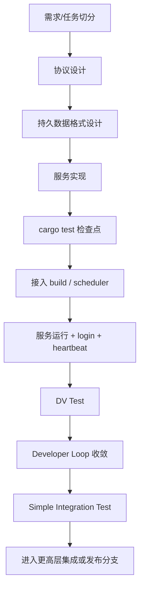

# BuckyOS Harness Engineering Spec（系统服务 · 无 UI）

**Status:** Draft  
**Audience:** 内核团队、模块负责人、贡献者、AI Harness / Agent  
**Language:** zh-CN  
**Scope:** 本文仅适用于**无专属系统服务界面（无 UI）**的后端系统服务：标准模板、检查点、自动化边界与交付要求。若任务包含系统服务相关 UI，见同目录下 `System Service UI Dev Loop.md`。目标是把该类服务的开发流程收敛为可被人类与 AI 共同执行的工程规范；在既有 Harness Engineering 流程目标与职责划分之上展开。

---

## 1. 规范目标

本规范回答五个问题：

1. **系统服务任务该如何被拆解与分类。**
2. **一个系统服务在设计、实现、测试、接入、集成过程中必须产出哪些文档与代码资产。**
3. **哪些检查点必须先通过，才能进入更高成本的阶段。**
4. **AI Harness 在各阶段应该做什么，不能做什么。**
5. **什么状态才算一个系统服务真正完成。**


---

## 2. 术语与规范级别

本文使用以下规范级别词汇：

- **MUST / 必须**：不满足则不得进入下一阶段。
- **SHOULD / 应当**：默认要求，若偏离必须说明理由。
- **MAY / 可以**：可选手段，由模块负责人或实现者决定。

关键术语：

- **协议文档（Protocol Spec）**：系统服务对外暴露的 KRPC 接口说明。
- **持久数据格式文档（Durable Data Schema）**：会跨安装、跨升级保留的数据格式说明。
- **Service Spec**：调度器用于实例化系统服务的服务描述。
- **Settings Schema**：调度器 / SystemConfig 可见的配置模式定义。
- **DV Test**：单点真实环境验证，要求走真实身份、网关、SDK、服务链路。
- **Developer Loop**：开发-测试-观测-修复循环。
- **Simple Integration Test**：CI 中基于安装包环境的轻量集成测试。

---

## 3. 系统服务模板总览

一个系统服务的标准开发路径如下：


---

## 4. 任务分类与适用范围

### 4.1 本规范适用的任务

当一个任务满足以下特征、且**不包含**需单独交付的系统服务 UI 时，默认适用本规范：

- 需要新增或重构一个系统服务；
- 需要定义新的 KRPC 协议；
- 需要进入调度系统并在真实节点上运行；
- 需要新增长期保留数据格式；
- 需要被 SDK、网关、身份系统、安装包、调度器共同接入；

### 4.2 不直接适用的任务

以下任务不直接适用本文全部流程，但可复用其中的局部 Skill：

- 纯文档任务；
- 纯 SDK 辅助改动；
- 纯 Bugfix 且不引入新服务；
- 不进入调度系统的本地工具。

---

## 5. 角色与责任

### 5.1 版本负责人 / 产品负责人

MUST：

- 决定该服务是否进入版本规划；
- 在高成本集成前给出产品体验反馈；
- 对最终是否合入主干或发布分支负责。

### 5.2 模块负责人

MUST：

- 判断任务是否属于系统服务模板；
- 审核协议文档、持久数据格式文档、Settings Schema；
- 审核是否满足测试与接入检查点；
- 决定是否允许继续进入更高成本阶段。

### 5.3 贡献者

MUST：

- 按模板产出规范文档、代码、测试脚本与证据；
- 保证所有阶段性检查点可复现；
- 对所提交 Prompt / Skill 使用过程承担可解释责任。

### 5.4 AI Harness / Agent

MUST：

- 按已批准文档与模板执行；
- 在 Developer Loop 中自动驱动测试、日志分析、重部署与修复；
- 只在允许范围内修改代码、配置、测试与自动化脚本（不含 UI 实现）；
- 不得越过未冻结的架构边界擅自重写系统设计。

---

## 6. 分阶段里程碑与 PR 模型

系统服务建议采用多阶段 PR，而不是一次性大 PR。

### 6.1 PR-1：设计 PR

MUST 包含：

- 协议文档；
- 持久数据格式文档；
- 初版任务边界说明；


该 PR 的目标是：**冻结边界，而不是写完代码。**

### 6.2 PR-2：实现与本地测试 PR

MUST 包含：

- 服务实现主体；
- `cargo test` 通过；
- 关键数据解析、协议解析、核心逻辑单测。

若任务同时包含系统服务 UI，界面侧 PR 与里程碑见 `System Service UI Dev Loop.md`，不在本文 PR 分期内。

### 6.3 PR-3：运行接入 PR

MUST 表明：

- 服务已进入系统构建链路；
- 可被 scheduler 识别并实例化；
- login、heartbeat、日志接入正常；
- DV Test 已可在本地环境执行。

### 6.4 PR-4：集成与 SDK PR

MUST 包含：

- TypeScript SDK 正式修改；
- 基于安装包环境的测试证据；
- Simple Integration Test 通过；


---

## 7. 系统服务模板

## 7.1 阶段一：协议设计

### 7.1.1 目标

协议定义系统服务的外部边界。协议一旦进入实现阶段，原则上不应再频繁变动。

### 7.1.2 协议文档必须包含

- 服务边界：做什么，不做什么；
- KRPC 方法列表；
- 输入 / 输出结构；
- 错误码语义；
- 幂等性与副作用说明；
- 状态流转（若有）；
- SDK 暴露方式（若需要）。

### 7.1.3 强规则

- 协议文档 **MUST** 先于实现被提交。
- 协议一旦进入实现阶段，后续变更 **SHOULD** 视为高风险事件。
- 协议文档变更 **MUST** 自动触发兼容性检查。

---

## 7.2 阶段二：持久数据格式设计

### 7.2.1 目标

在代码实现前定义长期保存、会跨安装保留的数据格式。

### 7.2.2 数据分类

系统服务数据分两类：

1. **持久数据（Durable Data）**
   - 位于服务 data 区；
   - 安装 / 覆盖安装不会被卸载；
   - 一旦格式变更，必须考虑兼容或迁移。

2. **可丢弃数据（Disposable Data）**
   - 如 local cache、中间缓存；
   - 可在升级时清空；
   - 不必为旧版本兼容背负成本。

### 7.2.3 持久数据格式文档必须包含

- 数据结构定义；
- 存储位置；
- version / schema version；
- 升级兼容策略；
- 不兼容时的迁移或重建方式；
- 哪些字段可扩展、哪些不得改语义。

### 7.2.4 强规则

- 服务代码进入实现前，**MUST** 已有持久数据格式文档。
- 持久数据格式变更 **MUST** 触发向前兼容性检查。
- 新服务在未上线阶段若决定重置数据，**MUST** 明确标记“无需兼容”的开发模式。

---

## 7.3 阶段三：实现阶段的基础设施约束

实现阶段的原则是：**把协议与数据设计映射到系统已有基础设施上，而不是重新发明一套存储与访问机制。**

### 7.3.1 结构化 / 非结构化数据分流

#### 非结构化数据

SHOULD：

- 优先使用对象化管理；
- 直接管理 object / object id；
- 避免围绕传统文件系统路径设计核心内部数据。

#### 结构化数据

MUST：

- 使用系统提供的 RDB instance；
- 不直接绑定具体后端（sqlite / PostgreSQL 等）；
- 允许平台后续替换 backend，而不影响服务语义。

### 7.3.2 平台治理收益

统一使用 RDB instance 的目的不仅是方便开发，更是为了：

- 统一数据安全跟踪；
- 统一备份 / 恢复；
- 统一系统治理。

### 7.3.3 例外规则

若某服务必须直接依赖 filesystem 作为核心数据模型，**MUST** 在文档中说明理由，并作为高风险项进入审查。

---

## 7.4 阶段四：长任务模式

当业务逻辑涉及长时间执行、可恢复或跨模块协同时，不应写成普通同步逻辑，而应进入任务执行者模式。

### 7.4.1 自己实现长任务

MUST 使用以下组合：

- `task manager`
- `keymessage queue`
- 任务执行者模式（Task Executor Pattern）

目标是支持：

- 长时间运行；
- 断点恢复；
- 分布式状态管理；
- 跨模块协作；
- 外部统一观察。

### 7.4.2 调用别人的长任务

若其他组件返回 `task_id`，调用方：

- **MUST NOT** 以高频 timer 轮询为主流程；
- **MUST** 通过 `keyevent` 等待状态变化；
- **SHOULD** 配置 timeout 作为保底，而不是把轮询作为主路径。

### 7.4.3 推荐模式

```text
发起长任务请求
→ 获取 task_id
→ 定位对应 keyevent 路径
→ 订阅状态变化
→ timeout 保底
→ 状态完成后继续后续逻辑
```

---

## 7.5 阶段五：cargo test 检查点

在进入任何高成本运行验证前，系统服务 **MUST** 先通过 `cargo test`。

### 7.5.1 单元测试覆盖来源

单元测试不是拍脑袋写出来的，而是由两类上游文档反推：

- 协议文档；
- 持久数据格式文档。

### 7.5.2 单元测试必须优先覆盖

- 协议解析；
- 输入输出编解码；
- 边界条件；
- 错误码行为；
- 数据格式读写；
- 可本地验证的业务逻辑；
- 能在本地发现的明显错误。

### 7.5.3 检查点定义

未通过 `cargo test` 的实现，**MUST NOT** 进入 DV Test。

---

## 7.6 阶段六：接入 BuckyOS build 与 scheduler

这是系统服务第一次真正进入操作系统运行模型的阶段，也是常见痛点。

### 7.6.1 构建链路要求

服务 **MUST**：

- 被加入 BuckyOS build 目标；
- 通过 `buckyos build`（而非仅 `cargo build`）构建；
- 在 `rootfs/bin` 中看到编译结果；
- 确保产物会被安装包带入系统。

若二进制未进入 `rootfs/bin`，则系统安装不会包含该服务。

### 7.6.2 Service Spec 接入

调度器实例化服务的核心流程是：

```text
发现 Service Spec
→ 读取默认 settings
→ 构建 instance
→ 下发 replica 到 node
→ 服务启动
```

因此服务 **MUST** 提供：

- Service Spec；
- 默认 settings；
- 资源需求；
- SystemConfig 可见的 Settings Schema。

### 7.6.3 资源配置规则

资源需求 **MUST** 明确写入 spec，例如：

- CPU / memory；
- GPU；
- 其他硬件依赖。

资源配置错误会导致 instance 无法创建，或错误地被调度到不满足条件的节点。

### 7.6.4 Settings 规则

Settings 一旦发布：

- **SHOULD** 只增不改；
- **MUST** 有默认值；
- **SHOULD** 采用最小暴露原则；
- **MUST** 文档化其 schema、含义、默认值与兼容性。

---

## 7.7 阶段七：服务启动、日志、身份与心跳

服务被 scheduler 拉起后，必须出现一组标准运行信号。

### 7.7.1 标准启动信号

系统服务成功接入的最小里程碑包括：

- 日志系统初始化成功；
- 日志被分布式系统捕获；
- Service SDK（kAPI）初始化成功；
- 与 scheduler 建立 heartbeat；
- 服务未被标记为 unavailable。

### 7.7.2 login 规则

服务启动后 **MUST** 调用 login，并：

- 与 Wallet Hub 建立合法服务身份；
- 启动双 token / 定期换 token 机制；
- 获得访问其他系统服务的凭证。

未 login 成功的服务不应被视为合格系统服务。

### 7.7.3 运行接入阶段的 Done

满足以下条件后，可视为完成运行接入阶段：

- 服务进程成功启动；
- scheduler 能看到 instance；
- heartbeat 正常；
- login 成功；
- 服务未被标记 unavailable。

---

## 7.8 阶段八：DV Test（真实链路单点验证）

DV Test 的目标不是验证函数调用，而是验证真实系统行为。

### 7.8.1 为什么必须使用 TypeScript

DV Test **MUST** 使用 TypeScript，原因是：

- 强制验证 Web / SDK 生态是否准备就绪；
- 测试真实客户端调用路径；
- 避免仅凭 Rust 内部调用自证正确。

### 7.8.2 真实请求链路

DV Test 必须走以下真实路径：

```text
TS Script
→ 获取 session token
→ 调用 Web SDK
→ 请求进入 Gateway
→ 权限检测
→ 路由到 Service
→ Service 执行
```

请求 **MUST NOT** 直接绕过网关直打服务进程。

### 7.8.3 TS SDK 要求

- 服务对外接口 **MUST** 有 TypeScript SDK。
- 在正式发版前，可本地 patch SDK 以支持测试。
- 集成前，SDK 修改 **MUST** 被提交到正式版本链路。

### 7.8.4 DV Test 的 Done

满足以下条件后，可视为通过 DV Test：

- TS SDK 可用；
- 测试脚本能运行；
- 能获取 session token；
- 请求通过 Gateway；
- 服务响应正确；
- 核心接口逻辑正确。

---

## 7.9 阶段九：Developer Loop

一旦服务已能在单点环境中启动，后续开发应进入自动化 Developer Loop。

### 7.9.1 Loop 目标

让 AI Harness 在真实环境中反复执行：

- 运行测试；
- 观测日志；
- 修改代码；
- 重建与重部署；
- 再验证。

### 7.9.2 标准 Loop

```text
run_test
→ 判断接口结果与状态是否正确
→ 若错误则读日志
→ 定位问题
→ 修改代码
→ stop.py
→ buckyos build
→ start.py
→ 重新测试
```

### 7.9.3 数据格式变更模式

默认 `start.py` 走覆盖安装：

- 数据不删除；
- 重启较快。

若当前仍处于“新服务尚未上线、无需兼容”的模式，并且修复涉及数据格式重建，则 **SHOULD** 使用：

```text
start.py --all
```

其含义是：

- 重新安装；
- 清理旧数据；
- 不承担兼容成本；
- 但耗时更长。

### 7.9.4 Loop 中 AI 必须知道的事情

AI Harness 必须显式知道：

1. 什么算测试通过；
2. 日志在哪里看；
3. 哪些日志能定位当前问题；
4. 何时只做覆盖安装；
5. 何时必须全量重装；
6. 当前任务是否需要兼容旧数据。

### 7.9.5 阶段 Done

满足以下条件，可认为本地 Developer Loop 收敛：

- 关键业务测试通过；
- 状态数据符合预期；
- 无关键错误日志；
- 服务稳定运行。

---

## 7.10 阶段十：Simple Integration Test（CI 级集成测试）

当本地 Developer Loop 完成后，工程师侧的大部分工作已经完成，随后进入基于安装包环境的轻量集成测试。

### 7.10.1 进入条件

- 服务已可被 scheduler 启动；
- 本地 DV Test 完成；
- 若有 SDK 改动，已准备正式提交；

### 7.10.2 CI 流程

Simple Integration Test 建议按如下顺序执行：

```text
cargo test
→ 多平台构建（例如 6 个目标平台）
→ 打安装包
→ 用生产流程安装
→ 激活流程
→ 验证主路径可用性
→ 切换到测试身份/配置
→ 在安装环境中跑 DV Test
```

### 7.10.3 本地 DV 与 CI DV 的差别

- 本地 DV：使用开发机产物；
- CI DV：使用**安装包**进入的生产式环境。

CI 测的是**发布产物**，不是开发产物。

### 7.10.4 通过条件

Simple Integration Test 通过意味着：

- 安装包已正确携带该服务；
- 激活流程未被新功能破坏；
- DV Test 在安装环境中通过；
- 系统主路径无明显回归。

---


## 8. 自动化、文档与触发规则

### 8.1 必须文档化的资产

对于系统服务，至少必须维护以下文档：

- 协议文档；
- 持久数据格式文档；
- Service Spec / Settings Schema 文档；


### 8.2 触发规则

以下变更应自动触发额外检查：

1. **协议文档变更**
   - 触发协议兼容性检查。

2. **持久数据格式文档变更**
   - 触发数据兼容性检查。

3. **Settings Schema 变更**
   - 触发配置兼容性与实例化验证。

---

## 9. Skill 列表

为了让 AI Harness 真正可执行，本流程涉及的开发任务可使用下列 Skill：

1. `design-krpc-protocol` OK 
2. `design-durable-data-schema`
3. `implement-system-service`
4. `buckyos-intergate-service`
5. `service-dv-test`


每个 Skill 建议包含：

- 适用场景；
- 输入；
- 输出；
- 操作步骤；
- 常见失败模式；
- 通过标准。

---


## Definition of Done

## 系统服务 Done（无 UI）

一个无 UI 系统服务只有在同时满足以下条件时，才算真正完成：

- 协议文档已批准；
- 持久数据格式文档已批准；
- 服务实现完成；
- `cargo test` 通过；
- 服务能被 scheduler 正确拉起；
- login、heartbeat、日志接入正常；
- TS SDK 可用；
- DV Test 通过；
- Developer Loop 收敛；
- 安装包环境下的 Simple Integration Test 通过。


---

## 10. 核心判断总结

1. **系统服务不是一段代码，而是一组文档、配置、构建、调度、身份、测试与集成规则共同定义的系统实体。**
2. **协议与持久数据格式是最先冻结的边界；越晚发现其问题，代价越高。**
3. **Developer Loop 的核心不是编码，而是“测试-观测-修复”的自动化闭环。**
4. **只有当安装包环境、调度器、身份系统、网关、SDK 全部共同工作时，一个无 UI 系统服务才算真正完成。**

---

## 11. 附：建议的阶段性检查清单

### 11.1 设计阶段 Checklist

- [ ] 协议文档存在
- [ ] 持久数据格式文档存在
- [ ] Service 边界清楚
- [ ] 兼容风险已标出

### 11.2 实现阶段 Checklist

- [ ] 结构化数据走 RDB instance
- [ ] 非结构化数据走 object 管理
- [ ] 长任务使用 task manager / keymessage queue / keyevent
- [ ] `cargo test` 通过

### 11.3 接入阶段 Checklist

- [ ] 进入 `buckyos build`
- [ ] 产物进入 `rootfs/bin`
- [ ] spec / settings / SystemConfig 正确
- [ ] scheduler 能创建 instance
- [ ] login / heartbeat 正常

### 11.4 DV Test Checklist

- [ ] TS SDK 可用
- [ ] session token 获取成功
- [ ] 请求经过 gateway
- [ ] 核心接口行为正确
- [ ] 状态修改符合预期


### 11.5 集成阶段 Checklist

- [ ] 安装包正确包含服务
- [ ] 激活流程通过
- [ ] 安装环境 DV Test 通过
- [ ] DataModel 性能测试通过（若适用）
- [ ] 系统主路径无回归

---


