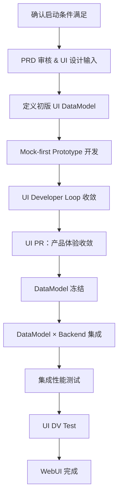

# BuckyOS System Service UI Dev Loop

**Status:** Draft  
**Audience:** 模块负责人、贡献者、AI Harness / Agent  
**Language:** zh-CN  
**Scope:** 本文定义在 BuckyOS 中为**已有系统服务**添加 WebUI 的标准工作循环。其前提是后端服务已完成实现、`cargo test` 通过、KRPC 接口已稳定，可供前端并行推进。本文不覆盖系统服务后端本身的开发规范。

---

## 1. 规范目标

本规范回答五个问题：

1. **何时可以启动 UI 开发。**
2. **UI 任务从 PRD 到集成的标准推进路径是什么。**
3. **各阶段必须产出哪些文档与代码资产。**
4. **AI Harness 在各阶段应该做什么，不能做什么。**
5. **什么状态才算 WebUI 真正完成。**

---

## 2. 术语与规范级别

本文使用以下规范级别词汇：

- **MUST / 必须**：不满足则不得进入下一阶段。
- **SHOULD / 应当**：默认要求，若偏离必须说明理由。
- **MAY / 可以**：可选手段，由模块负责人或实现者决定。

关键术语：

- **KRPC**：系统服务对外暴露的 RPC 接口协议。
- **DataModel（UI）**：UI 层消费的稳定数据模型，不等同于 KRPC 原始模型。
- **Mock-first**：第一阶段 UI 完全基于 Mock Data 运行，不依赖真实后端。
- **UI Developer Loop**：启动 dev server → Playwright 自动操作 → 截图判断 → 修改代码 → 循环。
- **DV Test（UI）**：在真实系统链路上验证 UI 可正确消费后端数据的端到端测试。
- **DataModel 冻结**：UI DataModel 结构确定，之后变更视为高影响事件。

---

## 3. 启动条件

**UI 开发 MUST 在以下条件全部满足后才能启动：**

- 依赖的系统服务的 KRPC 接口已较为稳定；
- 后端 `cargo test` 已通过；
- 服务能被 scheduler 拉起并正常运行（login、heartbeat 正常）；
- 后端开发者确认当前接口可供前端并行消费；
- PRD 或最小交互草图已存在（可在本阶段启动时同步补全）。

若上述条件尚未满足，UI 工作 **MUST NOT** 启动，以避免接口频繁变化导致前端返工。

---

## 4. 整体工作流程



---

## 5. 阶段一：PRD 与 UI 设计输入

### 5.1 PRD 是前置输入

UI 开发 **MUST** 以 PRD 为起点。PRD 至少包括：

- 用户任务与使用场景；
- 主要页面与交互流程；
- 关键状态与反馈（成功、失败、加载、空态）；
- 成功路径与失败路径。

### 5.2 UI 设计提示（UI Prompt）

在启动编码前，**SHOULD** 基于 PRD 产出一份 UI 设计提示（UI Design Prompt），用于：

- 描述页面布局、组件选型、视觉风格方向；
- 为 AI Harness 提供可执行的 UI 实现输入；
- 作为 Prototype 阶段的验收基准。

### 5.3 UI 系统规范约束

UI **MUST** 遵守系统级规范：

- 桌面浏览器与移动浏览器双端可用；
- 使用系统组件库；
- 支持深浅色主题切换；
- 支持国际化（默认8种语言)；
- 在整体桌面风格内一致呈现，而不是把每个服务当成独立 UI 产品。

---

## 6. 阶段二：初版 UI DataModel 定义

### 6.1 DataModel 的地位

对于 UI 模块，真正的稳定边界通常不是 KRPC 原始结构，而是 **UI DataModel**。

```text
KRPC Model
→ Client Model
→ UI DataModel
→ UI Rendering
```

### 6.2 为什么要单独定义

UI 展示方式决定数据组织方式，例如：

- 分页 vs 无限滚动；
- 列表 vs 卡片；
- 简化字段 vs 详细字段；
- 进度条 vs 富信息条目。

因此 UI 不应直接绑定后端协议对象。

### 6.3 DataModel 文档必须包含

- 数据结构定义（推荐 TypeScript interface）；
- 字段语义说明；
- 聚合与分页方式；
- loading / empty / error / progress 等状态定义；
- 哪些字段是稳定边界，哪些是实现细节。

### 6.4 第一版 DataModel 的性质

第一版 DataModel **由 UI 驱动定义**：

- 站在产品与页面实现角度出发；
- 追求易于实现 UI；
- 暂不充分考虑后端性能与聚合成本（此为后续集成阶段的工作）。

---

## 7. 阶段三：Mock-first Prototype 开发

### 7.1 原则：Mock-first、晚集成

UI **SHOULD** 尽可能晚接入真实后端。第一阶段必须确保 UI 能在完全独立的环境中运行，不依赖任何系统集成。

### 7.2 独立运行要求

UI **MUST** 满足执行以下命令后即可启动：

```text
pnpm run dev
```

并且：

- 不依赖真实服务进程；
- 可独立演示所有主要交互流程；
- 支持至少两种视图模式：
  - 独立页面模式；
  - 模拟桌面窗口模式。

### 7.3 Mock Data 规则

Mock Data **MUST**：

- 覆盖主要用户路径；
- 支撑所有关键组件状态（正常态、空态、错误态、加载态、进度态）；
- 能让 Playwright 自动跑完整流程而不卡住。

### 7.4 UI Developer Loop

Prototype 开发阶段的核心是自动化 Loop，AI Harness **MUST** 能独立驱动：

```text
pnpm run dev（后台运行）
→ Playwright 自动操作 UI
→ 截图
→ 对照 PRD / UI Prompt 判断是否达标, 产品体验是否合理
→ 发现问题
→ 修改代码
→ 热重载后重新截图验证
→ 循环直至收敛
```

AI Harness **MUST NOT** 频繁依赖人工盯图来完成细节修正，基本的布局、状态、组件问题应在 Loop 中自动解决。

### 7.5 Prototype 阶段 Done

满足以下条件，可视为 Prototype 阶段完成：

- `pnpm run dev` 可正常启动；
- 主要用户流程可在 Mock 环境下完整走通；
- 关键状态（空态、错误态、加载态）均有正确呈现；
- Playwright 自动测试可跑通；
- 初版 UI DataModel 已文档化。

---

## 8. 阶段四：UI PR 与产品体验收敛

### 8.1 核心原则

**所有产品体验问题，应尽量在 UI PR 阶段提出并解决。**

原因：

- 这是 UI 改动成本最低的阶段；
- 若拖到系统集成后再提，成本大幅上升；
- 对开源团队而言，这是最低成本的产品体验改进窗口。

### 8.2 责任前移

版本负责人 / 产品负责人 **MUST** 在该 PR 阶段深度体验并提出反馈。若体验问题被拖延到后续高成本阶段，其额外成本应被视为责任前移失败。

### 8.3 此阶段典型工作

- 版本负责人运行 `pnpm run dev` 体验全流程；
- 提出布局、交互、文案、状态展示等体验问题；
- AI Harness 在 Developer Loop 中快速修正；
- 经 1~2 轮迭代后，体验达到可接受标准。

### 8.4 DataModel 冻结

经产品体验迭代收敛后，UI DataModel **SHOULD** 冻结：

- 冻结后可快速回退到 `pnpm run dev` 环境做独立修改；
- 任何修改 DataModel 的行为都被视为高影响改动；
- DataModel 变更必须触发更大范围的测试与审查。

---

## 9. 阶段五：DataModel × Backend 集成

### 9.1 集成的本质

UI 集成的核心不是"把接口接上"，而是：

**让 UI DataModel 在真实 KRPC 与真实数据条件下成立。**

### 9.2 DataModel 的两轮演化

DataModel 在集成阶段通常经历第二轮演化：

1. **第一版（UI 驱动，来自 Prototype 阶段）**
   - 站在产品与页面实现角度定义；
   - 追求易实现 UI；
   - 未充分考虑后端性能与聚合成本。

2. **第二版（系统驱动，来自集成阶段）**
   - 前后端共同收敛；
   - 考虑缓存、分页、聚合、RPC 粒度、读写放大；
   - 作为最终集成形态。

### 9.3 常见风险

集成阶段必须重点关注：

- 多服务数据依赖；
- 读放大；
- 写放大；
- 分页与大列表性能；
- 聚合模型是否可被后端高效满足。

### 9.4 性能测试要求

该阶段 **MUST** 编写独立 TypeScript 测试脚本，用真实或近真实系统构造 DataModel，验证：

- 1 条、10 条、1000 条、1000000 条数据；
- 第 1 页、第 70 页、随机页访问；
- 大列表、Map、聚合结构；
- 预估 RPC 次数与延迟；
- 大规模数据下的 UI 可接受性。

### 9.5 谁来做、谁来审

- **AI**：实现 DataModel 映射、编写测试脚本、执行性能测试；
- **人**：重点 review 性能结论与 tradeoff。

### 9.6 双向修正

此阶段允许：

- 向上修正 UI DataModel；
- 向下修正 KRPC 设计；
- 在前后端之间围绕性能指标反复 tradeoff。

该阶段完成后，后续改动大多只剩细节修补。

### 9.7 集成阶段 Done

满足以下条件，可视为集成阶段完成：

- UI DataModel 能在真实后端条件下被正确构造；
- 性能测试通过；
- 无明显读 / 写放大问题；
- 前后端对最终模型达成一致；
- 后续只剩细节修补，不再做大结构返工。

---

## 10. 阶段六：UI DV Test

### 10.1 目标

验证 UI 在真实系统链路（真实身份、Gateway、SDK、服务）中可正确运行。

### 10.2 DV Test 链路

```text
浏览器 / Playwright
→ 获取 session token
→ 调用 Web SDK
→ 请求进入 Gateway
→ 权限检测
→ 路由到 Service
→ UI 正确渲染结果
```

### 10.3 DV Test Done

满足以下条件后，可视为 UI DV Test 通过：

- UI 在真实后端环境下可正常启动；
- 主要用户流程走通；
- 数据展示与预期一致；
- 无关键错误（console error、接口失败、渲染异常）；
- Playwright 核心用例通过。

---

## 11. 角色与责任

### 11.1 版本负责人 / 产品负责人

MUST：

- 在高成本集成前（UI PR 阶段）给出产品体验反馈；
- 对 UI PR 阶段的体验性修改承担前移责任；
- 对最终是否合入主干或发布分支负责。

### 11.2 模块负责人

MUST：

- 审核 PRD、UI DataModel 文档；
- 确认启动条件满足后才允许 UI 工作启动；
- 决定是否允许进入集成阶段。

### 11.3 贡献者

MUST：

- 按模板产出规范文档（PRD、DataModel）、代码、测试脚本与证据；
- 保证所有阶段性检查点可复现；
- 对所提交 Prompt / Skill 使用过程承担可解释责任。

### 11.4 AI Harness / Agent

MUST：

- 按已批准的 PRD 与 DataModel 文档执行；
- 在 UI Developer Loop 中自动驱动截图、判断、修改与验证；
- 只在 UI 层（组件、DataModel 映射、测试脚本）范围内修改代码；
- 不得擅自修改 KRPC 定义或后端服务逻辑。

MAY：

- 在集成阶段提出 DataModel 调整建议，但 **MUST** 经人工确认后才执行。

---

## 12. 必须文档化的资产

为完成一次 WebUI 添加任务，至少需要维护以下文档：

- PRD（用户场景、页面、状态、成功/失败路径）；
- UI Design Prompt（布局、组件、风格方向）；
- UI DataModel 文档（TS interface + 字段语义 + 状态定义）；
- 关键 Mock Data 说明；
- 性能测试脚本与结论（集成阶段产出）。

---

## 13. 触发规则

以下变更应自动触发额外检查：

1. **UI DataModel 相关 TS 文件变更**
   - 触发更大范围 UI 测试与集成测试；
   - 标记为高影响 PR。

2. **PRD 变更**
   - 触发 DataModel 审查（是否需要同步更新）。

3. **KRPC 接口变更（后端侧）**
   - 触发 DataModel 兼容性审查；
   - 可能需要重走集成阶段。

---

## 14. 建议的 Skill 列表

为了让 AI Harness 真正可执行，建议将以下 Skill 作为 WebUI 任务的最小集合：

1. `prd-to-ui-design-prompt`
2. `webui-prototype`
   包含下面3组
   - `define_ui_datamodel.md`
   - `ui_prototype.md`
   - `ui_developer_loop_playwright.md`

3. `integrate-ui-datamodel-with-backend`
4. `bechmark-ui-datamodel`
5. `ui-dv-test`

每个 Skill 建议包含：

- 适用场景；
- 输入；
- 输出；
- 操作步骤；
- 常见失败模式；
- 通过标准。

---

## 15. Definition of Done

一个为已有系统服务添加 WebUI 的任务，只有在同时满足以下条件时才算完成：

- PRD 完整且已审核；
- UI Design Prompt 已产出；
- UI DataModel 文档已产出且已冻结；
- UI 可在 `pnpm run dev` 下独立运行；
- Mock Data 覆盖主要流程及关键状态；
- Playwright 自动测试通过；
- UI PR 阶段已完成产品体验收敛；
- DataModel × Backend 集成完成；
- 集成性能测试通过；
- UI DV Test 通过（真实链路可用）。

---

## 16. 核心判断总结

1. **UI 开发不能在后端接口稳定前启动，否则前端会跟着后端接口的变化不断返工。**
2. **Mock-first 是降低集成成本的核心手段，而不是一个可选步骤。**
3. **UI DataModel 是前后端协作的真正边界，不是 KRPC 接口本身。**
4. **所有产品体验问题必须在 UI PR 阶段前移解决，拖到集成后代价翻倍。**
5. **集成阶段的本质是在真实系统约束下让 DataModel 成立，而不是简单地把接口接上。**
6. **UI Developer Loop 的核心是 Playwright 自动化，而不是人工盯图。**

---

## 17. 阶段性检查清单

### 17.1 启动条件 Checklist

- [ ] 后端 KRPC 接口已稳定
- [ ] 后端 `cargo test` 通过
- [ ] 服务能被 scheduler 拉起并正常运行
- [ ] PRD 或最小草图已存在

### 17.2 Prototype 阶段 Checklist

- [ ] PRD 完整
- [ ] UI Design Prompt 已产出
- [ ] 初版 UI DataModel 已文档化
- [ ] `pnpm run dev` 可独立启动
- [ ] Mock Data 覆盖主要流程
- [ ] 关键状态（空态、错误态、加载态）均已呈现
- [ ] Playwright 可自动跑通

### 17.3 UI PR 阶段 Checklist

- [ ] 版本负责人已在 Mock 环境深度体验
- [ ] 产品体验反馈已提出并处理
- [ ] UI DataModel 已冻结

### 17.4 集成阶段 Checklist

- [ ] DataModel 在真实后端下可被正确构造
- [ ] 性能测试脚本已编写并执行
- [ ] 无明显读 / 写放大问题
- [ ] 前后端对最终模型达成一致

### 17.5 UI DV Test Checklist

- [ ] UI 在真实链路下可正常启动
- [ ] 主要用户流程走通
- [ ] 无关键 console error 或接口失败
- [ ] Playwright 核心用例通过
