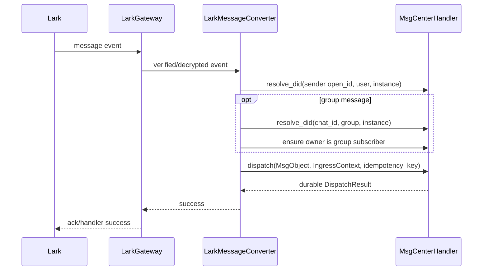

# Lark MsgTunnel 设计（基于 beta 2.2 MsgCenter）

> 本文以当前 `src/frame/msg_center/` 实现为事实源，描述飞书（Feishu）/ Lark 接入方案。
> 通用消息语义仍以 `doc/message_hub/Message Center.md` 和
> `doc/message_hub/Message Tunnel Design.md` 为准；本文只补充 Lark 的实现边界、字段映射和落地顺序。

## 0. 结论

Lark 接入应实现为 msg-center 进程内的 `LarkTunnel`：

```text
LarkTunnel = ingress producer + DeliveryExecutor
```

- 入站：接收 Lark 事件，构造 `MsgObject + IngressContext + idempotency_key`，经
  `MsgCenterHandler::handle_dispatch` 写入 MessageCenter。
- 出站：实现 `DeliveryExecutor`，由 msg-center 的 delivery pump 投递完整
  `DeliveryRecordWithObject`，返回 `DeliveryReportResult`。
- 身份：Lark 用户和群使用 local shadow endpoint DID；不把 ContactMgr 的联系人
  合并结果改写进 `MsgObject.from/to`。
- 首版范围：企业自建应用、单租户、Bot、一个 tunnel 实例对应一个 Lark 应用和一个
  owner DID；文本私聊与群内 `@bot` 优先。
- 接入模式：优先长连接，避免要求 Personal Server 暴露 webhook；若 Rust 侧没有合适的
  长连接实现，必须先确认新增依赖，再决定是否退回 webhook。
- 飞书/Lark 共用 `platform="lark"`，以 `region=feishu|lark` 选择 API 域名和凭据，
  不把区域差异扩散到 MsgCenter 数据模型。

## 1. 当前实现提供的边界

| 当前能力 | 代码事实 | Lark 的使用方式 |
|---|---|---|
| 通用 executor | `msg_tunnel.rs::DeliveryExecutor` | `LarkTunnel` 直接实现；旧的 `MsgTunnel` trait 已不存在 |
| executor 生命周期 | `DeliveryExecutorMgr` | 按 `transport_did` 注册、启动、停止、执行 |
| 确定性选路 | `MessageCenter::build_delivery_envelope` | shadow DID 解析为指定 Lark tunnel；不查询联系人首选 binding |
| 出站队列 | `DeliveryRecord` + `delivery_records` | pump 执行 `WAIT → SENDING → SENT/WAIT/DEAD` |
| 入站写入 | `MsgCenterHandler::handle_dispatch` | Lark converter 只负责标准化与提交 |
| shadow DID | `ContactMgr::resolve_did` / `parse_msgtunnel_did` | 生成并解析 Lark user/group endpoint |
| 入站幂等 | `msg_idempotency` | 传入稳定的 Lark event key，副作用与结果事务提交 |
| 入站 checkpoint | `msg_tunnel_cursors` | 只存平台真实支持的 cursor/checkpoint，不伪造可补拉能力 |
| 附件对象 | named store + `MsgContent.refs` | 下载 Lark 资源后保存 `FileObject`，消息只引用对象 |
| 易失 UI 状态 | UI SessionState RPC | Lark 首版不桥接 typing/status；最终消息仍走可靠投递 |

旧 notepad 中以下结论已经失效：

- 不再复用或扩展旧 `MsgTunnel` trait；共同细腰是 `DeliveryExecutor`。
- 不再使用 `RouteInfo`、`TUNNEL_OUTBOX` 或 `TgEgressEnvelope` 作为通用模型；对应物分别是
  `DeliveryEnvelope/DeliverySnapshot`、`DELIVERY_QUEUE/DeliveryRecord` 和平台私有 envelope。
- `IngressContext` 没有 `ext_ids` 字段；入站平台 id 应写入 `IngressContext.extra` 和
  `MsgObject.meta["lark"]`。`DeliverySnapshot.ext_ids` 是出站解析快照的一部分，不是入站容器。
- `MessageTunnelCapability` 目前只是通用设计文档中的目标结构，registry 实现只保存
  `tunnel_instance_id → (transport_did, platform)`；首版不能假设完整 capability registry 已落地。
- MessageCenter 不会根据联系人、最近活跃或默认 chat 自动选择 Lark。调用方必须把确定的
  shadow endpoint DID 写入 `MsgObject.to`。

## 2. 实例、配置和凭据边界

### 2.1 一实例一应用

首版固定：

```text
1 LarkTunnel instance
  = 1 app_id/app_secret
  = 1 region
  = 1 tenant
  = 1 bot identity
  = 1 owner_did
```

这样可以保证 `open_id`、`chat_id`、token、限流配额和事件流都处于同一应用作用域。
如果以后需要多个应用，应创建不同 `tunnel_instance_id`；ISV 多租户不是首版范围。

### 2.2 建议配置

在现有 `telegram_tunnel` 同级增加可选 `lark_tunnel`，保持改动局部化：

```json
{
  "lark_tunnel": {
    "enabled": true,
    "transport_did": "did:web:lark-tunnel.test.buckyos.io",
    "tunnel_instance_id": "lark-main-tunnel",
    "supports_ingress": true,
    "supports_egress": true,
    "region": "feishu",
    "ingress": {
      "mode": "long_connection"
    },
    "binding": {
      "owner_did": "did:web:jarvis.test.buckyos.io",
      "app_id": "cli_xxx",
      "app_secret": "***",
      "bot_account_id": "cli_xxx"
    }
  }
}
```

约束：

- `tunnel_instance_id` 是稳定短 id，本 Zone 唯一且不可复用；它不是 `transport_did`。
- `transport_did` 是 executor DID，也是该实例 `DELIVERY_QUEUE` 的 owner。
- `bot_account_id` 是入站幂等分桶和诊断使用的稳定账号 id，默认可取 `app_id`，不参与选路。
- `app_secret`、access token 不得写入日志、contact meta、`IngressContext` 或消息对象。
- `region` 只能选择受支持的区域枚举；测试可另设显式 endpoint override，但生产配置不接受
  event payload 提供的 base URL。

## 3. 组件设计

建议新增：

```text
src/frame/msg_center/src/lark_tunnel.rs
  LarkTunnel                 DeliveryExecutor 实现、binding 与生命周期
  LarkMessageConverter       Lark event ↔ MsgObject / 平台出站 envelope
  LarkGateway                Lark 私有网关接口，不暴露成通用 tunnel trait
  LarkTokenManager           tenant_access_token 缓存、刷新和单飞
  LarkRateLimiter            app 级发送节流
```

`LarkGateway` 不实现 `TgGateway`。`TgGateway` 的 `parse_mode`、`set_status_line`、
Telegram chat 解析和媒体发送语义都是平台私有假设。Lark 与 Telegram 只共享：

- `DeliveryExecutor`；
- `MsgCenterHandler` 入站 API；
- `MsgObject`、`IngressContext`、`DeliveryRecord`、`DeliveryReportResult`；
- named store 中的附件对象；
- settings 装配、executor manager 和 delivery pump。

附件读取逻辑应从 `TgMessageConverter` 中提取最小的中立 helper（解析 `content.refs`、加载
`FileObject`/chunk），避免 Lark 再实现一套对象存储协议；Telegram/Lark 的上传 API 和媒体
类型映射仍留在各自 gateway 内。

## 4. 身份与 DID 映射

### 4.1 规范映射

首版以 Lark `open_id` 作为用户的规范 account id：

| Lark 实体 | `account_id` | `account_type` | shadow DID |
|---|---|---|---|
| 用户 | `open_id` | `user` | `did:msgtunnel:<encoded_open_id>.user.<instance>` |
| 群聊 | `chat_id` | `group` | `did:msgtunnel:<encoded_chat_id>.group.<instance>` |
| 频道/不可回复广播 | 平台稳定 id | `channel` | 后续能力，首版不主动创建 |

`user_id`、`union_id`、`tenant_key`、`message_id` 只作为平台 metadata 保存，不能替换规范
account id，也不能成为出站 fallback。一个实例只服务一个应用/租户，因此首版不把
`tenant_key` 编进 DID；多租户方案必须重新定义实例边界后再开放。

示例 profile hint：

```json
{
  "account_type": "user",
  "tunnel_instance_id": "lark-main-tunnel",
  "name": "Alice",
  "display_id": "Alice",
  "meta": {
    "tenant_key": "tenant_xxx",
    "open_id": "ou_xxx",
    "user_id": "u_xxx",
    "app_id": "cli_xxx"
  }
}
```

Lark 私有字段必须放进 hint 的 `meta` 对象；当前 ContactMgr 只会把有限的顶层通用字段和
`meta` 中的扁平值合并进 `AccountBinding.meta`。

### 4.2 私聊与群聊

```text
私聊入站:
  from = user shadow DID(open_id.user.instance)
  to   = owner_did
  kind = Chat

群聊入站:
  from = actor shadow DID(open_id.user.instance)
  to   = group shadow DID(chat_id.group.instance)
  kind = GroupMsg
```

群聊回复目标必须是原消息的 group `to`，不能默认回复 actor `from`。

当前 MessageCenter 只有在 group subscriber 已登记时，才会从 `GROUP_INBOX` 为 owner/Agent
生成可消费的 `INBOX` 视图。因此 Lark 首次接收某群事件时，必须在同一
`contact_mgr_owner=owner_did` 作用域中确保该 group 的 subscriber 包含 `owner_did`，再调用
`dispatch`。首版一个实例只有一个 owner，可直接维护该 owner scope 下的单元素订阅；不能
写入 system owner scope，也不能覆盖其它 owner scope 的订阅。

ContactMgr 自动推断出的用户默认是 `Stranger`。Lark tunnel 不得自动升级为 Friend；私聊进入
`INBOX` 还是 `REQUEST_BOX` 继续由现有 ACL 决定。

## 5. 入站流程

### 5.1 接入方式

首选 `long_connection`：

- 与当前 Telegram 的“每 binding 一个受管 ingress task”生命周期一致；
- 不要求公网 webhook URL，也不改 `MsgCenterHttpServer` 的 kRPC-only 路由；
- `start()` 建立/启动可自动重连的后台任务，`stop()` 发停止信号并等待任务退出；
- 暂时断网由 gateway 内部重连，不应让 executor 永久停在 `Faulted`。

长连接的 Rust SDK/协议实现属于新增依赖决策，实现前必须确认。若选择 webhook，则需要另行
设计公开路径、challenge、签名校验、解密、请求体限制和 ZoneGateway 暴露策略；不能把 webhook
请求混入 `/kapi/msg-center` 的普通 kRPC handler。

### 5.2 事件处理顺序



只有在附件已持久化且 `dispatch` 成功提交后，事件 handler 才返回成功。解析、存储或 dispatch
出现临时错误时返回失败，让平台重推；重推使用同一幂等键收敛。具体长连接库是否把 handler
返回值映射为平台 ack/retry，必须通过故障注入测试确认。

群消息首版只处理明确 `@bot` 的消息；普通群流量作为预期过滤，记录 metric/debug 日志，不写
Mailbox。converter 可从给 Agent 的纯文本中移除对 bot 自身的 mention，但必须在
`msg.meta["lark"]` 保留原始 mention 列表和原始文本。

### 5.3 标准字段

每个可投递事件至少生成：

```text
MsgObject.from                  精确 user/group shadow DID
MsgObject.to                    owner_did 或 group shadow DID
MsgObject.kind                  Chat / GroupMsg / Event / Operation
MsgObject.thread.topic          lark:<app_id>:<chat_id>
MsgObject.meta["lark"]          tenant/event/message/sender/chat/mention 等平台事实
IngressContext.transport_did    本 LarkTunnel 的 transport_did
IngressContext.platform         "lark"
IngressContext.chat_id          Lark chat_id
IngressContext.source_account_id 发送者 open_id
IngressContext.context_id       lark:<owner_did>:<chat_id>
IngressContext.contact_mgr_owner owner_did
IngressContext.extra.tunnel_account_id app_id/bot_account_id
IngressContext.extra.event_id   稳定事件 id
IngressContext.extra.message_id Lark message_id
IngressContext.extra.tenant_key 租户 id
```

入站幂等键：

```text
lark:<bot_account_id>:<chat_id>:<event_id>
```

若事件没有稳定 `event_id`，退化为：

```text
lark:<bot_account_id>:<chat_id>:<message_id>:<event_type>
```

再无稳定 id 时才使用 `event_timestamp + canonical_payload_hash`。不能把本地接收时间、重试次数
或连接序号放入 key。`extra.tunnel_account_id` 与 `chat_id` 必须稳定，因为当前 MessageCenter
用它们构造幂等清理的 retention bucket。

### 5.4 内容映射

| Lark 内容 | MsgObject |
|---|---|
| text | `Chat/GroupMsg + text/plain` |
| post/rich text | 人类可读文本 + `meta.lark.raw_content`；后续再映射结构化富文本 |
| image/file/audio/media | 下载到 named store，`content.refs` 引用 `FileObject` |
| interactive card/审批/投票 | `Operation`，摘要进 `content.content`，结构进 `machine.data` |
| member/action/system event | `Event` 或 `Notify` |
| 未知类型 | `Event/Operation` + 有大小上限的 raw payload，不 panic |

附件下载的临时错误不得降级成“看起来成功但附件丢失”的文本消息；应让事件重试。若平台类型
永久不支持，则投递一个包含可读摘要、resource key 和受限 raw payload 的 `Event/Operation`，
以便诊断和未来重放。

### 5.5 恢复边界

`msg_tunnel_cursors` 只能保存平台实际提供的 cursor。若长连接事件流没有历史拉取/cursor API，
可以保存 `last_event_id/last_event_at` 用于诊断，但不能宣称可据此补拉。此时可靠性依赖：

1. 平台在 handler 失败时重推；
2. 成功 ack 前完成本地 durable dispatch；
3. MessageCenter 持久幂等消除重推副作用；
4. SDK 自动重连与连接健康监控。

“断连窗口是否由平台保证重放”是上线前必须验证的外部能力；若不保证，push-only ingress 仍有
不可消除的漏消息风险，需要再设计本地 durable event staging 或平台侧补拉方案。

## 6. 出站流程

### 6.1 确定性地址

调用方发送前必须显式选择目标 shadow DID：

```text
did:msgtunnel:ou_xxx.user.lark-main-tunnel    → receive_id_type=open_id
did:msgtunnel:oc_xxx.group.lark-main-tunnel   → receive_id_type=chat_id
```

`MessageCenter.post_send` 已把 DID 解析成 `DeliveryEnvelope`：

- `transport_did`：本 `LarkTunnel` executor；
- `target_did`：原 shadow DID；
- `address.account_id`：`open_id` 或 `chat_id`；
- `address.account_type`：`user` 或 `group`；
- `address.chat_id`：当前通用 resolver 对非 `addr` endpoint 写入的同一 account id。

`LarkTunnel` 必须按 `account_type` 解释 `account_id`，不能从 `meta/extra` 猜地址：

| `account_type` | Lark receive id | 首版行为 |
|---|---|---|
| `user` | `open_id` | 支持 |
| `group` | `chat_id` | 支持 |
| `channel` | 平台定义 | 明确返回不可重试 unsupported |
| 其它/缺失 | 无 | `missing_delivery_address`，不可重试 |

发送所用应用 binding 由 `MsgObject.from` 的 owner DID 确定，沿用当前 `TgTunnel` 模式。找不到
binding、envelope 属于其它 executor、account type 不支持等确定性错误，应返回
`DeliveryReportResult { retryable: false }`，不能直接抛出普通 `Err`；当前 delivery pump 会把
executor `Err` 统一当成可重试错误。

### 6.2 内容渲染与发送

首版 renderer：

- `text/plain`：发送 Lark text；
- `text/markdown` / `text/html`：降级成安全纯文本，不能把 Telegram `parse_mode` 带过来；
- 有 `content.refs`：先上传资源取得 `image_key/file_key`，再发送引用该 key 的消息；
- `Operation`：首版发可读文本摘要；支持 interactive card 后再按明确 intent 渲染；
- 未知格式：可读摘要或明确不可重试错误，不能 panic。

平台接受后返回：

```text
DeliveryReportResult {
  ok: true,
  external_msg_id: <Lark message_id>,
  delivered_at_ms: <local accepted time>
}
```

这里的 `DeliveryState::Sent` 只表示 Lark API 已接受，不代表对方已读。

### 6.3 错误分类

| 错误 | report |
|---|---|
| 429/平台限流 | `retryable=true`，带 `retry_after_ms` |
| 网络错误、5xx | `retryable=true` |
| access token 过期 | 强制刷新后重试一次；仍失败再按真实原因分类 |
| app secret/权限配置错误 | `retryable=false`，明确 error code |
| receive id/消息格式非法 | `retryable=false` |
| 发送超时且结果未知 | `retryable=true, duplicate_risk=true` |

当前 `DeliveryReportResult` 没有 `duplicate_risk`，而 `report_delivery` 会把
`DeliveryError.duplicate_risk` 固定为 `false`。实现 Lark 前应补上该字段并透传，否则设计不能
声称“未知发送结果可审计”。这是通用协议/共享类型改动，需要同步 `buckyos-api`、MessageCenter
和测试。

平台支持 client message id 时应使用 `delivery_id`；若 Lark API 不支持，超时重试仍可能重复
投递，只能通过 `duplicate_risk` 暴露，不能假装 exactly-once。

## 7. Token、限流和区域

### 7.1 TokenManager

`LarkTokenManager` 负责：

- 用 `app_id + app_secret` 获取并缓存 tenant access token；
- 按过期时间提前刷新；
- 并发请求共享一个刷新任务，避免 token stampede；
- 鉴权失败时清缓存并只强制刷新一次；
- 区分网络/服务端临时错误与永久凭据错误；
- 只在内存保存 access token，不写 MsgCenter DB 或消息 meta。

首版单租户，因此 token cache 只需按 instance/binding 管理；ISV 模式需要按 tenant 维度重新设计。

### 7.2 限流

当前 delivery pump 对每个 running executor 每轮取一条消息并串行执行，但工作存在时会立即进入
下一轮，不能等价为 Lark 配额控制。`LarkGateway` 仍需 app 级 token bucket/最小发送间隔：

- 主动节流不要占用平台 429 配额；
- 平台返回的 retry-after 原样进入 `DeliveryReportResult`；
- 附件上传和消息发送分别计入对应 API 配额；
- 不在 tunnel 内另建第二套 durable outbox，重试真相仍是 `DeliveryRecord`。

### 7.3 区域

`region=feishu` 与 `region=lark` 选择不同 API/事件入口。一个 tunnel 实例不能运行时跨区域切换；
切换区域等价于配置变更，应使用新的 `tunnel_instance_id`，避免旧 shadow DID 被错误解释。

## 8. 流式状态与卡片

首版只发送最终 `Chat/GroupMsg`，不复用 `TgUiSessionTracker`：

- typing/status/partial 属于 UI SessionState，不生成 `MailboxRecord`/`DeliveryRecord`；
- Lark 若没有稳定 typing API，typing 直接 no-op；
- 后续可用可更新 card 映射 status line，但必须实现 Lark 私有 tracker，并用
  `turn_nonce` 防止旧状态覆盖新回复；
- 最终回复成功后需要替换/删除对应状态 card 的行为，必须覆盖与 Telegram 相同的竞态测试；
- card action 入站用 `Operation`，鉴权后交给 Agent/Workflow，tunnel 不直接执行高权限动作。

## 9. Settings 装配必须同步重构

当前 `main.rs` 的 settings reload 是 Telegram 专用的：

- `RawMsgCenterSettings` 只解析 `telegram_tunnel`；
- `handle_reload_settings` 只调用 `apply_tg_tunnel_settings`；
- `clear_tunnel_instances` 会删除所有非 MessageHub executor，并清空整个 tunnel registry。

直接在它旁边调用一次 `apply_lark_tunnel_settings` 会互相删除。因此新增 Lark 时必须把装配改为
一次性处理完整 desired set：

```text
parse telegram + lark settings
→ 预校验全部 transport_did / tunnel_instance_id / binding / region
→ 检查全局 tunnel_instance_id 无重复
→ stop/unregister 旧的 settings-driven executors
→ build/register/start 新 executors
→ 只为 egress-enabled 且可运行的实例注册 route
→ 注册 binding owner 为 local recipient
→ 同步所有 binding owner scope 的 zone user contacts
```

装配约束：

- MessageHub 不参与 settings-driven 清理；
- duplicate `tunnel_instance_id` 必须让 startup/reload 失败，不能覆盖；
- ingress-only 实例可以运行，但不能注册为 `post_send` route；
- Lark task 应自行重连，临时断线不删除 route；永久凭据/配置错误不得留下无人消费的 route；
- reload 应先验证完整新配置，再破坏旧实例，避免半更新；
- scheduler/system-config 生成器和 `src/dev_configs/msg_center.json` 必须同步配置结构。

完整 capability registry 不是首版前置条件。首版通过 `supports_ingress/egress` 和 Lark 内部明确的
内容/error mapping 工作；若以后落地 `MessageTunnelCapability`，它只用于管理与展示，不能参与
自动选路。

## 10. 实施顺序

### P0：打通可靠文本链路

1. 重构 settings 装配，使 Telegram 与 Lark 可同时存在且 reload 不互相删除。
2. 新增 `LarkTunnel: DeliveryExecutor`、单 owner binding、token manager 和可替换的 fake gateway。
3. 打通长连接入站文本：DM、群 `@bot`、shadow DID、group subscriber、ACL、持久幂等。
4. 打通出站文本：shadow DID → envelope → Lark send → delivery report。
5. 完成限流、错误分类、重连、停止等待和 secret redaction。
6. 给 `DeliveryReportResult` 补 `duplicate_risk` 透传。

### P1：附件与富内容

1. 抽取通用 named-store attachment loader。
2. 入站图片/文件下载、对象化和 `content.refs`。
3. 出站 upload → key → send，覆盖 retry/dead 分类。
4. post/rich text 的稳定降级与 raw payload 上限。

### P2：Operation 与 UI 状态

1. interactive card、审批/投票摘要与 card action 入站。
2. 可更新 status card、`turn_nonce` 竞态保护。
3. delivered/read 回执（仅平台确实支持时）。
4. ISV/多租户或 webhook，仅在独立设计完成后进入。

## 11. 验证与验收

### 11.1 单元/集成测试

- 同一 `(open_id, account_type, tunnel_instance_id)` 始终得到同一 shadow DID；特殊字符可逆编码。
- DM 映射为 `from=user shadow, to=owner, kind=Chat`。
- 群 `@bot` 映射为 `from=actor shadow, to=group shadow, kind=GroupMsg`，并为 owner 生成可消费视图。
- 普通群消息被过滤，未知消息不 panic。
- 重复 `event_id` 只产生一个幂等 dispatch 结果。
- `IngressContext.extra.tunnel_account_id/chat_id` 稳定，幂等 retention bucket 不按 sender 拆分。
- 出站只读 envelope 一级地址；缺地址、错 executor、错 account type 都是不可重试失败。
- `user → open_id`、`group → chat_id`，无 default chat/fallback。
- token 并发刷新单飞，鉴权失败最多强制刷新一次，secret 不出现在错误文本。
- 429、5xx、400/403、超时未知结果映射正确；重试达到 MessageCenter 上限后进入 `DEAD`。
- start/stop/reload 后没有遗留 ingress task；Telegram 与 Lark executor 可同时运行。
- 断线、handler 失败、dispatch 成功但 ack 丢失等故障注入不会产生重复 MailboxRecord。

### 11.2 仓库验证

实现阶段至少运行：

```bash
cd src
cargo test -p msg_center
uv run buckyos-build.py --skip-web
```

真实 Lark 验收还需一个独立测试应用，覆盖飞书或 Lark 中实际选择的首发区域：

- 私聊入站与回复；
- 群 `@bot` 入站与群回复；
- 断网重连与事件重推；
- token 过期刷新；
- 429 retry-after；
- 图片/文件（P1）；
- settings reload 后继续收发。

## 12. 上线前仍需确认

- Rust 长连接实现选型及是否引入新依赖；未经确认不新增通用依赖。
- 首个真实验收区域是飞书还是 Lark；代码支持两者不等于两者都已验证。
- 长连接 handler 的 ack/retry 语义，以及断连窗口是否有服务端重放保证。
- Lark 发送 API 是否支持可用于 `delivery_id` 的 client message id；若不支持，接受
  at-least-once 与可见的 duplicate risk。
- webhook 是否需要作为部署 fallback；如需要，必须单独完成公网暴露和安全设计。
