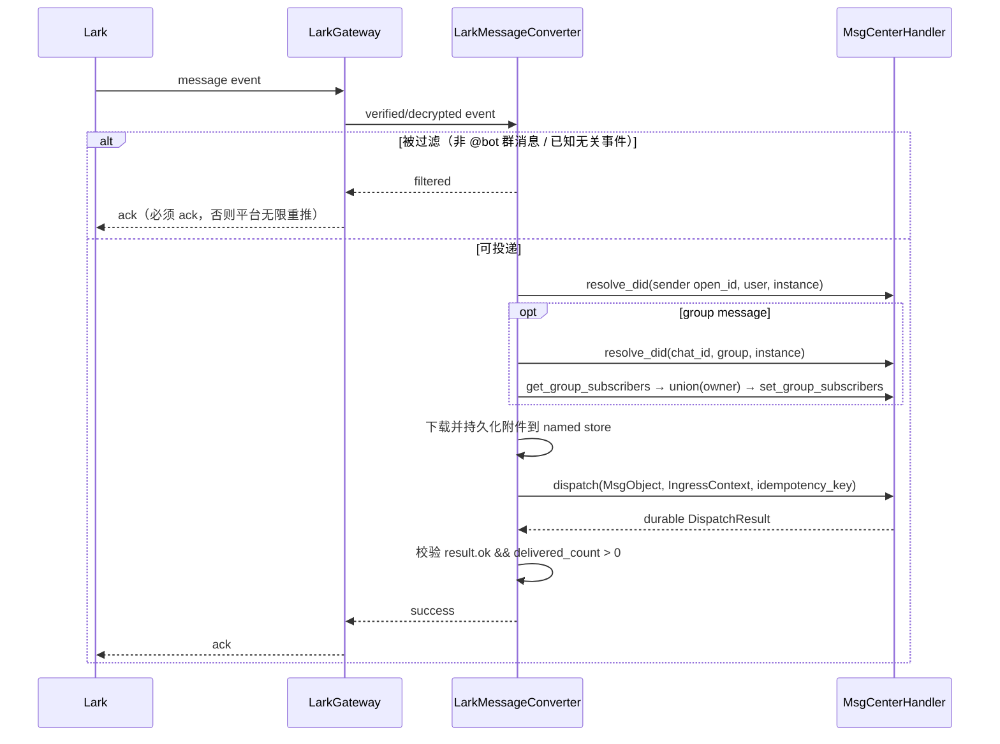

# Lark MsgTunnel 设计（基于 beta 2.2 MsgCenter）

> 本文以当前 `src/frame/msg_center/` 实现为事实源，描述飞书（Feishu）/ Lark 接入方案。
> 通用消息语义仍以 `doc/message_hub/Message Center.md` 和
> `doc/message_hub/Message Tunnel Design.md` 为准；本文只补充 Lark 的实现边界、字段映射和落地顺序。
>
> **代码基线**：2026-08-24 review 于 repo HEAD `ccb48d14`；`tg_tunnel.rs` 基线为 `658fea46`
> (2026-08-12)。本文所有 `file:line` 均以该基线为准，实现前请先 `git log` 确认这些文件是否又有变动。
>
> **本文与 tg 的关系**：Telegram tunnel 是唯一跑过生产的参考实现，且仍在持续修 bug
> （`5bedd039` / `42aa8c72` / `38ab05fd` / `78930f4c` / `f84f29c5` / `658fea46`）。
> 本文把这些修复的结论直接写成 Lark 的硬约束。但 **tg 现存实现里有若干已知 bug，见 §1.2，
> 明确不要照抄**。

## 0. 结论

Lark 接入应实现为 msg-center 进程内的 `LarkTunnel`：

```text
LarkTunnel = ingress producer + DeliveryExecutor
```

- 入站：接收 Lark 事件，构造 `MsgObject + IngressContext + idempotency_key`，经
  `MsgCenterHandler::handle_dispatch` 写入 MessageCenter。
- 出站：实现 `DeliveryExecutor`，由 msg-center 的 delivery pump 投递完整
  `DeliveryRecordWithObject`，返回 `DeliveryReportResult`。
- 身份：Lark 用户和群使用 local shadow endpoint DID；不把 ContactMgr 的联系人
  合并结果改写进 `MsgObject.from/to`。
- 首版范围：企业自建应用、单租户、Bot、一个 tunnel 实例对应一个 Lark 应用和一个
  owner DID；文本私聊与群内 `@bot` 优先。
- 接入模式：优先长连接，避免要求 Personal Server 暴露 webhook；若 Rust 侧没有合适的
  长连接实现，必须先确认新增依赖，再决定是否退回 webhook。
- 飞书/Lark 共用 `platform="lark"`，以 `region=feishu|lark` 选择 API 域名和凭据，
  不把区域差异扩散到 MsgCenter 数据模型。
- **两条贯穿全文的红线**（tg 踩过的最贵的两个坑）：
  1. **入站：没有真正落库成功的事件，绝不 ack；已经决定丢弃的事件，必须 ack。** 两个方向都错过。
  2. **出站：内容层面的失败要先降级重发，不要直接判 `retryable=false` 进 DEAD。**

## 1. 当前实现提供的边界

| 当前能力 | 代码事实 | Lark 的使用方式 |
|---|---|---|
| 通用 executor | `msg_tunnel.rs:25 DeliveryExecutor` | `LarkTunnel` 直接实现；旧的 `MsgTunnel` trait 已不存在 |
| executor 生命周期 | `msg_tunnel.rs:141 DeliveryExecutorMgr` | 按 `transport_did` 注册、启动、停止、执行 |
| 确定性选路 | `msg_center.rs:974 build_delivery_envelope` | shadow DID 解析为指定 Lark tunnel；不查询联系人首选 binding |
| 出站队列 | `DeliveryRecord` + `delivery_records` | pump 执行 `WAIT → SENDING → SENT/WAIT/DEAD`（`main.rs:312`） |
| 出站重试上限 | `msg_center.rs:40-44` `MAX_DELIVERY_RETRY=5`，退避 2s→300s | 超过即 `DEAD`，之后走 §6.4 兜底 |
| SENDING 租约回收 | `msg_center.rs:42 DELIVERY_SENDING_LEASE_MS=60_000` + `msg_box_db.rs:857` | **本身就是重复投递来源**，见 §6.3 |
| 入站写入 | `MsgCenterHandler::handle_dispatch`（`msg_center_client.rs:3359`） | Lark converter 只负责标准化与提交 |
| shadow DID | `contact_mgr.rs:97 resolve_did` / `:1805 parse_msgtunnel_did` / `:1658 message_tunnel_endpoint_did` | 生成并解析 Lark user/group endpoint |
| 入站幂等 | `msg_idempotency` + `msg_center.rs:543 dispatch_idempotency_retention_key` | 传入稳定的 Lark event key，副作用与结果事务提交 |
| 入站 checkpoint | `msg_tunnel_cursors` + `handle_get/update_tunnel_cursor` | 只存平台真实支持的 cursor/checkpoint，不伪造可补拉能力 |
| 附件对象 | named store + `MsgContent.refs` | 下载 Lark 资源后保存 `FileObject`，消息只引用对象 |
| UI session id | `msg_center_client.rs:29 build_msg_tunnel_ui_session_id` | **必须复用该 helper 生成 `thread.topic`**，见 §5.3 |
| 投递失败兜底 | `main.rs:417 build_delivery_failure_notice` | Lark 必须让兜底纯文本发得出去，见 §6.4 |
| 易失 UI 状态 | UI SessionState RPC | Lark 首版不桥接 typing/status；最终消息仍走可靠投递 |

### 1.1 已失效的旧结论（已复核）

- 不再复用或扩展旧 `MsgTunnel` trait；共同细腰是 `DeliveryExecutor`。（`grep "trait MsgTunnel"` 为空）
- 不再使用 `RouteInfo`、`TUNNEL_OUTBOX` 或 `TgEgressEnvelope` 作为通用模型；对应物分别是
  `DeliveryEnvelope/DeliverySnapshot`、`DELIVERY_QUEUE/DeliveryRecord` 和平台私有 envelope。
  （前两个符号全仓库已不存在；`TgEgressEnvelope` 仍在 `tg_tunnel.rs:147`，但确实是 tg 私有）
- `IngressContext` 没有 `ext_ids` 字段（`msg_center_client.rs:598-615`）；入站平台 id 应写入
  `IngressContext.extra` 和 `MsgObject.meta["lark"]`。`DeliverySnapshot.ext_ids` 是出站解析快照的
  一部分，不是入站容器。
- `MessageTunnelCapability` 全仓库不存在，registry 实现只保存
  `tunnel_instance_id → (transport_did, platform)`（`msg_center.rs:78,115`）；首版不能假设完整
  capability registry 已落地。
- MessageCenter 不会根据联系人、最近活跃或默认 chat 自动选择 Lark。调用方必须把确定的
  shadow endpoint DID 写入 `MsgObject.to`（`msg_center.rs:961-973` 的注释即为规范）。

### 1.2 tg_tunnel 现存 bug 清单（明确不要照抄）

实现 Lark 时会大量参考 `tg_tunnel.rs`。以下位置是**已确认的缺陷**，Lark 必须按本文对应章节
的写法实现；有余力时可以顺手修 tg，但不是 Lark 的前置条件。

| # | 位置 | 问题 | Lark 正确做法 |
|---|---|---|---|
| B1 | `tg_tunnel.rs:2876-2892` | 附件**下载**失败会 `?` 重试（对），但 `store_media_attachment` 失败只 `warn!` + `None`，消息照发、附件丢失 | §5.4：存储失败等同事件失败，不 ack |
| B2 | `tg_tunnel.rs:3030-3064` | `dispatch_result.ok == false` 和 `delivered_count == 0` 只 `warn!`，函数返回 `Ok(())`，cursor 照推进 → 消息静默消失 | §5.2：这两种情况必须视为失败，不 ack |
| B3 | `tg_tunnel.rs` 全文无 group subscriber 调用 | 群消息写进 `GROUP_INBOX` 但没有 subscriber 时 `msg_center.rs:1222` 的 readers 为空，没人能读 | §4.2：dispatch 前确保 owner 在 subscriber 里 |
| B4 | `tg_tunnel.rs:4351-4372` | `execute_delivery` 对 `!supports_egress`、transport_did 不匹配这类**确定性错误**用 `bail!`，被 pump 当成可重试（`msg_center.rs:1680` `unwrap_or(true)`） | §6.1：返回 `retryable=false` 的 report，不要 `bail!` |
| B5 | `main.rs:903` | `register_tunnel` 无条件注册 route，不看 `supports_egress` | §9：ingress-only 不注册 route |
| B6 | `main.rs:911-929` | `start_instance` 失败只 `warn!` 后继续，route 已注册，留下无人消费的 route | §9：启动失败必须回滚 route 注册 |

## 2. 实例、配置和凭据边界

### 2.1 一实例一应用

首版固定：

```text
1 LarkTunnel instance
  = 1 app_id/app_secret
  = 1 region
  = 1 tenant
  = 1 bot identity
  = 1 owner_did
```

这样可以保证 `open_id`、`chat_id`、token、限流配额和事件流都处于同一应用作用域。
如果以后需要多个应用，应创建不同 `tunnel_instance_id`；ISV 多租户不是首版范围。

### 2.2 建议配置

在现有 `telegram_tunnel` 同级增加可选 `lark_tunnel`，保持改动局部化：

```json
{
  "lark_tunnel": {
    "enabled": true,
    "transport_did": "did:web:lark-tunnel.test.buckyos.io",
    "tunnel_instance_id": "lark-main-tunnel",
    "supports_ingress": true,
    "supports_egress": true,
    "region": "feishu",
    "ingress": {
      "mode": "long_connection"
    },
    "binding": {
      "owner_did": "did:web:jarvis.test.buckyos.io",
      "app_id": "cli_xxx",
      "app_secret": "***",
      "bot_account_id": "cli_xxx"
    }
  }
}
```

约束：

- `tunnel_instance_id` 是稳定短 id，本 Zone 唯一且不可复用；它不是 `transport_did`。
  **它被编码进每一个 shadow DID，一旦上线等于永久 schema**，见 §4.1。
- `transport_did` 是 executor DID，也是该实例 `DELIVERY_QUEUE` 的 owner。
- `bot_account_id` 是入站幂等分桶、UI session id 和诊断使用的稳定账号 id，默认可取 `app_id`，
  不参与选路。同样是**上线后不可变**的（改了会切断幂等桶和 UI session）。
- `app_secret`、access token 不得写入日志、contact meta、`IngressContext` 或消息对象。
- `region` 只能选择受支持的区域枚举；测试可另设显式 endpoint override，但生产配置不接受
  event payload 提供的 base URL。

这段 JSON 结构需要同步的位置共 5 处，完整清单见 §9。

## 3. 组件设计

建议新增：

```text
src/frame/msg_center/src/lark_tunnel.rs
  LarkTunnel                 DeliveryExecutor 实现、binding 与生命周期
  LarkMessageConverter       Lark event ↔ MsgObject / 平台出站 envelope
  LarkGateway                Lark 私有网关接口，不暴露成通用 tunnel trait
  LarkTokenManager           tenant_access_token 缓存、刷新和单飞
  LarkRateLimiter            app 级发送节流
```

`LarkGateway` 不实现 `TgGateway`。`TgGateway` 的 `parse_mode`、`set_status_line`、
Telegram chat 解析和媒体发送语义都是平台私有假设。Lark 与 Telegram 只共享：

- `DeliveryExecutor`；
- `MsgCenterHandler` 入站 API；
- `MsgObject`、`IngressContext`、`DeliveryRecord`、`DeliveryReportResult`；
- named store 中的附件对象；
- `build_msg_tunnel_ui_session_id`（`msg_center_client.rs:29`）；
- settings 装配、executor manager 和 delivery pump。

后台任务生命周期可以直接复用 `tg_tunnel.rs:63 ManagedTask` 的模式（`oneshot` stop 信号 +
`JoinHandle`，`stop()` 里 await handle 退出）。这是 `42aa8c72` 修 task 泄漏时定下来的形状，
建议把 `ManagedTask` 提升为 msg_center 内的共享小工具而不是各抄一份。

附件读取逻辑应从 `TgMessageConverter` 中提取最小的中立 helper（解析 `content.refs`、加载
`FileObject`/chunk，对应 `tg_tunnel.rs:581 extract_ref_attachments` / `:659 load_attachment_bytes`
/ `:700 resolve_attachment_file_name`），避免 Lark 再实现一套对象存储协议；Telegram/Lark 的
上传 API 和媒体类型映射仍留在各自 gateway 内。

## 4. 身份与 DID 映射

### 4.1 规范映射

首版以 Lark `open_id` 作为用户的规范 account id：

| Lark 实体 | `account_id` | `account_type` | shadow DID |
|---|---|---|---|
| 用户 | `open_id` | `user` | `did:msgtunnel:<encoded_open_id>.user.<instance>` |
| 群聊 | `chat_id` | `group` | `did:msgtunnel:<encoded_chat_id>.group.<instance>` |
| 频道/不可回复广播 | 平台稳定 id | `channel` | 后续能力，首版不主动创建 |

`user_id`、`union_id`、`tenant_key`、`message_id` 只作为平台 metadata 保存，不能替换规范
account id，也不能成为出站 fallback。一个实例只服务一个应用/租户，因此首版不把
`tenant_key` 编进 DID；多租户方案必须重新定义实例边界后再开放。

**profile hint 不是可选装饰，它是「拿不拿得到 shadow DID」的开关。**
`contact_mgr.rs:1658 message_tunnel_endpoint_did` 只在 hint 同时提供 `account_type` 和
`tunnel_instance_id`（或别名 `tunnel`）时才返回 endpoint DID；缺任意一个就返回 `None`，
`resolve_did` 会走 `generate_contact_did` 分配一个**完全不同形状的 DID**，出站再也解析不回
Lark 地址。converter 每次调用 `handle_resolve_did` 都必须带全 hint。

示例 profile hint：

```json
{
  "account_type": "user",
  "tunnel_instance_id": "lark-main-tunnel",
  "name": "Alice",
  "display_id": "Alice",
  "meta": {
    "tenant_key": "tenant_xxx",
    "open_id": "ou_xxx",
    "user_id": "u_xxx",
    "app_id": "cli_xxx"
  }
}
```

Lark 私有字段必须放进 hint 的 `meta` 对象；`contact_mgr.rs:1990 merge_hint_meta` 只会把
`meta` 里的**扁平标量**和一个固定白名单的顶层字段（`account_type`/`chat_type`/`chat_id`/
`bot_account_id`/`platform_uid`/`message_tunnel_*`）合并进 `AccountBinding.meta`，嵌套对象会被丢弃。

DID 语法的两个硬约束（`contact_mgr.rs:1767-1820`）：

- `account_id` 和 `tunnel_instance_id` 走自定义 percent-encode（只保留 `[A-Za-z0-9-_~]`），
  `account_type` 走 `normalize_account_type` 只保留 `[a-z0-9_-]`；
- 解析是 `did.id.splitn(3, '.')`，所以三段结构靠编码保证，不要绕过 helper 自己拼字符串。

**这套 DID 语法在 `c168f746`（2026-05-29 "modify msg tunnle did"）破坏性改过一次，仓库里
没有任何迁移工具。** 因此 `lark-main-tunnel` 这个名字必须一次定死；换名字 = 所有历史 shadow
DID 失效。

### 4.2 私聊与群聊

```text
私聊入站:
  from = user shadow DID(open_id.user.instance)
  to   = owner_did
  kind = Chat

群聊入站:
  from = actor shadow DID(open_id.user.instance)
  to   = group shadow DID(chat_id.group.instance)
  kind = GroupMsg
```

群聊回复目标必须是原消息的 group `to`，不能默认回复 actor `from`。

**群订阅是首版必做项，且 tg 从来没做过（B3）。**
`msg_center.rs:1204-1220` 的 fan-out 逻辑是：

```text
readers = group_mgr.active_singleton_members(owner_key, group_id)
          .unwrap_or_else(|| contact_mgr.get_group_subscribers(group_id, owner_scope))
```

`readers` 为空时，消息只有一条 `GROUP_INBOX` 记录，owner/Agent 的 `INBOX` 里什么都没有。
所以 Lark 首次接收某群事件时，必须在同一 `contact_mgr_owner=owner_did` 作用域中确保该 group 的
subscriber 包含 `owner_did`，再调用 `dispatch`。实现细节：

- 可用的 API 只有 `handle_get_group_subscribers` / `handle_set_group_subscribers`
  （`msg_center.rs:2652,2665`）。**`set` 是全量替换，没有 add**，必须 get → union → set，
  并考虑同一 owner scope 下的并发写（首版单 owner 单实例，用一把进程内 mutex 串行化即可）。
- `active_singleton_members` **优先级更高**：如果这个 Lark 群恰好在本地 GroupMgr 里有 doc，
  你设置的 subscriber 会被完全忽略。首版 Lark 群不应在 GroupMgr 建 doc；若发现命中该分支，
  按错误处理并告警，不要静默。
- 首版一个实例只有一个 owner，可直接维护该 owner scope 下的单元素订阅；不能写入 system
  owner scope（`msg_center.rs:1200-1203` 的 `__system__`），也不能覆盖其它 owner scope 的订阅。
- 订阅确保失败 = 事件处理失败，不 ack（见 §5.2）。

ContactMgr 自动推断出的用户默认是 `Stranger`（`contact_mgr.rs:1831`）。Lark tunnel 不得自动
升级为 Friend；私聊进入 `INBOX` 还是 `REQUEST_BOX` 继续由现有 ACL 决定。

## 5. 入站流程

### 5.1 接入方式

首选 `long_connection`：

- 与当前 Telegram 的"每 binding 一个受管 ingress task"生命周期一致（`tg_tunnel.rs:63 ManagedTask`）；
- 不要求公网 webhook URL，也不改 `MsgCenterHttpServer` 的 kRPC-only 路由；
- `start()` 建立/启动可自动重连的后台任务，`stop()` 发停止信号并**等待任务退出**；
- 暂时断网由 gateway 内部重连，不应让 executor 永久停在 `Faulted`。

长连接的 Rust SDK/协议实现属于新增依赖决策，实现前必须确认。若选择 webhook，则需要另行
设计公开路径、challenge、签名校验、解密、请求体限制和 ZoneGateway 暴露策略；不能把 webhook
请求混入 `/kapi/msg-center` 的普通 kRPC handler。

**选型时必须先回答的问题**：Lark 长连接的事件回调是并发的还是串行的？如果是并发的，
必须在 tunnel 内按 `chat_id` 串行化，否则同一会话的消息顺序和 §5.2 的"失败即停止推进"
语义都无法成立。

### 5.2 事件处理顺序与 ack 语义



**ack 规则（tg 在两个方向上都踩过，见 B1/B2 和 `tg_tunnel.rs:3269-3350`）**：

1. **只有在附件已持久化、`dispatch` 成功提交、且结果被校验之后，才 ack。**
   解析、存储或 dispatch 出现临时错误时返回失败，让平台重推；重推使用同一幂等键收敛。
2. **`dispatch_result.ok == false` 或 `delivered_recipients + delivered_agents +
   delivered_group` 全为空，一律视为失败，不 ack。** tg 这里只 `warn!` 就推进 cursor
   （B2），群消息因此静默消失过。
3. **被过滤的事件必须照常 ack。** tg 对非 message 的 update 也会 `persist_bot_api_offset`
   （`tg_tunnel.rs:3271-3296`），正是为了避免一串被忽略的事件把游标永远卡住。Lark 侧对应：
   非 `@bot` 群消息、心跳、无关事件类型，处理完直接 ack，只记 metric/debug 日志。
4. **一批事件中某条失败时，停止推进该批后续事件**（tg 用 `break` 跳出批循环，
   `tg_tunnel.rs:3325,3347`）。队头阻塞在这里是**故意的**，用于保序 + 保证 at-least-once。
5. 具体长连接库是否把 handler 返回值映射为平台 ack/retry，必须通过故障注入测试确认；
   如果 SDK 根本不提供 nack 语义，必须在 §12 里升级为阻塞项重新设计（例如本地 durable
   event staging），不能默认"返回 Err 就等于平台会重推"。

群消息首版只处理明确 `@bot` 的消息；converter 可从给 Agent 的纯文本中移除对 bot 自身的
mention，但必须在 `msg.meta["lark"]` 保留原始 mention 列表和原始文本。

### 5.3 标准字段

每个可投递事件至少生成：

```text
MsgObject.from                  精确 user/group shadow DID
MsgObject.to                    owner_did 或 group shadow DID
MsgObject.kind                  Chat / GroupMsg / Event / Operation
MsgObject.thread.topic          build_msg_tunnel_ui_session_id("lark", bot_account_id, chat_id)
MsgObject.meta["lark"]          tenant/event/message/sender/chat/mention 等平台事实
IngressContext.transport_did    本 LarkTunnel 的 transport_did
IngressContext.platform         "lark"
IngressContext.chat_id          Lark chat_id
IngressContext.source_account_id 发送者 open_id
IngressContext.context_id       lark:<owner_did>:<chat_id>
IngressContext.contact_mgr_owner owner_did
IngressContext.extra.tunnel_account_id app_id/bot_account_id
IngressContext.extra.event_id   稳定事件 id
IngressContext.extra.message_id Lark message_id
IngressContext.extra.tenant_key 租户 id
```

**`thread.topic` 有三重身份，即使首版不做 status 也不能随便取。** 同一个值同时被用作：

1. UI session id —— 出站时 `execute_delivery` 直接把 `msg.thread.topic` 当 session id
   （`tg_tunnel.rs:4382`），P2 的 status card 全靠它对齐；
2. dispatch 幂等 retention bucket 的 session 段 fallback（`msg_center.rs:558-561`：
   `chat_id` 缺失时回落到 topic）；
3. post_send 幂等 retention key（`msg_center.rs:603-608`）。

因此必须复用 `buckyos-api` 的 canonical helper 而不是自己拼字符串：
在 `msg_center_client.rs:27` 旁边加 `pub const UI_SESSION_PLATFORM_LARK: &str = "lark";`
和 `build_lark_ui_session_id(bot_account_id, chat_id)`，内部转调
`build_msg_tunnel_ui_session_id`（它会把各段里的 `:` 归一成 `_`，空值归一成 `unknown`）。
产出形如 `lark:<bot_account_id>:<chat_id>`，与 tg 的 `tg:lzc_jarvis:5397330802` 同构。

入站幂等键：

```text
lark:<bot_account_id>:<chat_id>:<event_id>
```

若事件没有稳定 `event_id`，退化为：

```text
lark:<bot_account_id>:<chat_id>:<message_id>:<event_type>
```

（tg 用的就是这种退化形式：`build_dispatch_key(bot_account_id, chat_id, message_id)`，
`tg_tunnel.rs:483`。）

再无稳定 id 时才使用 `event_timestamp + canonical_payload_hash`。不能把本地接收时间、重试次数
或连接序号放入 key。`extra.tunnel_account_id` 与 `chat_id` 必须稳定，因为
`msg_center.rs:543-562` 用 `dispatch:{platform}:{tunnel_account_id | transport_did}:{chat_id |
topic | context_id}` 构造幂等清理的 retention bucket——按 sender 拆分会把桶打散，容量清理失效。

### 5.4 内容映射

| Lark 内容 | MsgObject |
|---|---|
| text | `Chat/GroupMsg + text/plain` |
| post/rich text | 人类可读文本 + `meta.lark.raw_content`；后续再映射结构化富文本 |
| image/file/audio/media | 下载到 named store，`content.refs` 引用 `FileObject` |
| interactive card/审批/投票 | `Operation`，摘要进 `content.content`，结构进 `machine.data` |
| member/action/system event | `Event` 或 `Notify` |
| 未知类型 | `Event/Operation` + 有大小上限的 raw payload，不 panic |

**附件的下载和存储必须用同一套失败语义。** 这是 tg 的 B1：`tg_tunnel.rs:2864-2875` 的
download 失败会 `?` 上抛并阻止 cursor 推进（正确），但紧接着 `:2876-2892` 的
`store_media_attachment` 失败只 `warn!` 然后置 `None`，消息照发、附件永久丢失（错误）。

Lark 侧：下载失败、named store 写入失败、`content.refs` 构造失败，**任何一步失败都等同事件
失败，不 ack，让平台重推**，绝不降级成"看起来成功但附件丢失"的文本消息。

若平台类型永久不支持，则投递一个包含可读摘要、resource key 和受限 raw payload 的
`Event/Operation`，以便诊断和未来重放——这是"明确的降级"，与"静默丢失"是两回事。

### 5.5 恢复边界

`msg_tunnel_cursors` 只能保存平台实际提供的 cursor。若长连接事件流没有历史拉取/cursor API，
可以保存 `last_event_id/last_event_at` 用于诊断，但不能宣称可据此补拉。

**cursor 读取失败时必须暂停，不能退化成从头拉。** tg 的做法是：`offset_loaded` 保持 false，
sleep 后重试加载，绝不 `offset = 0`（`tg_tunnel.rs:3211-3235`）。同理，读到非法值（负数、
类型不符）是硬错误而不是"当作 0"。Lark 若持久化了任何形式的 checkpoint，必须照此办理。

此时可靠性依赖：

1. 平台在 handler 失败/未 ack 时重推；
2. 成功 ack 前完成本地 durable dispatch；
3. MessageCenter 持久幂等消除重推副作用；
4. SDK 自动重连与连接健康监控。

"断连窗口是否由平台保证重放"是上线前必须验证的外部能力；若不保证，push-only ingress 仍有
不可消除的漏消息风险，需要再设计本地 durable event staging 或平台侧补拉方案。

## 6. 出站流程

### 6.1 确定性地址

调用方发送前必须显式选择目标 shadow DID：

```text
did:msgtunnel:ou_xxx.user.lark-main-tunnel    → receive_id_type=open_id
did:msgtunnel:oc_xxx.group.lark-main-tunnel   → receive_id_type=chat_id
```

`MessageCenter.post_send` 已把 DID 解析成 `DeliveryEnvelope`（`msg_center.rs:974-1035`）：

- `transport_did`：本 `LarkTunnel` executor；
- `target_did`：原 shadow DID；
- `address.account_id`：`open_id` 或 `chat_id`；
- `address.account_type`：`user` 或 `group`；
- `address.chat_id`：`account_type != "addr"` 时写入的同一 account id（`msg_center.rs:995-999`）。

`LarkTunnel` 必须按 `account_type` 解释 `account_id`，不能从 `meta/extra` 猜地址：

| `account_type` | Lark receive id | 首版行为 |
|---|---|---|
| `user` | `open_id` | 支持 |
| `group` | `chat_id` | 支持 |
| `channel` | 平台定义 | 明确返回不可重试 unsupported |
| 其它/缺失 | 无 | `missing_delivery_address`，不可重试 |

发送所用应用 binding 由 `MsgObject.from` 的 owner DID 确定，沿用当前 `TgTunnel` 模式
（`tg_tunnel.rs:3931 resolve_sender_did` + `get_binding`）。

**所有确定性错误必须返回 `Ok(DeliveryReportResult { retryable: Some(false), .. })`，
不能 `bail!`。** `msg_center.rs:1680` 是 `result_payload.retryable.unwrap_or(true)`，而
`main.rs:344-363` 会把 executor 的 `Err` 统一包装成 `retryable=true`，结果是确定性错误
白白重试 5 次才进 DEAD。tg 只有 `missing_delivery_address` 一条做对了
（`tg_tunnel.rs:4391-4402`），`!supports_egress` 和 transport_did 不匹配两处都是 `bail!`（B4）。

Lark 的分类：

- `retryable=false`：不支持 egress、envelope 属于其它 executor、缺 `address`、
  `account_type` 不支持、找不到 owner binding；
- `Err`（=可重试）：只留给"executor 当前没 running / 长连接暂时不可用"这类真正的瞬时状态。

### 6.2 内容渲染与发送

首版 renderer：

- `text/plain`：发送 Lark text；
- `text/markdown` / `text/html`：降级成安全纯文本，不能把 Telegram `parse_mode` 带过来；
- 有 `content.refs`：先上传资源取得 `image_key/file_key`，再发送引用该 key 的消息；
- `Operation`：首版发可读文本摘要；支持 interactive card 后再按明确 intent 渲染；
- 未知格式：可读摘要或明确不可重试错误，不能 panic。

**首版之所以"一律降级纯文本"是刻意规避风险，不是因为富文本不重要。** 一旦进入 P1/P2 要发
post 富文本或 interactive card，必须同时实现"同一次投递内降级重发"，否则会精确复现
`658fea46` 修掉的那个线上问题（Telegram 默认 `parse_mode=Markdown`（`tg_tunnel.rs:165`），
LLM 生成的 markdown 里一个不闭合的 `*` 就让整条回复变成 `Bad Request: can't parse entities`，
用户什么都收不到）。

参考实现形状 `tg_tunnel.rs:199-234`：

```text
is_lark_content_schema_error(err)      → 识别"内容/schema 被平台拒绝"这一类错误
with_lark_plain_fallback(rich, send)   → 富格式发一次；命中上述错误则把同一内容降级重发一次
```

约束：

- 降级只做一次，不递归；
- 降级是**同一次 delivery attempt 内部**的行为，不额外产生 `DeliveryRecord`；
- 编辑/替换路径失败时，要把"本次已判定需降级"的标记传给后续的新发消息
  （tg 的 `fallback_to_plain` 变量，`tg_tunnel.rs:2001,3503`）；
- 非内容类错误（401/403/限流/网络）绝不能进入降级路径，必须按 §6.3 正常分类。

平台接受后返回：

```text
DeliveryReportResult {
  ok: true,
  external_msg_id: <Lark message_id>,
  delivered_at_ms: <local accepted time>
}
```

这里的 `DeliveryState::Sent` 只表示 Lark API 已接受，不代表对方已读。

### 6.3 错误分类

| 错误 | report |
|---|---|
| 429/平台限流 | `retryable=true`，带 `retry_after_ms` |
| 网络错误、5xx | `retryable=true` |
| access token 过期 | 强制刷新后重试一次；仍失败再按真实原因分类 |
| app secret/权限配置错误 | `retryable=false`，明确 error code |
| **内容/schema 被拒（富文本、card json、mention 非法等）** | **先按 §6.2 降级重发一次；降级后仍失败才 `retryable=false`** |
| receive id 非法、account_type 不支持、缺地址 | `retryable=false` |
| 发送超时且结果未知 | `retryable=true, duplicate_risk=true` |

原表把"消息格式非法"直接判 `retryable=false` 是错的——那等于让用户什么都收不到。
"地址错"和"内容错"必须分成两行。

**关于 `duplicate_risk` 的准确现状**（原文只说对了一半）：

- `DeliveryError` **已经有** `duplicate_risk: bool` 字段（`msg_center_client.rs:677`）；
- 缺的只是 `DeliveryReportResult` 上的对应字段（`msg_center_client.rs:962-976`）和
  `report_delivery_internal` 里的透传——那里当前硬编码 `duplicate_risk: false`
  （`msg_center.rs:1688`）。所以改动量比"新增一个概念"小得多：加字段 + 改一行 + 同步
  `buckyos-api` / MessageCenter / 测试。
- **更重要的是：重复投递的来源已经存在，与 Lark 是否支持 client message id 无关。**
  `msg_box_db.rs:857-871 reclaim_stale_sending` 会把租约超时（`DELIVERY_SENDING_LEASE_MS
  = 60s`）的 `SENDING` 行回收成 `WAIT` 并写入 `duplicate_risk: true`。也就是说 executor
  在 send 中途崩溃/卡死，这条消息**一定会被重发**。设计上必须接受 at-least-once。

平台支持 client message id 时应使用 `delivery_id` 做去重；若 Lark API 不支持，超时重试和
租约回收都可能重复投递，只能通过 `duplicate_risk` 暴露，不能假装 exactly-once。

### 6.4 投递失败兜底（`delivery_failure_notice`）

这是 `f84f29c5`（2026-08-08）新增的机制，Lark 必须适配：

- Agent 侧（`opendan/src/agent_session.rs:6050-6060`）在每条出站消息的
  `meta["delivery_failure_notice"]` 里塞一段 i18n 纯文本兜底话术；
- delivery pump 在记录进入 `DEAD` 后（`main.rs:394-409`）调用
  `build_delivery_failure_notice`（`main.rs:417-446`）：取出该文本，把 `msg.to` 改写成
  `record.envelope.target_did`（**即刚刚失败的同一个目标**），content 换成 `TextPlain`，
  再以幂等键 `delivery-failure:{delivery_id}` 重新 `post_send`；
- 递归保护靠 `meta["delivery_failure_fallback"] = true`：带该标记的消息不再生成兜底
  （`main.rs:419-426`，回归测试 `main.rs:1127 does_not_recurse_for_failure_notice`）。

对 `LarkTunnel` 的要求：

- 这条兜底消息走的是**同一个 shadow DID、同一个 executor**，所以富内容失败的那些原因
  （card schema、附件上传）不能同样打死纯文本路径——纯文本发送路径必须是最简、最少依赖的；
- 不要在 tunnel 内自行消费或改写这两个 meta key；
- 验收必须包含："Lark 富内容投递失败 → 用户在同一会话里收到兜底纯文本"。

## 7. Token、限流和区域

### 7.1 TokenManager

`LarkTokenManager` 负责：

- 用 `app_id + app_secret` 获取并缓存 tenant access token；
- 按过期时间提前刷新；
- 并发请求共享一个刷新任务，避免 token stampede；
- 鉴权失败时清缓存并只强制刷新一次；
- 区分网络/服务端临时错误与永久凭据错误；
- 只在内存保存 access token，不写 MsgCenter DB 或消息 meta。

首版单租户，因此 token cache 只需按 instance/binding 管理；ISV 模式需要按 tenant 维度重新设计。

### 7.2 限流

当前 delivery pump 对每个 running executor 每轮取一条消息并串行执行（`main.rs:312-415`），
但工作存在时会立即进入下一轮（`main.rs:454-455` 只有空闲才 sleep），不能等价为 Lark 配额控制。
`LarkGateway` 仍需 app 级 token bucket/最小发送间隔：

- 主动节流不要占用平台 429 配额；
- 平台返回的 retry-after 原样进入 `DeliveryReportResult.retry_after_ms`
  （`msg_center.rs:1696-1699` 会直接用它当退避时间，不再叠加指数退避）；
- 附件上传和消息发送分别计入对应 API 配额；
- 节流等待时间要明显小于 `DELIVERY_SENDING_LEASE_MS`（60s），否则会被租约回收判成崩溃并重发；
- 不在 tunnel 内另建第二套 durable outbox，重试真相仍是 `DeliveryRecord`。

### 7.3 区域

`region=feishu` 与 `region=lark` 选择不同 API/事件入口。一个 tunnel 实例不能运行时跨区域切换；
切换区域等价于配置变更，应使用新的 `tunnel_instance_id`，避免旧 shadow DID 被错误解释
（且没有迁移工具，见 §4.1）。

## 8. 流式状态与卡片

首版只发送最终 `Chat/GroupMsg`，不复用 `TgUiSessionTracker`：

- typing/status/partial 属于 UI SessionState，不生成 `MailboxRecord`/`DeliveryRecord`；
- Lark 若没有稳定 typing API，typing 直接 no-op；
- 即便首版不做 status，`thread.topic` 也必须按 §5.3 的 canonical 形状生成，否则 P2 接不上；
- card action 入站用 `Operation`，鉴权后交给 Agent/Workflow，tunnel 不直接执行高权限动作。

P2 落地可更新 status card 时，必须实现 Lark 私有 tracker，并覆盖 **两个方向** 的 `turn_nonce`
竞态（tg 在这两个方向上分别踩过）：

1. **旧压新**：上一轮迟到的状态更新不能覆盖已经发出的新回复
   （`tg_tunnel.rs:404,443` 的 `nonce_matches` 守卫）；
2. **新压旧**：新一轮的状态行不能去 edit 上一轮遗留的 status message
   （`78930f4c` 修的就是这个——上一轮失败留下的"思考失败"那条被新一轮改写了）。
   修法是 nonce 不匹配就传 `None`，让 gateway 新发一条：`tg_tunnel.rs:4253-4261`。

配套的完整时序在 `tg_tunnel.rs:4404-4461`（`execute_delivery` 内）：
`session_op_lock` 串行化 → `status_message_id_for_nonce` 取本轮可替换的 status 消息 →
发送 → 成功后 `delete_message` 删掉旧 status → `mark_status_message_replaced`。
其中一条容易漏的规则：**带附件的消息不能走 edit 替换**，必须新发再删旧
（`tg_tunnel.rs:4420` 的 `if envelope.attachments.is_empty()` 守卫）。

Lark 侧必须补齐等价测试，可直接对照这三个现成用例改写：

- `tg_tunnel.rs:5092 attachment_reply_deletes_previous_status_message`
- `tg_tunnel.rs:5169 reply_does_not_replace_status_from_different_nonce`
- `tg_tunnel.rs:5239 new_turn_status_does_not_replace_previous_turn_status_message`

## 9. Settings 装配必须同步重构

当前 `main.rs` 的 settings reload 是 Telegram 专用的：

- `RawMsgCenterSettings` 只解析 `telegram_tunnel`（`main.rs:62-66`）；
- `handle_reload_settings` 只调用 `apply_tg_tunnel_settings`（`main.rs:166`）；
- `clear_tunnel_instances` 会停止并注销所有非 MessageHub executor，并
  `center.clear_tunnel_registry()` 清空整个 tunnel registry（`main.rs:790-840`）；
  注意它在仍有残留实例时会返回 `Err`（`main.rs:832-837`），不是尽力而为。

直接在它旁边调用一次 `apply_lark_tunnel_settings` 会互相删除。因此新增 Lark 时必须把装配改为
一次性处理完整 desired set：

```text
parse telegram + lark settings
→ 预校验全部 transport_did / tunnel_instance_id / binding / region
→ 检查全局 tunnel_instance_id 无重复
→ stop/unregister 旧的 settings-driven executors
→ build/register/start 新 executors
→ 只为 egress-enabled 且启动成功的实例注册 route
→ 注册 binding owner 为 local recipient
→ 同步所有 binding owner scope 的 zone user contacts
```

### 9.1 已经实现、不要破坏的

- **route 注册必须晚于 executor 注册**：`main.rs:900-902` 的注释即为规范——"post_send 永远
  不能规划到一个没有消费者的 tunnel 上"。
- **duplicate `tunnel_instance_id` 已经是硬错误**：`center.register_tunnel(...)?`
  （`main.rs:903-907`，`msg_center.rs:115`）返回 `Result` 且明确不做静默覆盖。重构装配时
  保持这个语义，不要因为改成 desired-set 而退化成"后写覆盖先写"。
- MessageHub 不参与 settings-driven 清理（`main.rs:794,799,815,830`）。

### 9.2 需要新做的（tg 当前是违反的）

- **ingress-only 实例不得注册为 `post_send` route**：`main.rs:903` 现在无条件注册，
  不看 `supports_egress`（B5）。
- **启动失败必须回滚 route**：`main.rs:911-929` 现在 `start_instance` 失败只 `warn!` 后继续，
  留下一个已注册但没有 running executor 的 route（B6）。正确行为：
  - 临时性失败（网络、长连接暂时建不起来）→ 保留 route，由 tunnel 自行重连；
  - 永久性失败（凭据错、配置错、region 非法）→ 回滚 route 注册并把错误暴露在 reload 返回值里。
- **reload 先验证再破坏**：先把 telegram + lark 的完整新配置解析校验通过，再调
  `clear_tunnel_instances`，避免校验失败时留下"旧的已删、新的没起"的半更新状态。

### 9.3 配置结构同步点（共 5 处，逐个都要改）

1. `src/frame/msg_center/src/main.rs:57-135` —— `MsgCenterSettings` / `RawMsgCenterSettings`
   / `LarkTunnelSettings` 及其 `default_*` 函数；
2. `src/dev_configs/msg_center.json` —— 开发默认配置；
3. `src/kernel/scheduler/src/system_config_builder.rs:1011` —— 生成
   `services/msg-center/settings` 的地方；
4. `doc/arch/system_config_reference.md:120` —— 该 key 的文档说明；
5. `src/kernel/node_active/res/*.json`（11 个语言文件，第 114 行附近的
   `error_telegram_tunnel_incomplete`）—— **激活向导里有一步是填 Telegram bot token**。
   如果 Lark 也要走激活向导配置，这 11 个文件和对应的向导页面逻辑都要加；如果首版决定
   Lark 只能手工写 system config，请在实现时明确记录这个决定，不要留成隐式缺口。

完整 capability registry 不是首版前置条件。首版通过 `supports_ingress/egress` 和 Lark 内部明确的
内容/error mapping 工作；若以后落地 `MessageTunnelCapability`，它只用于管理与展示，不能参与
自动选路。

## 10. 实施顺序

### P0：打通可靠文本链路

1. **共享类型先改完**：给 `DeliveryReportResult` 补 `duplicate_risk` 并在
   `report_delivery_internal` 透传（`msg_center_client.rs:962`、`msg_center.rs:1688`），
   同步 `buckyos-api` 与现有 tg 测试。
   *放在第一步是因为 P0 第 5 步的错误分类依赖它，且这是跨 crate 的公共类型改动，
   越晚做返工面越大。*
2. **重构 settings 装配**：按 §9 改成 desired-set，落实 §9.2 的三条新行为，同步 §9.3 的 5 处
   配置点，使 Telegram 与 Lark 可同时存在且 reload 不互相删除。
3. 新增 `LarkTunnel: DeliveryExecutor`、单 owner binding、`LarkTokenManager` 和可替换的
   fake gateway；后台任务用 `ManagedTask` 形状，`stop()` 必须 await 退出。
4. 打通长连接入站文本：DM、群 `@bot`、shadow DID（含完整 profile hint）、group subscriber、
   ACL、持久幂等，以及 §5.2 的完整 ack 规则。
5. 打通出站文本：shadow DID → envelope → Lark send → delivery report；错误分类按 §6.3，
   确定性错误一律 `retryable=false` 而不是 `bail!`。
6. 适配 §6.4 的 `delivery_failure_notice` 兜底路径。
7. 完成限流、重连、停止等待和 secret redaction。

### P1：附件与富内容

1. 从 `TgMessageConverter` 抽取通用 named-store attachment loader。
2. 入站图片/文件下载、对象化和 `content.refs`；下载与存储共用同一失败语义（§5.4）。
3. 出站 upload → key → send，覆盖 retry/dead 分类。
4. post/rich text 的稳定降级与 raw payload 上限；**同时实现 §6.2 的同投递内降级重发**。

### P2：Operation 与 UI 状态

1. interactive card、审批/投票摘要与 card action 入站。
2. 可更新 status card、双向 `turn_nonce` 竞态保护（§8）。
3. delivered/read 回执（仅平台确实支持时）。
4. ISV/多租户或 webhook，仅在独立设计完成后进入。

## 11. 验证与验收

### 11.1 单元/集成测试

身份与选路：

- 同一 `(open_id, account_type, tunnel_instance_id)` 始终得到同一 shadow DID；特殊字符可逆编码。
- profile hint 缺 `account_type` 或 `tunnel_instance_id` 时不产生 `did:msgtunnel:*`——
  converter 必须保证永远不进入这个分支。
- DM 映射为 `from=user shadow, to=owner, kind=Chat`。
- 群 `@bot` 映射为 `from=actor shadow, to=group shadow, kind=GroupMsg`，并为 owner 生成
  **可消费的 INBOX 视图**（即 `delivered_agents` 非空）。
- `thread.topic` 由 canonical helper 生成，形如 `lark:<bot_account_id>:<chat_id>`。

入站 ack 与幂等：

- 重复 `event_id` 只产生一个幂等 dispatch 结果。
- `IngressContext.extra.tunnel_account_id/chat_id` 稳定，幂等 retention bucket 不按 sender 拆分。
- **被过滤的群消息（非 `@bot`）仍然被 ack / 推进 checkpoint，不会造成无限重推。**
- **`dispatch_result.ok == false` 或 delivered 计数为 0 时不 ack。**
- **附件存储失败 → 事件不 ack 并重试，不产生"无附件的成功消息"。**（B1 的回归测试）
- **checkpoint 读取失败时暂停而不是从头拉；读到非法值按错误处理。**
- 一批事件中某条失败后，该批后续事件不被消费。
- 未知消息类型不 panic。

出站：

- 出站只读 envelope 一级地址；缺地址、错 executor、错 account type 都是**不可重试**失败，
  且以 `Ok(report)` 形式返回而非 `Err`。
- `user → open_id`、`group → chat_id`，无 default chat/fallback。
- token 并发刷新单飞，鉴权失败最多强制刷新一次，secret 不出现在错误文本。
- 429、5xx、400/403、超时未知结果映射正确；重试达到 `MAX_DELIVERY_RETRY=5` 后进入 `DEAD`。
- **内容/schema 被平台拒绝 → 同一次投递内降级重发成功**（P1 起）。
- **非内容类错误不进入降级路径。**
- **进入 `DEAD` 后 `delivery_failure_notice` 兜底纯文本能送达同一会话。**
- **租约超时回收导致的重复投递在 report 中可见（`duplicate_risk=true`）。**

生命周期：

- start/stop/reload 后没有遗留 ingress task；Telegram 与 Lark executor 可同时运行。
- reload 期间配置校验失败时，旧实例不被破坏。
- ingress-only 实例不出现在 `post_send` route 里；启动永久失败的实例不留下 route。
- 断线、handler 失败、dispatch 成功但 ack 丢失等故障注入不会产生重复 MailboxRecord。

### 11.2 仓库验证

实现阶段至少运行：

```bash
cd src
cargo test -p msg_center
uv run buckyos-build.py --skip-web
```

改动了 `buckyos-api` 的共享类型（P0 第 1 步）后还需要：

```bash
cd src
cargo test -p buckyos-api
cargo build --workspace
```

真实 Lark 验收还需一个独立测试应用，覆盖飞书或 Lark 中实际选择的首发区域：

- 私聊入站与回复；
- 群 `@bot` 入站与群回复（确认 Agent 真的收到，而不只是 GROUP_INBOX 有记录）；
- 群内非 `@bot` 消息刷屏时游标正常推进，不重复消费；
- 断网重连与事件重推；
- token 过期刷新；
- 429 retry-after；
- 图片/文件（P1）；
- 富文本被拒后的降级重发（P1）；
- 投递失败后的兜底纯文本；
- settings reload 后继续收发，且 Telegram 侧不受影响。

## 12. 上线前仍需确认

- Rust 长连接实现选型及是否引入新依赖；未经确认不新增通用依赖。
- **长连接事件回调是并发还是串行**；若并发，必须自行按 `chat_id` 串行化（§5.1）。
- **SDK 是否提供真正的 nack / 失败重推语义**。如果 handler 返回失败并不会导致平台重推，
  §5.2 的整套 ack 规则失去依托，必须改为本地 durable event staging——这是阻塞项，
  不能靠"假设平台会重推"绕过。
- 断连窗口是否有服务端重放保证；不保证则 push-only ingress 有不可消除的漏消息风险。
- 首个真实验收区域是飞书还是 Lark；代码支持两者不等于两者都已验证。
- Lark 发送 API 是否支持可用于 `delivery_id` 的 client message id；若不支持，接受
  at-least-once 与可见的 duplicate risk（注意：即使支持，`reclaim_stale_sending` 造成的
  重发依然存在，见 §6.3）。
- Lark 是否有稳定的"内容/schema 被拒"错误码可供 `is_lark_content_schema_error` 判定；
  若只能靠错误文本匹配（tg 就是这么做的，`tg_tunnel.rs:199-204`），要在实现里集中一处并加注释。
- Lark tunnel 是否需要进入激活向导（§9.3 第 5 项）；若需要，11 个 i18n 文件和向导页面要一起排期。
- webhook 是否需要作为部署 fallback；如需要，必须单独完成公网暴露和安全设计。
