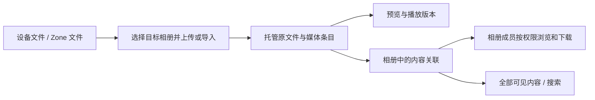

# BuckyOS Albums（共享相册）基础需求

## 1. 文档说明

- **文档版本**：V0.1 / 基础需求草案
- **更新时间**：2026-09-13
- **产品名称**：Albums
- **中文名称**：共享相册
- **目录名称**：`media_space`，作为文档归档目录，产品界面统一使用 Albums / 共享相册
- **产品定位**：汇集组织成员自己拍摄、录制的照片、视频和音频，按活动、项目或主题整理，在组织内部共同浏览、贡献和使用
- **文档范围**：常规基础能力、首版闭环、权限与内容生命周期；AI Native 特色需求由后续版本补充
- **文档性质**：产品目标与交互约束，不代表相关后端或系统集成已经实现

本文默认以一个 Zone 内的组织成员协作为首版边界；组织可以是团队、公司、社团或家庭。成员与用户组沿用 BuckyOS 身份体系，不新建一套组织通讯录。跨 Zone 协作和匿名外部分享后续再定义。

## 2. 产品定义与边界

### 2.1 核心定位

Albums 是大家共同保存与整理现场记录的地方。一次活动结束后，成员可以把各自拍摄的照片、视频，以及采访、讨论或现场录音放入同一个相册，其他成员不必在聊天记录和不同人的文件夹里反复寻找。

“相册”是用户熟悉的组织方式，也可以包含独立音频。产品中的通用操作使用“添加内容”“共 30 项”等文案；统计和筛选明确区分照片、视频、录音，不能把音频藏在附件区。

### 2.2 收录内容

| 类型 | 典型内容 | 基础体验 |
| --- | --- | --- |
| 照片 | 团队活动、生活记录、工作现场、考察照片 | 缩略图、放大查看、前后切换、拍摄信息 |
| 视频 | 活动片段、现场演示、成员拍摄的过程记录 | 封面、时长、播放、拖动进度、全屏 |
| 音频 / 录音 | 采访、会议、口述、环境及现场录音 | 独立卡片、标题、时长、播放、拖动进度、音量 |

内容可以由拍摄者本人上传，也可以由成员统一从手机、相机、录音设备或已有文件中导入。上传者与拍摄者/录制者是两个概念，不自动视为同一人。

### 2.3 与相邻产品的分工

| 产品 | 主要负责 |
| --- | --- |
| Albums | 用户或组织自己拍摄、录制的传统个人内容，围绕相册进行整理与内部共享 |
| Content Store / Library | 内容产品的发现、购买/获取与使用；包括其他渠道下载/导入的发行内容 |
| File Browser | 通用文件与目录管理、文件来源选择、存储位置操作 |
| Preview | 图片、视频、音频等内容的统一预览、播放与格式适配 |
| MessageHub | 围绕活动或内容进行沟通，承载用户主动分享的相册链接与后续消息集成 |

分类依据是内容用途和来源语境，不只看扩展名。例如，成员录制的现场视频属于 Albums，购买的发行影片属于 Content Store / Library。详细边界与 [Content Store PRD](../store/Content_Store_PRD_MVP.md) 保持一致。

Albums 基础版不承担商品购买、公开内容推荐、专业剪辑、通用文档管理或完整聊天功能。

## 3. 同类产品参考与取舍

参考核对日期：2026-09-13。以下只提取官方文档中可确认的基础模式，右栏是本产品的设计取舍，不表示复制其完整规则或限制。

| 参考产品 | 官方文档中的相关能力 | Albums 的取舍 |
| --- | --- | --- |
| Google Photos | 多人共享相册；从相册移除照片、视频与从照片库删除分开。[官方说明](https://support.google.com/photos/answer/6131416) | 按活动汇集多人内容；明确区分相册条目、托管原文件和导入来源 |
| Apple Photos Shared Albums | 邀请指定成员，并控制参与者是否可以添加照片、视频。[官方说明](https://support.apple.com/en-gb/108314) | 相册是明确的共享单位，贡献内容与管理成员是不同能力 |
| Immich | 同一实例内分享相册，区分编辑者与查看者。[官方说明](https://docs.immich.app/features/sharing/) | 采用组织内部身份和相册角色；基础版不引入匿名公共链接 |
| Synology Photos | 在自托管存储中区分个人与共享范围，提供文件夹和时间线浏览。[官方说明](https://kb.synology.com/en-us/DSM/help/SynologyPhotos/managing_photos?version=7) | 明确存放与共享范围，提供时间浏览；普通用户以相册为主，不必理解存储目录 |

本产品的基础重点是组织内部长期共享。独立录音按明确需求作为基础内容类型，与照片和视频共同参与相册、搜索、权限和下载；上述参考能力不代表这些产品均支持独立录音。

## 4. 用户与核心场景

| 用户 | 核心任务 | 典型场景 |
| --- | --- | --- |
| 活动或项目负责人 | 建立相册、选择共享成员、汇总资料 | 创建“秋季团建”“项目现场记录”，邀请成员上传 |
| 内容贡献者 | 快速提交自己拍摄、录制的内容，补充说明 | 手机上传照片，电脑导入相机视频、录音设备文件 |
| 浏览成员 | 找到某次活动的内容，查看、播放或下载 | 按日期、上传者、标签找到现场记录 |
| 组织内容管理员 | 接管无人管理的相册，处理误删与存储问题 | 负责人离开后继续保留活动资料，恢复误删条目 |

首版应完整跑通：负责人创建相册并授权 → 多名成员上传不同类型内容 → 大家按时间或条件浏览 → 查看/播放并按权限下载 → 持续补充和整理。

## 5. 基础版范围与优先级

### 5.1 P0：首版闭环

- 相册创建、名称/说明/封面修改、归档、回收与恢复。
- 当前 Zone 成员与用户组授权，相册管理者、贡献者、查看者三种角色。
- 从设备选择文件上传、桌面拖拽上传、从有权访问的 Zone 文件选择并导入。
- 批量上传进度、逐项结果、失败重试、重复内容提示。
- 照片、视频、录音混合展示与基础预览/播放。
- 相册列表、相册详情、全部可见内容的时间浏览。
- 基于已有元信息及人工填写内容的关键词搜索、类型/时间/上传者筛选。
- 说明、人工标签、相册封面、基础排序和个人收藏。
- 登录后可访问的内部链接，按相册控制原文件下载。
- 清晰的内容移除、删除、恢复与成员退出规则。
- 手机浏览与手动上传可用，桌面提供批量整理能力。

### 5.2 P1：基础体验增强

- 手机相机目录自动备份、后台持续上传、指定目录持续导入。
- 直接拍照、拍视频、录音并提交；P0 先接收已有文件。
- 上传断点续传和跨会话自动恢复；P0 至少支持明确重试。
- 简单评论、点赞、相册更新订阅及 MessageHub 通知。
- 批量下载打包、幻灯片播放、自定义拖拽排序。
- 地图浏览、更多相机格式的稳定转换、Live Photo 等复合媒体完整呈现。

### 5.3 本版不定义

- AI Native 特色功能及其交互，留待用户后续补充。
- 公开内容社区、工业内容推荐、内容购买与收费分发。
- 跨 Zone 联合相册、匿名上传、公共分享链接和外部访客权限。
- 专业照片编辑、视频剪辑、音频编辑、直播或实时协作制作。
- 复杂审批、数字版权管理、企业合规归档和素材商业授权系统。

自动备份属于后续能力。手动上传成功不表示设备全部内容已经备份；上传入口与结果不得使用“整机备份完成”等文案。

## 6. 核心概念与内容关系

| 概念 | 含义 |
| --- | --- |
| 相册 Album | 按活动、项目或主题组织内容的集合，也是基础版的共享和协作单位 |
| 媒体条目 | 一项照片、视频或独立录音，关联托管原文件和预览版本 |
| 相册条目 | 某媒体加入一个相册形成的关联；可以有该相册中的说明、标签和排列位置 |
| 托管原文件 | 用户上传/导入后由当前 Zone 保存的文件，预览压缩或转换不覆盖它 |
| 预览版本 | 缩略图、视频封面、适合播放的派生文件；生成失败不等于原文件丢失 |
| 共享成员 | 获得相册权限的当前 Zone 用户，或内部用户组中的有效成员 |
| 收藏 | 当前用户自己的查看标记，不增加权限，不改变其他人的相册内容 |

一个媒体可以加入多个相册，不要求重复上传原文件。各相册的成员、说明、标签和排列独立；用户只看到自己有权访问的相册关联。同名文件不能作为内容相同的判断依据。

“全部内容”是当前用户有权查看的相册内容的汇总视图，不是一个新的公共媒体库。同一媒体在汇总视图去重，在具体相册中按该相册的条目展示。

汇总视图默认使用原文件名和原始拍摄/录制信息；相册内修改的标题、说明、标签与展示时间只作用于该相册。搜索可匹配用户可见相册中的这些信息，结果注明匹配的相册来源；不能为了去重而混入无权访问相册中的说明或标签。

## 7. 组织共享与权限

### 7.1 默认规则

- 新相册默认“仅管理者可见”，创建者成为首位管理者。创建时可主动选择指定成员、用户组或组织全员，发布前展示最终可见范围。
- 组织成员身份不自动赋予所有相册的访问权。“组织全员可见”必须显式选择，默认角色为查看者。
- 成员添加到相册后获得相应角色；P0 不另做一套邀请账号或好友确认流程。尚未加入 Zone 的人先走系统成员流程。
- 内部链接只用于定位相册或条目，不携带额外授权。转发链接不改变访问范围。
- 用户组授权随有效组成员变化；多个有效授权取能力并集。撤销其中一个授权时，界面应说明仍存在的其他授权来源。
- 未授权用户不能通过相册封面、搜索、数量统计、文件信息、缩略图或原文件链接看到内容。

### 7.2 相册角色

| 操作 | 查看者 | 贡献者 | 相册管理者 |
| --- | --- | --- | --- |
| 浏览、播放、查看可见信息 | 可以 | 可以 | 可以 |
| 收藏内容 | 可以，仅自己可见 | 可以，仅自己可见 | 可以，仅自己可见 |
| 下载原文件 | 取决于相册下载设置 | 取决于相册下载设置 | 可以 |
| 上传/导入到当前相册 | 不可以 | 可以 | 可以 |
| 修改条目标题、说明、标签与展示信息 | 不可以 | 仅自己添加的条目 | 当前相册全部条目 |
| 从当前相册移除条目 | 不可以 | 仅自己添加的条目 | 当前相册全部条目 |
| 修改相册信息、封面、归档状态 | 不可以 | 不可以 | 可以 |
| 添加成员、调整角色和下载设置 | 不可以 | 不可以 | 可以 |
| 将当前相册内容添加到另一共享相册 | 不可以 | 不可以 | 同时具有目标相册贡献权限时可以 |
| 恢复相册内移除的条目 | 不可以 | 不可以 | 可以 |
| 删除/恢复整个相册 | 不可以 | 不可以 | 可以 |

- 原文件下载默认允许相册成员使用，管理者可关闭；关闭后保留浏览/播放能力。它控制产品提供的原文件下载功能，不承诺阻止成员保存已经看到的内容。
- 相册管理者只能调整本相册的内容关联，不能借此删除同一媒体在其他相册的记录或改变其他相册的成员。
- 同一媒体可通过多个有效相册获得访问权。汇总视图中的编辑、移除和下载应明确所用的相册来源，并按该来源校验操作权限；一处相册的授权变化不自动撤销另一处仍有效的授权。
- 相册至少保留一位有效管理者。最后一位管理者退出前需交接；账号停用等异常由具备系统授权的组织内容管理员接管。
- 组织内容管理员是系统授予的管理职责，可以处理相册接管、组织范围的恢复和永久删除；普通相册管理者不自动获得此权限。相关操作保留记录。

### 7.3 共享内容的连续保留

- 上传到共享相册或将已有内容加入共享相册前，明确展示目标相册和共享范围。
- 共享相册由当前 Zone 持续托管。成员离开相册、退出组织或账号停用，不自动删除其已提交内容，也不要求其他成员另存一份才能继续使用。
- 权限撤销后停止后续读取、播放请求和下载；已打开的页面在收到权限变化或下一次请求时退出对应内容。已经下载到设备的副本无法远程收回。
- 原文件、预览、搜索与下载使用相同的授权范围。相册设为内部可见时，不能把文件放到无需鉴权的公共地址来实现播放。

## 8. 信息架构与基础页面

| 入口 / 页面 | 主要内容 | 关键操作 |
| --- | --- | --- |
| 相册（默认首页） | 我能访问的相册；筛选全部、与我共享、我管理、已归档 | 创建相册、搜索、进入相册 |
| 相册详情 | 封面、名称、说明、成员范围、照片/视频/录音数量、内容网格 | 添加内容、筛选、浏览、按角色整理与管理 |
| 全部内容 | 当前有权查看的媒体，按拍摄/录制时间聚合 | 时间浏览、搜索、类型与上传者筛选 |
| 我的收藏 | 仍有权限访问的收藏内容 | 浏览、取消收藏 |
| 媒体查看器 | 当前照片、视频或录音，以及信息侧栏 | 上一项/下一项、播放、收藏、下载 |
| 上传任务 | 当前批次的逐项进度与结果 | 重试失败项、取消未完成项、查看已完成内容 |
| 回收站 | 有权管理的已移除条目或已删除相册 | 查看影响、恢复；永久删除仅向组织内容管理员开放 |

- Header 展示产品名、当前组织/Zone 的可读名称、搜索和上传任务入口；标识符不放在普通用户的主操作区。
- 相册卡片展示封面、名称、最近更新、内容数量与共享范围；仅音频相册使用录音类型封面。
- 相册内保留当前分类、排序和滚动位置；关闭查看器后回到原位置。
- 不把相册做成多层文件夹。首版使用平铺相册、名称、时间和标签完成组织，项目层级容器后续按实际需求扩展。

## 9. 主要用户流程

### 9.1 建立一个组织活动相册

1. 负责人选择“创建相册”，填写名称、说明和可选活动日期。
2. 选择共享范围，给需要上传的成员设置贡献者，其余成员设置查看者。
3. 保存后进入相册，页面清楚显示谁可以看、谁可以添加。
4. 复制内部链接，用户可自行通过 MessageHub 等沟通渠道发送。
5. 成员登录后打开链接，按角色查看或贡献内容。

### 9.2 多人汇集照片、视频和录音

1. 成员进入有贡献权限的相册，点击“添加内容”。
2. 选择设备文件或 Zone 文件，可在同一批次混合选择照片、视频和录音。
3. 确认目标相册与共享范围，开始上传/导入。
4. 每项独立显示上传、保存、预览生成和结果；成功项及时出现，失败项可单独重试。
5. 成员为需要说明的条目填写标题/说明或标签；这些字段不是提交全部内容的必填门槛。
6. 其他成员刷新或收到更新后看到新增内容，不必等待整个批次结束。

### 9.3 浏览、查找与使用

1. 用户从相册或全部内容进入，按日期、类型、上传者或关键词定位。
2. 点击照片查看大图；点击视频或录音主动开始播放。
3. 在同一查看器内前后切换，顺序来自进入时的列表。
4. 有下载权限时获取原文件；也可复制需要登录的内容链接。
5. 关闭查看器，回到原筛选和浏览位置。

### 9.4 交接与误删恢复

1. 负责人将另一位有效成员设为相册管理者，再退出或调整自己的角色。
2. 已提交内容保持可用，移除成员只影响该成员的后续访问。
3. 条目被误移除时，管理者在回收站恢复到仍有效的目标相册。
4. 若原相册或原共享范围已变化，恢复前重新确认目标；不自动恢复已撤销的成员权限。

## 10. 上传、导入与存储

### 10.1 入口与文件处理

- 所有上传必须有明确目标相册；从首页上传时先选择或创建相册，不能静默放入组织全员可见位置。
- P0 支持设备多文件选择、桌面拖拽和通过系统文件选择能力导入 Zone 内可读文件。批量目录扫描和持续同步不属于这一入口的默认行为。
- 导入按独立托管副本处理：后续移动、删除设备或来源目录中的文件，不应使已成功入库的相册内容失效。底层可复用存储，但产品必须保证这一保存语义。
- 选择成功不等于入库成功。只有原文件完整保存、内容记录与相册关联提交成功后才显示“已保存”；预览可在其后生成。
- 原文件保留原始质量与文件名信息，预览派生版本另存。不得为了生成缩略图或播放版本覆盖原文件。

### 10.2 任务与失败

- 批次展示总数、成功/失败/重复数量、总进度；单项展示当前阶段和可理解的失败原因。
- 同一相册内完全相同的内容提示“已在相册中”，允许跳过并查看已有项；相似照片不自动合并或删除。
- 查重仅反馈用户有权知道的内容，不暴露其他无权访问相册中的重复文件。
- 文件过大、空间不足、格式不支持、网络中断、权限被撤销分别提示；实际限制在选择或上传前可见，不凭空承诺无限存储。
- 重试只处理失败项，不复制已成功项。取消上传不删除同批次已经保存成功的内容。
- 传输未结束时关闭页面可能中断，应提示；不承诺后台继续。原文件已由服务端接收、正在生成预览时，关闭查看页面不取消已接受的任务。

### 10.3 格式基线

| 类型 | 基础验证样本 | 不可直接预览时的处理 |
| --- | --- | --- |
| 图片 | JPEG、PNG、WebP | 显示类型封面与元信息，保留原文件；有系统转换能力则生成预览 |
| 视频 | MP4（H.264 / AAC） | 区分容器与编码支持情况；播放失败说明原因，不影响已保存状态 |
| 音频 | MP3、M4A（AAC）、WAV | 提供独立音频播放器；不能播放时保留标题、时长等已知信息与下载入口 |
| 常见设备扩展格式 | HEIC/HEIF、MOV/HEVC 等 | 至少保留可接收的原文件，预览能力依系统管线；未接入时如实提示 |

以上是目标验证样本，不是对全部浏览器和编码组合的兼容承诺。实际接受范围须在实现时形成可核验的能力表；无法接收的类型在上传前说明。RAW、Live Photo 的专有语义不作为 P0 必须完整呈现的要求。

## 11. 浏览、播放与元信息

### 11.1 统一卡片与查看器

- 照片卡片以缩略图为主；视频额外显示播放标识与时长；录音使用明确音频图标、标题、时长，不能伪装成加载失败的图片。
- 点击打开统一查看器。桌面支持大图、信息侧栏与键盘左右切换；手机采用全屏查看和自然手势。
- 视频与录音默认不自动出声，一次只播放一个内容。切换条目或关闭查看器时停止前一项播放。
- 图片支持缩放和平移；视频和录音支持播放/暂停、进度、音量，视频支持全屏。波形不是音频可用的前置条件。
- 查看器的上一项/下一项只遍历进入时有权限的结果；内容被删除或权限改变后及时更新，不跳入无关文件。
- 收藏仅作用于当前用户，权限失效后不继续通过收藏暴露内容。

### 11.2 信息与人工整理

| 信息 | 要求 |
| --- | --- |
| 名称与说明 | 默认使用文件名，可补充相册内标题与说明 |
| 拍摄/录制时间 | 有可靠元信息时读取；允许有权整理者在相册内修正展示时间，并保留原值 |
| 上传时间与上传者 | 由系统记录，不因修改展示时间而改变 |
| 拍摄者/录制者 | 可人工补充；未知则留空，不根据上传者或画面猜测 |
| 基本规格 | 类型、大小，已知的分辨率、时长等；无法读取时显示未知 |
| 位置与设备信息 | 有元信息时在详情展示，缺失不补造；不作为上传必填项 |
| 标签 | 首版人工添加，用于主题、项目、地点等整理；不要求自动生成 |

时间线默认按拍摄/录制时间展示；缺失时使用上传时间并标明“按上传时间”。时区未知时保留原始时间语义，不伪装成精确的跨时区排序。相册活动日期用于描述活动，不覆盖每项媒体的拍摄时间。

## 12. 搜索、筛选与排序

- 全局搜索只检索当前用户有权访问的相册与内容；相册内搜索默认限定当前相册，并可主动扩大范围。
- P0 搜索字段：相册名、文件名、人工标题/说明、人工标签、上传者及已填写的拍摄者/录制者。
- 筛选：照片/视频/录音、拍摄或上传日期范围、上传者、相册、收藏。
- 相册默认按最近更新排序；媒体默认按拍摄/录制时间排序，可切换上传时间和正序/倒序。
- 无结果时展示当前条件并提供清空入口。切换视图、打开后返回应保留查询与位置。
- 基础版不把录音内容、视频对白或图片中文字当作已建立的全文索引；不依赖尚未定义的 AI 功能完成基础查找。

## 13. 内容整理、删除与恢复

| 动作 | 影响 | 基础规则 |
| --- | --- | --- |
| 从当前相册移除 | 移除当前相册条目 | 条目进入回收站，其他相册不受影响；不删除设备或导入来源文件 |
| 添加到另一相册 | 建立新的相册关联 | 校验源相册管理权限和目标贡献权限，确认新的可见范围；不把源相册成员一起复制过去 |
| 归档相册 | 从活跃相册列表移到已归档 | 内容仍可查看，暂停普通新增与整理；管理者可取消归档 |
| 删除相册 | 相册及其关联进入回收站 | 普通成员不再访问该相册；同一媒体在其他有效相册中的记录继续存在 |
| 恢复 | 恢复指定条目或相册 | 校验当前成员、目标和权限，不恢复已经撤销的授权 |
| 永久删除托管媒体 | 清理产品保存的原文件及派生内容 | 仅组织内容管理员可执行；先展示受影响相册与数量，明确确认 |

- 回收站默认保留 30 天，并展示到期时间；这是基础版的暂定产品规则。恢复不自动把内容设为组织全员可见。
- 从最后一个相册移除的媒体在回收保留期内仍可恢复，不直接清除原文件。无有效相册关联且所有相关回收记录到期后，才可清理托管文件。
- 仍有有效相册引用的原文件，不因另一相册的移除记录到期而删除。
- 同一内容存在多处有效关联时，全局永久删除必须列明影响；相册管理者的日常移除不能代替这一操作。
- 删除/恢复记录包含操作者、时间、对象与动作。界面不以“移出相册”文案执行不可恢复的全局删除。

## 14. 状态与关键边界

| 状态 / 情况 | 用户可见表现与操作 |
| --- | --- |
| 空相册 | 显示说明和共享范围；有贡献权限者看到添加入口，查看者看到等待内容提示 |
| 上传中 / 导入中 | 逐项进度与取消入口，不显示已完成 |
| 已保存，预览生成中 | 条目与类型占位可见；有权限可下载原文件，预览稍后更新 |
| 已就绪 | 可浏览/播放，并显示实际可用操作 |
| 保存失败 | 明确未保存及原因，可重试；其他成功项保留 |
| 预览失败或暂不支持 | 原文件保存状态保留，可查看信息、按权限下载或重试预览 |
| 处理期间权限撤销或相册归档 | 停止新增内容提交，说明原因；已提交内容不自动删除，未提交文件不对成员发布 |
| 内容被删除或访问撤销 | 列表与查看器更新，显示内容不可用，不通过旧链接绕过 |
| 多人同时修改相册设置 | 避免静默覆盖，提示设置已变化并展示最新结果 |

相册卡片、内容卡片、查看器、上传任务和回收站中的数量及状态应一致。预览不可用不能把已成功保存的内容伪装成上传失败，也不能把“任务已提交”当作“内容已保存”。

## 15. 跨端与基础质量要求

- 遵循 BuckyOS 的移动优先方向。手机必须能完成进入相册、手动上传、照片查看、视频/录音播放和分享范围查看；桌面增强拖拽、多选与批量整理。
- 大相册使用分页或渐进加载、缩略图按需加载，不能首次进入即下载全部原文件。
- 内容网格和时间线需能处理大量媒体；基础验证至少包含 100 个相册、单相册 1,000 项以及照片/视频/录音混排。这是验收样本规模，不表示当前已达到性能指标。
- 中文、英文界面都应容纳长相册名、长文件名与清楚的权限文案；核心操作有可读标签，状态不只依赖颜色。
- 断网时说明当前连接情况，已缓存的界面不冒充上传成功；需要在线鉴权的操作不能声称已完成。
- 上传、预览生成与批量任务不能阻塞继续浏览。首屏、缩略图和播放起播的具体性能指标在原型及目标设备确定后补充。

## 16. 与 BuckyOS 系统能力的协作

以下是集成方向；接口、权限映射与实际能力须在实现阶段核对，不在本 PRD 中另造协议或宣称集成已完成。

| 系统能力 | Albums 的使用方式 | 依据 |
| --- | --- | --- |
| Users & Agents / 系统身份与授权 | 选择当前 Zone 用户和内部用户组，复用身份、成员停用及授权来源 | [Users & Agents PRD](../users_and_agents/Users_Agents_PRD.md) |
| File Browser / 系统文件选择 | 导入当前用户有权读取的来源文件；Albums 负责相册组织与托管结果 | [File Browser PRD](../bucky_file/filebrowser_PRD.md) |
| Preview Component / Pipeline | 复用图片、视频、音频渲染与格式转换；Albums 提供源内容和浏览上下文 | [Preview PRD](../bucky_file/BuckyOS%20Preview%20App-Component%20PRD.md) |
| 系统分享窗口 | 复用内部资源链接和成员选择；相册权限仍由 Albums 与系统授权共同约束 | [Share Content 说明](../control_panel/share_content.md) |
| Task Center / TaskManager | 已进入服务端的持久处理任务接入统一任务体系，Albums 展示同一任务的业务进度；浏览器本地传输不伪装成后台任务 | [Task Center PRD](../task_center/TaskCenter_mgr.md) |
| MessageHub | 基础版提供可由用户发送的内部链接，后续再接入相册更新通知 | [MessageHub PRD](../message_hub/MessageHub_Web_UI_PRD.md) |

## 17. 功能需求清单

| 编号 | 需求 | 优先级 | 验收重点 |
| --- | --- | --- | --- |
| AL-01 | 相册创建、信息与封面管理 | P0 | 仅音频相册同样可创建和展示 |
| AL-02 | 相册成员、用户组与三种角色 | P0 | 默认范围明确，查看与贡献权限分开 |
| AL-03 | 设备上传与 Zone 文件导入 | P0 | 照片、视频、录音共用入口，托管结果独立于来源 |
| AL-04 | 批量任务、逐项结果与失败重试 | P0 | 部分失败不影响成功项，重试不重复入库 |
| AL-05 | 原文件保留与预览状态分离 | P0 | 预览失败不丢失已保存文件 |
| AL-06 | 相册、全部可见内容与个人收藏 | P0 | 所有入口遵循相同可见范围 |
| AL-07 | 图片查看与视频/音频播放 | P0 | 录音不是附件，前后切换保留浏览上下文 |
| AL-08 | 说明、标签、拍摄信息与排序 | P0 | 上传者与拍摄者区分，缺失时间有明确 fallback |
| AL-09 | 关键词搜索与基础筛选 | P0 | 支持混合媒体，仅返回有权访问的内容 |
| AL-10 | 内部链接与原文件下载控制 | P0 | 链接不授予权限，撤销覆盖所有内容入口 |
| AL-11 | 多相册关联与范围确认 | P0 | 新相册权限独立，源相册条目不被移动或删除 |
| AL-12 | 移除、归档、回收与恢复 | P0 | 其他相册引用不受误伤，恢复不重开已撤销权限 |
| AL-13 | 管理者交接与成员退出 | P0 | 无人管理可接管，离开不自动删除已提交内容 |
| AL-14 | 手机完整基础流程、桌面批量操作 | P0 | 三类内容均覆盖手动上传和查看 |
| AL-15 | 自动备份与持续导入 | P1 | 独立定义授权目录、后台行为与同步语义 |
| AL-16 | 评论、点赞、更新通知 | P1 | 不影响基础汇集与共享闭环 |
| AL-17 | 批量打包下载与增强呈现 | P1 | 实际能力完成后再展示对应入口 |

## 18. 基础验收与设计交付

### 18.1 必须覆盖的场景

1. 创建默认相册，仅管理者能看到；明确选定成员后，查看者可浏览但不能上传，贡献者可以添加，普通成员不能发现相册及其内容。
2. 三位成员分别上传照片、视频和录音到同一相册；三类内容均有正确卡片、数量、详情与播放/查看入口。
3. 一个批次部分失败，成功项正常可用，重试失败项不重复生成条目；预览失败与上传失败能清楚区分。
4. 同名不同内容分别保存，完全相同内容在目标相册提示重复；不泄露其他无权访问相册中的文件信息。
5. 缺少拍摄时间或录制者时，按已知信息展示和排序，不把上传者冒充拍摄者，也不生成虚假元信息。
6. 内部链接转给未授权用户后无法读取；撤销成员或用户组授权后，搜索、缩略图、查看器和后续原文件请求同步失效。有其他有效授权时如实保留并说明。
7. 内容加入两个相册，从其中一个移除并恢复，只影响该相册；最后一个关联被移除后仍可在保留期内恢复。
8. 导入成功后删除或移动来源文件，相册内托管内容仍可用；清理一个相册不能删除另一个相册仍引用的原文件。
9. 上传者或管理者退出组织，已提交共享内容仍保留；相册能够交接或由授权管理员接管。
10. 手机完成三类内容手动上传、查看和播放，桌面完成多选整理；内容量增大时使用渐进加载。

### 18.2 首轮设计画面

| 画面 | 需要表达的状态 |
| --- | --- |
| 相册首页 | 有相册、无相册、与我共享、已归档 |
| 创建/管理相册 | 名称、共享对象、角色、下载设置、仅管理者/指定成员/全员可见 |
| 相册详情 | 三类内容混排、仅音频相册、查看者与贡献者操作差异 |
| 添加内容与上传任务 | 文件来源、共享范围、混合批次、重复、部分失败、预览生成中 |
| 媒体查看器 | 照片、视频、录音三种状态，信息侧栏与前后切换 |
| 时间浏览与搜索 | 日期分组、混合结果、筛选、空结果、权限变化 |
| 回收站与恢复 | 条目/相册区别、保留时间、影响范围、恢复目标 |

基础验证指标包括上传/导入成功率、预览/播放成功率、共享相册中多成员贡献比例、查找到内容的任务完成率、误删恢复成功率。指标分清原文件保存与预览生成，不把两者合并为一个成功状态。

## 19. AI Native 需求预留

本节待用户后续补充。本版不预设 AI 功能清单、操作入口或验收指标；基础上传、整理、搜索、共享与播放应当独立可用。

后续需求在明确后扩展本文。原始内容、人工填写的信息、来源与权限需保持可辨认，避免后续扩展改变现有共享范围或覆盖用户原始记录。

## 20. 暂定产品决策

- 名称确定为 Albums / 共享相册，照片、视频、录音均为基础内容类型。
- 首版聚焦单 Zone 内部共享，以相册授权；不假定组织全员可以浏览全部内容。
- P0 采用手动上传与文件导入，移动端基础流程必须可用；自动备份为 P1。
- 内容采用持续托管语义，共享提交与成员身份生命周期分开。
- 回收站暂定 30 天；格式能力及性能数字在实现设备与系统集成明确后补齐。
- AI Native 特色由后续需求补充，不阻塞本基础版评审。
