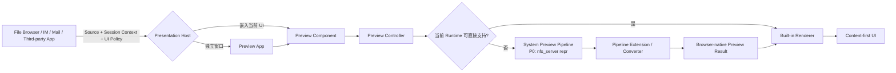
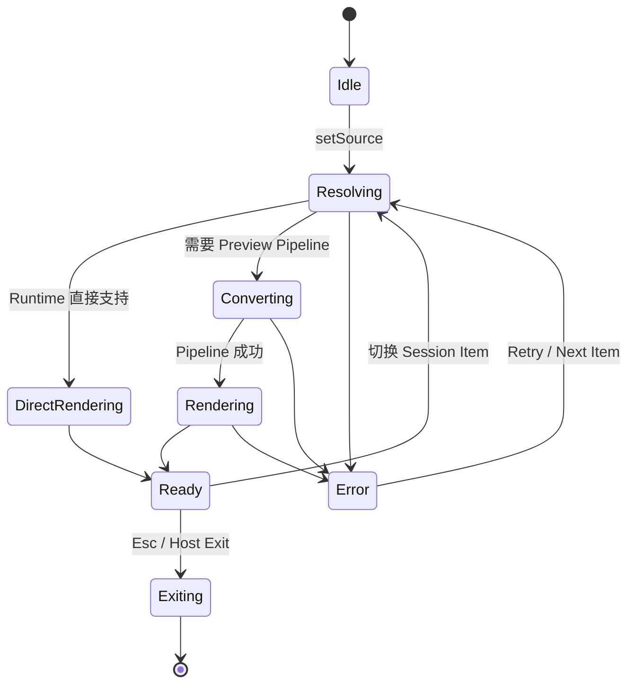
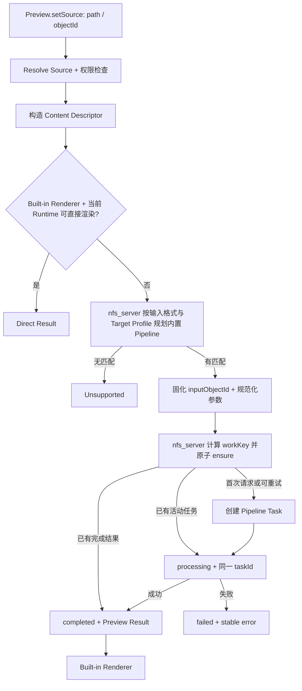

# BuckyOS Preview App / Component PRD

> 文档状态：Draft v1.0  
> 日期：2026-09-04  
> 适用对象：BuckyOS 产品、系统 UI、Runtime、NDN/CFS、App Framework、第三方开发者  
> 本文中的 **Preview** 统一指系统级内容预览能力；**Preview Component** 指可嵌入组件；**Preview App** 指系统自带的独立预览应用。
> 应用扩展的后续统一机制见 [BuckyOS 内容扩展机制（Content Extension）](../../doc/sdk/context%20ext.md)；Preview 首版不启用其中的应用 `preview` Handler。

---

## 1. 产品摘要

BuckyOS Preview 是系统自带、可扩展的通用内容查看能力，用于快速查看传统文件、CYFS URL所指向的内容，以及 BuckyOS NDN 体系中的NamedObjectId。

Preview 不是某一种文件格式的专用阅读器，而是 BuckyOS 内容消费层的基础设施。它由三部分共同构成：

1. **Preview Component**：可嵌入第三方 App UI 的系统级内容查看组件；
2. **Preview App**：基于 Preview Component 实现的独立系统应用，也是未安装第三方专用软件时的默认内容打开器；
3. **Preview Pipeline**：系统级、可扩展的内容处理管线，将 Preview 无法直接消费的原始格式，转换为浏览器或当前 Runtime 可稳定展示的标准内容。

核心体验是：

- 内容优先，默认尽可能不出现多余 UI；
- 同一种内容在 File Browser、IM、Mail 和第三方 App 中获得一致的预览能力；
- 系统只需为新格式增加 Preview Pipeline，即可让所有使用 Preview Component 的应用同步获得“至少能看”的能力；
- Preview 追求尽可能保真，但不承诺对所有格式 100% 保真；
- 专用第三方 App 负责完整打开、编辑与百分之百格式语义支持。

---

## 2. 背景与问题

传统桌面系统中，文件管理器、IM、邮件、协作软件和浏览器常常各自内嵌一套文件查看器。这会导致：

- 系统文件管理器已经可以查看某种文件，但 IM 中仍无法预览；
- 同一内容在不同 App 中的格式支持、交互和呈现质量不一致；
- 每个 App 重复开发图片、文档、音视频查看器；
- 新格式接入成本高，扩展能力无法被系统内所有 App 复用；
- UI 充斥工具栏、状态栏和菜单，内容本身反而不是视觉中心；
- “当前打开内容”与“内容来自哪个会话、目录或选择集合”混在一起，导致上一项、下一项行为不稳定。

BuckyOS 的内容体系天然围绕 Named Data Object、内容创建、发布、流转和消费展开，因此需要在系统层建立统一、稳定、可扩展的内容预览架构。

---

## 3. 产品目标

### 3.1 核心目标

1. 为 BuckyOS 提供统一的系统级内容查看能力。
2. 让 Preview Component 可以被 File Browser、IM、Mail、协作工具和第三方 App 直接嵌入。
3. 让 Preview App 成为系统默认的快速内容打开器和兜底查看器。
4. 建立可扩展的 Preview Pipeline，使系统新增一种格式支持后，所有宿主 App 同步获得该能力。
5. 建立统一、可学习、符合主流习惯的内容交互模型和快捷键模型。
6. 将单个内容引用与 Session Context 分离，稳定支持上一项、下一项和多内容浏览。
7. 在桌面多窗口环境中提供合理的窗口复用、新建和数量控制策略，避免窗口爆炸，同时支持并排比较。

### 3.2 成功标准

- 第三方 App 只需提供显示区域、内容 Source 和可选 Session Context，即可嵌入一致的系统预览体验。
- 某种格式一旦注册系统 Preview Pipeline，File Browser 与使用 Preview Component 的 App 无须各自升级即可预览。
- 常见内容在系统未安装专用第三方 App 时，仍可做到“点开即看”。
- 默认界面以内容为中心，不因 Viewer 自身 UI 干扰用户。
- 多选文件、IM 会话、ZIP 容器和普通文件夹中的上一项、下一项行为符合用户进入 Preview 时的上下文。
- 自动打开大量内容时不会生成失控数量的 Preview App 窗口。

---

## 4. 非目标

以下内容不属于 Preview v1 的核心职责：

1. 不为所有格式提供完整编辑能力。
2. 不承诺经转换后的 Preview 与专用应用 100% 像素级一致。
3. 不取代针对特定格式开发的专业 App。
4. 不在 Preview Component 内实现插件安装、扩展市场或格式包管理。
5. 不由 Preview Component 管理桌面窗口、应用实例和跨窗口调度。
6. 不在 v1 中提供两个文件的语义 Diff 或结构化差异计算；多窗口并排查看是 Diff 工作流的基础能力，但不是差异算法本身。
7. 不允许 Preview 绕过源内容本身的访问控制、加密策略或对象权限。
8. 首版不接入 AppDoc `content_handlers`、`system/content_registry` 或第三方 App 提供的 Preview converter / renderer；这些能力按 Content Extension 机制后续启用。

---

## 5. 核心概念与术语

| 术语 | 定义 |
|---|---|
| Preview Component | 系统提供的可嵌入 UI 组件，负责在指定区域中展示内容并处理标准交互。 |
| Preview App | 使用 Preview Component 构建的系统独立应用，拥有独立窗口和完整 App 生命周期。 |
| Preview Pipeline | 系统内容处理管线，将原始内容转换为 Preview Component 可消费的内容；首版 Provider 为 `nfs_server repr`。 |
| Preview Renderer | Preview Component 内针对图片、SVG、HTML、文本、音频、视频等标准类型的渲染实现。 |
| Content Source / Source | 当前需要打开的内容引用，核心支持 CYFS URL 与 Object ID。 |
| Session Context | 当前内容所在的浏览上下文，用于定义 Session Items、顺序、上一项和下一项。 |
| Session Item | Preview 会话中的一个可浏览内容项。 |
| Container | 能够枚举一组 Session Items 的容器，例如文件夹、ZIP 内目录或某个对象集合。 |
| Full App | 针对某种格式设计的专用应用，能完整打开、编辑和保存该格式。 |
| Browser-native Content | 当前 Web Runtime 或浏览器能够直接展示的标准内容。 |

---

## 6. 产品原则

### 6.1 内容优先

Preview 首先展示内容，而不是展示“一个查看器软件”。默认情况下，内容应尽可能占满宿主提供的可用区域，不显示无必要的标题栏、工具栏、状态栏和按钮。

### 6.2 系统统一，而非 App 重复实现

格式识别、标准 Preview 行为和基础呈现由系统统一提供。宿主 App 只决定 Preview 放在哪里、何时打开以及采用何种展示策略。

### 6.3 稳定内核、可扩展管线

Preview Component 只消费有限、稳定的标准内容类型。新格式支持通过系统 Pipeline 扩展，而不是把每一种格式的解析器直接塞入组件。

### 6.4 尽可能保真，但不虚假承诺

Preview 的目标是让用户快速、正确地理解内容。格式转换可能丢失字体、版式、动画、复杂交互或专有元数据。需要完整语义和编辑能力时，应交给 Full App。

### 6.5 尊重主流操作习惯

Preview 不发明无必要的新交互。鼠标、触控板、触摸和快捷键应尽量遵循对应内容领域和运行平台的主流习惯。

### 6.6 上下文决定导航

“上一项”和“下一项”由打开动作附带的 Session Context 决定，不能仅根据当前文件路径或类型猜测。

### 6.7 宿主控制呈现，组件控制内容体验

宿主 App 决定独立窗口、Overlay、Pop-up、侧栏或固定区域；Preview Component 负责区域内部的渲染、手势、快捷键和标准操作。

---

## 7. 总体架构



### 7.1 职责边界

| 模块 | 负责 | 不负责 |
|---|---|---|
| Preview Component | 内容展示、标准交互、UI 模式、Session 内导航、触发 Pipeline、结果渲染、错误呈现 | 创建窗口、选择复用哪个 App 窗口、安装扩展、编辑原始格式 |
| Preview App | 独立窗口、系统默认打开、窗口策略、App 级菜单、跨窗口调度、全局设置 | 自己重新实现格式转换和渲染内核 |
| Preview Pipeline（P0: `nfs_server repr`） | 格式识别、能力匹配、转换、缓存、返回标准 Preview 结果 | 决定宿主 UI、创建窗口、提供完整编辑体验 |
| Host App | 提供 Source、显示区域、Session Context、展示模式和可选宿主动作 | 重复实现系统已经提供的格式查看器 |
| Full App | 完整格式语义、编辑、保存、专业工作流 | 作为系统统一 Preview 管线的替代品 |

---

## 8. 系统对内容格式的支持级别

### Level 0：Unsupported

- 当前 Runtime 无法直接展示；
- 系统中没有匹配的 Preview Pipeline；
- 也没有能完整打开该格式的 Full App。

用户结果：显示“暂不支持预览”，并提供可用的后续动作，例如“使用其他应用打开”“安装支持组件”或“查看内容信息”。

### Level 1：Preview Supported

- 内容可以直接由 Runtime 展示；或
- 内容可以经过 Preview Pipeline 转换为标准 Preview 结果。

用户结果：至少可以查看。系统追求较高还原度，但不承诺全部语义、版式和交互完整。

### Level 2：Full App Supported

- 系统安装了针对该格式的专用应用；
- 能完整理解该格式并支持打开、编辑、保存等能力。

用户结果：可通过“使用专用应用打开”进入完整体验。Preview 仍可作为快速查看入口。

### 8.1 能力随 Runtime 演进

Preview 的直接支持格式不是永久写死的。若某格式过去需要 `A → B` 转换，而后续 Runtime 已能直接打开 A，则系统应优先直接展示，并允许原 Pipeline 扩展自然退役。

能力判断顺序：

1. 当前 Preview Renderer 与 Runtime 是否直接支持源内容；
2. 是否存在匹配的 Preview Pipeline；
3. 是否存在 Full App；
4. 若均无，进入 Unsupported。

---

## 9. Preview Pipeline

### 9.1 定位

Preview Pipeline 是系统级内容归一化管线。其职责是把任意已支持的原始内容转换为 Preview Component 可以稳定消费的标准结果。

**首版部署边界**：只使用系统内建 Pipeline，并全部由 `nfs_server` 实现和执行。Preview Component 不调用第三方 App converter，不读取 `system/content_registry`，也不自行运行转换命令。这里的“可扩展”指协议和数据模型预留，不代表首版开放应用扩展。

示例：

```text
自定义视频格式 → Preview Pipeline → MP4/WebM → Video Renderer
PSD              → Preview Pipeline → PNG/WebP → Image Renderer
专有文档格式       → Preview Pipeline → HTML/PDF/Page Images → Document Renderer
特殊音频格式       → Preview Pipeline → Runtime 支持的音频流 → Audio Renderer
```

### 9.2 Preview Component 的标准结果类型

v1 至少支持以下结果族：

1. **Raster Image**：PNG、JPEG、WebP、AVIF 等当前 Runtime 可用格式；
2. **SVG**；
3. **Plain Text**；
4. **HTML / Rich Text**；
5. **Audio**：当前 Runtime 原生支持的格式或流；
6. **Video**：当前 Runtime 原生支持的格式或流；
7. **PDF**：P0 保留原始 PDF，通过专用 `PDFIframeRenderer` 交给 Runtime 内置 PDF Viewer 展示；
8. **Preview Manifest**：描述多页、分片、渐进加载、封面、元数据和备用结果的标准清单。

> 原始格式可以很多，但进入 Preview Component 的内容类型应保持有限和稳定。

### 9.3 Pipeline 输入

Host 仍只传入 `CYFS Path` 或 `Object ID`。Preview 在调用 Pipeline 前必须先通过 Source Resolver 将其解析为稳定的输入描述；**未解析的可变 path 不得直接作为转换任务或缓存的身份**。

Pipeline 请求至少包含：

- 原始 Source：用于显示来源、重新授权和错误定位；
- `inputObjectId`：待处理字节内容的不可变 Object ID。若 Source 是 path，进入 Pipeline 前必须先固化或锚定为 Object ID；
- 受当前调用者权限约束的读取引用或 Capability，不能把长期凭证写入任务参数；
- 已知媒体信息：MIME、扩展名、对象类型、大小、版本、Hash 等；
- Preview Component 当前可接受的结果类型；
- 显示区域与像素密度；
- 请求用途：`preview` 或 `thumbnail`；
- 质量偏好：快速首屏、平衡、最高可用质量；
- 安全上下文与读取凭证；
- 可选页码、时间段、分片或区域参数。

### 9.4 Pipeline 输出

成功结果至少包含：

- 结果类型；
- 可读取的结果引用或流；
- 原始 Source 版本标识；
- 宽高、时长、页数等媒体信息；
- 保真度或降级说明；
- 是否支持流式、分页或渐进加载；
- 可缓存策略与有效期；
- 可选备用结果。

失败结果至少区分：

- 不支持该格式；
- 没有可用 Pipeline；
- 内容损坏；
- 权限不足；
- 转换超时；
- 转换器异常；
- 资源过大或当前设备能力不足；
- 结果格式与 Runtime 不兼容。

### 9.5 内置注册与未来扩展匹配

首版由 `nfs_server` 维护只读的系统内建 Pipeline Catalog，安装 App 不会改变候选集合。内建条目仍应声明以下字段，以保证未来接入 Content Registry 时不用修改 Preview Planner 和缓存语义：

- 稳定的 `pipelineId`、可读名称、`pipelineVersion` 和实现身份；
- 可识别的输入格式、MIME、对象类型或内容特征；
- 可输出的标准结果类型；
- 预计成本、延迟、资源需求和保真等级；
- 是否支持流式、分页、缩略图、局部解码；
- 运行沙箱和权限需求；
- 版本和优先级。

扩展名和调用方提供的 MIME 只能作为 hint；匹配应综合对象类型、FileObject 元数据、响应头和有界内容探测，安全敏感格式不得只按扩展名判定。

系统负责选择合适的直接渲染或转换路径。Host 不指定具体 Pipeline，只能提供目标 Profile、质量、页码等产品参数；Preview Planner 必须输出固定到版本的确定性 Pipeline Plan，Preview Component 只触发该 Plan 并消费结果。

后续应用扩展统一采用 [BuckyOS 内容扩展机制（Content Extension）](../../doc/sdk/context%20ext.md) 中的 `ContentDescriptor`、`intent: preview`、Content Registry 和 `HandlerPlan`。其中 `handler_id + handler_version + app_doc_object_id` 对应本 PRD 的 Pipeline 实现身份。该文档中的阶段标签描述 Content Extension 机制自身的演进，不覆盖本 PRD 的 Preview 首版范围；首版不得先实现一套私有插件注册协议。

### 9.6 管线拼接

系统可支持单步或多步转换，例如：

```text
Format A → Intermediate B → Safe HTML → Preview
```

管线编排必须具备：

- 环路检测；
- 最大转换步数；
- 总超时和单步超时；
- 成本与质量权衡；
- 失败回退；
- 中间结果缓存；
- 用户切换内容后立即取消过期任务。

v1 建议最多允许 2～3 个转换步骤，避免不可预测的延迟和资源消耗。

### 9.7 缓存

Preview 使用独立于 UI Session、Task ID 和单次执行 metadata 的 `workKey`：

```text
workKey = hash(
  "preview-work/v1",
  inputObjectId,
  pipelinePlanDigest,
  canonicalTransformParams,
  permissionScopeKey
)
```

其中：

- `pipelinePlanDigest` 包含每一步的 `pipelineId`、`pipelineVersion` 和 Function / Engine 实现身份，不能只使用可变的管线名称；
- `canonicalTransformParams` 包含会改变结果的用途、输出格式、尺寸档位、DPI、页码/时间范围、质量和安全净化策略；UI Mode、窗口大小、trace ID、Task ID 等不改变结果的字段不得进入；
- 原始像素尺寸应尽量规整为有限 Target Profile / Size Bucket，避免拖动窗口产生大量近似缓存；
- `permissionScopeKey` 是基于 Zone、principal、策略版本和可见性等级等稳定语义生成的不可逆权限域摘要，不是 token 字符串的 Hash；原始 token、Cookie 和长期凭证不得进入缓存键或持久化记录。

缓存要求：

- 源内容变更后不得复用旧结果；
- 不同用户、权限或加密上下文不得错误共享受限结果；
- 同一 `workKey` 的并发请求必须通过原子 get-or-create 合并为一个活动任务；
- 完成记录必须验证结果 Object 仍然存在且可读，否则按 cache miss 重新处理；
- 失败可以短期负缓存，但必须记录错误分类、`retryable` 和重试时间，不能永久污染同一 key；
- 临时预览结果不得被当作新的权威源内容；
- 缓存空间由系统统一管理，组件不得私自长期保存副本。

---

## 10. Preview Component 产品需求

### 10.1 基本嵌入模型

宿主 App 只需提供：

1. 一个确定的显示区域；
2. 当前待打开内容的 Source；
3. 可选 Session Context；
4. UI Mode；
5. 可选宿主动作和事件回调。

组件必须适用于：

- 全窗口内容区；
- IM 中的 Overlay / Pop-up；
- 侧栏预览；
- 分屏面板；
- 固定卡片或嵌入区域；
- Preview App 独立窗口。

### 10.2 Source 支持

v1 强制支持两种核心引用：

- **CYFS Path**；
- **Object ID**。

Source 结构应可扩展，以便未来支持带能力令牌的 URI、流、临时对象引用或由宿主提供的已解析内容，但不得破坏上述两种核心模式。

### 10.3 UI Mode

Preview Component 提供三种 UI 策略。

#### A. Auto（默认）

- 初始只展示内容，不主动显示操作 UI；
- 用户产生明确操作意图后，工具栏或控制层浮现；
- 触发方式可包括鼠标移动、点击、触摸、键盘输入或焦点进入；
- 一段时间无输入后自动隐藏；
- 播放器必要的短暂反馈不视为常驻 UI。

#### B. Visible

- Preview 打开后始终显示操作工具栏或控制 UI；
- 适用于需要高频操作、教学或可发现性优先的场景；
- 内容区域必须自适应，不能被工具栏永久遮挡关键内容。

#### C. Silent

- 不因一般输入浮现工具栏、按钮或额外视觉控件；
- 只允许标准快捷键、手势和宿主外部 UI 控制；
- 适用于沉浸式查看、IM 图片放大或宿主已经提供完整外围控制的场景；
- 错误、权限请求和关键安全提示仍可打破静默模式。

### 10.4 退出语义

当 Preview Component 拥有输入焦点时：

- `Esc` 表示 **Exit Preview**；
- 组件触发 `requestExit` 事件；
- 独立 Preview App 可据此关闭窗口或退出当前全屏状态；
- 嵌入式宿主可关闭 Overlay、Pop-up 或返回上一级 UI；
- Component 不直接假设“退出”一定等于销毁窗口。

### 10.5 内容布局

- 默认采用 `contain`：保证完整内容可见，同时尽可能占满区域；
- 对适合裁切的宿主场景可显式配置 `cover`；
- 图片、SVG 和分页内容支持 `fit`、`actual size/100%` 与自定义缩放；
- 超大内容应支持分片、渐进加载或降采样，不能因完整解码阻塞 UI；
- 区域尺寸变化时保持用户当前关注点，避免无意义跳动。

### 10.6 通用操作

所有 Renderer 共享的基础能力：

- Exit Preview；
- Previous / Next；
- 打开信息面板；
- 使用专用应用打开；
- 复制或导出宿主允许的内容；
- 适应窗口；
- 缩放；
- 全屏或沉浸显示（由宿主能力决定）；
- 错误重试；
- 无障碍焦点和键盘操作。

### 10.7 内容类型交互模型

#### 图片 / SVG

- 左键拖拽：在不与其他语义冲突时平移画布；
- 右键按住拖拽：通用画布平移；
- 触控板双指或触摸拖动：平移；
- Pinch：缩放；
- `Ctrl/Cmd + 滚轮`：缩放；
- `+` / `-`：缩放；
- 双击：在适应窗口与 100% 之间切换；
- 方向键：在存在 Session Context 时切换上一项/下一项；
- 支持旋转、重置和查看原始尺寸。

#### 文本 / HTML / 富文本

- 左键拖拽保留文本选择；
- 滚轮和触控板用于滚动；
- `Ctrl/Cmd + F`：查找；
- `Ctrl/Cmd + +/-`：字号或内容缩放；
- 支持复制，但受源权限和宿主策略约束；
- HTML 默认在安全沙箱中运行，不允许任意脚本和网络访问。

#### 音频 / 视频

- 点击或 `Space`：播放/暂停；
- 左右方向键：短距离快退/快进；
- 音量、静音、进度条和全屏遵循平台主流习惯；
- Auto/Silent 模式下，播放控制可在输入后短暂浮现；
- 支持流式加载和中断恢复。

#### PDF / 分页内容

- P0 使用专用 `PDFIframeRenderer`，将原始 PDF 的已鉴权 read URL 放入 `iframe`，由 Runtime 内置 PDF Viewer 完成显示；
- P0 的目标是稳定“能看到”，翻页、滚动、缩放、查找、下载和打印等能力沿用 Runtime 自带 Viewer，不重复实现 PDF Toolbar；
- Component 不读取或注入 PDF Viewer 的内部 DOM，也不把 Runtime Viewer 私有 API 作为系统协议；
- `capabilities` 只声明 Component 能稳定控制的能力。即使 iframe 内部 Viewer 自带缩放或查找，P0 也不因此声明 Component-level `zoom` / `search`；
- Exit、信息和“使用其他应用打开”等系统动作必须位于 iframe 外层，确保在 Viewer 能力不一致时仍可使用；
- Runtime 无法在 iframe 中显示 PDF、读取端点不满足要求或加载超时时，显示“当前 Runtime 无法内嵌预览 PDF”，提供下载和使用其他应用打开；P0 不自动转换为页面图片或 HTML。

> 最终键位应按 Windows、macOS、Linux 和触屏平台做轻量映射，但同一平台内必须保持一致。

### 10.8 Toolbar 结构

Toolbar 分为：

1. **通用动作**：关闭、上一项、下一项、适应、缩放、信息、使用其他应用打开；
2. **类型动作**：图片旋转、媒体播放、文档页码等；
3. **宿主动作**：IM 的转发、保存、下载等，由 Host 注入，但应放入受控位置或 Overflow，避免破坏系统交互一致性。

Silent 模式不显示 Toolbar；Auto 模式按需浮现；Visible 模式常驻。

### 10.9 组件状态



必须支持：

- Loading；
- Pipeline Processing；
- Progressive Rendering；
- Ready；
- Unsupported；
- Permission Denied；
- Corrupted Content；
- Cancelled；
- Error。

用户切换上一项、下一项时，前一请求的 UI 订阅必须立即失效，迟到结果不得覆盖当前内容。若后台任务只有该请求一个消费者，应取消或降为低优先级；若相同 `workKey` 正被其他消费者复用，不得因一个组件退出而取消共享任务。

---

## 11. Session Context

### 11.1 设计目标

Source 只回答“现在打开什么”；Session Context 回答“这个内容处于哪个浏览集合中”。

上一项、下一项、计数、预取和导航边界都由 Session Context 决定。

### 11.2 Single Context

仅打开单个对象，不提供上一项和下一项。

适用：独立链接、一次性对象、没有可枚举上下文的内容。

### 11.3 Container-based Context

宿主提供：

- Container Reference；
- Current Item；
- 排序规则；
- 可选过滤规则；
- 是否采用打开时快照。

示例：

```text
container = cyfs:///home/alic/photos/2026/
current   = cyfs:///home/alic/photos/2026/a.jpg
```

系统通过 Container 枚举 Session Items，并定位当前项。

适用：

- 普通文件夹；
- ZIP 或归档包内部目录；
- 可枚举的 Named Object Container；
- 相册或内容集合。

### 11.4 Explicit Item List Context

宿主直接传入稳定列表与当前索引。

示例：用户在含 100 个文件的目录中选择 7 张图片并打开，则 Preview 只在这 7 个 Session Items 中导航。

要求：

- 列表顺序由宿主确定；
- 默认在会话生命周期内保持稳定，不因外部目录排序变化而突然改变；
- 支持 `wrap`（首尾循环）和 `bounded`（到边界停止）；
- 多选媒体场景默认建议使用 `wrap`；
- 宿主可更新列表，但必须显式提交新版本。

### 11.5 IM Session Context

在 IM 会话中打开一张图片时，Session Context 应由 IM 提供，而不是由 Preview 根据本地文件路径猜测。

宿主可以传入：

- 当前会话中的图片/附件列表快照；或
- 一个可分页枚举的 Session Provider。

上一项、下一项应在当前聊天会话的目标内容集合中移动。

### 11.6 ZIP / 嵌套容器

在 ZIP 内部预览图片时，Container 是 ZIP 内部路径或对象容器。导航不得跳出 ZIP 到外部文件系统。

当用户从父容器进入子容器时，宿主可以：

- 更新当前 Container；或
- 建立 Session Navigation Stack，以便返回父级浏览集合。

### 11.7 Session 导航规则

- Preview Component 不自行跨越 Session 边界；
- 不应仅按文件扩展名临时扫描整个磁盘；
- 无法预览的 item 可以显示错误，也可由宿主策略选择跳过；
- Previous / Next 的可见性取决于 Session Item 数量与边界策略；
- 组件可以预取相邻 1 个 item，但必须受权限、网络和资源预算约束。

---

## 12. Preview Component 概念接口

以下为产品级接口模型，不绑定最终语言和框架。

```ts
type ContentRef =
  | { kind: "cyfs-path"; path: string; version?: string }
  | { kind: "object-id"; objectId: string; version?: string }
  | { kind: string; value: unknown }; // 为未来扩展保留

type PreviewUIMode = "auto" | "visible" | "silent";
type NavigationMode = "wrap" | "bounded";

type PreviewSessionContext =
  | { kind: "single" }
  | {
      kind: "container";
      container: ContentRef;
      current: ContentRef;
      sort?: unknown;
      filter?: unknown;
      snapshot?: boolean;
      navigation?: NavigationMode;
    }
  | {
      kind: "list";
      sessionId?: string;
      version?: string;
      items: Array<{ id?: string; source: ContentRef; title?: string }>;
      currentIndex: number;
      navigation?: NavigationMode;
    }
  | {
      kind: "provider";
      sessionId: string;
      currentItemId: string;
      provider: unknown;
      navigation?: NavigationMode;
    };

interface PreviewOpenOptions {
  source: ContentRef;
  session?: PreviewSessionContext;
  uiMode?: PreviewUIMode;
  fitMode?: "contain" | "cover" | "actual-size";
  hostActions?: unknown[];
  permissionsContext?: unknown;
}
```

### 12.1 关键事件

组件至少发出：

- `ready`；
- `progress`；
- `itemChanged`；
- `capabilitiesChanged`；
- `uiVisibilityChanged`；
- `requestExit`；
- `requestOpenWith`；
- `actionInvoked`；
- `error`。

### 12.2 能力查询

宿主应能查询当前内容是否支持：

- zoom；
- pan；
- textSelection；
- search；
- playback；
- rotate；
- previous/next；
- export/copy；
- openWith；
- fullscreen。

宿主不应根据扩展名硬编码 Toolbar，而应使用 Preview 返回的能力集合。

---

## 13. Preview App 产品需求

### 13.1 定位

Preview App 是系统预装的独立内容查看应用，基于 Preview Component 构建。

在没有第三方专用应用接管某格式时，它是系统默认的内容打开器；即使存在 Full App，系统仍应允许用户使用 Preview 进行快速查看。

### 13.2 主要入口

- File Browser 双击内容；
- “使用 Preview 打开”；
- “在新 Preview 窗口中打开”；
- 拖拽内容到 Preview App；
- 系统 Search、IM、Mail 或其他 App 发起独立窗口预览；
- 命令、Agent 或系统 API 发起 Preview 请求。

### 13.3 手工新窗口

“在新窗口中打开”必须始终可用，并具有确定语义：

- 创建独立 Preview App 窗口；
- 创建独立 Session Context 和浏览位置；
- 不影响已有 Preview 窗口当前显示内容；
- 两个窗口可以展示同一 Source；
- 两个窗口的 Previous / Next 可以各自独立移动；
- 用于并排比较、锁定参考内容或多显示器浏览。

手工创建的窗口不受自动窗口上限约束，也不应被无关的自动打开请求优先复用。

### 13.4 全局自动窗口模式

#### Smart Window Mode（系统默认）

系统根据新请求与现有 Preview Session 的关联性，自动决定复用已有窗口或创建新窗口。

优先复用的典型情况：

- 请求属于同一个 Session ID；
- 当前对象是现有 Session Item；
- 同一目录或同一 Container 中的兄弟对象；
- 父子 Container 的连续导航；
- 请求明确来源于某个 Preview 窗口中的操作；
- 同一宿主 App 的连续预览行为，且不会破坏用户正在进行的比较任务。

倾向新建的典型情况：

- 新请求与现有 Session 明显无关；
- 用户从不同工作上下文中启动预览；
- 复用会覆盖用户显式保留的比较窗口；
- 当前相关窗口被固定、锁定或正处于不可打断状态。

#### Single Window Mode

- 所有普通自动 Preview 请求都复用一个主窗口；
- 新内容替换或更新主窗口的当前 Session；
- 用户仍可使用“在新窗口中打开”创建独立窗口；
- 手工窗口不改变全局 Single Window 设置。

### 13.5 自动窗口数量上限

Smart Window Mode 必须设置自动创建窗口上限：

- 建议默认值：`8`；
- 用户可在系统设置中调整；
- 上限只统计自动创建的 Preview 窗口；
- 手工新窗口不计入上限；
- 达到上限后，不得继续自动创建新窗口。

### 13.6 达到上限后的复用策略

达到上限后，系统选择“最相关”的现有自动窗口。

建议相关性排序：

1. 相同 Session ID；
2. 相同 Container；
3. 直接父子 Container；
4. 相同 Source App / Host Context；
5. 相近 CYFS Path 或 Object 关系；
6. 相同内容类型；
7. 最近使用且未固定的自动窗口。

选中目标窗口后：

- 若属于同一 Session，直接跳转到对应 item；
- 若可合理归入目标 Session，则将新 item append 到 Session Items 尾部并切换到该 item；
- 若不适合合并，则替换该自动窗口的 Session；
- 不得无提示覆盖手工创建或被用户固定的比较窗口。

### 13.7 窗口来源与保护

每个 Preview App 窗口应记录：

- 创建方式：自动 / 手工；
- 来源 App；
- Session ID；
- Container；
- 当前 item；
- 最近活跃时间；
- 是否固定/锁定；
- 是否允许系统自动复用。

手工创建、用户固定或用于比较的窗口，默认不作为无关请求的自动复用目标。

### 13.8 Preview App 设置

至少提供：

- 自动窗口模式：Smart / Single Window；
- 自动窗口上限；
- 默认 UI Mode；
- 默认图片缩放方式；
- Previous / Next 到边界时是否循环；
- 是否恢复上次窗口与 Session；
- 是否允许相邻内容预取；
- 是否优先用 Full App 打开已安装的专用格式。

---

## 14. 关键用户流程

### 14.1 File Browser 双击普通图片

1. File Browser 构造 Source；
2. 同时传入当前文件夹作为 Container Context；
3. 系统检查默认打开关联；
4. 若没有第三方 Full App 接管，则调用 Preview App；
5. Preview App 按窗口策略复用或新建窗口；
6. 图片由 Runtime 直接打开；
7. 默认 Auto UI，仅显示图片；
8. 用户按左右键切换当前文件夹中的 Session Items；
9. 按 Esc 退出 Preview 状态或关闭窗口。

### 14.2 IM 中点击图片缩略图

1. IM 构造当前图片的 Object ID；
2. IM 提供当前会话的图片 Session Context；
3. IM 在当前窗口打开 Overlay；
4. 将 Preview Component 以 Silent 或 Auto 模式嵌入；
5. 不创建 Preview App 新窗口；
6. 用户左右切换当前聊天会话的图片；
7. 按 Esc，Preview 发出 `requestExit`，IM 关闭 Overlay。

### 14.3 自定义视频格式

1. Preview 检测当前 Runtime 不支持该格式；
2. 触发 Preview Pipeline；
3. 系统找到对应扩展，将其转换或转封装为可播放流；
4. Preview Component 使用 Video Renderer 播放；
5. 若后续 Runtime 原生支持源格式，则跳过转换器。

### 14.4 多选 7 个文件打开

1. 用户在包含 100 个文件的目录中选择 7 个文件；
2. File Browser 传入 Explicit Item List；
3. Preview App 打开稳定的 7 项 Session；
4. Previous / Next 只在这 7 项中移动；
5. 目录中其他 93 个文件不会被自动加入；
6. 默认可采用首尾循环。

### 14.5 ZIP 内浏览图片

1. ZIP App 或 Archive Browser 提供 ZIP 内部 Container；
2. Preview Component 打开其中一张图片；
3. Previous / Next 仅在该 ZIP 内部集合中移动；
4. 不跳到外部文件系统相邻内容；
5. 进入子目录时更新 Container 或 Session Stack。

### 14.6 并排比较两个文件

1. 用户在已有 Preview App 中固定文件 A；
2. 对文件 B 执行“在新窗口中打开”；
3. 系统创建独立 Preview 窗口与 Session；
4. 两个窗口可并排展示；
5. 任一窗口中切换 Previous / Next 不影响另一窗口。

### 14.7 自动窗口达到上限

1. Smart Mode 已有 8 个自动 Preview 窗口；
2. 新请求到达；
3. 系统计算与现有窗口的 Session 关联性；
4. 选出最相关且可复用的自动窗口；
5. 同 Session 则跳转，否则 append 或替换 Session；
6. 不创建第 9 个自动窗口；
7. 不覆盖手工比较窗口。

---

## 15. 错误与降级体验

### 15.1 无法识别格式

显示简洁错误态：

- 内容类型或扩展名；
- “当前无法预览”；
- 使用其他应用打开；
- 查看信息；
- 可选安装支持组件；
- 重试。

错误态仍遵循内容优先，不显示调试堆栈和内部 Pipeline 名称。

### 15.2 Pipeline 较慢

- 立即显示轻量 Loading；
- 超过短阈值后显示“正在准备预览”；
- 支持进度时显示进度；
- 用户切换 item 后取消当前任务；
- 若有低质量结果，先展示低质量版本，再无缝替换为高质量结果。

### 15.3 权限不足

- 不暴露源内容任何缩略信息；
- 显示权限不足或需要授权；
- 由 Host 或系统完成重新授权；
- Preview 不自行扩大权限范围。

### 15.4 内容损坏

- 明确区分“不支持”与“文件可能损坏”；
- 支持使用 Full App 尝试打开；
- 允许查看基础元数据，但不得假装成功预览。

---

## 16. 安全与隐私

1. Preview、Pipeline 和 Renderer 必须继承源内容权限，不得越权读取。
2. Object ID、CYFS Path 和派生结果应使用最小权限 Capability。
3. Pipeline 扩展在受控沙箱中运行，限制文件系统、网络、GPU 和进程权限。
4. HTML/Rich Text 默认禁止任意脚本、插件、跨域请求、自动下载和顶层导航。
5. 外部链接点击必须由系统或宿主明确处理。
6. 临时转换结果不得被公开 URL 长期暴露。
7. 受限内容的缓存必须按用户、Zone、权限和 Source Version 隔离。
8. Telemetry 不记录原始文件名、完整路径、正文、图片内容或可逆 Object ID。
9. 加密内容只有在当前用户和设备获得解密能力后才可进入 Preview Pipeline。
10. 第三方宿主注入动作不得获得超出宿主自身权限的内容访问能力。

---

## 17. 性能与体验指标

### 17.1 交互性能

- Component 初始化不应阻塞宿主主线程；
- 已可直接读取的本地图片，首个可见帧目标 P95 ≤ 500ms；
- UI 输入反馈目标 ≤ 100ms；
- 切换上一项/下一项时立即反馈，不等待前一任务结束；
- 相邻项预取不得影响当前项首屏速度；
- 大文件必须渐进加载，避免一次性占用过量内存。

### 17.2 Pipeline 性能

- 先返回可用结果，再追求最高质量；
- 能转封装时不做无必要的完整转码；
- 缩略图与完整 Preview 使用不同目标 Profile；
- 同一源版本和目标 Profile 应复用缓存；
- 用户离开 Preview 后及时释放解码器、流和临时资源。

### 17.3 窗口性能

- 批量打开不会无上限创建窗口；
- 达到自动窗口上限后的选择与复用不应产生明显阻塞；
- Window Manager 与 Preview App 之间只交换 Session 元数据，不复制完整内容。

---

## 18. 可访问性

- 所有核心操作必须可通过键盘完成；
- Auto UI 隐藏时，焦点仍保持可预测；
- 屏幕阅读器可读取内容类型、标题、页码、时长和错误信息；
- P0 PDF iframe 的文档内无障碍能力由 Runtime 内置 Viewer 提供；Component 至少提供文件名、内容类型、加载状态、退出和“使用其他应用打开”的可访问语义，页内结构化无障碍增强属于 P1；
- 工具栏按钮具有明确语义和快捷键提示；
- 低视力用户可覆盖默认 Silent/Auto 策略，强制 Visible；
- 动画与 UI 浮现遵循“减少动态效果”系统设置；
- 颜色不是表达状态的唯一方式。

---

## 19. 数据与指标

建议统计以下匿名指标：

- Preview 打开成功率；
- 直接渲染与 Pipeline 转换占比；
- 各标准结果类型成功率；
- Unsupported、Permission Denied、Corrupted 等失败分布；
- 首帧时间与完整可交互时间；
- Pipeline 缓存命中率；
- 用户主动“使用其他应用打开”的比例；
- Auto、Visible、Silent 使用分布；
- Previous / Next 使用频率；
- Smart Mode 新建与复用窗口比例；
- 自动窗口上限触发次数；
- 手工新窗口和并排查看使用次数。

禁止上传原始内容、正文、真实路径、明文 Object ID 或可恢复用户文件结构的数据。

---

## 20. MVP 范围

### P0：必须完成

1. Preview Component 可嵌入任意 Host UI；
2. CYFS Path 与 Object ID Source；
3. Auto、Visible、Silent 三种 UI Mode；
4. Esc 的标准 Exit Preview 语义；
5. 图片、SVG、文本、HTML、音频、视频的基础 Renderer；
6. PDF 通过 `PDFIframeRenderer` 使用 Runtime 内置 Viewer 直开，并在不可用时降级为下载/使用其他应用打开；
7. 调用 `nfs_server` 内置 Preview Pipeline，完成内置匹配、处理状态查询、失败和缓存基本框架；
8. Single、Container、Explicit Item List 三种 Session Context；
9. Previous / Next 与稳定 Session Items；
10. Preview App 独立窗口；
11. Smart Window 与 Single Window 两种自动窗口模式；
12. 始终可用的“在新窗口中打开”；
13. 自动窗口上限及达到上限后的相关窗口复用；
14. 权限继承、HTML 沙箱、Pipeline 沙箱；
15. 基础错误态、Loading 和任务取消。

### P1：建议随后完成

1. Provider-based 动态 Session；
2. 多页 Preview Manifest；
3. 渐进式高质量替换；
4. 相邻项智能预取；
5. 窗口固定/锁定与比较工作区；
6. Session Navigation Stack；
7. 更完整的 Office、设计文件、归档和专业媒体 Preview Pipelines；
8. Host Actions 标准扩展位；
9. 无障碍和平台快捷键精细适配；
10. Pipeline 质量、成本和速度智能选择。
11. PDF.js、自绘分页、页码/缩放控制、文本层和 PDF → Page Images / Safe HTML / Preview Manifest 转换。
12. 按 [Content Extension](../../doc/sdk/context%20ext.md) 接入 AppDoc `content_handlers`、`system/content_registry` 和应用提供的 Preview converter / renderer。

### P2：未来能力

1. 两个内容的结构化 Diff；
2. AI 摘要、问答、内容理解和自然语言操作；
3. 多对象组合 Preview；
4. 基于内容语义的 Session 导航；
5. 远程协作预览和共享指针；
6. 面向空间 UI、AR/VR 或多屏环境的 Preview Host。

---

## 21. 验收标准

### 21.1 Component

- [ ] 在独立窗口和 IM Overlay 中使用同一个 Preview Component，展示结果和核心操作一致。
- [ ] Host 只传显示区域、Source、Session Context 和 UI Mode 即可打开内容。
- [ ] Auto 模式初始无工具栏，输入后浮现并可自动隐藏。
- [ ] Visible 模式工具栏常驻。
- [ ] Silent 模式一般输入不会浮现 UI。
- [ ] Component 获得焦点时按 Esc 发出 `requestExit`。
- [ ] 图片可平移、缩放、适应窗口并通过 Session 导航。
- [ ] 文本左键拖拽用于选择，不被图片画布逻辑覆盖。
- [ ] PDF 使用 `PDFIframeRenderer` 打开满足鉴权与响应头要求的原始 PDF，不触发 PDF 转图片/HTML Pipeline。
- [ ] Runtime 无法内嵌 PDF 时显示明确降级态，并提供下载和“使用其他应用打开”。
- [ ] 切换 item 时，旧 Pipeline 任务被取消或失效。

### 21.2 Pipeline

- [ ] Runtime 直接支持的格式不经过无必要转换。
- [ ] P0 的 Pipeline 候选只来自 `nfs_server` 系统内建 Catalog；安装或卸载普通 App 不改变 Preview 支持集合。
- [ ] CYFS Path 只有在需要转换时才固化为不可变 `inputObjectId`，缓存不以可变 path 为身份。
- [ ] Runtime 不支持但命中 `nfs_server` 内置 Pipeline 的格式可转换为标准结果并展示。
- [ ] 未命中内置 Pipeline 的格式正确进入 Unsupported，而不是尝试调用应用扩展或崩溃。
- [ ] Source Version 变化后不会错误复用旧缓存。
- [ ] 相同 `workKey` 的并发请求只产生一个活动任务，并都能取得同一完成结果。
- [ ] Pipeline 查询能稳定区分 `processing`、`completed`、`failed`，失败结果包含可否重试和稳定错误码。
- [ ] 一个 Preview 实例切换内容不会取消其他实例仍在等待的共享任务，迟到结果也不会覆盖新内容。
- [ ] 权限不同的用户不会共享受限派生结果。
- [ ] 转换超时、内容损坏和权限不足有不同错误态。

### 21.3 Session Context

- [ ] 文件夹打开图片时，Previous / Next 在该文件夹 Session 中工作。
- [ ] IM 中打开图片时，Previous / Next 在当前聊天会话提供的集合中工作。
- [ ] ZIP 中预览不会跳出 ZIP 容器。
- [ ] 选择 7 个文件打开后，只在 7 个稳定 Session Items 中导航。
- [ ] Object ID 没有路径时，Host 仍可通过列表或 Container 提供正确上下文。

### 21.4 Preview App

- [ ] 手工“在新窗口中打开”始终创建独立窗口和 Session。
- [ ] 两个窗口显示相同 Source 时可以独立导航。
- [ ] Smart Mode 对同一 Session 请求优先复用窗口。
- [ ] Single Window Mode 的普通请求只复用主窗口。
- [ ] 自动窗口达到上限后不再创建新自动窗口。
- [ ] 达到上限时优先选择最相关且可复用的自动窗口。
- [ ] 无关请求不会自动覆盖手工创建或固定的比较窗口。
- [ ] 批量打开大量内容不会产生窗口爆炸。

---

## 22. 默认决策建议

为降低 v1 的实现歧义，建议采用以下默认值：

| 项目 | 默认值 |
|---|---|
| Preview UI Mode | Auto |
| Preview App Window Mode | Smart Window |
| 自动窗口上限 | 8 |
| 图片初始布局 | Contain / Fit to View |
| Explicit 多选媒体导航 | Wrap |
| 普通 Container 导航 | Bounded，可由 Host 改为 Wrap |
| 相邻项预取 | 当前项就绪后预取前后各 1 项 |
| HTML 执行 | Sandbox，脚本和外部网络默认禁用 |
| PDF P0 | 原始 PDF + `PDFIframeRenderer` + Runtime 内置 Viewer；失败时下载/使用其他应用打开，不做格式转换 |
| Pipeline 选择 | Preview Planner 按探测后的输入格式和 Runtime Target Profile 自动选择，Host 不指定实现 |
| Pipeline workKey | 固定版本 Pipeline Plan + `inputObjectId` + 规范化转换参数 + 权限域摘要 |
| Pipeline 对外状态 | `processing` / `completed` / `failed`；Direct 和 Unsupported 作为独立结果类型 |
| P0 Pipeline Provider | 仅 `nfs_server` 系统内建 Pipeline Catalog；不解析或调用应用 `preview` Handler |
| P0 执行路径 | `nfs_server` 管理 Pipeline、任务状态与缓存，采用 Thunk-compatible 语义，但不依赖当前未打通的 `scheduler.run_thunk` 分发链路 |
| 手工新窗口 | 始终允许，不计入自动窗口上限 |
| 手工/固定窗口自动复用 | 默认禁止无关请求复用 |

---

## 23. 技术设计阶段已确认约束与仍需确认事项

本节把进入 Architecture / API Spec 和交给 Code Agent 实现前必须遵守的边界固定下来。这里定义产品级执行契约，不要求 Preview Component 感知具体调度节点、转换命令或缓存数据库。

### 23.1 与当前系统实现的衔接结论

截至本 PRD 编写时，相关系统能力的现状如下：

1. NFSP 已能把 path 解析为文件节点，提供 read URL、Range、ETag 和可选 `obj_id`；但 `repr` 派生表示尚未实现，未锚定的本地文件也不保证立即具有内容 Object ID。`nfs_server` 产品设计中原有的 `repr(thumb256/thumb1024)` 也只覆盖缩略图概念。Preview 首版的 Pipeline 建设落点就是在 `nfs_server` 补齐 `repr`，把 Profile 扩展为 `purpose: preview | thumbnail` 所需的系统内建集合，并增加任务/结果查询能力。当前 NFSP 数据面的 SSO / Capability 放行尚未接通，因此 P0 必须补齐鉴权或通过已鉴权的读取代理访问，不能把现有 read URL 本身视为 Capability。
2. NDN 的 Object ID 是内容寻址标识；`FileObject` 可通过 `content` 指向 chunk / chunk list，并携带文件元数据。因此 Pipeline 应以最终待处理字节内容的不可变 Object ID 为输入，而不是以显示路径为输入。
3. 系统已定义 `FunctionObject`、`ThunkObject`、`ThunkExecutionResult`，以及 TaskMgr 中的 Thunk Task 数据结构。内部状态可表达 waiting / dispatched / success / failed / cancelled，TaskMgr 也能持久化任务生命周期。
4. 当前 `scheduler.run_thunk` 只完成选点，投递端仍是 stub，且没有正式调用方；不能把它当作 P0 已可用的端到端转换执行服务。
5. 当前 Desktop 的 `PreviewPanel` 是文件元数据侧栏，不是本文定义的通用内容 Preview Component；新实现不能把其 UI state 或数据模型当成 Pipeline 协议。

由此确定：P0 不新增独立部署的 Preview Pipeline Service，**`nfs_server` 就是首版 Preview Pipeline Provider**。它通过 NFSP 完成 Source 解析，并在内部 `repr` 模块负责内置 Pipeline Catalog、规划、任务去重、状态查询和结果缓存；派生产物写入 NDN / Named Store，每次实际转换创建由 `nfs_server` 自身绑定并恢复的 TaskMgr Task。首版不读取 `system/content_registry`，不调用应用 Handler，也不使用 Task Dispatch Center；运行态不写入 system-config。

### 23.2 从 Source 到可渲染结果的固定流程



固定规则：

1. `path` 和 `objectId` 都先进入 Source Resolver；两者不得在后续流程中形成两套 Pipeline API。
2. Direct 判断发生在 Pipeline 之前。Direct 只表示“不转换”，仍必须经过 Preview Renderer 的安全策略。
3. 只有确实需要 Pipeline 时，才强制取得不可变 `inputObjectId`。普通本地图片可先使用 NFSP read URL 直出，不能为了查缓存而阻塞首帧去计算整文件 Hash。
4. Pipeline Planner 由探测后的输入描述和 Runtime 可接受的 Target Profile 选择管线；首版候选只来自 `nfs_server` 内建 Catalog，Host 和 Preview UI 不硬编码 Pipeline 名称。
5. `ensure` 是幂等操作：一次调用同时完成“查完成缓存、复用处理中任务、按策略复用失败记录或创建新任务”，不得先查后建造成并发重复转换。

### 23.3 Source Resolver 与 Direct 判定

Source Resolver 至少产出以下逻辑字段，字段名可在 API Spec 中按语言调整：

```ts
interface ResolvedPreviewSource {
  originalSource: ContentRef;
  sourceObjectId?: string;   // FileObject / wrapper 的身份，用于 provenance
  inputObjectId?: string;    // 实际字节内容的不可变身份；Pipeline 前必须存在
  versionToken?: string;     // live path 的 ETag / revision，只用于重验，不替代 inputObjectId
  displayName?: string;
  size?: number;
  objectType?: string;
  mediaTypeHints: string[];
  readRef: unknown;          // 受权限约束的 URL、stream 或 capability
}
```

若 Object ID 指向 `FileObject`，Resolver 应保留 `sourceObjectId` 用于来源追踪，并展开其 `content` 得到用于读取和转换缓存的 `inputObjectId`。若 path 指向 live file 且尚无稳定内容 ID，只有在需要转换时才执行 Hash、锚定或写入 Named Store；固化期间必须用 ETag / revision 重验，源发生变化则重新解析，不得把旧内容关联到新 path 状态。

同时满足以下条件才进入 Direct：

1. Source 已通过当前调用者的读取权限检查，并能提供 Renderer 可消费的 read URL 或 stream；
2. Preview 存在对应 Built-in Renderer；
3. 当前 Runtime 明确支持具体封装、编码或文档能力，例如视频不能只判断 `video/*`；
4. 内容大小、解码预算、HTML 沙箱和宿主策略允许直接加载；
5. 类型判断至少综合对象类型、FileObject metadata、响应 `Content-Type`、扩展名 hint 和必要的有界 magic-byte probe。扩展名不能成为唯一依据。

Runtime 判断不确定时允许进行一次受控 Direct decode probe。若失败原因是“不支持的编码”，回到 Pipeline Planner；若确认是内容损坏，则进入 Corrupted Content，除非某个 Pipeline 明确声明具有修复或容错能力。

#### 23.3.1 PDF 的 P0 Direct 特例

当输入内容本身已经是 PDF 时，P0 只走 Direct，不再进入 PDF 预处理 Pipeline。其他专有文档仍可通过 Pipeline 产出 PDF，再由同一个 `PDFIframeRenderer` 展示。Renderer 的输入是 PDF read URL，并遵守以下契约：

1. Resolver 必须先确认内容是 PDF；`application/pdf`、文件名和 `%PDF-` 有界探测可共同用于识别，不能只相信 `.pdf` 扩展名。
2. read URL 必须继承当前用户权限，支持浏览器按需读取；响应使用 `Content-Type: application/pdf`、`Content-Disposition: inline`（或不强制下载），并尽量支持 `Accept-Ranges: bytes`。
3. 对只有 Object ID、没有合适文件名或 HTTP 响应头的 Source，由已鉴权的 Preview / NDN 读取代理生成短期 URL 和正确响应头；不得把公开 URL 或长期 token 拼入 iframe 地址。
4. iframe 必须使用系统控制的同源或隔离内容域，响应不得用 `X-Frame-Options` / CSP 阻止合法嵌入；具体 sandbox flag 和 CSP 由 Runtime Adapter 验证后采用最小权限集合。
5. Component 把 iframe 当作不透明 Renderer，不访问 Viewer DOM、不依赖浏览器私有消息协议，也不把 PDF 内容注入父页面。
6. iframe 的 `load` 事件只代表导航完成，不能单独证明页面已经成功渲染。P0 结合 URL 预检、Runtime 支持矩阵、load/error 和超时给出 best-effort 状态；失败统一进入 PDF 降级态。
7. 原始 PDF 的 Direct 路径不创建 `workKey`、TaskMgr Task 或派生缓存；若 PDF 是其他格式的 Pipeline 产物，则沿用该 Pipeline 的 work 与缓存。HTTP / NDN 对 PDF Object 的正常读取缓存仍可生效。

PDF.js、统一页码/缩放 API、文本层、缩略图、页面图片和 Preview Manifest 均属于 P1。以后增加 PDF Pipeline 时不得改变 P0 `PDFIframeRenderer` 的 Direct 快速路径。

### 23.4 Pipeline 注册、选择与参数

P0 不提供外部注册入口。`nfs_server` 以代码内建或系统只读配置维护 Pipeline Catalog；Catalog 条目必须固定版本、随 `nfs_server` 发布，并至少暴露：

```ts
interface PreviewPipelineDescriptor {
  pipelineId: string;        // 稳定机器标识，不是显示名称
  pipelineVersion: string;   // 语义或实现版本
  implementationId: string;  // nfs_server build / converter engine identity
  inputMatchers: unknown[];
  outputProfiles: unknown[];
  paramsSchema: unknown;
  priority: number;
  fidelity: number;
  estimatedCost: unknown;
  capabilities: unknown;     // stream / paged / region / thumbnail 等
  securityProfile: unknown;
}
```

Planner 的固定选择顺序是：

1. 过滤输入类型、输出 Profile、安全策略和当前资源不兼容的候选；
2. 优先更精确的内容特征匹配；
3. 在满足目标的候选中依次比较保真度、显式优先级、预计延迟与资源成本；
4. 最后按稳定 `pipelineId` 决胜，保证相同内建 Catalog 版本与输入产生相同 Plan。

Pipeline 的默认参数必须由 descriptor 的 schema 补全并规范化为 canonical JSON 后再计算 `workKey`。未知参数直接拒绝，不能静默忽略。Pipeline 更新、实现包更新或外部引擎版本变化必须改变 `pipelineVersion` / `implementationId`，从而自然产生新缓存键。

多步转换由 Planner 生成固定版本的 `PipelinePlan`，Component 不自行拼接。每一步都必须声明输入输出兼容性；继续遵守 §9.6 的环路、步数和总预算限制。

应用扩展阶段不重新发明 Catalog schema，而是按 [Content Extension §9.2](../../doc/sdk/context%20ext.md#92-preview) 将 `intent: preview` 的 `HandlerPlan` 适配为相同的 `PreviewPipelineDescriptor`：`handler_id` 对应 `pipelineId`，`handler_version + app_doc_object_id` 进入版本和实现身份。系统内建条目继续拥有优先级和安全策略优势。

### 23.5 是否使用 Thunk

结论是：**采用 Thunk 的纯函数、内容寻址和可复用结果语义，但 P0 不直接依赖当前尚未打通的通用 `scheduler.run_thunk` 链路。**

- Pipeline Plan 是“为什么选择这些步骤”的编排结果，Thunk 是某个确定步骤的一次执行实例，两者不能合并成一个概念。
- 适合缓存的转换步骤必须是幂等的，可表达为 `FunctionObject + inputObjectId + canonical params`，输出为 Named Object / Preview Manifest 引用。
- P0 由 `nfs_server` 内部受控 runner 执行系统自带转换器，并把业务 Task 交给 TaskMgr 管理；不解析 AppService 或第三方 FunctionObject。以后启用 Content Extension，或确实需要跨节点、GPU、独立 runner 时，再把步骤降级为 `ThunkObject`，按“Scheduler 给 placement 建议 + Task Dispatch Center 持久交接”接入。
- `ThunkObject.metadata` 中的 request ID、trace ID、attempt 等运行信息不得进入 `workKey`。当前按完整 Thunk JSON 计算出的 `thunk_obj_id` 会受到 metadata 影响，因此 `thunk_obj_id`、`taskId`、`attemptId` 与跨请求复用的 `workKey` 必须是不同字段。
- 非幂等、依赖实时外部状态或未固定模型 / provider / prompt 版本的步骤默认不得跨请求缓存。

### 23.6 缓存、并发与状态查询

`nfs_server` 的 `repr` 模块维护以 `workKey` 为唯一键的可变索引；P0 使用 `nfs_server` 自有 RDB / filedb 分区（单机 backend 为 SQLite）实现唯一约束和原子事务。TaskMgr 保存每个 attempt 的实际任务生命周期，NDN / Named Store 保存不可变的派生产物和 Preview Manifest。`task.name` 不承担唯一性；TaskMgr 的 `idempotency_key` 使用 `hash(workKey, attemptId)`，同一 attempt 重放必须取得同一 Task，不同 retry attempt 必须得到新 Task。

P0 注册由 `nfs_server` 拥有的专用 Task Schema `nfs.repr/v1`。其不可变 input 至少包含 `workKey`、`attemptId`、`inputObjectId`、固定 Pipeline Plan 或其可解析引用、canonical params、`paramsHash` 和权限域引用；成功 result 只保存 Preview Result / Manifest 的 Object ID 与必要摘要，不内联二进制内容、原始 token 或完整路径。

状态记录至少包含：

```ts
interface PreviewWorkRecord {
  workKey: string;
  state: "processing" | "completed" | "failed";
  attemptId: string;
  taskId?: string;
  inputObjectId: string;
  pipelinePlanDigest: string;
  paramsHash: string;
  progress?: { completed: number; total?: number; message?: string };
  result?: { resultObjectId?: string; manifestObjectId?: string; mediaType: string };
  error?: { code: string; message: string; retryable: boolean; retryAfter?: number };
  createdAt: number;
  updatedAt: number;
  expiresAt?: number;
}
```

状态规则：

- 不存在记录：原子创建 `processing` 和新的 attempt；
- `processing`：返回同一 `taskId`，调用方轮询或订阅，不重复创建；
- `completed`：校验产物存在且有权限后直接返回；产物已被 GC 则将记录失效并重新 ensure；
- `failed`：稳定失败在负缓存 TTL 内直接返回；可重试失败到达 `retryAfter` 或用户显式 Retry 后，以同一 `workKey` 创建新 `attemptId`；
- TaskMgr 显示 Promised / Accepted / Running / Waiting / Paused 时统一映射为 `processing`，Terminal + Succeeded 映射为 `completed`，Terminal + Failed 映射为 `failed`；Canceled 不作为可长期复用的失败缓存；
- 服务重启后必须对 `processing` 记录与 TaskMgr 做恢复核对，不能让孤儿记录永久保持处理中。

Component 只保留当前 Source 的 request generation。任何 progress 或 completed 回调都必须同时匹配当前 generation 和 `workKey` 后才能更新 UI。

### 23.7 Preview 对外结果契约

产品级结果建议固定为以下互斥联合类型：

```ts
type PreviewResolution =
  | { kind: "direct"; source: ResolvedPreviewSource; rendererType: string }
  | {
      kind: "pipeline";
      workKey: string;
      state: "processing";
      taskId?: string;
      progress?: unknown;
      retryAfterMs?: number;
    }
  | {
      kind: "pipeline";
      workKey: string;
      state: "completed";
      result: unknown; // §9.4 Preview Result / Manifest
    }
  | {
      kind: "pipeline";
      workKey: string;
      state: "failed";
      error: { code: string; message: string; retryable: boolean; retryAfter?: number };
    }
  | { kind: "unsupported"; reason: string };
```

Preview Controller 与 `nfs_server` 之间至少需要以下三个逻辑操作；最终可以收敛为 NFSP `resolve/stat`、`repr` 和 `get_repr`，方法名由 API Spec 冻结：

1. `resolvePreviewSource(source)`：按调用者权限解析 Source，返回 `ResolvedPreviewSource`。Direct 能力最终由 Component 的 Runtime Adapter 判断；
2. `ensurePreviewWork(resolvedSource, runtimeProfile, targetProfile, options)`：仅在不能 Direct 时调用；映射到 `nfs_server repr` 的 `purpose: preview | thumbnail` 与内建 Target Profile，必要时固化 `inputObjectId`、规划 Pipeline，并原子查询或创建 work；
3. `getPreviewWork(workKey)`：只查询已有 Pipeline work，不隐式创建新 attempt。显式重试通过 `ensurePreviewWork(..., { retry: true, expectedAttemptId })` 做 CAS，避免并发 Retry 产生多个 attempt。

事件订阅可作为优化，轮询必须可用作断线降级。`Unsupported` 表示没有可行 Direct / Pipeline，是规划结果；`failed` 表示已经选中了 Pipeline，但某次处理执行失败，两者不得混用。

### 23.8 仍需在 Architecture / API Spec 中最终确认

以下事项不改变上述执行契约，但仍需在各自实现阶段落定：

1. `nfs_server` 首批内置 Pipeline / Target Profile 清单，以及各转换器的版本、资源预算和失败分类；
2. NFSP `repr`、结果查询和事件订阅的最终 request/response schema、错误码、RBAC 与 `hello` feature 名称；
3. 各 Web Runtime 对图片编码、媒体 codec、PDF iframe 和流式能力的具体探测 Adapter，以及 PDF iframe 的隔离域、sandbox / CSP 兼容矩阵；
4. P1 PDF 增强采用 PDF.js、自绘分页、Page Images、Safe HTML 或 Preview Manifest 的实现顺序；
5. Container 枚举接口和跨 CYFS / NDN / ZIP 的统一 Iterator；
6. Provider-based Session 的分页、回收和一致性协议；
7. Smart Window 相关性评分的精确权重；
8. 不同桌面平台的快捷键映射；
9. `nfs_server` Preview 缓存数据库 schema、总容量、TTL、LRU/GC 水位和磁盘压力策略；
10. Content Extension 启用阶段的 App Handler manifest、签名、沙箱、升级/卸载生命周期，以及 Full App 默认关联和“使用其他应用打开”的系统协议；
11. Host Actions 的安全权限和视觉位置规范。

---

## 24. 一句话定义

> **BuckyOS Preview 是一个以内容为中心、可嵌入、可扩展、具备会话上下文的系统级快速内容查看能力；Preview App 是它在桌面多窗口环境中的默认独立应用形态。**
