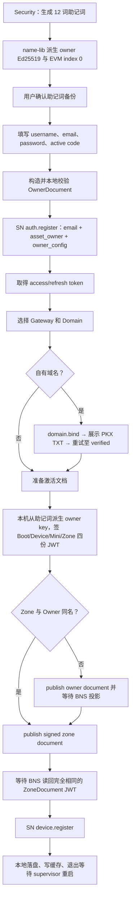
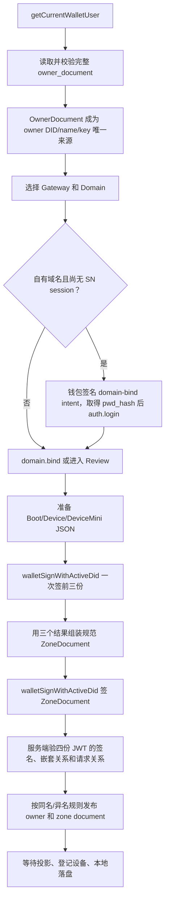

# Node Active：OwnerDocument、ZoneDocument 发布与 user domain 激活流程 TODO

- 状态：核心流程实现已完成；少量 hardening、完整测试与真实 SN/BNS、钱包 bridge、外部 DNS 联调待完成
- 日期：2026-07-10
- 适用版本：Beta 2.2 breaking change，不做旧接口、旧字段或旧激活结果兼容

## 实现进度（2026-07-10）

| 范围 | 状态 | 结果 |
|---|---|---|
| `buckyos-base/name-lib` | 已完成 | `a3451b1`：新增安全的 12 词助记词生成 helper，复用既有 owner/EVM 派生实现与测试向量 |
| `cyfs-gateway` | 已完成实现，待真实环境 E2E | `7f972ee`：SN/BNS publish document 支持 ZoneDocument JWT 原文，补齐 canonical ZoneDocument resolver，并更新 SN API 文档 |
| `buckyos-websdk` | 已完成 | `e870ae8`（0.7.104）：同步 publish document object/JWT union、原样序列化测试和客户端校验；Node Active 已锁定该 commit |
| Node Active Web/Rust | 核心流程已完成 | 完整 OwnerDocument、Web 快速注册、自有域名 PKX challenge、四文档签名与互验、BNS 投影确认、设备登记和本地持久化均已接入；非 retryable domain 错误分类展示、整组身份文件事务性提交仍待补 |
| 本地验证 | 已通过 | `node_active` frozen lockfile 构建、`node_active`/`node_daemon` 封装构建、`node_daemon active_server::tests` 6 项单测通过；构建不依赖机器本地仓库 patch |
| 外部验收 | 待完成 | 真实 SN/BNS DV 服务级测试、BuckyOS App 钱包两阶段签名/取消联调、外部 DNS TXT/NS 全流程联调、全 workspace `cargo test` |

当前结论：代码实现和本地编译验证完成，但在上述外部验收完成前，不将钱包路径、自有域名 DNS 路径或整套新激活流程标记为产品验收通过。

## 0. 给 CodeAgent 的执行约束

本 TODO 是实现清单，不是现状说明。实现时以本文件冻结的目标流程为准，并以代码校验每一项，不要继续沿用当前 `do_active` / `bind` / 三份 BNS JSON 文档的旧语义。

基线资料：

- `product/node_active/Node_Active_现状说明_草稿.md`
- `src/kernel/node_active/`
- `src/kernel/node_daemon/src/active_server.rs`
- `/Users/liuzhicong/project/BuckyOSApp/doc/SN接口调整-用户创建流程-TODO.md`
- `/Users/liuzhicong/project/BuckyOSApp/doc/BuckyApi.md`
- `/Users/liuzhicong/project/cyfs-gateway/doc/SN/新SN核心流程整理.md`
- `/Users/liuzhicong/project/cyfs-gateway/doc/SN/SN-API.md`
- 当前 `name-lib::OwnerDocument`、`ZoneDocument`、`ZoneBootDocument`、`DeviceDocument`、`DeviceMiniDocument`

执行纪律：

- [x] 先完成第 4 节的跨仓库协议前置项，再修改 Node Active；不能在 Node Active 内发明一个只对自己可见的临时 BNS 文档格式。
- [x] 不新增第三方依赖。助记词和双密钥派生复用 `name-lib`；SN/BNS 调用复用新版 `buckyos-websdk` 和 `cyfs-gateway-api::SnClient`。
- [x] 不修改 `src/rootfs/bin/node-active/` 中的构建产物；只改 `src/kernel/node_active/` 源码，最后由构建流程同步产物。
- [x] 不在日志、错误、URL、localStorage 或 sessionStorage 中留下助记词、owner/device 私钥、SN token、密码或密码 hash。本地配置只允许沿用系统启动必需的 `admin_password_hash`；不得把钱包签名返回的 `pwd_hash`、SN 登录材料或其它重复副本落盘。
- [x] 所有外部写操作必须有可重试、内容相关的幂等键；不能用固定 request id 重试不同内容。
- [x] 激活的终点是“BNS/SN 权威状态可读 + 本地身份落盘成功”，不是“TX 已提交”。
- [x] 保留用户工作区已有改动；当前 `product/node_active/Node_Active_现状说明_草稿.md` 和空的 `src/kernel/node_active/bns_client.ts` 都不是本 TODO 的生成产物，不得覆盖或回退。

## 1. 已冻结的产品结论

### 1.1 “获取身份”改成“获取 OwnerDocument”

Node Active 不再把 `username + owner_public_key` 当成完整 Owner 身份。两条路径最终都必须得到一份完整 `OwnerDocument`，后续 owner DID、BNS name、owner 公钥、EVM 地址都从该文档读取并交叉校验。

| 路径 | OwnerDocument 来源 | owner 签名能力来源 |
|---|---|---|
| BuckyOS App / 钱包路径 | `BuckyApi.getCurrentUser()` 经 `buckyos.getCurrentWalletUser()` 返回的 `owner_document` | `walletSignWithActiveDid` |
| 传统 Web 路径 | Security 内执行快速注册：生成并备份助记词，派生 owner Ed25519 + EVM index 0，构造 OwnerDocument，通过 `auth.register` 原子注册 BNS name 和 owner document | 激活时由本机 `/kapi/active` 从内存中的助记词重新派生 owner key 并签名 |

OwnerDocument 不是四份激活签名文档之一。传统 Web 注册时，OwnerDocument 作为 JSON object 由 SN 在 `registerName` 中发布；它的 BNS/EVM 交易提供链上 authority。四份 owner Ed25519 签名文档见 1.2。

### 1.2 口述中的“中 Doc”统一解释为 `ZoneDocument`

不新增 `MiddleDocument`、`IntermediateDocument` 等新类型。“中 Doc”按现有 `name-lib::ZoneDocument` 实现。

一次激活必须产生并验证四份 owner Ed25519 签名 JWT：

1. `ZoneBootDocument` JWT；
2. `DeviceDocument` JWT；
3. `DeviceMiniDocument` JWT；
4. `ZoneDocument` JWT。

`ZoneDocument` 使用现有规范字段聚合前三份材料：

- `boot_jwt = <ZoneBootDocument JWT>`；
- `devices["ood1"] = <DeviceDocument JSON payload>`；
- `devices["ood1"].device_mini_document_jwt = <DeviceMiniDocument JWT>`；
- `mini_device_jwts["ood1"] = <DeviceMiniDocument JWT>`；
- `oods`、`sn`、owner、zone DID、gateway 信息与三个子文档一致。

`DeviceDocument JWT` 仍作为独立签名产物和本地 `device_doc.jwt` 保存；`ZoneDocument.devices` 内放规范的 DeviceDocument JSON payload，不另造 `device_doc_jwt` 私有字段。

### 1.3 激活从 bind 改为 publish document

- 默认 BNS Zone：`zone_did == owner_document.id == did:bns:<name>`。Owner 与 Zone 同名视为隐式绑定，不调用旧 bind 接口，也不修改 OwnerDocument；只发布新的 `zone` document。
- 自有域名 Zone：`zone_did = did:web:<user-domain>`，Owner 与 Zone 不同名。必须先完成 SN `domain.bind` 的 PKX proof，再把 Zone DID 写入 OwnerDocument 的 `binded_zone_list`/default zone 并发布更新后的 `owner` document，最后发布 `zone` document。
- BNS 发布键始终是 SN token 所属的 owner BNS name，即 `name = owner_document.name`。即使 Zone DID 是 `did:web:<domain>`，也不能把自有域名作为 `bns.publish_document.name`，否则会触发 SN 的跨用户限制。
- 发布 `zone` document 的内容是签名后的 ZoneDocument JWT 原文，不能退化为当前 `active_server.rs::bns_zone_document()` 拼出的无签名 JSON。

### 1.4 user domain 改成 TXT proof 在前、NS 委派在后

自有域名只走 SN 的 `domain.bind`：

1. 用户输入 domain 后，客户端用 SN access token 调用 `domain.bind({domain})`。
2. TXT 未配置时，SN 返回 `domain_proof_failed`；客户端从结构化错误中展示服务端返回的 `pkx_record_name` 和 `pkx`，不得自行猜测或让用户提交 TXT 内容给 SN。
3. 用户在当前 DNS 服务商配置该 TXT；点击“验证”后重复调用同一个 `domain.bind`。
4. SN 从外部 DNS/DoH 验证成功并原子激活绑定后，页面才允许继续。
5. ZoneDocument 发布、设备登记和本地激活全部成功后，Success 页面再提示用户把域名 NS 委派到 SN。

当前版本(Desktop版)删除当前 `WAN + self domain` 的 BOOT/DEV/PKX 手工 TXT 发布路径。新的 TXT 只用于证明传统域名所有权，BOOT/DEV 不再要求用户手工粘贴到 DNS。
该路径在VPS模式下（无SN模式下成立），但产品上可能会设计成另一条激活路径。

### 1.5 SN 控制面与 SN relay 必须拆开判断

当前 `is_need_sn()` 同时决定 token、文档发布、设备登记和 ZoneBootDocument 中的 SN relay，语义已经不成立。目标模型至少拆为：

| 判定 | 用途 |
|---|---|
| `needs_sn_control_plane` | `auth.register/login/refresh`、`domain.bind`、`bns.publish_document`；本需求的两条路径恒为 true |
| `needs_sn_device_online` | SN DNS/运行态需要设备当前地址时登记 `device.register`；自有域名也需要 |
| `uses_sn_relay` | NAT/动态公网/portmap 需要 SN relay 时，才把 `sn`/`ddns_sn_url` 写入文档 |

WAN 不使用 relay，不代表可以跳过 SN 账号控制面、domain proof 或 publish document。

## 2. 不在本任务范围内

- AI Provider 手工添加弹窗、Jarvis 多 Tunnel、Review 提示词等其它草稿项。
- 多 OOD、已有 Zone 加第二台设备、Zone 导入/恢复。
- SN 邮箱验证码、邮箱所有权验证、密码找回。
- MetaMask、WalletConnect 或钱包直发 EVM raw transaction。Node Active 的两条目标路径都有 SN 账号，本期统一使用 SN bns-proxy 代付发布。
- 对旧 `/kapi/sn`、`/kapi/sn/bns`、`zone.bind_config`、`domain.begin_verify`、`domain.verify`、`bns_evm_private_key`、旧 `do_active` 参数做兼容。
- 顺手修复现状文档列出的其它 UI/安全问题；若它们被本任务触及，可做最小修正，但不要扩大重构。

## 3. 目标流程

### 3.1 传统 Web 快速注册与激活



### 3.2 钱包路径



现有 bridge 不能在一次批量签名中先得到子 JWT 再组装 ZoneDocument，所以钱包路径允许两次 `walletSignWithActiveDid`。第二次签名前必须复用第一次准备结果，不能重新生成 `iat`、`exp` 或 device 文档。两次返回的 `pwd_hash` 若都非空必须一致。

### 3.3 失败与重试边界

- `auth.register` 失败：不进入下一步，不把本地身份标记为已创建；相同内容使用 `sn:register:<normalized-name>` 重试。
- `domain.bind` 未通过：保留挑战信息，用户可重复验证；不得发布 owner/zone document。
- owner publish 已提交但未投影：轮询同一内容，不提交下一笔 zone TX。
- zone publish 已提交但未投影：轮询同一内容，不落盘、不退出进程；超时后保留未激活状态，允许用相同 request id 重试。
- BNS 已成功、SN `device.register` 失败：不回滚 BNS；重试只补设备登记和本地落盘。
- 本地落盘失败：不显示成功、不主动退出；再次提交时先确认远端内容相同，再重试本地收尾。

## 4. P0：先完成跨仓库协议前置项

当前协议不能无损发布签名 ZoneDocument：`/kapi/sn/bns-proxy` 的 `bns.publish_document.document` 被限制为 JSON object，而 BNS reader 已能把 inline text/JWT 解成 `BnsDocumentContent::Text/Jwt`。CodeAgent 必须先收敛这一不对称。

### 4.1 cyfs-gateway：允许发布签名 JWT document

主要入口：

- `/Users/liuzhicong/project/cyfs-gateway/src/components/cyfs-sn/src/api/bns_proxy.rs`
- `/Users/liuzhicong/project/cyfs-gateway/src/components/cyfs-sn/src/sn_bns_proxy.rs`
- `/Users/liuzhicong/project/cyfs-gateway/src/components/bns-client/src/sn_bns_controller.rs`
- `/Users/liuzhicong/project/cyfs-gateway/src/components/cyfs-gateway-api/src/sn_client.rs`
- `/Users/liuzhicong/project/cyfs-gateway/src/components/cyfs-sn/src/sn_resolver.rs`
- `/Users/liuzhicong/project/cyfs-gateway/doc/SN/SN-API.md`

协议目标：

```ts
type PublishDocumentContent = Record<string, unknown> | string;

interface SnBnsPublishDocumentReq {
  name: string;
  doc_type: string;
  document: PublishDocumentContent;
  request_id?: string;
}
```

任务：

- [x] 将 `document` 从“只能 object”改为“JSON object 或非空 JWT string”；其它 JSON scalar/array 仍拒绝。
- [x] `doc_type=owner` 仍只接受 JSON object，并保留现有 owner 身份字段不可更改的保护。
- [x] `doc_type=zone` 接受 JWT string，按 UTF-8 原文写入 `DocumentRef::inline`；不得 `JSON.stringify` 成带引号的字符串。
- [x] controller 增加通用 inline bytes/text 发布路径，继续执行 4KB 上限、expected version、name seq guard、controller policy、幂等和双重白名单。
- [x] 计算幂等 payload hash 时包含 document 原文；同 request id 不同 JWT 必须明确失败。
- [x] SN resolver 读取 canonical `name-lib::ZoneDocument` 时支持：
  - `devices[*].id`；
  - `devices[*].device_mini_document_jwt`；
  - `mini_device_jwts[device_name]`；
  - 现有 `mini_config_jwt` 兼容只留在 cyfs-gateway 读侧，本任务的写侧使用 canonical 字段。
- [ ] 增加 E2E：SN proxy 发布 ZoneDocument JWT → bns-indexer 投影 → resolver 得到 `boot_jwt`、gateway device DID、mini JWT → device token 可被权威锚定。（待真实 SN/BNS DV 环境验证）
- [x] 更新 `SN-API.md`：object/JWT union、owner 限制、4KB、返回仍是 `status=submitted`、调用方必须等待投影。

### 4.2 buckyos-websdk：同步类型和客户端

主要入口：`buckyos-websdk` 的 `sn_client.ts`、`bns_tx_executor.ts`、`namelib`。

- [x] `SnBnsPublishDocumentReq.document` 改为 `Record<string, unknown> | string`，`SnClient.publishDocument()` 原样发送 JWT string。
- [x] 增加请求序列化测试，确认字符串没有被包成对象、没有二次 JSON 编码。
- [x] 保持 `SnClientError.domainProofInfo()` 的结构化解析，Node Active 不解析错误 message 文本。
- [x] 确认并测试以下导出可用：`sn.SnClient`、`bns.BnsClient`、`namelib.newOwnerDocument`、Zone/Device/Boot/Mini 构造和 JWT 编解码函数。
- [x] 发布/锁定包含上述变更的明确 commit；Node Active 的 `pnpm-lock.yaml` 必须更新到该 commit，不能只依赖浮动 `#beta2.2`。

### 4.3 buckyos-base/name-lib：公开助记词生成 helper

`name-lib` 已经依赖 `bip39` 并提供 `derive_bucky_key_from_mnemonic`、`derive_evm_key_from_mnemonic`。不要在 buckyos 再增加一份 `bip39` 依赖或复制派生算法。

- [x] 在 `name-lib` 公开安全的 12 词英文助记词生成函数，内部复用现有 `bip39` 和 CSPRNG。
- [x] 返回值不得包含派生私钥；派生仍由现有 helper 完成。
- [x] 加固定助记词测试向量，确保 owner 路径 `m/9777'/0'/0'` 与 EVM 路径 `m/44'/60'/0'/0/0` 和 BuckyOS App 一致。
- [x] buckyos 更新 `name-lib` lock revision 后再实现 `/kapi/active` 的 material RPC。

## 5. P1：冻结 Node Active 数据模型与本地 kRPC

### 5.1 前端 DataModel

修改 `src/kernel/node_active/src/types.ts`，不要继续用一个含大量 nullable secret 的扁平 `ActiveWizzardData` 表达全部状态。至少增加下列强类型：

```ts
type OwnerDocument = namelib-compatible OwnerDocument shape;

interface WebOwnerMaterial {
  mnemonic_words: string[];
  owner_public_jwk: JsonValue;
  owner_derivation_path: string;
  evm_address: string;
  evm_derivation_path: string;
}

interface PreparedActiveDocuments {
  boot_document: JsonValue;
  device_document: JsonValue;
  device_mini_document: JsonValue;
  device_info: JsonValue;
}

interface SignedActiveDocuments {
  boot_document: JsonValue;
  boot_document_jwt: string;
  device_document: JsonValue;
  device_document_jwt: string;
  device_mini_document: JsonValue;
  device_mini_document_jwt: string;
  zone_document: JsonValue;
  zone_document_jwt: string;
}

type DomainBindingState =
  | { state: "unused" }
  | { state: "checking"; domain: string }
  | { state: "challenge"; domain: string; record_name: string; value: string; reason: string }
  | { state: "verified"; domain: string; verified_at: number };
```

- [x] `WizardData` 增加 `owner_document`，owner DID/name/public key 都由转换函数从文档派生。
- [x] 增加 `evm_address`、`domain_binding`、`signed_documents`；它们是明确状态，不用散落字段推断。
- [x] 删除 `bns_evm_private_key`、`bns_evm`、`owner_private_key` 和旧手工 TXT 状态。
- [x] `mnemonic_words` 只存在 Web 路径的 React 内存；组件卸载、成功或取消时主动清空。
- [x] gateway/domain/owner/device key 任一输入变化时，使 `signed_documents` 失效；domain 变化同时使旧 `domain_binding` 失效。

### 5.2 明确四个容易混淆的名字

禁止继续用单个 `zone_name` 同时表示四种值：

| 字段 | 默认 BNS 域名 | 自有域名 |
|---|---|---|
| `owner_name` | `alice` | `alice` |
| `owner_did` | `did:bns:alice` | `did:bns:alice` |
| `zone_did` | `did:bns:alice` | `did:web:home.example.com` |
| `access_hostname` | `alice.web3.buckyos.ai` | `home.example.com` |
| `bns_publish_name` | `alice` | `alice` |

- [x] 建一个纯转换函数集中生成这些值并单测；active_server 不再对裸字符串调用模糊的 `DID::from_str(zone_name)` 后猜语义。

### 5.3 `/kapi/active` typed RPC

在 `active_server.rs` 用 serde request/response struct 替代散落的 `req.params.get()`。本版本直接替换旧方法，不保留兼容 alias。

建议方法：

1. `generate_web_owner_material`
   - 输出：12 词助记词、owner public JWK、两条 derivation path、EVM address。
   - 不输出 owner/EVM 私钥。
2. `prepare_active_documents`
   - 输入：完整 OwnerDocument、明确的 owner/zone/access mapping、gateway topology、device public key、rtcp port。
   - 输出：unsigned Boot、Device、DeviceMini 和 DeviceInfo。
3. `assemble_zone_document`
   - 输入：prepare 结果和已签名的 Boot/Device/DeviceMini JWT。
   - 服务端先验三份 JWT，再返回规范 unsigned ZoneDocument。
4. `sign_web_active_documents`
   - 仅传统 Web：输入助记词和 prepare 结果；重新派生 owner key，交叉校验 OwnerDocument 后依次签三份子文档、组装并签 ZoneDocument，返回完整 `SignedActiveDocuments`。
5. `commit_active`
   - 输入：OwnerDocument、`SignedActiveDocuments`、device 私钥、本地系统设置、SN access token、domain verified 状态。
   - 负责严格验证、必要的 owner publish、zone publish、投影确认、device.register、本地落盘和退出。

每个 request struct 必须有解析测试；返回结构不得混用 `code` 和 Rust RPC error 表达同一个失败。业务成功返回 typed payload，失败使用稳定错误分类。

## 6. P2：实现 OwnerDocument 获取与快速注册

### 6.1 钱包路径

主要入口：

- `src/kernel/node_active/src/App.tsx`
- `src/kernel/node_active/src/types.ts`
- `src/kernel/node_active/src/components/ActiveWizard.tsx`

- [x] 升级 WebSDK 后，从 `getCurrentWalletUser()` 读取 `owner_document`；没有该字段时视为钱包身份不完整，不回落到裸 public key 激活。
- [x] 用 WebSDK/name-lib 解析 OwnerDocument，校验：
  - `id == did:bns:<normalized name>`；
  - `name` 与 `sn_username` 一致；
  - `verificationMethod[0].publicKeyJwk` 是 Ed25519 JWK；
  - bridge 同时返回的 `public_key` 若存在，必须与 OwnerDocument 默认 key 相同；
  - `wallets.main.type == eth` 且 address 是合法 EVM 地址。
- [x] `owner_user_name`、`owner_public_key` 不再从 bridge 的多个历史候选字段猜测；OwnerDocument 是唯一来源。
- [x] 钱包路线仍跳过 Security，但初始化完成前不能渲染向导，错误需明确指出缺失/不一致字段。

### 6.2 传统 Web Security 快速注册

主要入口：

- `src/kernel/node_active/src/components/steps/SecurityStep.tsx`
- `src/kernel/node_active/active_lib.ts`
- `src/kernel/node_active/bns_client.ts`（当前是空的工作区占位文件，若使用它只填入本任务相关薄封装）

- [x] Security 内部改为 `生成身份材料 → 确认备份 → 注册中 → 完成` 子状态，不必新增顶层 Wizard step。
- [x] 增加必填 email，trim 后做基本格式校验；最终规范化和唯一性以 SN 为准。
- [x] 调用 `generate_web_owner_material`，展示 12 词助记词并要求用户完成随机词位确认；未确认不能调用注册。
- [x] 只读展示 EVM address，说明它是 BNS name 的 `asset_owner`，可由同一助记词恢复。
- [x] OwnerDocument 使用 `namelib.newOwnerDocument` 构造：
  - `id/name` 使用 SN 返回的 normalized name；
  - `display_name` 首期使用 normalized name，避免擅自增加新的必填产品资料；
  - `verificationMethod` 使用派生 owner public JWK；
  - `wallets.main = {type: "eth", address: evm_address}`；
  - email、助记词、私钥、密码 hash、active code、token 绝不写入文档。
- [x] 注册前做 OwnerDocument round-trip、敏感字段扫描、EVM address 一致性和 `< 4096 bytes` 校验。
- [x] 使用新版 `sn.SnClient.register`，请求必须包含：
  - `name`；
  - `email`；
  - `pwd_hash`；
  - `active_code`；
  - `request_id = sn:register:<normalized-name>`；
  - `asset_owner = evm_address`；
  - `owner_config = complete OwnerDocument`。
- [x] 注册使用长事务超时；只有 `need_bind_owner_key === false` 且响应包含 BNS 成功提交信息时才进入下一步。SN 纯本地降级结果视为失败。
- [x] 保存 access/refresh token 到 Wizard 内存，提交激活前仍先 refresh。
- [x] 删除“用户名已存在就自动 login”的路径。传统 Web 没有现有 owner 私钥/助记词时无法合法签署四份文档；用户名被占用就阻止注册，并提示用户改用 BuckyOS App/钱包中的已有身份。
- [x] 删除旧文案中的“登录并绑定 owner key”。

## 7. P3：实现 user domain TXT challenge

主要入口：

- `src/kernel/node_active/src/components/steps/DomainStep.tsx`
- `src/kernel/node_active/src/components/steps/ReviewStep.tsx`
- `src/kernel/node_active/src/components/steps/SuccessStep.tsx`
- `active_lib.ts` 或独立 SN client 薄封装

- [x] 默认 BNS 域名不调用 `domain.bind`，DomainStep 可直接继续。
- [x] 自有域名输入通过本地格式校验后，必须取得新鲜 SN access token再调用 `SnClient.bindDomain(domain)`。
- [x] Web 路径使用 Security 保存的 refresh/access token。
- [x] 钱包路径若尚无 SN session，使用现有 `walletSignWithActiveDid` 对带 domain、owner DID、iat、随机 nonce 的 `buckyos.node_active.domain_bind` intent 做一次明确授权；使用返回的 `pwd_hash` 调 `auth.login`，签名结果不作为 SN proof，SN 仍只信外部 DNS。该 intent 仅用于让钱包弹出密码授权并取得当前既有 bridge 能力中的 pwd_hash。
- [x] 捕获 `SnClientError` 且 `isSnError("domain_proof_failed")` 时，只用 `domainProofInfo()` 取得 challenge；不得解析 message 字符串。
- [x] challenge UI 展示：record name、完整 PKX value、复制按钮、DNS 传播提示、重新验证按钮。
- [x] 只有 `domain.bind` 成功响应中的 domain 与当前输入一致时写入 `DomainBindingState.verified` 并允许 Next。
- [ ] domain 被其它用户占用、owner PKX 无法解析、DoH 不可用等非 retryable 错误要区分展示，不得误报“TXT 尚未生效”。
- [x] 删除 Domain/Review 中提前展示的 NS 委派提示，以及 Review 中 BOOT/DEV/PKX 手工生成和 `dnsReady` 逻辑。
- [x] Success 在自有域名激活完成后展示最终 NS 记录；此提示不影响系统已激活状态，但需明确“完成 NS 后域名才会对外解析”。

## 8. P4：构造、签名并严格验证四份 Document

### 8.1 文档构造必须只有一个规范来源

- [x] `prepare_active_documents` 在 Rust 使用当前 `name-lib` 类型构造文档，替换 `active_lib.ts::create_zone_boot_config()`、`create_device_mini_config()` 与 active_server 两边各造一份的现状。
- [x] BootDocument 必须带明确 `id=zone_did`、`owner=owner_did` 和正确的 oods/sn/exp；不要继续依赖 decode 后补字段。
- [x] DeviceDocument 的 `id` 使用 zone scoped DID，`owner`、`zone_did`、device key、net_id、rtcp、ddns_sn_url、support_container 与 topology 一致。
- [x] DeviceMiniDocument 从同一 DeviceDocument 生成。
- [x] `assemble_zone_document` 只接受已通过 owner key 验签的三个子 JWT；组装时复用原 prepare payload和 JWT，不重新生成时间字段。
- [x] ZoneDocument 使用 owner key、zone DID、owner DID、`boot_jwt`、`devices`、`mini_device_jwts` 和 `oods/sn` 构造，`version_seq` 必须存在。

### 8.2 钱包签名

- [x] 第一次 `walletSignWithActiveDid([boot, device, deviceMini])` 必须返回三个非空 JWT 和 `pwd_hash`。
- [x] 把三个 JWT 送给 `assemble_zone_document`，再调用 `walletSignWithActiveDid([zoneDocument])`。
- [x] 第二次返回必须有一个非空 ZoneDocument JWT；若返回 pwd_hash，必须与第一次相同。
- [x] 用户取消任一次签名时停留在 Review，不 publish、不登记设备、不落盘。
- [x] 禁止在 console 输出四份 JWT、pwd_hash 或完整 WizardData。

### 8.3 Web 签名

- [x] `sign_web_active_documents` 接收助记词，只在请求处理期间派生 owner key；签完立即 drop，不存入 server struct、文件或环境变量。
- [x] 派生公钥和 EVM address 必须与 OwnerDocument 完全一致，否则拒绝。
- [x] 使用与钱包路径相同的 prepare payload和 assemble 逻辑，不能保留另一套文档形状。

### 8.4 commit 前服务端验证

`commit_active` 不能信任浏览器已经校验。至少验证：

- [x] OwnerDocument 的 DID/name/default key/EVM wallet 格式和内部一致性。
- [x] 四份 JWT 全部能用 OwnerDocument default key 验签。
- [x] JWT claims 分别能反序列化为正确的 `name-lib` 类型。
- [x] ZoneDocument 的 `boot_jwt` 与提交的 Boot JWT 逐字节相同。
- [x] ZoneDocument 内的 DeviceDocument 与提交的 DeviceDocument payload语义相同，mini JWT 与提交值逐字节相同。
- [x] Boot/Zone 的 zone DID、owner DID、oods、sn；Device 的 id/name/zone/owner/key/net_id/rtcp；Mini 的 name/key/rtcp 全部互相一致。
- [x] device private key 派生的公钥与 DeviceDocument default key 一致。
- [x] 当前请求的 gateway/domain mapping 与签名内容一致，防止签完后篡改 UI 参数。
- [x] 四份文档均未过期，`iat/exp/version_seq` 满足 name-lib 规则。
- [x] ZoneDocument JWT UTF-8 长度 `< bns_client::MAX_INLINE_DOCUMENT`。典型单 OOD 当前约 3KB，但必须用测试守住 4KB 上限。

## 9. P5：publish document、投影确认与本地收尾

### 9.1 发布顺序

在 `active_server.rs` 删除 `BnsEvmControllerClient`、`bns_evm_private_key`、`publish_bns_zone_documents()` 和三份临时 JSON 构造器。使用带 SN access token 的 `cyfs_gateway_api::SnClient`：

1. 若 `owner_document.id != zone_did` 且 OwnerDocument 尚未绑定该 Zone：
   - clone OwnerDocument；
   - `set_default_zone_did(zone_did)`；
   - `bns.publish_document(name=owner_name, doc_type=owner, document=<updated OwnerDocument JSON>)`；
   - 等待 BNS 读回相同 owner doc 后再继续。
2. `bns.publish_document(name=owner_name, doc_type=zone, document=<ZoneDocument JWT string>)`。
3. 等待 BNS 读回逐字节相同的 ZoneDocument JWT。
4. 调用 `device.register` 写初始在线态。
5. 保存本地身份、文档和 start config。
6. 2 秒后退出，让 supervisor 正常拉起。

### 9.2 幂等与最终一致性

- [x] owner request id 使用 `node-active:owner:<owner-name>:<sha256(canonical-owner-json)>`。
- [x] zone request id 使用 `node-active:zone:<owner-name>:<sha256(zone-jwt)>`。
- [x] 不用固定 request id 覆盖变更后的 gateway/domain 内容。
- [x] SN 返回 `status=submitted` 只表示已投递，不等于成功；通过 `bns.BnsClient`/Rust `BnsIndexerClient` 轮询 document version 和原文。
- [x] 轮询使用有限 deadline、指数或有上限的退避、明确进度状态；禁止固定 sleep 后假定成功。
- [x] owner publish 投影后再发 zone publish，避免两个写操作使用相同旧 `name_seq`。
- [x] projection 超时返回可重试错误，保留同一 request id；不写本地激活完成标志。

### 9.3 本地持久化联动

主要入口：

- `src/kernel/buckyos-api/src/device_identity.rs`
- `src/kernel/node_daemon/src/active_server.rs`
- `src/kernel/node_daemon/src/zone_boot_resolve.rs`
- `src/kernel/scheduler/src/system_config_builder.rs`

- [x] `node_identity.json` 仍保存 owner DID + pinned owner public key作为本地 Root Trust，不允许在线 OwnerDocument key rotation 静默替换它。
- [x] 本地保存 `device_doc.jwt`、`device_mini_doc.jwt`，并新增 canonical `zone_document_jwt` 持久化/缓存入口；Boot JWT仍可从 ZoneDocument 取得。
- [x] DID cache 写入 `DidDocType::Zone` 的 ZoneDocument JWT，并保留需要的 Boot cache，均使用 `UpdateSource::Authority`。
- [x] `start_config.json` 保存完整公开 OwnerDocument、ZoneDocument JWT、三个子 JWT、本地系统设置及系统启动必需的 `admin_password_hash`；清除 mnemonic、全部 private key、access/refresh token、钱包签名返回的 `pwd_hash` 和其它重复临时副本。
- [x] 日志脱敏名单增加 `mnemonic`、`mnemonic_words`、`zone_document_jwt`、`owner_document_jwt`（若未来出现），避免整个签名文档落日志。
- [x] `StartConfigSummary` 增加 typed OwnerDocument；`SystemConfigBuilder::add_user_doc()` 使用本次获取/注册的完整 OwnerDocument，不再按 `user_name + public_key` 合成一份丢失 display/wallet/bound zone 的最小文档。
- [x] profile 从真实 OwnerDocument 的 name/display_name/avatar/meta 构造。
- [x] 自有域名时，本地使用已成功发布且含 zone binding 的 OwnerDocument；默认同名 Zone 保留隐式绑定语义。
- [ ] 所有文件先写临时文件并原子 rename，远端已成功但本地写一半时不能留下“可启动但身份不完整”的目录。（已实现单文件原子写；整组身份文件的事务性提交与失败注入验证待补）

## 10. 前后端字段映射

| UI/本地字段 | 来源 | SN/BNS/本地去向 | 约束 |
|---|---|---|---|
| `owner_document` | wallet bridge 或 Web 快速注册构造 | `auth.register.owner_config`；必要时 publish owner；start config/system-config | 公开；不含 email/secret |
| `email` | Web Security 输入 | `auth.register.email` | SN 本地唯一；不进 OwnerDocument |
| `evm_address` | 助记词 EVM index 0 / OwnerDocument wallet | `auth.register.asset_owner`、`owner_document.wallets.main` | 两处必须一致 |
| `mnemonic_words` | Web 本机生成 | 仅用于备份确认和签名时重新派生 | 只在内存和一次本地 RPC中存在 |
| `owner_public_key` | OwnerDocument default key | JWT 验签、`node_identity.owner_public_key` | 不再单独由 UI输入 |
| `zone_document_jwt` | 四文档签名阶段 | `bns.publish_document(doc_type=zone)`、本地 cache | BNS 原文必须保留 |
| `sn_access_token` | register/login/refresh | domain bind、publish、device register | Wizard 内存；不落盘/日志 |
| `domain PKX challenge` | `domainProofInfo()` | 只展示给用户配置外部 TXT | 不提交回 SN |
| `NS record` | active config/SN 部署信息 | Success 页面 | 只在激活成功后展示 |

## 11. 测试与验证

### 11.1 buckyos-base/name-lib

- [x] 12 词助记词生成可被自身 parse。
- [x] 与 BuckyOS App 相同固定助记词派生出相同 owner public JWK、owner PEM 和 EVM address。

### 11.2 cyfs-gateway

- [ ] `bns.publish_document` object 路径现有测试继续通过。
- [ ] Zone JWT string 被原样写链/投影，非空 scalar、array、超 4KB 被拒绝。
- [ ] owner doc 不接受 JWT string，owner key guard 继续有效。
- [ ] 同 request id + 同 JWT 返回 reused；同 request id + 不同 JWT 返回幂等冲突。
- [ ] resolver 能从 canonical ZoneDocument JWT 得到 Boot、Device、Mini，并用于 device token authority。
- [ ] `domain.bind` 无 TXT返回 retryable challenge；正确 TXT 后成功；错误 PKX、域名冲突、DoH 失败路径有稳定错误。

验证命令：

```bash
cd /Users/liuzhicong/project/cyfs-gateway/src
cargo test -p bns-client -- --test-threads=1
cargo test -p cyfs-sn -- --test-threads=1
```

### 11.3 Node Active Rust

- [ ] OwnerDocument 校验：合法、key 不匹配、EVM 不匹配、敏感字段、错误 DID/name。
- [ ] 四文档 happy path round-trip；任意 JWT 篡改、嵌套 JWT 替换、device key 替换、domain/topology 替换均拒绝。
- [ ] 默认同名 Zone 只产生一次 zone publish。
- [ ] 自有域名按 domain verified → owner publish/readback → zone publish/readback → device.register 顺序执行。
- [ ] BNS 投影延迟/超时、SN token 过期刷新、device.register 失败、本地原子落盘失败均可安全重试。
- [x] 典型单 OOD ZoneDocument JWT 小于 4KB；构造超限内容时在 publish 前失败。
- [x] `start_config.json`/日志快照不含 mnemonic、private key、SN token 或钱包签名返回的 `pwd_hash`；`admin_password_hash` 只在现有必需的配置位置出现，且不进入日志或额外副本。
- [ ] scheduler 使用完整 OwnerDocument 建 `users/<name>/doc`。

验证命令：

```bash
cd /Users/liuzhicong/project/buckyos/src
cargo test -p node_daemon
cargo test -p buckyos-api
cargo test -p scheduler
```

### 11.4 Node Active Web

当前包没有测试 runner。除非先获得新增依赖许可，不要擅自引入 Vitest/Playwright；把协议转换和状态机尽量下沉到已有 WebSDK/Rust 单测。至少执行：

```bash
cd /Users/liuzhicong/project/buckyos/src/kernel/node_active
pnpm install --frozen-lockfile
pnpm build
```

人工/联调矩阵：

| 场景 | 预期 |
|---|---|
| Web + 默认 BNS 域名 + SN relay | 快速注册 OwnerDocument；四文档签名；只 publish zone；成功启动 |
| Web + 自有域名 | 先 PKX TXT challenge；验证成功后 owner+zone publish；Success 才展示 NS |
| Wallet + 默认 BNS 域名 | 从 bridge 取得 OwnerDocument；两阶段钱包签名；只 publish zone |
| Wallet + 自有域名 | 钱包授权取得 SN session；PKX challenge；owner+zone publish |
| TXT 未传播 | 停在 Domain challenge，可重试，不 publish |
| wallet OwnerDocument/key 不一致 | 初始化直接失败，不进入 Wizard |
| BNS indexer 延迟 | 显示等待状态，deadline 前轮询，不提前退出 |
| 重复点击 Activate | 同内容复用 request id，不重复生成身份或覆盖不同内容 |

### 11.5 整体构建与 DV

```bash
cd /Users/liuzhicong/project/buckyos/src
uv run buckyos-build.py -s node_active
uv run buckyos-build.py -s node_daemon
cargo test
```

- [ ] 在真实 SN/BNS DV 环境补一个服务级测试，检查 BNS 上 owner/zone 原文、SN user_domain、device online state 和本地身份文件。
- [ ] 钱包 bridge 的两次签名与取消流程至少完成一次 BuckyOS App 手工联调；自动化前不要声称钱包路径已验收。

## 12. 删除清单

完成后应不存在以下生产路径：

- [x] `active_lib.ts::create_zone_boot_config()` / `create_device_mini_config()` 自造 schema。
- [x] `generate_zone_txt_records` 及 Review 的 BOOT/DEV/PKX 手工 DNS UI。
- [x] `register_sn_user(name, pwd_hash, active_code)` 缺 email/asset_owner/owner_config 的旧签名。
- [x] username taken → `auth.login` 的传统 Web 自动登录分支。
- [x] `bns_evm_private_key`、`BNS_PRIVATE_KEY`、`BnsEvmControllerClient` 在 Node Active 激活路径中的使用。
- [x] `active_server.rs::bns_zone_document()`、`bns_boot_document()`、`bns_device_mini_document()` 三份临时 BNS JSON。
- [x] 把 `sn_url.is_some()` 同时当成控制面、relay、publish、device online 判据的逻辑。
- [x] 任何旧 bind zone RPC 或旧 domain verify RPC 调用。

## 13. 完成定义

只有同时满足以下条件，CodeAgent 才能标记完成：

- [x] 两条路径都以完整 OwnerDocument 为身份输入，任何裸 key fallback 已删除。
- [x] Web 快速注册包含必填 email、同助记词 owner/EVM 双派生和可恢复备份确认。
- [x] Boot、Device、DeviceMini、Zone 四份 JWT 均真实签名并在服务端严格互验。
- [x] BNS `zone` document 保存的是签名 ZoneDocument JWT 原文，不是无签名聚合 JSON。
- [x] 默认同名 Zone 只 publish zone；自有域名完成 PKX proof 并发布 owner binding + zone。
- [x] TXT proof 在 NS 委派之前；NS 只在激活成功后提示。
- [x] SN 返回 submitted 后等待 BNS 最终投影，未确认前不落盘、不退出。
- [x] 真实 OwnerDocument 进入本地 system-config，owner root key 仍由 `node_identity` pin 住。
- [x] 不再需要用户 EVM 私钥或 `bns_evm_private_key` 完成 Node Active。
- [ ] cyfs-gateway、WebSDK、name-lib、buckyos 的相关单测和构建均通过。
- [x] 交付说明列出跨仓库 commit、主要入口文件、实际验证、未覆盖的钱包/DNS 外部环境风险。
