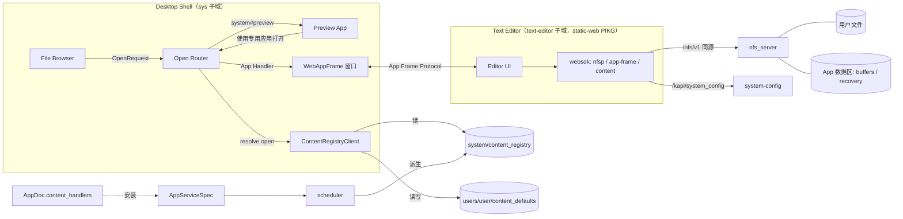
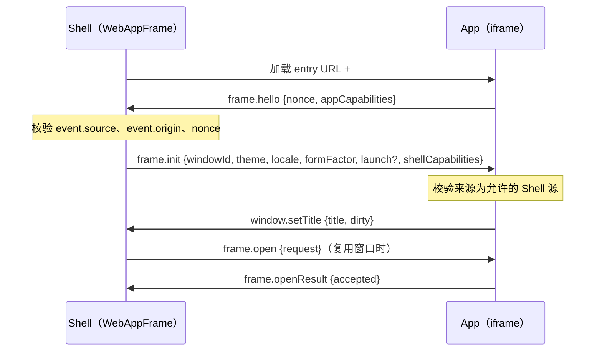
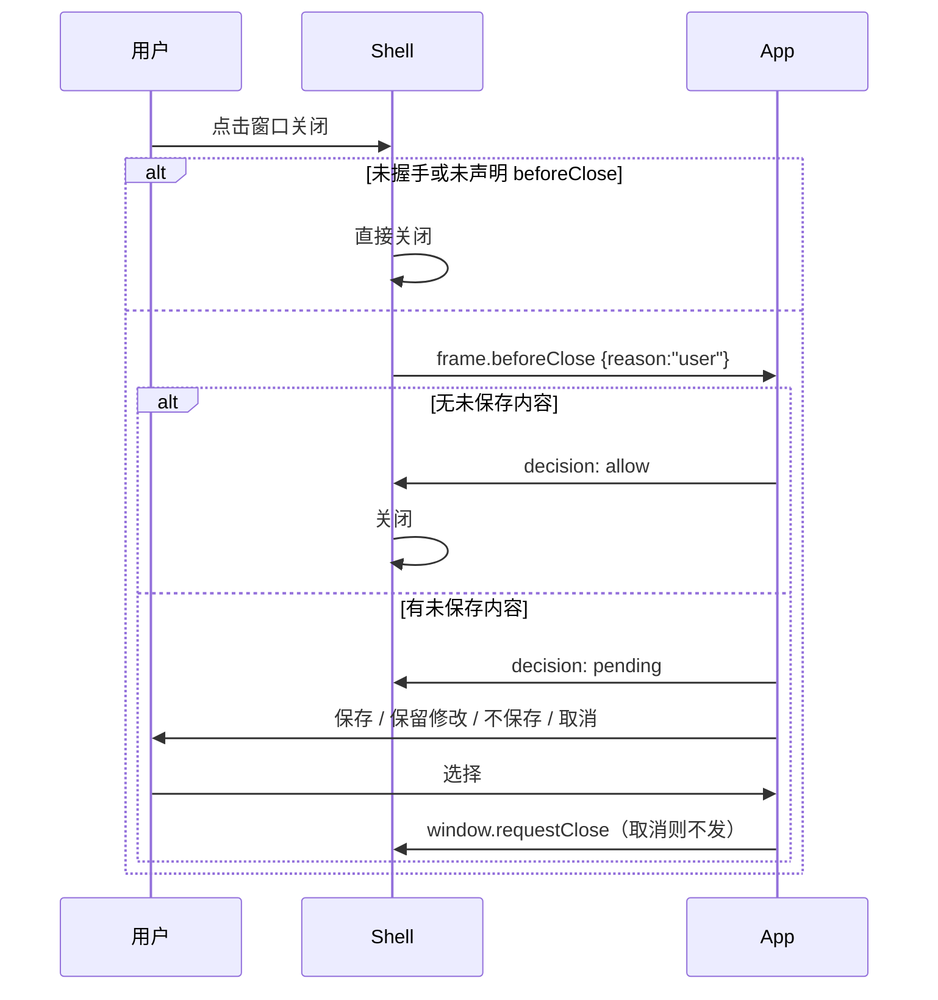

# BuckyOS Text Editor

> 文档状态：Draft v0.3（详细设计，未实现）
> 日期：2026-10-06（v0.2：增加文件缓冲区与恢复区；§15 记录已确认决策。v0.3：覆盖时提供“覆盖 / 覆盖并保留冲突副本”两个选项）
> 上游需求：[BuckyOS Preview App / Component PRD](../../../product/bucky_file/BuckyOS%20Preview%20App-Component%20PRD.md)（§4 非目标、§8 支持级别、§10.6“使用专用应用打开”、§11 Session Context、§23.8 第 10 项）、[内容扩展机制 Content Extension](../../../doc/sdk/context%20ext.md)（`open` 意图、Content Registry、调用模型）
> 关联协议：[App 安装协议](../../../doc/App%20安装协议.md)（AppDoc v1、预装）、[路径约定](../../../doc/path_usage.md)（App 数据区）、NFSP（`cyfs-ndn/doc/NamedFileSystem_Protocol_v0.md`、[nfs_server 产品设计](../../../product/bucky_file/nfs_server.md)、`src/frame/nfs_server/README.md`）
> 读者：BuckyOS 系统 / Desktop / buckyos-websdk / nfs_server 开发者，以及按本文实施的 Code Agent

---

## 0. 原始需求

Text Editor是 BuckyOS自带的文本编辑器（是预装的pikg)，实现了对纯文本类型(.txt .md .text .html ...) 的文件的编辑能力.
如果关闭预装，则系统回到用自带的preview查看文本

UI的框架类似sublime: 简洁，轻量。左边是导航区，右边是编辑区（支持多标签)
核心功能是
1）带语法高亮的展示文本
2）导航区，上部分是同Dir(Context)的其它文件选择（参考现有prview的context item list),下部分是outline(比如md文件可以看到段落)
3）编辑区可以支持 Split,同时展示多个文档
4）未来支持分享功能，可以通过系统通用分享支持多人批注

---

## 1. 定位：按第三方标准开发的系统应用

Preview PRD 把“完整打开、编辑与百分之百格式语义支持”交给专用第三方 App（Full App，§1、§8 Level 2），但系统至今没有任何 Full App，也没有让第三方 App 接管某类文件的通道：File Browser 双击一律进入 Preview，Preview 的“使用其他应用打开”只有下载和复制引用。

Text Editor 是系统里**第一个 Full App**，承担两个目标：

1. **产品目标**：让文本类文件（纯文本、Markdown、HTML、代码、配置）从 Level 1（能看）进入 Level 2（能编辑保存）。
2. **架构目标（核心）**：用它端到端验证“第三方文件编辑器”接入 BuckyOS 的完整链路。Text Editor 虽然预装，但**完全按第三方 App 的方式开发、打包、安装和运行**，不享受任何内建 App 特权。凡是它需要而系统缺少的能力，都以“任何第三方编辑器都能使用”的公开协议补齐，不开后门。

Text Editor 本质上是一个**网络编辑器**：它编辑的文件位于 Zone 的网络文件系统上，可能同时被同一用户的其它窗口、其它设备、其它用户以及宿主机上的程序修改。写冲突是常态而不是异常，因此设计目标不是“避免冲突”，而是**任何冲突都不让用户丢失工作成果，并且用户事后总能找到被替换的内容**（§8.1）。

### 1.1 “按第三方标准”的硬约束

| 约束 | 含义 |
|---|---|
| 独立包 | 源码在 `src/apps/text_editor/`，产物是 `static-web` 类型的 PIKG，用第三方开发者使用的同一套 `buckyos pikg` CLI 构建、安装。 |
| 独立源 | 运行在自己的子域 `https://text-editor.<zone>/`，与 Desktop（`sys.<zone>`）跨源，不能访问 Desktop 的 JS、存储和 DOM。 |
| 只用公开协议 | 内容读写只走 NFSP（经 websdk）；配置只走 system-config；与桌面的交互只走本文定义的 App Frame Protocol；声明只走 AppDoc。 |
| 系统不特判 | Desktop、Preview、File Browser 源码中不得出现 Text Editor 的 AppId、主机名或任何专用分支（验收时用 grep 检查，测试夹具除外）。 |
| 可替换 | 卸载或禁用后系统自动回落到 Preview；安装另一个声明同类内容的编辑器后，用户可以在两者间选择默认应用。 |

### 1.2 架构验证矩阵

| 编号 | 验证点 | 验证方式 |
|---|---|---|
| V1 | 第三方编辑器能以独立 static-web PIKG 构建、安装、预装、卸载 | 构建与 DV 安装流程；`system/install_settings` 预装 |
| V2 | 编辑器能**声明式**注册“我能打开哪些内容” | AppDoc `content_handlers.open` → scheduler 投影 `system/content_registry` → `resolve(open)`；安装或卸载后 File Browser 的默认打开方式随之变化，Desktop 无须重新构建 |
| V3 | 系统能把“打开某内容”的请求交给编辑器 | `OpenRequest` 经 URL 模板和 App Frame Protocol 两条通道到达；桌面窗口与独立浏览器标签页都能工作 |
| V4 | 编辑器能在用户权限内读写内容，并安全处理并发修改 | NFSP 读取、`open_write → tus → commit_file` 保存、etag 冲突检测、外部修改感知 |
| V5 | 编辑器能在自己的 App 数据区可靠保存工作成果 | 文件缓冲区持续写入 `.local/share/<app_id>/`；冲突中被替换的版本先进入恢复区，再执行破坏性动作；跨窗口、跨设备、崩溃后都能找回（§8.6、§8.8） |
| V6 | 编辑器能像内建应用一样融入窗口系统 | 窗口标题与未保存标记、关闭前确认、同应用窗口复用、主题与语言、移动端返回 |
| V7 | 编辑器缺席时系统正确回落 | 卸载、停用、禁用 Handler 后双击回到 Preview；Preview 中“使用专用应用打开”只列出可用 Handler |
| V8 | 扩展点对多个编辑器成立，而不是为 Text Editor 定制 | 第二个夹具 App（§14.3）声明同类内容，出现在“打开方式”中，可设为默认并切换回来 |
| V9 | 编辑器只能访问被授权的内容 | 目标模型见 §9.10；受 nfs_server 鉴权缺口阻塞，P0 只记录现状，不宣称已验证 |

### 1.3 非目标

- 不做 IDE：不做 LSP、调试、构建、终端、Git 集成。
- 不做富文本或所见即所得编辑。Markdown 编辑的是源文本；HTML 按源码编辑，不执行、不渲染。
- 不替代 Preview：Preview 仍是所有格式的快速查看和兜底入口，Text Editor 不实现 `preview` 意图。
- 不做文件的通用版本历史：编辑器只保证自己的用户的工作成果和自己替换掉的版本可找回；所有写入方的完整历史属于存储层（§8.8 边界）。
- 不在 P0 实现实时协同编辑、分享与批注（§11 只做设计预留）。
- 本文只启用 Content Extension 的 `open` 意图；应用 `preview` Handler 不在本文范围。

---

## 2. 现状事实（设计输入）

以下事实来自对当前源码的核对，是本文所有“系统改动”的依据。

| 领域 | 现状 | 位置 |
|---|---|---|
| 打开流程 | File Browser 的双击、Enter、菜单 `open` 都直接调用 `openPreview()`，没有按类型选择应用，也没有“打开方式”菜单 | `src/frame/desktop/src/app/filebrowser/FileBrowserView.tsx`（`handleOpenFile`）、`menu/registry.ts` |
| Open With | Preview 的 `OpenWithSheet` 只有“下载原文件 / 复制引用”，注释写明 Full App 关联协议未冻结 | `src/frame/desktop/src/app/preview/PreviewAppPanel.tsx`、`app/preview/README.md` |
| 内容注册 | `content_handlers`、`system/content_registry`、`content_defaults` 只存在于文档；Rust `AppDocWire` 带 `deny_unknown_fields`，CLI `app.json` 也拒绝未知字段，现在声明会直接被拒 | `src/kernel/buckyos-api/src/app_doc.rs`、`buckyos-websdk/cli/modules/pikg.ts` |
| Web App 权限 | `AppDocBuilder` 对 `web` 类型会清空 `permissions` 与 `service_config_tips`（“Web is always static and should not request permissions”） | `app_doc.rs` `AppDocBuilder::build` |
| 可用性 | Owner 安装的 App 默认所有用户可用（可改为仅自己）；`apps.list` 已按可用性策略为当前用户过滤 | `src/kernel/buckyos-api/src/app_availability.rs`、`src/frame/control_panel/src/app_servcie_mgr.rs`（`handle_apps_list`） |
| 第三方窗口 | 有 `web_hosts` 但无内建加载器的 App 都由 `SystestAppPanel` 渲染为 `<iframe src="https://<host>.<zone>/">`，不带任何启动参数，忽略 `launch` / `themeMode` / `locale` | `src/frame/desktop/src/app/registry.tsx`、`app/systest/SystestAppPanel.tsx` |
| Shell 桥 | Desktop 与 iframe App 之间没有任何 `postMessage` 协议；`buckyos://app/...` 深链接未实现 | grep 结果 |
| 启动参数 | `openAppWindow(appId, { launch: { requestId, payload } })` 只对同源 React 面板有效（Preview、MessageHub） | `src/frame/desktop/src/models/DesktopUIDataModel.ts` |
| NFSP 客户端 | 只在 Desktop 内（`src/frame/desktop/src/api/nfsp_client.ts`、`nfs_browser_client.ts`）；buckyos-websdk 没有 NFSP 客户端 | grep 结果 |
| 保存路径 | `open_write({ref})` → `PATCH /nfs/v1/uploads/{fb}` → `commit_file`，最后一步原子 rename（保存后是新 inode） | `src/frame/nfs_server/src/mutate.rs` |
| 并发控制 | 没有文件级 revision 或 If-Match；`commit_file.expected_revision` 只校验**父目录**；`open_write` 记录 (size, mtime) 快照，commit 时若文件被旁路修改返回 `TARGET_MISMATCH{reason:"bypass_modified"}`（409）；另一会话持有租约时返回 `LEASE_CONFLICT`（423）；租约 600 s，没有放弃（abort）方法 | `mutate.rs`、`session.rs`、`error.rs` |
| 版本标识 | 文件 `etag = "<size>-<mtime>"`，mtime 精度为整秒；读端点返回 `ETag: W/"<size>-<mtime>"`（格式与 stat 不同，需要归一化）；未锚定文件的 ref（`nh_…`）在 inode 变化后返回 `STALE`（410） | `namespace.rs`、`server.rs`、`handle.rs` |
| 变更通知 | `GET /nfs/v1/watch` SSE，按**目录** watch_token 推送 `container_changed`；没有文件级事件；旁路修改靠 Reconciler 扫描（BuckyOS 模式 30 s） | `server.rs`、`watch.rs`、`reconciler.rs` |
| 鉴权 | NFSP 控制面只要求 `hello` 会话，读端点与上传端点不校验身份；`grant` 签发的 token 没有任何地方校验；没有按 App 的访问范围 | `server.rs`、nfs_server README |
| App 数据区 | `/home/$user/.local/share/$appid` ↔ `cyfs:///home/$user/.local/share/$appid`，是 App 有读写权限的永久数据区，卸载时用户可选删除 | `doc/path_usage.md` |
| 点目录 | nfs_server 只跳过 `data/` 下以 `.` 开头的一级导出根，home 内的 `.local` 可以正常寻址；`mkdir` 只建一级 | `src/frame/nfs_server/src/config.rs`、`mutate.rs` |
| 网关 | 任意主机上的 `/nfs/v1/*`、`/kapi/*` 路径路由优先于 App 路由，所以 App 页面可以同源调用 NFSP 与 kRPC | `src/rootfs/etc/boot_gateway.yaml` |
| 浏览器登录 | static-web App 只需 `initBuckyOS(appId)` + `login()`；sys_test 作为 iframe 嵌入桌面且使用同一流程，是可用先例 | `buckyos-websdk/src/sdk_core.ts`、`src/apps/sys_test/web/index.ts` |
| App 设置 | RBAC 只允许 App 读写 `users/{user}/apps/{app}/settings`，但 websdk 浏览器 runtime 的设置路径是 `services/<appId>/settings`（sys_test README 已记录此不一致） | `rbac_config.rs`、`buckyos-websdk/src/runtime.ts` |
| 预装 | `system/install_settings.pre_install_apps` 种子（`boot.template.toml`），control_panel `pre_install_reconciler` 按标准安装任务执行；用户卸载后再次扫描会记为 Conflict 错误 | `src/rootfs/etc/scheduler/boot.template.toml`、`src/frame/control_panel/src/pre_install_reconciler.rs`、`app_installer.rs` |
| 卸载 | `apps.uninstall` 对预装 App 没有保护，卸载把 AppServiceSpec 标为 `Deleted`；Desktop 没有卸载或停用 UI，只能用 CLI `buckyos app uninstall` | `app_installer.rs`、`buckyos-websdk/cli/modules/app.ts` |
| Preview 文本 | `TextRenderer` 是等宽 `<pre>`，无语法高亮，Markdown 显示原文，最多读 2 MiB | `src/frame/desktop/src/components/ContentPreview.tsx`、`components/preview/mediaTypes.ts` |
| 编辑器依赖 | Desktop 没有 CodeMirror / Monaco / 高亮库；仓库已有 ProseMirror 与 Loro（AI Workspace 富文本） | `src/frame/desktop/package.json` |

---

## 3. 总体架构



第三方编辑器接入系统共有五个协议面，Text Editor 逐一验证：

| 协议面 | 回答的问题 | 本文章节 | 承载 |
|---|---|---|---|
| 声明 | 我能打开哪些内容、以什么入口打开 | §5 | AppDoc `content_handlers`（`open` 子集） |
| 解析 | 用户要打开某内容时由谁处理 | §5.4 | `system/content_registry` + `content_defaults` + websdk `resolve` |
| 启动 | 内容引用与浏览上下文如何交给编辑器 | §6 | `OpenRequest`（URL 模板 + App Frame） |
| 内容 | 编辑器如何读、写、保全工作成果、感知变化 | §8 | NFSP（websdk `nfsp` 模块）+ App 数据区 |
| 窗口 | 编辑器如何与桌面窗口协作 | §7 | App Frame Protocol（websdk `app-frame` 模块） |

回落规则贯穿全部协议面：`resolve(open)` 中永远存在 `provider: system` 的 Preview 条目（`mime:*/*`，`fidelity: partial`），任何 App Handler 缺席、被禁用或启动失败时都落到 Preview。

文件缓冲区与恢复区（§8.6、§8.8）只使用 NFSP 与 App 自己的数据区，不依赖任何系统私有能力，任何第三方编辑器都可以照同样方式实现；P2 视需要沉淀为 websdk 辅助库。

---

## 4. 打包、安装与预装

### 4.1 包形态

Text Editor 是纯前端 `web` App（`pikg init --kind static-web`），没有 App Service：

- 不需要后端即可登录：浏览器 runtime 只校验 `appid`，不需要 `app_instance_id`；
- 所有数据访问都以用户会话进行（NFSP、system-config），页面本身是公开静态资源；
- 这是第三方编辑器最轻的形态，能证明“编辑器不需要后端”这条路径成立。将来需要后端能力（格式转换、协同服务）的编辑器可以用 `dapp`，协议面不变。

`dapp_meta/app.json`（`content_handlers` 需要 §12 的 CLI 与 AppDoc 改动后才可用）：

```json
{
  "schema_version": 1,
  "did": "did:bns:text-editor.buckyos",
  "name": "text-editor",
  "version": "0.1.0",
  "owner": "did:bns:buckyos",
  "author": "did:bns:buckyos",
  "show_name": "Text Editor",
  "categories": ["web"],
  "permissions": [
    { "scope_path": "user/home", "required": true, "actions": ["read", "write"], "exp": null }
  ],
  "selector_type": "static",
  "service_config_tips": {},
  "content_handlers": [ "见 §5.2" ]
}
```

`dapp_meta/pikg.json`：

```json
{
  "schema_version": 1,
  "output_dir": "../dapp_dist",
  "pikg_file": "text-editor.buckyos.bns.did-0.1.0.pikg",
  "sub_pkgs": { "web": { "required": true, "source": { "type": "path", "path": "../dist" } } }
}
```

由此得到：AppId `text-editor.buckyos.bns.did`，Zone Owner 实例的主机名 `text-editor`，访问地址 `https://text-editor.<zone>/`。

### 4.2 目录结构

```text
src/apps/text_editor/
  readme.md                    # 本文
  dapp_meta/app.json, pikg.json
  package.json                 # build = check + vite build；依赖 buckyos（websdk，git #main）
  index.html, vite.config.ts, tsconfig.json
  src/
    main.tsx                   # 启动：initBuckyOS → login → App Frame 握手 → 解析启动请求
    platform/
      launch.ts                # 从 URL / frame.init / frame.open 得到 OpenRequest
      frame.ts                 # 包装 websdk AppFrameClient（标题、关闭守卫、返回、主题）
      settings.ts              # users/{user}/apps/{app}/settings
    fs/
      documentStore.ts         # DocumentStore 接口 + NFSP 实现（加载、保存、stat、watch）
      codec.ts                 # 编码、BOM、换行、二进制检测
      saveFlow.ts              # 保存状态机与冲突分类（纯函数，可单测）
      appData.ts               # App 数据区定位与目录初始化
      bufferStore.ts           # 文件缓冲区（服务端）+ 本地预写（IndexedDB）
      recoveryStore.ts         # 恢复区写入、列举、清理
    model/                     # Workspace / Document / Group / Tab 状态
    editor/
      setup.ts                 # CodeMirror 扩展组合
      languages.ts             # language-data 懒加载与语言识别
      splitSync.ts             # 同一文档多视图同步
      outline/                 # markdown.ts、html.ts
    ui/                        # Sidebar、FileList、Outline、TabBar、EditorGroup、StatusBar、RecoveryPanel、Dialogs
    i18n/                      # en、zh-CN
  tests/
    unit/                      # codec、saveFlow、buffer/recovery 格式与生命周期、outline、launch 解析
    harness/                   # 模拟 Shell（App Frame Host）+ 内存 NFSP
    e2e/                       # Playwright
```

UI 框架用 React + Vite（与 Desktop 一致）；编辑内核用 CodeMirror 6（选型见 §9.7）。两项新依赖已确认（§15）。

### 4.3 构建与预装接入

| 文件 | 改动 |
|---|---|
| `src/bucky_project.yaml` | `modules` 新增 `text_editor: { type: web, format: pikg, name: text_editor, src_dir: apps/text_editor }`；安装映射新增 `text_editor: data/cache/text-editor.buckyos.bns.did-0.1.0.pikg` |
| `src/rootfs/data/cache/` | 构建产物 PIKG（与 systest、jarvis 一致） |
| `src/rootfs/etc/scheduler/boot.template.toml` | `pre_install_apps` 新增 `"text-editor.buckyos.bns.did": { "schema_version": 1, "pikg_path": "data/cache/text-editor.buckyos.bns.did-0.1.0.pikg", "install_plan": {} }` |

已有 Zone 不会自动获得新种子，需要 `start.py --all` 或手工写入 `system/install_settings`。

### 4.4 关闭预装

原始需求“关闭预装则回到 Preview”落到三种用户动作，效果都是 `resolve(open)` 中不再出现 Text Editor 条目：

| 动作 | 机制 | 可逆 |
|---|---|---|
| 卸载 | `apps.uninstall` → AppServiceSpec `state=Deleted` → scheduler 重新派生注册表时去掉其条目 | 手动重新安装 |
| 停用 App | AppServiceSpec `enable=false` / `Stopped`（gateway 同时摘除路由）→ 条目去掉 | 重新启用 |
| 禁用 Handler | `content_defaults.disabled` 加入该 HandlerKey，App 照常可从启动器打开，但不再接管文件 | 重新启用 |

**用户卸载后不再预装（已确认）。** 预装 reconciler 发现种子对应的 AppServiceSpec 存在且 `state=Deleted` 时，记录终态 `user_removed`：不报错、不重装；系统升级带来新版本种子时同样跳过。用户手动重新安装后 App 回到已安装状态，此后种子版本升级照常进行。当前实现把这种情况记成 Conflict 错误，需要修改（§12 S4）。

卸载时如选择删除数据，会一并删除 App 数据区中的缓冲区与恢复区（§8.6、§8.8）。P1 的 Desktop 卸载入口需要提示其中尚有多少未保存修改和恢复记录（§12 D7）。

### 4.5 访问、登录与多用户

- 页面公开（static-web 默认 `allow_guest=true`，gateway `access_mode=public`），没有会话时只显示外壳和“登录”状态，不读任何内容。
- 启动时 `initBuckyOS("text-editor.buckyos.bns.did")`，没有会话则 `login()` 走 SSO（`sys.<zone>/login` → App 源 `/sso_callback` → `/sso_refresh`）。桌面内用户已登录，嵌入的 iframe 按 sys_test 的先例完成静默跳转。
- 若 iframe 内 SSO 被浏览器策略阻断（第三方 Cookie、登录页禁止嵌入），编辑器显示“需要登录”，按钮用顶层弹窗完成登录，然后回到 iframe 重试 `/sso_refresh`。这是 V1/V3 的验证项。
- **Shell origin 不写死。** App Frame 消息只发给嵌入方：被嵌入时取 `document.referrer` 的 origin（限本 Zone 根域或其子域），独立标签页/无 referrer 时回退 `sys.<zone>`。DV 上桌面跑在 Zone 根域而非 `sys.`，写死 `sys.<zone>` 会让握手静默失败（`frame.init` 收不到、`window: reuse` 失效、标题/关闭守卫都不工作）。
- **会话保活与失效。** 浏览器 runtime 的 token 续期由 websdk 自己完成（`getAccountInfo()` 在 access token 临近过期时调 `/sso_refresh`，并维持续期定时器），App 不另做刷新。编辑器只处理两件事：① 启动时在 `getAccountInfo()` 返回前只显示“正在连接…”，不显示登录按钮，避免用户在会话仍有效时误触发整套 SSO；② 运行中一旦 `getAccountInfo()` 返回空（refresh token 失效、Zone 重装、verify-hub 重启等都会让 gateway 清掉 SSO Cookie），顶部显示“登录已失效”横幅，点“登录”先把所有文档落到本地缓冲区再跳 SSO，回来后按 `restoreSession` 恢复工作区。
- **多用户（已确认的安装策略）**：Owner 安装 App，默认所有用户可用，除非手工改为仅自己可用。预装实例 `text-editor.buckyos.bns.did@<owner>` 与主机 `text-editor` 由全体可用用户共用；每个用户以自己的会话登录，读写都以自己的身份进行。设置、缓冲区、恢复区都放在**当前用户**自己的路径下（`users/<当前用户>/apps/...`、`cyfs:///home/<当前用户>/.local/share/...`），用户之间互不可见。

---

## 5. 内容处理声明：`content_handlers` 的 `open` 子集

### 5.1 范围

Preview 首版已经完成，Preview PRD 中“首版不接入 `content_handlers`”的约束已经结束（§15 决策 1）。本文实施 Content Extension 中第三方编辑器必需的部分：

- AppDoc 可选字段 `content_handlers`，P0 只接受 `open` 意图（`icon` 意图 P1；`preview`、`cell.*` 不在本文范围）；
- scheduler 派生 `system/content_registry`；
- 用户偏好 `users/{user}/content_defaults`（默认打开方式、禁用列表）；
- websdk `resolve` 纯函数与 `ContentRegistryClient`。

字段结构、特异性、排序规则与 Content Extension §4、§6、§7 完全一致，本文只补充 P0 必需的细化。

### 5.2 Text Editor 的声明

```json
"content_handlers": [
  {
    "handler_id": "text",
    "version": 1,
    "selectors": [
      { "mime": ["text/*"], "maxSize": 16777216 },
      {
        "mime": [
          "application/json", "application/ld+json", "application/xml",
          "application/javascript", "application/typescript",
          "application/yaml", "application/x-yaml", "application/toml",
          "application/x-sh", "application/sql"
        ],
        "maxSize": 16777216
      }
    ],
    "intents": {
      "open": {
        "entry": { "type": "web", "path": "/?src={source}&mode={mode}&session={session}" },
        "modes": ["view", "edit"],
        "fidelity": "full",
        "window": "reuse",
        "multiSource": true,
        "priority": 60
      }
    }
  },
  {
    "handler_id": "any-as-text",
    "version": 1,
    "selectors": [{ "mime": "*/*", "maxSize": 16777216 }],
    "intents": {
      "open": {
        "entry": { "type": "web", "path": "/?src={source}&mode={mode}&session={session}" },
        "modes": ["view", "edit"],
        "fidelity": "partial",
        "window": "reuse",
        "priority": 10
      }
    }
  }
]
```

- `text` 让文本类文件默认由 Text Editor 打开：`text/*` 属于子类型通配（特异性第 5 档），高于 Preview 的 `*/*`（第 7 档）。`text/html` 因此也默认进入编辑器，符合原始需求；想看渲染效果时用“打开方式 → Preview”。
- `any-as-text` 让任意文件都能在“打开方式”中选择“以文本方式打开”（如 `.svg`、无扩展名的 `LICENSE`）。按 Content Extension §4.3，第三方的 `*/*` 条目永远不会成为默认，除非用户显式设置。
- `maxSize` 与编辑器的大文件上限一致（§8.5），超过的文件不会被路由到编辑器。

### 5.3 对 Content Extension 的 P0 细化

**`OpenBinding` 新增两个可选字段：**

| 字段 | 取值 | 语义 |
|---|---|---|
| `window` | `"reuse"` \| `"new"`，缺省 `"new"` | `reuse`：Shell 优先把请求投递给该 Handler 最近聚焦、且已完成 App Frame 握手的窗口（由 App 自己开新标签）；`new`：每个请求一个窗口。用户显式“在新窗口中打开”时始终新建。 |
| `multiSource` | bool | 是否接受一次打开多个 Source（File Browser 多选“打开方式”）。P0 Shell 对多选按顺序逐个投递 `frame.open`。 |

**入口路径模板：** `entry.path` 相对 App 的 Web host，占位符按下表展开；Shell 另在 URL fragment 追加 `#bfp=<nonce>`（App Frame 握手用，fragment 不发往服务器）。

> App 的 Web 包由 gateway 的静态目录服务器直接按文件路径提供，**没有 SPA 回退**（`/open` 这类不存在的路径会得到 `404 Not found`）。因此 `entry.path` 的路径部分必须是包里真实存在的文件（通常就是 `/`，即 `index.html`），参数全部放在 query 里；编辑器的 `parseLaunch` 只看 query，不看路径。

| 占位符 | 展开规则 |
|---|---|
| `{source}` | `ContentRef` 的规范字符串：`cyfs-path` → `cyfs:///…` 本身；`object-id` → `obj://<objectId>`。URL 编码。 |
| `{mode}` | `view` 或 `edit`，缺省时 `edit`（`modes` 不含 `edit` 时为 `view`）。 |
| `{session}` | 可传递 Session Context 的 base64url(JSON)。`list` 编码后超过 2 KiB 时：若所有 item 都位于 Source 的父目录，降级为该目录的 `container`；否则省略，完整 Session 只经 App Frame 传递。 |

**校验（scheduler 派生时执行，失败则该 App 的全部 Handler 不生效并记录诊断，不阻断安装）：**

- `handler_id` 在 App 内唯一，`version` 为正整数；
- 第三方 `priority ≤ 80`；
- `mime: */*` 或仅有 `ext` 的选择器只能绑定 `open` / `icon`；
- `open.entry.type` 必须是 `web`，`path` 必须以 `/` 开头，不能含 scheme、主机名或 `..`；
- App 必须有 Web host（`web` 包或 `www` 端点），否则 `open` 条目无效；
- Handler 的 `permissions`（若声明）必须是 AppDoc `permissions[]` 的子集。

### 5.4 注册表派生与解析

**派生（scheduler）。** AppServiceSpec 已内含完整 `app_doc`，scheduler 作为确定性推导器，从“全部 `state ≠ Deleted`、`enable = true` 且非 Stopped 的 AppServiceSpec”推导 `system/content_registry`，再加上系统内建条目。注册表因此始终可以由已安装 App 的集合重建，卸载、停用、升级不需要 Installer 另外维护投影。内容不变时不写入。

系统内建条目 P0 只有一条：

```json
{
  "provider": "system",
  "handler_id": "preview",
  "handler_version": 1,
  "selectors": [{ "mime": "*/*" }],
  "intents": { "open": { "entry": { "type": "builtin", "target": "preview" }, "modes": ["view"], "fidelity": "partial", "window": "reuse", "priority": 90 } },
  "enabled": true
}
```

`entry.type: "builtin"` 只允许 `provider: system` 使用，由 Open Router 映射到 `openPreview()`。

**RBAC：**

- `system/content_registry`：只有 scheduler 可写；用户与 App 可读；
- `users/{user}/content_defaults`：用户可读；写入只允许 Desktop（系统 Shell App）以用户身份进行（Content Extension §11.7：App 不能替用户设置默认）。

**解析（websdk，客户端，已确认）。** 注册表体积小，Desktop 启动时读取 `system/content_registry` 与 `content_defaults`，缓存在内存，用 websdk 的纯函数 `resolveContentHandlers(registry, defaults, descriptor, intent, host, availableApps)` 得到排序后的 `HandlerPlan[]`。刷新时机：App 安装 / 卸载对话框完成后、桌面窗口重新获得焦点且缓存超过 60 s、用户修改默认应用后。Rust 侧 P0 不需要解析实现。

**可见性。** 注册表是 Zone 级的，包含所有用户安装的实例。Content Extension §7.2 的“按 caller 可见性过滤”直接复用现有可用性判定：只保留 `app_instance_id` 出现在当前用户 `apps.list` 结果中的条目（`apps.list` 已按可用性策略过滤），系统条目始终可见。Owner 安装的 Text Editor 默认所有用户可用，所以所有用户都会看到它的 Handler；改为“仅自己可用”后，其他用户的双击自动回落到 Preview。

**ContentDescriptor 的构造（P0）：**

- `mime`：优先使用 NFSP 返回的类型；没有时用 websdk 共享的扩展名 → MIME 表（由 Desktop `components/preview/mediaTypes.ts` 现有表迁入，`TEXT_CODE_EXTENSIONS` 全部映射到 `text/*` 或 §5.2 列出的 `application/*`）；
- `objType`：`cyfs-path` 文件为 `cyfile`；
- P0 不做内容探测（sniff）：`open` 由用户触发，且编辑器加载时会自行校验内容（二进制检测，§8.5），误路由的代价只是一个可回退的错误页。无扩展名的文本文件在 P0 默认仍进 Preview，P1 由 Open Router 对无 MIME 的文件做一次有界探测。

---

## 6. 启动协议（Open）

### 6.1 OpenRequest

沿用 Content Extension §9.3，补充跨 App 传递所需的约束：

```ts
type TransferableContentRef =
  | { kind: "cyfs-path"; path: string; version?: string }
  | { kind: "object-id"; objectId: string; version?: string };

type TransferableSessionContext =
  | { kind: "single" }
  | { kind: "container"; container: TransferableContentRef; current: TransferableContentRef; sort?: unknown; navigation?: "wrap" | "bounded" }
  | { kind: "list"; sessionId?: string; version?: string; items: Array<{ id?: string; source: TransferableContentRef; title?: string }>; currentIndex: number; navigation?: "wrap" | "bounded" };

interface OpenRequest {
  requestId: string;
  source: TransferableContentRef;
  session?: TransferableSessionContext;
  mode?: "view" | "edit";
  origin?: { appInstanceId?: string; windowId?: string; hostContext?: string };
}
```

- 只有 `cyfs-path` 与 `object-id` 能跨 App 传递；`blob`、宿主私有 kind（如 MessageHub 的 `messagehub-object`）以及 `provider` 型 Session 都不能跨源，Open Router 不会把这类内容路由给 App Handler（只给 Preview）。
- `object-id` 是不可变内容，编辑器以只读打开，编辑后只能“另存为”。

### 6.2 Open Router（Desktop）

新增 `openContent(request, options)`，成为 Desktop 内所有“打开内容”动作的唯一入口：

```ts
interface OpenContentOptions {
  handlerKey?: string;          // 指定 Handler（打开方式菜单）；缺省为 resolve 结果第一位
  newWindow?: boolean;          // 用户显式“在新窗口中打开”
}
```

处理步骤：

1. 构造 ContentDescriptor（§5.4），`resolve(open)` 得到候选；若指定了 `handlerKey` 但它不在候选中，按“不可用”提示并回落到第一位。
2. 选中 `system#preview` → 调用现有 `openPreview()`，Preview 的窗口策略（Smart / Single、上限 8）保持不变。
3. 选中 App Handler：
   - `window: "reuse"` 且非 `newWindow`：找到该 HandlerKey 最近聚焦、已握手且在 `frame.hello` 中声明了 `open` 能力的窗口，发送 `frame.open`；收到 `accepted: true` 后聚焦该窗口。没有可复用窗口、对方拒绝或 3 s 内无应答，则新建窗口。
   - 新建窗口：`openAppWindow(<appInstanceId>, { newInstance: true, launch: { requestId, payload: { kind: "app-open", handlerKey, request } }, title: <文件名> })`，由 WebAppFrame 面板加载入口 URL。
4. App 窗口加载失败（入口 URL 无法加载、握手前 iframe 报错，或 App 回复 `frame.openResult{ accepted:false, fallback:"preview" }`）→ 提示“无法用 X 打开”，并用 Preview 打开同一请求。

### 6.3 入口矩阵

| 入口 | P0 行为 |
|---|---|
| File Browser 双击 / Enter / 移动端点按 | `openContent({source, session, origin})`，Session 构造沿用现有 `previewSessionOf`（目录为 `container`，搜索 / 视图 / 集合为 `list`） |
| File Browser 右键“打开” | 同上 |
| File Browser 右键“打开方式 ▸” | 列出 `resolve(open)` 全部候选（含 Preview），末尾“选择默认应用…”；勾选“始终使用此应用打开 `<选择器>`”时写入 `content_defaults.defaults.open` |
| File Browser“在新窗口中打开” | 由原“在新 Preview 窗口中打开”改名，走 `openContent(..., { newWindow: true })` |
| File Browser“预览 N 项” | 保持调用 Preview（多选预览是 Preview 的职责） |
| Preview“使用专用应用打开” | `OpenWithSheet` 列出 `resolve(open)` 中除 Preview 外的候选，保留下载与复制引用 |
| 编辑器内“在 Preview 中打开” / 点击非文本文件 | App Frame `content.open`（§7.3），由 Shell 解析 |
| 桌面启动器图标 | 打开 App 窗口，无 OpenRequest，编辑器显示起始页（§9.11） |
| 独立浏览器标签页 | 直接访问 `https://text-editor.<zone>/?src=…`；没有 App Frame，只用 URL 通道 |

### 6.4 两条通道的分工

| 通道 | 何时可用 | 承载 |
|---|---|---|
| URL（必选） | 桌面窗口与独立标签页都有 | `source`、`mode`、可压缩的 `session` |
| App Frame（增强） | 仅桌面窗口 | `frame.init.launch` 中的完整 OpenRequest、后续 `frame.open` |

编辑器以 `frame.init.launch` 为准；握手 1.5 s 内未完成时按 URL 启动，之后到达的 `init.launch` 若 `requestId` 相同只补全 Session。独立标签页没有 Session 时，以 Source 父目录作为隐式 `container`（与 Preview `implicitContainerOf` 一致）。

---

## 7. App Frame Protocol（窗口集成桥）

桌面窗口里的跨源 iframe App 与 Shell 之间的通用协议，不是 Text Editor 专用。实现放在 websdk `buckyos/app-frame`，同时提供 App 侧 `AppFrameClient` 和 Shell 侧 `AppFrameHost`，Desktop 与第三方 App 使用同一份类型定义。它与 Content Extension §9.4 的 `cell.*` 嵌入协议是两个协议：`cell.*` 面向单元格内的沙箱组件，本协议面向拥有整个窗口的 App。

### 7.1 信封与握手

```ts
interface AppFrameMessage<T extends string = string, P = unknown> {
  protocol: "buckyos.app-frame";
  version: 1;
  type: T;
  id?: string;        // 需要应答的消息
  replyTo?: string;   // 应答
  payload: P;
}
```



- App 在 `DOMContentLoaded` 后向 `window.parent` 发 `frame.hello`，只携带 nonce 与能力列表，不含任何内容引用；
- Shell 只接受 `event.source === iframe.contentWindow`、`event.origin` 等于该 App Web host 源、nonce 匹配的 hello，之后所有消息都用确切源作为 `targetOrigin`；
- App 只接受来自 `window.parent`、源为 `https://sys.<zoneHost>`（开发构建可配置额外白名单）且 nonce 匹配的 `frame.init`；
- 消息中永不携带 token、Cookie 或凭证；内容路径只在握手完成后发往确切源；
- 未知 `type` 忽略，新增字段只能是可选字段；不兼容变更提升 `version`。

### 7.2 Shell → App

| type | payload | 应答 | 说明 |
|---|---|---|---|
| `frame.init` | `{ windowId, formFactor: "desktop"\|"mobile", theme: { mode: "light"\|"dark", accent? }, locale, launch?: OpenRequest, shellCapabilities: string[] }` | — | 握手完成 |
| `frame.open` | `{ request: OpenRequest }` | `frame.openResult { accepted, fallback?: "preview" }` | 复用窗口投递 |
| `frame.themeChanged` | `{ mode, accent? }` | — | |
| `frame.localeChanged` | `{ locale }` | — | |
| `frame.beforeClose` | `{ reason: "user"\|"logout"\|"shell" }` | `frame.beforeCloseResult { decision: "allow"\|"deny"\|"pending" }` | 关闭守卫，见 §7.4 |
| `frame.back` | `{}` | `frame.backResult { handled }` | 移动端返回键 / 返回手势 |
| `frame.focusChanged` | `{ focused }` | — | 编辑器借此在回到前台时检查磁盘变化 |

### 7.3 App → Shell

| type | payload | 说明 |
|---|---|---|
| `frame.hello` | `{ nonce, appCapabilities: Array<"open"\|"beforeClose"\|"back"> }` | 声明支持的可选能力 |
| `window.setTitle` | `{ title, dirty? }` | Shell 更新窗口标题；`dirty` 在标题前显示未保存标记 |
| `window.requestClose` | `{}` | App 已完成自己的确认流程，请求关闭窗口 |
| `content.open` | `{ request: { source, session?, mode? }, target: "default"\|"preview"\|"chooser", newWindow? }` | 请求 Shell 用解析结果 / Preview / 打开方式选择器打开内容。Shell 补全 `origin`（发起 App 与窗口），每个窗口每 10 s 最多 5 次。它只让 Shell 打开窗口，不授予任何数据访问。`chooser` 为 P1 |

### 7.4 关闭守卫



- 关闭前编辑器先把所有缓冲区刷写到服务端（§8.6），然后再提示；“保留修改”关闭窗口但保留缓冲区，下次打开该文件时自动恢复；“不保存”把缓冲区内容移入恢复区后关闭（§8.8）。设置“关闭时不再询问，保留修改”后直接按“保留修改”处理（类似 Sublime 的 hot exit）。
- `reason: "logout"`：缓冲区刷写完成后直接回复 `allow`，不弹窗。
- Shell 3 s 内既没收到 `allow`/`deny` 也没收到 `pending` 时，询问“应用无响应，是否强制关闭？”。
- Desktop 当前的窗口关闭路径没有异步守卫，需要在窗口容器的关闭动作上增加可选的 `closeGuard`（WebAppFrame 面板注册）。
- 强制关闭、崩溃或断网都不会丢失编辑内容：最近的修改至少已在本地预写或服务端缓冲区中（§8.6），关闭守卫只负责体验。

### 7.5 WebAppFrame 面板（Desktop）

`SystestAppPanel` 泛化为 `WebAppFramePanel`，成为所有有 Web host 而无内建加载器的 App 的默认面板：

- 有 `launch.payload.kind === "app-open"` 时按 §5.3 展开入口 URL，否则加载 App 根路径；
- 运行 `AppFrameHost`：转发主题、语言、窗口聚焦与移动端返回；把 `window.setTitle` 映射到 `updateWindow(windowId, { title })`；注册关闭守卫；
- `launch` 变化（复用窗口时 Open Router 用新 `requestId` 更新）且已握手 → 发送 `frame.open`；未握手的旧 App → 以新 URL 重新加载 iframe；
- iframe 属性：`allow="clipboard-read; clipboard-write; fullscreen"`。不设置 `sandbox`：App 已是跨源隔离，加 `sandbox` 会破坏其自身源上的 Cookie 与 SSO；
- Shell 不再全局拦截 iframe 内的 `Esc`。Preview 的“Esc 退出”是组件级语义，编辑器里的 Esc 用于关闭查找框、取消多光标。

---

## 8. 内容读写：文件、缓冲区与恢复区

### 8.1 网络编辑器的立场

- 写冲突是常态：同一用户的多个窗口、多台设备，Zone 内的其他用户，以及宿主机上直接改文件的程序，都可能在编辑期间写同一个文件。
- **工作成果优先**：用户的修改在任何时刻至少存在于一个持久位置；离开内存之前先进本地预写，几秒内进入服务端缓冲区。
- **先存档，后破坏**：任何会让某个版本消失的动作（放弃修改并重新加载、覆盖磁盘上他人的版本、不保存就关闭、接管他处的缓冲区），都必须先把将被替换的版本写入恢复区并确认成功，才执行该动作；存档失败则中止动作并告知用户。
- **可找回**：缓冲区与恢复区都在 App 自己的数据区里，以普通文件保存，编辑器提供“未保存的修改”和“恢复区”两个入口，任何时候都能找到。

### 8.2 三层模型

```text
编辑状态（内存，CodeMirror）
   │ 本地预写：IndexedDB，去抖 300 ms（断网、崩溃保护）
   │ 服务端缓冲区：去抖 2 s，连续输入时最长 10 s
   ▼
文件缓冲区（App 数据区 buffers/，服务端持久）
   │ 保存（Ctrl+S，etag 冲突检测，§8.7）
   ▼
用户文件（目标文件）

恢复区（App 数据区 recovery/）：冲突、放弃、接管时被替换的版本
```

“未保存”的含义是“缓冲区与文件不一致”，不再是“只存在于内存”。

App 数据区路径：`cyfs:///home/<当前用户>/.local/share/text-editor.buckyos.bns.did/`（`doc/path_usage.md`：App 有读写权限的永久数据区，卸载时用户可选删除）。nfs_server 只隐藏 `data/` 下的一级点目录，home 内的 `.local` 可以正常寻址；`mkdir` 只建一级，编辑器首次使用时逐级创建并忽略“已存在”。

```text
.local/share/text-editor.buckyos.bns.did/
  buffers/
    <pathKey>.<bufferId>.buf       # 一个窗口中一个文档的缓冲区
  recovery/
    <YYYYMMDD-HHMMSS>-<rand>/
      entry.json                   # 来源、原因、版本信息
      <原文件名>                    # 原始字节（原编码、原换行），任何应用都能直接打开
```

### 8.3 客户端与会话

- websdk 新增 `buckyos/nfsp`：把 Desktop 的无状态 `NfspClient`（`src/frame/desktop/src/api/nfsp_client.ts`）迁入 websdk，Desktop 改为从 websdk 引入（已确认）。带缓存的 `NfsBrowserClient` 留在 Desktop。
- 编辑器在自己的源上同源调用 `/nfs/v1/*`，启动时 `hello`；会话失效（服务重启）时重新 `hello`。
- 每个请求都带 `Authorization: Bearer <session_token>`。当前 nfs_server 只对 `copy_*` 校验，但这样鉴权接通后（§12 N4）编辑器无须改动即可按“用户 + App”的 RBAC 授权。
- 冲突检测类调用（保存前 stat、外部变化复查）一律绕过缓存。

### 8.4 加载

1. `resolve({ type: "path", path } | { type: "object", obj_id }, want: ["base", "ident", "access"])`，记录 `ref`、`node_id`、`etag`、`size`、`capabilities`、父目录路径与文件名；
2. 按 `size` 决定是否打开（§8.5），之后 `GET /nfs/v1/read/{node_id}` 全量读取；
3. 解码（§8.5），按语言初始化编辑器状态；
4. 查找该文件的遗留缓冲区（§8.6“恢复”）；
5. `capabilities` 不含写入、来源是 `object-id`、或请求 `mode: "view"` 时以只读打开，标签上显示锁标记。只读文档提供“启用编辑”（仅对可写文件）和“另存为”。

### 8.5 编码、换行与大小

| 项 | P0 规则 |
|---|---|
| 二进制检测 | 无 UTF-16 BOM 且前 8 KiB 含 NUL → 不打开，显示“这不是文本文件”，按钮“用 Preview 打开”（`content.open target:"preview"`） |
| 编码识别 | BOM `EF BB BF` → UTF-8（保留 BOM）；`FF FE` / `FE FF` → UTF-16LE / BE；否则以 `TextDecoder("utf-8", { fatal: true })` 解码 |
| 非 UTF-8 | 解码失败 → 只读打开并提示“无法以 UTF-8 解码”，可“以其他编码重新打开”（gb18030、big5、shift_jis、euc-kr、windows-1252，使用浏览器 TextDecoder）。旧编码只读；“转换为 UTF-8 并编辑”后以 UTF-8 保存 |
| 保存编码 | UTF-8（按原样保留或去除 BOM）与 UTF-16LE / BE（手写编码器）原样往返 |
| 换行 | 统计主导换行（LF / CRLF / CR）并在保存时使用；混合换行在状态栏标出，保存时统一为主导换行，首次编辑时提示一次 |
| 末尾换行 | 不增删，原样保存（可选设置“保存时确保末尾换行”） |
| 大小 | ≤ 4 MiB 完整功能；4–16 MiB 为大文件模式（关闭语法高亮与大纲，可编辑，缓冲区写入间隔 30 s）；> 16 MiB 不打开，提示用 Preview 查看（Preview 读前 2 MiB）或下载。阈值集中定义为常量，与 §5.2 的 `maxSize` 一致 |

### 8.6 文件缓冲区

**格式。** 每个缓冲区是一个文件 `<pathKey>.<bufferId>.buf`：

- `pathKey` = base32(sha256(规范化源路径)) 的前 16 位；未命名文档为 `untitled`。一次 `list buffers/` 即可按前缀找到某文件的全部缓冲区；
- `bufferId` 对每个“窗口 × 文档”随机生成，每个缓冲区文件只有一个写入方，缓冲区之间不会产生写冲突或租约冲突；
- 内容 = 首行 JSON 头 + `\n` + 编辑器文本（UTF-8，`\n` 换行）。一个文件对应一次 `commit_file`，原子替换，不会出现头与内容不一致。

```ts
interface BufferHeader {
  format: "buckyos.text-editor.buffer/1";
  bufferId: string;
  source?: TransferableContentRef;     // 未命名文档为空
  displayName: string;
  base?: { etag: string; size: number; sha256?: string };   // 缓冲区所基于的磁盘版本
  encoding: string;
  bom: boolean;
  eol: "\n" | "\r\n" | "\r";
  language?: string;
  createdAt: number;
  updatedAt: number;
  origin: { device: string; windowId?: string };   // device 为本浏览器随机 ID + 平台描述，如“Chrome · Windows”
}
```

**写入。** 首次写入用 `open_write({ parent_ref: buffers 目录, name })`，此后用 `open_write({ ref })`，再 `PATCH` 与 `commit_file`。写入进行中又有新修改时，写完立即再排队一次。服务端写入失败（断网、服务不可用）时内容保留在本地预写中并标记“待同步”，指数退避重试，状态栏显示“修改尚未同步到服务器”；页面重新打开时先把比服务端缓冲区更新的本地预写推上去。本地预写只是断网与崩溃保护，持久真相是服务端缓冲区。

**生命周期：**

| 事件 | 缓冲区动作 |
|---|---|
| 打开文件 | 不创建（只读浏览不产生写入）；按 `pathKey` 查找遗留缓冲区 |
| 首次修改 | 创建 |
| 编辑中 | 按 §8.2 的节奏写入 |
| 保存成功 | 删除 |
| 撤销回到与文件一致 | 删除 |
| 关闭：保存 / 保留修改 / 不保存 | 保存成功后删除 / 保留 / 先移入恢复区再删除 |
| 冲突后“重新加载” | 先移入恢复区再删除（§8.7） |

**恢复。** 打开文件时发现其它 `bufferId` 的缓冲区（崩溃的窗口、其它设备、上次“保留修改”）：

- 同一浏览器中仍在编辑的窗口持有 Web Lock `te.buffer.<bufferId>`，这类缓冲区显示为“正在另一个窗口中编辑”，不提供接管；
- 其余缓冲区以横幅提示“此文件有未保存的修改（来自 Chrome · Windows，10 分钟前）”，选项：
  - **恢复**：以缓冲区内容打开，复制为本窗口的新缓冲区，旧缓冲区移入恢复区（原因 `taken-over`）。若缓冲区的 `base.etag` 与当前磁盘 etag 不同，文档直接处于 `external-modified` 状态，保存时进入冲突流程；
  - **打开磁盘版本**：不动缓冲区，横幅可随时重新打开；
  - **丢弃**：移入恢复区（原因 `discarded`）。
- 起始页的“未保存的修改”列出数据区中的全部缓冲区（包括源文件已被删除或移走的），点击即恢复。所以即使原文件已不存在，修改也能找到并另存。

### 8.7 保存与冲突

当前协议没有文件级 CAS，编辑器用“缓冲区记录的 base etag + 保存前复查 + 服务端旁路检查”组合出冲突检测：

```text
save(doc):
  0. 无关联文件（新建） → 另存为
  1. 先把缓冲区刷写到服务端
  2. info = stat(doc.file.ref, 不走缓存)
       STALE / NOT_FOUND → 按路径重新 resolve：
         仍存在 → 视为被替换，进入 3 比较 etag
         不存在 → 冲突 deleted
  3. info.etag ≠ doc.base.etag → 冲突 external-modified
  4. ow = open_write({ ref: info.ref })
       LEASE_CONFLICT → lease-busy（显示“另一个客户端正在写入”，可重试）
  5. 上传内容：≤ 8 MiB 单次 PATCH；更大时按 4 MiB 分块
  6. commit_file(at = 父目录, { name, fb_handle, lease_id })
       TARGET_MISMATCH reason=bypass_modified → 冲突 external-modified（租约仍持有）
  7. post = stat(commit 返回的 ref)
     doc.file.{ref, etag, size} ← post；doc.base ← post；删除缓冲区
```

冲突处理（“恢复区写入”一列的动作都在破坏性步骤之前完成）：

| 冲突 | 用户选项 | 恢复区写入 |
|---|---|---|
| `external-modified` | 重新加载（放弃我的修改） | 我的版本（`side: mine`） |
| | 覆盖 | 将被覆盖的磁盘版本（`side: disk`）：覆盖前读取当前文件字节存档，然后第 6 步失败时用已持有的租约 `overwrite:true` 再次 commit，第 3 步发现时重新执行 4–7 |
| | 覆盖并保留冲突副本 | 同“覆盖”，另外在原文件所在目录生成被覆盖版本的冲突副本（见下文） |
| | 另存为 | 无（两份各在其位） |
| | 对比并合并（P1） | 合并结果保存前，双方原版本各存一份 |
| `deleted` | 在原路径重新创建（`open_write({ parent_ref, name })`，要求 `target.exists === false`）/ 另存为 | 无 |
| | 关闭 | 我的版本 |
| `lease-busy` | 重试 / 另存为 | 无 |

- 文档无修改时检测到外部变化 → 自动重新加载（§8.10），不涉及恢复区，因为没有未保存的工作成果。
- “覆盖”分支中，读取磁盘版本存档与 commit 之间若又有第三方写入，第 6 步的旁路检查会再次报冲突，回到冲突对话框；N2 落地后用 CAS 精确消除这一窗口。
- 冲突处理完成后，编辑器以通知提示“已把被替换的版本保存到恢复区 · 查看”。

**两种覆盖方式。** 冲突对话框把“覆盖”拆成两个按钮，并分别说明去向：

| 选项 | 被覆盖的版本去向 | 谁能找到 |
|---|---|---|
| 覆盖 | 只进入我的恢复区 | 只有我 |
| 覆盖并保留冲突副本 | 进入我的恢复区，并在原目录生成冲突副本 | 所有能访问该目录的人，包括写入那个版本的其他用户 |

- 冲突副本命名为 `<原名主干> (冲突副本 YYYY-MM-DD HHmmss)<原扩展名>`，标签文字随界面语言（英文为 `conflict copy`）。扩展名留在末尾，副本仍由同一个应用打开；重名时依次追加 ` 2`、` 3`。内容是被覆盖版本的原始字节。
- 执行顺序：① 存入我的恢复区；② 用 `open_write({ parent_ref, name })` 在原目录创建冲突副本，要求 `target.exists === false`；③ 覆盖原文件。恢复区条目记录副本路径（`conflictCopyPath`）。
- 第 ② 步失败（目录不可写、重名重试用尽）时停下，提示“无法在原目录创建冲突副本”，让用户选择“仅覆盖（被覆盖的版本已在你的恢复区）”或“取消”。此时第 ① 步已完成，“先存档后破坏”仍然成立。
- 冲突副本是用户目录中的普通文件，编辑器不会自动清理。
- P0 无法判断磁盘版本是谁写的，两个按钮始终同时提供，默认选中“覆盖”。N8 落地后对话框显示“Bob 在 10:22 保存的版本”；写入者不是当前用户时，默认选中“覆盖并保留冲突副本”。

已知缺口（§12 列为 nfs_server 改动）：

- 第 2 步与第 4 步之间存在毫秒级竞争窗口，需要文件级 CAS（N2）才能消除；
- mtime 为整秒，同一秒内大小不变的修改不会被 etag 发现（N3）；
- 第 6 步冲突后用户选择“取消”时，租约要等 600 s 才失效，期间其它会话 `open_write` 会得到 `LEASE_CONFLICT`，需要 `abort_write`（N1，P0）；
- 保存是原子替换，结果是新 inode，原文件的权限、硬链接和 xattr 不保留（N6）。

### 8.8 恢复区

**条目格式。** 每个条目一个目录 `recovery/<YYYYMMDD-HHMMSS>-<rand>/`，内含被保全版本的原始字节（使用原文件名、原编码、原换行，在 File Browser 中也能直接打开）和 `entry.json`：

```ts
interface RecoveryEntry {
  format: "buckyos.text-editor.recovery/1";
  reason: "conflict-reload" | "conflict-overwrite" | "deleted-close" | "discarded" | "taken-over";
  side: "mine" | "disk";
  source?: TransferableContentRef;
  displayName: string;
  fileName: string;                   // 同目录内容文件名
  baseEtag?: string;                  // mine：我的修改基于的磁盘版本
  diskEtag?: string;                  // disk：被覆盖时的磁盘版本
  conflictCopyPath?: string;          // 选择“覆盖并保留冲突副本”时，原目录中副本的 cyfs 路径
  encoding: string;
  bom: boolean;
  eol: "\n" | "\r\n" | "\r";
  createdAt: number;
  origin: { device: string; windowId?: string };
}
```

写入顺序：先 `mkdir` 条目目录，再写内容文件，最后写 `entry.json`。列举时缺少 `entry.json` 的条目仍会显示（按文件名与时间），存档过程中断也不会让内容不可见。

**入口与操作。** “恢复区”面板可从起始页、标签栏溢出菜单和冲突通知进入，按源文件分组、时间倒序。每个条目可以：打开（只读）、对比当前文件（P1）、恢复到原位置（打开原文件，把内容替换为存档内容并标记未保存，再由用户保存，走正常冲突流程）、另存为、删除。

**保留策略。** `conflict-reload`、`conflict-overwrite`、`deleted-close` 永不自动删除；`discarded`、`taken-over` 默认保留 7 天（可设置）。面板显示恢复区总大小并提供“清空”（需确认）。空间计入用户配额（`doc/path_usage.md`：用户存储配额由 res_pool 管理）。

**边界。**

- 同一用户的多窗口、多设备冲突，双方版本都进入该用户自己的恢复区，完全覆盖“用户总能找到自己被覆盖的内容”。
- 不同用户之间的冲突：A 选择“覆盖”时，被覆盖的 B 的版本只进入 **A** 的恢复区，B 无权访问；A 选择“覆盖并保留冲突副本”时，B 能在原目录直接找到自己的版本（§8.7“两种覆盖方式”，§15.1 决策 9）。
- 不经过本编辑器的写入（其它应用、宿主机程序）互相覆盖不在编辑器职责内；所有写入方的完整版本历史属于存储层能力（§12 N7）。

### 8.9 另存为与新建

- **新建**：`Alt+N` 或起始页“新建”，得到 `untitled:<n>` 文档，首次修改即创建 `untitled.<bufferId>.buf` 缓冲区，首次保存进入另存为。
- **另存为**：P0 由编辑器内置的轻量位置选择器完成（以当前目录为起点，用 NFSP `list` 浏览目录并输入文件名）。目标已存在时先确认覆盖，确认后被覆盖的目标文件先存入恢复区（`side: disk`，原因 `conflict-overwrite`）；写入使用 `open_write({ parent_ref, name })`，并检查 `target.exists` 与确认结果一致，避免静默覆盖。成功后文档关联到新路径，原缓冲区删除。
- P1 改为系统级文件选择器，经 App Frame 调用（`product/control_panel/share_content.md` 已把“类似文件选择窗口的系统窗口”作为系统组件方向）。

### 8.10 外部变化感知

- 每个窗口维持一个 `GET /nfs/v1/watch` SSE，`tokens` 是所有打开文档的父目录 watch_token（来自对父目录的 `list`）；打开文档的集合变化时重连（去抖 500 ms）。
- 收到父目录的 `container_changed` → 对该目录下的打开文档 `stat`；收到 `resync` → 对全部打开文档 `stat`；`frame.focusChanged{focused:true}` 或 `visibilitychange` 变为可见时也执行一次全量 `stat`。
- etag 变化：
  - 文档无修改且开启“自动重新加载”（默认开）→ 静默重新加载，按行列保留光标与滚动位置；
  - 文档有修改 → 标签与状态栏显示“磁盘上的文件已更改”，保存时进入冲突流程，用户也可以主动“重新加载（我的版本先存入恢复区）/ 对比”。
- 文件消失 → 标记 `deleted`。重命名跟踪 P1。
- 编辑器自己保存后会收到同一目录的事件，复查时 etag 与第 7 步一致，不会误报。缓冲区与恢复区的写入发生在 App 数据区，不在被监视的目录中。
- 旁路修改（宿主机直接改文件）最长约 30 s（Reconciler 周期）后才会被感知，窗口回到前台时的 stat 可以缩短这一延迟。

---

## 9. 编辑器功能设计

### 9.1 布局

```text
┌──────────────────────────────────────────────────────────────────────────┐
│ （Shell 标题栏）● README.md — Text Editor                                 │
├────────────────┬─────────────────────────────────────┬───────────────────┤
│ ▾ 文件 notes/   │ [README.md ●][todo.txt][a.ts]      │ [b.md][README.md] │
│   README.md  ● │ 1  # Title                          │ 1  # Other        │
│   todo.txt     │ 2                                   │ 2                 │
│   a.ts         │ 3  ## Section A                     │ 3  ...            │
│   image.png  ↗ │ 4  ...                              │                   │
├────────────────┤                                     │                   │
│ ▾ 大纲          │                                     │                   │
│   # Title      │                                     │                   │
│     ## Sec A ◀ │                                     │                   │
│     ## Sec B   │                                     │                   │
├────────────────┴─────────────────────────────────────┴───────────────────┤
│ 行 3, 列 5 · UTF-8 · LF · Markdown · 空格: 2 · 未保存（已同步）            │
└──────────────────────────────────────────────────────────────────────────┘
```

- 左侧导航区可隐藏（`Ctrl+B`），宽度可拖动；“文件”与“大纲”之间的分隔可拖动，两者都可折叠。
- 右侧是一个或多个编辑组，每组有自己的标签栏。
- 底部状态栏；默认不显示工具栏、菜单栏，内容优先（与 Preview PRD §6.1 一致）。常用动作放在标签栏右侧的溢出菜单和命令面板（P1）中。

### 9.2 数据模型

```ts
type DocKey = string; // "cyfs:///home/alice/notes/README.md" | "obj://<objectId>" | "untitled:3"

interface EditorDocument {
  key: DocKey;
  source?: TransferableContentRef;
  name: string;
  file?: {
    ref: string;          // NFSP ref（nh_ / n_），每次保存后更新
    nodeId: string;
    parentPath: string;   // commit_file 的 at
    etag: string;         // 最近一次 stat 看到的磁盘 etag
    size: number;
    writable: boolean;
  };
  base?: { etag: string; size: number };   // 当前编辑内容所基于的磁盘版本（冲突判定依据）
  buffer?: {
    bufferId: string;
    ref?: string;                           // 缓冲区文件的 NFSP ref
    syncedVersion: number;                  // 已写入服务端缓冲区的版本
    pendingLocal: boolean;                  // 存在尚未同步的本地预写
  };
  encoding: "utf-8" | "utf-16le" | "utf-16be" | string;
  bom: boolean;
  eol: "\n" | "\r\n" | "\r";
  mixedEol: boolean;
  language?: string;
  readOnly: boolean;
  largeFile: boolean;
  version: number;        // 每次修改递增
  savedVersion: number;   // dirty = version !== savedVersion
  disk: "in-sync" | "changed" | "deleted" | "saving" | "lease-busy" | "error";
}

interface EditorTab {
  id: string;
  doc: DocKey;
  transient: boolean;     // 预览标签：单击文件打开，斜体，下一次单击会被替换
  view?: { anchor: number; head: number; scrollTop: number };
}

interface EditorGroup { id: string; tabs: EditorTab[]; activeTabId?: string }

interface Workspace {
  layout: "single" | "columns-2" | "rows-2" | "grid-4";
  groups: EditorGroup[];
  activeGroupId: string;
  session?: TransferableSessionContext;   // 导航区“文件”的来源
  sidebar: { visible: boolean; width: number; outlineRatio: number };
}
```

一个 `DocKey` 在一个窗口内只对应一个 `EditorDocument` 和最多一个缓冲区，不论它在多少个标签、多少个编辑组中出现。

### 9.3 导航区·文件（Session Items）

语义直接采用 Preview PRD §11：

| 启动来源 | 文件列表 |
|---|---|
| `container` | 用 NFSP `list` 枚举该目录（与 Preview 的 container 枚举一致），按名称排序，目录不显示 |
| `list` | 宿主给出的稳定列表与顺序（多选、搜索结果），不随目录变化 |
| `single` / 无 Session | 以 Source 父目录作为隐式 `container` |

- 一个窗口只有一个当前 Session：`frame.open` 带来不同 Session 时，文件列表切换到新 Session，已打开的标签不受影响；列表标题显示 Session 名（目录名或“N 个选中文件”）。
- 每项显示文件名与状态：已打开、未保存（●）、有遗留缓冲区（可恢复标记）、只读（锁）。不能用文本方式打开的项（按 §5.4 的 MIME 表判断）显示外部打开标记（↗），点击时发 `content.open{ target:"default" }`，由 Shell 交给默认应用（例如图片进 Preview）。
- 单击：在当前组打开为预览标签；双击或开始编辑：转为固定标签（Sublime / VS Code 习惯）。
- `Ctrl+P` 快速打开：在当前 Session Items 中模糊匹配（P0）。
- 目录变化（watch 事件）时刷新 `container` 列表。
- P1：“打开文件夹”树形模式，可在目录间导航。

### 9.4 导航区·大纲

- 来源是 CodeMirror 的增量语法树（`syntaxTree(state)`），编辑后去抖 250 ms 重算，不另起解析器。
- P0 支持：
  - Markdown：`ATXHeading1–6`、`SetextHeading1–2`，按级别缩进；
  - HTML：`h1–h6` 元素，显示其文本内容。
- 点击条目：滚动并把光标置于标题行；光标移动时高亮“光标之前最近的标题”。
- 不支持大纲的语言显示“此文件类型没有大纲”；大文件模式下关闭大纲。
- P1：JS / TS（函数、类）、Python（def / class）、Rust（fn / struct / impl / mod）、JSON / YAML（顶层键）；`Ctrl+Shift+O` 跳转符号。

### 9.5 编辑区·标签

- 标签显示文件名，未保存时显示 ●，只读显示锁；同名文件在标签上追加父目录名以区分。
- 关闭未保存标签时询问“保存 / 保留修改 / 不保存 / 取消”，语义同 §7.4。
- 拖动标签可在组内排序、跨组移动；中键关闭。
- 窗口标题 = 当前活动标签的文件名，经 `window.setTitle{ title, dirty }` 同步给 Shell；任一文档未保存时 `dirty=true`。

### 9.6 Split

- 布局：`single`、`columns-2`、`rows-2`（P0）；`grid-4`（P1）。快捷键 `Ctrl+\` 把当前文档分到右侧组；`Alt+Shift+1/2/8` 切换单栏 / 双列 / 双行（沿用 Sublime 布局键位）。
- 关闭一组的最后一个标签时，该组合并回相邻组。
- 同一文档出现在多个组时共享内容：主视图持有完整 CodeMirror 状态和撤销历史，其余视图通过带同步注解的事务互相转发变更（CodeMirror 官方 split view 模式），次视图的撤销 / 重做转发到主视图。每个视图保留各自的选区与滚动位置。
- 窗口宽度 < 720 px 时不显示分屏（只显示活动组），恢复宽度后布局还原。

### 9.7 语法高亮与语言

**选型：CodeMirror 6（已确认）。**

| 候选 | 结论 |
|---|---|
| CodeMirror 6 | 采用。模块化、体积小，按语言懒加载（`@codemirror/language-data`）；移动端输入可用；语法树可直接复用于大纲；split 同步有官方模式。 |
| Monaco | 不采用。体积数 MB 且依赖 Web Worker，移动端支持差，与“轻量”定位冲突。 |
| 仅高亮库（Prism / Shiki）+ textarea | 不采用。无法提供可靠的编辑体验（光标、撤销、多选、大文件）。 |

语言识别顺序：用户手动选择（状态栏）→ `LanguageDescription.matchFilename`（按文件名与扩展名）→ MIME → 纯文本。P0 覆盖 Markdown、HTML、CSS、JavaScript / TypeScript / JSX、JSON、XML、YAML、TOML、Python、Rust、Go、Shell、SQL、INI 以及 `language-data` 内置的其余语言，全部懒加载，首屏只加载编辑器核心与当前文件的语言。

主题跟随 Shell（`frame.init.theme` / `frame.themeChanged`），独立标签页跟随 `prefers-color-scheme`，提供浅色与深色两套高亮配色。

### 9.8 查找、替换与跳转

- `Ctrl+F` 查找、`Ctrl+H` 替换（CodeMirror search 面板：区分大小写、整词、正则），`F3` / `Shift+F3` 下一个 / 上一个；
- `Ctrl+G` 跳转到行；
- 多光标：`Ctrl+D` 选择下一个相同内容、`Alt+点击` 增加光标；
- P1：在当前 Session 的所有文件中查找。

### 9.9 快捷键

| 动作 | Windows / Linux | 说明 |
|---|---|---|
| 保存 / 另存为 | `Ctrl+S` / `Ctrl+Shift+S` | 浏览器默认行为会被阻止 |
| 新建 | `Alt+N` | `Ctrl+N` 在浏览器中无法拦截 |
| 关闭标签 | `Alt+W` | `Ctrl+W` 在浏览器中无法拦截 |
| 上 / 下一个标签 | `Alt+[` / `Alt+]` | `Ctrl+Tab`、`Ctrl+PgUp/PgDn` 被浏览器保留 |
| 第 N 个标签 | `Alt+1…9` | |
| 快速打开 | `Ctrl+P` | |
| 切换导航区 | `Ctrl+B` | |
| 分屏 / 布局 | `Ctrl+\`、`Alt+Shift+1/2/8` | |
| 查找 / 替换 / 跳转行 | `Ctrl+F` / `Ctrl+H` / `Ctrl+G` | |
| 字号 | `Ctrl+=` / `Ctrl+-` / `Ctrl+0` | 只作用于编辑器，不缩放页面 |

macOS 上非保留键用 `⌘` 替代 `Ctrl`；`⌥` 组合在 macOS 输入时会产生字符，因此新建、关闭标签、切换标签改用 `⌃⌥` 组合。最终映射在实现时按平台实测确认，同一平台内保持一致（Preview PRD §10.7）。所有快捷键动作在标签栏溢出菜单中都有对应项，触屏设备可以不依赖键盘使用。

### 9.10 权限模型（V9 目标）

目标模型（未实现部分标注依赖）：

1. **App 自身权限**：AppDoc `permissions` 声明 `user/home` 读写，安装时由用户确认。nfs_server 接通鉴权后，按“用户 RBAC ∧ App RBAC”判定（N4）。AppDocBuilder 清空 `web` App `permissions` 的规则取消（已确认，§12 S1）：静态 Web App 的全部访问都以“用户会话 + appid”进行，App 侧 RBAC 依赖这些声明。
2. **App 数据区**：`.local/share/<app_id>/` 属于 App 的默认读写范围，不依赖 `user/home` 声明，也不受下面的按次授权收窄影响，缓冲区与恢复区始终可写。
3. **按次授权（P1）**：用户从 File Browser 显式打开某个文件，等同于用户把这个文件交给编辑器。Open Router 为该文件签发短期、限定 `audience = 编辑器 AppInstance` 的 NFSP `grant`（`read` 或 `read,write`），随 `frame.init.launch` / `frame.open` 传递（仅 App Frame 通道，不进 URL）。届时编辑器的 `user/home` 权限可以收窄，仍能编辑用户显式打开的文件。这需要 nfs_server 校验 grant token（N4）。
4. **现状**：NFSP 不校验身份，任何 App 都能读写全部 `cyfs:///`。P0 不宣称 V9 已验证，只保证编辑器侧已经按目标模型携带凭证。

### 9.11 起始页与工作区恢复

- **起始页**（无 OpenRequest 时）：新建、打开（同 §8.9 的位置选择器）、最近文件（本地记录，最多 20 条）、**未保存的修改**（数据区全部缓冲区，§8.6）、**恢复区**入口（§8.8）。
- **工作区恢复**（设置项，默认开）：用 Web Locks（`te.session-owner`）选出一个“主窗口”，只有主窗口恢复上次的标签与布局，并持续把工作区快照（标签、布局、导航区状态）写入本地 IndexedDB；其它窗口是临时窗口，不覆盖快照。工作区快照是本设备的界面状态；跨设备找回修改靠服务端缓冲区，不依赖工作区快照。
- 同一文件在两个编辑器窗口中各自打开时各有缓冲区，互不同步，以保存时的 etag 冲突兜底，被替换的版本进入恢复区（P1 用 BroadcastChannel 提示“已在另一窗口打开”）。

### 9.12 设置

存放在 `users/{当前用户}/apps/text-editor.buckyos.bns.did/settings`（system-config，RBAC 允许 App 读写）：

```json
{
  "schema_version": 1,
  "fontSize": 14,
  "tabSize": 4,
  "insertSpaces": true,
  "wordWrap": "auto",
  "lineNumbers": true,
  "renderWhitespace": false,
  "autoReloadClean": true,
  "restoreSession": true,
  "closeKeepsChanges": false,
  "recoveryRetentionDays": { "discarded": 7, "takenOver": 7 },
  "trimTrailingWhitespaceOnSave": false,
  "ensureFinalNewline": false
}
```

`wordWrap: "auto"` 表示 Markdown 与纯文本自动换行，代码不换行。`tabSize` 与 `insertSpaces` 是默认值，文件内容可识别出缩进时优先使用识别结果。`closeKeepsChanges: true` 即 §7.4 的“关闭时不再询问，保留修改”。由于 websdk 浏览器 runtime 的设置路径与 RBAC 不一致，P0 编辑器直接用 SystemConfigClient 读写上述路径，并在 websdk 中修复（W4）。

### 9.13 主题、语言与移动端

- 主题与语言优先取 `frame.init`，独立标签页取 `prefers-color-scheme` 与 `navigator.language`；P0 提供 en 与 zh-CN。
- 移动端（`formFactor: "mobile"` 或窄屏）：导航区变为抽屉，不显示分屏，标签栏横向滚动；`frame.back` 依次关闭查找面板 → 关闭抽屉 → 回复 `handled:false`（由 Shell 关闭窗口，经关闭守卫）。
- 无障碍：所有动作可用键盘完成；标签、文件列表、大纲有正确的 ARIA 角色；状态变化（保存成功、冲突、已存入恢复区）通过 `aria-live` 播报。

### 9.14 状态栏

从左到右：行列与选区字符数；编码（可点击重新打开 / 转换）；换行（可切换）；语言（可切换）；缩进；磁盘状态（已保存 / 未保存（已同步）/ 未保存（尚未同步到服务器）/ 保存中 / 磁盘已更改 / 已删除 / 只读）。

---

## 10. 安全

1. 编辑器从不执行或渲染所编辑的内容：HTML、SVG、Markdown 都只作为文本显示。P1 的 Markdown 渲染预览必须经过白名单净化，并在无脚本的沙箱 iframe 中展示。
2. App Frame：严格校验 `source` / `origin` / nonce，消息中没有凭证，`content.open` 有频率限制且只触发 Shell 的打开动作（§7.1、§7.3）。
3. Open Router 只把 `cyfs-path` / `object-id` 交给 App Handler，宿主私有引用与 blob 不跨源（§6.1）。
4. 修改默认打开方式只能来自 Desktop 中的用户操作；App 无法写 `content_defaults`（§5.4）。新安装的 App 接管某类内容时，Desktop 发通知并提供一键禁用（Content Extension §11.8，P1）。
5. 缓冲区与恢复区位于当前用户自己的 App 数据区，用户之间天然隔离；它们包含文件内容副本，访问控制与用户 home 一致（N4 接通前同样不受保护，与用户文件本身处于同一风险级别）。本地预写只存于编辑器源的 IndexedDB，按用户隔离，同步成功后清除。
6. 鉴权现状与目标见 §9.10。

---

## 11. 分享与多人批注（P2 设计预留）

原始需求第 4 点。P0 只保证不与下列设计冲突，不实现。

- **分享入口**：编辑器经 App Frame 发 `share.request{ sources }`（新增消息，P2），由系统通用分享窗口（`product/control_panel/share_content.md`）处理。分享对象是不可变快照：`ShareContentMgr` 把内容发布为 ObjId 并设置 `public | token_required | encrypted` 策略，而不是把活文件暴露出去。
- **批注不写入原文件**：批注是独立的 overlay 对象，锚定到被批注快照的 ObjId，使用 W3C Web Annotation 风格的双选择器：`TextQuoteSelector{ exact, prefix, suffix }` + `TextPositionSelector{ start, end }`。位置用于快速定位，引文用于在内容变化后重新锚定。
- **存储候选**：AI Workspace 的 `buckyos.annotation` overlay（`doc/workspace/BuckyOS AI Workspace 第一期内置对象详细设计.md` §3.7，已有 `shared` / `user:<x>` 作用域和 `comment` 权限，文本范围锚点已预留但未实现），或 msg-center 会话线程。NFSP `user` meta 不合适：没有按用户隔离、不能删除、没有 CAS。
- **编辑器侧**：接收方以只读“批注模式”打开快照，选中文本添加批注；所有者在活文件视图中按引文重新锚定后显示批注，锚定失败的批注集中列为“已失效”。
- **实时协同**（可能的 P2+）：仓库已有 Loro CRDT，可作为协同编辑的基础。它是独立课题，不在本文范围；届时文件缓冲区可以演进为协同文档的本地副本。

---

## 12. 系统改动清单

Text Editor 推动的全部系统改动。每项都是通用能力，任何第三方编辑器都能使用。

### 12.1 Rust / 系统服务

| 编号 | 模块 | 改动 | 阶段 |
|---|---|---|---|
| S1 | `buckyos-api` `app_doc.rs` + `doc/App 安装协议.md` | AppDoc 与 `AppDocWire` 增加可选 `content_handlers`（进入 ObjectId），实现 §5.3 校验；取消 `web` App 清空 `permissions` 的规则 | P0 |
| S2 | scheduler | 从 AppServiceSpec 派生 `system/content_registry`（§5.4），附加系统内建 Preview 条目；内容不变不写 | P0 |
| S3 | `rbac_config.rs` | `system/content_registry` 用户 / App 只读；`users/{user}/content_defaults` 用户读、仅系统 Shell App 写 | P0 |
| S4 | control_panel `pre_install_reconciler` / `app_installer` | 种子对应 AppServiceSpec 为 `Deleted` 时记为 `user_removed` 终态：不报错、不重装，种子版本升级也不重装（§4.4） | P0 |
| S5 | `bucky_project.yaml`、`rootfs`、`boot.template.toml` | 新增 `text_editor` 模块、安装映射与预装种子（§4.3） | P0 |

### 12.2 nfs_server（NFSP）

| 编号 | 改动 | 阶段 |
|---|---|---|
| N1 | `abort_write{ lease_id }`：释放租约并丢弃暂存上传 | P0 |
| N2 | 文件级 CAS：`open_write{ ref, expected_etag }`（或 If-Match 语义），不匹配返回 `TARGET_MISMATCH reason:"etag_mismatch"` | P1 |
| N3 | 亚秒级 etag（纳秒 mtime，或内容派生标识），对齐协议“ETag = ObjId”的方向 | P1 |
| N4 | 控制面、读端点、上传端点校验会话 token；按“用户 ∧ App”RBAC 授权（含 App 数据区默认范围）；校验 `grant` token（`audience`、`ops`、`ttl`） | P1 |
| N5 | 文件级变更事件（`node_changed`），减少父目录事件触发的 stat | P2 |
| N6 | 原子替换时保留原文件权限位 | P1 |
| N7 | 存储层版本历史：被替换的文件内容按 ObjId 保留一段时间，覆盖不经过编辑器的写入与跨用户覆盖（§8.8 边界） | P2 |
| N8 | `stat` 返回最近写入者（user id、时间），用于冲突对话框显示“谁保存的版本”并选择默认覆盖方式（§8.7）；依赖 N4 识别写入身份 | P1 |

### 12.3 buckyos-websdk

| 编号 | 改动 | 阶段 |
|---|---|---|
| W1 | `buckyos/nfsp`：迁入 Desktop 的 `NfspClient`（含 `seq` 重放、tus 上传、watch），Desktop 改为引用 websdk | P0 |
| W2 | `buckyos/content`：`TransferableContentRef` / `OpenRequest` / Session 类型、扩展名 → MIME 表、ContentDescriptor 构造、`resolveContentHandlers()`（含按 `apps.list` 的可见性过滤）、`ContentRegistryClient`（读取、缓存、`setDefault`、`setEnabled`） | P0 |
| W3 | `buckyos/app-frame`：`AppFrameClient` 与 `AppFrameHost`（§7） | P0 |
| W4 | 浏览器 runtime 的 App 设置路径改为 `users/{user}/apps/{app}/settings` | P0 |
| W5 | CLI `pikg`：`app.json` 允许并校验 `content_handlers`（以及 `presentation`，让第三方 App 能声明图标），写入 APPDOC | P0（`presentation` P1） |
| W6 | 把缓冲区 / 恢复区模式沉淀为可复用的编辑器辅助库 | P2 |

### 12.4 Desktop

| 编号 | 改动 | 阶段 |
|---|---|---|
| D1 | `WebAppFramePanel` 替代 `SystestAppPanel` 作为 Web App 默认面板：入口 URL 展开、App Frame Host、标题、主题 / 语言、移动端返回（§7.5） | P0 |
| D2 | 窗口容器支持异步 `closeGuard`（§7.4） | P0 |
| D3 | Open Router `openContent()` + 注册表加载与刷新（§5.4、§6.2） | P0 |
| D4 | File Browser：打开动作改走 Open Router；“打开方式 ▸”子菜单与“始终使用”；“在新窗口中打开”（§6.3） | P0 |
| D5 | Preview：`OpenWithSheet` 列出 `resolve(open)` 候选（§6.3）；同步更新 `app/preview/README.md` Known gaps 与 Preview PRD §23.8 第 10 项 | P0 |
| D6 | 无特判检查：e2e / lint 阶段 grep Desktop 源码中不得出现 Text Editor 的 AppId 或主机名 | P0 |
| D7 | 设置 › 默认应用（按选择器查看、修改默认、禁用 Handler）与 App 卸载 / 停用入口；卸载并删除数据时提示 App 数据区中尚有的未保存修改与恢复记录 | P1 |
| D8 | 使用 `AppSummary.app_icon_url` / AppDoc `presentation.icons` 显示第三方 App 图标 | P1 |
| D9 | `buckyos://app/<app_id>?…` 深链接 | P1 |

---

## 13. 分期

### P0：架构验证闭环

- 系统：S1–S5、N1、W1–W5（不含 `presentation`）、D1–D6。
- 编辑器：static-web PIKG 与预装；URL 与 App Frame 双通道启动；标签（含预览标签）、`single` / `columns-2` / `rows-2` 分屏；CodeMirror 6 语法高亮；Session 文件列表与快速打开；Markdown / HTML 大纲；查找、替换、跳转；保存、另存为、新建；冲突检测与外部变化感知；**文件缓冲区（本地预写 + 服务端缓冲区）、遗留缓冲区恢复、恢复区与先存档后破坏规则**；工作区恢复；设置；浅色 / 深色；en / zh-CN；移动端基础适配。
- 夹具：第二个 open Handler 夹具 App（§14.3）。

### P1：完善

- N2–N4、N6，按次授权 grant（§9.10），完成 V9 验证；
- `grid-4` 布局、代码大纲、冲突对比与合并视图、恢复区条目对比、Session 内全文查找、命令面板；
- 系统文件选择器（App Frame）；打开方式选择器（`content.open target:"chooser"`）；
- D7–D9，`icon` 意图，新 Handler 接管类型时的通知；
- 无扩展名文件的有界探测；旧编码保存；重命名跟踪；Markdown 渲染预览分屏；文件夹树模式；缓冲区增量写入（避免大文件每次全量上传）。

### P2：远期

- 分享与多人批注（§11）；实时协同；N5、N7、W6；
- 以 `cell.view` / `cell.edit` 把文本编辑嵌入 AI Canvas 等宿主。

---

## 14. 验收与验证

### 14.1 验收标准（P0）

**架构（对应 §1.2）**

- [ ] V1：`uv run buckyos-build.py -s text_editor` 产出 PIKG；全新 Zone 启动后 Text Editor 自动预装并出现在桌面；`buckyos app uninstall` 可卸载，之后预装 reconciler 状态为 `user_removed` 且无错误；替换为新版本种子后仍不重装。
- [ ] V2：安装后 `system/content_registry` 含 `text` 与 `any-as-text` 两个条目；卸载后条目消失；全程不重新构建 Desktop。
- [ ] V3：File Browser 双击 `.md` 在 Text Editor 窗口中打开；直接在浏览器访问 `https://text-editor.<zone>/?src=cyfs:///…` 也能打开同一文件；目录打开时文件列表是该目录的文件，多选打开时是选中项。
- [ ] V4：编辑保存后 File Browser / Preview 看到新内容；另一个客户端先保存同一文件后，本窗口保存进入 `external-modified` 冲突且未覆盖对方内容；宿主机直接修改文件后，未修改的标签在 30 s 内（或窗口回到前台时）自动重新加载。
- [ ] V5：编辑后约 10 s 内 App 数据区出现对应缓冲区；强制关闭窗口后，在另一浏览器（或另一设备）打开同一文件能看到“未保存的修改”并恢复；冲突中选“重新加载”后我的版本出现在恢复区，选“覆盖”后被覆盖的磁盘版本出现在恢复区，选“覆盖并保留冲突副本”后原目录还会出现命名正确的冲突副本（重名时自动编号），且另一个用户能直接打开它；原目录不可写时提示“仅覆盖 / 取消”；恢复区写入失败（注入错误）时重新加载 / 覆盖不执行；原文件被删除后，修改仍能从起始页找到并另存。
- [ ] V6：窗口标题随活动标签变化并显示未保存标记；关闭有未保存内容的窗口时出现确认，选“取消”窗口保留，选“保留修改”后下次打开自动恢复；再次双击另一个文本文件时在已有编辑器窗口新开标签；“在新窗口中打开”新建窗口；切换桌面主题后编辑器同步。
- [ ] V7：卸载、停用、禁用 Handler 三种方式后，双击文本文件都进入 Preview；Preview 的“使用专用应用打开”在编辑器存在时列出它，缺席时不列出；Owner 把 App 改为仅自己可用后，其他用户双击进入 Preview。
- [ ] V8：安装夹具 App 后，“打开方式”同时列出 Text Editor、夹具 App 和 Preview；设为“始终使用夹具 App”后双击进入夹具 App；恢复默认后回到 Text Editor。
- [ ] D6：Desktop 源码中搜索不到 Text Editor 的 AppId 与主机名（测试夹具目录除外）。

**编辑器功能**

- [ ] 多种语言语法高亮正确，非当前语言不在首屏加载。
- [ ] Markdown 与 HTML 大纲正确，点击跳转，光标所在章节高亮。
- [ ] 双列 / 双行分屏下同一文档两个视图同步编辑，撤销作用于同一历史。
- [ ] UTF-8（含 BOM）、UTF-16 文件原样往返；CRLF 文件保存后仍为 CRLF；二进制文件被拒绝并可转到 Preview；> 16 MiB 文件被拒绝。
- [ ] 断网编辑后状态栏显示“尚未同步到服务器”，恢复网络后自动同步。
- [ ] 只读来源（`object-id`、无写权限、`mode:view`）不能直接保存，只能另存为。
- [ ] 第二个用户使用同一预装实例时，设置、缓冲区、恢复区都写在该用户自己的路径下。

### 14.2 测试分层

| 层 | 内容 | 环境 |
|---|---|---|
| 单元 | `codec`（编码 / BOM / 换行 / 二进制）、`saveFlow`（冲突分类与“先存档后破坏”顺序，对假 DocumentStore）、缓冲区头与恢复区条目的编解码、缓冲区生命周期、冲突副本命名与重名编号、大纲提取、启动请求解析与 Session 降级、`resolveContentHandlers`（websdk） | Node |
| 编辑器 e2e | `tests/harness/` 提供模拟 Shell（`AppFrameHost`）与内存 NFSP（实现 resolve / stat / list / read / mkdir / delete / open_write / PATCH / commit_file / watch，可注入旁路修改、租约冲突、STALE、写入失败）；Playwright 覆盖打开、编辑、保存、冲突、恢复区、遗留缓冲区恢复、关闭守卫、分屏 | Vite dev |
| 真实 NFSP | 独立 nfs_server（`--listen 127.0.0.1:3260 --data-dir … --export …`）+ Vite 代理 `/nfs/v1`（与 File Browser NFSP e2e 同法） | 本机 |
| Desktop e2e | mock catalog 加入一个 Web App 条目（主机指向编辑器 dev server）与 mock 注册表；验证双击、打开方式、默认应用切换、回落 Preview | Desktop Playwright |
| DV | 真实 Zone：预装、SSO、File Browser → 编辑器 → 保存、宿主机修改感知、缓冲区与恢复区落盘位置、第二用户隔离、卸载回落、夹具 App 安装与切换 | `start.py` Zone |

### 14.3 第二个 Handler 夹具

`test/app_installer_test/pikg_samples/content-open-handler/`：最小 static-web App，声明 `open`（`mime: text/markdown`，`priority: 40`，`window: "new"`），页面只做三件事：显示收到的 OpenRequest（URL 通道与 `frame.init` 各一份）、发 `window.setTitle`、用 NFSP 读出文件前 1 KiB。它证明扩展点不依赖 Text Editor 的任何实现细节，V2 / V7 / V8 的 DV 都用它完成。

---

## 15. 决策记录与待确认事项

### 15.1 已确认（2026-10-06）

| # | 事项 | 决定 |
|---|---|---|
| 1 | 启用 Content Extension `open` 意图 | Preview 首版已完成，现在就是 Preview PRD 所说的“以后”；启用 `open`，应用 `preview` Handler 不在本文范围 |
| 2 | 新依赖 | 编辑器包引入 CodeMirror 6（`@codemirror/*`、`@lezer/*`、`@codemirror/language-data`）与 React；websdk 新增 `nfsp`、`content`、`app-frame` 模块 |
| 3 | NFSP 客户端 | 从 Desktop 迁入 websdk，Desktop 改为引用 websdk |
| 4 | Web App 权限 | 取消 AppDocBuilder 清空 `web` App `permissions` 的规则 |
| 5 | 用户卸载预装 App | 不再重新预装，包括系统升级带来新版本种子时 |
| 6 | 注册表解析位置 | 客户端解析 |
| 7 | 多用户 | Owner 安装，默认所有用户可用，除非手工改为仅自己可用；可见性按 `apps.list` 过滤 |
| 8 | 工作成果保全 | 引入文件缓冲区：冲突时被替换的内容保存在 App 自己的数据区，用户总能找到（§8.1、§8.6、§8.8） |
| 9 | 跨用户覆盖的找回 | 冲突对话框同时提供两个选项：“覆盖”（被覆盖版本只进我的恢复区）与“覆盖并保留冲突副本”（另在原目录生成冲突副本，其他用户也能找到）（§8.7） |

### 15.2 待确认

暂无。

## 16. 实现与本地验证

P0 的应用、共享 SDK、系统投影和 Desktop 接入已落地。实现入口为 `src/main.tsx`、`src/model/workspace.ts`、`src/fs/`、`src/editor/` 与 `src/ui/`。状态机区分磁盘内容、编辑内容、服务端缓冲及本地预写；恢复、丢弃和覆盖均先存档，存档失败保留原状态。大文件按 4 MiB 降级、16 MiB 拒绝；旧编码只读，显式转换后保存为 UTF-8。

本次变更跨三个同级仓库：`buckyos`、`buckyos-websdk`（`nfsp` / `content` / `app-frame`、设置路径、PIKG 字段）和 `buckyos-devkit`（使用构建入口指定的 CLI）。需要配套使用。前端 pnpm hook 优先链接 `BUCKYOS_SDK_TOOL_SOURCE` 或同级 SDK 源码，发布依赖仍为 Git `main`。先构建 SDK，再构建消费方；SDK 构建会清理 `dist`，不要与消费方检查并行。

```bash
# buckyos-websdk/
pnpm install
pnpm build

# buckyos/src/apps/text_editor/
pnpm install
pnpm check
pnpm test
pnpm test:e2e

# buckyos/src/：独立真实 NFSP，无需 Zone
cargo build -p nfs_server
# 回到 text_editor/：自动创建临时 export，结束后清理
pnpm test:nfsp

# buckyos/src/：devkit 已更新时使用标准入口
uv run buckyos-build.py -s text_editor
# 配套 devkit 尚在同级源码中时：
uv run --no-project --with ../../buckyos-devkit python buckyos-build.py -s text_editor

# buckyos/src/frame/desktop/
VITE_CP_USE_MOCK=1 pnpm exec playwright test tests/e2e/pages/content-open.spec.ts tests/e2e/pages/preview.spec.ts --workers=1
```

产物为 `dapp_dist/text-editor.buckyos.bns.did-0.1.0.pikg`，并汇总到 `src/rootfs/data/cache/`。第二个 Handler 夹具位于 `test/app_installer_test/pikg_samples/content-open-handler/`；其 README 提供构建和安装验证方式。

本地验证覆盖编码往返、冲突与存档顺序、较旧上传不覆盖较新预写、窗口恢复与多窗口归属、断网恢复、只读另存为、分屏同步与撤销、App Frame 握手和关闭守卫；独立真实 NFSP 验证 CRLF、宿主机写入冲突、两侧存档、冲突副本及缓冲落盘。Desktop mock 验证通用 Handler、默认切换、禁用回落与 D6；Rust 验证 AppDoc 身份、RBAC、scheduler 投影与 abort_write。

§14.1 的真实 Zone 验收清单保留未勾选：尚未执行全新 Zone 预装、SSO、第二用户、卸载/升级种子及真实夹具安装的 DV。N2–N4、N6 和按次授权仍属 P1：当前 etag 检查不等同文件级原子 CAS，不能保证识别同秒同长度的旁路覆盖，也不宣称完整 NFSP 用户/App 鉴权已通过。
