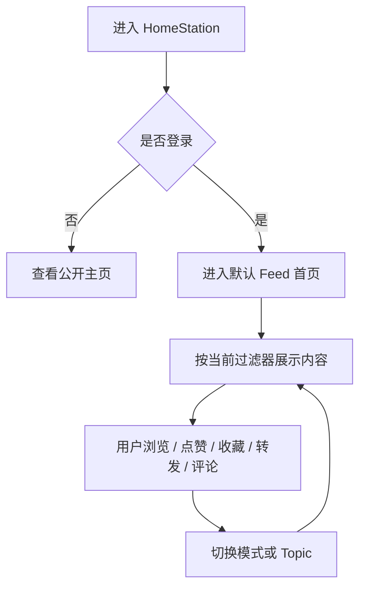
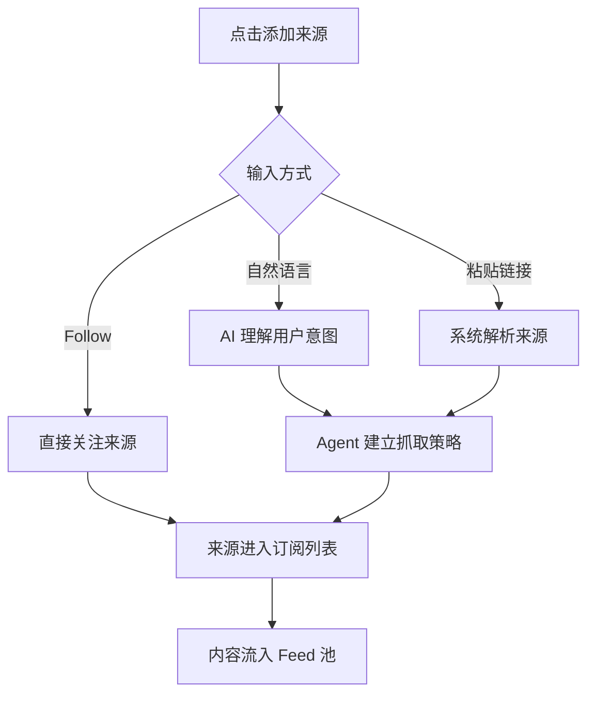
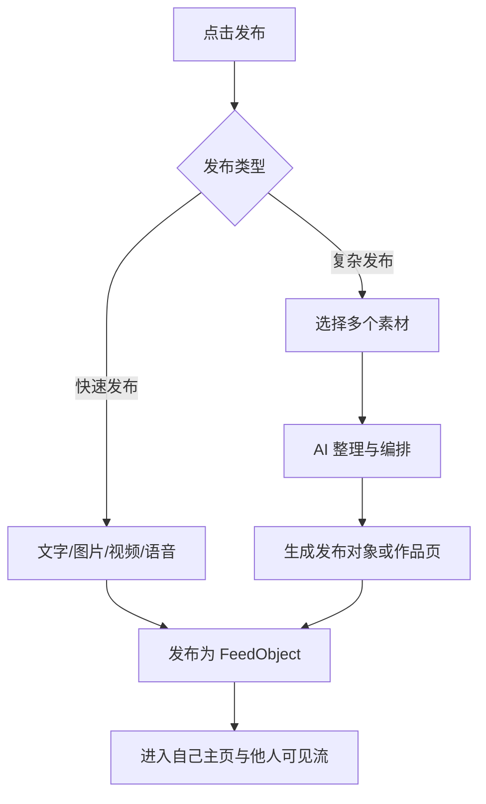

# BuckyOS HomeStation 产品原型设计

> 基于语音记录整理。本文在不改变原始意图的前提下，对口述中的概念、页面、交互与产品边界进行了结构化归纳，聚焦 **产品原型设计** 与 **用户体验设计**，不展开底层实现细节。

---

## 0. 文档信息

- **产品名称**：BuckyOS HomeStation
- **别名**：Home / 默认个人首页 / FeedList
- **产品定位**：BuckyOS 用户创建个人空间后的默认首页
- **目标形态**：AI Native 时代的个人门户 + 通用 Feed 流阅读与发布入口
- **优先级**：移动优先，同时兼顾桌面端高信息密度体验
- **域名形态**：可挂载于 `home`、个人域名及 `www` 等默认入口

---

## 1. 产品定义

HomeStation 是 BuckyOS 中用户创建个人空间后的默认首页，也是整个系统最核心的默认入口。

它本质上不是传统意义上的“个人主页”，也不是单一内容平台，而是一个 **AI Native 的个人首页 + Feed 聚合系统**：

1. 对外，它像一个公开的个人站点，展示用户已发布的内容；
2. 对内，它是用户自己的默认信息流首页，用于持续阅读、筛选、互动和发布内容；
3. 它既承接 BuckyOS 生态内的内容，也尽可能兼容旧世界的内容来源；
4. 它不是某一种媒体的阅读器，而是统一承载短文本、长文、图片、视频、商品、主题聚合信息等内容类型。

一句话定义：

> **HomeStation 是 BuckyOS 在 AI 时代的默认个人入口，用一个统一的 FeedList，承接“看、筛、发、转、评、交易、创作”全链路体验。**

---

## 2. 设计目标

### 2.1 业务目标

- 成为用户进入 BuckyOS 后的第一默认页面
- 成为用户管理个人内容、信息来源与阅读偏好的中心
- 成为 AI 驱动的信息聚合、过滤与分发入口
- 成为个人发布内容、构建作品与承接交易的默认出口

### 2.2 用户目标

- 用一个首页看完自己关心的所有内容
- 不再因内容类型不同而切换多个 App
- 明确知道“为什么会看到这些内容”
- 可以直接控制信息过滤逻辑，而不只是被动接受平台算法
- 可以轻量发布，也可以构建复杂内容与作品

### 2.3 体验目标

- **移动优先**：默认适合单手刷、单指滑、快速反馈
- **统一但不单调**：同一个 Feed 框架下支持多种阅读模式
- **可解释**：推荐与过滤逻辑对用户可见、可控
- **弱平台感**：平台不垄断流量，内容尽量回到原始信源与作者自己的页面
- **无广告默认**：默认不投放广告；若出现广告，必须明确由用户选择并可获得收益

---

## 3. 核心设计原则

### 3.1 Feed First

HomeStation 的第一原则是 FeedList。无论是个人动态、订阅内容、评论、转发、商品信息还是主题更新，统一进入 Feed 模型。

### 3.2 收集与过滤分离

与传统平台的根本区别在于：

- **信息收集层**：尽可能广地拉取信息
- **信息筛选层**：根据场景、过滤器、目标与阅读模式进行组织与展示

也就是说，BuckyOS 不把“抓什么”和“给用户看什么”绑死在一起。

### 3.3 同源内容，多态呈现

同一条内容，不应只被一种展示方式绑定。系统应允许在不同场景中以不同 Reader / 模式被消费：

- 标准 Feed 模式
- 读图模式
- 长文模式
- 沉浸式视频模式
- 详情页模式
- 特定主题 Dashboard 模式

### 3.4 用户控制感可见

用户不仅要能刷，还要在界面上理解：

- 这条内容来自哪里
- 为什么会看到它
- 当前是哪组过滤器在生效
- 可以怎样快速改变当前内容流

### 3.5 创作不受平台形态限制

复杂内容的本质不只是“发一条帖子”，而是构建一个内容对象，甚至是一整个网页。HomeStation 要支持从轻量发帖到复杂作品发布的完整梯度。

---

## 4. 用户角色与使用场景

### 4.1 用户角色

1. **访客**：未登录或访问他人 HomeStation 的用户
2. **站主 / 账号拥有者**：登录后查看自己的默认首页并进行管理
3. **关注者**：订阅某个用户、主题、群组或频道的用户
4. **内容创作者**：发布简单动态、二创内容、复杂作品的用户
5. **交易参与者**：通过 Feed 发现商品并进入独立交易页的用户

### 4.2 核心使用场景

#### 场景 A：访客查看某个用户的公开主页

像访问个人网站一样查看该用户已发布内容、精选内容、作品与商品。

#### 场景 B：用户登录后查看自己的默认首页

像“看自己的朋友圈 + 看世界动态”一样，按时间线或过滤方式浏览大量不同来源的内容。

#### 场景 C：用户切换阅读模式

同样的信息流，用户可以快速切换到读图、长文、沉浸式视频等模式。

#### 场景 D：用户添加信息来源

通过 Follow、Join、粘贴链接或自然语言描述，告诉系统“我想看什么”。

#### 场景 E：用户在 Feed 中原地互动

进行点赞、点踩、收藏、稍后再看、转发、评论等动作。

#### 场景 F：用户发布内容

快速发一个想法、一张图、一段视频；或从已有素材中组织成更复杂的原创内容。

#### 场景 G：用户围绕某个 Topic 深入查看

从 Feed 中进入主题 Dashboard，例如股票、二手商品、本地新闻、某个群组热点等。

#### 场景 H：用户查看详情页并进行深交互

进入长文详情、高清图片查看器、长视频详情页、商品购买页等。

---

## 5. 产品概念模型

### 5.1 FeedObject

系统中的基础内容单元，可理解为一条 Feed / 一段内容 / 一个消息对象的可消费版本。

可能包含：

- 文本
- 图片
- 视频
- 链接
- 元数据
- 作者信息
- 来源信息
- 交互状态
- 指向原始页面的 URL

### 5.2 Source（信息源）

用户订阅和系统抓取的最小来源单位。

来源可能包括：

- BuckyOS 生态内个人服务器 / Personal Source
- DID 身份对应的可信信源
- 传统世界的平台账号、网站、RSS、频道、话题页等
- AI Agent 根据自然语言意图持续维护的抓取结果

### 5.3 Filter（过滤器）

影响当前 FeedList 展示结果的一组规则。

可分为两层：

- **推荐类过滤器**：帮助用户从大量内容中挑出更 relevant 的内容
- **限制类过滤器**：排除不想看的内容，例如仅看视频 / 仅看新闻 / 静音某类内容

### 5.4 Target（快捷目标）

用户更容易理解的快捷筛选入口，本质上是一组预设过滤器。

示例：

- 只看视频
- 只看图片
- 只看新闻
- 只看已关注的人
- 只看某个 Topic

### 5.5 Reader / 详情页

某些内容适合在 Feed 中原地消费，某些内容适合进入更丰富的查看器或详情页中消费。

Reader 可以是：

- 系统默认 Reader
- 内容类型专属 Reader
- 作者推荐 Reader
- 用户自行安装 / 选择的第三方 Reader

---

## 6. 整体信息架构

```text
HomeStation
├── 公开主页（访客视角）
├── 默认首页（登录视角）
│   ├── FeedList
│   ├── 过滤器 / Target 区
│   ├── Topic 区
│   ├── 互动动作区
│   └── 快速发布入口
├── 阅读模式切换
│   ├── 标准模式
│   ├── 读图模式
│   ├── 长文模式
│   └── 沉浸式视频模式
├── 详情页系统
│   ├── 长文详情
│   ├── 图片详情
│   ├── 长视频详情
│   ├── 商品详情/交易页
│   └── 作品页 / 自定义网页
├── 信息源管理
│   ├── Follow / Join
│   ├── 粘贴链接
│   └── 自然语言添加
└── 创作系统
    ├── 快速发布
    ├── 二创（转发 / 引用 / 评论）
    ├── 复杂内容组合发布
    └── 作品级页面发布
```

---

## 7. 核心阅读体验设计

## 7.1 两种基础视角

### A. 公开视角（别人看我）

当用户未登录，或访问他人的 HomeStation 时，页面更接近“个人网站”：

- 展示站主已发布内容
- 展示站主的作品、精选、商品、主题等
- 以公开内容为主，不混入访问者自己的订阅内容

### B. 默认视角（自己看自己）

用户登录后进入自己的 HomeStation 默认页：

- 可看到自己的内容
- 也可看到来自不同信息源的大量外部内容
- 默认按时间线或当前过滤策略进行组织
- 更接近 Facebook / Threads 风格的综合 Feed 流

### 7.2 默认阅读模式：标准模式（Mixed Feed）

默认模式建议采用相对中庸的综合流样式：

- 信息密度适中
- 文本、图片、视频、链接混合展示
- 适合持续滚动阅读
- 兼顾移动端与桌面端

该模式承担“无脑刷”的核心体验，是绝大多数用户进入 HomeStation 后的第一视觉。

### 7.3 读图模式（Image First）

适用于图片主导内容：

- 优先放大图片展示面积
- 移动端尽量让图片接近满屏
- 桌面端以更美观的栅格与大图阅读方式组织
- 图片组内容支持横向滑动
- 适合摄影、生活、商品展示、灵感流等场景

### 7.4 长文模式（Long-form First）

适用于用户想安静阅读长内容的场景：

- 默认压低干扰信息
- 强化正文摘要、文章来源、阅读时长与展开入口
- 允许默认联动某些过滤器，例如临时屏蔽大量短视频或噪声内容
- 可切入详情页进行深度阅读

### 7.5 沉浸式视频模式（Immersive / TikTok 模式）

适用于视频主导场景：

- 上下滑切换内容
- 当前视窗中的视频自动播放
- 非当前内容不自动播放
- 支持背景音与 AI 配音
- 对非视频内容进行适配：
  - 图片内容可作为沉浸式视觉卡片浏览
  - 长文内容可被切为适合手机阅读的分页卡片，左右滑动阅读

此模式体现 HomeStation 的 AI Native 优势：

> 原始内容可以不是“短视频”，但系统可以在阅读前对其进行二次加工，使其适配沉浸式消费场景。

### 7.6 同内容跨模式消费

HomeStation 不是让用户去不同 App 看不同内容，而是让用户在一个系统里：

- 同样订阅一批来源
- 通过不同模式消费同样的信息池
- 用 AI 对不同内容类型做不同程度的预处理和适配

---

## 8. 信息过滤与推荐体系

## 8.1 产品核心差异

HomeStation 与传统平台的最大差异，不是“有没有推荐算法”，而是：

- 推荐与过滤机制对用户可见
- 内容收集与内容展示分离
- 用户可以显式控制过滤器，而不是只能通过 Like / Unlike 间接影响算法

## 8.2 过滤层结构

### 第一层：推荐

从海量内容中挑出更可能适合当前用户和当前场景的内容。

### 第二层：过滤

主动排除用户不想看的内容，例如：

- 只看某一类媒体类型
- 只看某个 Topic
- 不看广告
- 临时屏蔽长文 / 短视频 / 图片流
- 静音某些来源或信号

## 8.3 界面表达方式

为了让用户理解“为什么会看到这些内容”，建议在界面中始终显示：

- 当前模式：标准 / 读图 / 长文 / 视频
- 当前 Target：例如“只看视频”“新闻”“朋友动态”
- 当前关键过滤器：例如“已隐藏广告”“优先已关注来源”“本地内容加强”
- 每条内容的来源与推荐原因简述

### 推荐理由展示示例

- 因你关注了该作者
- 因你最近经常阅读该 Topic
- 因这是你订阅的关键词结果
- 因该内容符合当前“只看新闻”过滤器

## 8.4 广告原则

- 默认无广告
- 若未来引入广告，用户必须显式开启
- 开启广告意味着用户能够获得明确收益分成
- 广告本身也应作为一种可见、可关闭、可理解的过滤器

---

## 9. 信息源订阅与管理

## 9.1 用户如何添加信息源

HomeStation 中“添加信息源”是一个核心入口。

支持四种方式：

### 方式 A：直接 Follow

在系统内对人、组织、频道、Group、Channel 进行直接关注。

### 方式 B：粘贴链接

用户贴入某个平台账号地址、网页地址、RSS、内容页地址，由系统尝试解析并建立持续抓取。

### 方式 C：自然语言订阅

用户用一句话表达需求，例如：

- 我想看川普的最新动态
- 我想关注旧金山本地科技新闻
- 我想跟踪某只股票的全部信息

系统由 AI Agent 自主理解信息目标，并持续维护抓取策略，而不是只做一次性解析。

### 方式 D：加入 Topic / Group / Channel

用户并不是总想关注“某个人”，也常常想关注“某类信息集合”。

## 9.2 来源可信度与可见性

每条 Feed 都必须尽量展示来源信息：

- 来源名称
- 来源类型（DID / 平台抓取 / 聚合结果 / Topic）
- 可验证状态（如签名可信）
- 原始出处入口

BuckyOS 内部默认更信任基于 DID、公钥与签名可验证的 Personal Source；
旧世界信源则通过抓取与映射接入。

## 9.3 AI Native 抓取网络

“自然语言添加信息源”不是一次性搜索，而是持续性的 Agent 行为：

- 用户表达想看什么
- Agent 研究可用来源
- Agent 定期更新抓取策略
- Agent 持续将结果流入 Feed 池

这构成一个 AInative 驱动的信息获取网络。

---

## 10. 互动体系设计

HomeStation 的互动分为三个层级，从轻到重递进。

## 10.1 一级互动：即时动作

特点：

- 点击后快速生效
- 低成本、低干扰
- 多数在原地完成

包含：

- 点赞
- 点踩
- 收藏
- 稍后再看
- 屏蔽 / 减少类似内容

### 可见性差异

这类动作应区分“作者是否感知”：

- 点赞：通常沿原传播路径反馈，作者可感知
- 收藏：默认不要求作者感知
- 稍后再看：仅用户自己可见

## 10.2 二级互动：传播动作

特点：

- 会影响别人看到我的界面
- 具备扩散性
- 建议默认二次确认

包含：

- 转发
- 引用转发
- 带理由的分享

逻辑上，转发本质是传播行为：

> 我在我的订阅流里看到了内容，转发之后，订阅我的人也可能看到这条内容。

## 10.3 三级互动：评论与二次创作

原则：

- 任何内容都可以评论
- 评论不仅是附属字段，也是一种可进入 Feed 的内容对象
- 评论可视为一种标准化二创

评论来源可能有两个路径：

1. 原始内容源自己提供评论列表
2. 独立评论节点 / 评论中心提供评论聚合

评论应带签名，不易伪造，并可被用户发布在自己的 Personal Source 中，从而成为自己的公开内容资产。

---

## 11. Topic 与 Dashboard 设计

## 11.1 Topic 的意义

并不是所有信息都适合只以单条 Feed 来理解。有些信息更适合围绕“主题”被组织。

典型主题：

- 股票 / 金融标的
- 本地新闻
- 二手商品
- 某个事件
- 某种兴趣圈层

## 11.2 Topic 的来源

Topic 可来自两类：

- **用户主动关注**：用户明确订阅的主题
- **系统自动总结**：系统根据近期内容、阅读历史与互动行为自动归纳出的主题

## 11.3 Topic 在界面中的位置

### 移动端

- 以顶部切换条 / 横向 Topic Chips 形式出现
- 适合快速切换当前兴趣上下文

### 桌面端

- 以左侧 Topic 导航栏形式出现
- 配合更高的信息密度展示更多主题入口

## 11.4 Topic Dashboard

点击某个 Topic 后，不只是进入“筛选后的 Feed 列表”，还可进入一个更完整的 Dashboard：

- 时间线更新
- 相关来源列表
- 重要事件节点
- 历史汇总
- 图表 / 结构化信息
- AI 总结
- 与该 Topic 相关的商品、内容、评论和互动

### 示例：股票 Topic Dashboard

- 实时相关新闻流
- 财报发布时间线
- 历史价格与分红曲线
- 来自不同来源的观点汇总
- 用户自己关注的买入点/标记点

### 示例：二手商品 Topic Dashboard

- 来自朋友和附近来源的二手发布流
- 商品分类筛选
- 最近价格区间
- 卖家来源与信用提示

---

## 12. 详情页与 Reader 系统

## 12.1 为什么需要详情页

虽然 Feed 的核心价值是“原地浏览”，但仍有一些内容天然更适合进入详情页：

- 特别长的文章
- 需要放大查看的高清图片
- 长视频
- 商品
- 作品级内容
- 含复杂交互逻辑的内容

## 12.2 详情页类型

### A. 内容查看型详情页

用于更舒适地消费内容：

- 长文详情页
- 图片查看器
- 长视频播放器
- 图文混合阅读器

### B. 交互型详情页

用于完成操作与任务：

- 商品购买页
- 服务预约页
- 活动报名页
- 复杂作品页
- 作者自定义交互网页

## 12.3 Reader 可扩展原则

HomeStation 是 WebApp，内容查看方式可以被控制和扩展。

例如：

- 某些长视频可通过专门的 Reader 叠加字幕评论
- 某些内容适合作者指定推荐 Reader
- 用户也可以自行安装更适合自己的 Reader

## 12.4 作者原始页优先原则

对于商品、复杂作品和强交互内容：

- Feed 中只承载摘要 + 元数据 + URL
- 点击后优先进入作者自己的原始页面
- 平台不强行把所有交互包在统一模板内

这体现 HomeStation 的一项核心理念：

> 平台负责让内容流转，不负责垄断所有内容的最终交互页面。

---

## 13. 电商与交易场景设计

电商是 HomeStation 生态中的重要场景，但不应继续沿袭传统“平台控制流量入口”的逻辑。

## 13.1 商品也是一种高价值 FeedObject

商品信息应被视为一种标准内容对象：

- 可出现在 Feed 中
- 可被订阅、推荐、过滤、转发、评论
- 可进入独立详情页完成交易

## 13.2 商品详情页原则

商品不只是“一个卡片”，而应拥有自己的独立页面，通常位于发布者自己的 HomeStation / Personal Source 上。

页面可承载：

- 商品图片与视频
- 规格与元数据
- 价格与库存
- 购买方式
- 联系方式
- 信用与担保机制说明

## 13.3 平台角色变化

HomeStation 体系中，平台不应垄断流量分发入口；
若有中介角色，也更接近：

- 交易担保
- 信用服务
- 配送/履约服务
- 风险控制服务

而不是传统的“流量税平台”。

---

## 14. 内容发布与创作设计

内容发布分为两个阶段：

1. **快速发布**：轻量、碎片、即时
2. **复杂构建**：多素材、多对象、可组织、可生成作品页

## 14.1 快速发布

入口：主页底部或顶部的「+」按钮。

支持：

- 发一句话
- 发图片
- 发视频
- 录语音
- 快速分享当前想法

特点：

- 低门槛
- 快速完成
- 几乎不要求复杂排版
- 强调“立刻发出来”

## 14.2 全系统可二创

BuckyOS 体系中，几乎所有 URL / MessageObject 都应能快速转换为可发布的 FeedObject。

即：

- 在 MessageHub 里看到的内容可一键转发到 HomeStation
- 在系统任何地方看到的内容都可引用、评论、再发布
- 二创不局限于某个 App 内部

## 14.3 素材组合式原创

用户并不总是直接写一篇长文，更常见的真实创作过程是：

- 拍了几张图
- 录了一段视频
- 写了几段文字
- 收藏了几条灵感
- 再将它们组合成一次发布

HomeStation 应支持“先形成内容文件夹，再让 AI 帮助整理”的创作路径。

### 典型例子：分享一道菜

用户可能会先产生这些碎片素材：

- 备菜照片
- 烹饪视频
- 做法文字
- 完成品图片
- 个人心得

这些素材先作为多个 FeedObject 存在，再被组织为一个更完整的发布对象；
系统可由 AI 帮助整理为：

- 图文混排内容
- 结构化步骤页
- 短视频切片
- 一个完整的料理作品页

## 14.4 作品级内容发布

严格意义上的“作品”不应受平台模板严格限制。

在 HomeStation 中，作品发布的本质是：

> **为某个内容构建一个网页，并将其以 metadata + URL 的形式接入 Feed 系统。**

这意味着：

- 作品的展示形式几乎无限
- 作者可以借助 AI 生成与内容高度匹配的页面
- Feed 只负责分发作品入口
- 真正的体验发生在作品页本身

## 14.5 平台与创作生态分工

平台侧重点不在于做一个覆盖所有创作形态的超重编辑器，而在于：

- 提供标准发布协议
- 接纳 `metadata + URL`
- 让作品在生态内流转
- 让用户自由选择创作工具与 Agent 辅助工具

---

## 15. 原型页面设计

下面定义 MVP 阶段建议优先设计的关键页面。

## P1. 移动端默认首页（登录态）

### 页面目标

承担“刷内容”的最高频入口。

### 页面结构

```text
[顶部栏]
- HomeStation 标题 / 个人头像
- 搜索
- 模式切换

[Filter / Target 横向条]
- 全部
- 朋友
- 新闻
- 图片
- 视频
- 长文
- Topic...

[FeedList]
- Feed 卡片
- 来源信息
- 推荐原因
- 内容摘要 / 图片 / 视频预览
- 互动按钮

[悬浮发布按钮]
- + 发布

[底部导航]
- Home
- Topics
- Publish
- Sources
- Me
```

### 卡片最小信息结构

- 作者 / 来源
- 时间
- 当前内容类型标识
- 正文摘要
- 媒体预览
- 推荐/过滤理由
- 点赞/点踩/收藏/转发/评论

### 关键交互

- 上下滑浏览
- 左右滑切换部分 Target / Topic
- 长按内容出现更多过滤动作
- 点击来源进入来源页
- 点击推荐原因查看当前过滤器说明

---

## P2. 公开主页（访客态）

### 页面目标

让 HomeStation 兼具个人站点属性。

### 页面结构

```text
[用户头图 / 头像 / 简介]
[公开内容 Tab]
- 发布
- 作品
- 商品
- 精选
[内容列表]
```

### 特点

- 只展示公开内容
- 不混入访问者自己的订阅 Feed
- 更强调个人身份、作品与主页感

---

## P3. 桌面端默认首页

### 页面目标

利用更大屏幕呈现更高信息密度与更完整控制面板。

### 页面结构

```text
[左侧栏]
- 个人入口
- Topics
- Sources
- 收藏 / 稍后再看

[中间主列]
- FeedList

[右侧栏]
- 当前过滤器
- 推荐原因说明
- 趋势 Topic
- 快捷发布
```

### 特点

- 更适合多 Topic 同时可见
- 适合金融、本地信息、电商等高信息密度场景
- 可呈现 Dashboard 入口与上下文辅助信息

---

## P4. 沉浸式视频模式

### 页面目标

提供 TikTok 风格的沉浸式消费体验。

### 页面结构

```text
[全屏内容区]
- 视频 / 图片 / 分页文章卡

[右侧动作条]
- 点赞
- 评论
- 收藏
- 转发

[底部信息区]
- 来源
- 标题 / 摘要
- AI 配音 / 背景音控制
```

### 关键交互

- 上下滑切换内容
- 左右滑浏览图片组或文章分页
- 自动播放仅限当前卡片
- 音频开关与配音选择

---

## P5. Topic Dashboard

### 页面目标

从“刷单条内容”升级到“理解一个主题”。

### 页面结构

```text
[Topic 头部]
- Topic 名称
- 关注状态
- 过滤器
- 摘要

[概览区]
- 关键指标 / 图表 / AI 总结

[时间线区]
- 最新相关 Feed

[来源区]
- 相关来源列表

[行动区]
- 添加提醒
- 调整过滤器
- 进入详情页 / Reader
```

---

## P6. 内容详情页 / Reader

### 页面目标

承接长内容、高清图、长视频与复杂内容的深度阅读。

### 关键设计要点

- 与 Feed 保持来源连续性
- 支持评论与转发
- 允许切换 Reader
- 对复杂内容优先支持跳转原始页

---

## P7. 快速发布面板

### 页面目标

让用户以最低门槛创建内容。

### 页面结构

```text
[发布面板]
- 文字
- 拍照
- 视频
- 语音
- 从已有素材选择
- 从剪贴板/URL导入
```

### 关键设计要点

- 默认轻编辑
- 支持一键发出
- 也支持“继续整理为复杂内容”

---

## P8. 信息源添加页

### 页面目标

降低“我想看什么”的表达成本。

### 页面结构

```text
[输入框]
- 贴链接
- 输入一句话

[推荐来源]
- 常见人物 / 频道 / Topic

[解析结果]
- 可抓取来源
- 来源可信度
- 预计更新方式
```

### 示例输入

- 我要看川普最近都在发什么
- 关注这个推特账号
- 我想看旧金山本地二手商品

---

## 16. 关键流程

## 16.1 默认阅读流程



## 16.2 添加信息源流程



## 16.3 发布内容流程



---

## 17. 关键组件说明

## 17.1 Feed 卡片组件

每个 Feed 卡片建议包含以下固定区域：

- 来源区：作者、来源、可信状态、时间
- 内容区：标题/摘要/媒体预览
- 理由区：为什么推荐 / 当前过滤命中说明
- 动作区：点赞、点踩、收藏、转发、评论、更多

## 17.2 过滤器条组件

用于承载当前上下文的快速切换：

- 模式切换
- Target 切换
- Topic 切换
- 广告开关
- 内容类型开关

## 17.3 来源标签组件

用于强调“信息来自哪里”：

- Personal Source
- DID 已验证
- 外部平台抓取
- Topic 聚合
- Agent 生成摘要

## 17.4 解释性标签组件

用于让算法可见：

- 因关注而推荐
- 因最近常读而推荐
- 因当前过滤器而展示
- 因你订阅的关键词命中

---

## 18. MVP 范围建议

### 18.1 必做

- 登录态默认 Feed 首页
- 访客态公开主页
- 标准模式 + 沉浸式视频模式
- 基础 Feed 卡片
- 基础互动：点赞、收藏、转发、评论
- 基础过滤器：全部 / 图片 / 视频 / 长文 / 已关注
- 信息源添加：Follow + 粘贴链接 + 自然语言输入
- Topic 基础入口
- 快速发布
- 长文 / 图片 / 视频基础详情页

### 18.2 第二阶段

- Topic Dashboard 深化
- 广告收益开关
- Reader 插件化
- 评论聚合节点接入
- 商品独立交易页模板
- 复杂内容整理发布
- 作者推荐 Reader

### 18.3 第三阶段

- 作品级页面生成器
- Agent 自动生成复杂展示页
- 交易担保机制
- 更完整的主题模板市场
- 生态 App 接入标准化

---

## 19. 设计风险与待确认问题

### 19.1 待确认问题

1. 默认首页中“自己内容”与“外部订阅内容”的混合比例如何设定？
2. 公开主页是否默认展示作品、商品与精选分栏？
3. 沉浸式模式中，长文分页阅读的默认切片规则由谁定义？
4. 评论聚合节点的默认来源是否由系统内置？
5. Topic 是否允许用户自己创建并公开分享？
6. 商品详情页是否需要统一的信用/担保 UI 规范？
7. 桌面端右侧信息面板显示哪些最关键的算法解释信息？

### 19.2 风险点

- 信息源过多后，过滤器复杂度可能显著上升
- 多阅读模式若切换成本高，可能打断连续消费体验
- 自然语言订阅虽然强大，但结果解释必须足够清晰
- 作品页高度自由，可能导致内容质量与一致性参差不齐
- 交易页去平台化后，需要补足信用与担保体验

---

## 20. 总结

HomeStation 不是一个传统社交平台首页，也不是一个纯 RSS 阅读器，更不是单一媒体的内容分发应用。

它是 BuckyOS 中面向 AI Native 时代的默认个人入口，核心价值在于：

- 用一个统一的 Feed 系统承接所有内容类型
- 把信息获取和信息筛选明确拆开
- 让用户真正看见并控制自己的内容流
- 用多模式阅读取代多个 App 的切换成本
- 让复杂内容回归作者自己的页面与能力边界
- 让发布从碎片表达一路延展到作品级创作

最终，HomeStation 应该成为：

> **用户在 BuckyOS 中“看世界、看自己、表达自己、经营自己”的默认起点。**

